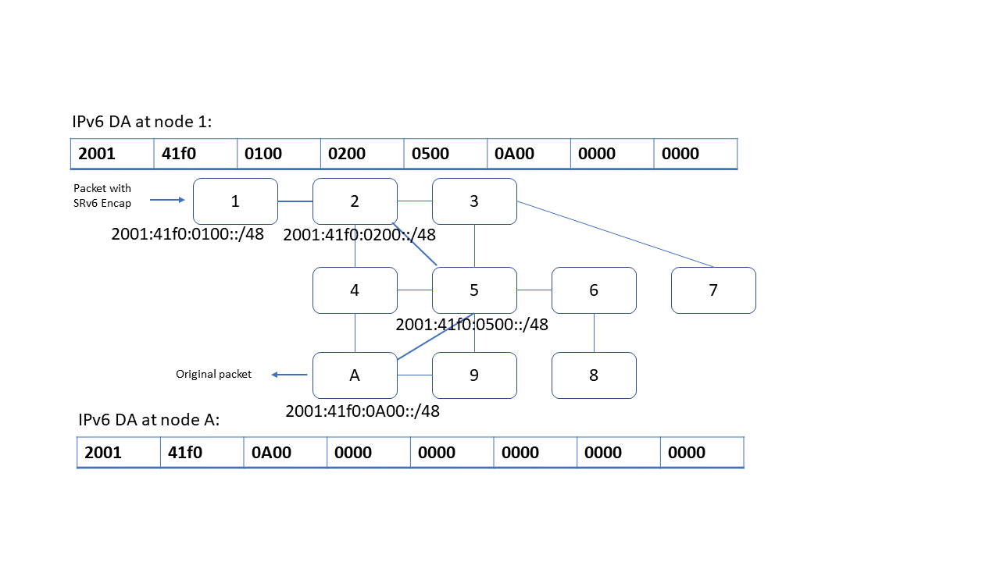

# SONiC uSID

## Table of Content
- [Overview](#Overview)
- [Scope](#Scope)
- [Design](#Design)
- [Example](#Example)

## Revision

| Rev  |   Date    |              Author              | Change Description           |
| :--: | :-------: | :------------------------------: | :--------------------------: |
| 0.1  | 7/17/2022 | Shitanshu Shah, Reshma Sudarshan |  Initial version             |
| 0.2  | 7/24/2022 | Shitanshu Shah, Reshma Sudarshan |  Incorporate review comments |

## Overview
SRv6 uSID (micro-segment) is extension of the SRv6 network programming model, refer to IETF drafts [Compressed SRv6 Segment List Encoding]( draft-ietf-spring-srv6-srh-compression-02) and [SRv6 uSID instructions IETF draft](https://datatracker.ietf.org/doc/draft-filsfils-spring-net-pgm-extension-srv6-usid/). uSID is a compressed SID value which can be for example carried in 16-bits (unlike full IPv6 address to represent a SID). uSID as is designed scales well with much lower MTU overhead required per uSID carrier. uSID carrier is 128-bit IPv6 address that can carry upto 6 uSIDs [Refer to Example for more details]

## Scope
The scope of this document is to enhance orchagent to support uSID programming instructions in this IETF draft. Current SAI API definitions already support uSID instructions. No SAI API change required in scope of this document. Current version of routing protocols in SONiC does not support SRv6, it is not in the scope of this document to add such a support for FRR routing stack.

## Design
Current srv6orch is designed, per [SRv6 HLD](https://github.com/sonic-net/SONiC/blob/master/doc/srv6/srv6_hld.md), to support SRv6 programming instructions as described in RFC 8754 and RFC 8986. This design extends SRv6 Network Programming with a new type of SRv6 SID behaviors defined as uSID.

SRv6 uSID fully leverages current SRv6 control-plane, without any change, as is implemented by srv6orch.
Following uSID behaviors are added,
uN  - uN behavior is implemented with PSP and USD flavor
uA  - uA local behavior is implemented with PSP and USD flavor
uDT - uDT local behavior is implemented exactly same as that of End.DT4/End.DT6
uDX - uDX local behavior is implemented exactly same as that of End.DX4/End.DX6

PSP and USD end behavior flavors are already supported by SAI API today. End.DT4/6 and End.DX4/6 end behaviors are supported by SAI APIs as well. Thus there is no additional change required in SAI to support uN, uA, uDT and uDX behaviors.

Changes in orchagent,
- While processing MYSID entries, from SRV6_MY_SID_TABLE off of APPDB, handling of new actions uN, uA, uDT and uDX added in srv6orch. No APPDB schema changes required.
- SAI end behavior and end behavior flavor are determined, before calling SAI APIs, to program MYSID entries

```text
const map<string, sai_my_sid_entry_endpoint_behavior_t> end_behavior_map =
{
    {"end",                SAI_MY_SID_ENTRY_ENDPOINT_BEHAVIOR_E},
    {"end.x",              SAI_MY_SID_ENTRY_ENDPOINT_BEHAVIOR_X},
    {"end.t",              SAI_MY_SID_ENTRY_ENDPOINT_BEHAVIOR_T},
    {"end.dx6",            SAI_MY_SID_ENTRY_ENDPOINT_BEHAVIOR_DX6},
    {"end.dx4",            SAI_MY_SID_ENTRY_ENDPOINT_BEHAVIOR_DX4},
    {"end.dt4",            SAI_MY_SID_ENTRY_ENDPOINT_BEHAVIOR_DT4},
    {"end.dt6",            SAI_MY_SID_ENTRY_ENDPOINT_BEHAVIOR_DT6},
    {"end.dt46",           SAI_MY_SID_ENTRY_ENDPOINT_BEHAVIOR_DT46},
    {"end.b6.encaps",      SAI_MY_SID_ENTRY_ENDPOINT_BEHAVIOR_B6_ENCAPS},
    {"end.b6.encaps.red",  SAI_MY_SID_ENTRY_ENDPOINT_BEHAVIOR_B6_ENCAPS_RED},
    {"end.b6.insert",      SAI_MY_SID_ENTRY_ENDPOINT_BEHAVIOR_B6_INSERT},
    {"end.b6.insert.red",  SAI_MY_SID_ENTRY_ENDPOINT_BEHAVIOR_B6_INSERT_RED},
+    {"udx6",               SAI_MY_SID_ENTRY_ENDPOINT_BEHAVIOR_DX6},
+    {"udx4",               SAI_MY_SID_ENTRY_ENDPOINT_BEHAVIOR_DX4},
+    {"udt6",               SAI_MY_SID_ENTRY_ENDPOINT_BEHAVIOR_DT6},
+    {"udt4",               SAI_MY_SID_ENTRY_ENDPOINT_BEHAVIOR_DT4},
+    {"udt46",              SAI_MY_SID_ENTRY_ENDPOINT_BEHAVIOR_DT46},
+    {"un",                 SAI_MY_SID_ENTRY_ENDPOINT_BEHAVIOR_UN},
+    {"ua",                 SAI_MY_SID_ENTRY_ENDPOINT_BEHAVIOR_UA}
};

const map<string, sai_my_sid_entry_endpoint_behavior_flavor_t> end_flavor_map =
{
    {"end",                SAI_MY_SID_ENTRY_ENDPOINT_BEHAVIOR_FLAVOR_PSP_AND_USD},
    {"end.x",              SAI_MY_SID_ENTRY_ENDPOINT_BEHAVIOR_FLAVOR_PSP_AND_USD},
    {"end.t",              SAI_MY_SID_ENTRY_ENDPOINT_BEHAVIOR_FLAVOR_PSP_AND_USD},
+    {"un",                 SAI_MY_SID_ENTRY_ENDPOINT_BEHAVIOR_FLAVOR_PSP_AND_USD},
+    {"ua",                 SAI_MY_SID_ENTRY_ENDPOINT_BEHAVIOR_FLAVOR_PSP_AND_USD}
};
```

## Example
uSID carrier is 128-bit IPv6 address which is specified in following format:
```text
<uSID-Block><Active-uSID><Next-uSID>...<Last-uSID><End-of-Carrier>[...<End-of-Carrier>]
```
- uSID Block:     An IPv6 prefix (defines a block of SRv6 uSIDs)
- Active uSID:    The first uSID
- Next uSID:      The next uSID after the Active uSID.
- Last uSID:      The last uSID in the carrier before the End-of-Carrier
- End-of-Carrier: A globally reserved uSID that marks the end of a uSID list. The End-of-Carrier ID is 0000. As many End-of-Carriers as required to complete full 128-bits IPv6 address



- uSID block:  2001:41f0
- Active uSID: 0100
- Next uSID:   0200
- Last uSID:   0A00
- 2 End-of-Carriers (0000) to complete full 128-bits IPv6 address

A node with local uSID of 2001:41f0:0100 is to be programmed with following SRV6_MY_SID_TABLE entry, with appropriate uSID end behavior. Following shown two separate examples with 2 different end behaviors.

```text
Note: prefix of "16:8:8:8" is (locator_block_len:locator_node_len:function_len:args_len) as is currently consumed by srv6orch.

If end-behavior "un"
"SRV6_MY_SID_TABLE" : {
    "16:8:8:8:2001:41f0:0100::" : {
       "action": "un",
    }
}

If end-behavior is "udt46"
"SRV6_MY_SID_TABLE" : {
    "16:8:8:8:2001:41f0:0100::" : {
       "action": "udt46",
       "vrf":  "VRF-1001"
    }
}

A node with local uSID of 2001:41f0:0200 is to be programmed with appropriate uSID end behavior, similarly for node with 2001:41f0:0500, and for node with 2001:41f0:0A00
```
