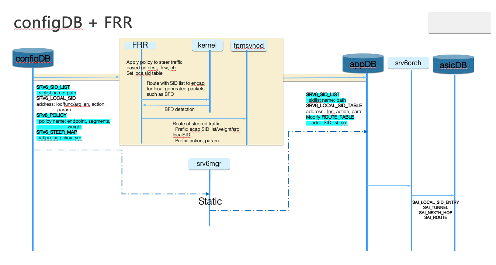
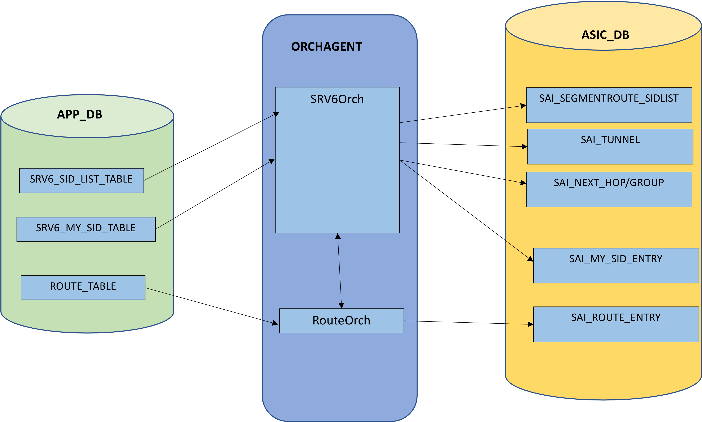
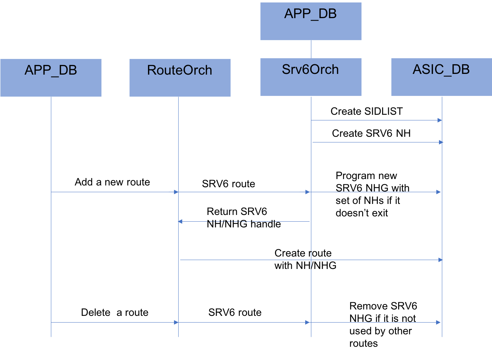

# Segment Routing over IPv6 (SRv6) HLD  

# Table of Contents

- [List of Tables](#list-of-tables)
- [Revision](#revision)
- [Definition/Abbreviation](#definitionabbreviation)
- [About This Manual](#about-this-manual)
- [1 Feature Requirements](#1-feature-requirements)
- [1.1 Functional Requirements](#11-functional-requirements)
- [1.2 Confgiruation and Managment Requirements](#12-configuration-and-management-requirements)
- [1.3 Scalabiliity Requirements](#13-scalability-requirements)
- [1.4 Warm Reboot Requirements](#14-warm-reboot-requirements)
- [2 Feature Design](#2-feature-design)
- [2.1 ConfigDB Changes](#21-configdb-changes)
- [2.2 AppDB Changes](#22-appdb-changes)
- [2.3 Orchestration Agent Changes](#23-orchestration-agent-changes)
- [2.4 SAI](#24-sai)
- [2.5 CLI](#25-CLI)
- [2.6 YANG Model](#26-yang-model )
- [[2.7 Warm Reboot](#27-warm-reboot )
- [3 Unit Test](#3-unit-test)
- [4 References ](#9-references) 

# Revision

| Rev  |   Date   |           Author           | Change Description |
| :--: | :------: | :------------------------: | :----------------: |
| 0.1  | 6/5/2021 | Heidi Ou, Kumaresh Perumal |  Initial version   |
| 0.2  |          |                            |                    |
| 0.3  |          |                            |                    |


# Definition/Abbreviation

### Table 1: Abbreviations

| ****Term**** | ****Meaning**** |
| -------- | ----------------------------------------- |
| BFD  | Bidirectional Forwarding Detection  |
| BGP  | Border Gateway Protocol |
| BSID | Binding SID |
| G-SID  | Generalized Segment Identifier  |
| SID  | Segment Identifier  |
| SRH  | Segment Routing Header  |
| SRv6 | Segment Routing IPv6  |
| TE | Traffic Engineering |
| uSID | Micro Segment |
| VNI  | VXLAN Network Identifier  |
| VRF  | Virtual Routing and Forwarding  |

# About this Manual

This document provides general information about the Segmentation Routing over IPv6 feature implementation in SONiC. It is based on IETF RFC 8754 and RFC 8986.

# 1 Introuduction and Scope

This document describes the Functionality and High level design of the SRv6 feature.

SRv6 has been widely adopted as an IPv6 based SDN solution, which provides programming ability, TE capabilities,  and deployment simplicity to network administrators.  With current support from a rich ecosystem, including major ASIC manufactures,  networking vendors and open source communities, the deployment of SRv6 is accelerating. We want to add SRv6 into SONIC to benefit users in DC as well as beyond DC.  

The following are some use cases for SRv6 deployment:

- v4/6VPN, EVPN over best-effort
- Traffic steering over TE policy 

In SRv6 domain,  TE policy associated with SID list could be configured on headend nodes, to steer traffic with SRH encapsulation. When traffic reaches egress nodes,  the packets are processed based on local defined functions, for example SID list decapsulation and FIB lookup in a particular VRF . 

# 2 Feature Requirements

## 1.1 Functional Requirements

This section describes the SONiC requirements for SRv6 feature in phases:

At a high level the following should be supported:

Phase #1

​	Should be able to perform the role of SRv6 domain headend node, and endpoint node, more specific:

- Support H.Encaps, H.Encaps.Red, END.B6.Encaps, END.B6.Encaps.Red
- Support END, END.X
- Support END.DT46
- Support traffic steering on SID list
- Support anycast SID

Later phases:

- Support uSID/G-SID
- Other programming functions
- Support HMAC option
- Support sBFD for SRv6 

This document will focus on Phase #1, while keep the design extendable for future development

## 1.2 Configuration and Management Requirements

1. User should be able to enable SRv6 globally or per interface

2. User should be able to configure SID list for encapsulation

3. User should be able to configure SRv6 steering policy

4. User should be able to configure endpoint action and corresponding argument for matched local SID

## 1.3 Scalability Requirements

- Maximum number of end.DT46 SID: 2k
- Maximum number  of Binding SID: 1k
- Maximum number of SR policy: 1k
- Maximum SID-list per SR Policy: 4
- Maximum number of SID-list: 4k
- SRH depth with regular SID: 3

## 1.4 Warm Boot Requirements

Warm reboot is intended to be supported for planned system, swss and BGP warm reboot.

 

# 2 Feature Design



Before FRR is ready, we will use static configuration to set SIDs and apply policy for TE. It enables basic SRv6 operation and populates SRv6 into ASIC, allows SRv6 data plan forwarding. More complicated SRv6 policy can be enabled when SRv6 is fully supported in FRR and passed from FRR to fpmsyncd.

## 2.1 ConfigDB Changes

**SRV6_SID_LIST_TABLE**

Description: New table that stores SRv6 SID list configuration.

Schema:

```
; New table
; holds SRv6 SID list

key = SRV6_SID_LIST:segment_name
                     ; SID segment name
; field = value
path = SID,          ; List of SIDs

For example:
    "SRV6_SID_LIST": {
        "seg1": {
            "path": [
                "BABA:1001:0:10::",
                "BABA:1001:0:20:F1::"
            ]
        },
        "seg2": {
            "path": [
                "BABA:1001:0:30::",
                "BABA:1001:0:40:F1::"
            ]
        }
    }
```

**SRV6_LOCAL_SID_TABLE**

Description: New table to hold local SID to behavior mapping

Schema:

```
; New table
; holds local SID to behavior mapping, allow 1:1 or n:1 mapping

key = SRV6_LOCAL_SID:ipv6address
; field = value
block_len = blen             ; bit length of block portion in address, default 40
node_len = nlen              ; bit length of node ID portion in address, default 24
func_len = flen              ; bit length of function portion in address, default 16
arg_len = alen               ; bit length of argument portion in address
action = behavior            ; behaviors defined for local SID
vrf = VRF_TABLE.key          ; VRF name for END.DT46, can be empty
adj = address,               ; Optional, list of adjacencies for END.X
policy = SRV6_POLICY.key     ; Optional, policy name for END.B6.ENCAP
source  = address,           ; Optional, list of src addrs for encap for END.B6.ENCAP
weight  = weight.value,      ; Optional, list of assigned weight

For example:
    "SRV6_LOCAL_SID" : {
       	"BABA:1001:0:20:F1::" : {
           "action": "end.dt46",
           "vrf":  "VRF-1001"
        },
       	"BABA:1001:0:40:F1::" : {
           "action": "end.dt46",
           "vrf":  "VRF-1001"
        },
       	"BABA:1001:0:20:F2::" : {
           "action": "end.x",
           "adj": [
                BABA:2001:0:10::1, 
                BABA:2001:0:10::2
            ],
            "weight": "1,2"
        },
       	"BABA:1001:0:20:F3::" : {
           "action": "end.b6.encap",
           "segment": "seg1"
           "source": "A::1"
        }
    }
```

**SRV6_POLICY_TABLE**

Description: New table that stores SRv6 policy .

Schema:

```
; New table
; holds SRv6 policy

key = SRV6_POLICY:policy_name

; field = value
endpoint = address             ; 
segment = SRv6_SID_LIST.key,   ; List of segment names
weight  = weight.value,        ; List of assigned weight value

For example:
    "SRV6_POLICY": {
        "policy1": {
            "segment": "seg1, seg2",
            "weight": "1, 2"
            },
        "policy2": {
            “endpoint": "BABA:1001:0:40::1"
            "segment": "seg1"
        }
    }
```

**SRV6_STEER_MAP**

Description: New table that stores prefix to policy mapping .

Schema:

```
; New table
; holds prefix to SRv6 SID list encapsulation mapping

key = SRV6_STEER:VRF_NAME:prefix
                               ; Prefix to be steered
; field = value
policy = SRV6_POLICY.key       ; Policy to steer the prefix
source  = address              ; Source addresses for encapsulation

For example:
    "SRV6_STEER": {
        "Vrf-red|11.11.11.0/24": {
            "policy": "policy1"，
            "source": "A::1"
        },
        "Vrf-blue|2001:a::0/64": {
            "policy": "policy2"，
            "source": "A::1"
        }
    }
```

## 2.2 AppDB changes

**New SRV6_SID_LIST_TABLE**

Description: New table to hold SRv6 SID list.

Schema:

```
; New table
; holds SRv6 SID list

key = SRV6_SID_LIST_TABLE:segment_name

; field = value
path = SID,                         ; List of SIDs
```

**New SRV6_LOCAL_SID_TABLE**

Description: New table to hold local SID to behavior mapping

Schema:

```
; New table
; holds local SID to behavior mapping

key = SRV6_LOCAL_SID_TABLE:ipv6address

; field = value
block_len = blen                   ; bit length of block portion in address, default = 40
node_len = nlen                    ; bit length of node portion in address, default = 24
func_len = flen                    ; bit length of function portion in address, default = 16
arg_len = alen                     ; bit length of argument portion in address, default = 0
action = behavior                  ; behaviors defined for local SID
vrf = VRF_TABLE.key                ; VRF name for END.DT46, can be empty
adj = address,                     ; List of adjacencies for END.X, can be empty
segment = SRv6_SID_LIST.key,       ; List of segment names for END.B6.ENCAP, can be empty
source  = address,                 ; List of src addrs for encap for END.B6.ENCAP
weight  = weight.value,            ; List of assigned weight, can be empty
```

**Modify ROUTE_TABLE**

Description: Existing Route Table is extended to add SID list. 

Schema:

```
;Stores a list of routes
;Status: Mandatory

key = ROUTE_TABLE:VRF_NAME:prefix ;
nexthop = prefix,              ; IP addresses separated ',' (empty indicates no gateway). May indicate VXLAN endpoint if vni_label is non zero.
intf = ifindex? PORT_TABLE.key ; zero or more separated by ',' (zero indicates no interface)
vni_label = VRF.vni            ; zero or more separated by ',' (empty value for non-vxlan next-hops). May carry MPLS label in future.
router_mac = mac_address       ; zero or more remote router MAC address separated by ',' (empty value for non-vxlan next-hops)
blackhole = BIT                ; Set to 1 if this route is a blackhole (or null0)
weight = weight_list           ; List of weights
sid = SRV6_STEER_TABLE.key,    ; New optional field. List of SID, separated by ',' 
seg_src = address              ; New optional field. Source addrs for sid encap
```

## 2.3 Orchestration Agent Changes

New Orchagent(SRV6Orch) is created to manage all SRV6 related objects. SRV6Orchagent listens to APP_DB for regular updates and create/update SAI objects in ASIC_DB.  





**SRV6Orchagent**

This orchagent is responsible to create SRV6 related objects in ASIC_DB with the information from APP_DB.


SRV6Orchagent listens to all updates of SRV6_SID_LIST_TABLE to create SAI_SEGMENTROUTE_SIDLIST object with list of V6 prefixes. It also creates a SRV6 Nexthop with the existing SIDLIST object handle. Any update to V6 prefixes to the segment will be pushed to ASIC_DB.


When a route entry is added to ROUTE_TABLE, routeOrchagent calls srv6Orchagent to get the SRV6 nexthop with all associated segment prefixes. If a route entry is referenced by list of ECMP segments, the orchagent creates a ECMP group with already created Nexthop members and pass the ECMP object handle to routeOrchagent. When all route entries referenced by the ECMP groups are deleted, ECMP group object is deleted. 


Orchagent listens to LOCAL_SID_TABLE in APP_DB to create SAI objects in ASIC_DB. For LOCAL_SID's END.X action, this orchagent queries the existing IP NextHop and NextHopGroup database and use the existing object handle and update ASIC_DB. This orchagent creates a new ECMP group when Nexthop exists for all the Nexthop addresses in END.X action and no matching group exists in the DB. For LOCAL_SID's END.DT46 action, orchagent passes the VRF handle associated with VRF name to ASIC_DB. For LOCAL_SID's END.B6 Encaps, orchagent use existing Nexthop/NexthopGroup for the list of segments or create a new NexthopGroup.


NextHopKey


RouteOrch uses NexthopKey to create SAI next hop objects. To support SRV6 segments in the nextHop, key is modified to include the list of segments.


Struct NextHopKey {

  IpAddress ip_address;

  std::set<string> segments;

  …..

}


## 2.4 SAI

  https://github.com/opencomputeproject/SAI/compare/master...ashutosh-agrawal:srv6

SR Source behavior:

1) Create a SID list object with 3 segments

   sidlist_entry_attrs[0].id = SAI_SEGMENTROUTE_SIDLIST_ATTR_TYPE

   sidlist_entry_attrs01].value.s32 = SAI_SEGMENTROUTE_SIDLIST_TYPE_ENCAPS_RED

   sidlist_entry_attrs[1].id = SAI_SEGMENTROUTE_SIDLIST_ATTR_SEGMENT_LIST

   sidlist_entry_attrs[1].value.objlist.count = 3;

   CONVERT_STR_TO_IPV6(sidlist_entry_attrs[1].value.objlist.list[0], "2001:db8:85a3::8a2e:370:7334");

   CONVERT_STR_TO_IPV6(sidlist_entry_attrs[1].value.objlist.list[1], "2001:db8:85a3::8a2e:370:2345");

   CONVERT_STR_TO_IPV6(sidlist_entry_attrs[1].value.objlist.list[2], "2001:db8:85a3::8a2e:370:3456");

   saistatus = sai_v6sr_api->create_segmentroute_sidlist(&sidlist_id, switch_id, 2, sidlist_entry_attrs);


2) Create Nexthop with the sidlist object  

   nexthop_entry_attrs[0].id = SAI_NEXTHOP_ATTR_TYPE

   nexthop_entry_attrs[0].value = SAI_NEXT_HOP_TYPE_SEGMENTROUTE_SIDLIST

   nexthop_entry_attrs[1].id = SAI_NEXTHOP_ATTR_TUNNEL_ID

   nexthop_entry_attrs[1].value.oid = tunnel_id

   nexthop_entry_attrs[2].id = SAI_NEXT_HOP_ATTR_SEGMENTROUTE_SIDLIST_ID

   nexthop_entry_attrs[2].value.oid = sidlist_id

   saistatus = sai_nexthop_api->create_nexthop(&nexthop_id, switch_id, 3, nexthop_entry_attrs)


3) Create route entry with SRv6 Nexthop

   route_entry.switch_id = 0

   route_entry.vr_id = vr_id_1 // created elsewhere

   route_entry.destination.addr_family = SAI_IP_ADDR_FAMILY_IPV4

   route_entry.destination.addr.ip4 = "198.51.100.0"

   route_entry.destination.addr.mask = "255.255.255.0"       

   route_entry_attrs[0].id = SAI_ROUTE_ENTRY_ATTR_NEXT_HOP_ID;

   route_entry_attrs[0].value.oid = nexthop_id; 

   saisstatus = sairoute_api->create_route(&route_entry, 1, route_entry_attrs)  


SR TRansit/Endpoint behavior


local_sid_entry.switch_id = 0

local_sid_entry.vr_id = vr_id_1 // underlay VRF

local_sid_entry.locator_len = 64

local_sid_entry.function_len = 8

CONVERT_STR_TO_IPV6(local_sid_entry.sid, "2001:db8:0:1::1000:0:0:0");


local_sid_attr[0].id = SAI_LOCAL_SID_ENTRY_ATTR_ENDPOINT_TYPE

local_sid_attr[0].value = SAI_LOCAL_SID_ENTRY_ENDPOINT_TYPE_DT46

local_sid_attr[1].id = SAI_LOCAL_SID_ENTRY_ATTR_VRF

local_sid_attr[1].value.oid = vr_id_1001 // overlay vrf, created elsewhere

saistatus = saiv6sr_api->create_local_sid(&local_sid_entry, 2, local_sid_attr)


## 2.5 CLI
### 2.5.1 Configuration Commands

##### Create SID list:

  ​		config srv6 segment add/del <seg-name>  <sid-id>
  ​        for example:

```
      config srv6 segment add seg1 BABA:1001:0:10::, BABA:1001:0:20:F1::
      config srv6 segment add seg2 BABA:1001:0:30::, BABA:1001:0:40:F1::
```

##### Create Policy:

​		config srv6 policy add/del <policy-name> [endpoint <address>] segment <sid-list-name> [ weight <num>]
 		for example:  

```
      config srv6 policy add policy1 segment seg1, seg2 weight 1, 2
```
##### Steer traffic:

​		config srv6 steer add/del ipv4/ipv6 <prefix> policy <policy-name> source <ipv6-addr> [vrf <vrf-name>]
​       for example:


```
      config srv6 steer add ipv4 11.11.11.0/24 policy policy1 source A::1 vrf Vrf-1001                                                      
```

##### Create local SID:

  		config srv6 localsid add/del <SID> [block-len <blen>] [node-len <nlen>] [function-len <flen>] action <action> [param]
  	       for example:

```
      config srv6 localsid add BABA:1001:0:20:F1:: action end.dt46 vrf Vrf-1001
      config srv6 localsid add BABA:1001:0:40:F1:: action end.dt46 vrf Vrf-1001
      config srv6 localsid add BABA:1001:0:20:F2:: action end.x adjacency BABA:2001:0:10::1, BABA:2001:0:10::2
      config srv6 localsid add BABA:1001:0:20:F3:: action end.b6.encaps policy policy1 source A::1
```
### 2.5.2 Show Commands

  		1. show srv6 segment
  		2. show srv6 localsid 
  		3. show srv6 traffic-eng policy


## 2.6 YANG Model

TBD

## 3 Unit Test

TBD

## 4 References

-  [SAI IPv6 Segment Routing Proposal for SAI 1.2.0](https://github.com/opencomputeproject/SAI/blob/1066c815ddd7b63cb9dbf4d76e06ee742bc0af9b/doc/SAI-Proposal-IPv6_Segment_Routing-1.md)

-  [RFC 8754](https://tools.ietf.org/html/rfc8754)
-  [RFC 8986](https://www.rfc-editor.org/rfc/rfc8986.html)
-  [draft-filsfils-spring-segment-routing-policy](https://tools.ietf.org/html/draft-filsfils-spring-segment-routing-policy-06)

-  [draft-ali-spring-bfd-sr-policy-06](https://tools.ietf.org/html/draft-ali-spring-bfd-sr-policy-06)

-  [draft-filsfils-spring-net-pgm-extension-srv6-usid](https://tools.ietf.org/html/draft-filsfils-spring-net-pgm-extension-srv6-usid-08)

-  [draft-cl-spring-generalized-srv6-for-cmpr](https://tools.ietf.org/html/draft-cl-spring-generalized-srv6-for-cmpr-02)  

