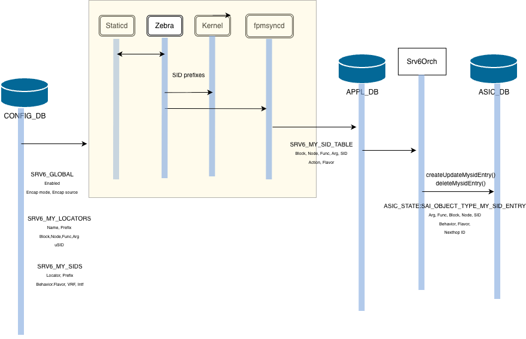

# SRv6 with Full-Length SIDs High-Level Design

## Table of Contents

- [1. Revision](#1-revision)
- [2. Scope](#2-scope)
- [3. Definitions/Abbreviations](#3-definitionsabbreviations)
- [4. Overview](#4-overview)
- [5. Requirements](#5-requirements)
  - [5.1 Functional requirements](#51-functional-requirements)
  - [5.2 Exemptions (not supported)](#52-exemptions-not-supported)
- [6. Architecture Design](#6-architecture-design)
- [7. High-Level Design](#7-high-level-design)
  - [7.1 Modules modified](#71-modules-modified)
  - [7.2 High level flow](#72-high-level-flow)
- [8. SAI API](#8-sai-api)
- [9. Configuration and Management](#9-configuration-and-management)
  - [9.1 YANG Models](#91-yang-models)
    - [9.1.1 Global settings](#911-global-settings)
    - [9.1.2 Locators](#912-locators)
    - [9.1.3 Static SIDs](#913-static-sids)
  - [9.2 DB Tables](#92-db-tables)
    - [9.2.1 Global settings](#921-global-settings)
    - [9.2.2 Locators](#922-locators)
    - [9.2.3 Static SIDs](#923-static-sids)
  - [9.3 CLI](#93-cli)
    - [9.3.1 Configuration commands](#931-configuration-commands)
    - [9.3.2 Show commands](#932-show-commands)
- [10. Detailed Design](#10-detailed-design)
  - [10.1 bgpcfgd (SRv6Mgr / Srv6GlobalMgr)](#101-bgpcfgd-srv6mgr--srv6globalmgr)
  - [10.2 frr-mgmt-framework (frrcfgd)](#102-frr-mgmt-framework-frrcfgd)
  - [10.3 fpmsyncd (routesync)](#103-fpmsyncd-routesync)
  - [10.4 orchagent (srv6orch)](#104-orchagent-srv6orch)
  - [10.5 sonic-utilities CLI](#105-sonic-utilities-cli)
  - [10.6 Example end-to-end sequence](#106-example-end-to-end-sequence)
- [11. Warmboot and Fastboot Design Impact](#11-warmboot-and-fastboot-design-impact)
- [12. Memory Consumption](#12-memory-consumption)
- [13. Restrictions/Limitations](#13-restrictionslimitations)
- [14. Testing Requirements/Design](#14-testing-requirementsdesign)
  - [14.1 Yang model tests](#141-yang-model-tests)
  - [14.2 CLI tests](#142-cli-tests)
  - [14.3 DVS tests](#143-dvs-tests)
  - [14.4 sonic-mgmt tests](#144-sonic-mgmt-tests)
- [15. Open/Action Items](#15-openaction-items)

## 1. Revision

| Rev | Date       | Author         | Change Description                          |
|:---:|:----------:|:---------------|:--------------------------------------------|
| 0.1 | 2026-06-26 | Shyam Sethuram, Manoharan Sundaramoorthy, Ravindra Bikkina | Initial version |

## 2. Scope

This document describes the incremental design that extends SONiC's existing
SRv6 implementation with support for **full-SIDs** (full-length SIDs).

The base SRv6 design in SONiC is uSID (micro-segment) centric and is documented
in the existing HLDs:

- [srv6_hld.md](srv6_hld.md) — base SRv6 architecture, CONFIG_DB/APPL_DB/ASIC_DB
  pipeline and `srv6orch`.
- [srv6_static_config_hld.md](srv6_static_config_hld.md) — static
  `SRV6_MY_LOCATORS` / `SRV6_MY_SIDS` configuration and `bgpcfgd` rendering to
  FRR.
- [srv6_sid_l3adj.md](srv6_sid_l3adj.md) — adjacency (`End.X` / `uA`) SID
  handling.


**In scope:**

- A `full_sid` locator attribute that classifies a locator as either a uSID
  (micro-segment) locator or a full-SID (non-micro-segment) locator.
- Full-SID endpoint behaviors `End` and `End.X`, together with their `PSP`,
  `USP` and `USD` flavors.
- The YANG, CONFIG_DB, APPL_DB and ASIC_DB schema deltas required to carry
  full-SID locators, SIDs and flavors end-to-end.
- The CONFIG_DB &rarr; `bgpcfgd`/`frrcfgd` &rarr; FRR &rarr; `fpmsyncd` &rarr;
  APPL_DB &rarr; `srv6orch` &rarr; SAI programming pipeline.
- `config` / `show` CLI for the above

**Out of scope:**

- The internal FRR (`zebra`, `mgmtd`, `pathd`, `staticd`) implementation of
  SRv6/SR-TE. FRR design and code changes will be posted separately.

## 3. Definitions/Abbreviations

| Term         | Definition                                                                       |
|:-------------|:---------------------------------------------------------------------------------|
| SRv6         | Segment Routing over the IPv6 dataplane (RFC 8986).                              |
| SID          | Segment Identifier                                                               |
| Full-SID     | Full-length (non-micro-segment) SID; one behavior per 128-bit IPv6 address.      |
| uSID         | Micro-segment SID; multiple short SIDs packed into one 128-bit address.          |
| Locator      | IPv6 prefix block from which SIDs are allocated.                                 |
| Block / Node / Function / Argument | The four length fields that partition a locator/SID.       |
| End          | Endpoint behavior: decrement Segments-Left and forward via the SRH.              |
| End.X        | Endpoint behavior with L3 cross-connect to a specific adjacency (Adj-SID).       |
| uN           | uSID equivalent of `End` SID                                                     |
| uA           | uSID equivalent of `End.X` SID                                                   |
| uDT4/6/46    | uSID decapsulation + IPv4/IPv6/IP table (VRF) lookup.                            |
| PSP/USP/USD  | Penultimate-Segment-Pop / Ultimate-Segment-Pop / Ultimate-Segment-Decap flavors. |

## 4. Overview

SONiC's SRv6 support was introduced as a uSID-first design: a locator was
implicitly a micro-segment locator and only the compressed `uN`/`uA`/`uDT`
behaviors were exposed through the YANG model and CLI. The orchagent already
contained the SAI mappings for the full-length `End`/`End.X` behaviors, but
there was no way to configure them: there was no locator type attribute, the
YANG `action` enum did not include `End`/`End.X`, and the `config srv6` CLI did
not exist.

This feature adds support for **full-length SIDs**, where each SID
is a dedicated `/128` IPv6 address carrying a single behavior (`End`, `End.X`)
and an optional `PSP`/`USP`/`USD` flavor. The end-to-end programming pipeline is unchanged.


## 5. Requirements

### 5.1 Functional requirements

1. A locator must be classifiable as either a uSID (micro-segment) locator or a
   full-SID (non-micro-segment) locator, defaulting to uSID for backward compatibility.
2. Full-SID locators must support the `End` and `End.X` endpoint behaviors.
3. `End`/`End.X` SIDs must support the `PSP`, `USP` and `USD` flavors and the
   compound `PSP.USD` flavor.
4. Full-SIDs must be `/128` prefixes. uSID actions retain their existing
   (shorter) prefix-length rules.
5. The system must reject mixing full-SID behaviors on a uSID locator and
   vice-versa, and must enforce this at the YANG, `bgpcfgd`, `frrcfgd` and CLI
   layers.
6. `End.X` (and its flavor variants) and `uA` must take an egress interface and
   MAY take an explicit adjacency (next-hop) address.
7. Existing uSID configuration and behavior must be unaffected.

### 5.2 Exemptions (not supported)

- `End.T` / `End.DT*` / `End.DX*` full-length behaviors are not surfaced through
  the SONiC YANG/CLI. The SAI mappings exist in `srv6orch` but are not exposed as
  configurable `behavior` values.

## 6. Architecture Design

The overall SONiC SRv6 architecture is not changed by this feature.
Full-SID support slots into the existing control-plane pipeline and reuses the
existing orchagent and SAI objects. The configuration-to-ASIC_DB pipeline below is
adapted from [srv6_hld.md](srv6_hld.md).




## 7. High-Level Design

### 7.1 Modules modified

This feature touches the following repositories/modules:

| Repository                 | Change                                                                |
|:---------------------------|:----------------------------------------------------------------------|
| `sonic-yang-models`        | `sonic-srv6.yang`                                                     |
| `sonic-swss`               | `End`/`End.X` behavior + `PSP`/`USP`/`USD` flavor programming;        |
| `sonic-bgpcfgd`            | Locator/SID rendering to FRR CLI; global encap source.       |
| `sonic-frr-mgmt-framework` | Locator/SID rendering to FRR CLI; global encap source.       |
| `sonic-utilities`          | `config srv6`, `show srv6` |

### 7.2 High level flow

The control/data path for full-SIDs is:

1. **CONFIG_DB** receives full-SID locators (`SRV6_MY_LOCATORS`), static SIDs
   (`SRV6_MY_SIDS`), global settings (`SRV6_GLOBAL`)
2. **bgpcfgd** (`SRv6Mgr`, `Srv6GlobalMgr`) and/or **frrcfgd** subscribe to
   these CONFIG_DB tables and render FRR `segment-routing srv6` CLI,
   which they push to FRR via `vtysh`.
3. **FRR** `zebra` for locators, `mgmtd`/`staticd` for static SIDs,
   owns SID allocation
4. **fpmsyncd** receives the resulting SIDs/routes from FRR and writes them into
   **APPL_DB** `SRV6_MY_SID_TABLE`
5. **srv6orch** consumes APPL_DB, resolves behaviors/flavors and programs the
   SAI `ASIC_STATE:SAI_OBJECT_TYPE_MY_SID_ENTRY`, `ASIC_STATE:SAI_OBJECT_TYPE_SRV6_SIDLIST` objects into **ASIC_DB**.


## 8. SAI API

**No new SAI API is introduced.** Full-SID support uses the existing
`ASIC_STATE:SAI_OBJECT_TYPE_MY_SID_ENTRY` and `ASIC_STATE:SAI_OBJECT_TYPE_SRV6_SIDLIST` objects and
the already-standardized endpoint-behavior / flavor enumerations.

Endpoint behaviors used (set via `SAI_MY_SID_ENTRY_ATTR_ENDPOINT_BEHAVIOR`),
mapped in `srv6orch`'s `end_behavior_map`:

| SONiC action (APPL_DB, lowercased) | SAI endpoint behavior                    |
|:-----------------------------------|:-----------------------------------------|
| `end`                              | `SAI_MY_SID_ENTRY_ENDPOINT_BEHAVIOR_E`   |
| `end.x`                            | `SAI_MY_SID_ENTRY_ENDPOINT_BEHAVIOR_X`   |

Flavors used (set via `SAI_MY_SID_ENTRY_ATTR_ENDPOINT_BEHAVIOR_FLAVOR`), mapped
in `end_flavor_ops_map`:

| SONiC flavor | SAI flavor                                              |
|:-------------|:--------------------------------------------------------|
| `PSP`        | `SAI_MY_SID_ENTRY_ENDPOINT_BEHAVIOR_FLAVOR_PSP`         |
| `USP`        | `SAI_MY_SID_ENTRY_ENDPOINT_BEHAVIOR_FLAVOR_USP`         |
| `USD`        | `SAI_MY_SID_ENTRY_ENDPOINT_BEHAVIOR_FLAVOR_USD`         |
| `PSP.USD`    | `SAI_MY_SID_ENTRY_ENDPOINT_BEHAVIOR_FLAVOR_PSP_AND_USD` |

`End.X` additionally programs a next-hop (`SAI_MY_SID_ENTRY_ATTR_NEXT_HOP_ID`) resolved from the
configured interface/adjacency.


## 9. Configuration and Management

### 9.1 YANG Models

#### 9.1.1 Global settings

Model `sonic-srv6.yang`


```
    container sonic-srv6 {
        container SRV6_GLOBAL {
            description "Global SRv6 configuration parameters";

            list SRV6_GLOBAL_LIST {
                max-elements 1;
                key "name";

                leaf name {
                    type string {
                        pattern "default";
                    }
                    description "Global configuration key (must be 'default')";
                }

                leaf encap_source_address {
                    type inet:ipv6-address;
                    description "Global IPv6 source address for SRv6 encapsulation";
                }

                leaf device_encap_mode {
                    type enumeration {
                        enum regular {
                            description "Standard SRv6 encapsulation at head-end (H.Encaps)";
                        }
                        enum reduced {
                            description "Reduced SRv6 encapsulation at head-end (H.Encaps.Red)";
                        }
                        enum all {
                            description "All head-end SRv6 encapsulation types are allowed";
                        }
                    }
                    default "all";
                    description "SRv6 encapsulation mode. Boot-time only — requires config reload to change.";
                }

                leaf device_srv6_enabled {
                    type boolean;
                    default false;
                    description "Whether SRv6 is enabled on this device. Boot-time only — requires swss restart to take effect.";
                }
            }
        }
    }
```

#### 9.1.2 Locators

Model `sonic-srv6.yang`


```
    container sonic-srv6 {
        container SRV6_MY_LOCATORS {
            description "SRv6 locator definitions partitioning the SID address space.";

            list SRV6_MY_LOCATORS_LIST {
                key "locator_name";

                leaf locator_name {
                    description "SRv6 locator name.";
                    type string;
                }

                leaf prefix {
                    description "IPv6 address prefix for this locator.";
                    type inet:ipv6-prefix;
                    mandatory true;
                }

                leaf block_len {
                    description "Length in bits of the SRv6 locator block portion.";
                    type uint8 {
                        range "1..128";
                    }

                    default 32;
                }

                leaf node_len {
                    description "Length in bits of the SRv6 locator node portion.";
                    type uint8 {
                        range "1..128";
                    }

                    default 16;
                }

                leaf func_len {
                    description "Length in bits of the SRv6 SID function portion.";
                    type uint8 {
                        range "0..128";
                    }

                    default 16;
                }

                leaf arg_len {
                    description "Length in bits of the SRv6 SID argument portion.";
                    type uint8 {
                        range "0..128";
                    }

                    default 0;
                }

                must 'block_len + node_len + func_len + arg_len <= 128';

                leaf vrf {
                    type union {
                        type leafref {
                            path "/vrf:sonic-vrf/vrf:VRF/vrf:VRF_LIST/vrf:name";
                        }
                        type string {
                            pattern 'default';
                        }
                    }
                    description "VRF name";

                    default "default";
                }

                leaf full_sid {
                    type boolean;
                    description "Mark this locator as a full-length SID (non-uSID) locator.";
                    default false;
                }
            }
        }
    }
```

#### 9.1.3 Static SIDs

Model `sonic-srv6.yang`


```
    container sonic-srv6 {
        container SRV6_MY_SIDS {
            description "Local SRv6 SID entries with endpoint behavior and decapsulation settings.";

            list SRV6_MY_SIDS_LIST {
                key "locator ip_prefix";

                leaf ip_prefix {
                    description "IPv6 prefix representing this SID.";
                    type inet:ipv6-prefix;
                }

                leaf locator {
                    description "Reference to the parent SRv6 locator.";
                    type leafref {
                        path "/srv6:sonic-srv6/srv6:SRV6_MY_LOCATORS/srv6:SRV6_MY_LOCATORS_LIST/srv6:locator_name";
                    }
                }

                leaf action {
                    description "SRv6 endpoint behavior (uN for prefix SID, uDT46 for decap with VRF lookup).";
                    type enumeration {
                        enum uN;
                        enum uA;
                        enum uDT4;
                        enum uDT6;
                        enum uDT46;
                        enum End;
                        enum End.PSP;
                        enum End.USD;
                        enum End.PSP.USD;
                        enum End.X;
                        enum End.X.PSP;
                        enum End.X.PSP.USD;
                    }
                }

                leaf decap_vrf {
                    type union {
                        type leafref {
                            path "/vrf:sonic-vrf/vrf:VRF/vrf:VRF_LIST/vrf:name";
                        }
                        type string {
                            pattern 'default';
                        }
                    }
                    description "VRF name used for decapsulation";

                    default "default";
                }

                leaf decap_dscp_mode {
                    description "DSCP handling mode for decapsulated packets.";
                    type enumeration {
                        enum uniform;
                        enum pipe;
                    }
                }

                leaf interface {
                    type union {
                        type leafref {
                            path "/port:sonic-port/port:PORT/port:PORT_LIST/port:name";
                        }
                        type leafref {
                            path "/lag:sonic-portchannel/lag:PORTCHANNEL/lag:PORTCHANNEL_LIST/lag:name";
                        }
                        // Avoid VLAN leaf reference here until libyang back-links issue is resolved, and
                        // use VLAN string pattern instead
                        type string {
                            pattern 'Vlan([0-9]{1,3}|[1-3][0-9]{3}|[4][0][0-8][0-9]|[4][0][9][0-4])';
                        }
                    }
                    description "Reference of interface used by uA/End.X SIDs";
                }

                // Constraint: Interface is mandatory for End.X-based and uA actions
                must "(action = 'uA' or action = 'End.X' or action = 'End.X.PSP' or action = 'End.X.PSP.USD') = (boolean(interface))" {
                    error-message "interface is applicable and mandatory only for 'uA', 'End.X' related actions";
                }

                // Constraint: Prefix length must be /128 for regular SIDs
                must "(starts-with(action, 'u')) or (substring-after(ip_prefix, '/') = '128')" {
                    error-message "Prefix length must be /128 for non-uSID actions";
                }

                // Constraint: Cannot configure full-SIDs with uSID locator, or vice-versa
                must "(starts-with(action, 'End')) = (/srv6:sonic-srv6/srv6:SRV6_MY_LOCATORS/srv6:SRV6_MY_LOCATORS_LIST[srv6:locator_name=current()/locator]/srv6:full_sid = 'true')" {
                    error-message "Cannot configure full-SIDs with uSID locator, or vice-versa";
                }

                leaf adj {
                    type inet:ipv6-address;
                    description "IPv6 adjacency address";
                }
            }
        }
    }
```

### 9.2 DB Tables

#### 9.2.1 Global settings

```
DB Name:    CONFIG_DB
Table Name: SRV6_GLOBAL

key = SRV6_GLOBAL|default

device_srv6_enabled  : <true|false>           # global SRv6 enable/disable
encap_source_address : <ipv6_addr>            # source address for SRv6 encapsulation
device_encap_mode    : <regular|reduced|all>  # SRv6 encapsulation mode
```

#### 9.2.2 Locators

```
DB Name:    CONFIG_DB
Table Name: SRV6_MY_LOCATORS

key = SRV6_MY_LOCATORS|<loc_name>

block_len : <N>          # block length in bits
node_len  : <N>          # node length in bits
func_len  : <N>          # function length in bits
arg_len   : <N>          # argument length in bits
prefix    : <prefix>     # Locator IPv6 prefix
full_sid  : <bool>       # Indicates full-length SIDs
```

#### 9.2.3 Static SIDs

```
DB Name:    CONFIG_DB
Table Name: SRV6_MY_SIDS

key = SRV6_MY_SIDS|<loc_name>|<prefix>

action    : <behavior.flavor>   # SID behavior and flavor
adj       : <adjacency>         # SID adjacency (IPv6 nexthop, for End.X)
interface : <interface>         # SID outgoing interface (for End.X)
```

```
DB Name:    APPL_DB
Table Name: SRV6_MY_SID_TABLE

key = SRV6_MY_SID_TABLE:<block_len>:<node_len>:<func_len>:<arg_len>:<ipv6address>

action : <behavior>          # behavior defined for the local SID
flavor : <flavor>            # flavor associated with the SID behavior
vrf    : <VRF_TABLE.key>     # optional VRF name, can be empty
adj    : <ipaddr@interface>  # nexthop for End.X format, can be empty
```

```
DB Name:    ASIC_DB
Table Name: ASIC_STATE:SAI_OBJECT_TYPE_MY_SID_ENTRY

key = ASIC_STATE:SAI_OBJECT_TYPE_MY_SID_ENTRY:{<my_sid_entry_attributes>}
      # JSON object: args_len, function_len, locator_block_len, locator_node_len,
      #              sid, switch_id, vr_id

SAI_MY_SID_ENTRY_ATTR_NEXT_HOP_ID              : <nexthop_oid>        # optional nexthop OID
SAI_MY_SID_ENTRY_ATTR_ENDPOINT_BEHAVIOR        : <SAI behavior enum>  # programmed behavior
SAI_MY_SID_ENTRY_ATTR_ENDPOINT_BEHAVIOR_FLAVOR : <SAI flavor enum>    # programmed flavor
```


### 9.3 CLI

The `config srv6` and `show srv6` command groups are newly introduced.

#### 9.3.1 Configuration commands

#### 9.3.1.1 Global settings

```
- config srv6 global device_srv6_enabled { true | false }
- config srv6 global encap_source_address <ipv6_addr>
- config srv6 global device_encap_mode { regular | reduced | all }
```

> Note: Changing the global SRv6 Enable status or the encapsulation mode requires
> one or more container restarts, and can result in temporary traffic loss.


#### 9.3.1.2 Locators


```
- config srv6 locator add <loc_name> <loc_prefix> --block-len <N> [ --node-len <N> --function-len <N> --argument-len <N> --full-sid ]
- config srv6 locator del <loc_name>
```

#### 9.3.1.3 Static SIDs

```
- config srv6 static-sid add <prefix> <loc_name> <behavior.flavor> [ --interface <intf_name> --adjacency <intf_nbr> ]
- config srv6 static-sid del <prefix> <loc_name>
```

#### 9.3.2 Show commands

#### 9.3.2.1 Global settings

```
- show srv6 global
```

#### 9.3.2.2 Locators

```
- show srv6 locators [ <loc_name> ]
- show srv6 rib locators [ <loc_name> ]
```

#### 9.3.2.3 Static SIDs

```
- show srv6 static-sids [ <loc_name> | <prefix> ]
- show srv6 rib sids [ <prefix> ]
```

## 10. Detailed Design

### 10.1 bgpcfgd (SRv6Mgr / Srv6GlobalMgr)

`managers_srv6.py` renders CONFIG_DB data into FRR CLI.

**Global encap.** `Srv6GlobalMgr` renders `SRV6_GLOBAL`'s
`encap_source_address` into FRR (`segment-routing srv6 encapsulation
source-address ..`), and emits `no source-address` when the field is dropped
from the row (handling the SET-that-drops-a-field case explicitly, since
swsscommon delivers SET rather than DEL while the row still has sibling fields
such as `device_encap_mode`).

**Locator type.** `Locator.is_usid` is computed from the `full_sid` field, with
uSID as the default:

```python
self.is_usid = data.get('full_sid', 'false').lower() != 'true'
```

`locators_set_handler()` emits
`segment-routing srv6 locators locator <name> prefix <p> block-len .. node-len ..
func-bits ..` and appends `behavior usid` **only** when `locator.is_usid` is
true. A full-SID locator (`full_sid=true`) is therefore rendered without
`behavior usid`.

**SID validation and rendering.** `sids_set_handler()`:

- Confirms the action is in `supported_SRv6_behaviors` (the `uN`/`uA`/`uDT*` and
  `End`/`End.X` set).
- Computes the locator prefix to validate against: for uSID actions it uses the
  locator block (`prefix/block_len`); for full-SIDs it uses the full locator
  prefix, then checks `supernet_of(sid_prefix)`.
- Rejects mismatches between behavior class and locator type
  (`is_usid_behavior` vs `is_usid_locator`), and enforces the `uN` prefix-length
  rule.
- Translates the YANG behavior name to FRR form via `translate_behavior_to_frr`
  (replacing `.` with `_`, e.g. `End.X.PSP.USD` &rarr; `End_X_PSP_USD`) and
  emits `segment-routing srv6 static-sids sid <p> locator <name> behavior <b>`.
- Appends `vrf <v>` for `uDT*`, and `interface <if> [nexthop <adj>]` for
  `End.X*`/`uA` (failing if no interface is present).


### 10.2 frr-mgmt-framework (frrcfgd)

`frrcfgd.py` provides an alternate config path to render FRR configs.
Its table-to-daemon routing is:

```python
'SRV6_MY_LOCATORS': ['zebra'],
'SRV6_MY_SOURCE':   ['zebra'],
'SRV6_MY_SIDS':     ['mgmtd'],
```

**Locators / SIDs.** Locator rendering mirrors `bgpcfgd`: it appends
`behavior usid` unless `full_sid == 'true'`. SID rendering re-validates
behavior/locator consistency and the `uN` prefix-length rule, translates the
behavior name with `translate_behavior_to_frr`, and branches by action group:
`uDT*` add `vrf`, `End.X*`/`uA` add `interface [nexthop]`, and
`uN`/`End`/`End.PSP`/`End.USD`/`End.PSP.USD` emit the bare
`sid .. locator .. behavior ..` form.

### 10.3 fpmsyncd (routesync)

`routesync.cpp` consumes the FRR FPM SRv6 localSID netlink attributes and writes
the APPL_DB `SRV6_MY_SID_TABLE` row. For each local SID it emits the
`action`, `flavor`, `vrf` and `adj` field/value tuples (the `flavor` field is
the new carrier for the full-SID `PSP`/`USP`/`USD` operation derived from the
FRR `FLV_OPS` attribute). This is the mechanism by which the resolved full-SID flavor
reaches `srv6orch`.

### 10.4 orchagent (srv6orch)

**Local SIDs:**
`srv6orch` translates the APPL_DB full-SID behavior and flavor into SAI. The
string&rarr;SAI maps are the key data structures:

- `end_behavior_map` maps the lowercased APPL_DB action to a
  `sai_my_sid_entry_endpoint_behavior_t`
- `end` &rarr; `SAI_MY_SID_ENTRY_ENDPOINT_BEHAVIOR_E` and `end.x` &rarr; `SAI_MY_SID_ENTRY_ENDPOINT_BEHAVIOR_X` (alongside
  the existing `un`, `ua`, `udt4`, `udt6`, `udt46`, etc.).
- `end_flavor_ops_map` maps an **explicit** flavor string (`PSP`, `USP`, `USD`,
  `PSP.USD`) to the corresponding SAI flavor.
- `end_flavor_map` supplies the **default** flavor when none is configured

`doTaskMySidTable()` parses the APPL_DB entry, reading the `action`, `flavor`,
`vrf` and `adj` fields, and calls `createUpdateMysidEntry()`.
`sidEntryEndpointBehavior(action, flv_str, end_behavior, end_flavor)` resolves
the behavior from `end_behavior_map` and, for `End`/`End.X`,
applies the explicit `flv_str` from `end_flavor_ops_map` when present; for other
behaviors it applies the per-action default from `end_flavor_map`.

`createUpdateMysidEntry()` then:

- Builds the `sai_my_sid_entry_t` key from the
  `block_len:node_len:function_len:args_len:sid` tokens of the APPL_DB key.
- Adds `SAI_MY_SID_ENTRY_ATTR_VRF` when `mySidVrfRequired()` (the `*DT*`/`T`
  behaviors).
- Adds `SAI_MY_SID_ENTRY_ATTR_NEXT_HOP_ID` when `mySidNextHopRequired()` (the
  `X`/`uA`/`DX*`/`B6*` behaviors) — for `End.X` this resolves the adjacency
  next-hop, queuing the entry in `m_pendingSRv6MySIDEntries` if the neighbor is
  not yet resolved.
- Adds an IP-in-IP tunnel when `mySidTunnelRequired()` (the `uN`/`uDT46` decap
  cases) — unchanged from the uSID path and not applicable to `End`/`End.X`.
- Pushes `SAI_MY_SID_ENTRY_ATTR_ENDPOINT_BEHAVIOR` and, when the resolved flavor
  is not `..._FLAVOR_NONE`, `SAI_MY_SID_ENTRY_ATTR_ENDPOINT_BEHAVIOR_FLAVOR`.


### 10.5 sonic-utilities CLI

`config/srv6.py` implements the `config srv6 global`, `config srv6 locator`
and `config srv6 static-sid` groups.
The global parameters `device_srv6_enabled`/`device_encap_mode` may result in the
restart of `swss` container; an explicit user confirmation is required.
`encap_source_address` is applied without a restart.

`show/srv6.py` implements `show srv6 locators`, `show srv6 static-sids` (with the `Offloaded` column computed from
ASIC_DB), `show srv6 global` and `show srv6 stats` commands.
In order to view Zebra/RIB's state, use the commands `show srv6 rib locators` and
`show srv6 rib sids`.

### 10.6 Example end-to-end sequence

```
config srv6 locator add loc1 dd:dd:dd:1::/64 --block-len 48 --node-len 16 --full-sid
config srv6 static-sid add dd:dd:dd:1:6000::/128 loc1 End.PSP
        |
        v  CONFIG_DB: SRV6_MY_LOCATORS|loc1 (full_sid=true), SRV6_MY_SIDS|loc1|...
   bgpcfgd (SRv6Mgr) / frrcfgd  --vtysh-->  FRR (zebra / mgmtd)
        |   locator rendered WITHOUT 'behavior usid'; sid behavior End_PSP
        v  FRR allocates the SID and programs dataplane intent
   fpmsyncd (routesync)  -->  APPL_DB: SRV6_MY_SID_TABLE:48:16:16:0:dd:dd:dd:1:6000::
        |   action=end, flavor=PSP, vrf="", adj=""
        v
   srv6orch.doTaskMySidTable -> createUpdateMysidEntry
        |   sidEntryEndpointBehavior: end -> BEHAVIOR_E, flavor PSP -> FLAVOR_PSP
        v  SAI my_sid_entry (BEHAVIOR=E, FLAVOR=PSP)
   ASIC_DB  (show srv6 static-sids => Offloaded=True)
```

## 11. Warmboot and Fastboot Design Impact

No new mechanism is introduced for handling of My-SID objects.

## 12. Memory Consumption

When the feature is unused there is no additional memory consumption.

## 13. Restrictions/Limitations

- Full-SIDs must be IPv6 *'/128'* prefixes
- A locator cannot mix uSID and full-SID behaviors
- `End.T` / `End.DT*` / `End.DX*` full-length behaviors are not exposed via the
  YANG/CLI in this increment.
- `device_encap_mode` / `device_srv6_enabled` are boot-time-only and require a
  `swss` restart to take effect.

## 14. Testing Requirements/Design

SRv6 full-SID functionality is validated across multiple test layers spanning the submodules and at sonic-mgmt level.

### 14.1 Yang model tests

- sonic-yang-models/tests/yang_model_tests/tests/srv6.json


### 14.2 CLI tests

- sonic-utilities/tests/show_srv6_state_test.py
- sonic-utilities/tests/config_srv6_test.py
- sonic-utilities/tests/show_run_srv6_test.py
- sonic-utilities/tests/show_srv6_test.py

### 14.3 DVS tests

- sonic-swss/tests/test_srv6.py

### 14.4 sonic-mgmt tests

- sonic-mgmt/tests/srv6/test_srv6_fullsid_basic.py
  - covers decap, midpoint and encap packet forwarding
  - IPv4/IPv6 (UDP) inner payload
  - SID behaviors: `End`, `End.X`
  - SID flavors: `PSP`, `USD`, `PSP.USD`
  - Encap mode: `H.Encaps`, `H.Encaps.Red`


## 15. Open/Action Items

None
