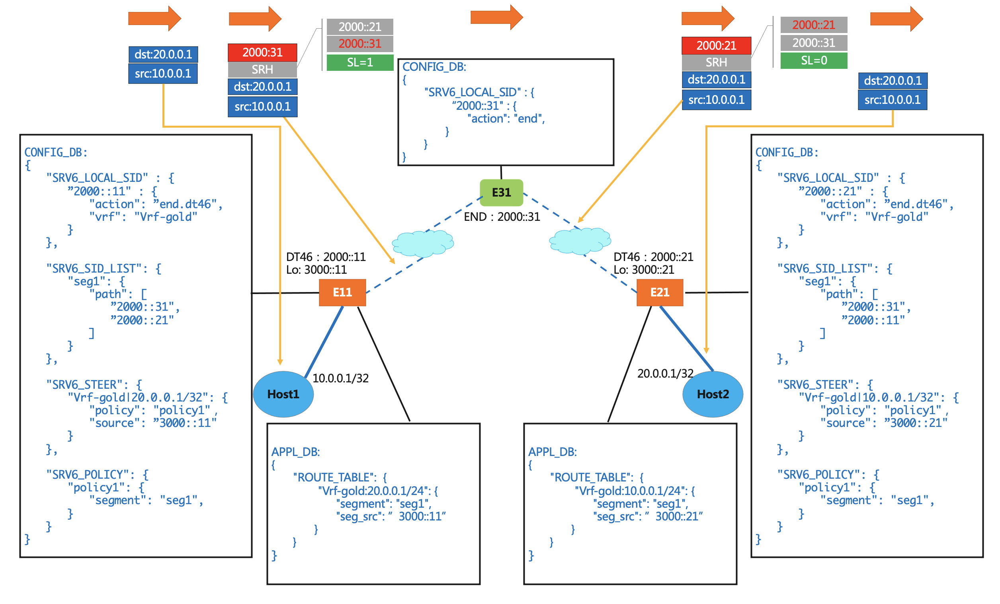

# Segment Routing over IPv6 (SRv6) HLD  

# Table of Contents

- [List of Tables](#list-of-tables)
- [Revision](#revision)
- [Definition/Abbreviation](#definitionabbreviation)
- [About This Manual](#about-this-manual)
- [1 Introuduction and Scope](#1-introuduction-and-scope)
- [2 Feature Requirements](#2-feature-requirements)
- [2.1 Functional Requirements](#21-functional-requirements)
- [2.2 Configuration and Managment Requirements](#22-configuration-and-management-requirements)
- [2.3 Warm Boot Requirements](#23-warm-boot-requirements)
- [3 Feature Design](#3-feature-design)
- [3.1 ConfigDB Changes](#31-configdb-changes)
- [3.2 AppDB Changes](#32-appdb-changes)
- [3.3 Orchestration Agent Changes](#33-orchestration-agent-changes)
- [3.4 SAI](#34-sai)
- [3.5 YANG Model](#35-yang-model )
- [4 Unit Test](#4-unit-test)
- [5 References ](#5-references) 

# Revision

| Rev  |   Date    |           Author           | Change Description      |
| :--: | :-------: | :------------------------: | :---------------------: |
| 0.1  | 6/5/2021  | Heidi Ou, Kumaresh Perumal |  Initial version        |
| 0.2  | 8/24/2021 | Dong Zhang                 |  More explanation       |
| 0.3  | 10/15/2021| Kumaresh Perumal           |  Minor updates          |
| 0.4  | 10/26/2021| Kumaresh Perumal           |  Update MY_SID table.   |


# Definition/Abbreviation

### Table 1: Abbreviations

| ****Term**** | ****Meaning**** |
| -------- | ----------------------------------------- |
| BFD  | Bidirectional Forwarding Detection  |
| BGP  | Border Gateway Protocol |
| BSID | Binding SID |
| G-SID  | Generalized Segment Identifier  |
| SID  | Segment Identifier  |
| SRH  | Segment Routing Header  |
| SRv6 | Segment Routing IPv6  |
| TE | Traffic Engineering |
| uSID | Micro Segment |
| VNI  | VXLAN Network Identifier  |
| VRF  | Virtual Routing and Forwarding  |

# About this Manual

This document provides general information about the Segmentation Routing over IPv6 feature implementation in SONiC. It is based on IETF RFC 8754 and RFC 8986.

# 1 Introuduction and Scope

This document describes the Functionality and High level design of the SRv6 feature.

SRv6 has been widely adopted as an IPv6 based SDN solution, which provides programming ability, TE capabilities,  and deployment simplicity to network administrators.  With current support from a rich ecosystem, including major ASIC manufactures,  networking vendors and open source communities, the deployment of SRv6 is accelerating. We want to add SRv6 into SONIC to benefit users in DC as well as beyond DC.  

The following are some use cases for SRv6 deployment:

- v4/6VPN, EVPN over best-effort
- Traffic steering over TE policy 

In SRv6 domain,  TE policy associated with SID list could be configured on headend nodes, to steer traffic with SRH encapsulation. When traffic reaches egress nodes,  the packets are processed based on local defined functions, for example SID list decapsulation and FIB lookup in a particular VRF . 

# 2 Feature Requirements

## 2.1 Functional Requirements

This section describes the SONiC requirements for SRv6 feature in phases:

At a high level the following should be supported:

Phase #1

​	Should be able to perform the role of SRv6 domain headend node, and endpoint node, more specific:
- Support END, Endpoint function - The SRv6 instantiation of a prefix SID 
- Support END.DT46, Endpoint with decapsulation and IP table lookup - IP L3VPN use (equivalent of a per-VRF VPN label)
- Support H.Encaps.Red, H.Encaps with Reduced Encapsulation
- Support traffic steering on SID list

Later phases:
- Support H.Encaps, SR Headend Behavior with Encapsulation in an SR Policy
- Support END.B6.Encaps, Endpoint bound to an SRv6 encapsulation Policy - SRv6 instantiation of a Binding SID
- Support END.B6.Encaps.Red,  END.B6.Encaps with reduced SRH insertion - SRv6 instantiation of a Binding SID
- Support END.X, Endpoint function with Layer-3 cross-connect - The SRv6 instantiation of a Adj SID
- Support uSID/G-SID
- Other programming functions
- Support HMAC option
- Support sBFD for SRv6 
- Support anycast SID

This document will focus on Phase #1, while keep the design extendable for future development

## 2.2 Configuration and Management Requirements

1. User should be able to enable SRv6 globally

2. User should be able to configure SID list for encapsulation

3. User should be able to configure SRv6 steering policy

4. User should be able to configure endpoint action and corresponding argument for matched local SID

## 2.3 Warm Boot Requirements

Warm reboot is intended to be supported for planned system, swss and BGP warm reboot.

 

# 3 Feature Design


Before FRR is ready, we will use static configuration to set SIDs and apply policy for TE. It enables basic SRv6 operation and populates SRv6 into ASIC, allows SRv6 data plane forwarding. More complicated SRv6 policy can be enabled when SRv6 is fully supported in FRR and passed from FRR to fpmsyncd.

For Phase#1, Controller will update SRV6 related tables in APPL_DB directly using Translib and other SONiC management framework. Sonic-swss python scripts are also used to update SRV6 APPL_DB tables.

## 3.1 ConfigDB Changes

**SRV6_SID_LIST_TABLE**

Description: New table that stores SRv6 SID list configuration.

Schema:

```
; New table
; holds SRv6 SID list

key = SRV6_SID_LIST|segment_name
                     ; SID segment name
; field = value
path = SID,          ; List of SIDs

For example:
    "SRV6_SID_LIST": {
        "seg1": {
            "path": [
                "BABA:1001:0:10::",
                "BABA:1001:0:20:F1::"
            ]
        },
        "seg2": {
            "path": [
                "BABA:1001:0:30::",
                "BABA:1001:0:40:F1::"
            ]
        }
    }
```

**SRV6_MY_SID_TABLE**

Description: New table to hold local SID to behavior mapping

Schema:

```
; New table
; holds local SID to behavior mapping, allow 1:1 or n:1 mapping

key = SRV6_MY_SID_TABLE|ipv6address
; field = value
block_len = blen             ; bit length of block portion in address, default 40
node_len = nlen              ; bit length of node ID portion in address, default 24
func_len = flen              ; bit length of function portion in address, default 16
arg_len = alen               ; bit length of argument portion in address
action = behavior            ; behaviors defined for local SID
vrf = VRF_TABLE.key          ; VRF name for END.DT46, can be empty
adj = address,               ; Optional, list of adjacencies for END.X
policy = SRV6_POLICY.key     ; Optional, policy name for END.B6.ENCAP
source  = address,           ; Optional, list of src addrs for encap for END.B6.ENCAP

For example:
    "SRV6_MY_SID_TABLE" : {
       	"BABA:1001:0:20:F1::" : {
           "action": "end.dt46",
           "vrf":  "VRF-1001"
        },
       	"BABA:1001:0:40:F1::" : {
           "action": "end.dt46",
           "vrf":  "VRF-1001"
        },
       	"BABA:1001:0:20:F2::" : {
           "action": "end.x",
           "adj": [
                BABA:2001:0:10::1, 
                BABA:2001:0:10::2
            ],
        },
       	"BABA:1001:0:20:F3::" : {
           "action": "end.b6.encap",
           "policy": "policy1"
           "source": "A::1"
        }
    }
```

**SRV6_POLICY_TABLE**

Description: New table that stores SRv6 policy .

Schema:

```
; New table
; holds SRv6 policy

key = SRV6_POLICY|policy_name

; field = value
segment = SRv6_SID_LIST.key,   ; List of segment names

For example:
    "SRV6_POLICY": {
        "policy1": {
            "segment": ["seg1", "seg2"]
        },
        "policy2": {
            "segment": ["seg1"]
        }
    }
```

**SRV6_STEER_MAP**

Description: New table that stores prefix to policy mapping .

Schema:

```
; New table
; holds prefix to SRv6 SID list encapsulation mapping

key = SRV6_STEER|VRF_NAME:prefix
                               ; Prefix to be steered
; field = value
policy = SRV6_POLICY.key       ; Policy to steer the prefix
source  = address              ; Source addresses for encapsulation

For example:
    "SRV6_STEER": {
        "Vrf-red|11.11.11.0/24": {
            "policy": "policy1"，
            "source": "A::1"
        },
        "Vrf-blue|2001:a::0/64": {
            "policy": "policy2"，
            "source": "A::1"
        }
    }
```

## 3.2 AppDB changes

**New SRV6_SID_LIST_TABLE**

Description: New table to hold SRv6 SID list.

Schema:

```
; New table
; holds SRv6 SID list

key = SRV6_SID_LIST_TABLE:segment_name

; field = value
path = SID,                         ; List of SIDs
```

**New SRV6_MY_SID_TABLE**

Description: New table to hold local SID to behavior mapping

Schema:

```
; New table
; holds local SID to behavior mapping

key = SRV6_MY_SID_TABLE:block_len:node_len:func_len:arg_len:ipv6address

; field = value
action = behavior                  ; behaviors defined for local SID
vrf = VRF_TABLE.key                ; VRF name for END.DT46, can be empty
adj = address,                     ; List of adjacencies for END.X, can be empty
segment = SRv6_SID_LIST.key,       ; List of segment names for END.B6.ENCAP, can be empty
source  = address,                 ; List of src addrs for encap for END.B6.ENCAP
```

**Modify ROUTE_TABLE**

Description: Existing Route Table is extended to add SID list. 

Schema:

```
;Stores a list of routes
;Status: Mandatory

key = ROUTE_TABLE:VRF_NAME:prefix ;
nexthop = prefix,              ; IP addresses separated ',' (empty indicates no gateway). May indicate VXLAN endpoint if vni_label is non zero.
intf = ifindex? PORT_TABLE.key ; zero or more separated by ',' (zero indicates no interface)
vni_label = VRF.vni            ; zero or more separated by ',' (empty value for non-vxlan next-hops). May carry MPLS label in future.
router_mac = mac_address       ; zero or more remote router MAC address separated by ',' (empty value for non-vxlan next-hops)
blackhole = BIT                ; Set to 1 if this route is a blackhole (or null0)
segment = SRV6_SID_LIST.key    ; New optional field. List of segment names, separated by ',' 
seg_src = address              ; New optional field. Source addrs for sid encap
```

**Two cases:**

**CASE A :** route entry with the same key(VRF_NAME:prefix ) already exists in APPL_DB ROUTE_TABLE

**CASE B:** route entry with the same key(VRF_NAME:prefix ) DOES NOT exist in APPL_DB ROUTE_TABLE

For both cases, we don't care  fields **nexthop**, **intf**, **vni_lable**, **route_mac** and **blackhole**, since srv6 related fields will be added which includes segments. Segments actually is lists of sids which tell the packets will be added SRV6 encap header and SID list will be used for nexthop lookup in SRV6Orch.


For Controller, it only needs to below information and update APPL_DB ROUTE_TABLE no matter it exists or not. 

**key**: the key in ROUTE_TABLE is the same as the one in SRV6_STEER_MAP

**segment**: form SRV6_STEER_MAP entry, the policy field indicates the entry in SRV6_POLICY_TABLE, the segment field information is there. Srv6Orch will use segment to find sid list and sids for nexthop lookup.

**seg_src**: form SRV6_STEER_MAP entry, the source field indicates what will be used here

    EXAMPLE : how to modify ROUTE_TABLE
    current CONFIG_DB:
    "SRV6_SID_LIST": {
        "seg1": {
            "path": [
                "BABA:1001:0:10::",
                "BABA:1001:0:20:F1::"
            ]
        },
        "seg2": {
            "path": [
                "BABA:1001:0:30::",
                "BABA:1001:0:40:F1::"
            ]
        }
    }
    
    "SRV6_STEER": {
        "Vrf-red|11.11.11.0/24": {
            "policy": "policy1"，
            "source": "A::1"
        },
        "Vrf-blue|2001:a::0/64": {
            "policy": "policy2"，
            "source": "A::1"
        }
    }
    
    "SRV6_POLICY": {
        "policy1": {
            "segment": "seg1, seg2"
            },
        "policy2": {
            "segment": "seg1"
        }
    }
    
    current APPL_DB:
    "ROUTE_TABLE": {
        "Vrf-red:11.11.11.0/24": {
            "nexthop" : "109.109.109.109",
            "ifname" : "Vlan1001",
            "vni_label" : "1001",
            "router_mac" : "c6:97:75:ed:06:72"
        }
    }
    
    future APPL_DB:
    "ROUTE_TABLE": {
        "Vrf-red:11.11.11.0/24": {
            "nexthop" : "109.109.109.109",
            "ifname" : "Vlan1001",
            "vni_label" : "1001",
            "router_mac" : "c6:97:75:ed:06:72",
            
            "segment": "seg1,seg2",
            "seg_src": "A::1"        
        }
    }

SRV6_STEER_TABLE generated route entry has higher priority than the entry in ROUTE_TABLE if any matched. Controller will update ROUTE_TABLE entry and modify it in APPL_DB ROUTE_TABLE if any.

In Srv6Orch, it will mark which route entry is Srv6 modified and having higher priority to do SID and nexthop lookup, FRR or other modules cannot modify these high priority routes, they can only be modified via Srv6Orch.

**Resolve SID NextHop Via Controller or Others:** 

If the SID subnet (below example, 2000::31 on E31) is directly connected to E11, the nexthop could be found, if not, we should have a controller to indicate nexthop information on E11 for subnet 2000::31, since FRR is not involved at this moment on Phase #1. A static route should be installed via controller in APPL_DB ROUTE_TABLE.  Or the network itself has some basic ipv6 protocol is ruuning, and all the basic ipv6 informaion is fully exchanged, it depends on how the architecture is designed.

Beside adding/modifing routes, controller could delete routes. When controller deletes some routes, then the higher priority flag will be removed and the routes will be deleted. Frr or other modules could modify the routes the same way as we did today when the srv6 high priority flag doesn't exist.

**An Example as below:**



## 3.3 Orchestration Agent Changes

New Orchagent(SRV6Orch) is created to manage all SRV6 related objects. SRV6Orchagent listens to APP_DB for regular updates and create/update SAI objects in ASIC_DB.  


**SRV6Orchagent**

This orchagent is responsible to create SRV6 related objects in ASIC_DB with the information from APP_DB.


SRV6Orchagent listens to all updates of SRV6_SID_LIST_TABLE to create SAI_SEGMENTROUTE_SIDLIST object with list of V6 prefixes. It also creates a SRV6 Nexthop with the existing SIDLIST object handle. Any update to V6 prefixes to the segment will be pushed to ASIC_DB.


When a route entry is added to ROUTE_TABLE, routeOrchagent calls srv6Orchagent to get the SRV6 nexthop with all associated segment prefixes. If a route entry is referenced by list of ECMP segments, the orchagent creates a ECMP group with already created Nexthop members and pass the ECMP object handle to routeOrchagent. When all route entries referenced by the ECMP groups are deleted, ECMP group object is deleted. 


Orchagent listens to SRV6_MY_SID_TABLE in APP_DB to create SAI objects in ASIC_DB. For SRV6_MY_SID_TABLE's END.X action, this orchagent queries the existing IP NextHop and NextHopGroup database and use the existing object handle and update ASIC_DB. When IP NextHop doesn't exist, SRV6_MY_SID_TABLE objects are programmed with Drop action and notify NeighOrch to resolve IP NextHop. When that NextHop is resolved, SRV6Orchagent updates SRV6_MY_SID_TABLE with valid IP NextHop handle and Forward action. This orchagent creates a new ECMP group when Nexthop exists for all the Nexthop addresses in END.X action and no matching group exists in the DB. For SRV6_MY_SID_TABLE's END.DT46 action, orchagent passes the VRF handle associated with VRF name to ASIC_DB. For SRV6_MY_SID_TABLE's END.B6 Encaps, orchagent use existing Nexthop/NexthopGroup for the list of segments or create a new NexthopGroup.


**NextHopKey Changes**


RouteOrch uses NexthopKey to create SAI next hop objects. To support SRV6 segments in the nextHop, key is modified to include segment string and source address string used for SRv6 source encapsulation.


```
Struct NextHopKey {

  IpAddress ip_address;

  ...
  string segment;

  string srv6_source;

  ...

}
```


## 3.4 SAI

  https://github.com/opencomputeproject/SAI/compare/master...ashutosh-agrawal:srv6

SR Source behavior:

1) Create a SID list object with 3 segments

   sidlist_entry_attrs[0].id = SAI_SEGMENTROUTE_SIDLIST_ATTR_TYPE

   sidlist_entry_attrs01].value.s32 = SAI_SEGMENTROUTE_SIDLIST_TYPE_ENCAPS_RED

   sidlist_entry_attrs[1].id = SAI_SEGMENTROUTE_SIDLIST_ATTR_SEGMENT_LIST

   sidlist_entry_attrs[1].value.objlist.count = 3;

   CONVERT_STR_TO_IPV6(sidlist_entry_attrs[1].value.objlist.list[0], "2001:db8:85a3::8a2e:370:7334");

   CONVERT_STR_TO_IPV6(sidlist_entry_attrs[1].value.objlist.list[1], "2001:db8:85a3::8a2e:370:2345");

   CONVERT_STR_TO_IPV6(sidlist_entry_attrs[1].value.objlist.list[2], "2001:db8:85a3::8a2e:370:3456");

   saistatus = sai_v6sr_api->create_segmentroute_sidlist(&sidlist_id, switch_id, 2, sidlist_entry_attrs);


2) Create Nexthop with the sidlist object  

   nexthop_entry_attrs[0].id = SAI_NEXTHOP_ATTR_TYPE

   nexthop_entry_attrs[0].value = SAI_NEXT_HOP_TYPE_SEGMENTROUTE_SIDLIST

   nexthop_entry_attrs[1].id = SAI_NEXTHOP_ATTR_TUNNEL_ID

   nexthop_entry_attrs[1].value.oid = tunnel_id

   nexthop_entry_attrs[2].id = SAI_NEXT_HOP_ATTR_SEGMENTROUTE_SIDLIST_ID

   nexthop_entry_attrs[2].value.oid = sidlist_id

   saistatus = sai_nexthop_api->create_nexthop(&nexthop_id, switch_id, 3, nexthop_entry_attrs)


3) Create route entry with SRv6 Nexthop

   route_entry.switch_id = 0

   route_entry.vr_id = vr_id_1 // created elsewhere

   route_entry.destination.addr_family = SAI_IP_ADDR_FAMILY_IPV4

   route_entry.destination.addr.ip4 = "198.51.100.0"

   route_entry.destination.addr.mask = "255.255.255.0"       

   route_entry_attrs[0].id = SAI_ROUTE_ENTRY_ATTR_NEXT_HOP_ID;

   route_entry_attrs[0].value.oid = nexthop_id; 

   saisstatus = sairoute_api->create_route(&route_entry, 1, route_entry_attrs)  


SR TRansit/Endpoint behavior


my_sid_entry.switch_id = 0

my_sid_entry.vr_id = vr_id_1 // underlay VRF

my_sid_entry.locator_len = 64

my_sid_entry.function_len = 8

CONVERT_STR_TO_IPV6(my_sid_entry.sid, "2001:db8:0:1::1000:0:0:0");


my_sid_attr[0].id = SAI_MY_SID_ENTRY_ATTR_ENDPOINT_BEHAVIOR

my_sid_attr[0].value = SAI_MY_SID_ENTRY_ENDPOINT_TYPE_DT46

my_sid_attr[1].id = SAI_MY_SID_ENTRY_ATTR_VRF

my_sid_attr[1].value.oid = vr_id_1001 // overlay vrf, created elsewhere

saistatus = saiv6sr_api->create_my_sid_entry(&my_sid_entry, 2, my_sid_attr)


## 3.5 YANG Model
```
module: sonic-srv6
  +--rw sonic-srv6
     +--rw SRV6_SID_LIST
     |  +--rw SRV6_SID_LIST_LIST* [name]
     |     +--rw name    string
     |     +--rw path*   inet:ipv6-address
     +--rw SRV6_MY_SID
     |  +--rw SRV6_MY_SID_LIST* [ip-address]
     |     +--rw ip-address    inet:ipv6-address
     |     +--rw block_len?    uint16
     |     +--rw node_len?     uint16
     |     +--rw func_len?     uint16
     |     +--rw arg_len?      uint16
     |     +--rw action?       enumeration
     |     +--rw vrf?          -> /vrf:sonic-vrf/VRF/VRF_LIST/name
     |     +--rw adj*          inet:ipv6-address
     |     +--rw policy?       -> /sonic-srv6/SRV6_POLICY/SRV6_POLICY_LIST/name
     |     +--rw source?       inet:ipv6-address
     +--rw SRV6_POLICY
     |  +--rw SRV6_POLICY_LIST* [name]
     |     +--rw name       string
     |     +--rw segment*   -> /sonic-srv6/SRV6_SID_LIST/SRV6_SID_LIST_LIST/name
     +--rw SRV6_STEER
        +--rw SRV6_STEER_LIST* [vrf-name ip-prefix]
           +--rw vrf-name     -> /vrf:sonic-vrf/VRF/VRF_LIST/name
           +--rw ip-prefix    union
           +--rw policy?      -> /sonic-srv6/SRV6_POLICY/SRV6_POLICY_LIST/name
           +--rw source?      inet:ipv6-address
```

## 4 Unit Test

TBD

## 5 References

-  [SAI IPv6 Segment Routing Proposal for SAI 1.2.0](https://github.com/opencomputeproject/SAI/blob/1066c815ddd7b63cb9dbf4d76e06ee742bc0af9b/doc/SAI-Proposal-IPv6_Segment_Routing-1.md)

-  [RFC 8754](https://tools.ietf.org/html/rfc8754)
-  [RFC 8986](https://www.rfc-editor.org/rfc/rfc8986.html)
-  [draft-filsfils-spring-segment-routing-policy](https://tools.ietf.org/html/draft-filsfils-spring-segment-routing-policy-06)

-  [draft-ali-spring-bfd-sr-policy-06](https://tools.ietf.org/html/draft-ali-spring-bfd-sr-policy-06)

-  [draft-filsfils-spring-net-pgm-extension-srv6-usid](https://tools.ietf.org/html/draft-filsfils-spring-net-pgm-extension-srv6-usid-08)

-  [draft-cl-spring-generalized-srv6-for-cmpr](https://tools.ietf.org/html/draft-cl-spring-generalized-srv6-for-cmpr-02)  


