# SRv6 Per-Flow Traffic Steering — HLD

# Table of Contents

- [SRv6 Per-Flow Traffic Steering — HLD](#srv6-per-flow-traffic-steering--hld)
- [Table of Contents](#table-of-contents)
- [Revision](#revision)
- [Definition/Abbreviation](#definitionabbreviation)
- [1 Introduction](#1-introduction)
- [2 Scope](#2-scope)
  - [2.1 In scope](#21-in-scope)
  - [2.2 Out of scope](#22-out-of-scope)
- [3 Feature Requirements](#3-feature-requirements)
  - [3.1 Functional Requirements](#31-functional-requirements)
  - [3.2 Configuration and Management Requirements](#32-configuration-and-management-requirements)
  - [3.3 Warm Boot Requirements](#33-warm-boot-requirements)
- [4 Solution Architecture](#4-solution-architecture)
  - [4.1 Today's color-based steering and its limitation](#41-todays-color-based-steering-and-its-limitation)
  - [4.2 SR Policy per-flow config](#42-sr-policy-per-flow-config)
    - [4.2.1 Approach 1 — Flat per-flow CP body](#421-approach-1--flat-per-flow-cp-body)
    - [4.2.2 Approach 2 — Recursive (composite) per-flow CP body](#422-approach-2--recursive-composite-per-flow-cp-body)
      - [4.2.2.1 Scenario A — Per-flow steering (the core new capability)](#4221-scenario-a--per-flow-steering-the-core-new-capability)
      - [4.2.2.2 Scenario B — Per-flow primary + explicit backup on the same SR Policy](#4222-scenario-b--per-flow-primary--explicit-backup-on-the-same-sr-policy)
      - [4.2.2.3 Scenario C — Different CBFs for different prefixes](#4223-scenario-c--different-cbfs-for-different-prefixes)
      - [4.2.2.4 Scenario D — Multi-color BGP route (RFC 9256 §8.4.1)](#4224-scenario-d--multi-color-bgp-route-rfc-9256-841)
    - [4.2.3 Approach 3 — SR Policy Group (`draft-ietf-spring-sr-policy-group-00`)](#423-approach-3--sr-policy-group-draft-ietf-spring-sr-policy-group-00)
      - [4.2.3.1 What the draft proposes](#4231-what-the-draft-proposes)
      - [4.2.3.2 What this HLD adopts from the draft](#4232-what-this-hld-adopts-from-the-draft)
      - [4.2.3.3 What this HLD does **not** adopt from the draft](#4233-what-this-hld-does-not-adopt-from-the-draft)
      - [4.2.3.4 Why the Group layer is deferred for v1](#4234-why-the-group-layer-is-deferred-for-v1)
      - [4.2.3.5 When this would be revisited](#4235-when-this-would-be-revisited)
    - [4.2.4 Comparison of the three approaches](#424-comparison-of-the-three-approaches)
    - [4.2.5 Why Approach 2 (recursive) is recommended](#425-why-approach-2-recursive-is-recommended)
    - [4.2.6 Uncolored BGP routes](#426-uncolored-bgp-routes)
    - [4.2.7 RFC 9256 compliance](#427-rfc-9256-compliance)
  - [4.3 Class-map config](#43-class-map-config)
  - [4.4 Applying policy to an interface (service-policy)](#44-applying-policy-to-an-interface-service-policy)
  - [4.5 Configuration flow summary](#45-configuration-flow-summary)
  - [4.6 Data flow (packet processing)](#46-data-flow-packet-processing)
- [5 Feature Design](#5-feature-design)
  - [5.1 Existing infrastructure we build on](#51-existing-infrastructure-we-build-on)
  - [5.2 Configuration model: per-flow as a candidate-path type](#52-configuration-model-per-flow-as-a-candidate-path-type)
  - [5.3 Service-policy on interface (DSCP → FC stamping)](#53-service-policy-on-interface-dscp--fc-stamping)
  - [5.4 FRR pathd: per-flow CP and CBF NHG construction](#54-frr-pathd-per-flow-cp-and-cbf-nhg-construction)
  - [5.5 CONFIG\_DB schema](#55-config_db-schema)
    - [5.5.1 Interface tables — new `service-policy` leaf](#551-interface-tables--new-service-policy-leaf)
    - [5.5.2 SR Policy candidate-path tables](#552-sr-policy-candidate-path-tables)
    - [5.5.3 `DSCP_TO_FC_MAP_TABLE` — unchanged from CBF HLD](#553-dscp_to_fc_map_table--unchanged-from-cbf-hld)
  - [5.6 APPL\_DB schema (CBF tables reused)](#56-appl_db-schema-cbf-tables-reused)
  - [5.7 fpmsyncd, orchagent, SAI](#57-fpmsyncd-orchagent-sai)
  - [5.8 CLI](#58-cli)
- [Regular policies](#regular-policies)
- [Per-flow policy](#per-flow-policy)
- [Ingress DSCP → FC stamping](#ingress-dscp--fc-stamping)
    - [Show output](#show-output)
  - [5.9 YANG model](#59-yang-model)
    - [5.9.1 Augment: `service-policy` leaf on interface lists](#591-augment-service-policy-leaf-on-interface-lists)
    - [5.9.2 New module: `sonic-sr-policy-per-flow.yang`](#592-new-module-sonic-sr-policy-per-flowyang)
    - [5.9.3 What is *not* changed](#593-what-is-not-changed)
    - [5.9.4 Operator-visible YANG paths](#594-operator-visible-yang-paths)
  - [5.10 Warm-reboot reconciliation](#510-warm-reboot-reconciliation)
- [6 Unit Test](#6-unit-test)
- [7 References](#7-references)

---

# Revision

| Rev | Date         | Author             | Change Description |
| :-: | :--------------: | :----------------: | :----------------- |
| 0.1 | 2026-05-11       | Selvamani Ramasamy | Initial draft.     |

---

# Definition/Abbreviation

| Term | Meaning |
| ---- | ------- |
| SRv6 | Segment Routing over IPv6 (RFC 8754, RFC 8986) |
| SID / SID list | Segment Identifier (128-bit IPv6 address) / ordered list of SIDs |
| SR Policy | (Headend, Color, Endpoint) → Candidate Paths → SID lists (RFC 9256 §2.1) |
| CP | Candidate Path (RFC 9256 §2.2) |
| Color | 32-bit intent identifier in the BGP Color Extended Community (RFC 9012 §4.3); carried in FRR as `srte_color` |
| Endpoint | Destination identifier of an SR Policy (BGP next-hop the policy serves) |
| **Per-flow CP** | A candidate-path TYPE whose body is a `traffic-class → color` mapping. When this CP is the active CP, the SR Policy resolves to a CBF NHG. |
| **Traffic Class (TC)** | CLI keyword on a per-flow CP entry. Numeric, 1..7 typical, plus `default`. Dataplane synonym: Forwarding Class (FC). |
| FC (Forwarding Class) | Packet metadata value 0..7 that selects a member of a Class-Based NHG. Stamped at ingress by `DSCP_TO_FC_MAP`. |
| **CBF** | Class-Based Forwarding — SONiC's existing infrastructure for FC-keyed next-hop selection. Tables: `DSCP_TO_FC_MAP`, `FC_TO_NHG_INDEX_MAP_TABLE`, `CLASS_BASED_NEXT_HOP_GROUP_TABLE`. SAI: `SAI_NEXT_HOP_GROUP_TYPE_CLASS_BASED` (SAI PR 1193). |
| CBF NHG | A `CLASS_BASED_NEXT_HOP_GROUP_TABLE` entry. Members are other NHGs (one per TC plus a default). Member selected at packet time by the packet's stamped FC. |
| service-policy | New leaf on interface YANG that names a `DSCP_TO_FC_MAP` to apply at ingress. |
| H.Encaps.Red | SRv6 headend encap with reduced SRH (RFC 8986 §5.2) |
| SRv6 Policy Group | The IETF traffic-steering-to-srv6 draft's name for what this design realises as a per-flow SR Policy. |

---

# 1 Introduction
Per-Flow Steering lets a head-end router forward different flows toward the *same destination* over **different SR Policy paths**, based on properties of the individual flows rather than just on the destination prefix. The differentiator is typically a QoS-class identifier — DSCP, 802.1p, or a locally-assigned forwarding class — letting an operator:

- Send latency-sensitive flows (e.g. RoCE, voice) over the shortest path.
- Send bulk / background flows over a longer but higher-bandwidth path.
- Keep default best-effort traffic on the native IGP path.

The capability is described in RFC 9256 (SR Policy Architecture), §8 "Steering", and surveyed in `draft-geng-srv6ops-traffic-steering-to-srv6-03` (IETF SRv6Ops). This document specifies how SONiC delivers it for the SRv6 dataplane, by combining the existing SR-Policy and CBF infrastructure already in the tree.

---

# 2 Scope

## 2.1 In scope

- Static configuration of SR Policies (regular and per-flow) via SONiC ConfigDB / FRR pathd vty.
- Receipt of SR Policies via BGP SR Policy SAFI.
- Per-flow candidate paths whose entries map `traffic-class N` → `color M` (and `traffic-class default` → `igp` | `color M`).
- BGP service routes carrying one or more Color extended communities, including multi-color routes per RFC 9256 §8.4.1.
- DSCP-based FC stamping on ingress via `service-policy <DSCP_TO_FC_MAP>` on L3 interface / PortChannel / VLAN interface.
- Reuse of SONiC's CBF orchagent path (`cbfnhgorch`, `nhgmaporch`, `qosorch`) and SAI's `SAI_NEXT_HOP_GROUP_TYPE_CLASS_BASED`.
- H.Encaps.Red encapsulation; outer IPv6 Flow Label sourced from the inner v4/v6 5-tuple.
- Warm-reboot persistence inheriting the existing SR-Policy + CBF reconciliation paths.

## 2.2 Out of scope

- Color-only steering modes (CO=01 null-endpoint, CO=10 any-endpoint per RFC 9830).
- Binding-SID steering, ODN, SBFD over SR Policy.
- BGP Confederation, RFC 5549, BGP-LS, PCEP, BGP UCMP / Link-Bandwidth Community.
- SR-MPLS.
- Flow-characteristic classifiers other than DSCP — namely **802.1p**, **service-class** (`TC_TO_FC`), **TE-class**, **MPLS EXP**, **5-tuple / ACL-action FC stamping**, and **BGP-FlowSpec**. Each follows the same DSCP→FC pattern (own CONFIG_DB map table or ACL action + matching per-type `service-policy-*` leaf + matching SAI map type, except FlowSpec which adds a BGP NLRI consumption path). Deferred to future HLDs. The per-flow SR Policy semantics (§4.2) and the per-interface attachment mechanism (§4.4) are classifier-agnostic and will not change when these are added.
- Modifications to existing SRv6 transit / End / End.X / End.DT4/6 / uSID / TI-LFA paths. They must continue to function unchanged.

---

# 3 Feature Requirements

## 3.1 Functional Requirements

| REQ-ID | Requirement |
| ------ | ----------- |
| REQ‑01 | SR Policy MUST support a new candidate-path type `per-flow`. The body of a per-flow CP is a list of `(traffic-class, action)` entries where action is `color <C>` or `igp`. |
| REQ‑02 | A per-flow CP MUST coexist with `explicit` and `dynamic` CPs on the same policy (e.g. per-flow as primary, explicit as backup). Active-CP selection follows RFC 9256 §2.4 / §2.9. |
| REQ‑03 | When a per-flow CP is the active CP, FRR pathd MUST construct a CBF NHG: members are the active NHGs of the referenced child policies (or the IGP NHG for `default action igp`); member ordering reflects TC values; selection_map maps FC → member index. |
| REQ‑04 | A BGP service route advertised with a Color matching a per-flow policy MUST resolve to that policy's CBF NHG. A route with a Color matching a regular policy MUST resolve to that policy's NHG. A route with no Color MUST resolve via IGP, as today. |
| REQ‑05 | The headend MUST stamp an FC value at ingress, derived from DSCP, using the existing `DSCP_TO_FC_MAP` + `qosorch` infrastructure. The map is bound to the interface via a new `service-policy <map-name>` leaf on `INTERFACE` / `PORTCHANNEL_INTERFACE` / `VLAN_INTERFACE`. |
| REQ‑06 | At forwarding time, the CBF NHG MUST select its member by matching the packet's stamped FC against the `FC_TO_NHG_INDEX_MAP_TABLE`. The selected member is itself an NHG. |
| REQ‑07 | When the packet's FC has no mapping (or maps to a member whose underlying policy is operationally down), the CBF NHG MUST select its default member (index 0). The `default` entry on a per-flow CP defines what the default member is — `action igp` makes it the IGP NHG; `color M` makes it the active NHG of policy `(M, endpoint)`. |
| REQ‑08 | Two per-flow CPs MAY map the same TC to different child Colors. Different prefixes can therefore resolve via different CBF NHGs even when their underlying child policies overlap (§4.2.2 Scenario C). |

## 3.2 Configuration and Management Requirements

| REQ-ID    | Requirement |
| --------- | ----------- |
| REQ‑CM‑01 | Operator MUST be able to configure regular SR Policies and per-flow SR Policies side by side via SONiC CLI / ConfigDB. |
| REQ‑CM‑02 | Operator MUST be able to attach a `DSCP_TO_FC_MAP` to an L3 interface via a `service-policy` leaf. |
| REQ‑CM‑03 | `show` commands MUST surface per-flow CPs, the CBF NHG materialised for each, the `(TC → child policy → NHG)` resolution, and per-member packet/byte counts. |
| REQ‑CM‑04 | Configuration MUST be expressible in YANG and accessible via gNMI / NETCONF. |

## 3.3 Warm Boot Requirements

Already-active SR Policies, CBF NHGs, FC maps, and service routes MUST NOT lose traffic across a planned warm reboot. Reconciliation follows the existing SR-Policy + CBF reconciliation pattern.

---

# 4 Solution Architecture

This section presents the per-flow steering solution architecture. §4.1 recaps today's color-based steering and its limitation; §4.2–§4.4 walk through the three operator-config pillars (mirroring the traditional QoS class-map / policy-map / service-policy model); §4.5 and §4.6 summarise the end-to-end config and data flows.

| § | Traditional QoS role | What it does | New or existing |
| - | -------------------- | ------------ | --------------- |
| §4.2 | **Policy-map** | Per-flow SR Policy: maps each Forwarding Class to a forwarding action (segment list or child Color). | New — adds `per-flow` CP type to the SR Policy model. |
| §4.3 | **Class-map** | Maps packet attributes (DSCP in v1) to a Forwarding Class. | Existing — reuses CBF's `DSCP_TO_FC_MAP_TABLE`. |
| §4.4 | **Service-policy on interface** | Attaches the class-map to an L3 interface's ingress so packets get their FC stamped. | New — `service-policy` leaf on `INTERFACE` / `PORTCHANNEL_INTERFACE` / `VLAN_INTERFACE`. |

The join between class-map and policy-map is the FC value itself (no explicit binding needed). The policy-map is bound to flows via **BGP Color** rather than per-interface; the service-policy on an interface attaches the **class-map only**.

Consider a typical DCI / leaf-spine fabric in which two independent physical paths exist between a head-end and a destination. This is the six-node reference topology used by `draft-geng-srv6ops-traffic-steering-to-srv6-03` (slides 3–10):

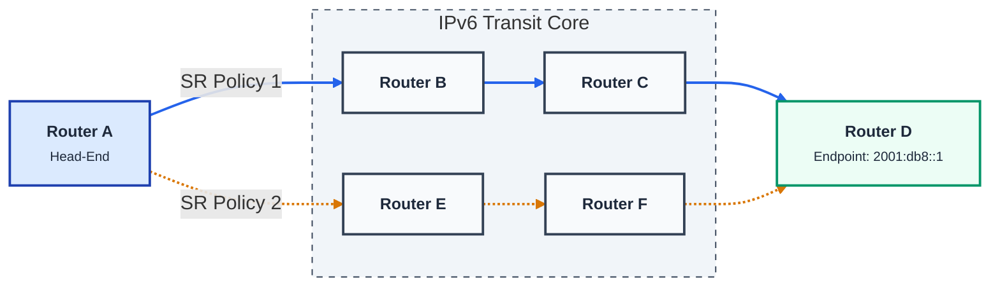
Router A is the head-end. Behind Router D sit one or more service prefixes (e.g. `2001:db8:100::/48`). Two SR Policies exist on A — both reach D, but along different physical paths:

| SR Policy | Path | Typical SLA characteristic |
| --------- | ---- | -------------------------- |
| Policy 1  | A → B → C → D | Short hop count, low latency |
| Policy 2  | A → E → F → D | More hops, higher capacity |

The head-end's job is to decide which policy a given packet takes. The rest of §4 walks through how today's answer is limiting, and what Per-Flow Steering changes.

## 4.1 Today's color-based steering and its limitation

RFC 9256 §8.4 (Color-aware BGP route resolution) ties a service prefix to an SR Policy through the Color extended community on the BGP route. The remote PE (or a controller) advertises the prefix with a Color; the head-end has one SR Policy whose `(Color, Endpoint)` matches; the route resolves to that policy. Every packet to the prefix takes that policy's path.

Mapped onto the topology above:

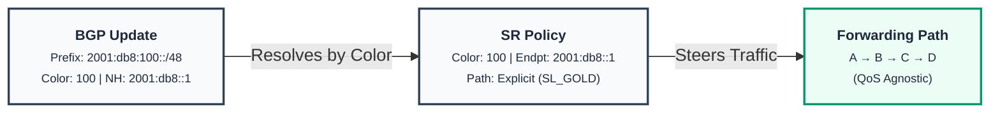

This is fine when a single path serves every SLA to the destination. But operators frequently want **different paths for different classes of traffic** to the same destination:

- Latency-sensitive flows (e.g. RoCE, VoIP, market data) on the short path (Policy 1).
- Bulk / background flows on the longer but higher-bandwidth path (Policy 2).
- Default best-effort traffic on the native IGP path.

Standard Color-based steering can't express this. The Color on the BGP route picks one SR Policy; the QoS class of an individual packet is invisible to the route-resolution step.

## 4.2 SR Policy per-flow config

This is the **policy-map equivalent** of the design — the per-flow Candidate Path body that maps each Forwarding Class (TC) carried on a packet to a forwarding action. Per-Flow Steering adds **one new candidate-path TYPE** to the existing SR Policy: `per-flow`.

RFC 9256 §8.6 admits **two structurally different shapes** for that body — a *flat* shape and a *recursive (composite)* shape — plus a third draft-stage shape (`draft-ietf-spring-sr-policy-group`) that adds a multi-endpoint Group container on top. All three compile down to the same data-plane primitive (a CBF NHG whose members are SID-list NHGs); the differences are in **configuration model** and **child-path lifecycle**. All three are described and compared below; the recursive shape is recommended for SONiC.

Everything else in the SR Policy model is unchanged regardless of which body shape is chosen — `(Color, Endpoint)` identity (RFC 9256 §2.1), multi-CP active-CP selection (§2.4 / §2.9), Color-aware BGP route resolution (§8.4), multi-color resolution (§8.4.1) — all stay exactly as RFC 9256 defines them. (The classical RFC 9256 §8.4 single-prefix-to-single-policy case is shown in §4.1 above and is **not replaced** — per-flow capability coexists with it.)

### 4.2.1 Approach 1 — Flat per-flow CP body

The per-flow CP body holds, for each TC, an *inline list of `segment-list <name> weight <W>` rows*. The segment lists are anonymous to the rest of the data model — they exist only inside this parent CP.

**Operator configuration (illustrative):**

<pre style="font-family: 'SF Mono', Menlo, Consolas, 'Courier New', monospace; font-size: 12px; line-height: 1.45; color: #1e293b; background: #f1f5f9; border: 1px solid #cbd5e1; padding: 12px 14px; border-radius: 4px;">
segment-routing traffic-eng
  policy POLICY_PER_FLOW
    color    300
    endpoint 2001:db8::1
    candidate-paths
      preference 100
        !! --- Forwarding Class 1: Supporting UCMP ---
        forwarding-class 1
          segment-list SL_GOLD_A weight 20
          segment-list SL_GOLD_B weight 80
        !! --- Forwarding Class 2: Single Path ---
        forwarding-class 2
          segment-list SL_SILVER
        forwarding-class default
          action igp
</pre>

The CP type is inferred from the body — the presence of `forwarding-class` rows under a `preference` block tells the parser this is a per-flow CP, so no explicit `per-flow` keyword is needed (some vendor implementations keep `per-flow` as an explicit level; this design omits it as redundant). Every CLI block maps to one box in the diagram below: the `policy` block is the **SR Policy** node, `candidate-paths / preference 100` is the **Candidate Path** node, each `forwarding-class` keyword is a **TC** row, and each `segment-list` keyword is a leaf SID-list node.

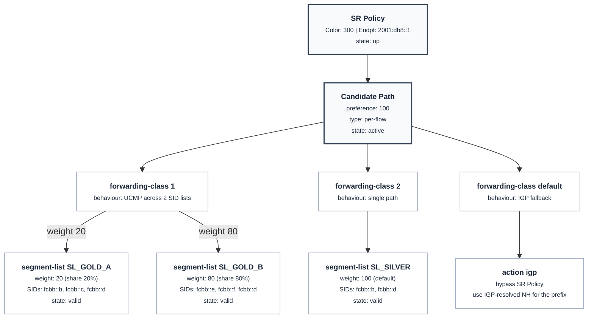

Three things the diagram makes explicit:

- **`weight` is a per-segment-list attribute.** Multiple `segment-list` rows under one TC form an ECMP/UCMP set; if all weights are equal (or omitted) the split is ECMP, otherwise UCMP. `SL_SILVER` shows the unweighted form — by convention the default weight is 100.
- **`state` is per-segment-list.** The SR Policy is up only if at least one segment list per non-IGP TC is valid; an individual invalid segment-list drops out of its TC's load-share without affecting the others. The flat structure has *no separate identity* for "the bundle of segment lists in TC 1" — its up/down state is computed inline by the parent CP.
- **`action igp` carries no segment list.** It is the only TC body that bypasses the SR Policy; legal only on the `default` TC.

Dataplane outcome (independent of the structural choice): a CBF NHG keyed by TC, where the TC-1 member is itself a weighted (UCMP) sub-NHG over the two SID-list NHGs.

### 4.2.2 Approach 2 — Recursive (composite) per-flow CP body

The per-flow CP body holds `traffic-class N color M` rows. Each `color M` resolves to a *separate, first-class SR Policy* `(Color = M, Endpoint = E)` carrying its own candidate paths and segment lists. ECMP/UCMP within a TC is provided by the **child** policy's existing `explicit` (or `dynamic`) CP carrying multiple weighted segment lists — the standard RFC 9256 §2.6 mechanism, unchanged.

**Operator configuration (illustrative):**

<pre style="font-family: 'SF Mono', Menlo, Consolas, 'Courier New', monospace; font-size: 12px; line-height: 1.45; color: #1e293b; background: #f1f5f9; border: 1px solid #cbd5e1; padding: 12px 14px; border-radius: 4px;">
segment-routing traffic-eng

  !! ----- Child SR Policies (ordinary explicit CPs) -----
  policy POLICY_GOLD
    color    100
    endpoint 2001:db8::1
    candidate-paths
      preference 100
        explicit
          segment-list SL_GOLD_A weight 20
          segment-list SL_GOLD_B weight 80

  policy POLICY_SILVER
    color    200
    endpoint 2001:db8::1
    candidate-paths
      preference 100
        explicit
          segment-list SL_SILVER

  !! ----- Parent per-flow SR Policy referencing children by Color -----
  policy POLICY_PER_FLOW
    color    300
    endpoint 2001:db8::1
    candidate-paths
      preference 100
        traffic-class 1       color 100
        traffic-class 2       color 200
        traffic-class default action igp
</pre>

Same inference rule applies to the parent: the presence of `traffic-class N color M` rows under `preference 100` tells the parser this is a per-flow CP. Each `policy` block in the config corresponds to one box in the diagram below: the two child `policy` blocks (Color 100, 200) become the green **Child SR Policy** nodes; the parent `policy` block (Color 300) is the top **SR Policy (Parent)** node; the `traffic-class N color M` rows are the TC arrows pointing from the parent to each child.

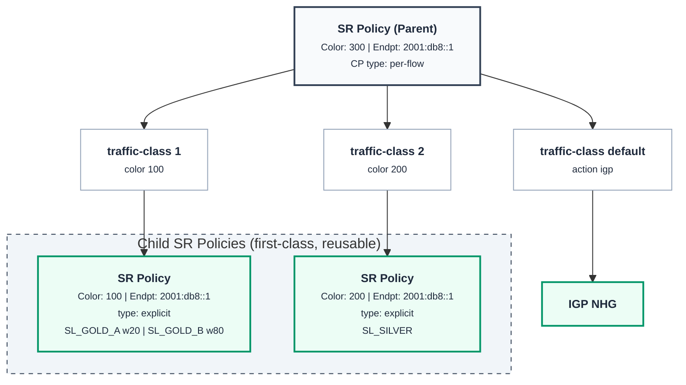

The same segment-list set (e.g. `SL_GOLD_A / SL_GOLD_B`) is now reachable in three different ways without duplication:

- Through this parent for TC 1 traffic.
- Through any other per-flow parent that maps some TC to color 100.
- Directly, via a colour-only BGP route carrying Color 100 (the standard §8.4 case shown in §4.1).

The recursive shape supports four operationally distinct steering scenarios with one set of primitives: one set of SR Policies and one set of candidate paths. They are walked through below.

#### 4.2.2.1 Scenario A — Per-flow steering (the core new capability)

A per-flow candidate path keeps the **SR Policy** key untouched (`(Color, Endpoint)` per RFC 9256 §2.1) and adds a *body* of `traffic-class → color` rows. Each row's `color` resolves to an existing child SR Policy on the same Endpoint; the row's TC value is the per-packet selector. RFC 9256 §2.4 explicitly admits new CP types — `per-flow` is one such type.

Conceptually a per-flow policy maps to a **single CBF Next-Hop Group** at the head-end. The diagram below shows one such policy (`(300, 2001:db8::1)` → `CBF_NHG3`) reached by a colored BGP route; an independent peer policy on the same endpoint (`(400, 2001:db8::1)` → `CBF_NHG4`) would behave identically with its own TC→color mapping, so two BGP routes carrying different Colors can land on different CBF NHGs while reusing the same child SR Policies in any order (see Scenario C for the side-by-side view).

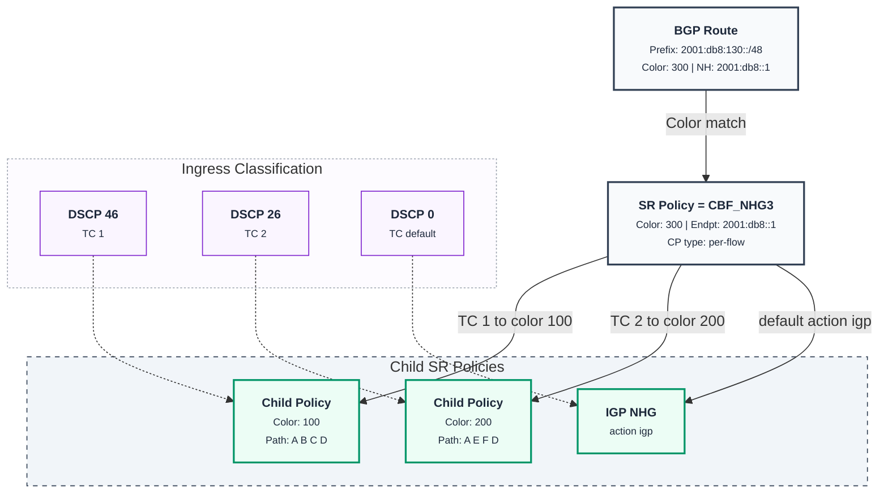

Key properties illustrated above:

- **One color → one CBF NHG.** The route's single Color extcomm picks one parent SR Policy; its `traffic-class → color` body fans the traffic out across child policies on the same endpoint.
- **Children are ordinary SR Policies.** `color 100` and `color 200` are normal explicit/dynamic policies — they are not new entities. They can be referenced directly by other colored BGP routes, or reused under several per-flow parents in different orders.
- **`default` is special.** `action igp` bypasses the SR Policy entirely and forwards via the IGP-resolved next-hop for the prefix; alternatively `default color M` chains to an explicit fallback color. The two are mutually exclusive on a single CP.
- **Remote PE / controller is unaware of the head-end split.** Only one Color is ever signalled; the per-flow fan-out is a local head-end construct.

#### 4.2.2.2 Scenario B — Per-flow primary + explicit backup on the same SR Policy

Pure RFC 9256 §2.4 / §2.9 — multiple CPs of different types on one policy. Active-CP selection picks the best valid one. The per-flow CP is the primary; if all of its referenced children become invalid and it carries no `default action igp`, the explicit backup CP takes over.

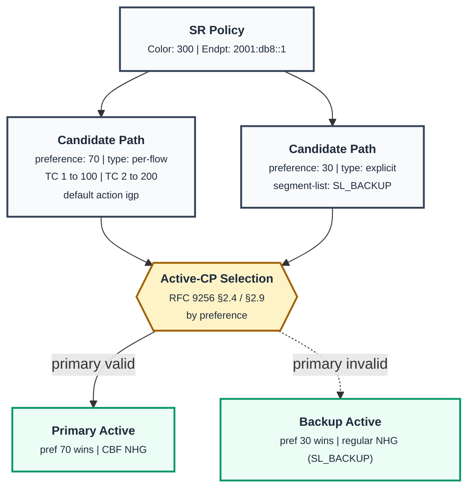

The route bound to this policy is rebound to a different NHG when active-CP selection changes — no BGP re-signalling, no schema change. The fallback semantics are entirely those of the existing SR-Policy machinery.

#### 4.2.2.3 Scenario C — Different CBFs for different prefixes

Multiple per-flow SR Policies coexist, each with its own `(Color, Endpoint)` and its own `traffic-class → color` mapping. BGP routes choose between them via Color. The same child policies can be referenced in *different orders* by different per-flow parents.

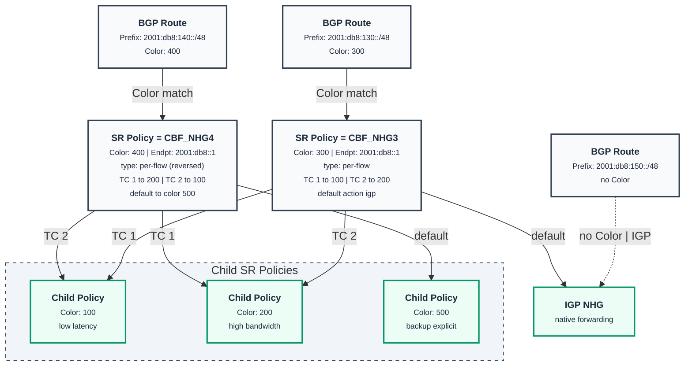

Two CBF behaviours over the same children, no new construct. If an operator wants `2001:db8:150::/48` (which arrives without a Color) to also use a CBF, the standard FRR receive-side route-policy can stamp a local Color community on it during BGP receive — that's existing FRR functionality, not a per-flow-specific feature.

#### 4.2.2.4 Scenario D — Multi-color BGP route (RFC 9256 §8.4.1)

A route arrives with several Color extcomms, implicitly priority-ordered. The standard §8.4.1 resolution picks the highest-priority valid `(Color, Endpoint)`. If that policy happens to be per-flow, the route binds to its CBF NHG; if explicit, to its regular NHG. The §8.4.1 step is unchanged; per-flow steering rides on top of it.

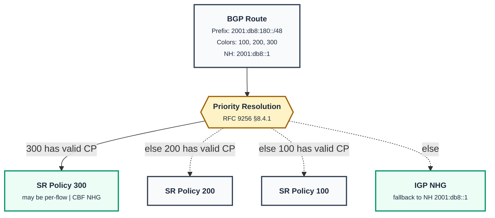

If `SR Policy 300` is itself a per-flow policy, the route effectively says "deliver this prefix via the per-flow CBF, with two priority-ordered fallback colors if the CBF is unavailable". That composability falls out of the design for free.

---

**Summary — the configuration primitives across all four scenarios:**

- One `SR_POLICY` per `(color, endpoint)` — RFC 9256 §2.1, unchanged.
- One or more `candidate-path` entries per policy — types `explicit`, `dynamic`, or `per-flow`. Active-CP selection per RFC 9256 §2.4 / §2.9.
- BGP route resolution by Color — RFC 9256 §8.4, §8.4.1 multi-color, unchanged.
- Operator-side route-policy on BGP receive can stamp a local Color on otherwise-uncolored routes when desired — existing FRR functionality.

Per-Flow Steering is purely the addition of the `per-flow` CP type. No new policy entity, no new BGP signalling, no new route-table semantics, no new SAI primitive. This is the IETF SRv6 Ops draft's "SRv6 Policy Group" abstraction expressed entirely within RFC 9256's existing SR Policy / Candidate Path structure.

### 4.2.3 Approach 3 — SR Policy Group (`draft-ietf-spring-sr-policy-group-00`)

The IETF SPRING WG draft [`draft-ietf-spring-sr-policy-group-00`](https://www.ietf.org/archive/id/draft-ietf-spring-sr-policy-group-00.txt) proposes a third structural shape: keep Approach 2's recursive children **and** add an outer "SR Policy Group" container above the parent SR Policy. The Group is keyed by color-only (no endpoint) and seeds parent SR Policies across many endpoints from a single service → child-color map.

**Operator configuration (illustrative):**

<pre style="font-family: 'SF Mono', Menlo, Consolas, 'Courier New', monospace; font-size: 12px; line-height: 1.45; color: #1e293b; background: #f1f5f9; border: 1px solid #cbd5e1; padding: 12px 14px; border-radius: 4px;">
segment-routing traffic-eng

  ! ----- Constituent SR Policies (per endpoint, ordinary RFC 9256) -----
  policy POLICY_GOLD_E1
    color    100
    endpoint 2001:db8::e1
    candidate-paths
      preference 100
        explicit segment-list SL_GOLD_E1

  policy POLICY_SILVER_E1
    color    200
    endpoint 2001:db8::e1
    candidate-paths
      preference 100
        explicit segment-list SL_SILVER_E1

  policy POLICY_GOLD_E2
    color    100
    endpoint 2001:db8::e2
    candidate-paths
      preference 100
        explicit segment-list SL_GOLD_E2

  policy POLICY_SILVER_E2
    color    200
    endpoint 2001:db8::e2
    candidate-paths
      preference 100
        explicit segment-list SL_SILVER_E2

  !! ----- SR Policy Group (color-only, no endpoint) -----
  sr-policy-group VPN1
    color 1
    service-mapping
      service-1 color 100        ! voice
      service-2 color 200        ! video
    apply-to-endpoints
      2001:db8::e1
      2001:db8::e2

  !!Parent SR Policies (color=1, endpoint=E1/E2) are auto-instantiated
  !! by pathd from the Group above. No explicit per-endpoint config
  !! for the parent layer is needed.
</pre>

The three CLI blocks correspond directly to the three layers in the diagram below: the four `policy` blocks (Color 100 / 200 at two endpoints) become the green **Constituent SR Policy** nodes; the `sr-policy-group VPN1` block is the amber **SR Policy Group** node at the top; the two grey **Parent SR Policy** nodes in the middle have no explicit CLI — they are derived by pathd when each endpoint is learned.

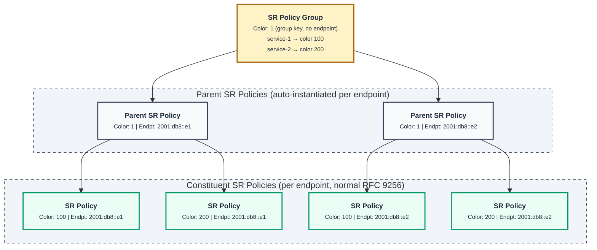

#### 4.2.3.1 What the draft proposes

A three-level hierarchy. The Group adds an outer container keyed by color-only (no endpoint); Parent SR Policies are auto-instantiated per endpoint from the Group; Constituent SR Policies are ordinary RFC 9256 policies referenced by Color.

Key properties of the draft's model:

- **Group identity** is `<color>` only — *not* `(color, endpoint)`. The Group is shared across endpoints.
- **Parent SR Policy** identity is `(color, endpoint)` — same key as ordinary RFC 9256 §2.1. The parent's body is *derived* from the Group's service → child-color map; the operator does not write a per-parent body.
- **Constituent SR Policies** are ordinary `(color, endpoint)` policies — i.e. *recursive children referenced by color*, the same structural choice as Approach 2.
- The draft's **RFC anchor** is RFC 9256 §2.2 (composite candidate path), not §8.6 directly.

#### 4.2.3.2 What this HLD adopts from the draft

- **Recursive child structure.** The draft validates Approach 2: the only SPRING-WG document on multi-class steering picks the same color-referenced child structure. This strengthens the rejection of the flat structure.
- **Terminology alignment, where it doesn't conflict.** "Constituent SR Policy" in the draft maps cleanly to "child SR Policy" in this HLD; "parent SR Policy" maps to "SR Policy with active per-flow CP". The naming will be reviewed against the draft as it stabilises through the WG, and YANG / API names will be re-checked at that point.

#### 4.2.3.3 What this HLD does **not** adopt from the draft

The **Group entity itself** — the color-only outer container that automates multi-endpoint instantiation. This HLD stays at two levels:

<pre style="font-family: 'SF Mono', Menlo, Consolas, 'Courier New', monospace; font-size: 12px; line-height: 1.45; color: #1e293b; background: #f1f5f9; border: 1px solid #cbd5e1; padding: 12px 14px; border-radius: 4px;">
(Color, Endpoint) SR Policy  ──with per-flow CP──►  child (Color, Endpoint) SR Policies
</pre>

A SONiC operator who wants the same `service → color` map applied to N endpoints today writes N per-flow CPs (one per endpoint) instead of one Group.

#### 4.2.3.4 Why the Group layer is deferred for v1

| Reason | Detail |
| ------ | ------ |
| **Draft is at -00** | The version-00 syntax, YANG, and resolution semantics are likely to change as the draft progresses through the WG. Locking SONiC into the -00 shape now creates avoidable churn later. |
| **New identity axis** | A color-only Group introduces a third identity dimension (group-color vs policy-color vs endpoint) that operators must learn. Today's `(color, endpoint)` keying covers the targeted single-endpoint use cases without that mental load. |
| **New control-plane plumbing** | Modelling a Group requires new YANG containers, new CONFIG_DB tables, new FRR pathd lifecycle (instantiate parents from groups as endpoints are learned), and new resolution logic. None of these are needed by the targeted v1 use cases. |
| **Manageable duplication** | At v1 scale, multi-endpoint cases are expressed by repeating the per-flow CP per endpoint. The N×M duplication is real but tolerable; the SONiC mgmt-framework can generate it from a higher-level template if/when needed. |

#### 4.2.3.5 When this would be revisited

If operators report multi-endpoint per-flow duplication as a real operational pain (broadly: dozens of endpoints sharing identical TC → child-color maps), the Group abstraction can be added on top of the existing per-flow CP type **without breaking the v1 schema** — Groups become a generator of per-flow CPs, not a replacement. A follow-up HLD would cover that addition once the draft stabilises.

### 4.2.4 Comparison of the three approaches

| Aspect | Approach 1 — Flat | Approach 2 — Recursive (chosen) | Approach 3 — SR Policy Group |
| ------ | ----------------- | ------------------------------- | ---------------------------- |
| Top-level entity | SR Policy `(color, endpoint)` | SR Policy `(color, endpoint)` | **Group** `(color)` → SR Policies |
| Identity of "what TC *N* forwards through" | Anonymous segment-list set in the parent CP | Real SR Policy `(Color = M, Endpoint = E)` | Same as Approach 2 (constituents) |
| Multi-endpoint reuse of a service map | Duplicate the entire body per endpoint | Duplicate the per-flow CP per endpoint | Auto-instantiated parents from one Group |
| ECMP/UCMP within a TC | New: weighted `segment-list` rows | Free — child CP's weighted SID lists (§2.6) | Same as Approach 2 |
| Reuse by a colour-only BGP route | Not possible — SID lists are anonymous | Yes — `(Color, Endpoint)` is normal SR Policy | Yes — constituents are normal SR Policies |
| Per-path lifecycle (BFD, validity, alt CPs) | Per-TC set has no independent identity | Each child is a full SR Policy with full lifecycle | Same as Approach 2 |
| Number of identity axes | 1 (just policy `(color, endpoint)`) | 1 (just policy `(color, endpoint)`) | 2 (Group `color`  +  policy `(color, endpoint)`) |
| FRR pathd code path | New nested-body parser | Reuses existing "CP NHG → other policy NHG" plumbing | New Group lifecycle + auto-instantiation engine |
| Operator's single-place view of a flow's full path | Yes — one CP body shows everything | Two-level lookup (parent CP + child color) | Three-level lookup (Group + parents + constituents) |
| RFC / draft anchor | RFC 9256 §8.6 + §2.6 | RFC 9256 §8.6 + §2.1 | RFC 9256 §2.2 + `draft-ietf-spring-sr-policy-group` |
| Standards maturity | Vendor implementations, no IETF doc | RFC 9256 (extension) | IETF SPRING WG draft, version 00 |

### 4.2.5 Why Approach 2 (recursive) is recommended

Approach 2 is chosen over both alternatives. The reasoning splits cleanly along the two structural axes — *child shape* (flat vs recursive) and *multi-endpoint layer* (none vs Group).

**Versus Approach 1 — child shape.** The recursive shape wins on four counts:

1. **Smaller delta against existing code paths.** FRR pathd, SONiC `cbfnhgorch`, and SAI `NEXT_HOP_GROUP_TYPE_CLASS_BASED` already know how to point a CBF NHG member at another NHG. The recursive design is a literal extension of that plumbing: the per-flow CP's NHG is a CBF NHG whose members are existing-policy NHGs. The flat structure would require a new body-parser in pathd, a new YANG / CONFIG_DB shape, and new per-TC lifecycle handling.
2. **Reuse and composability.** A child SR Policy `(Color = 100, Endpoint = E)` can serve as a per-flow TC target **and** as the direct target of a colour-only BGP route — both come for free from RFC 9256 §8.4. Scenarios A–D above are direct consequences of this composability.
3. **Independent child lifecycle.** BFD failures, segment-list invalidation, and backup-CP fallback all operate at the child-policy level. The parent doesn't need to model these — it inherits whatever NHG the child currently resolves to.
4. **Alignment with the only WG-level draft.** `draft-ietf-spring-sr-policy-group` chose the same recursive child shape. Picking flat would diverge from the only SPRING-WG document on per-flow steering.

**Versus Approach 3 — multi-endpoint layer.** Approach 3 inherits Approach 2's recursive children and adds a Group layer on top. The reasons to defer that layer for v1 are listed in §4.2.3.4: draft-00 instability, new operator identity axis, new control-plane plumbing, and that the duplication problem is manageable at v1 scale. Critically, **the Group abstraction can be added later on top of Approach 2 without breaking the schema** — Groups become a generator of Approach-2 per-flow CPs, not a replacement.

The flat structure remains valid where single-place visibility outweighs composability (some vendor SR-TE implementations use this shape), and the Group structure becomes attractive at larger multi-endpoint scale. This subsection exists so the trade-offs don't get relitigated.

### 4.2.6 Uncolored BGP routes

Approach 2 (and Approach 3) resolve a BGP route to a per-flow SR Policy by the route's Color extended community (RFC 9256 §8.4). Routes that arrive **without** a Color can still participate in per-flow steering — the mechanism is **existing FRR functionality**, not a new feature of this design: the operator configures a receive-side route-policy that stamps a local Color extcomm on selected prefixes during BGP ingress. After that, standard §8.4 / §8.4.1 resolution applies, and if the local Color identifies a per-flow SR Policy, the route binds to its CBF NHG.

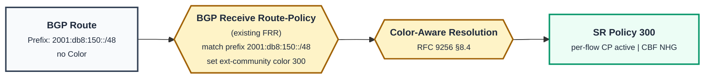

The route-policy can match on any of FRR's standard match conditions — prefix-list, AS-path, source AS, community, neighbour, and so on — so the operator can selectively color uncolored routes without having to enumerate them one by one. The "Prefix X with no Color should use CBF behaviour Y" requirement is therefore solved by **RFC 9256 §8.4 plus existing FRR route-policy** — no new construct in this design.

### 4.2.7 RFC 9256 compliance

The design preserves every wire-visible and architectural property of RFC 9256.

| RFC 9256 § | Rule | How this design preserves it |
| ---------- | ---- | ---------------------------- |
| §2.1 | SR Policy identified by `<Headend, Color, Endpoint>` | Every SR Policy — regular and per-flow — has unique `(Color, Endpoint)`. `per-flow` is a CP type, not a policy-identity discriminator. |
| §2.2 | A policy has one or more candidate paths | Unchanged. `per-flow` is just another CP. |
| §2.4 | Multiple CPs on one policy with active-CP selection | Unchanged. `per-flow` coexists with `explicit` / `dynamic` CPs at different preferences. |
| §2.9 | Tie-break by protocol-origin / originator / discriminator | Unchanged. `per-flow` CPs participate in the same tie-break. |
| §8.4 | Color-aware BGP route resolution | Unchanged. The route's Color matches the SR Policy's Color; the type of the active CP decides what NHG the route binds to. |
| §8.4.1 | Multi-color route resolution | Unchanged. Each Color is a self-contained SR Policy; the highest-priority valid Color wins (see §4.2.2 Scenario D for the conceptual walk-through). |

The new construct (`per-flow` CP type) lives strictly inside the CP — which RFC 9256 §2.4 already treats as extensible. The wire-visible parts (BGP Color extcomm, the `(Color, Endpoint)` identity, the §8.4 / §8.4.1 resolution semantics) are unchanged.

The implementation-side property mirrors this: the **route-resolution side of FRR is CP-type-agnostic**. It binds to whatever NHG the SR Policy currently resolves to, without inspecting the active CP's type. When active-CP selection later flips between types (e.g. a per-flow CP becomes invalid and an `explicit` backup takes over), only the policy's NHG handle is rebound — no BGP re-signalling, no route-table rewrite.

For the uncolored-BGP-route case (prefixes that arrive without a Color extcomm and still need to land on a per-flow SR Policy), see §4.2.6 above.

## 4.3 Class-map config

The **class-map equivalent** in this design is the existing SONiC CBF (Class-Based Forwarding) infrastructure — the same set of tables and orchagents described in the [SONiC CBF HLD](https://github.com/sonic-net/SONiC/pull/796/files) (PR #796) and its Nexthop fork at [`doc/cbf/cbf_hld.md`](https://github.com/nexthop-ai/SONiC/blob/master/doc/cbf/cbf_hld.md). v1 reuses that infrastructure unchanged and adds only the per-interface attachment mechanism (§4.4).

For v1, the only supported classifier is DSCP. The class-map is realised by the existing `DSCP_TO_FC_MAP_TABLE` in `CONFIG_DB`, which maps DSCP (0–63) to FC (0–7). `qosorch` programs `SAI_QOS_MAP_TYPE_DSCP_TO_FORWARDING_CLASS` on the interface ingress; the downstream `FC_TO_NHG_INDEX_MAP_TABLE` and `CLASS_BASED_NEXT_HOP_GROUP_TABLE` are handled by `nhgmaporch` + `cbfnhgorch` (covered in §5.6).

<pre style="font-family: 'SF Mono', Menlo, Consolas, 'Courier New', monospace; font-size: 12px; line-height: 1.45; color: #1e293b; background: #f1f5f9; border: 1px solid #cbd5e1; padding: 12px 14px; border-radius: 4px;">
DSCP_TO_FC_MAP_TABLE|MY_DSCP_MAP
  46  →  1      ! voice / latency-sensitive    → FC 1
  26  →  2      ! video / bulk                 → FC 2
  10  →  3      ! background                   → FC 3
  ...
  *   →  0      ! default                      → FC 0 (catch-all)
</pre>

**Note on `TC` vs `FC`.** The map's output is the **Forwarding Class (FC)** dataplane value (0–7). It is the same value as the **traffic-class (TC)** keyword used in §4.2's per-flow CP body (see Definition/Abbreviation).

**Limitation: `DSCP_TO_FC_MAP_TABLE` only handles DSCP.** Other flow-characteristic classifiers from `draft-geng-srv6ops-traffic-steering-to-srv6-03` — 802.1p, service-class, TE-class, MPLS EXP, 5-tuple via ACL-action, and BGP-FlowSpec — each need their own per-type CONFIG_DB table and `SAI_QOS_MAP_TYPE_*_TO_FORWARDING_CLASS` (or `SAI_ACL_ENTRY_ATTR_ACTION_SET_FORWARDING_CLASS` for ACL/FlowSpec). None of those are delivered in v1; they are listed in §2.2 as out of scope. When added in a future revision, each new classifier follows the same DSCP pattern — new CONFIG_DB table + matching `service-policy-<type>` leaf on the interface — and the per-flow SR Policy semantics (§4.2) and per-interface attachment mechanism (§4.4) remain unchanged regardless of which classifier stamps the FC.

## 4.4 Applying policy to an interface (service-policy)

A new leaf, `service-policy`, is added to the L3 interface YANG models. Its value names an existing `DSCP_TO_FC_MAP`. When set, `qosorch` programs `SAI_QOS_MAP_TYPE_DSCP_TO_FORWARDING_CLASS` on the port's ingress, so every packet entering through that interface gets an FC stamp on its metadata.

<pre style="font-family: 'SF Mono', Menlo, Consolas, 'Courier New', monospace; font-size: 12px; line-height: 1.45; color: #1e293b; background: #f1f5f9; border: 1px solid #cbd5e1; padding: 12px 14px; border-radius: 4px;">
INTERFACE|Ethernet4
  service-policy = MY_DSCP_MAP

PORTCHANNEL_INTERFACE|PortChannel10
  service-policy = MY_DSCP_MAP

VLAN_INTERFACE|Vlan100
  service-policy = MY_DSCP_MAP
</pre>

Key points:

- **What gets attached.** Only the **class-map** (DSCP→FC map) is attached per interface. The **policy-map** (per-flow SR Policy) is not, by design — it lives at the BGP/route level and is selected by Color resolution. This makes `service-policy <map>` the *only* new per-interface construct introduced.
- **Where it applies.** L3 interfaces only (routed ports, port-channel interfaces, VLAN interfaces). L2-only ports are not classified for per-flow steering in v1.
- **Direction.** Ingress only. A packet's FC is set as it enters the head-end; the FC is then consumed at egress route lookup when the per-flow SR Policy's CBF NHG selects a member. There is no egress-direction service-policy.
- **Bind / unbind semantics.** Setting / clearing the `service-policy` leaf rebinds the SAI ingress QoS map without disturbing the SR Policy state or the route table. Packets entering through an interface with no `service-policy` carry FC = 0 (the CBF default member is used).

## 4.5 Configuration flow summary

The two pieces of operator configuration described above — the class-map + service-policy on an interface (§4.3, §4.4) and the SR Policy per-flow config (§4.2) — are independent control-plane flows. They meet only at packet-forwarding time, when an FC-stamped packet is routed via a colour-selected CBF NHG. The two flows are summarised below using SRv6 addressing throughout (endpoint `2001:db8::1`, service prefix `2001:db8:100::/48`).

**Flow 1 — Class-map and interface attachment.** Operator creates a `DSCP_TO_FC_MAP_TABLE` entry and binds it to an L3 interface via the `service-policy` leaf. `qosorch` reads CONFIG\_DB and programs `SAI_QOS_MAP_TYPE_DSCP_TO_FORWARDING_CLASS` on the port's ingress.

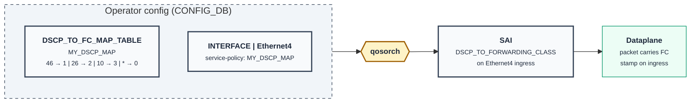

**Flow 2 — SR Policy per-flow config.** Operator creates two child SR Policies (ordinary explicit CPs) and one parent per-flow SR Policy whose `traffic-class N color M` body references them. FRR pathd resolves the children, builds the CBF NHG, and emits the APPL\_DB entries via fpmsyncd. The `nhgmaporch` + `cbfnhgorch` orchagents then create the SAI objects.

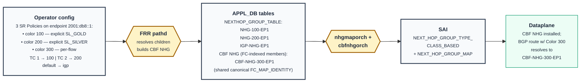

**Convergence point.** The two flows above are wired together only at packet-forwarding time:

- Flow 1's outcome is per-interface: a packet enters with a DSCP value and exits the ingress port with an FC stamped on its metadata.
- Flow 2's outcome is per-route: any BGP service route advertised with `Color = 300` and next-hop `2001:db8::1` resolves to `CBF-NHG-300-EP1` at install time.
- At forwarding time the route lookup hits `CBF-NHG-300-EP1`; the CBF member-selection logic indexes the FC-MAP with the packet's FC; the selected child NHG (`NHG-100-EP1` for FC 1, `NHG-200-EP1` for FC 2, `IGP-NHG-EP1` for any other FC including 0) drives the SRv6 encapsulation.

## 4.6 Data flow (packet processing)

This summarises what happens to an individual packet at runtime once the two configuration flows above have produced their dataplane objects. The example follows a packet destined for `2001:db8:100::5` (within the routed prefix `2001:db8:100::/48` advertised by BGP with `Color = 300, NH = 2001:db8::1`), entering the head-end on `Ethernet4` with `DSCP = 46`.

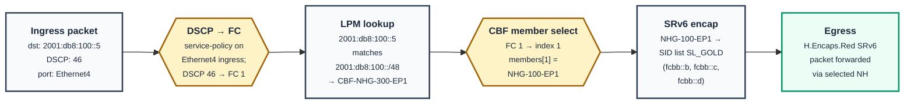

Walk-through:

1. **Ingress.** Packet arrives on `Ethernet4` with DSCP 46. The interface has `service-policy = MY_DSCP_MAP` attached (from §4.4 / §4.5 Flow 1).
2. **DSCP → FC.** `qosorch`-programmed `SAI_QOS_MAP_TYPE_DSCP_TO_FORWARDING_CLASS` stamps **FC = 1** on the packet metadata.
3. **LPM lookup.** Route table lookup for destination `2001:db8:100::5` matches `2001:db8:100::/48`, whose `nexthop_group` is **`CBF-NHG-300-EP1`** (installed by Flow 2).
4. **CBF member select.** Because the matched NHG is `SAI_NEXT_HOP_GROUP_TYPE_CLASS_BASED`, the ASIC indexes its `members[]` directly by the packet's FC value (the design uses a system-wide identity FC→index map). **FC 1 → `members[1]` = `NHG-100-EP1`** (the child SR Policy NHG for Color 100).
5. **SRv6 encap.** `NHG-100-EP1` points to the FEC_SRH chain for segment-list `SL_GOLD` (SIDs `fcbb::b, fcbb::c, fcbb::d`). The head-end performs H.Encaps.Red (RFC 8986 §5.2): outer IPv6 header + reduced SRH + the inner packet.
6. **Egress.** Encapsulated packet is forwarded to the egress port for the first SID (`fcbb::b`).

Alternative FC paths through the same `CBF-NHG-300-EP1`:

- DSCP 26 (FC 2) → member index 2 → `NHG-200-EP1` → segment-list `SL_SILVER`.
- DSCP 0 (FC 0) or unmapped DSCP → member index 0 (default) → `IGP-NHG-EP1` → native IPv6 forwarding to `2001:db8::1` (no SRv6 encap; `default action igp`).

The per-step SAI / orchagent detail is summarised in §5.7.

---

# 5 Feature Design

**Scope of changes — one feature, one new piece of logic.** The only new design-level piece of code is in **FRR pathd**: recognising the `per-flow` CP type, resolving its `traffic-class N color M` references to child SR Policy NHGs, and materialising a CBF NHG. Everything below pathd is **architecturally untouched** — `qosorch`, `cbfnhgorch`, `nhgmaporch`, `routeorch`, `srv6orch`, and SAI all execute their existing code paths against existing tables. The only incidental plumbing is in `fpmsyncd`, which gains new DPLANE-op message handlers to carry the CBF-NHG / FC-map entries from pathd into the existing APPL\_DB tables (no new tables). **No new SAI primitive is introduced.** The new operator-facing YANG additions — the interface `service-policy` leaf (§4.4) and the `SR_POLICY_CANDIDATE_PATH_PER_FLOW` module (§5.9) — sit on top of unmodified existing infrastructure.

## 5.1 Existing infrastructure we build on

Three pieces of SONiC are already in place; this design wires them together via FRR pathd.

<pre style="font-family: 'SF Mono', Menlo, Consolas, 'Courier New', monospace; font-size: 12px; line-height: 1.45; color: #1e293b; background: #f1f5f9; border: 1px solid #cbd5e1; padding: 12px 14px; border-radius: 4px;">
SR Policy / pathd (FRR — patches 0018, 0207, 0215, 0222)
  - SR Policy + CP objects with SRv6 SID lists
  - srte_color on BNC; first-SID validation; dual-register per RFC 9256
  - DPLANE_OP_SID_LIST_*, DPLANE_OP_PIC_CONTEXT_*

CBF (Class-Based Forwarding — existing CBF HLD)
  - CONFIG_DB:  DSCP_TO_FC_MAP_TABLE            (DSCP → FC, per CBF HLD)
  - APPL_DB:    FC_TO_NHG_INDEX_MAP_TABLE       (FC → member index)
                CLASS_BASED_NEXT_HOP_GROUP_TABLE (members + selection_map)
                NEXTHOP_GROUP_TABLE              (regular NHGs)
                ROUTE_TABLE                      (route → CBF NHG)
  - orchagent:  qosorch, nhgmaporch, cbfnhgorch, routeorch
  - SAI:        SAI_QOS_MAP_TYPE_DSCP_TO_FORWARDING_CLASS,
                SAI_OBJECT_TYPE_NEXT_HOP_GROUP_MAP,
                SAI_NEXT_HOP_GROUP_TYPE_CLASS_BASED  (SAI PR 1193).

SRv6 dataplane (FEC chain on Broadcom DNX; equivalent on other targets)
  Route → NHG → FEC_SRH → SRH base EEDB → SID chain → FEC_IPv6 → FEC_ARP → port.
  Reuses SONiC-created RIF, VRF, neighbor. See §7 References for the Broadcom
  SDK POC commits this design was validated against.
</pre>

What's missing for per-flow steering is the **glue** between SR Policy and CBF: a pathd CP type that, when active, materialises a CBF NHG referencing other policies' NHGs.

## 5.2 Configuration model: per-flow as a candidate-path type

A regular policy:

<pre style="font-family: 'SF Mono', Menlo, Consolas, 'Courier New', monospace; font-size: 12px; line-height: 1.45; color: #1e293b; background: #f1f5f9; border: 1px solid #cbd5e1; padding: 12px 14px; border-radius: 4px;">
policy color 100 endpoint 2001:db8::1            <-- yields NHG-100-EP1
  candidate-path 50 type explicit
    segment-list SL1
    segment-list SL2
</pre>

A per-flow policy, expressed entirely with standard SR-Policy semantics:

<pre style="font-family: 'SF Mono', Menlo, Consolas, 'Courier New', monospace; font-size: 12px; line-height: 1.45; color: #1e293b; background: #f1f5f9; border: 1px solid #cbd5e1; padding: 12px 14px; border-radius: 4px;">
policy color 300 endpoint 2001:db8::1            <-- yields CBF-NHG-300-EP1
  candidate-path 70 type per-flow
    traffic-class 1 color 100                <-- TC=1 → NHG-100-EP1
    traffic-class 2 color 200                <-- TC=2 → NHG-200-EP1
    traffic-class default action igp         <-- default → IGP NHG to 2001:db8::1
</pre>

Properties:

- A per-flow CP is just another CP type, on equal footing with `explicit` and `dynamic`. Active-CP selection follows RFC 9256 §2.4 / §2.9 unchanged. A per-flow policy can have a backup explicit CP, or vice versa.
- The per-flow CP references other policies by Color (and the parent's Endpoint). It does not embed segment lists. The referenced children must themselves resolve to valid NHGs when the per-flow CP is materialised.
- The CBF NHG that pathd materialises has one member per `traffic-class N` entry plus a default member. Member ordering aligns with the `FC_TO_NHG_INDEX_MAP_TABLE` indices.

## 5.3 Service-policy on interface (DSCP → FC stamping)

A new leaf `service-policy` is added to the three L3 interface YANG models (`sonic-interface.yang`, `sonic-portchannel.yang`, `sonic-vlan.yang`). Its value names an existing `DSCP_TO_FC_MAP_TABLE` entry. The mgmt-framework renders the leaf into the existing `PORT_QOS_MAP.dscp_to_fc_map` field; `qosorch` then programs `SAI_QOS_MAP_TYPE_DSCP_TO_FORWARDING_CLASS` on the port's ingress through its existing code path (the same path it already executes for CBF).

<pre style="font-family: 'SF Mono', Menlo, Consolas, 'Courier New', monospace; font-size: 12px; line-height: 1.45; color: #1e293b; background: #f1f5f9; border: 1px solid #cbd5e1; padding: 12px 14px; border-radius: 4px;">
augment INTERFACE / PORTCHANNEL_INTERFACE / VLAN_INTERFACE:
  +--rw service-policy?   string   // name of a DSCP_TO_FC_MAP_TABLE entry
</pre>

`DSCP_TO_FC_MAP_TABLE` itself is unchanged from the CBF HLD. The class-map → interface attachment is the **only** new YANG / mgmt-framework piece introduced by this design on the class-map side; `qosorch` and SAI are untouched.

## 5.4 FRR pathd: per-flow CP and CBF NHG construction

When a policy's active CP is per-flow, pathd:

1. Resolves each `traffic-class N color M` entry to the active NHG of policy `(M, parent.endpoint)`. If that child policy is not yet valid, the entry is held pending; pathd re-evaluates when the child transitions.
2. Resolves `traffic-class default action igp` to the IGP NHG for `parent.endpoint`; `action color M` resolves to that policy's NHG.
3. Builds the CBF NHG with **TC-indexed members**:
   - **Index 0** — the default member: the IGP NHG (or the child colour's NHG when `default action color M` is used).
   - **Index N (1 ≤ N ≤ 7)** — the child SR Policy NHG resolved for `traffic-class N`. Unmapped TC slots inherit the default member's OID.
   - The `members[i]` slot is indexed directly by the FC/TC value the packet carries — *no per-policy translation step.*
4. Emits the DPLANE ops carrying the CBF NHG, the (possibly new) child NHGs, and the per-route binding. `fpmsyncd` writes them into APPL\_DB.

**CBF NHG construct — what pathd materialises**

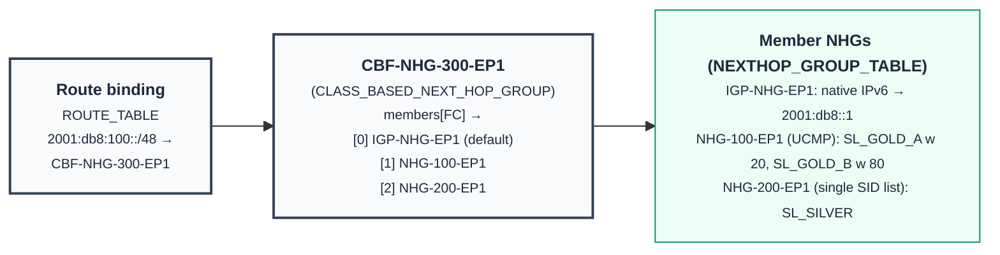

The CBF NHG's `members[]` array is indexed directly by the FC value stamped on the packet. There is **no separate per-policy FC → index map** in this design — the FC value *is* the member-array index. Each member NHG row is a normal `NEXTHOP_GROUP_TABLE` entry whose body can be:

- **A single SID list** (no ECMP) — e.g. `NHG-200-EP1: SL_SILVER` above.
- **ECMP across multiple SID lists** — multiple equal-weight (or weight-unspecified) `segment-list` entries on the child SR Policy's explicit CP.
- **UCMP across weighted SID lists** — multiple `segment-list <name> weight <W>` entries with non-equal weights, as in `NHG-100-EP1` above (20/80 split between `SL_GOLD_A` and `SL_GOLD_B`).

ECMP/UCMP within a TC therefore drops out for free from RFC 9256 §2.6 weighted segment-list semantics — the child CP carries the weighted set; the parent CBF NHG's `members[i]` slot just points at that child's NHG OID and inherits the ECMP/UCMP behaviour.

**APPL\_DB physical layout (three entities — direct FC indexing eliminates a fourth):**

| Entity | APPL\_DB table | Owned by | Purpose |
| ------ | ------------- | -------- | ------- |
| **CBF NHG** (`CBF-NHG-300-EP1`) | `CLASS_BASED_NEXT_HOP_GROUP_TABLE` | pathd-materialised per per-flow SR Policy | `members[]` ordered array of size 8 — slot `i` is the NHG for FC = `i` (slot 0 = default). |
| **Member NHGs** (`IGP-NHG-EP1`, `NHG-100-EP1`, `NHG-200-EP1`) | `NEXTHOP_GROUP_TABLE` | pathd-materialised per SR Policy color (plus one IGP fallback) | Regular NHG row: a single SID list, ECMP across SID lists, or UCMP across weighted SID lists. The CBF NHG's members are *references* into this table, not embedded copies. |
| **Route binding** | `ROUTE_TABLE` | pathd-materialised per BGP service route resolving to this policy | `nexthop_group` references the CBF NHG key. |

> **SAI-layer note.** `SAI_NEXT_HOP_GROUP_TYPE_CLASS_BASED` requires a `selection_map` attribute (an FC → member-index map). To preserve the "FC is the member index" property the design relies on, pathd uses a single **system-wide canonical identity map** (FC `i` → member index `i`) installed once at first use, and every per-flow CBF NHG references the same map. This canonical map is created and reference-counted by `nhgmaporch`; it is an implementation artefact, not a per-policy entity, and never appears in operator configuration or `show` output.

**Reference counting and reuse.** Each per-flow SR Policy gets its own CBF NHG. The **member NHGs are shared** — the same `NHG-100-EP1` is referenced both by colour-only BGP routes carrying Color 100 (the standard §8.4 case) and by every CBF NHG's slot whose TC maps to Color 100. `cbfnhgorch` maintains SAI-object reference counts so a child NHG isn't destroyed while any CBF NHG still references it. The canonical FC→index SAI map is similarly reference-counted by `nhgmaporch` and is destroyed only when no CBF NHG references it (i.e. the last per-flow CP goes away).

**Install / cleanup ordering.** Pathd emits the DPLANE ops in dependency order:

1. Member NHGs (child SR Policy NHGs and the IGP NHG) — must exist before the CBF NHG references them.
2. CBF NHG — created with `members[]` populated; references the (already-installed) canonical FC→index SAI map.
3. Route binding — set `ROUTE_TABLE.nexthop_group = CBF-NHG-300-EP1`.

Cleanup runs in reverse: route binding → CBF NHG → member NHGs. Step 3 going away (e.g. the BGP route withdraws) does not tear down the CBF NHG itself — it remains installed as long as the per-flow SR Policy is configured, so a subsequent route with the same colour can resolve onto it immediately.

**Pathd re-materialises the CBF NHG on:**

- Any referenced child policy becoming valid / invalid (member-array entries swap to the default OID, or the child re-binds when it comes back).
- Any change to the per-flow CP body (TC → color edits, or default-action edits).

**Note:** a child policy's *internal* state changing — e.g. its active CP flipping from explicit to dynamic, or its segment list changing — does **not** require rewriting the CBF members. The CBF NHG holds the child's NHG OID; the child's NHG OID is stable across its internal CP transitions (this is the same property RFC 9256 §2.4 / §2.9 active-CP selection relies on).

## 5.5 CONFIG\_DB schema

Two existing tables get a small extension; two new tables are added for the per-flow CP body.

### 5.5.1 Interface tables — new `service-policy` leaf

<pre style="font-family: 'SF Mono', Menlo, Consolas, 'Courier New', monospace; font-size: 12px; line-height: 1.45; color: #1e293b; background: #f1f5f9; border: 1px solid #cbd5e1; padding: 12px 14px; border-radius: 4px;">
INTERFACE|&lt;ifname&gt;
  service-policy = &lt;DSCP_TO_FC_MAP_TABLE key&gt;     ; NEW. Optional.

Same field on PORTCHANNEL_INTERFACE and VLAN_INTERFACE.
</pre>

### 5.5.2 SR Policy candidate-path tables

Existing `SR_POLICY_CANDIDATE_PATH_LIST` gains a new `type` enum value:

<pre style="font-family: 'SF Mono', Menlo, Consolas, 'Courier New', monospace; font-size: 12px; line-height: 1.45; color: #1e293b; background: #f1f5f9; border: 1px solid #cbd5e1; padding: 12px 14px; border-radius: 4px;">
SR_POLICY_CANDIDATE_PATH_LIST|<color>|<endpoint>|<preference>
  name = <free-text>
  type = "explicit" | "dynamic" | "per-flow"   ; "per-flow" is NEW
</pre>

A new table holds the per-flow CP body:

<pre style="font-family: 'SF Mono', Menlo, Consolas, 'Courier New', monospace; font-size: 12px; line-height: 1.45; color: #1e293b; background: #f1f5f9; border: 1px solid #cbd5e1; padding: 12px 14px; border-radius: 4px;">
SR_POLICY_CANDIDATE_PATH_PER_FLOW|<color>|<endpoint>|<preference>|<tc-key>
  ; tc-key is "1".."7" or "default"

  ; for tc-key in "1".."7":
  next_color = <uint32>                        ; child policy color
  ; OR
  action     = "igp"                           ; only valid for "default" key

  ; for tc-key "default":
  action     = "igp"
  ; OR
  next_color = <uint32>
</pre>

### 5.5.3 `DSCP_TO_FC_MAP_TABLE` — unchanged from CBF HLD

<pre style="font-family: 'SF Mono', Menlo, Consolas, 'Courier New', monospace; font-size: 12px; line-height: 1.45; color: #1e293b; background: #f1f5f9; border: 1px solid #cbd5e1; padding: 12px 14px; border-radius: 4px;">
DSCP_TO_FC_MAP_TABLE|&lt;map-name&gt;
  &lt;dscp&gt; = &lt;fc&gt;
</pre>

## 5.6 APPL\_DB schema (CBF tables reused)

No new APPL\_DB tables. All entries below already exist for CBF; this design just adds the rows pathd produces from per-flow CPs.

<pre style="font-family: 'SF Mono', Menlo, Consolas, 'Courier New', monospace; font-size: 12px; line-height: 1.45; color: #1e293b; background: #f1f5f9; border: 1px solid #cbd5e1; padding: 12px 14px; border-radius: 4px;">
NEXTHOP_GROUP_TABLE:&lt;nhg-name&gt;
  ; Existing. One per regular SR Policy's active CP and one per IGP NH path.
  segment / nexthop / weight ...

FC_TO_NHG_INDEX_MAP_TABLE:FC_MAP_IDENTITY
  ; Existing CBF table. Pathd writes ONE canonical entry per system —
  ; an identity mapping (FC i → member-index i) shared by every per-flow CBF NHG.
  0 = 0    1 = 1    2 = 2    3 = 3    4 = 4    5 = 5    6 = 6    7 = 7

CLASS_BASED_NEXT_HOP_GROUP_TABLE:&lt;cbf-nhg-name&gt;
  ; Existing. Pathd writes one per per-flow SR Policy.
  members        = &lt;NHG-default&gt;,&lt;NHG-tc1&gt;,...,&lt;NHG-tc7&gt;   ; up to 8 slots, indexed by FC
  selection_map  = FC_MAP_IDENTITY                          ; shared canonical map

ROUTE_TABLE:&lt;prefix&gt;
  ; Existing. nexthop_group can already point at a CBF NHG.
  nexthop_group = &lt;CLASS_BASED_NEXT_HOP_GROUP_TABLE key&gt;
                 OR &lt;NEXTHOP_GROUP_TABLE key&gt;     ; depending on the route's resolved policy
</pre>

The `FC_TO_NHG_INDEX_MAP_TABLE:FC_MAP_IDENTITY` row is **shared**: pathd installs it once when the first per-flow SR Policy is materialised, and every subsequent per-flow CBF NHG references the same row via its `selection_map` field. There is **no per-policy FC map**.

## 5.7 fpmsyncd, orchagent, SAI

| Component | Responsibility | Code change |
| --------- | -------------- | ----------- |
| `fpmsyncd` | Receives the new CBF-NHG and child-NHG DPLANE ops emitted by pathd over FPM/Netlink and writes them into the existing APPL\_DB tables. The single canonical `FC_MAP_IDENTITY` row is also written through this path, but **only once** (first per-flow CP). | **Small.** New DPLANE-op message handlers for the CBF NHG and (one-time) FC→index map produced by pathd. No new APPL\_DB tables; messages land in existing CBF-shape rows. |
| `qosorch` | Programs `SAI_QOS_MAP_TYPE_DSCP_TO_FORWARDING_CLASS` from `DSCP_TO_FC_MAP_TABLE`; binds it to the port via the existing `PORT_QOS_MAP.dscp_to_fc_map` field. | **None.** The new YANG `service-policy` leaf (§4.4) is rendered by the mgmt-framework into `PORT_QOS_MAP.dscp_to_fc_map` — an existing field qosorch already consumes for CBF. |
| `nhgmaporch` | Programs `SAI_OBJECT_TYPE_NEXT_HOP_GROUP_MAP` from `FC_TO_NHG_INDEX_MAP_TABLE`. Maintains a single canonical identity-mapping SAI object (`FC_MAP_IDENTITY`) shared by all per-flow CBF NHGs; ref-counted. | None. Existing CBF orch handles this — pathd just writes one shared row instead of one per CBF NHG. |
| `cbfnhgorch` | Programs `SAI_NEXT_HOP_GROUP_TYPE_CLASS_BASED` from `CLASS_BASED_NEXT_HOP_GROUP_TABLE`. | None. Existing CBF orch handles this. |
| `routeorch` | Binds routes to CBF NHG OIDs. | None. Routes pointing at CBF NHGs are already supported. |
| `srv6orch` | Programs SRv6 SID lists and per-NH FEC chains (existing). | None. |
| SAI | `SAI_NEXT_HOP_GROUP_TYPE_CLASS_BASED` selects member by `FORWARDING_CLASS` packet metadata stamped at ingress by the QoS map. | None — primitive already exists (SAI PR 1193). |

The per-flow CP in FRR pathd is the *only* new construct that requires code.

## 5.8 CLI

<pre style="font-family: 'SF Mono', Menlo, Consolas, 'Courier New', monospace; font-size: 12px; line-height: 1.45; color: #1e293b; background: #f1f5f9; border: 1px solid #cbd5e1; padding: 12px 14px; border-radius: 4px;">
# Regular policies
config srv6 policy color 100 endpoint 2001:db8::1 \
    candidate-path preference 50 type explicit segment-list SL_GOLD

config srv6 policy color 200 endpoint 2001:db8::1 \
    candidate-path preference 50 type explicit segment-list SL_SILVER

# Per-flow policy
config srv6 policy color 300 endpoint 2001:db8::1 \
    candidate-path preference 70 type per-flow \
        traffic-class 1 color 100 \
        traffic-class 2 color 200 \
        traffic-class default action igp

# Ingress DSCP → FC stamping
config qos dscp-to-fc-map TRAFFIC-CLASSIFY 46:1,26:2
config interface service-policy Ethernet4 TRAFFIC-CLASSIFY
</pre>

### Show output

<pre style="font-family: 'SF Mono', Menlo, Consolas, 'Courier New', monospace; font-size: 12px; line-height: 1.45; color: #1e293b; background: #f1f5f9; border: 1px solid #cbd5e1; padding: 12px 14px; border-radius: 4px;">
admin@sonic:~$ show srv6 policy 300 endpoint 2001:db8::1 detail
Color           : 300
Endpoint        : 2001:db8::1
Admin           : enable        Op-status: up
Candidate Paths :
  pref=70  type=per-flow  state=ACTIVE
    traffic-class 1 → color 100  (child policy 100|2001:db8::1 = up)
    traffic-class 2 → color 200  (child policy 200|2001:db8::1 = up)
    traffic-class default → IGP
HW status       : programmed as CBF NHG (CBF-NHG-300-EP1)

admin@sonic:~$ show cbf nhg CBF-NHG-300-EP1
CBF NHG          : CBF-NHG-300-EP1
Selection map    : FC_MAP_IDENTITY (system-wide canonical, 0→0..7→7)
Members          :
  index 0 (default) → IGP-NHG-EP1     pkts=12      bytes=...
  index 1 (FC 1)    → NHG-100-EP1     pkts=8000    bytes=...
  index 2 (FC 2)    → NHG-200-EP1     pkts=4345    bytes=...
Routes referencing :
  2001:db8:100::/48, 2001:db8:110::/48
</pre>

## 5.9 YANG model

The control-plane data model is expressed as **additions only** — three existing modules are augmented and one new module is introduced. No existing leaf, list, or grouping is renamed, removed, or has its type narrowed, so existing tooling, CLIs, and gNMI clients continue to work unchanged.

### 5.9.1 Augment: `service-policy` leaf on interface lists

A single optional leafref is added to the three interface container lists. It binds an L3 interface to a `DSCP_TO_FC_MAP` so that ingress classification produces the TC value consumed by the per-flow candidate-path lookup.

<pre style="font-family: 'SF Mono', Menlo, Consolas, 'Courier New', monospace; font-size: 12px; line-height: 1.45; color: #1e293b; background: #f1f5f9; border: 1px solid #cbd5e1; padding: 12px 14px; border-radius: 4px;">
module sonic-sr-policy-per-flow-augments {

    namespace "http://github.com/sonic-net/sonic-sr-policy-per-flow-augments";
    prefix srpf-aug;
    yang-version 1.1;

    import ietf-inet-types  { prefix inet; }
    import sonic-interface  { prefix sif;  }
    import sonic-portchannel{ prefix spc;  }
    import sonic-vlan       { prefix svlan;}
    import sonic-dscp-fc-map{ prefix dfm;  }
    import sonic-sr-policy  { prefix srp;  }

    revision 2026-05-12 {
        description "Initial revision for per-flow SRv6 traffic steering.";
    }

    /* ---- service-policy on routed interfaces ---- */

    augment "/sif:sonic-interface/sif:INTERFACE/sif:INTERFACE_LIST" {
        leaf service-policy {
            type leafref {
                path "/dfm:sonic-dscp-fc-map/dfm:DSCP_TO_FC_MAP"
                   + "/dfm:DSCP_TO_FC_MAP_LIST/dfm:name";
            }
            description
              "Name of the DSCP_TO_FC_MAP applied to traffic ingressing this
               interface. The resulting Forwarding-Class (TC) is the lookup
               key into SR_POLICY_CANDIDATE_PATH_PER_FLOW for any colored
               route whose next-hop SR Policy carries a per-flow CP.";
        }
    }

    augment "/spc:sonic-portchannel/spc:PORTCHANNEL_INTERFACE"
          + "/spc:PORTCHANNEL_INTERFACE_LIST" {
        leaf service-policy {
            type leafref {
                path "/dfm:sonic-dscp-fc-map/dfm:DSCP_TO_FC_MAP"
                   + "/dfm:DSCP_TO_FC_MAP_LIST/dfm:name";
            }
        }
    }

    augment "/svlan:sonic-vlan/svlan:VLAN_INTERFACE/svlan:VLAN_INTERFACE_LIST" {
        leaf service-policy {
            type leafref {
                path "/dfm:sonic-dscp-fc-map/dfm:DSCP_TO_FC_MAP"
                   + "/dfm:DSCP_TO_FC_MAP_LIST/dfm:name";
            }
        }
    }

    /* ---- per-flow enum on existing CP type leaf ---- */

    augment "/srp:sonic-sr-policy/srp:SR_POLICY_CANDIDATE_PATH"
          + "/srp:SR_POLICY_CANDIDATE_PATH_LIST/srp:type" {
        /* The base type is the enumeration defined in sonic-sr-policy.
           YANG 1.1 allows adding new enum values via augment; the existing
           values 'explicit' and 'dynamic' are unaffected. */
        description
          "Adds enum 'per-flow' indicating that the candidate path is
           realised as a per-TC fan-out into SR_POLICY_CANDIDATE_PATH_PER_FLOW
           rather than a single segment-list.";
    }
}
</pre>

> Note on enum-extension: the SONiC base module `sonic-sr-policy.yang` defines `type` as an enumeration `{ explicit, dynamic }`. Adding `per-flow` is done by changing the base typedef in `sonic-sr-policy.yang` (single-line addition); the augment above documents the *behaviour* of the new value. If the base enum is exposed via a re-usable `typedef`, only the typedef definition is edited.

### 5.9.2 New module: `sonic-sr-policy-per-flow.yang`

The per-flow candidate-path table is a sibling of `SR_POLICY_CANDIDATE_PATH` — it shares the `(color, endpoint, preference)` key (so it points to the same RFC 9256 candidate path) and adds `tc-key` for TC-indexed fan-out.

<pre style="font-family: 'SF Mono', Menlo, Consolas, 'Courier New', monospace; font-size: 12px; line-height: 1.45; color: #1e293b; background: #f1f5f9; border: 1px solid #cbd5e1; padding: 12px 14px; border-radius: 4px;">
module sonic-sr-policy-per-flow {

    namespace "http://github.com/sonic-net/sonic-sr-policy-per-flow";
    prefix srpf;
    yang-version 1.1;

    import ietf-inet-types  { prefix inet; }
    import sonic-sr-policy  { prefix srp;  }

    organization "SONiC";
    contact      "sonic-wg-srv6";
    description
      "Per-Traffic-Class fan-out for SRv6 candidate paths of type 'per-flow'.
       One row per (color, endpoint, preference, tc-key) tuple. The
       (color, endpoint, preference) triple MUST reference an existing row
       in sonic-sr-policy:SR_POLICY_CANDIDATE_PATH_LIST whose 'type' leaf
       is 'per-flow'.";

    revision 2026-05-12 {
        description "Initial revision.";
    }

    /* ---- shared types ---- */

    typedef tc-key-type {
        type union {
            type uint8 { range "1..7"; }
            type enumeration { enum "default"; }
        }
        description
          "Forwarding-Class (TC) selector. Numeric values 1..7 match the
           DSCP_TO_FC_MAP output. The literal 'default' is the catch-all
           bucket used (a) when no DSCP_TO_FC_MAP yields a hit, or
           (b) when the egress action falls back to IGP.";
    }

    /* ---- root container ---- */

    container sonic-sr-policy-per-flow {

        container SR_POLICY_CANDIDATE_PATH_PER_FLOW {

            list SR_POLICY_CANDIDATE_PATH_PER_FLOW_LIST {
                key "color endpoint preference tc-key";

                leaf color {
                    type leafref {
                        path "/srp:sonic-sr-policy/srp:SR_POLICY_CANDIDATE_PATH"
                           + "/srp:SR_POLICY_CANDIDATE_PATH_LIST/srp:color";
                    }
                }
                leaf endpoint {
                    type leafref {
                        path "/srp:sonic-sr-policy/srp:SR_POLICY_CANDIDATE_PATH"
                           + "/srp:SR_POLICY_CANDIDATE_PATH_LIST/srp:endpoint";
                    }
                }
                leaf preference {
                    type leafref {
                        path "/srp:sonic-sr-policy/srp:SR_POLICY_CANDIDATE_PATH"
                           + "/srp:SR_POLICY_CANDIDATE_PATH_LIST/srp:preference";
                    }
                }
                leaf tc-key {
                    type tc-key-type;
                }

                /* ---- exactly one action per row ---- */

                choice action {
                    mandatory true;
                    description
                      "How packets in this TC bucket are forwarded.";

                    case next-color {
                        leaf next-color {
                            type uint32 { range "1..4294967295"; }
                            description
                              "Recursively resolve to another SR Policy
                               with the same endpoint and this color.
                               Used for primary/backup chaining and for
                               per-TC steering onto a distinct color.";
                        }
                    }

                    case igp {
                        leaf igp-fallback {
                            type empty;
                            must "../tc-key = 'default'" {
                                error-message
                                  "IGP fallback action is only permitted on "
                                + "the 'default' TC bucket.";
                            }
                            description
                              "Bypass the SR Policy entirely and forward
                               using the IGP-resolved next-hop for the
                               original BGP prefix.";
                        }
                    }
                }
            }
        }
    }
}
</pre>

Key invariants enforced by the model:

| Invariant | Mechanism |
| --------- | --------- |
| Per-flow rows must reference an existing CP with `type=per-flow` | `leafref` on `color`, `endpoint`, `preference` + control-plane validation in mgmt-framework that the referenced CP has `type='per-flow'` |
| Each TC bucket has exactly one action | `choice action { mandatory true; }` |
| `igp` fallback only on `default` bucket | `must "../tc-key = 'default'"` |
| `tc-key` values disjoint and well-typed | `union { uint8 1..7, enum 'default' }` |

### 5.9.3 What is *not* changed

| YANG module | Status | Reason |
| ----------- | ------ | ------ |
| `sonic-dscp-fc-map.yang`        | unchanged | Reused as-is for `service-policy` leafref |
| `sonic-port-qos-map.yang`       | unchanged | DSCP→TC marking unchanged |
| `sonic-class-based-next-hop-group.yang` | unchanged | Per-flow **does** use a CBF NHG at the dataplane / APPL\_DB layer, but operators do not configure it via YANG. Pathd materialises the CBF NHG (members, selection map) from `SR_POLICY_CANDIDATE_PATH_PER_FLOW` and writes it directly to APPL\_DB; the CBF YANG / CONFIG\_DB layer the existing CBF feature exposes is not on the per-flow operator path. |
| `sonic-fc-to-nhg-index-map.yang`| unchanged | The canonical `FC_MAP_IDENTITY` row is pathd-installed at first per-flow CP use; not operator-configured via YANG. |
| FRR pathd YANG (`frr-pathd.yang`) | unchanged | FRR continues to emit only `(color, endpoint)` SR Policies; per-flow fan-out is a SONiC-local construct |
| BGP route-policy YANG           | unchanged | Color stamping on uncolored BGP routes uses existing `set extcommunity color` |

### 5.9.4 Operator-visible YANG paths

The complete operator-visible footprint introduced by this feature:

<pre style="font-family: 'SF Mono', Menlo, Consolas, 'Courier New', monospace; font-size: 12px; line-height: 1.45; color: #1e293b; background: #f1f5f9; border: 1px solid #cbd5e1; padding: 12px 14px; border-radius: 4px;">
/sonic-interface:sonic-interface/INTERFACE/INTERFACE_LIST/service-policy
/sonic-portchannel:sonic-portchannel/PORTCHANNEL_INTERFACE/PORTCHANNEL_INTERFACE_LIST/service-policy
/sonic-vlan:sonic-vlan/VLAN_INTERFACE/VLAN_INTERFACE_LIST/service-policy
/sonic-sr-policy:sonic-sr-policy/SR_POLICY_CANDIDATE_PATH/SR_POLICY_CANDIDATE_PATH_LIST/type   (new enum 'per-flow')
/sonic-sr-policy-per-flow:sonic-sr-policy-per-flow/SR_POLICY_CANDIDATE_PATH_PER_FLOW/SR_POLICY_CANDIDATE_PATH_PER_FLOW_LIST/*
</pre>

All other per-flow forwarding state — the FC→SID fan-out objects, the IPv6 tunnels, the FEC chain — is **derived** by the orchagents from this YANG-modelled CONFIG_DB state and is **not** directly modelled in YANG (consistent with how `route_orch` derives ASIC objects from `ROUTE_TABLE`).

## 5.10 Warm-reboot reconciliation

Both reconciliation paths already exist; no new logic needed.

| DB           | Behaviour |
| ------------ | --------- |
| CONFIG\_DB    | Persisted; loaded by `cfgmgrd`. The new `service-policy` leaf and `SR_POLICY_CANDIDATE_PATH_PER_FLOW` rows persist alongside existing SR Policy and `DSCP_TO_FC_MAP_TABLE` rows. |
| APPL\_DB      | Reconstructed by `cbfnhgorch`, `nhgmaporch`, `qosorch`, `routeorch`, `srv6orch` from CONFIG\_DB and FRR-restored state. |
| STATE\_DB     | Preserved to drive reconciliation. |
| COUNTERS\_DB  | Preserved on warm; counters continue to advance. |
| SAI objects  | OID continuity (standard SONiC warm-reboot pattern). The CBF NHGs, the shared canonical `FC_MAP_IDENTITY`, member NHGs, and route entries are re-attached, not recreated. |

Reconciliation order: `srv6orch` (SID lists, FEC chains) → `nhgmaporch` (canonical `FC_MAP_IDENTITY`, re-installed once) → child NHGs → `cbfnhgorch` (per per-flow CBF NHG) → `routeorch` (routes). `qosorch` reconciles in parallel.

---

# 6 Unit Test

| Test Case | Pass Criteria |
| --------- | ------------- |
| Configure two regular policies (color 100/200, endpoint 2001:db8::1) and one per-flow policy (color 300, same endpoint) referencing them. | All three appear in `SR_POLICY_LIST`. Per-flow CP rows appear in `SR_POLICY_CANDIDATE_PATH_PER_FLOW`. |
| Per-flow CP becomes ACTIVE on policy 300 (first per-flow CP in the system). | pathd shows the per-flow CP active. APPL\_DB has one `CLASS_BASED_NEXT_HOP_GROUP_TABLE` entry, one canonical `FC_TO_NHG_INDEX_MAP_TABLE:FC_MAP_IDENTITY` row (installed by this first per-flow CP), and three `NEXTHOP_GROUP_TABLE` entries (two child policies + IGP default). |
| Inject BGP route 2001:db8:100::/48 with Color 300, NH 2001:db8::1. | `ROUTE_TABLE` entry's `nexthop_group` points at the CBF NHG. |
| Bind `DSCP_TO_FC_MAP` to Eth4 via `service-policy`. | `qosorch` programs the SAI QoS map and binds it to the port's ingress. |
| Send DSCP=46 packet on Eth4 to 2001:db8:100::5. | Packet egresses via child policy 100 (NHG-100-EP1) with SRH built from SL_GOLD. |
| Send DSCP=26 packet. | Packet egresses via child policy 200 with SRH built from SL_SILVER. |
| Send DSCP=0 packet. | Packet egresses via IGP NHG — native IPv6 forwarding. |
| Bring child policy 100 admin-down. | The CBF NHG's index-1 member is rebound (to the default member or to a discard NH). Other members unaffected. Route entry unchanged. |
| Bring child policy 100 back up. | CBF NHG member restored. |
| Add a backup explicit CP on policy 300 (preference 30, type explicit). | Active CP stays per-flow (preference 70 wins). Backup is present but inactive. |
| Make all per-flow CP children invalid and remove `default action igp`. | Per-flow CP becomes invalid. Backup explicit CP takes over → policy NHG (not CBF NHG). Route reconverges to the regular NHG. |
| Configure a second per-flow policy (color 400, same endpoint) with TC→child mapping in different order. | A second `CLASS_BASED_NEXT_HOP_GROUP_TABLE` row is built; both CBF NHGs reference the same `FC_MAP_IDENTITY` (no new FC-map row). A BGP route carrying Color 400 resolves to the second CBF; Color 300 still resolves to the first (§4.2.2 Scenario C). |
| Inject BGP route with multiple Color extcomms [100, 200, 300]. | Per RFC 9256 §8.4.1, route resolves to policy 300. If 300 becomes invalid, route falls back to policy 200. |
| Inject BGP route with no Color. | Resolves via IGP NHG. Existing behaviour. |
| Warm reboot under steady traffic. | Zero packet loss for in-flight flows. All CBF NHGs, the shared `FC_MAP_IDENTITY`, child NHGs, and routes restored via OID continuity. |
| Regression: existing CBF (non-SRv6) flows. | Existing CBF test suite passes unchanged. |
| Regression: existing SRv6 VPNv4/v6, uSID transit, TI-LFA. | Existing SRv6 test suite passes unchanged. |
| Regression: operator ACLs (L3 / L3V6 / MIRROR) untouched. | Existing ACL test suite passes unchanged. |

---

# 7 References

- RFC 8402, 8754, 8986, 9012, 9256 — SR architecture, SRH, SRv6 network programming, BGP Tunnel Encap, SR Policy Architecture (incl. §8.4 Color-aware steering, §8.4.1 multi-color routes, §8 Per-Flow Steering).
- draft-ietf-idr-sr-policy-safi — BGP SR Policy SAFI.
- **draft-geng-srv6ops-traffic-steering-to-srv6-03** — IETF SRv6Ops traffic-steering survey. Slides 7–10 (DSCP, 802.1p, service-class, TE-class) are the reference for this design's per-flow CP shape; "service-class" / "TE-class" in the draft correspond to our `traffic-class`.
- SONiC **CBF HLD** — Class-Based Forwarding (the prior design this work reuses verbatim).
- SAI PR 1193 — `SAI_NEXT_HOP_GROUP_TYPE_CLASS_BASED` and `SAI_OBJECT_TYPE_NEXT_HOP_GROUP_MAP`.
- SAI 1.14+ headers: `saisrv6.h`, `sainexthop.h`, `sainexthopgroup.h`, `saiqosmap.h`, `saitunnel.h`.
- Broadcom SAI SDK POC: `broadcom-sai-sdk` `srv6_flow` branch (commits through `fb3c12a` "srv6 ecmp tp end to end working for 2 members"); integration guide at `hsdk/hsdk-all/src/examples/dnx/srv6/SONIC_INTEGRATION_GUIDE.md`.
- FRR patches in this tree: 0018, 0207, 0215, 0222.
- SONiC source files this design extends: `sonic-yang-models/.../sonic-interface.yang` (and PortChannel / VLAN siblings, `sonic-sr-policy.yang`); FRR pathd northbound for the new CP type; `fpmsyncd/routesync.{h,cpp}`. No code changes required in `srv6orch`, `cbfnhgorch`, `nhgmaporch`, `qosorch`, `routeorch` beyond the new schema rows they already know how to consume.
