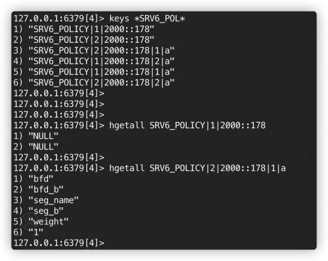

<!-- omit in toc -->
# SONiC SRv6 Policy HLD
<!-- omit in toc -->
# Revision
| Rev  |    Date    |       Author        | Change Description                                           |
|:--:|:--------:|:-----------------:|:------------------------------------------------------------:|
| 1.0  | Jun 2024 |   Eddie Ruan (Alibaba) | Initial version

<!-- omit in toc -->
# Table of Context
- [Overview](#overview)
  - [SONiC SRv6 Policy's prerequisites](#sonic-srv6-policys-prerequisites)
- [SRv6 Policy Configuration](#srv6-policy-configuration)
  - [FRR SRv6 Policy Configuration](#frr-srv6-policy-configuration)
    - [FRR Sample Configuration](#frr-sample-configuration)
  - [SONiC Policy Configuration](#sonic-policy-configuration)
    - [SRV6\_POLICY's CONFIGDB schema](#srv6_policys-configdb-schema)
    - [SRV6\_SID\_LIST's CONFIGDB schema](#srv6_sid_lists-configdb-schema)
- [SRv6 Policy Related APPDB Schemas](#srv6-policy-related-appdb-schemas)
  - [Route Schema](#route-schema)
  - [PIC Contexts schema](#pic-contexts-schema)
  - [Forwarding information NHG's schema](#forwarding-information-nhgs-schema)
  - [SID LIST Schema](#sid-list-schema)
- [Color Only Policy use case](#color-only-policy-use-case)
- [Candidate-path management in pathd](#candidate-path-management-in-pathd)
  - [Candidate path's state machine](#candidate-paths-state-machine)
  - [Candidate path without bfd configuration](#candidate-path-without-bfd-configuration)
  - [Candidate path with bfd configuration](#candidate-path-with-bfd-configuration)
    - [Policy with endpoint](#policy-with-endpoint)
    - [Policy without endpoint, a.ka. Color Only Policy](#policy-without-endpoint-aka-color-only-policy)
- [SRv6 Policy Handling Workflows in Zebra](#srv6-policy-handling-workflows-in-zebra)
  - [SID\_LIST handling workflow](#sid_list-handling-workflow)
  - [SRv6 Policy Configuration Handling Workflow](#srv6-policy-configuration-handling-workflow)
    - [zread\_srv6\_policy\_set](#zread_srv6_policy_set)
    - [zread\_srv6\_policy\_delete](#zread_srv6_policy_delete)
  - [Policy Nexthop registering workflow](#policy-nexthop-registering-workflow)
    - [Remote PE Announce routes with color](#remote-pe-announce-routes-with-color)
    - [Local PE register RNH](#local-pe-register-rnh)
  - [BGP resolve routes via SRv6 Policies](#bgp-resolve-routes-via-srv6-policies)
    - [Policy Resolving](#policy-resolving)
    - [PIC Context](#pic-context)
    - [Policy NHG](#policy-nhg)
    - [Zebra sends SRv6 Policy to fpm](#zebra-sends-srv6-policy-to-fpm)
- [Orchagent changes for SRv6 Policy](#orchagent-changes-for-srv6-policy)
- [Unit Test](#unit-test)

# Overview
The purpose of using SRv6 Policy is to provide a mechanism to steer different types of service traffic via different paths within the SRv6-based backbone network. Each policy is identified by a combination of a color and an endpoint address. The color can be used as a service indicator. The endpoint address could represent a remote PE address or a prefix. A special case is the color only case, which implicitly means that the endpoint address is "::/0". Each policy could contain a set of candidate paths. Unlike the current FRR MPLS TE approach, we allow multiple candidate paths with the same preferences and each candidate path is determined by a given sid list. This allows us to adopt multiple ECMP paths to reach a remote PE under one given policy. Since BGP routes could be learned through multiple PEs, we could have a set of policies adopted by BGP routes. The relationship among routes, policies and candidate paths is illustrated in the following diagram.

<figure align=center>
    
    <figcaption>Figure 1. SRv6 Policy <br><br><figcaption>
</figure>

Current FRR code base has already supported traffic engineering policies for MPLS segments. This HLD outlines the modifications needed to utilize the existing FRR traffic engineering policy infrastructure for managing SRv6 Policies.

## SONiC SRv6 Policy's prerequisites
SRv6 Policy requires the following features / enhancements in SONiC deployments.

1. NHG ID handling. NHG ID handlding is required by the policy modification handling.
2. Prefix Independent Convergence (PIC). PIC is for improving VPN routes' routes convergence.
3. SONiC fpm module. This module is required for supporting features/enhancements which are not supported in current Linux kernel.

# SRv6 Policy Configuration
## FRR SRv6 Policy Configuration
FRR has existing traffic engineering policy configurations in segment-routing configuration block. We extend current policy infrastructure to fit SRv6 Policy's requirements. There are four main enhancements from existing TE configurations.
1. Add "ipv6-address" as segment type for segment list for SRv6. Currently, FRR CLI only has "mpls" and "nai" as the segment type.
2. Add BFD protection to each segment list in policy.
3. Add weight for each candidate path.
4. As shown in the above diagram, allow multiple candidate paths to have the same preference within one policy. Current FRR assumes only one candidate path for each preference within one policy.

### FRR Sample Configuration
```
segment-routing
 traffic-eng
  segment-list slist_a
   index 10 ipv6-address fd00:205:205:fff5:55::
  exit
  segment-list slist_b
   index 10 ipv6-address fd00:206:206:fff6:66::
  exit
  segment-list slist_c
   index 10 ipv6-address fd00:205:205:fff5:55::
   index 20 ipv6-address fd00:207:207:fff7:77::
  exit
  segment-list slist_d
   index 10 ipv6-address fd00:206:206:fff6:66::
   index 20 ipv6-address fd00:204:204:fff4:44::
  exit
  policy color 1 endpoint 2064:100::1d
   candidate-path preference 1 name cpath_a explicit segment-list slist_a weight 1 bfd-name test3
   candidate-path preference 1 name cpath_b explicit segment-list slist_b weight 1 bfd-name test4
  exit
  policy color 3 endpoint 2064:100::1e
   candidate-path preference 1 name cpath_c explicit segment-list slist_c weight 1 bfd-name test2
   candidate-path preference 2 name cpath_d explicit segment-list slist_d weight 1 bfd-name test1
  exit
 exit
 srv6
exit
end
```
## SONiC Policy Configuration
We want to enhance SRV6_POLICY and SRV6_SID_LIST listed in https://github.com/eddieruan-alibaba/SONiC/blob/eruan-srv6p/doc/srv6/srv6_hld.md with the following modifications

### SRV6_POLICY's CONFIGDB schema
Instead of listing only segment name, we want to specify preference, weight and BFD session for a given candidate path. The candidate paths with higher preference would be selected first. If multiple candidate paths have the same preference, they would form WCMP paths based on the given weights.

```
; Modify table
; holds SRv6 policy

SRV6_POLICY supports two kinds of key:
  2-tuples = <endpoint>|<color>
  4-tuples = <endpoint>|<color>|<preference>|<cpath name>

; field = value
seg_name =segment list name,   ;
weight = weight value for this cpath
bfd = the name of bfd used for this candidate path's protection
binding_sid = binding sid value  // optional
name = the name for policy  // optional


For example:

    "SRV6_POLICY": {
        "1|2000::178": {
          "binding_sid" : "1000::aaaa",  // Optional
          "name": "policy_a"             // Optional
        },
        "2|2000::178": {
          "binding_sid" : "1000::bbbb",  // Optional
          "name": "policy_b"             // Optional
        },
        "1|2000::178|2|a": {
           "seg_name": "seg_a",
           "weight": "1",
           "bfd": "bfd_a"
        },
        "1|2000::178|1|a": {
           "seg_name": "seg_b",
           "weight": "1",
           "bfd": "bfd_b"
        },
        "2|2000::178|2|a": {
           "seg_name": "seg_a",
           "weight": "1",
           "bfd": "bfd_a"
        },
        "2|2000::178|1|a": {
           "seg_name": "seg_b",
           "weight": "1",
           "bfd": "bfd_b"
        }
    }
```
The following picture is a snapshot of SRv6 Policy schema from config db.
<figure align=center>
    
    <figcaption>Figure 2. SRv6 Policy Schema <br><br><figcaption>
</figure>

### SRV6_SID_LIST's CONFIGDB schema
We add sid list index to the existing approach to aligh SONiC's SID LIST configuraiton with FRR's SID LIST configurations.

```
; New table
; holds SRV6_SID_LIST

key = SRV6_SID_LIST|<sid_list_name>

; field = value
<sid list index> = ip address,   ; List of segment addresses

For example:

    "SRV6_SID_LIST": {
        "slist_a": {
            "10": "fd00:205:205:fff5:55::"
        },
        "slist_b": {
            "10": "fd00:206:206:fff4:44::"
        },
        "slist_c": {
            "10": "fd00:205:205:fff5:55::",
            "20": "fd00:207:207:fff7:77::"
        },
        "slist_d": {
            "10": "fd00:206:206:fff6:66::",
            "20": "fd00:204:204:fff4:44::"
        }
    },
```

# SRv6 Policy Related APPDB Schemas
The following piece is an example of VPNv4 route going via two SRv6 policies. One policy is for color 1 and the remote PE 2064:100::1d, and the other policy is for color 3 and the remote PE 2064:100::1e.

```
show ip route vrf PUBLIC-TC11 192.100.1.9/32 nexthop-group
Routing entry for 192.100.1.9/32
  Known via "bgp", distance 20, metric 0, vrf PUBLIC-TC11, best
  Last update 08:44:23 ago
  Nexthop Group ID: 8661
  PIC Context ID: 8657
  * 2064:100::1d segment-list (vrf Default), label implicit-null, seg6local unspec unknown(seg6local_context2str), seg6 fd00:201:201:fff1:11::, weight 1, srv6tunnel(endpoint|color):2064:100::1d|1
  * 2064:100::1e segment-list (vrf Default), label implicit-null, seg6local unspec unknown(seg6local_context2str), seg6 fd00:202:202:fff2:22::, weight 1, srv6tunnel(endpoint|color):2064:100::1e|3
```

## Route Schema
VPN Route uses the existing route netlink format with pic_context_id added in TLV to pass route's information from zebra to fpmsyncd. Fpmsyncd would write this route in APPDB. In the example above, VPNv4 route points NHG with id 8661 for forwarding information and 8657 for PIC context, a.k.a VPN SID information.
```
127.0.0.1:6380> hgetall "ROUTE_TABLE:Vrf10000:192.100.1.9/32"
 1) "nexthop_group"
 2) "8661"
 3) "pic_context_id"
 4) "8657"
 5) "nexthop"
 6) "na"
 7) "ifname"
 8) "na"
 9) "vni_label"
10) "na"
11) "vpn_sid"
12) "na"
13) "segment"
14) "na"
15) "seg_src"
16) "na"
17) "blackhole"
18) "false"
```

## PIC Contexts schema
PIC context is mapped from a NHG in zebra by fpmsyncd during NHG handling. The main purpose for this object is to provide VPN sid.
```
ARISTA03T1# show nexthop-group rib  8657
ID: 8657 (zebra 0x562eba98bb00)
     RefCnt: 0
     segment_ref: 10
     Uptime: 08:48:11
     VRF: Default
     Falgs: 0x403
     Valid, Installed
     SegDepends: (8583) (8658)
           via 2064:100::1d segment-list  color 1 (vrf Default), label implicit-null, seg6local unspec unknown(seg6local_context2str), seg6 fd00:201:201:fff1:11::, weight 1
           via 2064:100::1e segment-list  color 3 (vrf Default), label implicit-null, seg6local unspec unknown(seg6local_context2str), seg6 fd00:202:202:fff2:22::, weight 1
     pic nhe:8661
```

This PIC context would be stored in APPDB's PIC_CONTEXT_TABLE. The schema is the similar to current NEXTHOP_GROUP_TABLE's schema.
```
127.0.0.1:6380> hgetall "PIC_CONTEXT_TABLE:8657"
1) "nexthop"
2) "2064:100::1d,2064:100::1e"
3) "vni_label"
4) "na,na"
5) "vpn_sid"
6) "fd00:201:201:fff1:11::,fd00:202:202:fff2:22::"
7) "seg_src"
8) "2064:100::1f,2064:100::1f"
```

## Forwarding information NHG's schema
Zebra maintains a SRv6 Policy NHG in two levels. The first level is for ECMP over multiple polices, and the second level is for ECMP over multiple candidate paths.
```
show nexthop-group rib  8661
ID: 8661 (zebra 0x562eba5d0610)
     RefCnt: 0
     segment_ref: 1
     Uptime: 09:11:19
     VRF: Default
     Falgs: 0x503
     Valid, Installed
     This is a pic nhe.
     SegDepends: (8584) (8659)
        via 2064:100::1d segment-list  color 1 (vrf Default) (recursive), weight 1
           via 2064:100::1d segment-list slist_a color 1 (vrf Default), weight 1
           via 2064:100::1d segment-list slist_b color 1 (vrf Default), weight 1
        via 2064:100::1e segment-list  color 3 (vrf Default) (recursive), weight 1
           via 2064:100::1e segment-list slist_d color 3 (vrf Default), weight 1

```

Zebra collapses these two levels into one level which would be described below. With NHG ID support, we will have NHG contains a set of NH IDs, which point to candidate paths' nexthop IDs, a.k.a SRv6 Tunnel Nexthop  IDs. This part is the same as normal NHG ID handling. One new field "weight" would be added to each path of NHG. This weight is used for forming WCMP.

```
; Modify table
; holds NEXTHOP_GROUP_TABLE

key = NEXTHOP_GROUP_TABLE|<nhgid>

; field = value
weight =  <weight>,   ;
```

A new field, "segment",  would be added in nexthop schema. This field is used in candidate path's nexthop for providing sid list name.

```
; Modify table
; holds NEXTHOP_TABLE

key = NEXTHOP_TABLE|<nhgid>

; field = value
segment =  <seg name>,   ;  sid list name


```

## SID LIST Schema
SID LIST would be populated from pathd. This schema provides detail path information for each candidate path, a.k.a SID LIST.

Here is an example for SID_LIST in appdb.
```
; New table
; holds SRV6_SID_LIST_TABLE

key = SRV6_SID_LIST_TABLE|<sid_list_name>

; field = value
path= ip addresses,   ; List of segment addresses, seperated via ,

For example:

127.0.0.1:6380> keys *SID_LIST*
1) "SRV6_SID_LIST_TABLE:slist_b"
2) "SRV6_SID_LIST_TABLE:slist_d"
3) "SRV6_SID_LIST_TABLE:slist_a"
4) "SRV6_SID_LIST_TABLE:slist_c"
127.0.0.1:6380> hgetall "SRV6_SID_LIST_TABLE:slist_a"
1) "path"
2) "fd00:205:205:fff5:55::"
127.0.0.1:6380>
```

# Color Only Policy use case
The policy is determined by color only. Implicitly it means the endpoint address is ::/0. This kind of policy's UP/DOWN state is determined by candidate paths' BFD. Routes would use color attribute only to resolve to this policy. This kind of policy is servered as a default route for the given color.

# Candidate-path management in pathd
Similar to MPLS SR cases, Pathd is responsible to maintain each candidate path's status. BFD protection on candidate paths would be discussed in a separate HLD.  From zebra point of view, it would get ZEBRA_SRV6_POLICY_SET message from pathd whenever a new policy is applied or some policy information is updated. Zebra would get ZEBRA_SRV6_POLICY_DELETE message from pathd whenever a policy is deleted. Policy message carries all used SID LISTs.

## Candidate path's state machine
## Candidate path without bfd configuration
In this case, the candidate path's default state is UP. Pathd would not be able to manage cpath's state. It would be external controller's job to manage cpath's state.

## Candidate path with bfd configuration
In this case, the default state is DOWN. bfd notification would be used to update cpaths' state.

### Policy with endpoint
bfd packet would be constructed with SRv6 header which would go via both specified cpath and engpoint. The protection path would be via specified SID notes and the end point node. This protection would not cover link if the SID list is not hop by hop.

### Policy without endpoint, a.ka. Color Only Policy

bfd packet would be constructed with SRv6 header which would go via the specified cpath.

# SRv6 Policy Handling Workflows in Zebra
Zebra has the following SRv6 Policy related workflows, which are shown in the following diagram.

1. SID LIST handling workflow
2. SRv6 Policy Configuration handling workflow
3. Policy nexthop registering workflow
4. Routes handling workflow

<figure align=center>
    
    <figcaption>Figure 3. SRv6 Policy related workflows <br><br><figcaption>
</figure>

The following subsections describe the changes needed for each workflow.

## SID_LIST handling workflow
The workflow for SID LIST handling is the following.

1. Pathd sends sid lists via policy messages's zapi_sr_policy structure to zebra.
2. If a sid list is up and is used by a policy, zebra will use sonic fpm module to pass this list to fpmsyncd.
3. fpmsycnd picks up SID_LIST message and update SRV6_SID_LIST_TABLE in APPDB.
4. Orchagent gets events from SRV6_SID_LIST_TABLE, and triggers SAI api to update this list in ASICDB.

<figure align=center>
    
    <figcaption>Figure 4. SID LIST handling workflow <br><br><figcaption>
</figure>

The difference between MPLS SR TE and SRv6 Policy is that for MPLS SR, each policy has only 1 sid list at one preference, while SRv6 policy could have multiple sid list at the same preference.

## SRv6 Policy Configuration Handling Workflow
MPLS segment Policy is handled via the following two handlers in zapi_msg.c
```
	[ZEBRA_SR_POLICY_SET] = zread_sr_policy_set,
	[ZEBRA_SR_POLICY_DELETE] = zread_sr_policy_delete,
```
We would like to add the following two more handlers in zapi_msg.c for SRv6 Policies' handling.
```
	[ZEBRA_SRV6_POLICY_SET] = zread_srv6_policy_set,
	[ZEBRA_SRV6_POLICY_DELETE] = zread_srv6_policy_delete,
```

zread_srv6_policy_set() and zread_srv6_policy_delete() would be responsible for handling SRv6 policy create, update or delete events. These events could be triggered by pathd's messages based on polices, which includes candidate path UP, DOWN events, and sid list updating events.

### zread_srv6_policy_set
The policy set handler's workflow is shown in the following diagram. The overall logic for zread_srv6_policy_set() is similar to MPLS SR's zread_sr_policy_set()'s handling at high level. We need to add the following supports to the existing policy handling logic.

1. Allow candidate paths to be added, updated or removed for a policy.
2. We want to organize NHG in favor of PIC supporting, a.k.a we will have pic forwarding NHG and pic context NHG.
3. We allow color only policy support.

These requirements lead to some code enhancements from existing policy handling. The targeted workflow is the following.

<figure align=center>
    
    <figcaption>Figure 5. SRv6 Policy Set workflow <br><br><figcaption>
</figure>

1. zread_srv6_policy_set() parses "struct zapi_sr_policy" from the incoming message. The message format reuses "struct zapi_sr_policy" with new SRv6 policy specific fields added.

2.  It uses the following api "struct zebra_sr_policy *zebra_sr_policy_add_by_prefix(struct prefix *p, uint32_t color, char *name)" to create "struct zebra_sr_policy" and store it in srte_table_hash hash table, which uses color and prefix as the hash key.

3. zebra_srv6_policy_validate(). If it is a new policy, zebra would trigger zebra_srte_evaluate_rn_nexthops(), which is listed below. Otherwise zebra would trigger zebra_nhe_seg_update() to update all NHGs using this policy. zebra_nhe_seg_update() would update these NHGs including the data plane updates. Since we always have two levels NHG created, routes would point to the first level of NHG. Any policy update would lead to first level NHG update in data plane. There is no need to flush routes if the policy state is not changed.

4. zebra_srte_evaluate_rn_nexthops(). This following steps are for a new policy only. This function updates rnh, which is associated with the policy. RNH could be registered before this policy is created. When it happens, the rnh would be registered with a route node which could resolve this policy's endpoint address. In most cases, this route node is ::/0. zebra_srte_evaluate_rn_nexthops()  would backwalk through route node tree and check the rnhs associated with route node and pick up the rnh belonging to the given policy.

5. zebra_evaluate_rnh_by_srte(). a wrapper function for zebra_rnh_eval_nexthop_entry_srte()

6. zebra_rnh_eval_nexthop_entry_srte(). This function checks if the policy state via the given rnh is updated. If so, it would use zebra_rnh_store_in_srte_table() to update policy's rnh list.

7. zebra_sr_policy_notify_update(). This function is responsible to inform corresponding zebra client on updating policy's rnh event if the policy state is updated.

### zread_srv6_policy_delete
If a policy is still in UP state, this policy would be deactive first. After that, the created policy structures would be cleaned up. The overall logic is similar to MPLS TE's handling.

## Policy Nexthop registering workflow
### Remote PE Announce routes with color
Remote PE could announce VPN routes with color, which could be used as a service indication. In the following sample configuration, all vrf PUBLIC-TC11's v4 routes would be marked with color 1 via export route-map sr1. These color marking codes are existing FRR codes, there is no specific changes for SRv6 policy.

```
router bgp 64600 vrf PUBLIC-TC11
 bgp router-id 100.1.0.29
 bgp log-neighbor-changes
 no bgp default ipv4-unicast
 bgp bestpath as-path multipath-relax
 timers bgp 10 30
 neighbor 10.10.246.254 remote-as 64600
 neighbor 10.10.246.254 description exabgp_v4
 neighbor 10.10.246.254 solo
 neighbor 10.10.246.254 advertisement-interval 0
 srv6-locator lsid1
 !
 address-family ipv4 unicast
  neighbor 10.10.246.254 activate
  neighbor 10.10.246.254 soft-reconfiguration inbound
  maximum-paths 64
  rd vpn export 2:2
  rt vpn both 1:1
  route-map vpn export sr1
  export vpn
  import vpn
 exit-address-family
exit
!
!
route-map sr1 permit 10
 set extcommunity color 1
exit
!

```

### Local PE register RNH
After BGP receives routes from the remote peer, bgpd will receive bgp path information and register needed nexthop information with zebra via ZEBRA_NEXTHOP_REGISTER message. This message carries color in addtional to nexthop information. NEXTHOP_REGISTER_TYPE_COLOR is used as type for carrying color in user data. This part is a common piece. If zebra would use color and nexthop address to find a policy, the rnh would be created and associated with this policy. Otherwise, it would be associated with a route node which it could be resolved to. Later, a policy is created, it would use zebra_srte_evaluate_rn_nexthops() to move created  rnh to this policy.

## BGP resolve routes via SRv6 Policies
THe nexthops provided with BGP routes contains both colors and nexthop addresses when polices are in use. Each pair of color and nexthop address could be used to identify a specific policy. This set of policies forms a NHG, which each NH in this NHG represents a policy. The policy would also be resolved via a set of NHs, which each NH represents a candidate path, a.k.a sid list.

### Policy Resolving
During nexthop_active_check(), if the nexthop is via a SRv6 Policy and that policy is up, we could walk though all candidate paths, and set candidate path's nexthop to policy nexthop's resolved list. Candidate path's nexthop has a new field sidlist_name to store candidate path's sid list name. Since we have BFD to protect the SRv6 Policy, zebra relies on candidate path state to indicate the nexthop is active. The idea is similar to normal p2p interfaces.

```
		policy = zebra_sr_policy_match_by_nexthop(nexthop, &prn);
		if (policy && policy->status == ZEBRA_SR_POLICY_UP) {

			resolved = 0;
			SET_FLAG(nhe->flags, NEXTHOP_GROUP_SEGMENTLIST);

			for (path_num = 0; path_num < policy->srv6_segment_list.path_num; path_num++) {
				SET_FLAG(nexthop->flags,
						NEXTHOP_FLAG_RECURSIVE);
				nexthop_seg_set_resolved(afi, nexthop,
								nexthop, policy, path_num);
				resolved = 1;
			}

			if (resolved)
				return 1;
		}
```

### PIC Context
PIC context contains VPN SID only. Candidate path's nexthop is referred by forwarding NHG only. The real SID LIST is not part of NH. We only need a segment name as a reference in NH. Therefore, from the high level, PIC's handling is independent to SRv6 policy.

### Policy NHG
Each policy would be mapped to a NHG, where each NH is for a candidate path's sid list. We introduce a new util function to convert a policy to a NHG. During ROUTE_ADD event, zebra will base on the incoming routes' next hop information and routes' color attributes to form a recursive NHG over one or mulitple policies. The first level NHG is always created even with single policy case. This way, we could maintain first level NHG ID when policyes are added or removed later.

### Zebra sends SRv6 Policy to fpm
Since there are two levels of NHGs, we would like to collapse them to be one level before sending to fpm.  For this purpose, we create a util function with the following signiture in the API. This util function coverts a NHG for a list of SRv6 policies to a list nexthops

```
/* Convert a nhe into a group array */
uint8_t zebra_nhg_seg_nhe2grp(struct nh_grp *grp, struct nhg_hash_entry *nhe,
			  int max_num)
```

This util function would walk through nhe's dependent list and put all candidate paths information into one arrays. Each struct nh_grp contains to a candidate path nexthop id with associated weight.

```
struct nh_grp {
	uint32_t id;
	uint8_t weight;
};
```
segment name would be used to represent each path's out going information.

# Orchagent changes for SRv6 Policy
Orchagent handles for SID_LIST add, modify and delete event. Orchagent would be responsible to look up for created SID_LIST OID based on segment name which is needed for SRv6 NH programming in SAI. This majority of this part is to reuse existing orchagent changes which specified via https://github.com/eddieruan-alibaba/SONiC/blob/eruan-srv6p/doc/srv6/srv6_hld.md.

Note: We always create policy level NHG even we have only one candidate path. This could help to handle policy modify events. This extra single path NHG would not impact underlay NHG's scale since it is for SRv6 tunnel NH only.

# Unit Test
The unit test would be carried in the 7 nodes test topology and all test cases / scripts would be committed to sonic-mgmt repro. The detail test plan would be found at https://github.com/eddieruan-alibaba/sonic-mgmt/blob/phoenix_ptf_testplan/docs/testplan/srv6/SRv6-phoenixwing-ptf-testplan.md
<figure align=center>
    
    <figcaption>Figure 6. SRv6 Policy Unit Test Topology <br><br><figcaption>
</figure>


