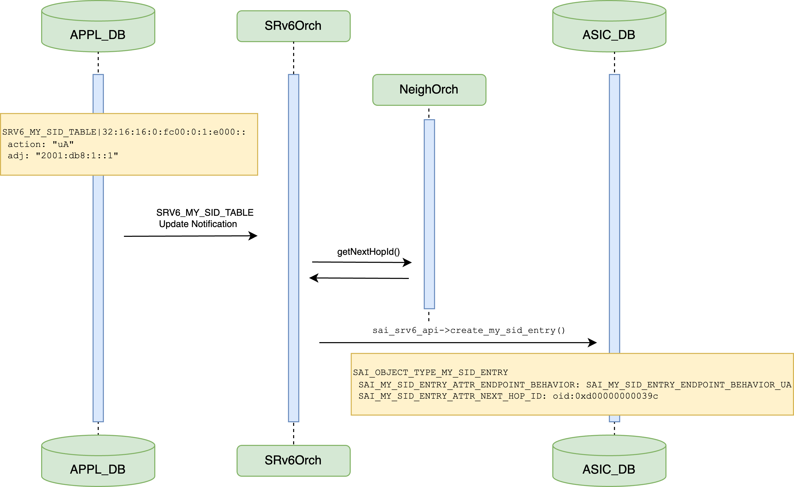

# SRv6 SID L3Adj #

## Table of Content 

- [Revision](#revision)
- [Scope](#scope)
- [Definitions/Abbreviations](#definitionsabbreviations)
- [Overview](#overview)
- [High-Level Design](#high-level-design)
    - [SRv6Orch Changes](#srv6orch-changes)
- [SAI API](#sai-api)
- [Testing Requirements/Design](#testing-requirementsdesign)
    - [Unit Test cases](#unit-test-cases)
- [Open/Action items](#openaction-items)
- [References](#references)

## Revision  

| Rev  |   Date    |      Author                         | Change Description      |
| :--: | :-------: | :---------------------------------: | :---------------------: |
| 0.1  | 05/9/2023 | Carmine Scarpitta, Ahmed Abdelsalam |  Initial version        |

## Scope  

Extending the SRv6Orch to support the programming of the L3Adj associated with SRv6 uA, End.X, uDX4, uDX6, End.DX4, and End.DX6 behaviors.

## Definitions/Abbreviations 

| **Term**                 | **Definition**                                     |
|--------------------------|----------------------------------------------------|
| End.X                    | L3 Cross-Connect                                   |
| End.DX4                  | Decapsulation and IPv4 Cross-Connect               |
| End.DX6                  | Decapsulation and IPv6 Cross-Connect               |
| L3Adj                    | Layer 3 Adjacency                                  |
| SID                      | Segment Routing Identifier                         |
| SRv6                     | Segment Routing over IPv6                          |
| uA                       | End.X behavior with NEXT-CSID, PSP and USD flavors |
| uDX4                     | End.DX4 behavior with NEXT-CSID flavor             |
| uDX6                     | End.DX4 behavior with NEXT-CSID flavor             |

## Overview 

The support of SRv6 has been defined in this HLD: [Segment Routing over IPv6 (SRv6) HLD](https://github.com/sonic-net/SONiC/blob/master/doc/srv6/srv6_hld.md).

The HLD includes several SRv6 behaviors defined in [RFC 8986](https://datatracker.ietf.org/doc/html/rfc8986).
The Appl DB was extended to support these behaviors. 

The Appl DB includes the L3Adj attributes which is used with these behaviors: uA, End.X, uDX4, uDX6, End.DX4, and End.DX6.

The current implementation of SRv6Orch does not process the L3Adj.

In this HLD, we extend the SRv6Orch to process the L3Adj and program it in the ASIC DB.

## High-Level Design 

The following diagram shows the SRv6Orch workflow to process an SRv6 SID associated with a L3Adj in SONiC:
<br> <br>

.

- SRv6Orch is an APPL_DB subscriber.
- SRv6Orch receives a `SRV6_MY_SID_TABLE` update notification about the SID. The SID is associated with a L3 adjacency carried in the `adj` parameter.
- SRv6Orch gets the nexthop ID of the adjacency from NeighOrch.
- SRv6Orch sets the nexthop ID attribute of the SID.
- SRv6Orch invokes the sairedis `sai_srv6_api->create_my_sid_entry()` API to create the SRv6 SID entry in the ASIC DB. 

The next subsections describe the SRv6Orch changes required to support the HLD described above.

### SRv6Orch Changes

We extend SRv6Orch to support the programming of the L3Adj associated with uA, End.X, uDX4, uDX6, End.DX4, and End.DX6 behaviors.

When SRv6Orch receives a SID with the `adj` parameter set, it calls the function `neighOrch->hasNextHop()` to make sure a nexthop associated with the adjacency exists.
- If the nexthop does not exist, SRv6Orch returns an error.
- If the nexthop exists, SRv6Orch invokes the sairedis API `sai_srv6_api->create_my_sid_entry()` to create an entry `SAI_OBJECT_TYPE_MY_SID_ENTRY` into the ASIC DB. The `SAI_MY_SID_ENTRY_ATTR_NEXT_HOP_ID` of the entry is set to the nexthop ID.

## SAI API 

The `SAI_OBJECT_TYPE_MY_SID_ENTRY` object already supports the `SAI_MY_SID_ENTRY_ATTR_NEXT_HOP_ID` attribute required to associate a L3Adj to a SID.

```

/**
 * @brief Attribute list for My SID
 */
typedef enum _sai_my_sid_entry_attr_t
{

...
    /**
     * @brief Next hop for cross-connect functions
     *
     * @type sai_object_id_t
     * @flags CREATE_AND_SET
     * @objects SAI_OBJECT_TYPE_NEXT_HOP, SAI_OBJECT_TYPE_NEXT_HOP_GROUP, SAI_OBJECT_TYPE_ROUTER_INTERFACE
     * @allownull true
     * @default SAI_NULL_OBJECT_ID
     * @validonly SAI_MY_SID_ENTRY_ATTR_ENDPOINT_BEHAVIOR == SAI_MY_SID_ENTRY_ENDPOINT_BEHAVIOR_X or SAI_MY_SID_ENTRY_ATTR_ENDPOINT_BEHAVIOR == SAI_MY_SID_ENTRY_ENDPOINT_BEHAVIOR_DX4 or SAI_MY_SID_ENTRY_ATTR_ENDPOINT_BEHAVIOR == SAI_MY_SID_ENTRY_ENDPOINT_BEHAVIOR_DX6 or SAI_MY_SID_ENTRY_ATTR_ENDPOINT_BEHAVIOR == SAI_MY_SID_ENTRY_ENDPOINT_BEHAVIOR_B6_ENCAPS or SAI_MY_SID_ENTRY_ATTR_ENDPOINT_BEHAVIOR == SAI_MY_SID_ENTRY_ENDPOINT_BEHAVIOR_B6_ENCAPS_RED or SAI_MY_SID_ENTRY_ATTR_ENDPOINT_BEHAVIOR == SAI_MY_SID_ENTRY_ENDPOINT_BEHAVIOR_B6_INSERT or SAI_MY_SID_ENTRY_ATTR_ENDPOINT_BEHAVIOR == SAI_MY_SID_ENTRY_ENDPOINT_BEHAVIOR_B6_INSERT_RED
     */
    SAI_MY_SID_ENTRY_ATTR_NEXT_HOP_ID,
...

} sai_my_sid_entry_attr_t;
```

There is no SAI modification required to support the L3Adj parameter.

		
## Testing Requirements/Design  

### Unit Test cases  

To validate the SRv6 SID L3Adj parameter, we extend the existing `test_mysid` test cases contained in the `test_srv6.py` unit test. We create a new SRv6 SID entry associated with a L3 adjacency into the `SRV6_MY_SID_TABLE` of the Appl DB and we verify that the SID entry is created into the ASIC DB. This test is performed for all the behaviors that require a L3 adjacency: uA, End.X, End.DX4, End.DX6, uDX4, uDX6.

## Open/Action items

The changes proposed in this document depend on the following PRs:

- [[orchagent]: Extend the SRv6Orch to support the programming of the L3Adj](https://github.com/sonic-net/sonic-swss/pull/2902)

## References

- [Segment Routing over IPv6 (SRv6) Network Programming](https://datatracker.ietf.org/doc/html/rfc8986)
- [Segment Routing over IPv6 (SRv6) HLD](https://github.com/sonic-net/SONiC/blob/master/doc/srv6/srv6_hld.md)
