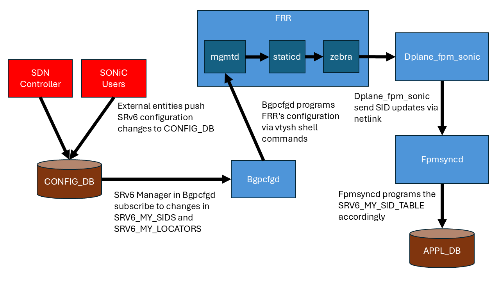

# Static Configuration of SRv6 in SONiC HLD  

# Table of Contents

- [List of Tables](#list-of-tables)
- [Revision](#revision)
- [Definition/Abbreviation](#definitionabbreviation)
- [About This Manual](#about-this-manual)
- [1 Introuduction and Scope](#1-introuduction-and-scope)
- [2 Feature Requirements](#2-feature-requirements)
- [2.1 Functional Requirements](#21-functional-requirements)
- [2.2 Configuration and Managment Requirements](#22-configuration-and-management-requirements)
- [2.3 Warm Boot Requirements](#23-warm-boot-requirements)
- [3 Feature Design](#3-feature-design)
- [3.1 ConfigDB Changes](#31-configdb-changes)
- [3.2 AppDB Changes](#32-appdb-changes)
- [3.3 Orchestration Agent Changes](#33-orchestration-agent-changes)
- [3.4 SAI](#34-sai)
- [3.5 YANG Model](#35-yang-model)
- [4 Unit Test](#4-unit-test)
- [5 References ](#5-references) 

# Revision

| Rev  |   Date    |           Author           | Change Description      |
| :--: | :-------: | :------------------------: | :---------------------: |
| 0.1  | 12/5/2024 |       Changrong Wu         |  Initial version        |


# Definition/Abbreviation

### Table 1: Abbreviations

| ****Term**** | ****Meaning**** |
| -------- | ----------------------------------------- |
| BGP  | Border Gateway Protocol |
| SID  | Segment Identifier  |
| SRH  | Segment Routing Header  |
| SRv6 | Segment Routing IPv6  |
| SDN | Software Defined Network |
| uSID | Micro Segment |
| VNI  | VXLAN Network Identifier  |
| VRF  | Virtual Routing and Forwarding  |

# About this Manual

This document provides general information about the design of the enhancements in SONiC to support static configuration of Segmentation Routing over IPv6 protocol, which is crucial for SRv6 SDN deployment (without usage of BGP).

# 1 Introuduction and Scope

This document describes the high-level design of the new features in SONiC to support SRv6 SDN.
The new features include the addtion of a new table in CONFIG_DB to allow static configuration of SRv6 and the enhancement of bgpcfgd to program FRR with input from CONFIG_DB.
Besides, this document also define new YANG model specification and unit-test cases used to validate the aforementioned features.


# 2 Feature Requirements

## 2.1 Functional Requirements

Provide ability to statically configure SRv6 SIDs for block IDs, locators and local functions from CONFIG_DB.

## 2.2 Configuration and Management Requirements

1. User should be able to statically configure block length, locator length and function length for SRv6.

2. User should be able to statically configure a number of SIDs/uSIDs for the local functions of the switch.

## 2.3 Warm Boot Requirements

Warm reboot is intended to be supported for planned system warm reboot.

 

# 3 Feature Design

At the time of writing this document, FRR has been able to program the SRv6 related tables in APPL_DB through fpmsyncd.
However, there is still one gap preventing SONiC being utilized for SRv6 SDN deployment.
Specifically, there is no mechamism in SONiC allowing SDN controllers or users to directly add configuration for SRv6 without involving BGP.

In this document, we first define a new **SRV6_MY_SID_TABLE** table in CONFIG_DB that serves as the configuration source of SRv6 in SONiC.
Then, we design a new SRv6 Manager module in bgpcfgd to subscribe to the **SRV6_MY_SID_TABLE** table and compile changes in CONFIG_DB to changes in the configurations of FRR.
To verify the correctness of the aforementioned flow, we also define the relevant YANG model specification.
The workflow of the new mechanism is shown in the following diagram.



The design details of each step is described in the following subsections.

## 3.1 New Table in ConfigDB


**SRV6_MY_SID_TABLE**

Description: New table to hold local SID definition and SID to behavior mapping. (A redefinition of SRV6_MY_SID_TABLE in [SRv6_HLD](./srv6_hld.md))

Schema:

```
; New table
; holds local SID to behavior mapping, allow 1:1 or n:1 mapping

key = SRV6_MY_SID_TABLE|ipv6address
; field = value
block_len = blen             ; bit length of block portion in address, default 32
node_len = nlen              ; bit length of node ID portion in address, default 16
func_len = flen              ; bit length of function portion in address, default 16
action = behavior            ; behaviors defined for local SID
vrf = VRF_TABLE.key          ; VRF name for END.DT46, can be empty
adj = address,               ; Optional, list of adjacencies for END.X
policy = SRV6_POLICY.key     ; Optional, policy name for END.B6.ENCAP
source  = address,           ; Optional, list of src addrs for encap for END.B6.ENCAP

For example:
    "SRV6_MY_SID_TABLE" : {
        "FCBB:BBBB:20::" : {
           "action": "end"
        },
        "FCBB:BBBB:20:F1::" : {
           "action": "end.dt46",
           "vrf":  "VRF-1001"
        },
        "FCBB:BBBB:20:F2::" : {
           "action": "end.dt46",
           "vrf":  "VRF-1001"
        },
        "FCBB:BBBB:20:F3::" : {
           "action": "end.x",
           "adj": [
                FCBB:BBBB:10::1, 
                FCBB:BBBB:10::2
            ],
        }
    }
```


## 3.2 Bgpcfgd changes

To enable automatic programming SRv6 configurations from CONFIG_DB to FRR, we need to add a new module in bgpcfgd to watch changes in **SRV6_MY_SID_TABLE** and compile the corresponding changes in FRR's configurations.
Following the naming convention of modules in bgpcfgd, we call this new module SRv6 Manager.

## 3.3 YANG Model
```
module: sonic-srv6
  +--rw sonic-srv6
     +--rw SRV6_SID_LIST
     |  +--rw SRV6_SID_LIST_LIST* [name]
     |     +--rw name    string
     |     +--rw path*   inet:ipv6-address
     +--rw SRV6_MY_SID
     |  +--rw SRV6_MY_SID_LIST* [ip-address]
     |     +--rw ip-address    inet:ipv6-address
     |     +--rw block_len?    uint16
     |     +--rw node_len?     uint16
     |     +--rw func_len?     uint16
     |     +--rw arg_len?      uint16
     |     +--rw action?       enumeration
     |     +--rw vrf?          -> /vrf:sonic-vrf/VRF/VRF_LIST/name
     |     +--rw adj*          inet:ipv6-address
     |     +--rw policy?       -> /sonic-srv6/SRV6_POLICY/SRV6_POLICY_LIST/name
     |     +--rw source?       inet:ipv6-address
     +--rw SRV6_POLICY
     |  +--rw SRV6_POLICY_LIST* [name]
     |     +--rw name       string
     |     +--rw segment*   -> /sonic-srv6/SRV6_SID_LIST/SRV6_SID_LIST_LIST/name
     +--rw SRV6_STEER
        +--rw SRV6_STEER_LIST* [vrf-name ip-prefix]
           +--rw vrf-name     -> /vrf:sonic-vrf/VRF/VRF_LIST/name
           +--rw ip-prefix    union
           +--rw policy?      -> /sonic-srv6/SRV6_POLICY/SRV6_POLICY_LIST/name
           +--rw source?      inet:ipv6-address
```

## 4 Unit Test

TBD

## 5 References

-  [SAI IPv6 Segment Routing Proposal for SAI 1.2.0](https://github.com/opencomputeproject/SAI/blob/1066c815ddd7b63cb9dbf4d76e06ee742bc0af9b/doc/SAI-Proposal-IPv6_Segment_Routing-1.md)

-  [RFC 8754](https://tools.ietf.org/html/rfc8754)
-  [RFC 8986](https://www.rfc-editor.org/rfc/rfc8986.html)
-  [draft-filsfils-spring-segment-routing-policy](https://tools.ietf.org/html/draft-filsfils-spring-segment-routing-policy-06)

-  [draft-ali-spring-bfd-sr-policy-06](https://tools.ietf.org/html/draft-ali-spring-bfd-sr-policy-06)

-  [draft-filsfils-spring-net-pgm-extension-srv6-usid](https://tools.ietf.org/html/draft-filsfils-spring-net-pgm-extension-srv6-usid-08)

-  [draft-cl-spring-generalized-srv6-for-cmpr](https://tools.ietf.org/html/draft-cl-spring-generalized-srv6-for-cmpr-02)  


