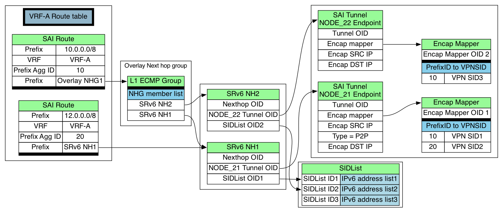

# SRv6 VPN HLD

# Overview

Alibaba is deploying SRv6 VPN with SONiC based white box router at its edge of the network. The Alibaba's SRv6 VPN use case has been described in muliple conferences. The basic idea follows RFC 8986, which we use SRv6 as a network programming framework for applications.  VPN information is used as service anchor points for identifying service instances in the service plane. SRv6 policy could be used to provide paths to let applications reach service instances. The following diagram provides a summary on what Alibaba would like to achieve via SRv6 VPN.

To help promoting SRv6's adopting in the industry, Alibaba team decides to upstream its deployed SRv6 VPN solution to SONiC community via 202305 release. We expect more contributors would join us to complete SRv6 VPN related features.

# Design

The SONiC SRv6 VPN deployable solution  requires changes from the following three communities.

## FRR

Besides recent FRR changes for SRv6 VPN contributed by Cisco team, Alibaba team needs to bring in the following FRR changes for a deployable solution. 

1.  VRF routes leaking and performance tuning
    
2.  BGP advertise delay
    
3.  Conditional advertisement
    
4.  SRv6 Policy handling
    

FRR changes would be commited to FRR community.  SONiC 202305 release would pull in the corresponding  version of FRR release.

The minimal FRR version for SRv6 VPN is 8.4, which you could get SRv6 VPN PoC functionalities. FRR version 8.5 or 9.0 would provide Alibaba deployment feature parity.

## SAI

Current SRv6 SAI doesn't have VPN support. SRv6 VPN SAI would be contributed by Cisco team. The SAI object model for SRv6 VPN is shown in the following diagram. The detail information about SRv6 VPN SAI APIs could be found in SAI's HLD document. ([https://github.com/rameshms-work/SAI/blob/rameshms/srv6\_vpn\_enhancements/doc/SAI-IPv6-Segment-Routing-VPN.md](https://github.com/rameshms-work/SAI/blob/rameshms/srv6_vpn_enhancements/doc/SAI-IPv6-Segment-Routing-VPN.md))

## SWSS and SONiC related changes

The main SRv6 SWSS design is documented via [SRv6 HLD](https://github.com/sonic-net/SONiC/blob/master/doc/srv6/srv6_hld.md). This HLD focuses on the changes needed to enable SRv6 VPN on the top of existing SRv6 changes.

# SRv6Orch and RouteOrch related Changes

The overall work flow diagram is shown in the diagram below.

## APP\_DB

### New SRv6\_POLICY\_TABLE

SRv6\_SID\_LIST\_TABLE and SRv6\_MY\_SID\_TABLE have already been supported. The detail information could be found in [SRv6 HLD](https://github.com/sonic-net/SONiC/blob/master/doc/srv6/srv6_hld.md). For SRv6 traffic steering, we add a new SRv6 POLICY table. 

Description : new table to hold SRv6 policy

Schema: 

    ; New table
    ; holds SRv6 policy
    
    key = SRV6_POLICY_TABLE|policy_name ;
    segment = SRv6_SID_LIST.key,   ; List of segment names, separated by ','
    weight  = weight_list          ; List of weights, separated by ','
    

### Modify ROUTE\_TABLE

Description:  vpn\_sid and policy fields are added to existing route table schema.

Schema:

    ;Stores a list of routes
    ;Status: Mandatory
    
    key = ROUTE_TABLE:VRF_NAME:prefix ;
    nexthop = prefix,              ; IP addresses separated ',' (empty indicates no gateway). May indicate VXLAN endpoint if vni_label is non zero.
    intf = ifindex? PORT_TABLE.key ; zero or more separated by ',' (zero indicates no interface)
    vni_label = VRF.vni            ; zero or more separated by ',' (empty value for non-vxlan next-hops). May carry MPLS label in future.
    router_mac = mac_address       ; zero or more remote router MAC address separated by ',' (empty value for non-vxlan next-hops)
    blackhole = BIT                ; Set to 1 if this route is a blackhole (or null0)
    segment = SRV6_SID_LIST.key    ; New optional field. List of segment names, separated by ',' 
    seg_src = address              ; New optional field. Source addrs for sid encap
    vpn_sid = vpn_sid              ; New optional field to add vpn_sid to learnt BGP routes
    policy = policy                ; New optional field to add policy name to learnt BGP routes

## MY\_SID

In Alibaba's deployment,  anycast routes are used as MY\_SID. This approach would help us to reduce the outage from BGP NH's convergencs, when BGP prefix independent convergence (PIC) is not supported in FRR. 

In the current FRR approach, zebra sends the SRV6\_MY\_SID information to the kernel, not the fpm server. This is due to SRV6\_MY\_SID field has not been defined in netlink message yet. There is a workaround used to pass MY SID via route info. When adding routes, SRv6 routes can be distinguished from ordinary routes via route's nexthop information. But this workaround has a limitation in the deleting path. SRv6\_MY\_SID can't be distinguished from ordinary routes, since prefixes are the only information provided to fpmserver. Since Alibaba uses anycast routes as MY\_SID, we have to find an alternative way to solve this limitation. We add a simple workaround which is described in "MY\_SID enhancement" section to overcome this limitation.

In the current support for SRV6\_MY\_SID, End.X action has been implemented in srv6orch, but the processing of nexthop id is missing. We added the support of nexthop id for End.X action in srv6orch. 

Schema:

    ; holds local SID to behavior mapping
    ; Status: Mandatory
    
    key = SRV6_MY_SID_TABLE:block_len:node_len:func_len:arg_len:ipv6address
    
    ; field = value
    action = behavior                  ; behaviors defined for local SID
    vrf = VRF_TABLE.key                ; VRF name for END.DT46, can be empty
    adj = address,                     ; List of adjacencies for END.X, can be empty
    segment = SRv6_SID_LIST.key,       ; List of segment names for END.B6.ENCAP, can be empty
    source  = address,                 ; List of src addrs for encap for END.B6.ENCAP
    

## Segment enhancement

There is an enhancement added for handling segments. When the first sid in a segment matches some SRv6 MY\_SID and the MY\_SID's action is End.X, an attribute SAI\_SRV6\_SIDLIST\_ATTR\_NEXT\_HOP\_ID will be set. The value of this attribute is set to MY\_SID's nexthop id. The SAI\_SRV6\_SIDLIST\_ATTR\_SEGMENT\_LIST of this segment will not contain the first sid.

## VPN Routes

SRv6 VPN routes handling is added on the top of existing SRv6 routes handling. When a SRv6 VPN routes are created, SRv6 VPN routes contains VPN\_SID. SRv6Orch would check if it needs to create a corresponding SRv6 tunnel for the given BGP NH, and create the SRv6 tunnel if needed. Each SRv6 Tunnel points to an encap mapper. 

The encap mapper is used to store all the VPN\_SIDs, which SRv6 VPN routes would use via this BGP NH. The key for this tunnel map is Prefix AGG\_ID. SRv6Orch allocates a Prefix AGG\_ID for a given BGP NH, and store Prefix AGG\_ID with VPN\_SID binding in encap mapper table. SRv6 tunnel would be used in SRv6 NH. SRv6 NH also points to created SID list if a set of selected IGP paths are specified via SRv6 policy. The detail SAI forwarding chain information for SRv6 VPN could be found in the above SAI section. 

## VPN Routes Scale Enhancements

SONiC's current design focuses on data center switch's use cases. The number of routes are limited on these types of devices. Some inefficient memory usage exists in current code base. SRv6 VPN would bring in VPN routes to the million level. These inefficient memory usage would not only bring up device's memory usage, but also slow down the BGP loading time for bringing up million routes. Therefore, we need to reevaluate the memory usage for route objects and reduce the overall (SONiC/FRR/SAI) memory footprint per route to below 2KB as a starting point. 

We found that when sending 2M routes to orchagent, the orchagent will use about 3.5G of memory. Most of the memory is used by saimeta. the memory in saimeta is used for routing checks. In order to reduce memory usage and improving performance, we added a flag in the saimeta to decide whether to skip this routing check. By skipping this check, the memory usage will be reduced to 1.4G with 2M routes.

## SRv6 Policy

Segment Routing policy is defined in RFC 9256. SRv6 Policy's definition follows the same RFC. SRv6 Policy related information would be provided from FRR's pathd. Currently, we take a workaround approach which is described in "SRv6 policy download" section.

The SRv6-policy information is only stored in the orchagent and won't be distributed to the ASIC\_DB. Therefore, when SRv6-policy are added and deleted, SAI entry will not be involved if the policy is not in use. SRv6 policy information would be consumed when a SRv6 policy route is added.

The SRv6-policy content could be changed at any time. The changes could include segment adding/removing or weight updating. When a SRv6-policy content is updated, a backwalk is triggered to walk through all corresponding nexthop groups. Corresponding hardware information would be updated during the backwalk based on updated policy information. 

# BFD Orch related Changes

## SBFD

In SRv6 deployment, we rely on SBFD (RFC 7880,  RFC7881) to protect SRv6 policy defined paths. Due to fast convergence and scale 's requirements, we would like to offload SBFD to hardware. The following changes are made for offloading SBFD sessions.

1.  Add a new bfd encapsulation type enum SAI\_BFD\_ENCAPSULATION\_TYPE\_SRV6. When the SRv6 policy bfd session type is  SBFD Initiator  or SBFD echo, set SAI\_BFD\_SESSION\_ATTR\_BFD\_ENCAPSULATION\_TYPE attribute to SAI\_BFD\_ENCAPSULATION\_TYPE\_SRV6 if SRv6 is used for this SBFD session.
    
2.  Add a new  bfd session attr enum SAI\_BFD\_SESSION\_ATTR\_SRV6\_SIDLIST\_ID.  When the SRv6 policy bfd session type is  SBFD Initiator  or SBFD echo, we must set the sidlist id in SAI\_BFD\_SESSION\_ATTR\_SRV6\_SIDLIST\_ID to provide path information for SBFD SRv6 session.  The sidlist OID would be obtained via getBfdSidListOID in SRv6Orch.  
    

### BFD\_PEER schema

There are three changes maded in BFD\_PEER schema.

*   "local-discriminator" and "remote-discriminator" are added in BFD\_PEER schema. Different bfd sessions may have the same local IP address and remote IP address. We need use local and remote discriminator to differentiate these BFD sessions.
    
*   Three new BFD types are added, SBFD initiator , SBFD reflector and SBFD echo.
    
*   Two extra fields "endpoint" and "seglist-name" are added
    

The BFD\_PEER schema is shown as the following

    community:
    BFD_SESSION:{{vrf}}:{{ifname}}:{{ipaddr}}:{{local-discriminator}}
        "tx_interval": {{interval}} (OPTIONAL) 
        "rx_interval": {{interval}} (OPTIONAL)  
        "multiplier": {{detection multiplier}} (OPTIONAL) 
        "shutdown": {{false}} 
        "multihop": {{false}} 
        "local_addr": {{ipv4/v6}}
        "remote-discriminator": {{integer}}
        "type": {{string}} (active/passive/sbfd initiator/sbfd reflector/sbfd echo) 
        "endpoint": {{ipv6}}
        "seglist-name": {{string}}

## BFD state change events handling

When BFD orch receives a BFD session state notification from hardware, BFD orch updates the state information in state db. Other SONiC modules could subscribe the BFD session notification based on their needs. bfdd also needs to be informed. But bfdd belongs to FRR code base, currently, there is no infrastructure to let SONiC generated states be propogated to FRR related processes. Therefore, we take a workaround approach which is described in "Notify BFD state change events to FRR bfdd" section.

### BFD\_HW STATE in STATE\_DB

The following schema is added for describing bfd\_hw\_state in STATE\_DB. Syncd would monitor hardware asic notification and update the session state in ASIC DB. BFD orch monitors ASIC DB and set corresponding hw offloaded BFD session state in the state DB with the following schema.

    BFD_PEER|{vrfname}|{alias}|{peer_address}|{local-discriminator}
      "bfd_hw_state": {{string}} (up/down)

# Unit Tests

### orchagent

1.  Add SRv6 route with single nexthop. Verify the following items
    
    *   SAI\_OBJECT\_TYPE\_TUNNEL\_MAP with type SAI\_TUNNEL\_MAP\_TYPE\_PREFIX\_AGG\_ID\_TO\_SRV6\_VPN\_SID is created
        
    *   SAI\_OBJECT\_TYPE\_TUNNEL with mode SAI\_TUNNEL\_PEER\_MODE\_P2P is created
        
    *   SAI\_OBJECT\_TYPE\_TUNNEL\_MAP\_ENTRY with vpn sid value in SRv6 route is created
        
    *   SAI\_OBJECT\_TYPE\_NEXT\_HOP with type SAI\_NEXT\_HOP\_TYPE\_SRV6\_SIDLIST is created
        
    *   SAI\_OBJECT\_TYPE\_ROUTE\_ENTRY with attribute SAI\_ROUTE\_ENTRY\_ATTR\_PREFIX\_AGG\_ID is created
        
2.  Remove SRv6 route with single nexthop. Verify the following items
    
    *   Verify that the SAI object created in the above step are deleted
        
3.  Add SRv6 route with multi nexthops. Verify the following items
    
    *   Verify SAI object in step 1
        
    *   SAI\_OBJECT\_TYPE\_NEXT\_HOP\_GROUP is created
        
    *   SAI\_OBJECT\_TYPE\_NEXT\_HOP\_GROUP\_MEMBER is created
        
4.  Remove SRv6 route with multi nexthops. Verify the following items
    
    *   Verify that the SAI object created in the above step are deleted
        
5.  Switch SRv6 route from single nexthop to nexthopgroup. Verify the following items
    
    *   SAI\_OBJECT\_TYPE\_TUNNEL\_MAP\_ENTRY with a new SAI\_TUNNEL\_MAP\_ENTRY\_ATTR\_PREFIX\_AGG\_ID\_KEY is created
        
    *   SAI\_OBJECT\_TYPE\_NEXT\_HOP\_GROUP is created
        
    *   SAI\_OBJECT\_TYPE\_NEXT\_HOP\_GROUP\_MEMBER is created
        
    *   SAI\_OBJECT\_TYPE\_ROUTE\_ENTRY with a new SAI\_ROUTE\_ENTRY\_ATTR\_PREFIX\_AGG\_ID and a new SAI\_ROUTE\_ENTRY\_ATTR\_NEXT\_HOP\_ID is seted
        
6.  Add two SRv6 route with same nexthopgroup. Verify the following items
    
    *   Add first one, Verify SAI object in step 3
        
    *   Add second one, Verify SAI\_OBJECT\_TYPE\_ROUTE\_ENTRY is created,  with same SAI\_ROUTE\_ENTRY\_ATTR\_PREFIX\_AGG\_ID and SAI\_ROUTE\_ENTRY\_ATTR\_NEXT\_HOP\_ID as first one 
        
7.  Remove two SRv6 route one by one. Verify the following items
    
    *   Delete first route,  Verify SAI\_OBJECT\_TYPE\_ROUTE\_ENTRY is deleted
        
    *   Delete second one, Verify that the SAI object created in the step 6 are deleted
        

### sbfd

1.  Add and remove ipv6 seamless BFD session (sbfd initiator and sbfd reflector). Verify the asci db  especially SAI\_BFD\_SESSION\_ATTR\_BFD\_ENCAPSULATION\_TYPE and SAI\_BFD\_SESSION\_ATTR\_SRV6\_SIDLIST\_ID and state db. 
    
2.  Add and remove multiple ipv6 seamless BFD session . Verify same as last one.
    
3.  Add and remove ipv6 seamless BFD echo . Verify the asci db  especially SAI\_BFD\_SESSION\_ATTR\_BFD\_ENCAPSULATION\_TYPE, SAI\_BFD\_SESSION\_ATTR\_ECHO\_ENABLE , SAI\_BFD\_SESSION\_ATTR\_SRV6\_SIDLIST\_ID.
    
4.  Add and remove multiple ipv6 seamless BFD echo . Verify same as last one.
    
5.  Handle  the notify of bfd hardware state's change.  Verify the state db.
    

# References

RFC 8986 Segment Routing over IPv6 (SRv6) Network Programmin

RFC 9256 Segment Routing Policy Architecture

RFC 7880 Seamless Bidirectional Forwarding Detection (S-BFD)

RFC 7881Seamless Bidirectional Forwarding Detection (S-BFD) for IPv4, IPv6, and MPLS

# Current SONiC's Design Limitations and workarounds

We don't have an efficient infrastructure to communicate between FRR related processes and SONiC related processes due to current SONiC design limitation. This area needs to be redesigned in the future. Alibaba's business can't wait for the community agreed solution to be ready, therefore we put in the following workaround for an overall solution in the cloud environment. These workarounds would NOT be commited in 202305 release. We will raise PRs and provide diff for referencing purposes only. 

## SRv6 policy download

For a simple workaround, FRR pathd would add, update and delete SRv6 policy related information by writing to APP\_DB directly.

## MY\_SID enhancement

For a simple workaround, Zebra would add, update and delete SRV6\_MY\_SID by writing to APP\_DB directly.

## Notify BFD state changes events to FRR bfdd

For notifying bfdd in FRR, we introduce a new bfdsyncd process in our code base which would set up a TCP socket connection between FRR's bfdd process and SWSS's bfd syncd process. This new process monitors state db for hardware offloaded bfd sessions' state change events and relay these state change events to FRR's bfdd. 

## PRs  for workarounds

These PRs are for referencing only. 

# PRs to be in 202305

TODO, will be added once PRs are raised.