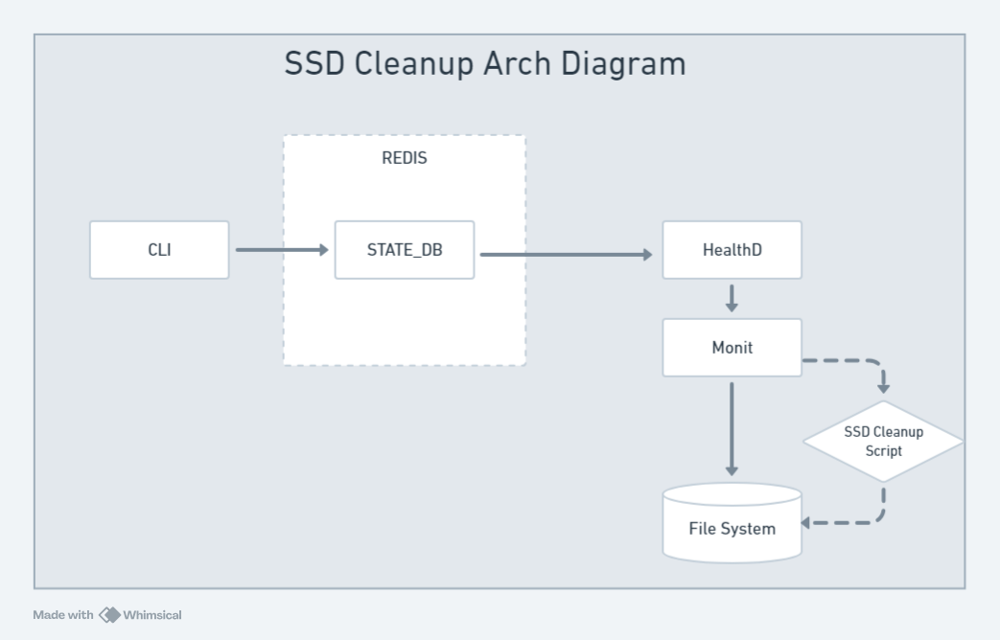
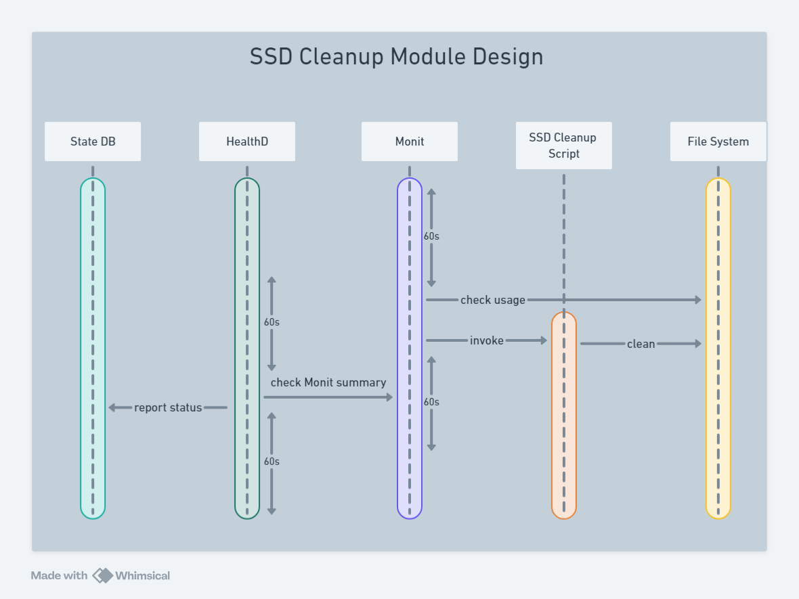

# SSD Cleanup #

## Table of Content 

### Revision  

### Scope  

This document describes the design details for automatic ssd cleanup on a SONiC switch. The feature is dependent on the monit service to monitor the ssd usage, alert the user on reaching the error threshold and trigger the ssd cleanup script. This document will focus on the cleanup flow and will not cover the whole monit (and healthd) flow.

### Definitions/Abbreviations 

Monit - monitoring service which is used in SONiC to monitor the file system among other resources.

### Overview 

SONiC requires some amount of free disk space to operate correctly. In order to avoid reaching a state where there is no more space left, some preventive measures need to be exercised. Specifically, we would like to alert the user that the disk is getting filled (covered under the current implementaion) and, in the case where the free space has reached a critical level, perform a cleanup operation (the enhancement covered in this document).

### Requirements

Requirements:

1. Vendors set the free space _Warning_ (e.g. < 5Gb of free space) and _Critical_ (e.g. < 3.5Gb of free space) thresholds and can their own cleanup targets. If no thresholds are set, the feature will be disabled and the current behavior will remain.
2. In case the disk usage has stably exceeded the _Warning threshold_ – we would alert the user via system health (which include logging, LED and CLI health status).
3.	In case the disk usage has exceeded the _Critical threshold_ – we would perform ssd cleanup to try to bring down the disk usage to under the _Warning threshold_.

Exemptions
1. The feature is not user configurable, as with other monitoring tasks executed by Monit.
2. Cleaning inside docker containers is not supported at this stage.

### Architecture Design 

In SONiC, System health monitors critical services/processes and peripheral device status and leverage system log, system status LED to and CLI command output to indicate the system status. In the current implementation, System health monitor relies on Monit service to monitor the file system and to trigger an alert in case an alert threshold has been stably exceeded.

We will extend the Monit service, in case the disk usage has reached critical level, to execute a cleanup utility.
In addition, to support the init flow, we will also check and perform ssd cleanup on system init.

The health status is visiable via 'show system-health' commands.

### High-Level Design 

Vendor Definitions:

File System Cleanup Data

critical thershold
warning threshold
cleanup targets

Utility Scripts:

check ssd usage
ssd cleanup

Monit Configuration Update:

CLI Output:

### SAI API 
NA

### Configuration and management 
None for now, see exemption number 1.

#### Manifest (if the feature is an Application Extension)
NA
		
### Warmboot and Fastboot Design Impact  
Mention whether this feature/enhancement has got any requirements/dependencies/impact w.r.t. warmboot and fastboot. Ensure that existing warmboot/fastboot feature is not affected due to this design and explain the same.

### Memory Consumption
No impact.

### Restrictions/Limitations  
See exempltions 1 and 2.

### Testing Requirements/Design  
Explain what kind of unit testing, system testing, regression testing, warmboot/fastboot testing, etc.,
Ensure that the existing warmboot/fastboot requirements are met. For example, if the current warmboot feature expects maximum of 1 second or zero second data disruption, the same should be met even after the new feature/enhancement is implemented. Explain the same here.
Example sub-sections for unit test cases and system test cases are given below. 

#### Unit Test cases  

#### System Test cases

### Open/Action items - if any 

	
NOTE: All the sections and sub-sections given above are mandatory in the design document. Users can add additional sections/sub-sections if required.
