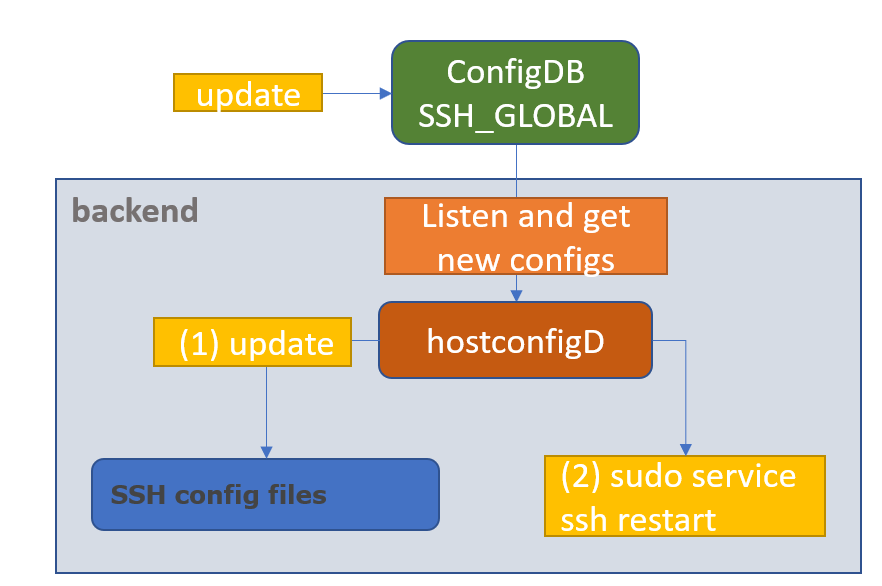
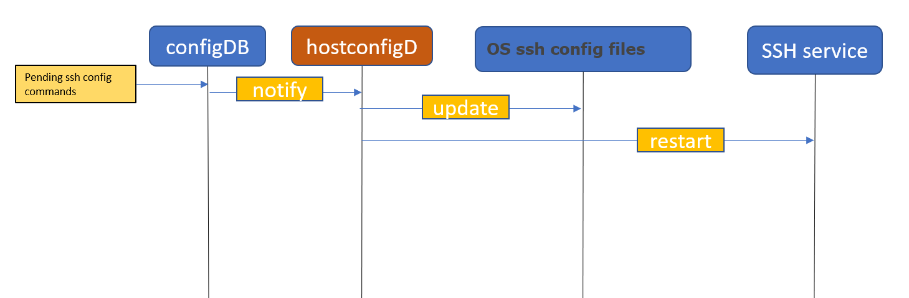

<!-- vscode-markdown-toc -->
* 1. [Table of Content](#TableofContent)
	* 1.1. [Revision](#Revision)
	* 1.2. [Scope](#Scope)
	* 1.3. [Definitions/Abbreviations](#DefinitionsAbbreviations)
	* 1.4. [Overview](#Overview)
	* 1.5. [Requirements](#Requirements)
	* 1.6. [Architecture Design](#ArchitectureDesign)
	* 1.7. [High-Level Design](#High-LevelDesign)
	* 1.8. [SAI API](#SAIAPI)
	* 1.9. [Configuration and management](#Configurationandmanagement)
		* 1.9.1. [Manifest (if the feature is an Application Extension)](#ManifestifthefeatureisanApplicationExtension)
		* 1.9.2. [CLI/YANG model Enhancements](#CLIYANGmodelEnhancements)
		* 1.9.3. [Config DB Enhancements](#ConfigDBEnhancements)
	* 1.10. [Warmboot and Fastboot Design Impact](#WarmbootandFastbootDesignImpact)
	* 1.11. [Restrictions/Limitations](#RestrictionsLimitations)
	* 1.12. [Testing Requirements/Design](#TestingRequirementsDesign)
		* 1.12.1. [Unit Test cases](#UnitTestcases)
		* 1.12.2. [System Test cases](#SystemTestcases)
	* 1.13. [Open/Action items - if any](#OpenActionitems-ifany)

<!-- vscode-markdown-toc-config
	numbering=true
	autoSave=true
	/vscode-markdown-toc-config -->
<!-- /vscode-markdown-toc -->
 SSH server global config HLD

##  1. <a name='TableofContent'></a>Table of Content 

###  1.1. <a name='Revision'></a>Revision  

###  1.2. <a name='Scope'></a>Scope  

This hld doc for ssh server global configurations describes the requirements, architecture and general flow details of ssh global config in SONIC OS based switches.

###  1.3. <a name='DefinitionsAbbreviations'></a>Definitions/Abbreviations 

	SSH - secure shell
	TCP - Transmission Control protocol	
	
###  1.4. <a name='Overview'></a>Overview 

We want to allow configuring ssh server global settings. This will feature will include 5 configurations, but can be extended easily to include additional configurations.

###  1.5. <a name='Requirements'></a>Requirements

This feature requires a dedicated table in the configuration DB, and enhancements of hostcfg demon, in order to allow modifing the relvant ssh configuration files. In order to override ssh configurations, we need to have write access to ssh config files such as /etc/ssh/sshd_config

###  1.6. <a name='ArchitectureDesign'></a>Architecture Design 
####  1.6.1. <a name='ConfigModules'></a>Configuration modules


We want to enhance configDB to include table for ssh server global configurations. In addition, hostcfg demon will include a dedicated flow in order to modify ssh config files, once ssh server global config table entries are changed.

###  1.7. <a name='High-LevelDesign'></a>High-Level Design 

We want to enable global ssh server configuration in SONIC. In order to do so will touch few areas in the system:
1. configDB - to include a dedicated table for configurations
2. hostcfg demon - to update ssh config files once configDB relevant areas are modified (and for this feature, ssh global config table)
3. OS ssh config files - specific for this stage we are only /etc/ssh/sshd_config is going to be modifed by the hostcfg demon.
4. OS ssh service - to be restarted after each configuration change.

Note:

The Daemon is running in the host (without container) that matches this feature, because it is basically writing policies on ssh config files from the OS.
##### Flow diagram

#### 1.7.1 <a name='Flow description'></a>Flow description
When the feature is enabled, users by using [auto-generated SONIC CLI](https://github.com/sonic-net/SONiC/blob/master/doc/cli_auto_generation/cli_auto_generation.md) or modifying the DB manually, will set ssh server policies/configuration (see options below) by modifing CONF_DB in SSH_GLOBAL_TABLE.

The hostcfgd daemon will be extended to listen to ssh policies/configurations from SSH_GLOBAL table, parse the inputs and set the new policies to ssh config files, and update ssh server afterwards.


#### 1.7.2 <a name='SSH global policies'></a>SSH global policies

We want to enable configuring the following policies, with default values are taken from OS (Debian):
| Policy         |      Action                                                               | Param values            | Default OS value |
|----------------|---------------------------------------------------------------------------|-------------------------|------------------|
| login attempts |     Number of attempts to try to log in   before rejecting the session    |     3-100               |     6            |
| login timeout  |     SSH session timeout                                                   |     1-600 (secs)        |     120          |
| ports          |     Port number for SSH                                                   |     1-65535             |     22           |
| tcp-forwarding |     enable the option of tcp forwarding for   the ssh server              |     enabled/disabled    |     enabled      |
| x11-forwarding |     enable the option of x11 forwarding for   the ssh server              |     enabled/disabled    |     enabled      |

###  1.8. <a name='Init flow'></a>Init flow 

During init flow we will set default ssh policies, same as default values in DebianOS. Default values will be added to init_cfg.json.j2, and updated in sshd_config file accordingly.
####  1.8.1. <a name='FeatureDefault'></a>Feature Default

Description of default values in init_cfg.json regarding SSH global config:
```
login attempts: 6 
login timeout: 120 //seconds
ports: 22
tcp-fowarding: Enabled
X11-forwarding: Enabled
```
###  1.9. <a name='SAI api'></a>SAI api
NA
###  1.10. <a name='Configurationandmanagement'></a>Configuration and management 

####  1.10.1. <a name='SSH_GLOBALconfigDBtable'></a>SSH_GLOBAL configDB table

```
SSH_GLOBAL:{
	policies:{
		"login-attempts": {{num}}
		"login-timeout": {{secs}}
		"ports": {{num}}
		"tcp-forwarding": {{True/False}}
		"x11-forwarding": {{True/False}}
	}
}
```
#### 1.10.2. ConfigDB schemas
```
; Defines schema for SSH_GLOBAL configuration attributes in SSH_GLOBAL table:
key                                   = "POLICIES"             ;ssh global configuration
; field                               = value
LOGIN_ATTEMPTS                        = 3*DIGIT                 ; number of login attepmts, should be 100 max
LOGIN_TIMEOUT                         = 3*DIGIT                 ; login timeout in secs unit, max is 600 secs
PORTS                                 = 5*DIGIT                 ; ssh port number - max is 65535
TCP_FORWARDING                        = "True" / "False"
X11_FORWARDING                        = "True" / "False"
```

####  1.10.3. <a name='CLIYANGmodelEnhancements'></a>CLI/YANG model Enhancements
```yang
//filename:  sonic-ssh_global.yang
module sonic-sshg {
    yang-version 1.1;
    namespace "http://github.com/Azure/sonic-ssh_global";
	prefix sshg;

    description "SSH GLOBAL CONFIG YANG Module for SONiC OS";

	revision 2022-08-29 {
        description
            "First Revision";
    }

    container sonic-ssh_global {
		container SSH_GLOBAL {
			description "SSH GLOBAL CONFIG part of config_db.json";
			container POLICIES {
				leaf login_attempts {
					description "number of login attepmts";
					default 6;
					type uint8 {
						range 1..100;
					}
				}
				leaf login_timeout {
					description "login timeout (secs unit)";
					default 120;
					type uint32 {
						range 1..600;
					}
				}
				leaf ports {
					description "ssh port number";
					default 22;
					type uint32 {
						range 1..65535;
					}
				}
				leaf tcp_forwarding{
					description "tcp-forwarding enabled";
					default true;
					type boolean;
				}
				leaf x11_forwarding{
					description "x11-forwarding enabled";
					default true;
					type boolean;
				}
			}/*container policies */
		} /* container SSH_GLOBAL  */
    }/* container sonic-sshg */
}/* end of module sonic-sshg */
```
##### Config CLI
When using [auto-generated SONIC CLI](https://github.com/sonic-net/SONiC/blob/master/doc/cli_auto_generation/cli_auto_generation.md), config CLI will be created as the following:
```
root@r-panther-13:/home/admin# config ssh_global login_attempts 10
root@r-panther-13:/home/admin# config ssh_global login_timeout 200
root@r-panther-13:/home/admin# config ssh_global ports 222
root@r-panther-13:/home/admin# config ssh_global tcp_forwarding true
root@r-panther-13:/home/admin# config ssh_global x11_forwarding false
```
##### show command
```
root@r-panther-13:/home/admin# show ssh_global

LOGIN ATTEMPTS  LOGIN TIMEOUT  PORTS  TCP FORWARDING  X11 FORWARDING
--------------  -------------  -----  --------------  --------------
10              200            222    true            false
```
####  1.10.4. <a name='ConfigDBEnhancements'></a>Config DB Enhancements

The ConfigDB will be extended with next objects:

```json
{
	"SSH_GLOBAL": {
		"policies":{
			"login_attempts": "6",
			"login_timeout": "120",
			"ports": "22",
			"tcp_forwarding": "True",
			"x11_forwarding": "True",
		}
	}
}
```

####  1.10.5. <a name='ManifestifthefeatureisanApplicationExtension'></a>Manifest (if the feature is an Application Extension)


NA

		
###  1.11. <a name='WarmbootandFastbootDesignImpact'></a>Warmboot and Fastboot Design Impact  
NA

###  1.12. <a name='RestrictionsLimitations'></a>Restrictions/Limitations  

###  1.13. <a name='TestingRequirementsDesign'></a>Testing Requirements/Design  
Explain what kind of unit testing, system testing, regression testing, warmboot/fastboot testing, etc.,
Ensure that the existing warmboot/fastboot requirements are met. For example, if the current warmboot feature expects maximum of 1 second or zero second data disruption, the same should be met even after the new feature/enhancement is implemented. Explain the same here.
Example sub-sections for unit test cases and system test cases are given below. 

####  1.13.1. <a name='UnitTestcases'></a>Unit Test cases  
- Configuration – good flow
  - Perform show command
  - Verify default values
  - Configure all types and check with show command
  - Configure login_attempts to X and try to connect with wrong password X+1 times
  - Configure login_timeout to X, try to connect and wait for X+5 seconds (need to disconnect)
  - Configure ports to 222 and see if unable to connect to 22
  
####  1.13.2. <a name='SystemTestcases'></a>System Test cases

###  1.14. <a name='OpenActionitems-ifany'></a>Open/Action items - if any 

	
NOTE: All the sections and sub-sections given above are mandatory in the design document. Users can add additional sections/sub-sections if required.
