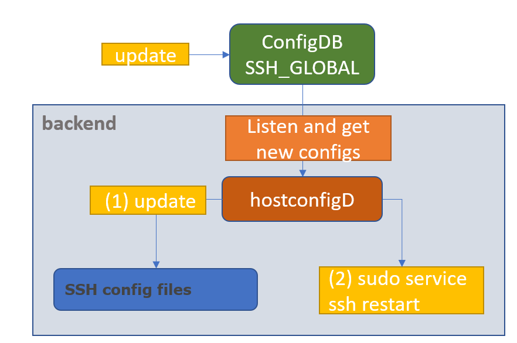
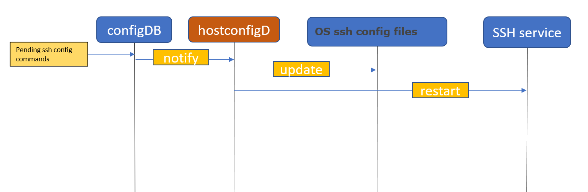

# SSH server global config HLD
##  1. <a name='TableofContent'></a>Table of Content 
- [SSH server global config HLD](#ssh-server-global-config-hld)
	- [1. Table of Content](#1-table-of-content)
		- [1.1. Revision](#11-revision)
		- [1.2. Scope](#12-scope)
		- [1.3. Definitions/Abbreviations](#13-definitionsabbreviations)
		- [1.4. Overview](#14-overview)
		- [1.5. Requirements](#15-requirements)
		- [1.6. Architecture Design](#16-architecture-design)
			- [1.6.1. Configuration modules](#161-configuration-modules)
		- [1.7. High-Level Design](#17-high-level-design)
				- [Flow diagram](#flow-diagram)
			- [1.7.1 Flow description](#171-flow-description)
			- [1.7.2 ssh server policies](#172-ssh-server-policies)
		- [1.8. Init flow](#18-init-flow)
			- [1.8.1. Feature Default](#181-feature-default)
		- [1.9. SAI api](#19-sai-api)
		- [1.10. Configuration and management](#110-configuration-and-management)
			- [1.10.1. SSH\_SERVER configDB table](#1101-ssh_server-configdb-table)
			- [1.10.2. ConfigDB schemas](#1102-configdb-schemas)
			- [1.10.3. CLI/YANG model Enhancements](#1103-cliyang-model-enhancements)
			- [1.10.4. Config DB Enhancements](#1104-config-db-enhancements)
			- [1.10.5. Manifest (if the feature is an Application Extension)](#1105-manifest-if-the-feature-is-an-application-extension)
		- [1.11. Warmboot and Fastboot Design Impact](#111-warmboot-and-fastboot-design-impact)
		- [1.12. Restrictions/Limitations](#112-restrictionslimitations)
		- [1.13. Testing Requirements/Design](#113-testing-requirementsdesign)
			- [1.13.1. Unit Test cases](#1131-unit-test-cases)
			- [1.13.2. System Test cases](#1132-system-test-cases)
		- [1.14. Open/Action items - if any](#114-openaction-items---if-any)
###  1.1. <a name='Revision'></a>Revision  

|  Rev  |   Date   |   Author   | Change Description |
| :---: | :------: | :--------: | ------------------ |
|  0.1  | 17/05/23 | Yona Coen  | Initial version    |
|  0.2  | 16/06/23 | Ivan Davydenko | Add descriptions for auto-logout and max-sessions parameters  |


###  1.2. <a name='Scope'></a>Scope  

This hld doc for ssh server global configurations describes the requirements, architecture and general flow details of ssh server config in SONIC OS based switches.

###  1.3. <a name='DefinitionsAbbreviations'></a>Definitions/Abbreviations 

	SSH - secure shell
	TCP - Transmission Control protocol	
	
###  1.4. <a name='Overview'></a>Overview 

We want to allow configuring ssh server global settings. This will feature will include 3 configurations in the first phase, but can be extended easily to include additional configurations.

###  1.5. <a name='Requirements'></a>Requirements

This feature requires a dedicated table in the configuration DB, and enhancements of hostcfg demon, in order to allow modifing the relvant ssh configuration files. In order to override ssh configurations, we need to have write access to ssh config files such as /etc/ssh/sshd_config

###  1.6. <a name='ArchitectureDesign'></a>Architecture Design 
####  1.6.1. <a name='ConfigModules'></a>Configuration modules


We want to enhance configDB to include table for ssh server global configurations. In addition, hostcfg demon will include a dedicated flow in order to modify ssh config files, once ssh server global config table entries are changed.

###  1.7. <a name='High-LevelDesign'></a>High-Level Design 

We want to enable global ssh server configuration in SONIC. In order to do so will touch few areas in the system:
1. configDB - to include a dedicated table for configurations
2. hostcfg demon - to update ssh config files once configDB relevant areas are modified (and for this feature, ssh server config table)
3. OS ssh config files - specific for this stage we are only /etc/ssh/sshd_config is going to be modifed by the hostcfg demon.
4. OS ssh service - to be restarted after each configuration change.

Note:

The Daemon is running in the host (without container) that matches this feature, because it is basically writing policies on ssh config files from the OS.
##### Flow diagram

#### 1.7.1 <a name='Flow description'></a>Flow description
When the feature is enabled, by modifying the DB manually, user will set ssh server policies/configuration (see options below) by modifing CONFIG_DB in SSH_SERVER_TABLE.

The hostcfgd daemon will be extended to listen to ssh policies/configurations from SSH_SERVER table, parse the inputs and set the new policies to ssh config files, and update ssh server afterwards.


#### 1.7.2 <a name='ssh server policies'></a>ssh server policies

We want to enable configuring the following policies, with default values are taken from OS (Debian):
| Policy         |      Action                                                               | Param values            | Default OS value |
|----------------|---------------------------------------------------------------------------|-------------------------|------------------|
| authentication retries |     Number of attempts to try to log in   before rejecting the session    |     3-100               |     6            |
| login timeout  |     SSH session timeout                                                   |     1-600 (secs)        |     120          |
| ports          |     Port numbers for SSH                                                  |     1-65535             |     22           |
| auto logout    |     Inactivity timeout for SSH session                                    |     0-35000 (min)       |     15           |
| max sessions   |     Max number of concurrent logins                                       |     3-100               |     100          |


###  1.8. <a name='Init flow'></a>Init flow 

During init flow we will set default ssh policies, same as default values in DebianOS. Default values will be added to init_cfg.json.j2, and updated in sshd_config file accordingly.
####  1.8.1. <a name='FeatureDefault'></a>Feature Default

Description of default values in init_cfg.json regarding ssh server config:
```
authentication retries: 6 
login timeout: 120 //seconds
ports: 22
auto logout: 15 //minutes
max sessions: 100
```
###  1.9. <a name='SAI api'></a>SAI api
NA
###  1.10. <a name='Configurationandmanagement'></a>Configuration and management 

####  1.10.1. <a name='SSH_SERVERconfigDBtable'></a>SSH_SERVER configDB table

```
SSH_SERVER:{
	POLICIES:{
		"authentication_retries": {{num}}
		"login_timeout": {{secs}}
		"ports": {{num}}
		"auto_logout": {{min}}
		"max_syslogins": {{num}}
	}
}
```
#### 1.10.2. ConfigDB schemas
```
; Defines schema for SSH_SERVER configuration attributes in SSH_SERVER table:
key                                   = "POLICIES"             ;ssh server configuration
; field                               = value
authentication_retries                = 3*DIGIT                 ; number of login attepmts, should be 100 max
LOGIN_TIMEOUT                         = 3*DIGIT                 ; login timeout in secs unit, max is 600 secs
PORTS                                 = 5*DIGIT                 ; ssh port number - max is 65535
auto_logout                           = 5*DIGIT                 ; autologout timer - max is 35000 minutes
max_syslogins                         = 3*DIGIT                 ; maximum number of concurrent sessions - max is 100
```

####  1.10.3. <a name='CLIYANGmodelEnhancements'></a>CLI/YANG model Enhancements
```yang
//filename:  sonic-ssh_server.yang
module sonic-ssh-server {
    yang-version 1.1;
    namespace "http://github.com/Azure/sonic-ssh_server";
	prefix ssh-server;

    description "ssh server CONFIG YANG Module for SONiC OS";

	revision 2023-01-26 {
        description
            "First Revision";
    }

    container sonic-ssh_server {
		container SSH_SERVER {
			description "SSH SERVER CONFIG part of config_db.json";
			container POLICIES {
				leaf authentication_retries {
					description "number of login attepmts";
					default 6;
					type uint8 {
						range 1..100;
					}
				}
				leaf login_timeout {
					description "login timeout (secs unit)";
					default 120;
					type uint32 {
						range 1..600;
					}
				}
				leaf ports {
					description "ssh port numbers";
					default "22";
                    type string {
                        pattern '([1-9]|[1-9]\d{1,3}|[1-5]\d{4}|6[0-4]\d{3}|65[0-4]\d{2}|655[0-2]\d|6553[0-6])(,([1-9]|[1-9]\d{1,3}|[1-5]\d{4}|6[0-4]\d{3}|65[0-4]\d{2}|655[0-2]\d|6553[0-6]))*' {
                            error-message "Invalid port numbers value";
                            error-app-tag ssh-server-ports-invalid-value;
                        }
                    }
				}
				leaf auto_logout {
					description "inactivity timeoout (min unit)";
					default 15;
					type uint32 {
						range 0..35000;
					}
				}
				leaf max_syslogins {
					description "limit of concurrent system logins";
					default 100;
					type uint32 {
						range 3..100;
					}
				}
			}/*container POLICIES */
		} /* container SSH_SERVER  */
    }/* container sonic-ssh-server */
}/* end of module sonic-ssh-server */
```
####  1.10.4. <a name='ConfigDBEnhancements'></a>Config DB Enhancements

The ConfigDB will be extended with next objects:

```json
{
	"SSH_SERVER": {
		"POLICIES":{
			"authentication_retries": "6",
			"login_timeout": "120",
			"ports": "22",
			"auto_logout": "15",
			"max_syslogins": "100",
		}
	}
}
```

####  1.10.5. <a name='ManifestifthefeatureisanApplicationExtension'></a>Manifest (if the feature is an Application Extension)


NA

		
###  1.11. <a name='WarmbootandFastbootDesignImpact'></a>Warmboot and Fastboot Design Impact  
NA

###  1.12. <a name='RestrictionsLimitations'></a>Restrictions/Limitations  

###  1.13. <a name='TestingRequirementsDesign'></a>Testing Requirements/Design  
Explain what kind of unit testing, system testing, regression testing, warmboot/fastboot testing, etc.,
Ensure that the existing warmboot/fastboot requirements are met. For example, if the current warmboot feature expects maximum of 1 second or zero second data disruption, the same should be met even after the new feature/enhancement is implemented. Explain the same here.
Example sub-sections for unit test cases and system test cases are given below. 

####  1.13.1. <a name='UnitTestcases'></a>Unit Test cases  
- Configuration – good flow
  - Verify default values
  - Configure all types and check updated values
  - Configure authentication_retries to X and try to connect with wrong password X+1 times
  - Configure login_timeout to X, try to connect and wait for X+5 seconds (need to disconnect)
  - Configure ports to 222 and see if unable to connect to 22
  - Configure auto_logout to X, login and wait for X+5 seconds (need to disconnect)
  - Configure max_syslogins to X and see if unable to login to X+1 concurrent sessions
  
####  1.13.2. <a name='SystemTestcases'></a>System Test cases

###  1.14. <a name='OpenActionitems-ifany'></a>Open/Action items - if any 

	
NOTE: All the sections and sub-sections given above are mandatory in the design document. Users can add additional sections/sub-sections if required.
