# Scope

This document describes the design of using BFD to detect static route nexthop and based on BFD session state, installing, updating, and removing static route to the system.<br  /> 

One important assumption is that the BFD session (for a static route nexthop) in this BFD Static Route application is not shared with any other applications (i.e., creating or deleting static route BFD session has no impact on other applications).<br /> 

<span style="color:blue"> <br>
*Note: This document describes how to create local BFD session for a static route based on static route configuration. Creating BFD session in its peer system is out of the scope of this document.*<br />  
</span>


# Static Route BFD Design
## Functional Requirements

1. Create BFD session for each static route nexthop based on static route configuration <br>
2. Delete BFD session if the nexthop is not needed (triggered by removing static route from configration)<br>
3. Install, update, removing static route (i.e., update nexthop, remove static route if no nexthop) based on BFD session state change.<br>
4. When the application (static route BFD) restarts, recover static routes and BFD session states from redis database (config_db, appl_db and state_db) without impacting any existing installed static routes and BFD sessions. <br  />  

## System Overview with Static Route BFD
A new component, StaticRouteBfd is introduced to support static route BFD. <br>

In the following diagram, StaticRouteBfd monitors config_db STATIC_ROUTE_TABLE. If there is a static route configured with bfd, StaticRouteBfd creates BFD session by updating appl_db BFD_SESSION_TABLE. StaticRouteBfd also monitors state db for BFD session state change. Based on BFD session state, StaticRouteBfd updates appl_db STATIC_ROUTE_TABLE to add/delete static route or update its nexthop list.<br>

To work with existing bgpcfgd StaticRouteMgr, an optional field "bfd" is introduced in STATIC_ROUTE_TABLE. When the "bfd" field present and is "true" in config db, StaticRouteMgr ignores this static route and StaticRouteBfd handles it. StaticRouteBfd writes this static route to appl_db based on BFD session state for this static route nexthop. <br>

To avoid StaticRouteTimer deleting StaticRouteBfd created static route entry in appl_db, a new field "expiry" is introduced in appl_db STATIC_ROUTE_TABLE schema. StaticRouteBfd sets "expiry"="false" when it writes a static route to appl_db STATIC_ROUTE_TABLE. When StaticRouteTimer see "expiry"="false", it ignores this static route entry. <br>


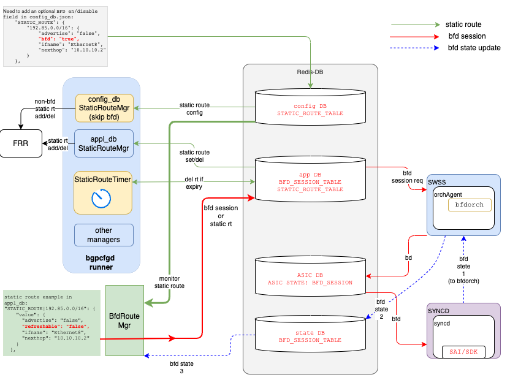
<br />

## BFD session local IP address
StaticRouteBfd create BFD session for each nexthop inside a BFD enabled static route. The BFD peer IP is the nexthop, the BFD local address (source IP address of the BFD packet) is the lookup result using the following method:<br />

1. find the interface name for the nexthop
2. lookup the config_db, find the IP address of that interface
3. choose the IP address which has same type of nexthop (IPv4 or IPv6)
4. If no IP address found, use local loopback IP address, and log a warning message for that. <br /><br />

In the example (assume the "bfd" field is "true"), for the nexthop "20.0.10.3", the corresponding  interface name is PortChannel10.
From the interface configuration, we can found two IP addresses, an IPv4 address 20.0.10.1 and an IPv6 address 2603:10E2:400:10::1. we choose 20.0.10.1 because the nexthop IP address is IPv4 address. <br /><br />

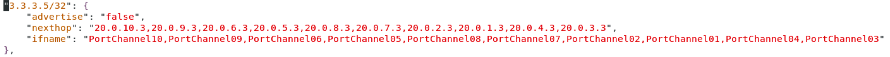
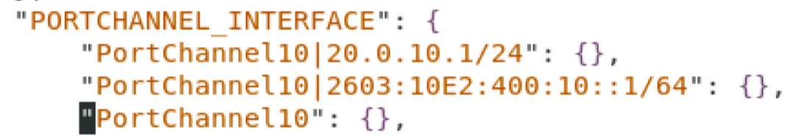
<br />

## DB changes
 
Two optional fields are introduced to STATIC_ROUTE_TABLE: <br>
1. "bfd" -- Default value is false when this field is not configured
2. "expiry" -- Default value is true when this field is not configured

StaticRouteMgr(config_db) and StaticRouteBfd check "bfd" field in config_db STATIC_ROUTE_TABLE.<br>
StaticRouteBfd sets "expiry"="false" in appl_db STATIC_ROUTE_TABLE. 
StaticRouteTimer checks "expiry" field to skip the static route entry timeout checking.<br>

[*Reference: STATIC_ROUTE_TABLE schema:* 
 [STATIC_ROUTE table in CONFIG_DB](https://github.com/Azure/SONiC/blob/master/doc/static-route/SONiC_static_route_hdl.md#3211-static_route).]

```JSON
;Defines IP static route  table
;
;Status: stable

key                 = STATIC_ROUTE|vrf-name|prefix ;
vrf-name            = 1\*15VCHAR ; VRF name
prefix              = IPv4Prefix / IPv6prefix
nexthop             = string; List of gateway addresses;
ifname              = string; List of interfaces
distance            = string; {0..255};List of distances.
                      Its a Metric used to specify preference of next-hop
                      if this distance is not set, default value 0 will be set when this field is not configured for nexthop(s)
nexthop-vrf         = string; list of next-hop VRFs. It should be set only if ifname or nexthop IP  is not
                      in the current VRF . The value is set to VRF name
                      to which the interface or nexthop IP  belongs for route leaks.
blackhole           = string; List of boolean; true if the next-hop route is blackholed.
                      Default value false will be set when this field is not configured for nexthop(s)
bfd                 = string; "true" or "false". "true" if use bfd to monitor nexthop
expiry              = string; "true" or "false". "false" if need to skip timeout checking
```

## Internal tables in StaticRouteBfd
Four tables (i.e., dictionary, map, etc) are needed to use BFD session to monitor nexthop and update static route.<br>

1. TABLE_CONFIG: config_db STATIC_ROUTE_TABLE cache (for the route with "bfd"="true" only)
2. TABLE_NEXTHOP: different prefixes may have same nexthop. This table is used to track which prefix is using the nexthop.
3. TABLE_BFD: bfd session created by StaticRouteBfd. The contents are part of appl_db BFD_SESSION_TABLE (for the session its peer IP is in nexthop table). *Assumption: BFD session is not shared with other applications*
4. TABLE_SRT: the static routes written to appl_db STATIC_ROUTE_TABLE by BfdRouteManager (with "expiry"="false"). It's nexthop list might be different from the configuration depends on BFD session state.<br>

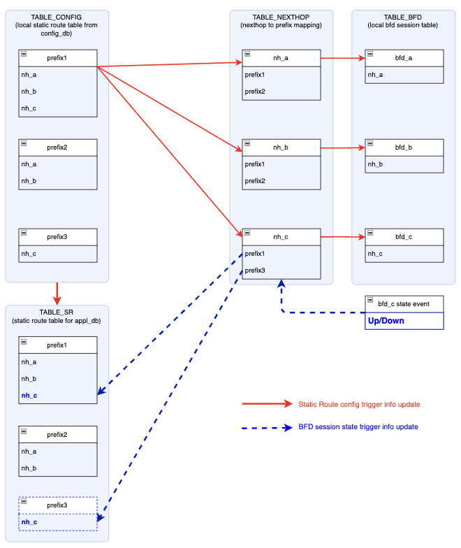
<br  />  

## Adding/updating static route flow
When a new static route is added to config_db STATIC_ROUTE_TABLE, the following steps are taken.

* 1\. StaticRouteBfd is notified of the new static route. Skip this route if there is no "bfd" field or "bfd"="false".
* 2\. StaticRouteBfd check TABLE_CONFIG to see if the route is already in this table
   * If the route is NOT in the TABLE_CONFIG:
       * A new route will be added to TABLE_CONFIG.
       * A new route will be added to TABLE_SRT, but make it's nexthop list empty (BFD state update will modify the nexthop list).
       * For each next hop, need to check TABLE_NEXTHOP,
            1. if the entry already exist, add prefix to the existing nexthop entry, break.
            2. create a new entry with prefix if there is no such entry yet, update TABLE_BFD and write it to redis appl_db BFD_SESSION_TABLE to create BFD session
   * If the route is in the TABLE_CONFIG already, update the corresponding fields. For nexthop list, compare it to identify which nexthop is new added and which is deleted.
       * For the new added nexthop, add to TABLE_SRT.
       * For the deleted nexthop, look up the TABLE_NEXTHOP to get nexthop entry. Remove the prefix from the nexthop entry.
            1. if the is no prefix in that nexthop entry, delete the corresponding BFD sessions (from redis appl_db and state_db) and delete that nexhop entry 

## Deleting static route flow
* 1\. StaticRouteBfd is notified and gets the prefix.
* 2\. StaticRouteBfd check TABLE_CONFIG to see if the route is already in this table
    * If the route is NOT in the table, done (should not happen)
    * If the route is in the table, For each nexthop in the static route entry:
        * Look up the TABLE_NEXTHOP to get nexthop entry, remove the prefix from the nexthop entry.
        * If there is no prefix in that nexthop entry, delete the corresponding BFD sessions (from redis appl_db and state_db) and delete that nexhop entry
        * Delete the entry from TABLE SR and delete it from appl_db STATIC_ROUTE_TABLE


## BFD session state update flow
StaticRouteBfd will be notified if there is any update in state_db BFD_SESSION_TABLE.<br>

* 1\. Look up TABLE_BFD, ignore the event if session is not found in local table. Otherwise get the nexthop 
* 2\. Look up TABLE_NEXTHOP using nexthop from step #1, get nexthop entry
* 3\. For each prefix in the nexthop entry, lookup TABLE_SRT table to get the static route entry.
    * If the BFD session state is UP and this nexthop is in the static route entry's nexthop list, no action needed, break;
    * If the BFD session state is UP and this nexthop is NOT in the static route entry's nexthop list:
        * Add this nexthop to the static route entry's nexthop list, set "expiry": "false", write this static route to redis appl_db STATIC_ROUTE_TABLE.
    * If the BFD session state is DOWN and this nexthop is NOT in the static route entry's nexthop list, no action needed
    * If the BFD session state is DOWN and this nexthop is in the static route entry's nexthop list,
        * Delete this nexthop from the static route entry's nexthop list 
            * if the static route entry's nexthop list is empty, delete this static route from redis appl_db, break;
            * if the static route entry's nexthop list is NOT empty, write it to redis appl_db STATIC_ROUTE_TABLE with "expiry"="false".
<br>
<br>

## Table reconciliation after StaticRouteBfd crash/restart
When StaticRouteBfd crashes or restarts, it loses all the internal table contents. Need to rebuild the internal tables from redis DB (i.e., configuration DB, application DB, state DB, etc), and do cross checking between these tables and redis db to make the information consistent among these tables, and then start to process the events received from redis DB.

### Start event listening
Start event listening before the following table and redis DB reconciliation, so the event won't be missing during the reconciliation.
<br>

### Build TABLE_CONFIG
Read redis config_db STATIC_ROUTE_TABLE, pick the route with "bfd"="true" static route and build TABLE_CONFIG
<br>

### Build TABLE_NEXTHOP
Loop each entry in TABLE_CONFIG, build TABLE_NEXTHOP
<br>

### Build TABLE_BFD and create BFD session if needed
* 1\. read redis appl_db BFD_SESSION_TABLE, lookup the above TABLE_NEXTHOP, build internal TABLE_BFD table.<br>
      *Notes: there is a bfd session leak risk here: when the last crash point is after deleting a nexthop (caused by deleting a static route in config) but before deleting BFD session from redis DB. The recover procedure cannot tell if this BFD session was created from StaticRouteBfd but no nexthop need it anymore.*

* 2\. loop TABLE_NEXTHOP, create BFD session for the nexthop which has no corresponding entry in TABLE_BFD
<br>

### Build TABLE_SRT and sync-up with redis appl_db STATIC_ROUTE_TABLE
* 1\. loop TABLE_CONFIG to build TABLE_SRT with empty nexthop list
* 2\. read redis state_db BFD_SESSION_TABLE, for each BFD session in TABLE_BFD and the BFD session state is UP, get nexthop
    * Get prefix list from TABLE_NEXTHOP, and loop this list. For each prefix lookup TABLE_SRT to get prefix entry
        * Add the above nexthop to this prefix's nexthop list
* 3\. read redis appl_db STATIC_ROUTE_TABLE, collect all the entries with "expiry"="false" (StaticRouteBfd created static route entry)
* 4\. loop TABLE_SRT table, for each static route, compare with the route in above step #3, 
    * Skip this entry if the static route matches (same nexthop list)
    * Delete the redis appl_db static route if the nexthop list is empty in TABLE_SRT
    * Update static route in redis appl_db, "expiry"="false".
<br>

### Start event processing
Start event processing after the above table and redis DB reconciliation.<br>
In the rare case that, data were read from DB but also get an event later, cause rewrite BFD session or Static Route to appl_DB with same contents should not be a problem.
<br>

## Examples
A few examples for the cases that adding/deleting static route, and also different prefixes may include same nexthop in their nexthop list.

### Add static route for prefix1 with 3 nexthop (nh_a, nh_b and nh_c)

1. when static route prefix1  ("bfd"="true") is added to config_db STATIC_ROUTE_TABLE, StaticRouteBfd creates an entry in TABLE_CONFIG, include all the information for this static route
2. StaticRouteBfd also creates an entry in TABLE_SRT, includes all the information in this static route but nexthop list is empty.
3. For each nexthop in the nexthop list, nh_a, nh_b and nh_c, StaticRouteBfd creates an entry in TABLE_NEXTHOP, prefix1 is added to their prefix list.
4. for each nexthop, a BFD entry is added to TABLE_BFD
5. for each BFD entry, BFD session will be created by writing to appl_db BFD_SESSION_TABLE

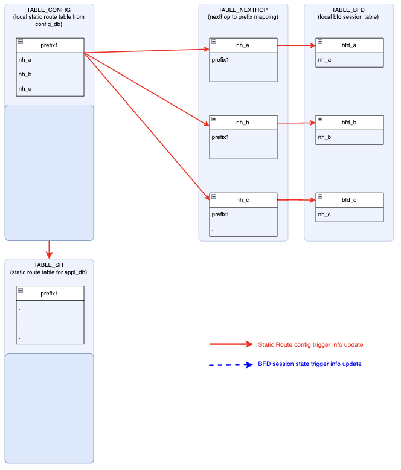
<br>
<br>

### Add static route for prefix2 with 2 nexthop (nh_a and nh_b)

1. when static route prefix2  ("bfd"="true") is added to config_db STATIC_ROUTE_TABLE, StaticRouteBfd creates an entry in TABLE_CONFIG, include all the information for this static route
2. StaticRouteBfd also creates an entry in TABLE_SRT, includes all the information in this static route but nexthop list is empty.
3. For each nexthop in the nexthop list, nh_a and nh_b, because they are alerady in the TABLE_NEXTHOP, StaticRouteBfd add prefix2 to nh_a and nh_b's prefix list, don't need to create BFD sessions because they were created when add prefix1

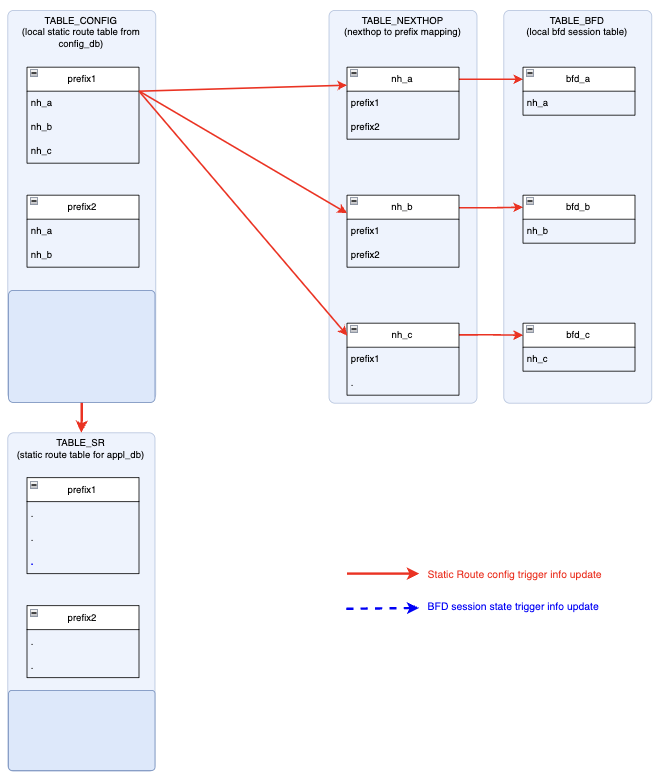
<br>
<br>

### Add static route for prefix3 with nexthop nh_c (similar with prefix2)

1. when static route prefix3  ("bfd"="true") is added to config_db STATIC_ROUTE_TABLE, StaticRouteBfd creates an entry in TABLE_CONFIG, include all the information for this static route
2. StaticRouteBfd also creates an entry in TABLE_SRT, includes all the information in this static route but nexthop list is empty.
3. For nh_c, because they are alerady in the TABLE_NEXTHOP, StaticRouteBfd add prefix3 to nh_c's prefix list, don't need to create BFD sessions because they were created when add prefix1
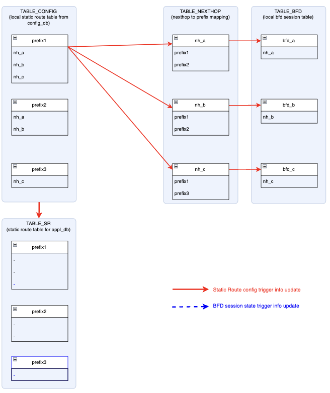
<br>
<br>

### Receive a bfd_c state UP event

1. StaticRouteBfd lookup TABLE_BFD to confirm this event is for me and get nh_c
2. Use nh_c lookup TABLE_NEXTHOP to get its prefix list: prefix1 and prefix3
3. If nh_c is not in TABLR_SR prefix1 nexthop list, add it to this nexthop list, and update this static route to redis appl_db STATIC_ROUTE_TABLE with "expiry"="false" to install the static route to sonic
4. If nh_c is not in TABLR_SR prefix3 nexthop list, add it to this nexthop list, and update this static route to redis appl_db STATIC_ROUTE_TABLE with "expiry"="false" to install the static route to sonic<br>
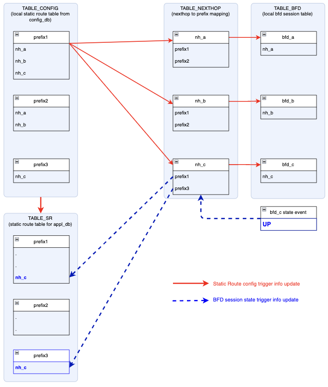
<br>
<br>

### Receive a bfd_c state DOWN event

1. StaticRouteBfd lookup TABLE_BFD to confirm this event is for me and get nh_c
2. use nh_c lookup TABLE_NEXTHOP to get its prefix list: prefix1 and prefix3
3. check nh_c is in TABLR_SR prefix1 nexthop list, remove it from this nexthop list. Because the nexhop list is empty now, remove this static route from redis appl_db STATIC_ROUTE_TABLE, uninstall this route from sonic
4. check nh_c is in TABLR_SR prefix3 nexthop list, remove it from this nexthop list. Because the nexhop list is empty now, remove this static route from redis appl_db STATIC_ROUTE_TABLE, uninstall this route from sonic

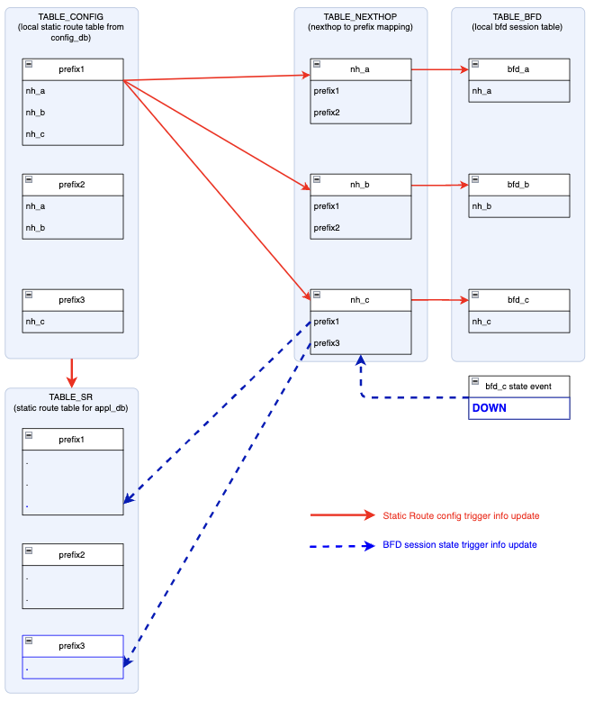
<br>
<br>

## Dynamc static route "bfd" config chagne support
When a static route "bfd" field changes (from "true" to "false", or from "false" to "true"), the owner(StaticRouteMgr or StaticRouteBfd) of this static routes also changes. StaticRouteMgr and StaticRouteBfd need to work together to handle this runtime ownershop change.<br>
When StaticRouteMgr gets a static route update (redis SET event) event, it checks the static route "bfd" field and its local cache. If the "bfd" field is "true" and the prefix is in its local cache(it handles this route before the update), the StaticRouteMgr delete it from its local cache and does not do any furhter processing for this route.
For the static route without "bfd" field (or "bfd" field is "false"), the current StaticRouteMgr bahavior is, it compare the nexthop list between the updated static route and the nexthop list in its local cache, to decice if need to delete or add the nexthops, the StaticRouteBfd uses this behavior to handle "bfd" field dynamic change.   

### bfd field changes from "false" to "true"
1. when the "bfd" was "false", the route was installed by StaticRouteMgr(config_db), and StaticRouteMgr(config_db) maintains its local cache.
2. When StaticRouteMgr detects "bfd" changing from "false" to "true", the StaticRouteMgr deletes the static route from its local cache, but it does NOT uninstall the route from FRR, so the system can still use installed route before the BFD session get created and state becomes UP. <br>
*    * Note: StaticRouteBfd (work with StaticRouteMgr(appl_db)) may update/install the route immediately if BFD session is already created and ready. Deleting the route from StaticRouteMgr(config_db) may conflict with StaticRouteBfd update, cause race condition and unpredictable result.
3. When StaticRouteBfd detects "bfd" changing from "false" to "true" (using its local cache), it writes a static route entry to APPL_DB STATIC_ROUTE_TABLE with "bfd" field "false" to let StaticRouteMgr(appl_db) install the route with full nexhop list and update StaticRouteMgr(appl_db) local cache. 
<br>
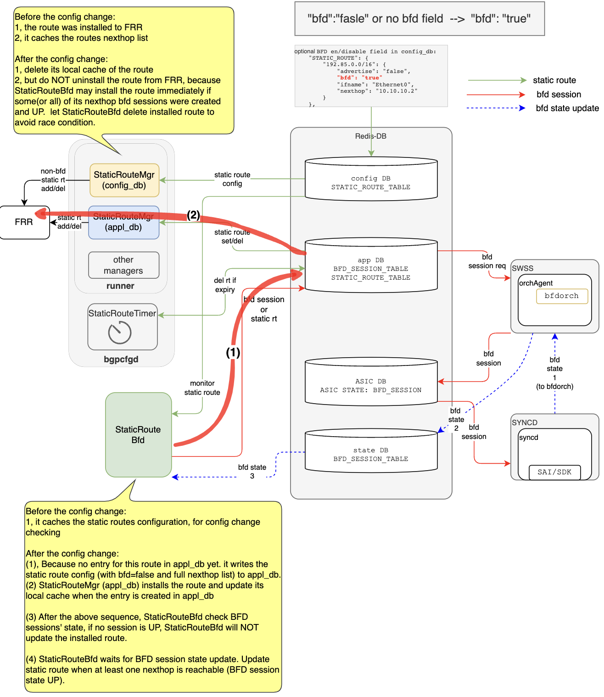
<br>

4. Depends on the BFD session state, StaticRouteBfd will update the static route immediately or hold for a while, to not blocking the current traffic.
*    * 4.1 If all the BFD sessions are DOWN, StaticRouteBfd will NOT update the route installed until at least one nexthop become reachable (BFD session state becomes UP). Because that BFD session may be temporarily DOWN (in state_db) during BFD session creation and initialization stage. 
<br>
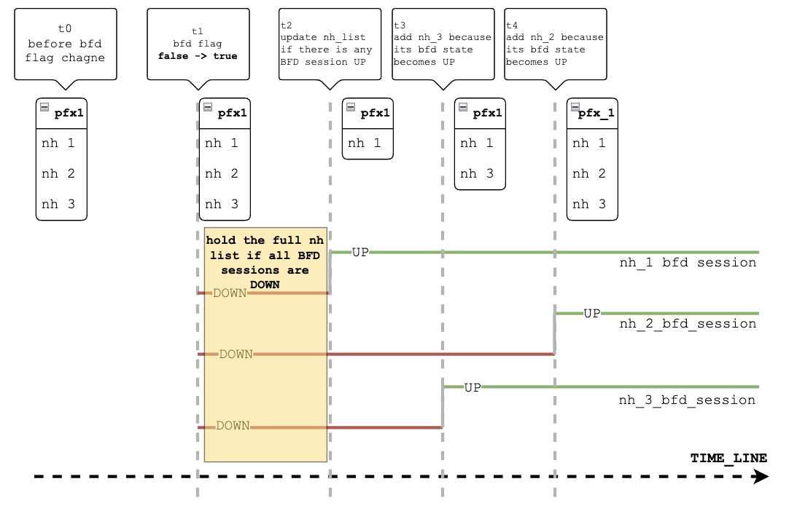
<br>
*    * 4.2 Considering nexthop sharing, some (or all) of the nexhop BFD sessions might be already created and becomes UP, StaticRouteBfd updates the routes with new nexthop list (depends on which BFD sessions are UP).
<br>
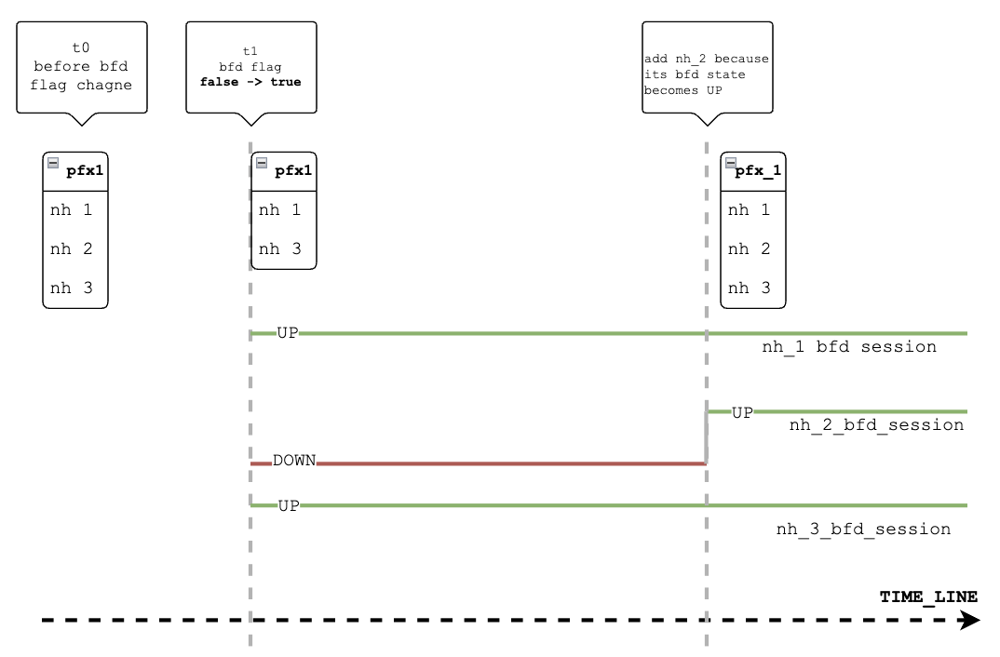
<br>


### bfd field changes from "true" to "false"
1. when StaticRouteMgr(config_db) get an updated static route with "bfd" field "false", it install the route as usual. Because it will install the route will all the nexthops in the route, it does not need to uninstall the StaticRouteBfd installed route (the nexthop list is a subset of configured nexthop list).
2. The StaticRouteBfd need to follow this sequence to delete the entry from APPL_DB STATIC_ROUTE_TABLE, but NOT trigger StaticRouteMgr(appl_db) to uninstall the route:
*    * 2.1. StaticRouteBfd writes a static route entry to APPL_DB STATIC_ROUTE_TABLE with "bfd" field **"true"** to let StaticRouteMgr(appl_db) clear the route in its cahce. 
*    * 2.2. StaticRouteBfd then delete the static route entry from APPL_DB. Because  StaticRouteMgr(appl_db) already cleared this route in the above step, so the StaticRouteMgr(appl_db) will do nothing when it see the APPL_DB STATIC_ROUTE_TABLE delete event.
<br>
<br>
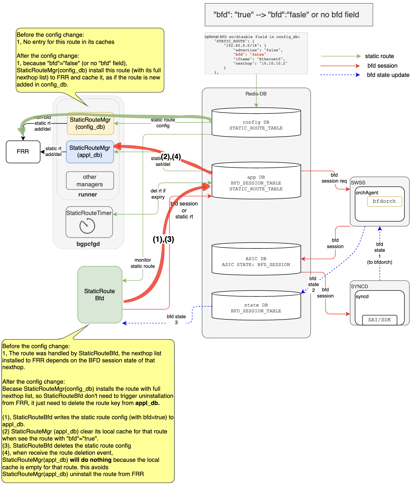
<br>
<br>

# Tests
Description:<br>
* 1\. Plan to use a single testbed to test the StaticRouteBfd.
    * 1.1 using 'show bfd peer' cnd to check BFD session
    * 1.2 test script update state_db BFD_SESSION_TABLE directly without peer BFD session from remote system, then check the static route in local system. 
* 2\. Because that there are design changes in StaticRouteMgr and StaticRouteTimer, need to run regression test (without "bfd" field configured, and "bfd"="false" configured)decribled in the following documents. 
    * 2.1 https://github.com/sonic-net/SONiC/blob/master/doc/static-route/SONiC_static_route_hdl.md#4-unit-test-and-automation
    * 2.2 https://github.com/sonic-net/SONiC/blob/master/doc/static-route/SONiC_static_route_expiration_hdl.md#tests
* 3\. for the StaticRouteBfd, use 2 routes for the following tests
    * 3.1 static route A: has 3 nexthops -- nh_1, nh_2 and nh_3 (the address depends on test setup) in its configuration
    * 3.2 static route B: has 1 nexthop -- nh_2 (same in static route A, to test nexthop overlap among static routes, for BFD session creation and BFD state update)
<br>
<br>

## Non-restart Testing (testcase without application restart/crash)
<br>

### 1. Test static route config with "bfd"="true" 

| Step              | Goal                              | Expected Outcome    |
|---------------------------|---------------------------------------|------|
| config static route A with "bfd"="true" | Verify bfd session creation.  | 1, bfd sessions are created <br> 2,this static route is not installed to the system because current BFD session state should be DOWN.  |
| change one BFD session state to UP state for nh_1 in state_db | verify bfd state change handling | static route A (with 1 nexthop nh_1) should be installed to the system. "expiry" field should be "false" in appl_db |
| change one BFD session state to UP state for nh_2 in state_db | verify bfd state change handling | static route A (with nexthop nh_1 and nh_2) should be installed to the system |
| change one BFD session state to UP state for nh_3 in state_db | verify bfd state change handling | static route A (with nexthop nh_1,nh_2 and nh_3) should be installed to the system |
<br>

### 2. Test static route config update with "bfd"="true" 

| Step              | Goal                              | Expected Outcome    |
|---------------------------|---------------------------------------|------|
| from test #1, reconfig static route A with 2 nexthops nh_1 and nh_2 and "bfd"="true" | Verify static route reconfig with bfd | 1, bfd sessions for nh_3 is removed <br> 2,static route A is updated to the system with 2 nexthop nh_1 and nh_2  |
<br>

### 3. Test static route ("bfd"="true") removed from config 

| Step              | Goal                              | Expected Outcome    |
|---------------------------|---------------------------------------|------|
| from test #2, remove static route A from config | Verify static route with bfd uninstallation | 1, bfd sessions for nh_1 and nh_2 are removed <br> 2,static route A is uninstalled from the system  |
<br>

### 4. Test 2 static routes ("bfd"="true") share same nexthop 

| Step              | Goal                              | Expected Outcome    |
|---------------------------|---------------------------------------|------|
| config static route A with 3 nexthops and "bfd"="true", <br>change BFD sessions state to UP for all the nexthops | install static route A | static route A is installed to the system  |
|config static route B with nh_2 and "bfd"="true"|verify shared nexthop|static route B is installed to the system, <br>because the BFD session for nh_2 was changed to UP in the above step |
<br>

### 5. Test BFD session DOWN causing static route updated/removed 

| Step              | Goal                              | Expected Outcome    |
|---------------------------|---------------------------------------|------|
|from above test #4, 2 static routes (sharing nh_2) were installed|pre-install route A and route B||
| change BFD session state for nh_2 to DOWN in state_db | verify BFD session state handling | 1, nh_2 is removed from satic route A in the system.<br>2, static route B is uninstalled from the system because it has no nexthop in its nexthop list  |
<br>

### 6. Test BFD session UP causing static route updated/reinstalled 

| Step              | Goal                              | Expected Outcome    |
|---------------------------|---------------------------------------|------|
|from above test #5, bfd session for nh_2 is DOWN ||
| change BFD session state for nh_2 to UP in state_db | verify BFD session state handling | 1, nh_2 is added back to satic route A in the system.<br>2, static route B is reinstalled to the system because nh_2 is active now  |
|remove static route A and B|clear static route for next tests|1, route A and B are removed.<br>2, BFD sessions for the nexthops are removed|
<br>

## StaticRouteBfd retart/crash testing (crash/restart StaticRouteBfd process)
<br>
Verify StaticRouteBfd restore information from redis DB and rebuild its internal data struct and continue to handle config or state change.

### 7. Restart StaticRouteBfd between static route config and BFD state update 

| Step              | Goal                              | Expected Outcome    |
|---------------------------|---------------------------------------|------|
|configure static route A with "bfd"="true"  |verify bfd session creation| 3 bfd sessions for nh_1/nh_2/nh_3 are created|
|kill and restart StaticRouteBfd process|verify StaticRouteBfd restart||
|update BFD session state to UP for nh_1/nh_2/nh_3|veify bfd state handling after restart|static route A (with nh_1/nh_2/nh_3) is installed to the system|
<br>

### 8. Restart StaticRouteBfd between static route adding/deleting 

| Step              | Goal                              | Expected Outcome    |
|---------------------------|---------------------------------------|------|
|install static route A (result from the above step #7)  |install route A| route A with nh_1/nh_2/nh_3 are installed|
|kill and restart StaticRouteBfd process|verify StaticRouteBfd restart||
|update BFD session state to UP for nh_1/nh_2/nh_3|veify bfd state handling after restart|static route A (with nh_1/nh_2/nh_3) is installed to the system|
|config static route B with "bfd"="true"|verify internal table recovery after restart|route B is installed because BFD session for nh_2 is up before StaticRouteBfd is UP|
|kill and restart StaticRouteBfd process|verify StaticRouteBfd restart||
|remove static route A from config|verify internal table recovery after restart|1,route A should be uninstalled from the system<br>2,BFD sessions for nh_1 and nh_3 are removed<br>3, BFD session for nh_2 keep unchanged because route B still need it|
||||

## StaticRouteBfd bfd field dynamic change
<br>
Verify StaticRouteBfd handling for static route "bfd" flag dynamic changing 

### 9. Change a static route "bfd" field from true to false
| Step              | Goal                              | Expected Outcome    |
|---------------------------|---------------------------------------|------|
|configure static route A with "bfd"="true"  |verify bfd session creation| 3 bfd sessions for nh_1/nh_2/nh_3 are created|
|update BFD session state to UP for nh_1/nh_2/nh_3|veify bfd state handling |static route A (with nh_1/nh_2/nh_3) is installed to the system|
|change "bfd" flag to "false"|verify flag change handling|1, BFD session should be deleted<br>2, StaticRouteBfd update static route with "bfd"="true" to appl_db to clear StaticRouteMgr cache<br>3, StaticRouteBfd deletes the static route from appl_db |
<br>

### 10. Change a static route "bfd" field from false to true
| Step              | Goal                              | Expected Outcome    |
|---------------------------|---------------------------------------|------|
|start from the above test#9   |set a "bfd"="false" state inside StaticRouteBfd||
|reconfigure static route A with "bfd"="true"  |verify bfd session creation after config change| 1, 3 bfd sessions for nh_1/nh_2/nh_3 are created<br>2, before any BFD session becomes UP, StaticRouteBfd install the configured static route with its full nexthop list, this update appl_db and StaticRouteMgr(appl_db) local cache|
|update BFD session state to UP for nh_1/nh_2/nh_3|veify bfd state handling |static route A (with nh_1/nh_2/nh_3, which BFD session is UP) is installed to the system|
<br>

