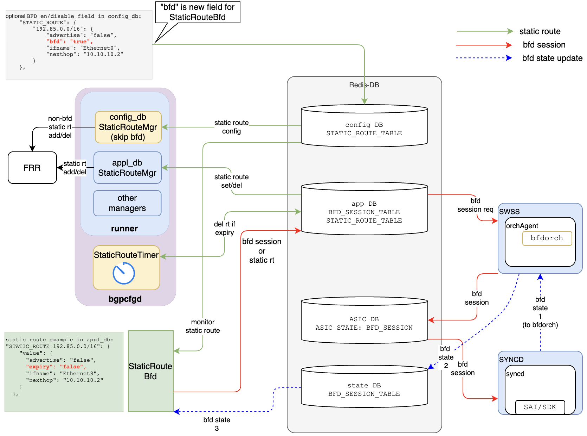

# Scope

This document describes the design of using BFD to detect static route nexthop and based on BFD session state, installing, updating, and removing static route to the system.  

One important assumption is that the BFD session (for a static route nexthop) in this BFD Static Route application is not shared with any other applications (i.e., creating or deleting static route BFD session has no impact on other applications).  

  
*Note: This document describes how to create local BFD session for a static route based on static route configuration. Creating BFD session in its peer system is out of the scope of this document.*   

# Static Route BFD Design
## Functional Requirements

1. Create BFD session for each static route nexthop based on static route configuration  
2. Delete BFD session if the nexthop is not needed (triggered by removing static route from configration) 
3. Install, update, removing static route (i.e., update nexthop, remove static route if no nexthop) based on BFD session state change. 
4. When the application (static route BFD) restarts, recover static routes and BFD session states from redis database (config_db, appl_db and state_db) without impacting any existing installed static routes and BFD sessions.    

## System Overview with Static Route BFD
A new component, BfdRouteMgr is introduced to support static route BFD.  

In the following diagram, BfdRouteMgr monitors config_db STATIC_ROUTE_TABLE. If there is a static route configured with bfd, BfdRouteMgr creates BFD session by updating appl_db BFD_SESSION_TABLE. BfdRouteMgr also monitors state db for BFD session state change. Based on BFD session state, BfdRouteMgr updates appl_db STATIC_ROUTE_TABLE to add/delete static route or update its nexthop list. 

To work with existing bgpcfgd StaticRouteMgr, an optional field "bfd" is introduced in STATIC_ROUTE_TABLE. When the "bfd" field present and is "true" in config db, StaticRouteMgr ignores this static route and BfdRouteMgr handles it. BfdRouteMgr writes this static route to appl_db based on BFD session state for this static route nexthop.  

To avoid StaticRouteTimer deleting BfdRouteMgr created static route entry in appl_db, a new field "refreshable" is introduced in appl_db STATIC_ROUTE_TABLE schema. BfdRouteMgr sets "refreshable"="false" when it writes a static route to appl_db STATIC_ROUTE_TABLE. When StaticRouteTimer see "refreshable"="false", it ignores this static route entry.  

## DB changes
 
Two optional fields are introduced to STATIC_ROUTE_TABLE:  
1. "bfd"
2. "refreshable"

StaticRouteMgr(config_db) and BfdRouteMgr check "bfd" field in config_db STATIC_ROUTE_TABLE. 
BfdRouteMgr sets "refreshable"="false" in appl_db STATIC_ROUTE_TABLE. 
StaticRouteTimer checks "refreshable" field to skip the static route entry timeout checking. 

[*Reference: STATIC_ROUTE_TABLE schema:* 
 [STATIC_ROUTE table in CONFIG_DB](https://github.com/Azure/SONiC/blob/master/doc/static-route/SONiC_static_route_hdl.md#3211-static_route).]

## Internal tables in BfdRouteMgr
Four tables (i.e., dictionary, map, etc) are needed to use BFD session to monitor nexthop and update static route. 

1. TABLE_CONFIG: config_db STATIC_ROUTE_TABLE cache (for the route with "bfd"="true" only)
2. TABLE_NEXTHOP: different prefixes may have same nexthop. This table is used to track which prefix is using the nexthop.
3. TABLE_BFD: bfd session created by BfdRouteMgr. The contents are part of appl_db BFD_SESSION_TABLE (for the session its peer IP is in nexthop table). *Assumption: BFD session is not shared with other applications*
4. TABLE_SR: the static routes written to appl_db STATIC_ROUTE_TABLE by BfdRouteManager (with "refreshable"="false"). It's nexthop list might be different from the configuration depends on BFD session state. 

   

## Adding/updating static route flow
When a new static route is added to config_db STATIC_ROUTE_TABLE, the following steps are taken.

* 1\. BfdRouteMgr is notified of the new static route. Skip this route if there is no "bfd" field or "bfd"="false".
* 2\. BfdRouteMgr check TABLE_CONFIG to see if the route is already in this table
   * If the route is NOT in the TABLE_CONFIG:
       * A new route will be added to TABLE_CONFIG.
       * A new route will be added to TABLE_SR, but make it's nexthop list empty (BFD state update will modify the nexthop list).
       * For each next hop, need to check TABLE_NEXTHOP,
            1. if the entry already exist, add prefix to the existing nexthop entry, break.
            2. create a new entry with prefix if there is no such entry yet, update TABLE_BFD and write it to redis appl_db BFD_SESSION_TABLE to create BFD session
   * If the route is in the TABLE_CONFIG already, update the corresponding fields. For nexthop list, compare it to identify which nexthop is new added and which is deleted.
       * For the new added nexthop, add to TABLE_SR.
       * For the deleted nexthop, look up the TABLE_NEXTHOP to get nexthop entry. Remove the prefix from the nexthop entry.
            1. if the is no prefix in that nexthop entry, delete the corresponding BFD sessions (from redis appl_db and state_db) and delete that nexhop entry 

## Deleting static route flow
* 1\. BfdRouteMgr is notified and gets the prefix. Skip this route if there is no "bfd" field or "bfd"="false".
* 2\. BfdRouteMgr check TABLE_CONFIG to see if the route is already in this table
    * If the route is NOT in the table, done (should not happen)
    * If the route is in the table, For each nexthop in the static route entry:
        * Look up the TABLE_NEXTHOP to get nexthop entry, remove the prefix from the nexthop entry.
        * If there is no prefix in that nexthop entry, delete the corresponding BFD sessions (from redis appl_db and state_db) and delete that nexhop entry
        * Delete the entry from TABLE SR and delete it from appl_db STATIC_ROUTE_TABLE

## BFD session state update flow
BfdRouteMgr will be notified if there is any update in state_db BFD_SESSION_TABLE. 

* 1\. Look up TABLE_BFD, ignore the event if session is not found in local table. Otherwise get the nexthop 
* 2\. Look up TABLE_NEXTHOP using nexthop from step #1, get nexthop entry
* 3\. For each prefix in the nexthop entry, lookup TABLE_SR table to get the static route entry.
    * If the BFD session state is UP and this nexthop is in the static route entry's nexthop list, no action needed, break;
    * If the BFD session state is UP and this nexthop is NOT in the static route entry's nexthop list:
        * Add this nexthop to the static route entry's nexthop list, set "refreshable": "false", write this static route to redis appl_db STATIC_ROUTE_TABLE.
    * If the BFD session state is DOWN and this nexthop is NOT in the static route entry's nexthop list, no action needed
    * If the BFD session state is DOWN and this nexthop is in the static route entry's nexthop list,
        * Delete this nexthop from the static route entry's nexthop list 
            * if the static route entry's nexthop list is empty, delete this static route from redis appl_db, break;
            * if the static route entry's nexthop list is NOT empty, write it to redis appl_db STATIC_ROUTE_TABLE with "refreshable"="false".
 
 

## Table reconciliation after BfdRouteMgr crash/restart
When BfdRouteMgr crashes or restarts, it loses all the internal table contents. Need to rebuild the internal tables from redis DB (i.e., configuration DB, application DB, state DB, etc), and do cross checking between these tables and redis db to make the information consistent among these tables, and then start to process the events received from redis DB.

### Start event listening
Start event listening before the following table and redis DB reconciliation, so the event won't be missing during the reconciliation.
 

### Build TABLE_CONFIG
Read redis config_db STATIC_ROUTE_TABLE, pick the route with "bfd"="true" static route and build TABLE_CONFIG
 

### Build TABLE_NEXTHOP
Loop each entry in TABLE_CONFIG, build TABLE_NEXTHOP
 

### Build TABLE_BFD and create BFD session if needed
* 1\. read redis appl_db BFD_SESSION_TABLE, lookup the above TABLE_NEXTHOP, build internal TABLE_BFD table. 
      *Notes: there is a bfd session leak risk here: when the last crash point is after deleting a nexthop (caused by deleting a static route in config) but before deleting BFD session from redis DB. The recover procedure cannot tell if this BFD session was created from BfdRouteMgr but no nexthop need it anymore.*

* 2\. loop TABLE_NEXTHOP, create BFD session for the nexthop which has no corresponding entry in TABLE_BFD
 

### Build TABLE_SR and sync-up with redis appl_db STATIC_ROUTE_TABLE
* 1\. loop TABLE_CONFIG to build TABLE_SR with empty nexthop list
* 2\. read redis state_db BFD_SESSION_TABLE, for each BFD session in TABLE_BFD and the BFD session state is UP, get nexthop
    * Get prefix list from TABLE_NEXTHOP, and loop this list. For each prefix lookup TABLE_SR to get prefix entry
        * Add the above nexthop to this prefix's nexthop list
* 3\. read redis appl_db STATIC_ROUTE_TABLE, collect all the entries with "refreshable"="false" (BfdRouteMgr created static route entry)
* 4\. loop TABLE_SR table, for each static route, compare with the route in above step #3, 
    * Skip this entry if the static route matches (same nexthop list)
    * Delete the redis appl_db static route if the nexthop list is empty in TABLE_SR
    * Update static route in redis appl_db, "refreshable"="false".
 

### Start event processing
Start event processing after the above table and redis DB reconciliation. 
In the rare case that, data were read from DB but also get an event later, cause rewrite BFD session or Static Route to appl_DB with same contents should not be a problem.
 

## Examples
A few examples for the cases that adding/deleting static route, and also different prefixes may include same nexthop in their nexthop list.

### Add static route for prefix1 with 3 nexthop (nh_a, nh_b and nh_c)

1. when static route prefix1  ("bfd"="true") is added to config_db STATIC_ROUTE_TABLE, BfdRouteMgr creates an entry in TABLE_CONFIG, include all the information for this static route
2. BfdRouteMgr also creates an entry in TABLE_SR, includes all the information in this static route but nexthop list is empty.
3. For each nexthop in the nexthop list, nh_a, nh_b and nh_c, BfdRouteMgr creates an entry in TABLE_NEXTHOP, prefix1 is added to their prefix list.
4. for each nexthop, a BFD entry is added to TABLE_BFD
5. for each BFD entry, BFD session will be created by writing to appl_db BFD_SESSION_TABLE

 
 

### Add static route for prefix2 with 2 nexthop (nh_a and nh_b)

1. when static route prefix2  ("bfd"="true") is added to config_db STATIC_ROUTE_TABLE, BfdRouteMgr creates an entry in TABLE_CONFIG, include all the information for this static route
2. BfdRouteMgr also creates an entry in TABLE_SR, includes all the information in this static route but nexthop list is empty.
3. For each nexthop in the nexthop list, nh_a and nh_b, because they are alerady in the TABLE_NEXTHOP, BfdRouteMgr add prefix2 to nh_a and nh_b's prefix list, don't need to create BFD sessions because they were created when add prefix1

 
 

### Add static route for prefix3 with nexthop nh_c (similar with prefix2)

1. when static route prefix3  ("bfd"="true") is added to config_db STATIC_ROUTE_TABLE, BfdRouteMgr creates an entry in TABLE_CONFIG, include all the information for this static route
2. BfdRouteMgr also creates an entry in TABLE_SR, includes all the information in this static route but nexthop list is empty.
3. For nh_c, because they are alerady in the TABLE_NEXTHOP, BfdRouteMgr add prefix3 to nh_c's prefix list, don't need to create BFD sessions because they were created when add prefix1

 
 

### Receive a bfd_c state UP event

1. BfdRouteMgr lookup TABLE_BFD to confirm this event is for me and get nh_c
2. use nh_c lookup TABLE_NEXTHOP to get its prefix list: prefix1 and prefix3
3. check nh_c is not in TABLR_SR prefix1 nexthop list, add it to this nexthop list, and update this static route to redis appl_db STATIC_ROUTE_TABLE with "refreshable"="true" to install the static route to sonic
4. check nh_c is not in TABLR_SR prefix3 nexthop list, add it to this nexthop list, and update this static route to redis appl_db STATIC_ROUTE_TABLE with "refreshable"="true" to install the static route to sonic 

 
 

### Receive a bfd_c state DOWN event

1. BfdRouteMgr lookup TABLE_BFD to confirm this event is for me and get nh_c
2. use nh_c lookup TABLE_NEXTHOP to get its prefix list: prefix1 and prefix3
3. check nh_c is in TABLR_SR prefix1 nexthop list, remove it from this nexthop list. Because the nexhop list is empty now, remove this static route from redis appl_db STATIC_ROUTE_TABLE, uninstall this route from sonic
4. check nh_c is in TABLR_SR prefix3 nexthop list, remove it from this nexthop list. Because the nexhop list is empty now, remove this static route from redis appl_db STATIC_ROUTE_TABLE, uninstall this route from sonic

 
 
