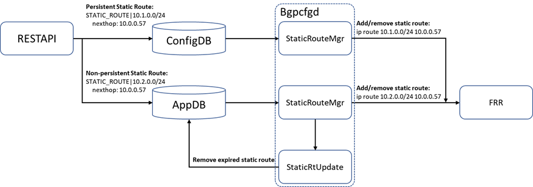

# Scope

This document describes the design of enabling static route support with an expiration timer.

# Static Route Expiration Design
### Static route requirement

a. Allow users to configure static routes that are either persistent or non-persistent via RESTAPI.
b. Non-persistent static routes get removed after a period is no renewal config is given.
c. Persistent static routes are active unless an explicit removal config is provided.

### DB changes

A table STATIC_ROUTE is added in APPL_DB to support the expiration timer of static routes. The schema of STATIC_ROUTE table in APPL_DB is the same as the [STATIC_ROUTE table in CONFIG_DB](https://github.com/Azure/SONiC/blob/master/doc/static-route/SONiC_static_route_hdl.md#3211-static_route).

```
STATIC_ROUTE|vrf-name|prefix (vrf-name is optional with default value of “default”)
      “nexthop” : string; List of gateway addresses;
      “ifname” : string; List of interfaces
      “distance” : string; {0..255};List of distances.
                      It is a Metric used to specify a preference of next-hop
                      if this distance is not set, default value 0 will be set when this field is not configured 
      “nexthop-vrf” : string; list of next-hop VRFs. 
      “blackhole” : string; List of boolean; true if the next-hop route is blackholed.
                      Default value false will be set when this field is not configured for nexthop(s)

```

### Module interaction diagram

The following diagram captures the high-level interactions between related modules:



Detailed flow:
a. Upon receiving a static route request, RESTAPI determines whether the route is persistent based on the request information. RESTAPI then put persistent ones to STATIC_ROUTE table in Config_DB and non-persistent ones to STATIC_ROUTE table in Appl_DB.
b. There are two StaticRouteMgr in bgpcfgd that subscribe to STATIC_ROUTE tables in Config_DB and Appl_DB, respectively. Both StaticRouteMgr program the static route to FRR according to the information in their corresponding tables.
c. The StaticRouteMgr that subscribes to Appl_DB (non-persistent routes) shares its route information with a new module StaticRtUpdate that follows a timer to remove the aged static routes.
The RESTAPI is responsible for handling the cases where there is conflict configurations between persistent static route and non-persistent static route. The persistent route should take effect in case of conflict. When RESTAPI programs a non-persistent route, it would first check for conflict entries in persistent static route table in Config_DB and program only if there is no conflict. On the other hand, when RESTAPI programs a persistent static route, it would first remove the conflict non-persistent static routes in Appl_DB.

### StaticRtUpdate module design

The StaticRtUpdate module follows a fixed-period timer (e.g., 180s). At the end of each period, the module removes the non-persistent static routes without a renewal request given in the period. The following diagram captures the state change in the StaticRtUpdate module.


There are three states that represent active, pending removal, and removed route states, respectively. The active state represents there is a renewal request in the current period; the pending removal state indicates there is not yet a renewal request in the current period and the route will get removed at the end of the period; the removed state indicates that the static route is aged and removed. The following is a description of the detailed state change:
(1)	Active to Active: in cases that there is an update request for a static route in the active state, StaticRouteMgr will update the route accordingly whereas the route state remains in the active state.
(2)	Active to Pending Removal: at the end of a timer period, the StaticRtUpdate module marks all routes in the active state to the pending removal state. As such, the routes without an update request in the next period will get removed at the end of the next period.
(3)	Pending Removal to Active: when a renewal request arrives, the StaticRtUpdate module updates the state of the route to Active so that it will be kept at the end of the timer period.
(4)	Pending Removal to Removed: at the end of a timer period, the StaticRtUpdate module removes the routes in the Pending Removal state (no renewal request in the period) from Appl_DB. As such, the aged static routes get removed.

# Tests
### Test static route with expiration 

| Step              | Goal                              | Expected Outcome    |
|---------------------------|---------------------------------------|------|
| Create a non-persistent route. Send packets to addresses in the route prefix. | Verify static route creation.  | Packet received at the nexthops of the static route. |
| Wait for one expiration period. Send packets to addresses in the route prefix. | Verify static route within an expiration period. | Packet received at the nexthops of the static route. |
| Wait for another expiration period. Send packets to addresses in the route prefix. | Verify static route expiration. | Packet received at the nexthops of the default route. |

### Test static route with expiration and renewal

| Step              | Goal                              | Expected Outcome    |
|---------------------------|---------------------------------------|------|
| Create a non-persistent route. Send packets to addresses in the route prefix. | Verify static route creation.  | Packet received at the nexthops of the static route. |
| Wait for one expiration period. Send a route renewal request. Send packets to addresses in the route prefix. | Verify static route renewal. | Packet received at the nexthops of the static route. |
| Wait for one expiration period. Send packets to addresses in the route prefix. | Verify static route within an expiration period. | Packet received at the nexthops of the static route. |
| Wait for another expiration period. Send packets to addresses in the route prefix. | Verify static route expiration. | Packet received at the nexthops of the default route. |

###  Test of the same route with both persistent and non-persistent configuration

| Step              | Goal                              | Expected Outcome    |
|---------------------------|---------------------------------------|------|
| Create a non-persistent route. Send packets to addresses in the route prefix. | Verify non-persistent static route creation.  | Packet received at the nexthops of the static route. |
| Create a persistent route for the same prefix with a different nexthop group. Send packets to addresses in the route prefix. | Verify conflict between persistent and non-persistent static route. | Packet received at the nexthops of the persistent static route. |
| Wait for one expiration period. Send packets to addresses in the route prefix. | Verify static route within an expiration period. | Packet received at the nexthops of the persistent static route. |
| Wait for another expiration period. Send packets to addresses in the route prefix. | Verify static route expiration. | Packet received at the nexthops of the persistent static route. |
| Rereate a non-persistent route for the same prefix. Send packets to addresses in the route prefix. | Verify non-persistent static route creation. | Packet received at the nexthops of the persistent static route. |
| Remove the persistent static route. | Verify conflict resolution between persistent and non-persistent static route. | Packet received at the nexthops of the non-persistent static route. |
| Wait for one expiration period. Send packets to addresses in the route prefix. | Verify static route within an expiration period. | Packet received at the nexthops of the non-persistent static route. |
| Wait for another expiration period. Send packets to addresses in the route prefix. | Verify static route expiration. | Packet received at the nexthops of the default route. |
