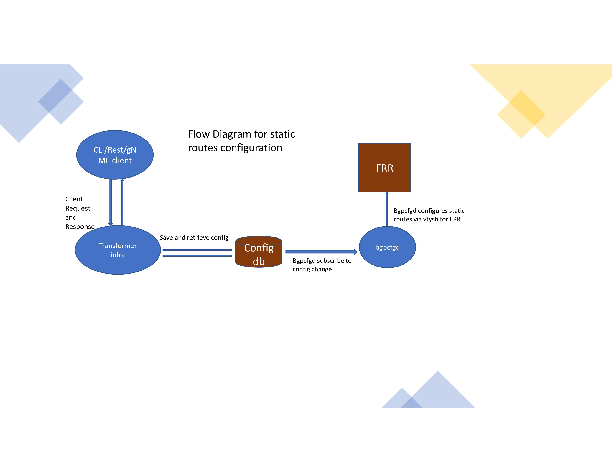

# Static IP route Configuration

Implement Static IP route Configuration via  CLI/REST/gNMI  in SONiC management framework for non-management routes.

# High Level Design Document
#### Rev 0.4

# Table of Contents
  * [List of Tables](#list-of-tables)
  * [Revision](#revision)
  * [About This Manual](#about-this-manual)
  * [Scope](#scope)
  * [Definition/Abbreviation](#definitionabbreviation)

# List of Tables
[Table 1: Abbreviations](#table-1-abbreviations)

# Revision
| Rev |     Date    |       Author                | Change Description                |
|:---:|:-----------:|:---------------------------:|-----------------------------------|
| 0.1 | 03/18/2020  |  Sucheta Mahara             | initial draft                     |
|  0.2| 03/20/2020 |  Venkatesan Mahalingam       | draft                             |
| 0.3 | 03/23/2020  |  Zhenhong Zhao              | FRR Config Support             |
| 0.4 | 04/13/2021  |  Sucheta Mahara &  Venkatesan Mahalingam             | Addressed community review comments             |

# About this Manual
This document provides general information about configuring static routes via Management CLI/REST/gNMI in Sonic.
# Scope
Covers general design for supporting static routes in SONiC Management framework.

# Definition/Abbreviation

### Table 1: Abbreviations
| **Term**                 | **Meaning**                         |
|--------------------------|-------------------------------------|
| IP                     |  Internet Protocol       |
| VRF                     | Virtual routing and forwarding


# 1 Feature Overview

The documents covers the various interfaces for configuring static routes using SONiC management framework.

## 1.1 Requirements

### 1.1.1 Functional Requirements

Provide ability to configure IPv4 and IPv6 static routes using SONiC management framework.

### 1.1.2 Configuration and Management Requirements
 - Implement Static ip route CLI Commands.
 - REST set/get support for Static IPv4 and IPv6 routes.
 - gNMI set/get support for Static IPv4 and IPv6 routes.

### 1.1.3 Warm Boot Requirements
With static routes configured, system will be able to do warmboot.

# 2 Functionality
## 2.1 Target Deployment Use Cases
Use of sonic management framework to configure routes.
## 2.2 Functional Description
Provide CLI, gNMI and REST support for static route configuration.

# 3 Design
## 3.1 Overview
An existing table STATIC_ROUTE (which is not used currently) will be used to write static route from the transformer for any CLI, rest or gNMI request. This table will be monitored by frrcfgd daemon and the config will be sent to vtysh shell for configuring in FRR.


## 3.2 DB Changes
### 3.2.1 CONFIG DB
STATIC_ROUTE table in config DB will be used to  support this feature.

#### 3.2.1.1 STATIC_ROUTE
```JSON
;Defines IP static route  table
;
;Status: stable

key                 = STATIC_ROUTE|vrf-name|prefix ;
vrf-name            = 1\*15VCHAR ; VRF name
prefix              = IPv4Prefix / IPv6prefix
nexthop             = string; List of gateway addresses;
ifname              = string; List of interfaces
distance            = string; {0..255};List of distances.
                      Its a Metric used to specify preference of next-hop
                      if this distance is not set, default value 0 will be set when this field is not configured for nexthop(s)
nexthop-vrf         = string; list of next-hop VRFs. It should be set only if ifname or nexthop IP  is not
                      in the current VRF . The value is set to VRF name
                      to which the interface or nexthop IP  belongs for route leaks.
blackhole           = string; List of boolean; true if the next-hop route is blackholed.
                      Default value false will be set when this field is not configured for nexthop(s)
```
The nexthop-vrf if set, will allow to create a leaked route in the current VRF(vrf-name). The vrf-name, nexthop-vrf, prefix, ifname, distance and blackhole are all parameters required to configure static routes and route leaks in vtysh.
If an interface is moved from one VRF to another and it exist in the STATIC_ROUTE table, the configured routes with that interface will become inactive. These routes are stored in vtysh "running config" and STATIC_ROUTE table. It is up to the user to remove stale/inactive routes. They will become active if/when the interface is bound again to the orignal VRF.

In this table each entry based on the index in the lists of  nexthop, ifname, distance, nexthop-vrf and blackhole  is a set. Together based on the index they specify one next-hop entry as there can be multiple next-hops for a prefix. Empty string and default values will be used to complete the set if required. Prefix and nexthop in a set is expected to have same address family.

In the example -1 table below (0.0.0.0, Ethernet0, 10, default, false) , (2.2.2.1, "", 0,"", false), (0.0.0.0, Ethernet12, 30, Vrf-GREEN, false) are the 3 sets defined for 3 configured next-hops for prefix 10.11.1.0/24 in Vrf-RED.
In example -2  the blackhole is true for second index and  only distance is relevant in blackholed route. Due to blackhole entry (with metric 40) all packets matching 10.12.11.0/24 will be discarded if other specified  nexthop is inactive.

```JSON
Example -1 :--

key                 = STATIC_ROUTE|Vrf-RED|10.11.1.0/24;
nexthop             = 0.0.0.0, 2.2.2.1, 0.0.0.0
ifname              = Ethernet0,"" , Ethernet12
distance            = 10,0,30
nexthop-vrf         = default,"",Vrf-GREEN

Note:
 Field "blackhole or distance" need not be specified if it has all default values for the sets. False for blackhole and 0 for distance.
 Field "nexthop or ifname or nexthop-vrf need not be specified if they have empty value in all the sets"

EXAMPLE 2:-
key                 = STATIC_ROUTE|default|10.12.11.0/24;
nexthop             = 2.2.2.3,""
distance            = 10,40
blackhole           = false, true


```


Note: This model is proposed in line with ROUTE_TABLE model in application DB used for route updates and "vrf hld" description of STATIC_ROUTE table (which is currently not in use). Some default values like 0.0.0.0 and empty strings are used to complete a set. See the CLI example later to see how the table is filled up step-by-step.


### 3.2.2 APP DB
A table "NEIGH_RESOLVE_TABLE" in application DB will be used to write unresolved next-hop for static routes. This table will be written by router/neighbor module of orchagent and consumed by nbrmgrd process.

## 3.3 Switch State Service Design
### 3.3.1 Orchestration Agent
Refer to section 3.2.2
## 3.4 SyncD
No change
## 3.5 SAI
No change
## 3.6 User Interface
### 3.6.1 Data Models

The following open config YANG model will be used to implement this feature.

    1) openconfig-network-instance.yang
    2) openconfig-local-routing.yang
openconfig-local-routing-ext.yang will be used to specify unsupported fields and extensions.

Supported YANG containers:-
```diff
module: openconfig-network-instance
    +--rw network-instances
       +--rw network-instance* [name]
          +--rw protocols
             +--rw protocol* [identifier name]
                +--rw identifier    -> ../config/identifier
                +--rw name          -> ../config/name
                +--rw static-routes
                +--rw static* [prefix]
                    +--rw prefix       -> ../config/prefix
                    +--rw config
                    |    +--rw prefix?  inet:ip-prefix
                    +--ro state
                    |  +--ro prefix?   inet:ip-prefix
                    +--rw next-hops
                      +--rw next-hop* [index]
                         +--rw index                -> ../config/index ----(Read note below)
                         +--rw config
                         |  +--rw index?      string
                         |  +--rw next-hop?   union
                         |  +--rw metric?     uint32
                         |  +--rw oc-local-routing-ext:nexthop-vrf-name?   string
                         |  +--rw oc-local-routing-ext:blackhole?          boolean
                         +--ro state
                         |  +--ro index?      string
                         |  +--ro next-hop?   union
                         |  +--ro metric?     uint32
                         |  +--rw oc-local-routing-ext:nexthop-vrf-name?   string
                         |  +--rw oc-local-routing-ext:blackhole?          boolean
                         +--rw interface-ref
                         |  +--rw config
                         |  |   +--rw interface?   -> /oc-if:interfaces/interface/name
                         |  +--ro state
                         |      +--ro interface?   -> /oc-if:interfaces/interface/name


```
New Parameters

|    Keyword    | Description |
|:-----------------:|:-----------:|
oc-local-routing-ext:nexthop-vrf-name|Specify the nexthop-vrf incase interface or next-hop is not in current instance(i.e VRF). This parameter is explicitly required  by vtysh to correctly install route leaks.
oc-local-routing-ext:blackhole | If set to true the nexhop is a blackholed route. Only metric is relevant when configuring blackhole next-hop for a prefix.

Note: Each next-hop entry has a key called "index" in openconfig yang as shown above. This key is used to uniquely identify a entry in the list of next-hops. This key will be formed based on "interface (interface name if present) + next-hop (next-hop-ip if present) + next-hop vrf-name(if present)" and is expected to be provided correctly  by the user for non-blackhole routes. For blackhole route DROP will be used as key. Either interface name  or next-hop-ip or both or blackhole  should be present for any route to be accessed. i.e Ethernet0_2.2.2.2_default, 3.3.3.3_Vrf-RED, DROP. This key will not be stored in config DB.


A new sonic-static-route.yang is defined to store entries in STATIC_ROUTE table in configDB.

```diff

module: sonic-static-route
  +--rw sonic-static-route
     +--rw STATIC_ROUTE
        +--rw STATIC_ROUTE_LIST* [vrf-name prefix]
           +--rw vrf-name   union
           +--rw prefix     inet:ip-prefix
           +--rw nexthop   string
           +--rw ifname    string
           +--rw distance  string
           +--rw nexthop-vrf string
           +--rw blackhole   string


```

### 3.6.2 CLI
#### 3.6.2.1 Configuration Commands
#### 3.6.2.2 ipv4/ipv6 route config commands
ip route command is used to configure IPv4  static routes in SONiC.
ipv6 route command is used to configure IPv6 static routes in SONiC.
##### 3.6.2.2.1 Syntax

Vrf (for default instance) and distance metric are optional in the CLI.

```
ip route [vrf <vrf-name>] <prefix: A.B.C.D/mask> {[interface <interface-name>] | [<next-hop-ip>] | [<next-hop-ip> interface <interface-name>] | [blackhole]} [nexthop-vrf <vrf-name>] [<distance Metric>]
```

```
ipv6 route [vrf <vrf-name>] <prefix: A.B.C.D/mask> {[interface <interface-name>] | [<next-hop-ip>] | [<next-hop-ip> interface <interface-name>] | [blackhole]} [nexthop-vrf <vrf-name>] [<distance Metric>]

```


Syntax Description:

|    Keyword    | Description |
|:-----------------:|:-----------:|
| vrf | The static routes will be configured in the specified VRF. If not specified, default VRF will be used.
| prefix | This is the destination prefix for IPv4 or IPv6 routes.
| interface | Specifies the interface to be used for this route. Specify nexthop-vrf correctly if interface is in another VRF.
| next-hop-ip | This provides the gateway IP for the prefix. Specify nexthop-vrf correctly if this IP is in another VRF.
| distance Metric| Specifies distance value for this route. Value from 1 to 255.
|nexthop-vrf| Specifies nexthop-vrf if interface or next-hop-ip is in another VRF.
|blackhole| Specifies if this nexthop is to be blackholed. Only distance metric is relevant for blackhole.


Example:

#### IPv4 examples
````
sonic(config)# ip route 10.1.1.1/24 10.1.1.3

In configDB new STATIC_ROUTE table will be filled with following entries for default VRF and prefix:-

key                 = STATIC_ROUTE|default|10.1.1.1/24;
nexthop             = 10.1.1.3

sonic(config)# ip route 10.1.1.1/24 Ethernet 12 nexthop-vrf Vrf-RED  20

Assumption is Ethernet12 is bound to Vrf-RED.
STATIC_ROUTE table entries are updated for newly added route:-

key                 = STATIC_ROUTE|default|10.1.1.1/24;
nexthop             = 10.1.1.3, 0.0.0.0
ifname              = "", Ethernet12
distance            = 0, 20
nexthop-vrf         = "", Vrf-RED


sonic(config)# ip route vrf Vrf-RED 10.5.6.6/24 10.5.6.1 nexthop-vrf default 10

Assumption is 10.5.6.1 is in default VRF.
A new STATIC_ROUTE table will be filled with following entries for Vrf-RED and prefix:-

key                 = STATIC_ROUTE|Vrf-RED|10.5.6.6/24;
vrf-name            = Vrf-RED
prefix              = 10.5.6.6/24
nexthop             = 10.5.6.1
distance            = 10
nexthop-vrf         = default

````

```
Note: "show ip route" will show installed static routes along with other routes. "show ip route static" can be used to display only static routes. All show information is fetched from FRR.

Syntax to show static routes

show ip route [vrf <vrf-name>] [static]

sonic# show ip route static
Codes:  K - kernel route, C - connected, S - static, B - BGP, O - OSPF
     > - selected route, * - FIB route, q - queued route, r - rejected route,
     # - not installed in hardware

      Destination    Gateway                Dist/Metric   Uptime

  S#  3.3.3.0/24   Direct       Ethernet4   150/0        00:33:31
  S#  6.6.6.0/24   via 6.6.6.1  Ethernet0   1/0          00:00:03
  S#  7.7.7.0/24   via 7.7.7.1  Ethernet12  36/0         00:01:56

```


#### IPv6 examples
````
sonic(config)# ipv6 route 2::/64 Ethernet 16

sonic(config)# ipv6 route 2001:FF21:1:1::/64 18:2:1::1 100

sonic(config)# ipv6 route 2111:dddd:0eee::22/128 blackhole 200

Note: "show ipv6 route " will show static routes along with other routes. This information will be fetched from FRR.
      To see only static routes use "show ipv6 route [vrf <vrf-name>] [static]"

sonic(config)# do show ipv6 route vrf <vrf-name>

````
##### 3.6.2.2.2 ipv4 /ipv6 Command to delete a static route.

The vrf is an optional parameter for default instance.

```
no ip route vrf <vrf-name> <prefix: A.B.C.D/mask> {[interface <interface-name>] | [<next-hop-ip>] | [<next-hop-ip> interface <interface-name>] | [blackhole]} [nexthop-vrf <vrf-name>]


```

```
no ipv6 route vrf <vrf-name> <prefix: A.B.C.D/mask> {[interface <interface-name>] | [<next-hop-ip>] | [<next-hop-ip> interface <interface-name>  ] | [blackhole]} [nexthop-vrf <vrf-name>]

```

##### CLI examples to delete static routes
````
sonic(config)# no ip route 10.1.1.1/24 Ethernet 12 nexthop-vrf Vrf-RED
sonic(config)# no ipv6 route 2::/64 Ethernet 16
sonic(config)# no ipv6 route 2001:FF21:1:1::/64 18:2:1::1
````

### 3.6.3 REST API Support
#### 3.6.3.1
##### Following REST operations will be supported

1. GET ,POST, PATCH and DELETE supported at /restconf/data/openconfig-network-instance:network-instances/network-instance={name}/protocols/protocol={identifier},{name1}/static-routes
2. GET , POST, PATCH and DELETE supported at /restconf/data/openconfig-network-instance:network-instances/network-instance={name}/protocols/protocol={identifier},{name1}/static-routes/static={prefix}
3. GET, POST and DELETE supported at /restconf/data/openconfig-network-instance:network-instances/network-instance={name}/protocols/protocol={identifier},{name1}/static-routes/static={prefix}/next-hops/next-hop={index}

Example of URI:-
```
# curl -X PATCH "https://192.168.1.1/restconf/data/openconfig-network-instance:network-instances/network-instance=default/protocols/protocol=STATIC,static/static-routes" -H "accept: application/yang-data+json" -H "Content-Type: application/yang-data+json" -d "{\"openconfig-network-instance:static-routes\": {\"static\": [{\"next-hops\": {\"next-hop\": [{\"index\": \"DROP\", \"config\": {\"index\": \"DROP\", \"blackhole\": true}}]}, \"prefix\": \"21.0.0.0/8\"}]}}" -u admin:xxxxx -k

# curl -kX GET "https://192.168.1.1/restconf/data/openconfig-network-instance:network-instances/network-instance=default/protocols/protocol=STATIC,static/static-routes" -H "accept: application/yang-data+json" -u admin:xxxxx -k | python3 -m json.tool
  % Total    % Received % Xferd  Average Speed   Time    Time     Time  Current
                                 Dload  Upload   Total   Spent    Left  Speed
100   334  100   334    0     0   1397      0 --:--:-- --:--:-- --:--:--  1409
{
    "openconfig-network-instance:static-routes": {
        "static": [
            {
                "config": {
                    "prefix": "21.0.0.0/8"
                },
                "next-hops": {
                    "next-hop": [
                        {
                            "config": {
                                "index": "DROP",
                                "openconfig-local-routing-ext:blackhole": true
                            },
                            "index": "DROP",
                            "state": {
                                "index": "DROP",
                                "openconfig-local-routing-ext:blackhole": true
                            }
                        }
                    ]
                },
                "prefix": "21.0.0.0/8",
                "state": {
                    "prefix": "21.0.0.0/8"
                }
            }
        ]
    }
}
```

## 3.7 FRR Configuration Support
### 3.7.1 Configuration Mapping to FRR
frrcfgd daemon will be used to forward configurations stored in STATIC_ROUTE table to FRR staticd daemon. It will subscribe to listen to STATIC_ROUTE table and if there is data update, it will convert associated data to FRR vtysh command request and send to FRR daemon to configure static route on Linux kernel.
#### 3.7.1.1 Table entry to command mapping
FRR vtysh command is composed with VRF/IP_prefix and nexthop data fields in STATIC_ROUTE table entry
#### FRR command syntax
```
configure terminal
vrf <src_vrf>
[no ]ip route <ip_prefix> [<nexthop_ip>] [<interface>][blackhole] [<distance>] [nexthop-vrf <nh_vrf>]
```
#### Mapping from table entry to FRR command arguments
|Parameter Name|Table Entry Key or Field|Type|Default or Null Value|
|:---:|:-----------:|:------------------:|-----------------------------------|
|src_vrf|first entry key*|optional for default VRF|"default"|
|ip_prefix|second entry key*|mandatory|-|
|nexthop_ip|entry field **nexthop****|optional if ifname is set or blackhole is true |"0.0.0.0" or "::"***|
|interface|entry field **ifname****|optional if nexthop_ip is set or blackhole is true |""|
|distance|entry field **distance****|optional|"0"|
|nexthop_vrf|entry field **nexthop-vrf****|required for route-leak case else optional |""|
|blackhole|entry field **blackhole***|required for blackhole next-hop else optional | false|

Note:
- *If table entry key contains only one item, it should be prefix_ip and src_vrf will be used with default value "default".
- **Each argument uses one item of corresponding list in table entry. If the item in list is "Null" value, this optional argument will not be added to mapped FRR commnand.
- ***The "Null" value of nexthop_ip should be chosen based on the address family of ip_prefix

#### Example of table entry and correspoinding FRR runnning config
Data in STATIC_ROUTE table:
```
127.0.0.1:6379[4]> hgetall STATIC_ROUTE|Vrf-test|1.1.1.0/16
1) "nexthop@"
2) "2.2.2.2,0.0.0.0"
3) "distance@"
4) "10,20"
5) "ifname@"
6) "Ethernet0,Ethernet4"
7) "nexthop-vrf@"
8) "Vrf-BLUE,Vrf-RED"
9) "blackhole@"
10) "false,false"
```
FRR running config:
```
!
vrf Vrf-test
 ip route 1.1.0.0/16 2.2.2.2 Ethernet0 10 nexthop-vrf Vrf-BLUE
 ip route 1.1.0.0/16 Ethernet4 20 nexthop-vrf Vrf-RED
 exit-vrf
!
```
### 3.7.2 Configuration Reload
All static route configurations were persistently stored in config DB STATIC_ROUTE table. After BGP container restarts, the configuration in DB needs to be re-applied. This configuration reload is done by generating staticd.conf file before FRR staticd daemon starts. A jinja template file will be used to map table entries to fill in staticd.conf file. The generated conf file is loaded by FRR daemon to configure static routes to system.

# 4 Unit Test and automation
The following test cases will be tested using CLI/REST/gNMI management interfaces and spytest will be incremeted.

|Test Cases (done on default instance and VRF)| Test Result |
| :------ | :----- |
|create route for a prefix with NH IP addresses|    verify the route is created|
|create route for a prefix with NH IP address and interface| verify route is created|
|create route for a prefix with interface only| verify route is created|
|create route for a prefix with NH IP addresses and NH VRF|    verify the route is created|
|create route for a prefix with NH IP address, interface and NH VRF| verify route is created|
|create route for a prefix with interface and NH VRF| verify route is created|
|create route for a prefix with NH IP addresses and distance|    verify the route is created|
|create route for a prefix with NH IP address, interface and distance | verify route is created|
|create route for a prefix with interface and distance | verify route is created|
|create route for a prefix with NH IP addresses, NH VRF and distane |    verify the route is created|
|create route for a prefix with NH IP address, interface and distance| verify route is created|
|create route for a prefix with interface, NH VRF and distance | verify route is created|
|create route for a prefix with blackhole and distance |verify route is created
|CLI: show ip route|   verify static routes are displayed with flag "S" (i.e Static)|
|Delete route for a prefix with NH IP addresses| verify the route is deleted|
|Delete route for a prefix with NH IP address and interface| verify route is deleted|
|Delete route for a prefix with interface only| verify route is deleted|
|Delete route for a prefix with NH IP addresses and NH VRF|    verify the route is deleted|
|Delete route for a prefix with NH IP address, interface and NH VRF| verify route is deleted|
|Delete route for a prefix with interface and NH VRF| verify route is deleted|
|Delete route for a prefix with blackhole| verify route is deleted|
| ###Negative test cases ###|
|Try creating a route with mismatched prefix(IPV4) and address(IPV6)| test will fail|
|Try creating a route with wrong distance like 300| test will fail|
|Try creating a route with non-existing VRF| backened will fail|

|Test Cases specific to REST/gNMI (done on default instance and VRF)| Test Result|
| :------ | :----- |
|Add single NH in a prefix| verify that is created|
|GET single NH in a prefix| verify the result with what was set|
|Delete single NH in a prefix| verify the route is deleted|
|Create multiple nexthop in a prefix| verify they are created|
|Use Get for a prefix with multiple next-hops|verify the output macthes with what was set|
|Delete a prefix | Verify all routes within the prefix are deleted|
|Create multiple prefix with multiple Next-hops in a VRF|verify all the routes are created|
|Use GET at static_routes level to get all the routes| verify the result with what was set|
|Write the configDB and reload the box| verify all the routes are configured correctly in FRR|
|Delete routes at static_routes level |verify all routes with the all prefixes are deleted|
|Try deleting a NH with wrong index key | failure returned|

Note: NH = next hop ;
Verification of config will be done using vtysh FRR shell comparison.
sonic-swss/tests/test_route.py will be augmented to write to new SONIC_ROUTE configdb table directly. Static route configuration will be verified thereafter.
