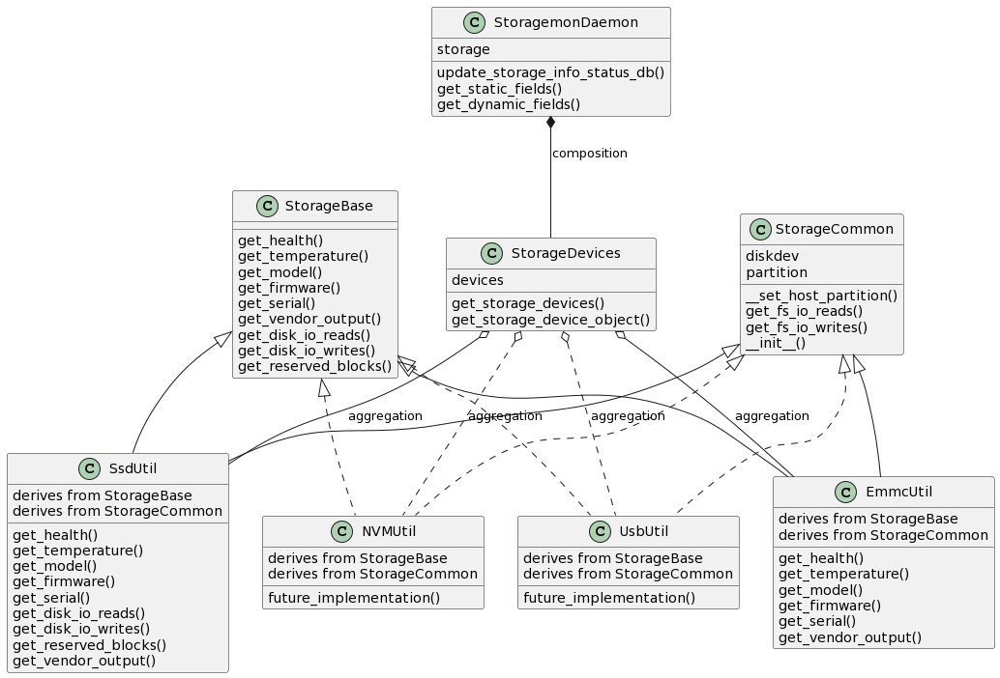

# SONiC Storage Monitoring Daemon Design #
### Rev 0.1 ###

 | Rev |     Date    |       Author       | Change Description                |
 |:---:|:-----------:|:------------------:|-----------------------------------|
 | 0.1 |             |      Ashwin Srinivasan  | Initial version                   |

## 1. Overview

This document is intended to provide a high-level design for a Storage monitoring daemon.

Solid-State Drives (SSDs) are storage devices that use NAND-flash technology to store data. They offer the end user significant benefits compared to HDDs, some of which include reliability, reduced size, increased energy efficiency and improved IO speeds which translates to faster boot times, quicker computational capabilities and an improved system responsiveness overall. Like all devices, however, they experience performance degradation over time on account of a variety of factors such as overall disk writes, bad-blocks management, lack of free space, sub-optimal operational temperature and good-old wear-and-tear which speaks to the overall health of the SSD. 

The goal of the Storage Monitoring Daemon (storagemond) is to provide meaningful metrics for the aforementioned issues and enable streaming telemetry for these attributes so that the required preventative measures are triggered in the eventuality of performance degradation.

## 2. Data Collection

We are intrested in the following characteristics that describe various aspects of the SSD:

### **2.1 Priority 0 Attributes** 

**The following are dynamic fields, offering up-to-date information that describes the current state of the SSD**

    - IO Reads
    - IO Writes
    - Reserved Blocks Count
    - Temperature

**IO Reads/Writes** - SSDs use wear-leveling algorithms to distribute write and erase cycles evenly across the NAND cells to extend their lifespan. However, write amplification can occur when data is written, rewritten, and erased in a way that creates additional write operations, which can slow down performance.

**Reserved Blocks Count** - Reserved blocks in a Solid State Drive (SSD) serve several critical purposes to enhance the drive's performance, reliability, and longevity. These reserved blocks are managed by the drive's firmware, and their specific allocation and management may vary between SSD manufacturers. The primary purposes of reserved blocks in an SSD are:

- **Bad-block replacement:** When the firmware detects a bad block, it can map it to a reserved block and continue using the drive without data loss.
- **Wear Leveling:** Reserved blocks are used to replace or relocate data from cells that have been heavily used, ensuring that all cells are used evenly. 
- **Over-Provisioning:** Over-provisioning helps maintain consistent performance and extends the lifespan of the SSD by providing additional resources for wear leveling and bad block management.
- **Garbage collection:** When files are deleted or modified, the old data needs to be erased and marked as available for new data. Reserved blocks can help facilitate this process by providing a temporary location to move valid data from blocks that need to be erased. 

**Temperature** - Extreme temperatures can affect SSD performance. Excessive heat can lead to throttling to prevent damage, while extreme cold can slow down data access.


### **2.2 Priority 1 Attributes**

**These are a combination of static (S) and dynamic (D) fields, offering secondary information that provides additional context about the SSD**

    - Vendor Model (S)
    - Serial Number (S)
    - Firmware (S)
    - Health (D)

These fields are self-explanatory.


### **2.3 `storagemond` Daemon Flow**

1. `storagemond` would be started by the `pmon` docker container
2. The daemon would gather the static info once init-ed, by leveraging the `SsdUtil` class and update the StateDB
3. It would parse the priority 0 attributes by leveraging `SsdUtil` class and update the StateDB every hour.

**NOTE:** The design requires a concurrent PR wherein SsdUtil class is enhanced to gather IO Read/Write stats and Reserved Blocks information as detailed in section [2.4.1 below](#241-ssdbase-api-additions).

This is detailed in the sequence diagram below:


### **2.4 Data Collection Logic**

The SONiC OS already contains logic to parse information about SSDs from several vendors by way of the `SsdUtil` class. We leverage this to gather the following information:

- Priority 0: Temperature
- Priority 1: All aforementioned attributes

This section will therefore only go into detail about data collection of attributes mentioned in [section 2.1](#21-priority-0-attributes).

#### **2.4.1 SsdBase API additions**

In order to collect IO reads/writes and number of reserved blocks, we would need to add the following member methods to the `SsdBase` class in [ssd_base.py](https://github.com/sonic-net/sonic-platform-common/blob/master/sonic_platform_base/sonic_ssd/ssd_base.py) and provide a generic implementation in [ssd_generic.py](https://github.com/sonic-net/sonic-platform-common/blob/master/sonic_platform_base/sonic_ssd/ssd_generic.py):


```
class SsdBase(object):

...

def get_io_reads(self):
"""
Retrieves the total number of Input/Output (I/O) reads done on an SSD

Returns:
    An integer value of the total number of I/O reads
"""

def get_io_writes(self):
"""
Retrieves the total number of Input/Output (I/O) writes done on an SSD

Returns:
    An integer value of the total number of I/O writes
"""

def get_reserved_blocks(self):
"""
Retrieves the total number of reserved blocks in an SSD

Returns:
    An integer value of the total number of reserved blocks
"""

```

#### **2.4.2 Support for Multiple Storage Disks**

The `ssdutil` utility assumes that the disk drive is `/dev/sda` whereas the drive letter could be any label based on the number of SSDs. It could also be a different type of storage device such as eMMC, USB or NVMe.

In order to get a clear picture of the number and type of disks present on a device, we introduce a new class `StorageDevices()` which will accompany the storagemond daemon at `sonic-platform-daemons/sonic-storagemond/scripts/storagemond`. This new class provides the following methods:

```
class StorageDevices():

# A dictionary where the key is the name of the disk and the value is the corresponding class object
devices = {}

...

def get_storage_devices(self):
"""
Retrieves all the storage disks on the device and adds their names as key to the 'devices' dict.

"""

def get_storage_device_object(self):
"""
Instantiates an object of the corresponding storage device class:

'ata'       - SsdUtil   - Full support
'usb'       - UsbUtil*  - Not currently supported
'mmcblk'    - EmmcUtil* - Limited Support

Adds the instantiated class object as a value to the corresponding key in the dictionary object.

*NOTE: SsdUtil is supported currently. Limited support for EmmcUtil. Future support planned for USBUtil and NVMeUtil

"""
```

This class is a helper to the Storage Daemon class.

**get_storage_devices() Logic:**

- In the base path of `/sys/block/`, for each fd:
    - If the fd does not have `boot` or `loop`, add it as a key to the `devices` dictionary with a temporary value of `NoneType`
    ```
    Example:
    admin@str2-7050cx3-acs-01:/sys/block$ ls | grep -v -e "boot" -e "loop"
    mmcblk0
    sda
    ```

In the example scenario above, the dictionary `devices` would look like this:

```
devices = {
'mmcblk0' : None
'sda'     : None
}
```

**get_storage_device_object() Logic:**

- For each key in the `devices` dictionary:
    - If key starts with the term `sd`:
        - If the realpath of `/sys/block/[KEY]/device` has the term `ata` in it:
        - Instantiate an object<sup>READ NOTE</sup> of type `SsdUtil` and add this object as value of the key
        ```
        Example:
        root@str-msn2700-02:~# cd /sys/block/sda/../../../0:0:0:0
        root@str-msn2700-02:/sys/devices/pci0000:00/0000:00:1f.2/ata1/host0/target0:0:0/0:0:0:0#
        ```
    - else if the realpath of `/sys/block/[KEY]/device` has the term `usb` in it:
        - Instantiate an object<sup>READ NOTE</sup> of type `UsbUtil` and add this object as value of the key
        ```
        Example:
        root@str2-7050qx-32s-acs-01:~# cd /sys/block/sda/../../../2:0:0:0
        root@str2-7050qx-32s-acs-01:/sys/devices/pci0000:00/0000:00:12.2/usb1/1-2/1-2:1.0/host2/target2:0:0/2:0:0:0#
        ```
- else if key starts with the term `mmcblk`:
    - Instantiate an object<sup>READ NOTE</sup> of type `EmmcUtil` and add this object as value of the key
    ```
    Example:
    root@str2-7050cx3-acs-01:/sys/block$ ls | grep -i "mmcblk" | grep -v "boot" | grep -v "loop"
    mmcblk0
    ```

**Example usage:**

Assuming a device contains the following storage disks:
```
root@str-a7280cr3-2:~# ls /sys/block/
loop0  loop1  loop2  loop3  loop4  loop5  loop6  loop7  **mmcblk0**  mmcblk0boot0  mmcblk0boot1  **sda**
```

We would instantiate an object of the StorageDevices() class
`storage = StorageDevices()`

`storage.devices` would contain:
```
{
    'mmcblk0': <Emmcutil object>,
    'sda': <SsdUtil object>
}
```

we would then get static and dynamic information by leveraging the respective member function implementations of `SsdUtil` and `EmmcUtil`, as they both derive from `SsdBase`.
We then leverage the following proposed StateDB schema to store and stream information about each of these disks.


**NOTE:** <br>
**Full support** -- monitors all the attributes mentioned in [section 2](#2-data-collection)<br>
**Limited support** -- Support unavailable for Dynamic fields mentioned in [section 2.1](#21-priority-0-attributes)<br>
**Not currently supported** -- Class currently unimplemented, no object created. No monitoring currently available.<br>

`UsbUtil` and `NVMeUtil` classes are not yet available. `EmmcUtil` class does not currently have IO reads, IO writes and Reserved Blocks support.</sub>

#### **2.4.2.1 storagemond Class Diagram**



## **3. StateDB Schema**
```
; Defines information for each Storage Disk in a device

key                 = STORAGE_INFO|<disk_name>  ; This key is for information about a specific storage disk - STORAGE_INFO|SDX

; field             = value

temperature_celsius = STRING                    ; Describes the operating temperature of the SSD in Celsius                             (Priority 0, Dynamic)
io_reads            = STRING                    ; Describes the total number of reads completed successfully from the SSD (LBAs read)   (Priority 0, Dynamic)
io_writes           = STRING                    ; Describes the total number of writes completed on the SSD (LBAs written)              (Priority 0, Dynamic)
reserved_blocks     = STRING                    ; Describes the reserved blocks count of the SSD                                        (Priority 0, Dynamic)
device_model        = STRING                    ; Describes the Vendor information of the SSD                                           (Priority 1, Static)
serial              = STRING                    ; Describes the Serial number of the SSD                                                (Priority 1, Static)
firmware            = STRING                    ; Describes the Firmware version of the SSD                                             (Priority 1, Static)
health              = STRING                    ; Describes the overall health of the SSD as a % value based on several SMART attrs     (Priority 1, Dynamic)
```

<sub>NOTE: 'LBA' stands for Logical Block Address. To get the raw value in bytes, multiply by 512B.</sub>

Example: For an SSD with name 'sda', the STATE_DB entry would be:

```
127.0.0.1:6379[6]> KEYS STORAGE_INFO|*
1) "STORAGE_INFO|sdb"
2) "STORAGE_INFO|sda"
127.0.0.1:6379[6]> HGETALL STORAGE_INFO|sda
 1) "temperature"
 2) "30C"
 3) "io_reads"
 4) "49527"
 5) "io_writes"
 6) "238309"
 7) "reserved_blocks"
 8) "0"
 9) "device_model"
10) "InnoDisk Corp. - mSATA 3IE3"
11) "health"
12) "92"
13) "serial"
14) "BCA11712190600251"
15) "firmware"
16) "S16425cG"
127.0.0.1:6379[6]> 
```

## Future Work

1. Enhanced support for eMMC
2. Support for USB and NVMe storage disks
3. Refactor `ssdutil` [in sonic-utilities](https://github.com/sonic-net/sonic-utilities/tree/master/ssdutil) to cover all storage types, including changing the name of the utility to 'storageutil'
4. Rename `sonic_ssd` and its constituent scripts (`ssd_generic.py`, `ssd_emmc.py`) to encompass all storage types

<br><br><br>
<sup>[Back to top](#1-overview)</sup>
