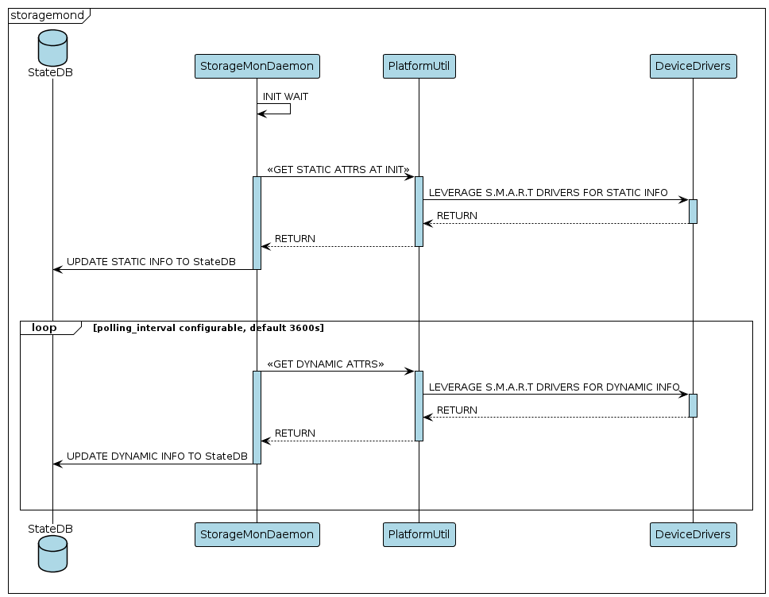

# SONiC Storage Monitoring Daemon Design #
### Rev 0.1 ###

 | Rev |     Date    |       Author       | Change Description                |
 |:---:|:-----------:|:------------------:|-----------------------------------|
 | 0.1 |             |      Ashwin Srinivasan  | Initial version                   |

## 1. Overview

This document is intended to provide a high-level design for a Storage monitoring daemon.

Solid-State storage devices that use NAND-flash technology to store data offer the end user significant benefits compared to HDDs. Some advantages are reliability, reduced size, increased energy efficiency and improved IO speeds which translates to faster boot times, quicker computational capabilities and an improved system responsiveness overall. Like all devices, however, they experience performance degradation over time on account of a variety of factors such as overall disk writes, bad-blocks management, lack of free space, sub-optimal operational temperature and good-old wear-and-tear which speaks to the overall health of the disk. 

The goal of the Storage Monitoring Daemon (storagemond) is to provide meaningful metrics for the aforementioned issues and enable streaming telemetry for these attributes so that preventative measures may be triggered in the eventuality of performance degradation.

## 2. Data Collection

We are interested in the following characteristics that describe various aspects of the disk:

### **2.1 Dynamic Attributes** 

**The following attributes are updated frequently and describe the current state of the disk**

- Current File System IO Reads
- Current File System IO Writes
- Total File System IO Reads
- Total File System IO Writes
- Disk IO Reads
- Disk IO Writes
- Reserved Blocks Count
- Temperature
- Firmware
- Health

**Current procfs Reads/Writes** - Parsed from the `/proc/diskstats` file, these values correspond to the number of reads and writes successfully carried out in the disk. These values would reset upon reboot.

**Total procfs Reads/Writes** - A count of all reads/writes parsed from the `/proc/diskstats` file, these values correspond to the number of reads and writes successfully carried out in the disk across reboots and daemon crashes. These values are cumulative and would therefore not reset upon reboot.

**Disk IO Reads/Writes** - These fields account for write-amplification and wear-leveling algorithms, and are persistent across reboots and powercycles.

**Reserved Blocks Count** - Reserved blocks are managed by the drive's firmware, and their specific allocation and management may vary between disk manufacturers. The primary purposes of reserved blocks in a disk are:

    - **Bad-block replacement:** When the firmware detects a bad block, it can map it to a reserved block and continue using the drive without data loss.
    - **Wear Leveling:** Reserved blocks are used to replace or relocate data from cells that have been heavily used, ensuring that all cells are used evenly. 
    - **Over-Provisioning:** Over-provisioning helps maintain consistent performance and extends the lifespan of the disk by providing additional resources for wear leveling and bad block management.
    - **Garbage collection:** When files are deleted or modified, the old data needs to be erased and marked as available for new data. Reserved blocks can help facilitate this process by providing a temporary location to move valid data from blocks that need to be erased. 

**Temperature, Firmware, Health** - These fields are self-explanatory

### **2.2 Static Attributes**

**These attributes provide informational context about the Storage disk**

- **Vendor Model**
- **Serial Number**

These fields are self-explanatory.


### **2.3 `storagemond` Daemon Flow**

1. The "storagemond" process will be initiated by the "pmon" Docker container.

2. Shortly succeeding the initialization process, the daemon will query the Config DB for fields called `daemon_polling_interval` and `fsstats_sync_interval` within a newly proposed table `STORMOND_CONFIG|INTERVALS` and use the value to set the looping frequency for getting dynamic informaton and syncing this information to disk, respectively<sup>NOTE</sup>. In the absense of this table/field, we would default to 3600 seconds for the polling interval and 86400 seconds for sync interval.

3. Also as part of init, the daemon would reconcile the `STATE_DB`, a JSON file on disk and the current parsed information to calculate the cumulative values of fields that are subject to reset upon reboot. More on this is detailed in section [2.4.4](#244-accounting-for-reboots-and-unintended-powercycles) below.

4. After initialization, the daemon will gather static information utilizing S.M.A.R.T capabilities through instantiated class objects such as SsdUtil and EmmcUtil. This information will be subsequently updated in the `STATE_DB`.

5. The daemon would parse dynamic attributes also utilizing S.M.A.R.T capabilities via the corresponding class member functions, and update the `STATE_DB` per the preset frequency.

**NOTE:** 
 - The design requires a concurrent PR where EmmcUtil, SsdUtil classes are enhanced to gather Disk and FS IO Read/Write stats and Reserved Blocks information as detailed in section [2.4.1 below](#241-ssdbase-api-additions).
 -  Modifying the configuration intervals will only be applied in the subsequent cycle. Should immediate implementation be desired by the user, a configuration reload and daemon restart would be necessary.

This is detailed in the sequence diagram below:



### **2.4 Data Collection Logic**

The SONiC OS currently includes logic for parsing storage disk information from various vendors through the `EmmcUtil` and `SsdUtil` classes, facilitated by base class definitions provided by `SsdBase`. We utilize this framework to collect the following details:

- **Static Information**: Vendor Model, Serial Number
- **Dynamic Information**: Firmware, Temperature, Health

The following section will therefore only go into detail about data collection of attributes mentioned in [section 2.1](#21-dynamic-attributes).


#### **2.4.1 SsdBase API additions**

In order to parse Disk IO reads/writes and Number of Reserved Blocks, we would need to add the following member methods to the `SsdBase` class in [ssd_base.py](https://github.com/sonic-net/sonic-platform-common/blob/master/sonic_platform_base/sonic_ssd/ssd_base.py) and provide a generic implementation in [ssd_generic.py](https://github.com/sonic-net/sonic-platform-common/blob/master/sonic_platform_base/sonic_ssd/ssd_generic.py):


```
class SsdBase(object):

...

def get_disk_io_reads(self):
"""
Retrieves the total number of Input/Output (I/O) reads done on an SSD

Returns:
    An integer value of the total number of I/O reads
"""

def get_disk_io_writes(self):
"""
Retrieves the total number of Input/Output (I/O) writes done on an SSD

Returns:
    An integer value of the total number of I/O writes
"""

def get_reserved_blocks(self):
"""
Retrieves the total number of reserved blocks in an SSD

Returns:
    An integer value of the total number of reserved blocks
"""

```

#### **2.4.2 Support for Multiple Storage Disks**

In order to get a clear picture of the number of disks and type of each disk present on a device, we introduce a new class `StorageDevices()`. This proposed class will reside in the `src/sonic-platform-common/sonic_platform_base/sonic_ssd` directory, within the file named `storage_devices.py`. This new class provides the following methods:

```
class StorageDevices():

# A dictionary where the key is the name of the disk and the value is the corresponding class object
devices = {}

...

def get_storage_devices(self):
"""
Retrieves all the storage disks on the device and adds their names as key to the 'devices' dict.

"""

def get_storage_device_object(self):
"""
Instantiates an object of the corresponding storage device class:

'ata'       - SsdUtil   - Full support
'usb'       - UsbUtil*  - Not currently supported
'mmcblk'    - EmmcUtil* - Limited Support

Adds the instantiated class object as a value to the corresponding key in the dictionary object.

*NOTE: SsdUtil is supported currently. Limited support for EmmcUtil. Future support planned for USBUtil and NVMeUtil

"""
```

This class is a helper to the Storage Daemon class.

**get_storage_devices() Logic:**

- In the base path of `/sys/block/`, for each fd:
    - If the fd does not have `boot` or `loop`, add it as a key to the `devices` dictionary with a temporary value of `NoneType`
    ```
    Example:
    admin@sonic:/sys/block$ ls | grep -v -e "boot" -e "loop"
    mmcblk0
    sda
    ```

In the example scenario above, the dictionary `devices` would look like this:

```
devices = {
'mmcblk0' : None
'sda'     : None
}
```

**_storage_device_object_factory() Logic:**

- For each key in the `devices` dictionary:
    - If key starts with the term `sd`:
        - If the realpath of `/sys/block/[KEY]/device` has the term `ata` in it:
        - Instantiate an object<sup>READ NOTE</sup> of type `SsdUtil` and add this object as value of the key
        ```
        Example:
        root@str-msn2700-02:~# cd /sys/block/sda/../../../0:0:0:0
        root@str-msn2700-02:/sys/devices/pci0000:00/0000:00:1f.2/ata1/host0/target0:0:0/0:0:0:0#
        ```
    - else if the realpath of `/sys/block/[KEY]/device` has the term `usb` in it:
        - Instantiate an object<sup>READ NOTE</sup> of type `UsbUtil` and add this object as value of the key
        ```
        Example:
        root@str2-7050qx-32s-acs-01:~# cd /sys/block/sda/../../../2:0:0:0
        root@str2-7050qx-32s-acs-01:/sys/devices/pci0000:00/0000:00:12.2/usb1/1-2/1-2:1.0/host2/target2:0:0/2:0:0:0#
        ```
- else if key starts with the term `mmcblk`:
    - Instantiate an object<sup>READ NOTE</sup> of type `EmmcUtil` and add this object as value of the key
    ```
    Example:
    root@sonic:/sys/block$ ls | grep -i "mmcblk" | grep -v "boot" | grep -v "loop"
    mmcblk0
    ```

**Example usage:**

Assuming a device contains the following storage disks:
```
root@sonic:~# ls /sys/block/
loop0  loop1  loop2  loop3  loop4  loop5  loop6  loop7  **mmcblk0**  mmcblk0boot0  mmcblk0boot1  **sda**
```

We would instantiate an object of the StorageDevices() class
`storage = StorageDevices()`

`storage.devices` would contain:
```
{
    'mmcblk0': <Emmcutil object>,
    'sda': <SsdUtil object>
}
```

we would then get static and dynamic information by leveraging the respective member function implementations of `SsdUtil` and `EmmcUtil`, as they both derive from `SsdBase`.
We then leverage the following proposed `STATE_DB` schema to store and stream information about each of these disks.


**NOTE:** <br>
**Full support** -- monitors all the attributes mentioned in [section 2](#2-data-collection)<br>
**Limited support** -- Support unavailable for Dynamic fields mentioned in [section 2.1](#21-priority-0-attributes)<br>
**Not currently supported** -- Class currently unimplemented, no object created. No monitoring currently available.<br>

<sub>UsbUtil and NVMeUtil classes are not yet available. EmmcUtil class does not currently support disk IO reads, disk IO writes and Reserved Blocks.</sub>

#### **2.4.3 Support for common implementations**

Specific data, such as Filesystem Input/Output (FS IO) Reads/Writes, can be uniformly collected regardless of the storage disk type, as it is extracted from files generated by the Linux Kernel. To streamline the process of gathering this information, we propose the implementation of a new parent class `StorageCommon()`, from which classes such as SsdUtil, EmmcUtil, USBUtil, and NVMUtil would inherit in addition to `SsdBase` (to be renamed `StorageBase`). This proposed class will reside in the `src/sonic-platform-common/sonic_platform_base/sonic_storage` directory (formerly `sonic_ssd`), in `storage_common.py`. The `StorageCommon()` class will have the following functions:

```
def get_fs_io_reads(self):
    """
    Function to get the latest reads on each disk by parsing the /proc/diskstats file

    Returns:
        The total number of FSIO reads
    
    Args:
        N/A
    """

def get_fs_io_writes(self):
    """
    Function to get the latest writes on each disk by parsing the /proc/diskstats file

    Returns:
        The total number of FSIO writes
    
    Args:
        N/A
    """
```

**Logic for StorageCommon() get_fs_io_reads and get_fs_io_writes functions:**

These two functions, `get_fs_io_reads` and `get_fs_io_writes`, are designed to retrieve the latest disk reads and writes, respectively, by parsing the `/proc/diskstats` file. They utilize similar logic, differing only in the column index used to extract the relevant information.

1. **Check for `psutil` Module**:
   - The functions first check if the `psutil` module is available in the current environment by examining the `sys.modules` dictionary.

2. **Use `psutil` Module to**:
     - Retrieve disk I/O counters, specifying the disk for which to get the counters.
     - Get the read or write count for the specified disk using `read_count` or `write_count` respectively.

3. **Return to caller**:
     - These values are then returned to the caller to subsequently be written to `STATE_DB`.
     - These values are also used to determine the total number of procfs reads and writes as explained in the following section


#### **2.4.4 Accounting for reboots and unintended powercycles**

The reset of values in `/proc/diskstats` upon device reboot or power cycle presents a challenge for maintaining long-term data integrity. To mitigate this challenge, we propose the following design consideration:

Introduction of a bind-mounted directory within the pmon container at `/usr/share/stormond/` which maps to `/host/pmon/stormond/` on the host:
    - This directory hosts a file named `fsio-rw-stats.json`, where the following values are stored:
        - **most recent** Total reads and writes from the `STATE_DB`.
        - **most recent** procfs reads and writes from the `STATE_DB`.

    - This file would be read by the daemon on initialization after a planned reboot of the system, or in a graceful `stormond` restart scenario.
    - In a soft or cold reboot scenario, the reboot utility sends a SIGTERM to `stormond` via the PMON container, which is caught by the daemon. At this point, the FSIO reads and writes are synced to JSON file just before exit. 

2. Changes to

##### **2.4.4.1 Daemon Restart / Reboot / Unintended Powercycle Scenario Behaviors**

1. **Planned cold, fast, and warm reboot scenario**

    - Prior to invoking an OS-level reboot, the latest FSIO Read and Write metrics are captured from the `/proc/diskstats` file and stored into the `fsio-rw-stats.json` by invoking the `fsio-rw-sync` script from the respective `/usr/local/bin/*reboot` script.
    - Post-reboot, the read/write metrics as parsed from the `fsio-rw-stats.json` file will exceed the current values in `STATE_DB`.
    - Under these conditions, the RW values from `fsio-rw-stats.json` are treated as baseline metrics, and subsequent RW values from `/proc/diskstats` are added to this baseline before database insertion.

    ```
    # Prior to reboot
    capture_fsio_rw_metrics():
        execute(fsio-rw-sync)  # Execute the fsio-rw-sync script to capture FSIO Read and Write metrics
        parse_and_store_metrics()  # Parse metrics from /proc/diskstats and store in fsio-rw-stats.json

    # Post-reboot
    baseline_metrics = read_baseline_metrics_from_json()  # Read baseline reads and writes from fsio-rw-stats.json
    current_metrics = read_current_metrics_from_procfs()  # Read current reads and writes from /proc/diskstats
    updated_metrics = calculate_updated_metrics(baseline_metrics, current_metrics)  # Calculate updated metrics as updated_metrics = baseline_metrics + current_metrics
    insert_into_database(updated_metrics)  # Insert updated metrics into database
    ```

2. **Daemon (`stormond` or `pmon`) Crash Handling Scenario**

    - In the event of a daemon crash, the daemon ensures continuity by maintaining critical data points regarding filesystem I/O operations:

        - **Real-Time `/proc/diskstats` Values**: Directly parsed and stored temporarily, providing a snapshot of the most current filesystem activity.
        - **Persisted `/proc/diskstats` Values in `STATE_DB`**: The last known values of procfs reads/writes before the crash, providing a baseline for comparison post-recovery.
        - **Accumulated I/O Metrics in `STATE_DB`**: Represent the comprehensive record of disk read and write operations up to the last successful update before the crash.

    - The reconciliation of these data points post-crash allows for the calculation of interim disk operations:

    ```
    addnl_procfs_rw = (latest_procfs - last_posted_statedb_procfs)
    new total_procs_rw (to be posted to `STATE_DB`) = current_statedb_procfs_rw + addnl_procfs_rw
    ```

    - This computed value represents the adjusted total of read/write operations that should be recorded in the `STATE_DB` once the daemon is back online. 
    - The subsequent update to the `fsio-rw-stats.json` file ensures that these recalibrated values persist, thereby safeguarding against data loss due to daemon or container failures and facilitating seamless data continuity and accuracy.

    ```
    # In the event of a daemon crash

    # Reconciliation post-crash
    compute_interim_disk_operations():
        statedb_accumulated_procfs_rw = Hitherto accumulated procfs reads and writes from the STATE_DB
        statedb_latest_procfs_rw = Last parsed procfs reads and writes in STATE_DB
        current_procfs_rw = Current FSIO reads and writes from /proc/diskstats
        addnl_procfs_rw = current_procfs_rw - statedb_latest_procfs_rw
        new_total_procs_rw = statedb_accumulated_procfs_rw + addnl_procfs_rw
        update_db_with_new_metrics(new_total_procs_rw, current_procfs_rw)  # Update STATE_DB with recalibrated values

    # Subsequent update to fsio-rw-stats.json
    update_fsio_rw_stats_file():
        write_updated_metrics_to_json(new_total_procs_rw)  # Write recalibrated values to fsio-rw-stats.json
    ```

3. **System unintended powercycle scenario**

    - This scenario results in a reset of the read/write counts within the `/proc/diskstats` file.
    - Additionally, there is typically no opportunity to record the latest RW counts into the `fsio-rw-stats.json` file.
    - Hence, this is the sole scenario where a discrepancy might arise between the documented FSIO RW counts and the actual RW counts.
    - This potential discrepancy is acknowledged and accepted within the system's operational parameters.


#### **2.4.4 storagemond Class Diagram**


## **3. Schema Changes**

### **3.1 Storage Info `STATE_DB` Schema**
```
; Defines information for each Storage Disk in a device

key                     = STORAGE_INFO|<disk_name>  ; This key is for information about a specific storage disk - STORAGE_INFO|SDX

; field                 = value

device_model            = STRING                    ; Describes the Vendor information of the disk                                           (Static)
serial                  = STRING                    ; Describes the Serial number of the disk                                                (Static)
temperature_celsius     = STRING                    ; Describes the operating temperature of the disk in Celsius                             (Dynamic)
total_fsio_reads        = STRING                    ; Describes the total number of filesystem reads completed successfully                  (Dynamic)
total_fsio_writes       = STRING                    ; Describes the total number of filesystem writes completed successfully                 (Dynamic)
latest_fsio_reads       = STRING                    ; Describes the latest number of filesystem reads completed successfully                 (Dynamic)
latest_fsio_writes      = STRING                    ; Describes the latest number of filesystem writes completed successfully                (Dynamic)
disk_io_reads           = STRING                    ; Describes the total number of reads completed successfully from the SSD (Bytes)        (Dynamic)
disk_io_writes          = STRING                    ; Describes the total number of writes completed on the SSD (Bytes)                      (Dynamic)
reserved_blocks         = STRING                    ; Describes the reserved blocks count of the SSD                                         (Dynamic)
firmware                = STRING                    ; Describes the Firmware version of the SSD                                              (Dynamic)
health                  = STRING                    ; Describes the overall health of the SSD as a % value based on several SMART attrs      (Dynamic)
```

NOTE: disk_io_reads and disk_io_writes return total LBAs read/written. 'LBA' stands for Logical Block Address. 
To get the raw value in bytes, we multiply thr num. LBAs by the disk's logical block address size (typically 512 bytes).<br>

Example: For an SSD with name 'sda', the STATE_DB entry would be:

```
root@sonic:~# docker exec -it database bash
admin@str2-dx010-acs-7:~$ redis-cli -n 6
127.0.0.1:6379[6]> keys STORAGE*
1) "STORAGE_INFO|sda"
127.0.0.1:6379[6]>
127.0.0.1:6379[6]> hgetall "STORAGE_INFO|sda"
 1) "device_model"
 2) "InnoDisk Corp. - mSATA 3IE4"
 3) "serial"
 4) "BCA11803120900005"
 5) "firmware"
 6) "S0000000"
 7) "health"
 8) "37.500"
 9) "temperature"
10) "38"
11) "latest_fsio_reads"
12) "15507"
13) "latest_fsio_writes"
14) "3775"
15) "total_fsio_reads"
16) "353083"
17) "total_fsio_writes"
18) "70146"
19) "disk_io_reads"
20) "5515700"
21) "disk_io_writes"
22) "863702"
23) "reserved_blocks"
24) "135"


```

### **3.2 FS Stats Sync `STATE_DB` Schema**
```
; Defines information for FS Stats synchronization

key                     = STORAGE_INFO|FSSTATS_SYNC     ; This key is for information pertaining to synchronization of FSIO Reads/Writes

; field                 = value

successful_sync_time    = STRING                        ; The latest successful sync time of FSIO reads and writes to file in UNIX timestamp format

```

### **3.3 ConfigDB Schema and YANG model**

**Schema**

```
; Defines information for stormond config

key                        = STORMOND_CONFIG|INTERVALS   ; This key is for information about stormon daemon polling interval configurations

; field                    = value

daemon_polling_interval    = UINT32               ; The polling frequency for reading dynamic information
fsstats_sync_interval      = UINT32               ; The frequency of FSIO Reads/Writes synchronization to location on disk
```

Example: `stormond` configured with daemon polling interval of 60s and the JSON file sync interval as 360 seconds:

```
127.0.0.1:6379[4]> KEYS STORMOND*
1) "STORMOND_CONFIG|INTERVALS"
127.0.0.1:6379[4]> HGETALL "STORMOND_CONFIG|INTERVALS"
1) "daemon_polling_interval"
2) "60"
3) "fsstats_sync_interval"
4) "360"
127.0.0.1:6379[4]>

```

**YANG Model**

```
container sonic-stormond-config {

        container STORMOND_CONFIG {

            description "stormond_config table in config_db.json";

            container INTERVALS {

                leaf daemon_polling_interval {
                    description "Polling inerval for Storage Monitoring Daemon in STORMOND_CONFIG table";
                    type uint32 {
                        range "1..4294967295";
                    }
                    default "3600";
                }

                leaf fsstats_sync_interval {
                    description "FSSTATS JSON file syncing interval for the Storage Monitoring Daemon in STORMOND_CONFIG table";
                    type uint32 {
                        range "1..4294967295";
                    }
                    default "86400";
                }
            }
        }
    }
```

## **4. Test Plan**

The following is the `sonic-mgmt` test plan for the daemon. The first column represents various testing scenarios. The other columns represent the intended status of various components of the daemon.

| **Event**              | **State_DB** | **JSON**  |  **PROCFS STATUS**      | **JSON SYNCED WITH `STATE_DB`?** | **STORMON RESTARTED** |
| ---------------------- | ------------ | --------- | ----------------------- | ----------------------------- | --------------------- |
|                        |              |           |                         |                               |                       |
| System First Boot      | EMPTY        | EMPTY     |          Initial Values | YES                           | YES                   |
| Planned Cold Reboot    | CLEARED      | PERSISTED |   RESET, Initial Values | YES                           | YES                   |
| Planned Soft Reboot    | CLEARED      | PERSISTED |   RESET, Initial Values | YES                           | YES                   |
| Planned Warm Reboot    | PERSISTED    | PERSISTED |   RESET, Initial Values | YES                           | YES                   |
| Unplanned daemon crash | PERSISTED    | PERSISTED |   PERSISTED             | UNSURE                        | YES                   |
| Unplanned system crash | CLEARED      | PERSISTED |   RESET, Initial Values | UNSURE                        | YES                   |


## Future Work

1. Fulfill the sonic-mgmt test plan
2. Full support for eMMC
3. Support for USB and NVMe storage disks
4. Refactor `ssdutil` [in sonic-utilities](https://github.com/sonic-net/sonic-utilities/tree/master/ssdutil) to cover all storage types, including changing the name of the utility to 'storageutil'

<br><br><br>
<sup>[Back to top](#1-overview)</sup>
