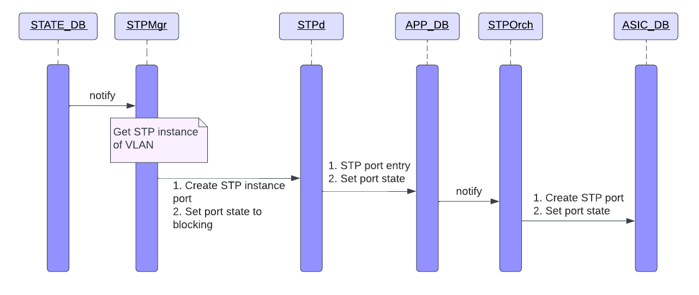
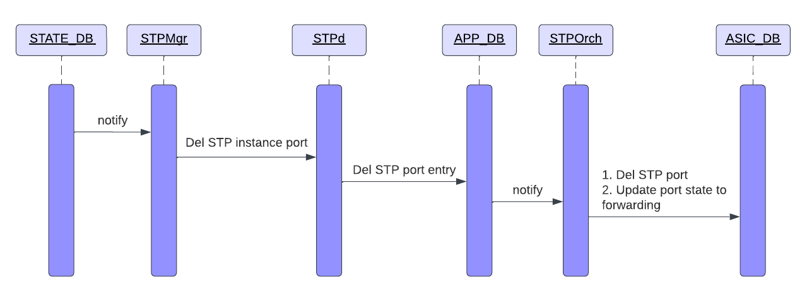


# IEEE 802.1s Multiple Spanning Tree Protocol

**High Level Design** 

## Revision History

[© xFlow Research Inc](https://xflowresearch.com/) 

|Revision No.|Description|Author|Date|
| :- | :- | :- | :- |
|0.1|Intial Design|[Hamna Rauf](https://github.com/hamnarauf), [Muhammad Danish](https://github.com/mdanish-kh), [Rida Hanif](github.com/ridahanif96), [Hafiz Mati ur Rehman](https://github.com/Mati86)  & [Arsalan Ahmad](https://github.com/ahmadarsalan/)|March 20, 2023|

# Table of Contents

* [Scope](#scope)
* [Background](#background)
* [Abbreviations](#abbreviations)
* [Overview](#overview)
* [Introduction](#introduction)
* [Requirements](#requirements)
* [Architecture Design](#architecture-design)
  - [STP Container](#stp-container)
  - [SWSS Container](#swss-container)
  - [CoPP Configurations](#copp-configurations)
* [Database Changes](#database-changes)
  - [CONFIG DB](#config-db)
  - [APP DB](#app-db)
* [SAI](#sai)
* [Additional Features](#additional-features)
* [Sequence Diagrams](#sequence-diagrams)
  - [MSTP global enable](#mstp-global-enable)
  - [MSTP global disable](#mstp-global-disable)
  - [MSTP region name/version change](#mstp-region-nameversion-change)
  - [Instance creation](#instance-creation)
  - [Instance deletion](#instance-deletion)
  - [Add VLAN to instance](#add-vlan-to-instance)
  - [Del VLAN from instance](#del-vlan-from-instance)
* [Configuration Commands](#configuration-commands)
  - [Global Level](#global-level)
  - [Region Level](#region-level)
  - [Instance, Interface Level](#instance-interface-level)
  - [Show Commands](#show-commands)
  - [Clear Commands](#clear-commands)
  - [Debug Commands](#debug-commands)
  - [Disabled Commands](#disabled-commands)
* [YANG Model](#yang-model)
* [Rest API Support](#rest-api-support)
* [Warm Boot](#warm-boot)
* [Testing Requirements](#testing-requirements)
  - [Unit test cases](#unit-test-cases)
* [References](#references)

# Scope
This document describes the High Level Design of Multiple Spanning Tree Protocol.

# Background
This HLD is based on the design provided by PVST HLD.

PVST HLD: https://github.com/sonic-net/SONiC/pull/386

# Abbreviations

|**Term**|**Meaning**|
| :- | :- |
|MSTP|Multiple Spanning Tree Protocol|
|PVST|Per VLAN Spanning Tree|
|STP|Spanning Tree Protocol|
|VLAN|Virtual Local Area Network|
|MSTI|Multiple Spanning Tree Instance|
|CIST|Common Internal Spanning Tree|
|CST|Common Spanning Tree|
|IST|Internal Spanning Tree|
|BPDU|Bridge Protocol Data Unit|
|RSTP|Rapid Spanning Tree Protocol|
|VID|VLAN identifier|
|MSTID|Multiple Spanning Tree Identifier|
|CoPP|Control Plane Policing|

# Overview
Multiple Spanning Tree Protocol (MSTP) enhances the Spanning Tree Protocol (STP) by enabling the creation of multiple spanning tree instances within a network. It provides a mechanism to map VLANs to specific spanning tree instances which offers network segmentation and improved control over traffic flow.

# Introduction
Spanning Tree Protocol (STP) prevents bridge looping on LANs that include redundant links. Per VLAN Spanning Tree (PVST) is a modification of STP that allows for running separate instances of spanning tree for each VLAN. 

Multiple Spanning Tree Protocol (MSTP) allows the mapping of multiple VLANs to a single instance hence allows frames assigned to different VLANs to follow separate paths. These paths are based on independent Multiple Spanning Tree Instances (MSTI) that run inside MST Region. VLANs that are not explicitly assigned to any specific MSTI are automatically managed by the default Internal Spanning Tree (IST) associated with instance 0. MSTP ensures that frames with a given VID are assigned to only one of the MSTIs or the IST within the Region and the assignment is consistent amongst all the Bridges within the region. 

To facilitate the interconnection among MST regions, a Common Spanning Tree (CST) is established, allowing communication between switches in different MST regions. MSTP connects all Bridges and LANs with a single Common and Internal Spanning Tree (CIST). CIST refers to the combination of the Common Spanning Tree (CST) and the Internal Spanning Tree (IST) and it is the overall spanning tree instance that spans the entire MSTP domain.

By providing VLAN-to-instance mapping, MSTP ensures that a limited number of instances are created, allowing for network segregation. In contrast, PVST lacks control over VLAN-to-instance mapping, leading to numerous instances and inefficient memory utilization. 

STP only supports a single instance, resulting in under utilized network bandwidth due to complete link blocking. Therefore, MSTP offers better control over instances, efficient resource usage, and improved network performance compared to PVST and STP.

MSTP calculates spanning trees on the basis of Multiple Spanning Tree Bridge Protocol Data Units (MST BPDUs).

<div align="center">

<p>MSTP BPDU Format</p>
</div><br>
<div align="center">

<p>MSTI Configuration Messages</p>
</div>

*Refer to [RFC IEEE 802.1s-2002](https://standards.ieee.org/ieee/802.1s/1042/) for MSTP BPDU details.* 

# Requirements
1. Support the creation of Multiple Spanning Tree Instances (MSTIs).
1. Support the assignment of one or more VLANs to a specific MSTI within a region.
1. Support the option to assign a region name and revision number to MSTP regions in order to achieve unique identification of VLAN to instance mapping across switches.
1. Support path selection and forwarding behaviour in MSTI to optimize network performance within each instance by configuring a distinct root bridge.
1. Support the configuration of spanning tree parameters such as forward delay, hello timer, hop count and max age.
1. The Destination Mac Address will be 01:80:C2:00:00:00 for MSTP BPDUs.
1. Support compatibility with networks employing different spanning tree protocols, such as STP, RSTP and PVST via Protocol Migration. 
1. Support edge port functionality
1. Support BPDU guard functionality
1. Support root guard functionality
1. Support protocol operation on static breakout ports
1. Support protocol operation on Port-channel interfaces

# Architecture Design
Following diagram explains the architectural design and linkages for MSTP. MSTP uses multiple existing SONiC containers, configuration details of each is mentioned below as well.


## STP Container
STP Container is responsible for actions taken for BPDU rx and BPDU tx. Following are the details for implementation:

### STPMgr
Subscribes to CONFIG_DB and STATE_DB tables, parsing configurations and passes to STPd.

### STPd
Responsible for all MST protocol related calculations. BPDUs are sent and received in STPd and states are updated accordingly.

### STPSync
A process running as a part of STPD. Responsible for updating all the MSTP states in APP DB.

The BPDU rx/tx, BPDU processing, handling of timers, handling of changes related to port or LAG using netlink events and STP port state sync to Linux Kernel will function the same as PVST.

*Refer to [PVST's STP Container Details](https://github.com/sandeep-kulambi/SONiC/blob/631ab18211e7e396b138ace561b7a04e7f7b49a1/doc/stp/SONiC_PVST_HLD.md#34-stp-container)*

## SWSS Container

SWSS Container is responsible for passing on configurations to SAI as follows:

### STPOrch
Updates SAI via following APIs:

1. Creating/deleting instances via SAI STP API.
2. Assigning VLAN to instance via SAI STP API and SAI VLAN API.
3. Creation of STP Port and assigning port state with respect to each instance via SAI STP API.
4. Flushing FDB entries via SAI FDB API.

There are no changes in PortOrch.


# Database Changes
MSTP design introduces some new tables for configuration along with slight modification in existing STP tables. Following are details of each individual table:

## CONFIG DB

### Existing Table
Following existing table of CONFIG_DB will be modified for MSTP implementation:

#### STP_GLOBAL_TABLE
A new value of `mstp` for `mode` column and a new column for holding `max-hops`
```
mode 		  = "pvst" / "mstp"                  ; a new option for mstp
```
Other fields of this table are not applicable for "mstp" mode.

### New Tables
Following new tables will be added to CONFIG_DB:

#### MSTP_MST
```
;Stores MSTP Global configuration
key                    = STP_MST|GLOBAL	; Global MSTP table key
name                   = 1*32CHAR		; MSTP region name(DEF:mac address of switch)
revision               = 5*DIGIT		; MSTP revision number (0 to 65535, DEF:0)
max_hop                = 2*DIGIT		; maximum hops (1 to 40, DEF:20)
max_age                = 2*DIGIT		; max age time in secs(6 to 40 sec, DEF:20sec)
hello_time             = 2*DIGIT		; hello time in secs(1 to 10 sec, DEF:2sec)
forward_delay          = 2*DIGIT		; forward delay in secs(4 to 30 sec, DEF:15 sec)
```

#### STP_MST_INST
```
;Stores STP configuration per MSTI
key           	= STP_MST|"MST_INSTANCE"id	; MST with prefix "STP_MST"
bridge_priority = 5*DIGIT			; bridge priority (0 to 61440, DEF:32768)
vlan_list       = "Vlans"			; List of VLANs assigned to the MST instance 
```

#### STP_MST_PORT
```
;Stores STP interface details per MSTI
key       = STP_MST_PORT|"MST_INSTANCE"id|ifname; MSTI+Intf with prefix "STP_MST_PORT"
path_cost = 9*DIGIT                             ; port path cost (1 to 200000000) 
priority  = 3*DIGIT                             ; port priority (0 to 240, DEF:128)
```

#### STP_PORT
```
;Stores STP interface details
key                   	= STP_PORT|ifname ; ifname with prefix STP_PORT
edge_port             	= BIT             ; enabled or disabled
link_type             	= "type"          ; type can be of auto, point-to-point or shared
enabled	    		= BIT             ; enabled or disabled
bpdu_guard		= BIT             ; enabled or disabled
bpdu_guard_do_disable 	= BIT             ; enabled or disabled
enabled    		= BIT             ; enabled or disabled
root_guard    		= BIT             ; enabled or disabled
path_cost    		= 9*DIGIT         ; port path cost (1 to 200000000) 
priority    		= 3*DIGIT         ; port priority (0 to 240, DEF:128)
```

## APP DB

### New Tables
Following new tables are introduced as part of MSTP Feature:

#### STP_MST_INST_TABLE
```
;Stores the STP per MSTI operational details
key                  	= _STP_MST_INST_TABLE:"MST"id
vlan_list            	= vlan_id-or-range[,vlan_id-or-range]; List of VLANs assigned to the MST instance
bridge_address       	= 16HEXDIG	; bridge id
regional_root_address 	= 16HEXDIG	; regional root bridge id
root_address		= 16HEXDIG	; root bridge id
root_path_cost		= 1*9DIGIT	; root path cost
regional_root_cost	= 1*9DIGIT	; regional root path cost
root_max_age          	= 1*2DIGIT	; Max age of root bridge(6 to 40 sec, DEF:20sec)
root_hello_time      	= 1*2DIGIT	; Hello time of root bridge(1 to 10 sec, DEF:2sec)
root_forward_delay   	= 1*2DIGIT	; forward delay of root bridge(4 to 30 sec, DEF:15 sec)
remaining_hops       	= 1*2DIGIT	; Ramining Max-hops
root_port            	= ifName	; Root port name
```

#### STP_MST_PORT_TABLE
```
;Stores STP MST instance interface details 
key		= _STP_MST_PORT_TABLE:"MST"id:ifname ; MSTI+Intf with prefix "STP_MST_PORT_TABLE"
port_number     = 1*3DIGIT       ; port number of bridge port
path_cost       = 1*9DIGIT       ; port path cost (1 to 200000000)
priority	= 3*DIGIT        ; port priority (0 to 240, DEF:128)
port_state	= "state"        ; DISABLED/DISCARDING/LISTENING/LEARNING/FORWARDING
role		= "role"         ; DESIGNATED/ROOT/ALTERNATE/MASTER            
desig_cost	= 1*9DIGIT       ; designated cost
external_cost	= 1*9DIGIT       ; designated cost
desig_root	= 16HEXDIG       ; designated root
desig_reg_root	= 16HEXDIG       ; designated root
desig_bridge	= 16HEXDIG       ; designated bridge
desig_port	= 1*3DIGIT       ; designated port
fwd_transitions	= 1*5DIGIT       ; number of forward transitions
bpdu_sent	= 1*10DIGIT      ; bpdu transmitted
bpdu_received	= 1*10DIGIT      ; bpdu received
```

#### STP_PORT_TABLE
```
;Stores STP interface details
key			= _STP_PORT_TABLE:ifname; ifname with prefix STP_INTF
edge_port		= BIT            	; edge port enabled or disabled
link_type		= "type"           	; point-to-point or shared link type
mst_boundary		= BIT            	; enabled or disabled
mst_boundary_proto	= BIT                   ; enabled or disabled
```

#### STP_INST_PORT_FLUSH_TABLE
```
;Defines instance and port for which FDB flush needs to be performed
key        = _STP_INST_PORT_FLUSH_TABLE:instance:ifName ; FDB flush instance id and port name
state      = "true"  
```

### Existing Tables
Following already present APP_DB tables are also used for implementation of MSTP:

#### STP_PORT_STATE_TABLE 
The table holds the state of a port i.e forwarding, learning, blocking with respect to each instance.
#### STP_VLAN_INSTANCE_TABLE 
The table holds the VLAN to instance mapping.
#### STP_FASTAGEING_FLUSH_TABLE 
The table informs when the FDB flushing is required. This is done in case of topology change where the mac entries in FDB become inconsistent and there is a need to flush these entries.

# SAI

## Existing SAI Attributes
Following table shows the existing SAI Attributes that will be used:

|**Component**|**SAI Attribute**|
| :- | :- |
|STP Instance|SAI_STP_ATTR_VLAN_LIST
||SAI_STP_ATTR_BRIDGE_ID|
||SAI_STP_ATTR_PORT_LIST|
|STP Port|SAI_STP_PORT_ATTR_STP |
||SAI_STP_PORT_ATTR_BRIDGE_PORT|
||SAI_STP_PORT_ATTR_STATE|
|STP Port States|SAI_STP_PORT_STATE_LEARNING|
||SAI_STP_PORT_STATE_FORWARDING|
||SAI_STP_PORT_STATE_BLOCKING|
|VLAN STP Instance|SAI_VLAN_ATTR_STP_INSTANCE|
|Switch STP Attributes|SAI_SWITCH_ATTR_DEFAULT_STP_INST_ID|
||SAI_SWITCH_ATTR_MAX_STP_INSTANCE|

## New SAI Attributes
MSTP design will not require any new SAI Attributes for Control Packet trap. We will use the existing traps as DMAC and LLC fields are identical for STP and MSTP

# Additional Features

## BPDU Guard
BPDU guard feature will also be supported by MSTP. The details are mentioned in PVST HLD.

## Root Guard
Root guard feature will also be supported by MSTP. The details are mentioned in PVST HLD.

## Edge Port
Edge ports immediately transition to the forwarding state upon activation and do not participate in STP topology calculations. In PVST, this functionality is achieved through the "Portfast" feature, while in MSTP standard, the term "Edge Port" is used. To ensure user clarity, separate command will be provided for configuring Edge Ports.

Portfast command will be disabled when the spanning-tree mode is set to `mstp` and Edge Port command will not function under `pvst` spanning-tree mode.

Please note that the Edge Port functionality is equivalent to Portfast, with the only difference being the terminology and command usage based on the spanning-tree mode. The configuration for Edge ports will be stored in the portfast attribute in the database and the backend functionality remains the same as portfast.

## Uplink Fast
MSTP standard does not support uplink fast so uplink fast functionality will be disable for MSTP.


#  Sequence Diagrams
## MSTP global enable

Pre-Configuring VLAN-to-instance will be mapped to IST instance before actually creating VLAN to avoid convergence churn.


## MSTP global disable


## MSTP region name/version change


## Instance creation


## Instance deletion


## Add VLAN to instance


## Del VLAN from instance


## Add VLAN member


## Del VLAN member


Update port-state, topology change and instance-interface events remain the same as depicted in [Sequence Diagrams of PVST](https://github.com/sandeep-kulambi/SONiC/blob/631ab18211e7e396b138ace561b7a04e7f7b49a1/doc/stp/SONiC_PVST_HLD.md#4-flow-diagrams).

# Configuration Commands
Following configuration commands will be provided for configuration of MSTP:
## Global Level
- **config spanning_tree {enable|disable} {mstp|pvst}**
  - Enables or disables mstp at global level on all ports of the switch.
  - Only one mode of STP can be enabled at a time.
- **config spanning_tree max_hops \<max-hops-value\>**
  - Specify the number of maximum hops before the BPDU is discarded inside a region.
  - max-hops-value: Default: 20, range: 1-255

## Region Level
Below commands allow configuring on region basis:

- **config spanning_tree region name \<region-name\>**
  - Edit the name of region
  - region-name: Case sensitive, characters should be less than or equal to 32, default: mac-address of bridge
- **config spanning-tree region revision \<revision-number\>**
  - Revision number is used to track changes in the configuration and to synchronize the configuration across the switches in the same region.
  - revision-number: Default: 0, range: 0-65535

## Instance Level

Below commands allow configuration of an instance:

- **config spanning_tree instance (add|del) \<instance-id\>**
  - Creation or deletion of an instance.
  - instance-id: Default: 0, range: 1-63
  - Instance can not be deleted if VLAN(s) are associated with it. 
- **config spanning_tree instance priority \<instance-id\> \<priority-value\>** 
  - Configure priority of bridge for an instance.
  - instance-id: id of the instance for which bridge priority is to be defined. If the provided instance id is not created yet, an error message is displayed.
  - priority-value: Default: 32768, range: 0-61440 (should be multiple of 4096)
- **config spanning_tree instance vlan (add|del) \<instance-id\> \<vlan-id\>**
  - VLAN to instance mapping.
  - instance-id: id of the instance to which VLAN is to be mapped. If the provided instance id is not created yet, an error message is displayed.
  - vlan-id: Range: 1-4094. If the provided VLAN is not created yet, an error message is displayed.
  - Instance is only active when there is at least one VLAN member port configured for one of the mapped VLANs.

## Instance, Interface Level
Following commands are used for spanning-tree configurations on per instance, per interface basis:

- **config spanning_tree instance interface priority \<instance-id\> \<ifname\> \<priority-value\>**
  - Configure priority of an interface for an instance.
  - priority-value: Default: 128, range: 0-240
- **config spanning_tree instance interface cost \<instance-id\> \<ifname\> \<cost-value\>**
  - Configure path cost of an interface for an instance.
  - cost-value: Range: 1-200000000

## Interface Level
Following new command will be added:

- **config spanning_tree interface edgeport {enable|disable} \<ifname\>**
  - Configure an interface as an edge port.

Interface level CLI configurations of root guard, BPDU guard will also be supported for spanning-tree mode `mstp`.

## Show Commands
- show spanning_tree

    The output of this command will be as follows for `mstp`:
```
Spanning-tree Mode: MSTP

MSTP Region Parameters:
Region Name                     : regionA
Revision                        : 0
CIST Bridge Identifier          : 32768002438eefbc3
CIST Root Identifier            : 32768002438eefbc3
CIST External Path Cost         : 0
Instances configured            : 1
Last Topology Change            : 0s
Number of Topology Changes      : 0
Bridge Timers                   : MaxAge 20s Hello 2s FwdDly 15s MaxHops 20
CIST Root Timers                : MaxAge 20s Hello 2s FwdDly 15s MaxHops 20

MSTP instance 0 - VLANs 10, 20, 30
-------------------------------------------------------------------------------------------------

Bridge              Regional Bridge     RootPath  RootPort    LastTopology  Topology
Identifier          Identifier          Cost      Identifier  Change        Change
hex                 hex                                       sec           cnt
32768002438eefbc3   32768002438eefbc3   0         128.13      0             0

MSTP Port Parameters:

Port        Prio Path Edge State      Role  Designated  Designated          Designated
Num         rity Cost Port                  Cost        Root                Bridge
Ethernet13  128  4    N    FORWARDING Root  0           32768002438eefbc3   32768002438eefbc3 
```
- show spanning_tree region

```
Region Name                     : regionA
Revision                        : 0
CIST Bridge Identifier          : 32768002438eefbc3
CIST Root Identifier            : 32768002438eefbc3
CIST External Path Cost         : 0
Instances configured            : 1
Last Topology Change            : 0s
Number of Topology Changes      : 0
Bridge Timers                   : MaxAge 20s Hello 2s FwdDly 15s MaxHops 20
CIST Root Timers                : MaxAge 20s Hello 2s FwdDly 15s MaxHops 20
```

- show spanning_tree instance \<instance-id\>

```
MSTP instance 0 - VLANs 10, 20, 30
-------------------------------------------------------------------------------------------------

Bridge              Regional Bridge     RootPath  RootPort    LastTopology  Topology
Identifier          Identifier          Cost      Identifier  Change        Change
hex                 hex                                       sec           cnt
32768002438eefbc3   32768002438eefbc3   0         128.13      0             0
```

- show spanning_tree instance interface \<instance-id\> \<ifname\>

```
Port        Prio Path Edge State      Role  Designated  Designated          Designated
Num         rity Cost Port                  Cost        Root                Bridge
Ethernet13  128  4    N    FORWARDING Root  0           32768002438eefbc3   32768002438eefbc3
```

### Statistics Commands
- show spanning_tree statistics instance \<instance-id\>
```
MSTP instance 0 - VLANs 10, 20, 30
--------------------------------------------------------------------
PortNum           BPDU Tx     BPDU Rx     TCN Tx     TCN Rx             
Ethernet13        10	      4           3          4
PortChannel15     20	      6           4          1
```

## Clear Commands
- sonic-clear spanning_tree statistics instance \<instance-id\>
- sonic-clear spanning_tree statistics instance interface \<instance-id\> \<ifname\>

## Debug Commands
Following debug commands will be supported for enabling additional logging which can be viewed in /var/log/stpd.log, orchagent related logs can be viewed in /var/log/syslog.

- debug spanning_tree region
- debug spanning_tree instance \<instance-id\>

Following debug commands will be supported for displaying internal data structures

- debug spanning_tree dump region
- debug spanning_tree dump instance \<instance-id\>
- debug spanning_tree dump instance interface \<instance-id\> \<ifname\>

## Disabled Commands
Following commands are used to configure parameters at VLAN level and these commands are disabled if spanning-tree mode is `mstp`:

- config spanning_tree vlan (enable|disable) \<vlan\>
- config spanning_tree vlan forward_delay \<vlan\> \<fwd-delay-value\>
- config spanning_tree vlan hello \<vlan\> \<hello-value\>
- config spanning_tree vlan max_age \<vlan\> \<max-age-value\>
- config spanning_tree vlan priority \<vlan\> \<priority-value\>
- config spanning_tree vlan interface cost \<vlan\> \<ifname\> \<value\>
- config spanning_tree vlan interface priority \<vlan\> \<ifname\> \<value\>

Following command is used to configure portfast feature. This command is disbaled if spanning-tree mode is `mstp` because an equivalent command of edge port is provided:

- config spanning_tree interface portfast {enable|disable} <ifname>

Also, Region level, Instance level & Edge port configuation commands will be disabled if spanning-tree mode is `pvst`.


# YANG Model

YANG Model will be extended as follows for MSTP:
```yang
module sonic-stp {

    yang-version 1.1;

    namespace "http://github.com/sonic-net/sonic-stp";
    prefix "stp";

    import sonic-port {
        prefix port;
        revision-date 2019-07-01;
    }

    import sonic-portchannel {
        prefix lag;
        revision-date 2021-06-13;
    }

    import sonic-vlan {
        prefix vlan;
        revision-date 2021-04-22;
    }

    import sonic-device_metadata { 
        prefix device_metadata;
        revision-date 2021-02-27;
    }

    description "STP yang Module for SONiC OS";

    revision 2023-04-18 {
        description "First Revision";
    }

    grouping interfaceAttr {
        leaf path_cost {
            type uint64 {
                range "1..200000000" {
                    error-message "Invalid Port Path Cost value.";
                }
            }
            default 200;
            description
                "The port's contribution, when it is the Root Port,
                to the Root Path Cost for the Bridge";
        }

        leaf priority {
            type uint8 {
                range "0..240" {
                    error-message "Invalid Port Priority value.";
                }
            }
            default 128;
            description
                "The manageable component of the Port Identifier,
                also known as the Port Priority";
        }
    }

    container sonic-stp {

        container STP_GLOBAL {
            description "Global STP table";

            leaf mode {
                type enumeration {
                    enum "pvst";
                    enum "mstp";
                }
                description "STP mode";
            }

            leaf forward_delay {
		must "../../../STP/STP_LIST[keyleaf='GLOBAL']/mode!='mst'" {
			error-message "Configuration not allowed in MST mode";
			error-app-tag stp-invalid;
		}
                type uint8 {
                    range "4..30" {
                        error-message "forward_delay value out of range";
                    }
                }
                default 15;
                description "Forward delay in sec";
            }

            leaf hello_time {
		must "../../../STP/STP_LIST[keyleaf='GLOBAL']/mode!='mst'" {
			error-message "Configuration not allowed in MST mode";
			error-app-tag stp-invalid;
		}
                type uint8 {
                    range "1..10" {
                        error-message "hello_time value out of range";
                    }
                }
                default 2;
                description "Hello time in sec";
            }

            leaf max_age {
		must "../../../STP/STP_LIST[keyleaf='GLOBAL']/mode!='mst'" {
			error-message "Configuration not allowed in MST mode";
			error-app-tag stp-invalid;
		}
                type uint8 {
                    range "6..40" {
                        error-message "max_age value out of range";
                    }
                }
                default 20;
                description "Max age";
            }

            leaf rootguard_timeout {
		must "../../../STP/STP_LIST[keyleaf='GLOBAL']/mode!='mst'" {
			error-message "Configuration not allowed in MST mode";
			error-app-tag stp-invalid;
		}
                type uint16 {
                    range "5..600" {
                        error-message "rootguard_timeout value out of range";
                    }
                }
                default 30;
                description "Root guard timeout in sec";
            }

            leaf priority {
		must "../../../STP/STP_LIST[keyleaf='GLOBAL']/mode!='mst'" {
			error-message "Configuration not allowed in MST mode";
			error-app-tag stp-invalid;
		}
                must ". mod 4096 = 0" {
                    error-message "bridge priority must be a multiple of 4096";
                }      

                type uint16 {
                    range "0..61440" {
                        error-message "priority value out of range";
                    }
                }
                default 32768;
                description "Bridge priority";
            }
        }

	container STP_MST {
	     	max-elements 1;
		key "keyleaf";
                sonic-ext:dependent-on "STP_LIST";

                leaf keyleaf {
                    type enumeration {
                        enum GLOBAL;
                    }
                    description
                        "Key node identifier. It's value is always GLOBAL";
                }

                leaf name {
                    must "../../../STP/STP_LIST[keyleaf='GLOBAL']/mode='mst'" {
                        error-message "Configuration allowed in MST mode";
                        error-app-tag stp-invalid;
                    }
                    type string {
			length "1..32";
		    }
                    description
                        "MST Region name";
                }

                leaf revision {
                    must "../../../STP/STP_LIST[keyleaf='GLOBAL']/mode='mst'" {
                        error-message "Configuration allowed in MST mode";
                        error-app-tag stp-invalid;
                    }
                    type uint16 {
                    range "0..65535" {
                        error-message "revision value out of range";
                    }
                }
                    description
                        "MST Revision number";
                }

                leaf max_hops {
                    must "../../../STP/STP_LIST[keyleaf='GLOBAL']/mode='mst'" {
                        error-message "Configuration allowed in MST mode";
                        error-app-tag stp-invalid;
                    }
                    type uint8 {
                    	range "1..255" {
                        	error-message "max-hops value out of range";
                    	}
		    }
                    default 20;
                    description
                        "MST Max hops";
                }

                leaf hello_time {
                    must "../../../STP/STP_LIST[keyleaf='GLOBAL']/mode='mst'" {
                        error-message "Configuration allowed in MST mode";
                        error-app-tag stp-invalid;
                    }
                    type uint8 {
                    	range "1..10" {
                        	error-message "hello_time value out of range";
                    	}
		    }
		    default 2;
                    description
                        "MST hello time";
                }

                leaf max_age {
                    must "../../../STP/STP_LIST[keyleaf='GLOBAL']/mode='mst'" {
                        error-message "Configuration allowed in MST mode";
                        error-app-tag stp-invalid;
                    }
                     type uint8 {
                    	range "6..40" {
                        	error-message "max_age value out of range";
                    	}
	            }
                    default 20;
                    description
                        "MST max age";
                }

                leaf forward_delay {
                    must "../../../STP/STP_LIST[keyleaf='GLOBAL']/mode='mst'" {
                        error-message "Configuration allowed in MST mode";
                        error-app-tag stp-invalid;
                    }
	            type uint8 {
                    	range "4..30" {
                        	error-message "forward_delay value out of range";
			}
                    }
                    default 15;
                    description
                        "MST forward delay";
                }
	 }
	 container STP_MST_INST {
            list STP_MST_INST_LIST {
                key "instance";

                leaf instance {
                    type uint16;
                    description
                        "Instance identifier";
                }

                leaf-list vlan {
                    type string;
                    description
                        "Vlan list";
                }

                leaf bridge_priority {
                    type uint16 {
                        range "0..61440" {
                            error-message "Invalid Bridge Priority value.";
                        }
                    }
                    default 32768;
                    description
                        "The manageable component of the Bridge Identifier";
                }
            }
        }

        container STP_MST_PORT {
            list STP_MST_PORT_LIST {
                key "inst_id ifname";

                leaf inst_id {
                    type leafref {
                        path "../../../STP_MST_INST/STP_MST_INST_LIST/instance";
                    }
                    description
                        "Reference to MST Instance";
                }

                leaf ifname {
                    type leafref {
                        path "../../../STP_PORT/STP_PORT_LIST/ifname";
                    }
                    description
                        "Reference to Ethernet interface or PortChannel";
                }
                uses interfaceAttr;
            }
        }

	list _STP_MST_INST_TABLE_LIST {
            sonic-ext:db-name "APPL_DB";
            key "inst_id";

            leaf inst_id {
                type leafref {
                     path "../../../STP_MST_INST/STP_MST_INST_LIST/instance";
                }
                description
                     "Reference to MST Instance";
            }

            leaf-list vlan {
                type string;
                description
                     "Vlan list";
            }

            leaf bridge_priority {
                type uint16;
                description
                      "The manageable component of the Bridge Identifier";
            }

            leaf root_priority {
                 type string;
                 description
                        "The manageable component of the Port Identifier";
            }

            leaf root_address {
                type string;
                description
                        "";
            }

            leaf root_cost {
                type string;
                description
                        "";
            }

            leaf root_port {
                type string;
                description
                        "";
            }

            leaf bridge_address {
                type string;
                description
                        "";
            }
        }
    }
}
```

# Rest API Support
Rest API is out of scope for this HLD.

# Warm Boot
Warm boot will not be supported. The IEEE 802.1s standard of MSTP does not define any potential way to support it as this might cause loops in the network. 

User is expected to do a cold reboot when MSTP is running. If a user tries to perform a warm boot while MSTP is enabled, an error message will be displayed. User will first need to disable MSTP so the topology converges and reevaluates the paths.

# Testing Requirements
## Unit test cases
### CLI test cases
1. Verify CLI to enable MSTP globally.
1. Verify CLI to disable MSTP globally.
1. Verify CLI to set bridge max-hops.
1. Verify CLI to set MSTP region name.
1. Verify CLI to set MSTP region revision.
1. Verify CLI to create an instance.
1. Verify CLI to delete an instance
1. Verify CLI to set bridge priority in an instance.
1. Verify CLI to map VLAN to an instance
1. Verify CLI to delete VLAN from an instance.
1. Verify CLI to set interface priority on a per instance basis.
1. Verify CLI to set interface cost on a per instance basis.
1. Verify CLI to display all information related to the region.
1. Verify CLI to display information related to a specific instance.
1. Verify CLI to display information about a specific interface in a specific instance.
1. Verify CLI to display region statistics.
1. Verify CLI to display statistics on a per instance basis.
1. Verify CLI to clear region statistics.
1. Verify CLI to clear statistics on a per instance basis.
1. Verify CLI to clear statistics on a per interface per instance basis.
1. Verify the commands that are disabled for MSTP mode.

### Functional Test Cases
1. Verify CONFIG DB is populated with configured MSTP parameters.
1. Verify multiple VLANs can be mapped to a single instance.
1. Verify instance STP ports are created for its VLAN members.
1. Verify correct format of MSTP BPDU.
1. Verify MSTP traps are created.
1. Verify correct operation of CIST and MSTIs.
1. Verify two bridges are in the same region only if they have the same region name, revision and instance to VLAN mapping.
1. Verify the loop free topology inside and between regions.
1. Verify the operational values of forward delay, max age, hello timer and max hops are of the CIST root.
1. Verify FDB flush as a result of topology change.
1. Verify instance is active only when there is at least one VLAN member of any of the VLANs that are mapped to it.
1. Verify altering bridge priority can alter the selection of CIST root, regional root and MSTI root.
1. Verify altering port priority can alter the selection of designated port.
1. Verify max-hops by changing value.
1. Verify MSTP interoperability with STP, RSTP and PVST.
1. Verify MSTP operational data is synced to APP DB and ASIC DB correctly.
1. Verify MSTP over LAG.
1. Verify MSTP over static breakout ports.

### Logging and Debugging Test Cases
1. Verify debugging logs for a region.
1. Verify debugging logs for an instance.
1. Verify debugging of internal data structure of region.
1. Verify debugging of internal data structure of an instance.
1. Verify debugging of internal data structure of a specific interface in an instance. 

### SAI
1. Verify creation of STP instance.
1. Verify adding VLAN to an instance.
1. Verify deleting VLAN from an instance.
1. Verify adding a port to an instance.
1. Verify deleting port from an instance.
1. Verify port state for different instances.

### L3
1. Verify normal flow of L3 traffic with the MSTP topology.

# References
1. [PVST HLD](https://github.com/sonic-net/SONiC/blob/master/doc/stp/SONiC_PVST_HLD.md)
1. [IEEE 802.1Q-2018](https://standards.ieee.org/ieee/802.1Q/6844/)
1. [IEEE 802.1s-2002](https://standards.ieee.org/ieee/802.1s/1042/)
