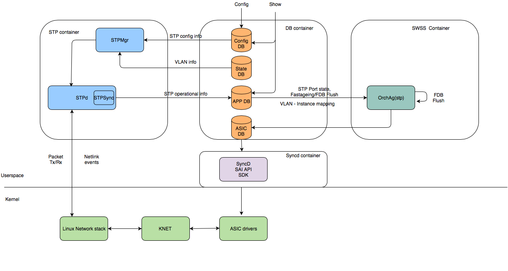
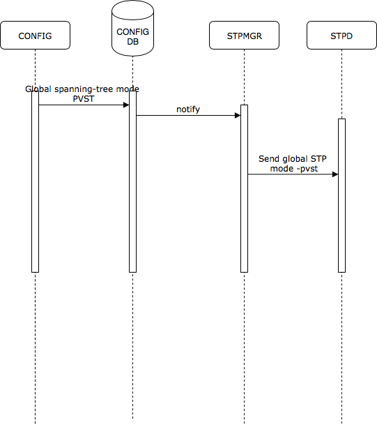
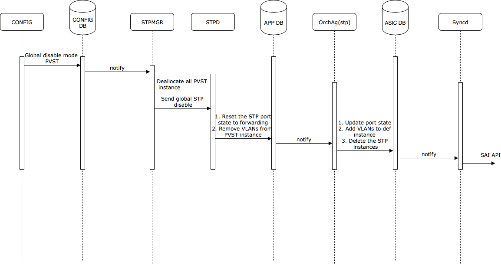
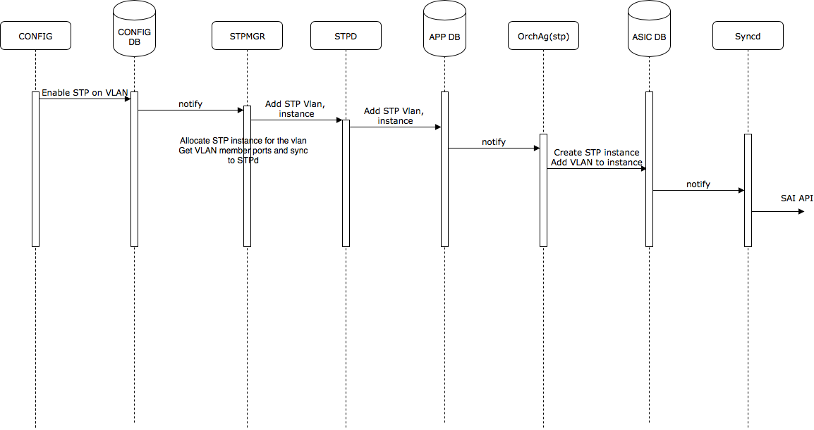
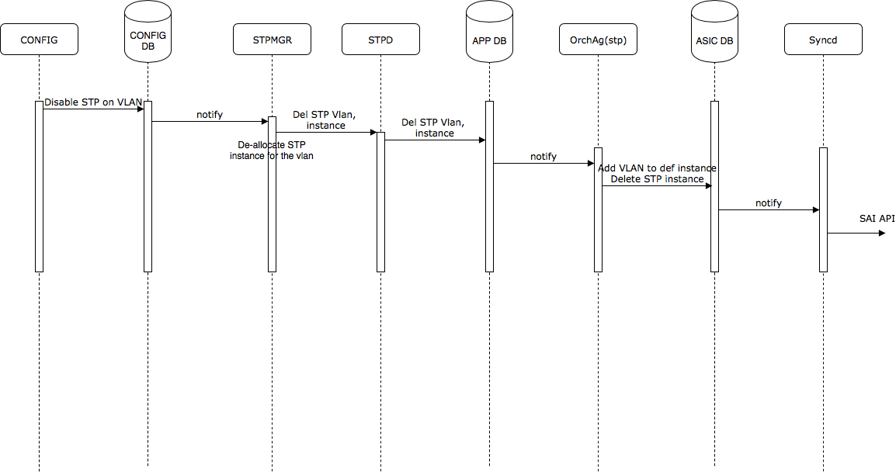
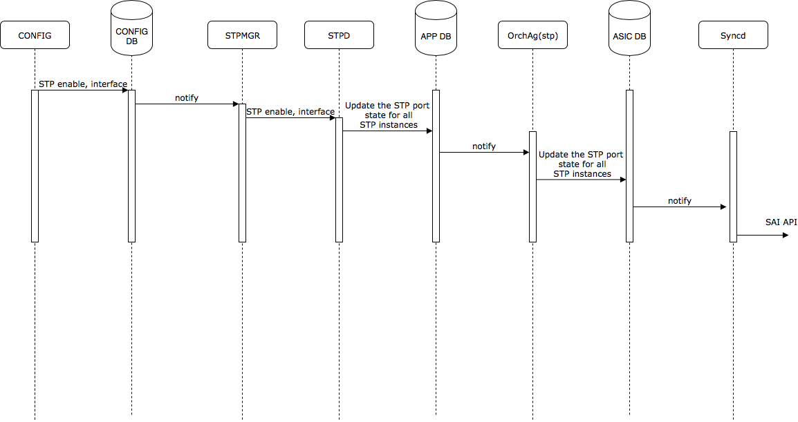
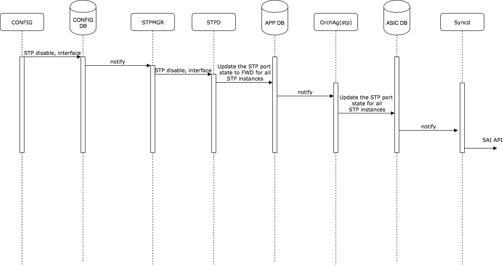
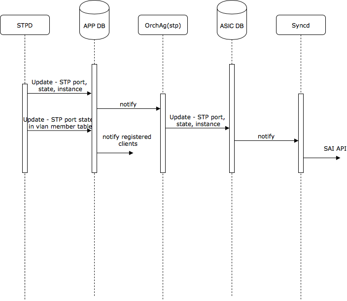
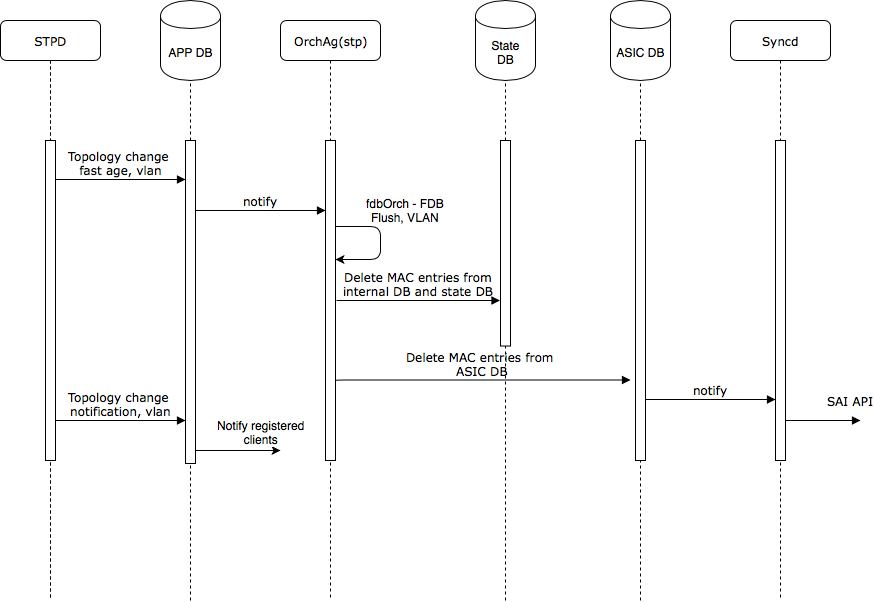
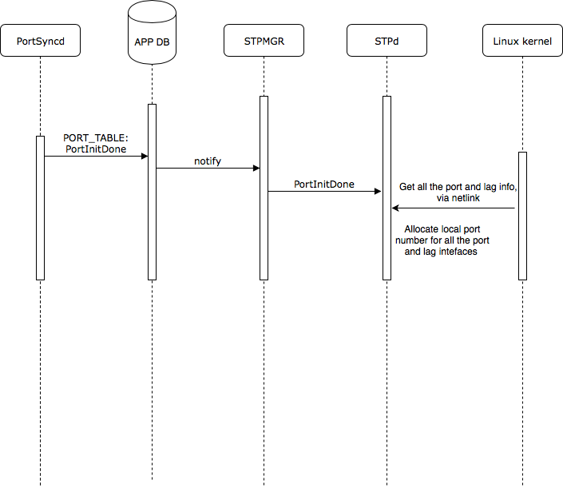

# Feature Name
PVST
# High Level Design Document
#### Rev 1.0


# Table of Contents
  * [List of Tables](#list-of-tables)
  * [Revision](#revision)
  * [About This Manual](#about-this-manual)
  * [Scope](#scope)
  * [Definition/Abbreviation](#definitionabbreviation)
  * [Requirements Overview](#requirement-overview)
      * [Functional Requirements](#functional-requirements)
      * [Configuration and Management Requirements](#configuration-and-management-requirements)
      * [Scalability Requirements](#scalability-requirements)
      * [Warm Boot Requirements](#warm-boot-requirements)
  * [Functionality](#-functionality)
      * [Functional Description](#functional-description)
  * [Design](#design)
      * [Overview](#overview)
      * [DB Changes](#db-changes)
          * [CONFIG DB](#config-db)
          * [APP DB](#app-db)
          * [STATE DB](#state-db)
      * [Switch State Service Design](#switch-state-service-design)
          * [Orchestration Agent](#orchestration-agent)
          * [STP Container](#stp-container)
      * [SAI](#sai)
      * [CLI](#cli)
          * [Configuration Commands](#configuration-commands)
          * [Show Commands](#show-commands)
          * [Debug Commands](#debug-commands)
          * [Clear Commands](#clear-commands)
  * [Flow Diagrams](#flow-diagrams)
  * [Serviceability and Debug](#serviceability-and-debug)
  * [Warm Boot Support](#warm-boot-support)
  * [Scalability](#scalability)
  * [Unit Test](#unit-test)

# List of Tables
[Table 1: Abbreviations](#table-1-abbreviations)

# Revision
| Rev |     Date    |       Author              | Change Description                |
|:---:|:-----------:|:-------------------------:|-----------------------------------|
| 0.1 | 05/02/2019  |     Sandeep, Praveen       | Initial version  |
| 0.2 | 05/02/2019  |     Sandeep, Praveen       | Incorporated Review comments  |
| 0.3 | 06/25/2019  |     Sandeep, Praveen       | Incorporated Review comments  |
| 1.0 | 10/15/2019  |     Sandeep, Praveen       | Minor changes post implementation |
| 1.1 | 11/26/2019  |     Sandeep, Praveen       | Change table names from INTF to PORT  |


# About this Manual
This document provides general information about the PVST (Per VLAN spanning tree) feature implementation in SONiC.
# Scope
This document describes the high level design of PVST feature. 

# Definition/Abbreviation
### Table 1: Abbreviations
| **Term**                 | **Meaning**                         |
|--------------------------|-------------------------------------|
| BPDU                     | Bridge protocol data unit           |
| PVST                     | Per VLAN Spanning tree              |
| STP                      | Spanning tree protocol              |


# 1 Requirement Overview
## 1.1 Functional Requirements


 1. Support PVST+ per VLAN spanning tree
 2. Support Portfast functionality
 3. Support Uplink fast functionality
 4. Support BPDU guard functionality
 5. Support Root guard functionality
 6. Bridge-id should include the VLAN id of the pvst instance along with bridge MAC address to derive a unique value for each instance.
 7. Port channel path cost will be same as the member port cost, it will not be cumulative of member ports cost
 8. DA MAC in case of PVST should be cisco pvst mac - 01:00:0C:CC:CC:CD
 9. Support protocol operation on static breakout ports
 10. Support protocol operation on Port-channel interfaces


## 1.2 Configuration and Management Requirements
This feature will support CLI and REST based configurations.
 1. Support CLI configurations as mentioned in section 3.6.2
 2. Support show commands as mentioned in section 3.6.3
 3. Support debug commands as mentioned in section 3.6.4
 4. Support Openconfig yang model - with extensions for supporting PVST 
 5. Support REST APIs for config and operational data

## 1.3 Scalability Requirements
16k port-vlan instances with max 255 STP instances.
The scaling limit might differ depending on the platform and the CPU used, which needs to be determined based on testing.

## 1.4 Warm Boot Requirements

Warm boot is not supported in this release. User is expected to do cold reboot when PVST is running so that topology will reconverge and traffic will be redirected via alternate paths.

If PVST is enabled and user tries to perform warm reboot an error will be displayed indicating PVST doesnt support warm reboot.


# 2 Functionality

## 2.1 Functional Description
The Spanning Tree Protocol (STP) prevents Layer 2 loops in a network and provides redundant links. If a primary link fails, the backup link is activated and network traffic is not affected. STP also ensures that the least cost path is taken when multiple paths exist between the devices.

When the spanning tree algorithm is run, the network switches transform the real network topology into a spanning tree topology. In an STP topology any LAN in the network can be reached from any other LAN through a unique path. The network switches recalculate a new spanning tree topology whenever there is a change to the network topology.

For each switch in the topology, a port with lowest path cost to the root bridge is elected as root port.

For each LAN, the switches that attach to the LAN select a designated switch that is the closest to the root switch. The designated switch forwards all traffic to and from the LAN. The port on the designated switch that connects to the LAN is called the designated port. The switches decide which of their ports is part of the spanning tree. A port is included in the spanning tree if it is a root port or a designated port.

PVST+ allows for running multiple instances of spanning tree on per VLAN basis. 

One of the advantage with PVST is it allows for load-balancing of the traffic. When a single instance of spanning tree is run and a link is put into blocking state for avoiding the loop, it will result in inefficient bandwidth usage. With per VLAN spanning tree multiple instances can be run such that for some of the instances traffic is blocked over the link and for other instances traffic is forwared allowing for load balancing of traffic.

PVST+ support allows the device to interoperate with IEEE STP and also tunnel the PVST+ BPDUs transparently across IEEE STP region to potentially connect other PVST+ switches across the IEEE STP region. For interop with IEEE STP, PVST+ will send untagged IEEE BPDUs (MAC - 01:80:C2:00:00:00) with information corresponding to VLAN 1. The STP port must be a member of VLAN 1 for interoperating with IEEE STP.

# 3 Design
## 3.1 Overview


__Figure 1: High level architecture__

High level overview:

STP container will host STPMgr and STPd process.

STPMgr will handle all the STP configurations and VLAN configurations via config DB and state DB respectively.

STPd process will handle all the protocol functionality and has following interactions

 * Linux kernel for packet tx/rx and netlink events
 * STPMgr interaction for configuration handling
 * STPSync is part of STPd handling all the STP operational data updates to APP DB 

Alternate design consideration:
Linux kernel has support for spanning-tree but is not being considered for following reasons 
 * Supports only STP, no support for RSTP and MSTP
 * Currently SONiC does not create a netdevice for each vlan, port combination as it relies on vlan aware bridge configuration. For supporting per VLAN spanning tree a netdevice needs to be created for each vlan, port combination, this will result in higher memory requirements due to additional netdevices and also a major change from SONiC perspective.

## 3.2 DB Changes
This section describes the changes made to different DBs for supporting the PVST protocol.
### 3.2.1 CONFIG DB
Following config DB schemas are defined for supporting this feature.
### STP_GLOBAL_TABLE
    ;Stores STP Global configuration
    ;Status: work in progress
    key                    = STP|GLOBAL				; Global STP table key
    mode                   = "pvst"			                ; spanning-tree mode pvst
    rootguard_timeout      = 3*DIGIT				; root-guard timeout value (5 to 600 sec, DEF:30 sec)
    forward_delay          = 2*DIGIT			        ; forward delay in secs (4 to 30 sec, DEF:15 sec)
    hello_time             = 2*DIGIT				; hello time in secs (1 to 10 sec, DEF:2sec)
    max_age                = 2*DIGIT				; maximum age time in secs (6 to 40 sec, DEF:20sec)
    priority               = 5*DIGIT				; bridge priority (0 to 61440, DEF:32768)

### STP_VLAN_TABLE
    ;Stores STP configuration per VLAN
    ;Status: work in progress
    key             = STP_VLAN|"Vlan"vlanid		                ; VLAN with prefix "STP_VLAN"
    forward_delay   = 2*DIGIT					; forward delay in secs (4 to 30 sec, DEF:15 sec)
    hello_time      = 2*DIGIT					; hello time in secs (1 to 10 sec, DEF:2sec)
    max_age         = 2*DIGIT					; maximum age time in secs (6 to 40 sec, DEF:20sec)
    priority        = 5*DIGIT					; bridge priority (0 to 61440, DEF:32768)
    enabled         = "true"/"false"            ; spanning-tree is enabled or not

### STP_VLAN_PORT_TABLE
    ;Stores STP port details per VLAN
    ;Status: work in progress
    key             = STP_VLAN_PORT|"Vlan"vlanid|ifname         ; VLAN+Port with prefix "STP_VLAN_PORT" ifname can be physical or port-channel name
    path_cost       = 9*DIGIT                                   ; port path cost (1 to 200000000) 
    priority        = 3*DIGIT                                   ; port priority (0 to 240, DEF:128)

### STP_PORT_TABLE
    ;Stores STP port details
    ;Status: work in progress
    key                    = STP_PORT|ifname			; ifname with prefix STP_PORT, ifname can be physical or port-channel name
    enabled                = BIT			                ; is the STP on port enabled (1) or disabled (0)
    root_guard             = BIT		        	        ; is the root guard on port enabled (1) or disabled (0)
    bpdu_guard             = BIT				        ; is the bpdu guard on port enabled (1) or disabled (0)
    bpdu_guard_do_disable  = BIT		         	        ; port to be disabled when it receives a BPDU; enabled (1) or disabled (0)
    path_cost              = 9*DIGIT			        ; port path cost (2 to 200000000)
    priority               = 3*DIGIT				; port priority (0 to 240, DEF:128)
    portfast               = BIT                    ; Portfast is enabled or not
    uplink_fast            = BIT                    ; Uplink fast is enabled or not

### 3.2.2 APP DB

### STP_VLAN_TABLE
    ;Stores the STP per VLAN operational details
    ;Status: work in progress
    key                   = STP_VLAN:"Vlan"vlanid
    bridge_id             = 16HEXDIG                            ; bridge id
    max_age               = 2*DIGIT			            ; maximum age time in secs (6 to 40 sec, DEF:20sec)
    hello_time            = 2*DIGIT			            ; hello time in secs (1 to 10 sec, DEF:2sec)
    forward_delay         = 2*DIGIT			            ; forward delay in secs (4 to 30 sec, DEF:15 sec)
    hold_time             = 1*DIGIT			            ; hold time in secs (1 sec) 
    last_topology_change  = 1*10DIGIT			        ; time in secs since last topology change occured 
    topology_change_count = 1*10DIGIT			        ; Number of times topology change occured
    root_bridge_id        = 16HEXDIG			        ; root bridge id
    root_path_cost        = 1*9DIGIT			        ; port path cost 
    desig_bridge_id       = 16HEXDIG			        ; designated bridge id
    root_port             = ifName			                ; Root port name
    root_max_age          = 1*2DIGIT			        ; Max age as per root bridge
    root_hello_time       = 1*2DIGIT			        ; hello time as per root bridge
    root_forward_delay    = 1*2DIGIT			        ; forward delay as per root bridge
    stp_instance          = 1*4DIGIT			        ; STP instance for this VLAN


### STP_VLAN_PORT_TABLE
    ;Stores STP VLAN port details 
    ;Status: work in progress
    key                 = STP_VLAN_PORT:"Vlan"vlanid:ifname     ; VLAN+Port with prefix "STP_VLAN_PORT"
    port_num            = 1*3DIGIT                              ; port number of bridge port
    path_cost           = 1*9DIGIT                              ; port path cost (1 to 200000000)
    priority            = 3*DIGIT                               ; port priority (0 to 240, DEF:128)
    port_state          = "state"                               ; STP state - disabled, block, listen, learn, forward
    desig_cost          = 1*9DIGIT                              ; designated cost
    desig_root          = 16HEXDIG                              ; designated root
    desig_bridge        = 16HEXDIG                              ; designated bridge
    desig_port          = 1*3DIGIT                              ; designated port
    fwd_transitions     = 1*5DIGIT                              ; number of forward transitions
    bpdu_sent           = 1*10DIGIT                             ; bpdu transmitted
    bpdu_received       = 1*10DIGIT                             ; bpdu received
    tcn_sent            = 1*10DIGIT                             ; tcn transmitted
    tcn_received        = 1*10DIGIT                             ; tcn received
    root_guard_timer    = 1*3DIGIT                              ; root guard current timer value


### STP_PORT_TABLE
    ;Stores STP port details
    ;Status: work in progress
    key                    = STP_PORT:ifname			           ; ifname with prefix STP_PORT, ifname can be physical or port-channel name
    bpdu_guard_shutdown    = "yes" / "no"                          ; port disabled due to bpdu-guard
    port_fast              = "yes" / "no"                          ; port fast is enabled or not


### STP_PORT_STATE_TABLE
    ;Stores STP port state per instance
    ;Status: work in progress
    key                 = STP_PORT_STATE:ifname:instance        ; ifname and the STP instance
    state               = 1DIGIT                                ; 0-disabled, 1-block, 2-listen, 3-learn, 4-forward 


### STP_VLAN_INSTANCE_TABLE 
    ;Defines VLANs and the STP instance mapping
    ;Status: work in progress
    key                 = STP_VLAN_INSTANCE_TABLE:"Vlan"vlanid  ; DIGIT 1-4095 with prefix "Vlan"
    stp_instance        = 1*4DIGIT                              ; STP instance associated with this VLAN


### STP_FASTAGEING_FLUSH_TABLE
    ;Defines vlans for which fastageing is enabled
    ;Status: work in progress
    key                 = STP_FASTAGEING_FLUSH_TABLE:"Vlan"vlanid       ; vlan id for which flush needs to be done
    state               = "true"                                          ; true perform flush  

### 3.2.3 STATE DB

### STP_TABLE
    ;Defines the global STP state table
    ;Status: work in progress
    key                 = STP_TABLE:GLOBAL       ; key
    max_stp_inst        = 1*3DIGIT               ; Max STP instances supported by HW 


## 3.3 Switch State Service Design
### 3.3.1 Orchestration Agent

All STP operations for programming the HW will be handled as part of OrchAgent. OrchAgent will listen to below updates from APP DB for updating the ASIC DB via SAI REDIS APIs.

 * Port state udpate - STP_PORT_STATE_TABLE

 * VLAN to instance mapping - STP_VLAN_INSTANCE_TABLE

Orchagent will also listen to updates related to Fast ageing on APP DB. When fast ageing is set for the VLAN due to topology change, Orchagent will perform FDB/MAC flush for the VLAN. 

 * FDB/MAC flush - STP_FASTAGEING_FLUSH_TABLE


## 3.4 STP Container

STP container will have STPMgr and STPd processes.

STPMgr process will register with the config DB for receiving all the STP configurations and with state DB for VLAN configurations. STPMgr will notify this configuration information to STPd for protocol operation. STPMgr will also handle the STP instance allocation.

STPd process will handle following interactions. STPd will use libevent for processing the incoming events and timers.
1) Packet processing 

   * Socket of PF_PACKET type will be created for packet tx/rx 

   * Filters will be attached to the socket to receive the STP BPDUs based on DA MAC

   * PACKET_AUXDATA socket option will be set to get the VLAN id of the packet received from the cmsg headers

2) Configuration - All STP CLI and VLAN configurations will be received from STPMgr via unix domain socket
3) Timers handling - Timer events are generated every 100ms for handling STP protocol timers
4) Port events - Netlink socket interface for processing create/delete of port, lag interface, lag member add/delete, link state changes and port speed
5) Operational updates - STPsync is part of STPd and handles all the updates to APP DB. All DB interactions are detailed in the Section 4.
6) STP Port state sync to linux kernel - Currently the vlan aware bridge doesnt support programming the STP state into linux bridge. As a workaround, when STP state is not forwarding, corresponding VLAN membership on that port will be removed to filter the packets on blocking port.

### Interface DB:

In SONiC, ethernet interface is represented in the format Ethernet<id\> where id represents the physical port number and port-channel is represented by PortChannel<id\> where id is a 4 digit numerical value. 

STPd implementation makes use of its own internal port id for its protocol operation. These port ids are used for bit representation in port masks and also for indexing the array which holds the pointers to STP port level information. So to continue using these mechanisms it is required to convert the SONiC representation of interface to local STP port ids. So when STPd interacts with other components in the system local port id will be converted to SONiC interface name, similarly all messages received from other components with SONiC interface name will be converted to local STP port id before processing. For this purpose an interface DB (AVL tree) will be maintained to map the SONiC interface names to local STP port ids. 


### Local STP Port id allocation:

For allocating local port ids STPd needs to know the max number of physical ports and Port-channel interfaces supported on the device. Currently there is no mechanism to obtain these values in a direct way (like reading from DBs) so below logic will be used to arrive at max ports -

Max STP Ports = Max physical ports + Max Port-Channel interfaces 

where,

Max physical ports will be determined from the higher interface id populated say for example if higher port is Ethernet252 (or 254) - max ports will be 256 to ensure breakout ports are accomodated.

Max Port-Channel interfaces will be same as max physical ports to accomodate the worst case scenario of each Port-channel having only one port.


Post bootup, Portsyncd reads the port_config.ini file which contains the port specific configuration information, and updates the APP DB with this information. Orchagent listens to these APP DB updates and takes care of creating all the interfaces in linux kernel and the hardware. Kernel sends netlink updates for the interfaces being created which Portsyncd listens to, once Portsyncd confirms all the interfaces have been configured it will generate PortInitDone notification. STPd will receive this message via STPMgr and then gets all the interface information via netlink for allocating the local STP port ids.

Note: The port id for Port-channel interface will be allocated only when the first member port is added, this ensures Port-channel interfaces with no member ports dont burn the port ids. 

Example of port id allocation -
```
SONiC interface          STP Port id
Ethernet0                    0
Ethernet4                    4
Ethernet8                    8
Ethernet252                 252
PortChannel10               256
PortChannel5                257
PortChannel20               258
```

Note: As Port-channel port ids are dynamically allocated it might result in same port channel getting different value post reboot. To ensure a predictable convergence where port-channel port id is used as tie breaker, user needs to configure appropriate port priority value.

### 3.4.1 BPDU trap mechanism
SONiC uses copp configuration file 00-copp.config.json for configuring the trap group, ids, cpu priority queue and a policer. This functionality has been extended for supporting STP and PVST BPDU trap to CPU.

## 3.5 SAI
STP SAI interface APIs are already defined and is available at below location -

https://github.com/opencomputeproject/SAI/blob/master/inc/saistp.h

Control packet traps required for STP (SAI_HOSTIF_TRAP_TYPE_STP) and PVST (SAI_HOSTIF_TRAP_TYPE_PVRST) are defined in below SAI spec -

https://github.com/opencomputeproject/SAI/blob/master/inc/saihostif.h 

## 3.6 CLI
### 3.6.1 Data Models
Openconfig STP yang model will be extended to support PVST.

### 3.6.2 Configuration Commands

### 3.6.2.1 Global level 

### 3.6.2.1.1 Enabling or Disabling of PVST feature - Global spanning-tree mode
This command allows enabling the spanning tree mode for the device. 

**config spanning_tree {enable|disable} {pvst}**

Note: 
1) When global pvst mode is enabled, by default spanning tree will be enabled on the first 255 VLANs, for rest of the VLAN spanning tree will be disabled.
2) When multiple spanning-tree modes are supported, only one mode can be enabled at any given point of time.

### 3.6.2.1.2 Per VLAN spanning-tree 
This command allows enabling or disabling spanning-tree on a VLAN.

**config spanning_tree vlan {enable|disable} <vlan\>**

 ### 3.6.2.1.3 Root-guard timeout

This command allows configuring a root guard timeout value. Once superior BPDUs stop coming on the port, device will wait for a period until root guard timeout before moving the port to forwarding state(default = 30 secs), range 5-600.

**config spanning_tree root_guard_timeout <value\>**

 ### 3.6.2.1.4 Forward-delay 

This command allows configuring the forward delay time in seconds (default = 15), range 4-30.

**config spanning_tree forward_delay <value\>**

 ### 3.6.2.1.5 Hello interval
This command allow configuring the hello interval in secs for transmission of bpdus (default = 2), range 1-10.

**config spanning_tree hello <value\>**

 ### 3.6.2.1.6 Max-age
This command allows configuring the maximum time to listen for root bridge in seconds (default = 20), range 6-40.

**config spanning_tree max_age <value\>**

 ### 3.6.2.1.7 Bridge priority
This command allows configuring the bridge priority in increments of 4096 (default = 32768), range 0-61440.

**config spanning_tree priority <value\>**

 ### 3.6.2.2 VLAN level 
Below commands are similar to the global level commands but allow configuring on per VLAN basis.

**config spanning_tree vlan forward_delay <vlan\> <fwd-delay-value\>**

**config spanning_tree vlan hello <vlan\> <hello-value\>**

**config spanning_tree vlan max_age <vlan\> <max-age-value\>**

**config spanning_tree vlan priority <vlan\> <priority-value\>**

 ### 3.6.2.3 VLAN, interface level 
Below configurations allow STP parameters to be configured on per VLAN, interface basis.

 ### 3.6.2.3.1 Port Cost
This command allows to configure the port level cost value for a VLAN, range 1 - 200000000

**config spanning_tree vlan interface cost <vlan\> <ifname\> <value\>**

 ### 3.6.2.3.2 Port priority
This command allows to configure the port level priority value for a VLAN, range 0 - 240 (default 128)

**config spanning_tree vlan interface priority <vlan\> <ifname\> <value\>**

 ### 3.6.2.4 Interface level 

 ### 3.6.2.4.1 STP enable/disable on interface

This command allows enabling or disabling of STP on an interface, by default STP will be enabled on the interface if global STP mode is configured.

**config spanning_tree interface {enable|disable} <ifname\>** 

 ### 3.6.2.4.2 Root Guard:
The Root Guard feature provides a way to enforce the root bridge placement in the network and allows STP to interoperate with user network bridges while still
maintaining the bridged network topology that the administrator requires. When BPDUs are received on a root guard enabled port, the STP state will be moved to "Root inconsistent" state to indicate this condition. Once the port stops receiving superior BPDUs, Root Guard will automatically set the port back to a FORWARDING state after the timeout period has expired.

This command allow enabling or disabling of root guard on an interface.

**config spanning_tree interface root_guard {enable|disable} <ifname\>**

Following syslogs will be generated when entering and exiting root guard condition respectively - 

STP: Root Guard interface Ethernet4, VLAN 100 inconsistent (Received superior BPDU)

STP: Root Guard interface Ethernet4, VLAN 100 consistent (Timeout)

 ### 3.6.2.4.3 BPDU Guard
BPDU Guard feature disables the connected device ability to initiate or participate in STP on edge ports. When STP BPDUs are received on the port where BPDU guard is enabled the port will be shutdown. User can re-enable the port administratively after ensuring the BPDUs have stopped coming on the port.

Below command allows enabling or disabling of bpdu guard on an interface.

**config spanning_tree interface bpdu_guard {enable|disable} <ifname\>**


By default, BPDU guard will only generate a syslog indicating the condition, for taking an action like disabling the port below command can be used with shutdown option

**config spanning_tree interface bpdu_guard {enable|disable} <ifname\> [--shutdown | -s]**

Following syslog will be generated when BPDU guard condition is entered -

STP: Tagged BPDU(100) received, interface Ethernet4 disabled due to BPDU guard trigger

STPd will update the config DB for shutting down the interface, user can enable the interface back once it has stopped receiving the BPDUs.

 ### 3.6.2.4.4 Port fast
Portfast command is enabled by default on all ports, portfast allows edge ports to move to forwarding state quickly when the connected device is not participating in spanning-tree.

Below command allows enabling or disabling of portfast on an interface.

**config spanning_tree interface portfast {enable|disable} <ifname\>**

 ### 3.6.2.4.4 Uplink fast
 Uplink fast feature enhances STP performance for switches with redundant uplinks. Using the default value for the standard STP forward delay, convergence following a transition from an active link to a redundant link can take 30 seconds (15 seconds for listening and an additional 15 seconds for learning).

When uplink fast is configured on the redundant uplinks, it reduces the convergence time to just one second by moving to forwarding state (bypassing listening and learning modes) in just once second when the active link goes down. 

**config spanning_tree interface uplink_fast {enable|disable} <ifname\>**

 ### 3.6.2.4.5 Port level priority
This command allows to configure the port level priority value, range 0 - 240 (default 128)

**config spanning_tree interface priority <ifname\> <value\>**

 ### 3.6.2.4.6 Port level path cost
This command allows to configure the port level cost value, range 1 - 200000000

**configure spanning_tree interface cost <ifname\> <value\>**


### 3.6.3 Show Commands
- show spanning_tree
- show spanning_tree vlan <vlanid\>
- show spanning_tree vlan <vlanid\> interface <ifname\>

``` 
Spanning-tree Mode: PVST
VLAN 100 - STP instance 3
--------------------------------------------------------------------
STP Bridge Parameters:

Bridge           Bridge Bridge Bridge Hold  LastTopology Topology
Identifier       MaxAge Hello  FwdDly Time  Change       Change
hex              sec    sec    sec    sec   sec          cnt
8000002438eefbc3 20     2      15     1     0            0       

RootBridge       RootPath  DesignatedBridge Root  Max Hel Fwd
Identifier       Cost      Identifier       Port  Age lo  Dly
hex                        hex                    sec sec sec
8000002438eefbc3 0         8000002438eefbc3 Root  20  2   15  

STP Port Parameters:

Port        Prio Path Port Uplink   State      Designated  Designated       Designated
Num         rity Cost Fast Fast                Cost        Root             Bridge
Ethernet13  128  4    Y    N        FORWARDING 0           8000002438eefbc3 8000002438eefbc3 
```

- show spanning_tree bpdu_guard
This command displays the interfaces which are BPDU guard enabled and also the state if the interface is disabled due to BPDU guard.
```
show spanning_tree bpdu_guard
PortNum            Shutdown      Port shut
                   Configured    due to BPDU guard
-------------------------------------------------
Ethernet1            Yes          Yes
Ethernet2            Yes          No
Port-Channel2        No           NA
```

-show spanning_tree root_guard
This command displays the interfaces where root guard is active and the pending time for root guard timer expiry
```
Root guard timeout: 120 secs

Port         VLAN    Current State
-------------------------------------------------
Ethernet1    1       Inconsistent state (102 seconds left on timer)
Ethernet8    100     Consistent state
```

- show spanning_tree statistics 
- show spanning_tree statistics vlan <vlanid\> 
This command displays the spanning-tree bpdu statistics. Statistics will be synced to APP DB every 10 seconds.
```
VLAN 100 - STP instance 3
--------------------------------------------------------------------
PortNum           BPDU Tx     BPDU Rx     TCN Tx      TCN Rx             
Ethernet13        10	      4           3          4
PortChannel15     20	      6           4          1
```


### 3.6.4 Debug Commands
Following debug commands will be supported for enabling additional logging which can be viewed in /var/log/stpd.log, orchangent related logs can be viewed in /var/log/syslog.
- debug spanning_tree - This command must be enabled for logs to be written to log file, after enabling any of the below commands.
- debug spanning_tree bpdu [tx|rx]
- debug spanning_tree event
- debug spanning_tree interface <ifname\>
- debug spanning_tree verbose
- debug spanning_tree vlan <id\>

To disable the debugging controls enabled '-d' or '--disable' option can be used, an example of disabling bpdu debugging is shown below -
- debug spanning_tree bpdu -d

Follow commands can be used to reset and display the debugging controls enabled respectively
- debug spanning_tree reset
- debug spanning_tree show

Following debug commands will be supported for displaying internal data structures
- debug spanning_tree dump global
- debug spanning_tree dump vlan <vid\>
- debug spanning_tree dump interface <vid\> <ifname\>

### 3.6.5 Clear Commands
Following clear commands will be supported 
- sonic-clear spanning_tree statistics
- sonic-clear spanning_tree statistics vlan <vid\>
- sonic-clear spanning_tree statistics vlan-interface <vid\> <ifname\>
- sonic-clear spanning_tree statistics interface <ifname\>

### 3.6.6 REST API Support
REST APIs is not supported in this release

# 4 Flow Diagrams

## 4.1 Global spanning-tree mode



__Figure 2: Global PVST mode enable__



__Figure 3: Global PVST mode disable__

## 4.2 Per VLAN spanning-tree 


__Figure 4: STP VLAN enable__



__Figure 5: STP VLAN disable__

## 4.3 STP enable/disable on interface


__Figure 6: STP enable on an interface__



__Figure 7: STP disable on an interface__

## 4.4 STP port state update


__Figure 8: STP port state update__

## 4.5 STP Topology change


__Figure 9: STP Topology change__

## 4.6 STP Port id allocation


__Figure 10: STP Port id allocation__

# 5 Serviceability and Debug
Debug command and statistics commands as mentioned in Section 3.6.3 and 3.6.4 will be supported. Debug command output will be captured as part of techsupport.

# 6 Warm Boot Support
Warm boot is not supported

# 7 Scalability
16k port-vlan instances with max 255 STP instances.
The scaling limit might differ depending on the platform and the CPU used, which needs to be determined based on testing.

# 8 Unit Test

CLI:
1) Verify CLI to enable spanning-tree globally
2) Verify CLI to enable spanning-tree per VLAN
3) Verify CLI to enable spanning-tree on interface
4) Verify CLI to set Bridge priority
5) Verify CLI to set Bridge forward-delay
6) Verify CLI to set Bridge hello-time
7) Verify CLI to set Bridge max-age
8) Verify CLI to set Bridge Port path cost
9) Verify CLI to set Bridge Port priority
10) Verify CLI to set Bridge root guard
11) Verify CLI to set Bridge root guard timeout
12) Verify CLI to set Bridge bpdu guard
13) Verify CLI to set Bridge bpdu guard with do-disable action
14) Verify CLI to set portfast
15) Verify CLI to set uplink fast
16) Verify CLI to clear uplink fast
17) Verify CLI to clear portfast
18) Verify CLI to clear Bridge bpdu guard with do-disable action
19) Verify CLI to clear Bridge bpdu guard
20) Verify CLI to clear Bridge root guard timeout
21) Verify CLI to clear Bridge root guard
22) Verify CLI to clear Bridge Port priority
23) Verify CLI to clear Bridge Port path cost
24) Verify CLI to clear Bridge max-age
25) Verify CLI to clear Bridge hello-time
26) Verify CLI to clear Bridge forward-delay
27) Verify CLI to clear Bridge priority
28) Verify CLI to disabling spanning-tree on interface
29) Verify CLI to disabling spanning-tree per VLAN
30) Verify CLI to disabling spanning-tree globally
31) Verify CLI to display spanning-tree running config
32) Verify CLI to display spanning-tree state information 
33) Verify CLI to display spanning-tree statistics
34) Verify CLI to display bpdu-guard port information
35) Verify CLI for clear spanning tree statistics

Functionality
1) Verify Config DB is populated with configured STP values
2) Verify PVST instances running on multiple VLANs
3) Verify VLAN to STP instance mapping is populated correctly in APP DB, ASIC DB, Hardware
4) Verify spanning-tree port state updates for the VLANs are populated correctly in APP DB, ASIC DB, Hardware
5) Verify during topology change fast ageing updates in APP DB and also MAC flush is performed
6) Verify BPDU format of the packets are correct
7) Verify traffic with stp convergence and loops are prevented where there are redundant paths in topology
8) Verify load balancing functionality with multiple spanning tree instances
9) Verify adding port to VLAN after spanning-tree is enabled on the VLAN and verify port state updates
10) Verify deleting port from VLAN running PVST and verify re-convergence is fine
11) Verify BUM traffic forwarding with spanning-tree running 
12) Verify forward-delay by changing intervals
13) Verify hello-time timers
14) Verify max-age by changing intervals
15) Verify altering bridge priority will alter Root Bridge selection
16) Verify altering port priority will alter Designated port selection
17) Verify altering port cost results in path with lowest root path cost is seleced as root port
18) Verify port states on same physical interface for multiple STP instances configured
19) Verify Topology change functionality and spanning-tree reconvergence by disabling/enabling links
20) Verify spanning-tree behavior after adding few more VLANs
21) Verify spanning-tree behavior after removing some of the VLANs
22) Verify rebooting one of the nodes in the topology and verify re-convergence and traffic takes alternate path
23) Verify port cost values chosen are correct as per the interface speed
24) Verify Root guard functionality
25) Verify BPDU guard functionality, verify BPDU guard with do-disable functionality 
26) Verify Portfast functionality
27) Verify Uplink fast functionality
28) Verify PVST and STP traps are created after switch reboot
29) Verify PVST behavior when spanning-tree disabled on VLAN, verify APP DB, ASIC DB, hardware are populated correctly
30) Verify global spanning-tree disable, verify APP DB, ASIC DB, hardware are populated correctly
31) Verify spanning tree config save and reload, verify topology converges is same as before reboot
32) Verify PVST convergence over untagged ports
33) Verify PVST interop with IEEE STP
35) Verify bridge id encoding includes the VLAN id of the respective PVST instance
36) Verify PVST operational data is sync to APP DB
37) Verify PVST over static breakout ports

Scaling
1) Verify running 255 PVST instances 
2) Verify 16k vlan,port scaling

Logging and debugging
1) Verify debug messages are logged in /var/log/syslog
2) Verify changing log level
3) Verify Pkt Tx/Rx Debug
4) Verify STP debug commands
5) Verify debug commands output is captured in techsupport

REST
1) Verify all REST commands

PVST over LAG
1) Verify PVST behavior over LAG
2) Verify adding port to LAG will not flap the protocol
3) Verify deleting a port from LAG will not flap the protocol
4) Verify BPDU is sent only from one of the LAG member port
5) Verify adding LAG to VLAN running PVST
6) Verify deleting LAG from VLAN running PVST

SAI
1) Verify creating STP instance and ports in SAI
2) Verify adding VLAN to STP instance in SAI
3) Verify updating PortState in SAI
4) Verify deleting VLAN from STP instance in SAI
5) Verify deleting STP instance and ports in SAI

L3
1) Verify L3 traffic with PVST in topology
