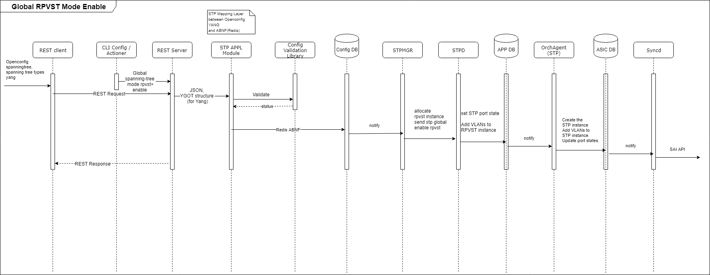
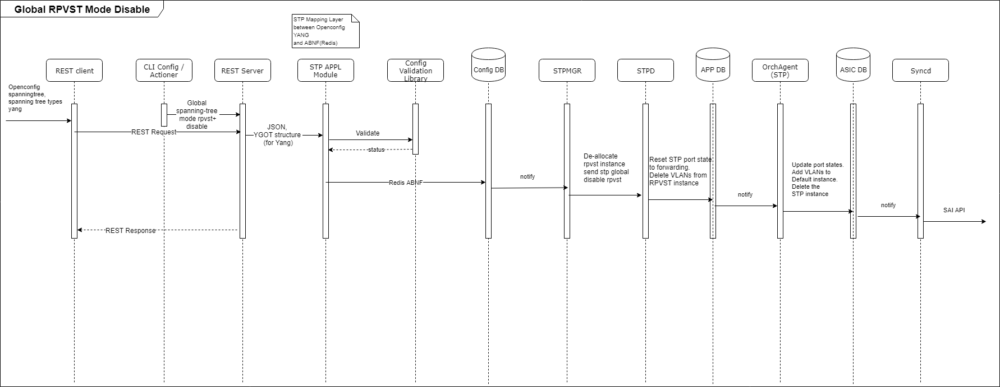
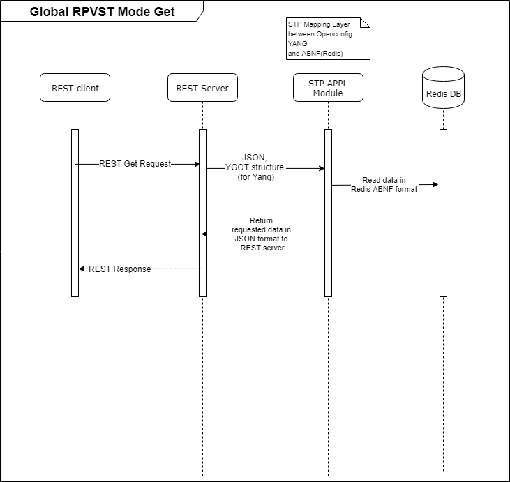

# Feature Name

RPVST+.

# High Level Design Document

#### Rev 0.1

# Table of Contents

  * [List of Tables](#list-of-tables)
  * [Revision](#Revision)
  * [References](#References)
  * [About This Manual](#about-this-manual)
  * [Scope](#scope)
  * [Definition/Abbreviation](#definitionabbreviation)
  * [Requirement Overview](#1-requirements)
	  * [Functional Requirements](#11-functional-requirements)
	  * [Configuration and Management Requirements](#12-config-mgmt-reqmts)
	  * [Scalability Requirements](#13-scal-reqmts)
	  * [Warm Boot Requirements](#14-warm-boot-reqmts)
  * [Functionality](#2-functionality)
	  * [Functional Description](#21-functional-description)
  * [Design Specification](#3-design-spec)	  
    * [Design Overview](#31-design-overview)
    * [DB Changes](#32-db-changes)
    * [Switch State Service Design](#33-switch-state-service-design)
    * [CLI Commands](#36-cli)
	    * [Configuration Commands](#362-config-commands)
    	* [Show Commands](#363-show-commands)
    	* [Debug Commands](#364-debug-commands)
	* [Clear Commands](#365-clear-commands)
    	* [REST API Support](#366-rest-api)
  * [Flow Diagrams](#4-flow-diagrams)
  * [Serviceability and Debug](#5-serviceability-and-debug)
  * [Warm Boot Support](#6-warm-boot-support)
  * [Scalability](#7-scalability)
  * [Unit Test](#8-unit-test)

# List of Tables

[Table 1: Abbreviations](#table-1-abbreviations)

# Revision

| Rev |     Date    |       Author         | Change Description                |
| --- | ----------- | -------------------- | --------------------------------- |
| 0.1 | 06/07/2019  | Gunavardhani Bandaru | Initial version                   |

# References

| SONIC PVST+ Functional specification Release / Version | URL                                     |
|--------------------------------------------------------|-----------------------------------------|
| SONIC release 201908                                   | https://github.com/Azure/SONiC/pull/386 |
| SONIC release 2020xx                                   | TBD                                     |

# About This Manual
This document provides general information about Rapid Per-VLAN Spanning Tree (Rapid PVST+ or RPVST+) feature implementation in SONiC.

# Scope
This document describes the high level design of RPVST+  feature in SONiC.

# Definition/Abbreviation

### Table 1: Abbreviations

| **Term**                 | **Meaning**                         |
|--------------------------|-------------------------------------|
| RSTP                     | Rapid Spanning Tree Protocol        |
| BPDU                     | Bridge protocol data unit           |
| PVST                     | Per VLAN Spanning tree              |
| STP                      | Spanning tree protocol              |
| RPVST+                   | Rapid Per-VLAN Spanning Tree        |

# 1 Requirement Overview

## 1.1 Functional Requirements

- Provide rapid traffic re-convergence per vlan for point-to-point links in less than 500 milliseconds, following the failure of a bridge or bridge port.
- Support BPDU guard functionality
- Support Root guard functionality
- Bridge-id should include the VLAN id of the RPVST instance along with bridge MAC address to derive a unique value for each instance.
- Port channel path cost will be same as the member port cost, it will not be cumulative of member ports cost
- DA MAC in case of RPVST+ should be Cisco Shared Spanning Tree Protocol Address 01:00:0C:CC:CC:CD
- Support protocol operation on static breakout ports
- Support protocol operation on physical and Port-channel interfaces

## 1.2 Configuration and Management Requirements
This feature will support CLI and REST based configurations.

- Support CLI configurations as mentioned in section 3.6.2
- Support show commands as mentioned in section 3.6.3
- Support debug commands as mentioned in section 3.6.4
- Support Openconfig yang model - with extensions for supporting RPVST+
- Support REST APIs for config and operational data

## 1.3 Scalability Requirements
16K port-vlan instances with max 255 STP instances. 
The scaling limit might differ depending on the platform and the CPU used, which needs to be determined based on testing.

## 1.4 Warm Boot Requirements
Warm boot is not supported in SONIC release 2020xx. User is expected to do cold reboot when RPVST+ is running so that topology will re-converge and traffic will be redirected via alternate paths.
If RPVST+ is enabled and user tries to perform warm reboot, a warning is displayed indicating RPVST+ does not support warm reboot.

# 2 Functionality
IEEE 802.1W-2001 RSTP provides rapid traffic re-convergence for point-to-point links in less than 500 milliseconds, following the failure of a bridge or bridge port.
This re-convergence occurs more rapidly than the re-convergence provided by the IEEE 802.1D STP. Convergence in RSTP bridges is based on explicit handshakes between Designated ports and their connected Root ports and does not rely on any timers.

RPVST+ is IEEE 802.1w (RSTP) standard implemented per VLAN. A single instance of RSTP runs on each configured VLAN.

## 2.1 Functional Description

- Ports can have one of the following roles:
	- Root - port on a Switch, other than Root Bridge, that provides the best path (lowest cost path) to the Root bridge. There are no root ports on a root bridge.
	- Designated - Provides the lowest cost path to the root bridge from a network to which the port is connected. All ports on a root bridge are designated ports.
	- Alternate - Provides the best alternate path to the root bridge when the root port goes down
	- Backup - Provides a redundant path to the same network segment. The purpose of Alternate and Backup ports is to provide connectivity when other network components fail. 
	- Disabled - Has no role in the topology
 
- Allows ports that are configured as Edge ports to be present in an RPVST+ topology. Edge ports are ports of a switch that are connected to work stations or computers. Edge ports do not register for any incoming BPDU related events. RSTP does not consider edge ports in the spanning tree calculations. Hence, any port flaps on edge ports do not cause spanning tree topology changes. 

- Supports the following bridge port states:
	- Forwarding - Packet forwarding is allowed on this port.
	- Discarding - Data traffic is blocked on the port. This state corresponds to the listening and blocking states of 802.1D.
	- Learning - MAC address entries are allowed to be added to the forwarding database but packet forwarding is not yet allowed. 
	- Disabled - The port is not participating in RSTP. The port is disconnected or RSTP is administratively disabled on the port.

- Backward compatible with IEEE 802.1D bridges.

- Enable or disable RSTP at the following levels:
	- VLAN - configured on all ports within the given VLAN. 
	- Individual port - Configured only on the individual port. 

# 3 Design Specification

## 3.1 Design Overview
RPVST+ will run as one of the protocol modes in the STPd process. Please see SONIC PVST+ Functional specification for more details on SONIC STP design.

## 3.2 DB Changes
This section describes the changes made to different DBs for supporting the RPVST+ protocol.

### 3.2.1 CONFIG DB ###

Following config DB schemas are defined / modified for supporting this feature:

#### STP_GLOBAL_TABLE ####

	;Stores STP Global configuration
	;Status: work in progress
	key                    = STP|GLOBAL            ; Global STP table key
	mode                   = "rpvst"               ; spanning-tree mode - "pvst" or "rpvst"

"rpvst" is added as one of the modes to existing STP_GLOBAL_TABLE.

#### STP_INTF_TABLE ####

	;Stores STP interface details
	;Status: work in progress
	key                   = STP_INTF|ifname         ; ifname with prefix STP_INTF, ifname can be physical or port-channel name
	edge_port             = BIT                     ; enabled or disabled. If set to enabled, then the port becomes an edge port in the domain.
	link_type             = "link_type"             ; auto, point-to-point or shared link type.

The following fields are added to existing STP_INTF_TABLE - edge_port and link_type.

### 3.2.2 APP DB ###

#### STP_INTF_TABLE ####

	;Stores STP interface details
	;Status: work in progress
	key                   = STP_INTF:ifname                         ; ifname with prefix STP_INTF, ifname can be physical or port-channel name
	edge_port             = "yes" / "no"                            ; enabled or disabled. If set to enabled, then the port becomes an edge port in the domain.
	link_type             = "point-to-point" / "shared"             ; point-to-point or shared link type.

The following fields are added to existing STP_INTF_TABLE - edge_port and link_type.

#### STP_VLAN_INTF_FLUSH_TABLE ####

	;Defines vlan and port for which flush needs to happen
	;Status: work in progress
	key                 = STP_VLAN_INTF_FLUSH_TABLE:"vlan port" vlanid and portid       ; vlan id and port id for which flush needs to be done
	state               = "true"                                                        ; if true - perform flush.

New table STP_VLAN_INTF_FLUSH_TABLE is created as stated above.
  

## 3.3 Switch State Service Design

### 3.3.1 Orchestration Agent

All STP operations for programming the HW are be handled as part of OrchAgent. OrchAgent will listen to below updates from APP DB for updating the ASIC DB via SAI REDIS APIs.

 * Port state udpate - STP_PORT_STATE_TABLE

 * VLAN to instance mapping - STP_VLAN_INSTANCE_TABLE

Orchagent listens to updates related to flush per port per vlan on APP DB. When flush per port per vlan request is set due to topology change, Orchagent performs FDB/MAC flush for the vlan and the port.

 * FDB/MAC flush - STP_VLAN_INTF_FLUSH_TABLE
 
### 3.3.2 Other Process 

Please see SONIC PVST+ Functional specification for more details.

## 3.4 SyncD

Please see SONIC PVST+ Functional specification for more details.

## 3.5 SAI

Please see SONIC PVST+ Functional specification for more details.

## 3.6 CLI Commands
Industry standard RPVST+ CLI commands are introduced in SONIC release 2020xx. 
Please note that most of the spanning-tree CLI commands are listed in SONIC PVST+ Functional specification.
Only a subset of the spanning-tree CLI commands are listed here.
Please see the CLI details in subsequent sections below.

### 3.6.1 Data Models
Following Openconfig STP yang model will be extended to support RPVST+.

https://github.com/openconfig/public/blob/master/release/models/stp/openconfig-spanning-tree.yang
https://github.com/openconfig/public/blob/master/release/models/stp/openconfig-spanning-tree-types.yang

### 3.6.2 Configuration Commands

#### 3.6.2.1.1 spanning-tree mode ####
This command allows enabling the spanning tree mode for the device. Use this Global Configuration command to enable PVST+ or RPVST+.

Use the no form of this command to return to the default setting.

**spanning-tree mode {pvst | rapid-pvst}**

**no spanning-tree mode**

**Syntax Description:**

| Keyword    | Description                                |
|------------|--------------------------------------------|
| pvst       | Enable PVST+ (based on IEEE 802.1D).       |
| rapid-pvst | Enable rapid PVST+ (based on IEEE 802.1w). |

**Default**: RPVST+

**Command Mode**: Global Config

Note: 
1) When global PVST or RPVST mode is enabled, by default, spanning tree will be enabled on the first 255 VLANs. For rest of the VLANs, spanning tree is disabled.
2) Only one mode can be enabled at any given point of time.

 
#### 3.6.2.1.2 Per VLAN spanning-tree  ####

This command allows enabling or disabling spanning-tree on a VLAN. Use this command to disable or enable PVST / RPVST+ on a VLAN. Changing the PVST+ / RPVST+ state in a VLAN affects only that VLAN. This command enables PVST+ / RPVST+ for all ports in a VLAN.

Use the no form of this command to return to the default setting.

**spanning-tree vlan <vlan-id> **

**no spanning-tree vlan <vlan-id> **

**Syntax Description**:

| Keyword        | Description                                                                                                                                                                                         |
|----------------|-----------------------------------------------------------------------------------------------------------------------------------------------------------------------------------------------------|
| vlan <vlan-id> | Configure spanning-tree information for the given VLAN. User can specify a single VLAN ID, a range of VLANs separated by a hyphen, or a series of VLANs separated by a comma. The range is 1 to 4094. |

**Default**: Spanning tree is enabled on all VLANs subject to scaling limits.

**Command Mode**: Global Config

#### 3.6.2.1.3 Changing RPVST+ bridge parameters ####
#### 3.6.2.1.3 Forward delay ####

This command allows configuring the forward delay time in seconds.

** spanning-tree [vlan <vlan-id>] forward-time <seconds\>**

** no spanning-tree [vlan <vlan-id>] forward-time **

**Syntax description**: 

| Keyword                 | Description                    |
|-------------------------|--------------------------------|
| forward-time <seconds>  |  The range is 4 to 30 seconds. |

**Default**: The forward-time time is 15 seconds

**Command Mode**: Global Config

#### 3.6.2.1.4 Hello time ####

This command allows configuring the hello interval in seconds for transmission of BPDUs.

**spanning-tree [vlan <vlan-id>] hello-time <seconds\>**

**no spanning-tree [vlan <vlan-id>] hello-time **

**Syntax description**: 

| Keyword              | Description                   |
|----------------------|-------------------------------|
| hello-time <seconds> | The range is 1 to 10 seconds. |

**Default**: The hello time is 2 seconds

**Command Mode**: Global Config

#### 3.6.2.1.5 Max-age ####

This command allows configuring the maximum time to listen for root bridge in seconds.

**spanning-tree [vlan <vlan-id>] max-age <seconds\>**

**no spanning-tree [vlan <vlan-id>] max-age **

**Syntax description**: 

| Keyword           | Description                   |
|-------------------|-------------------------------|
| max-age <seconds> | The range is 6 to 40 seconds. |

Default: The max-age is 20 seconds

**Command Mode**: Global Config

#### 3.6.2.1.6 Priority ####

This command allows configuring the bridge priority in increments of 4096 (default = 32768), range 0-61440.

**spanning-tree [vlan <vlan-id>] priority <value\>**

**no spanning-tree [vlan <vlan-id>] priority **

**Syntax description**: 

| Keyword           | Description          |
|-------------------|----------------------|
| priority <value\> | The range is 0-61440 |

**Default**: The priority is 32768

**Command Mode**: Global Config

### 3.6.2.3 VLAN, interface level 

Below configurations allow STP parameters to be configured on per VLAN, interface basis.

### 3.6.2.3.1 Path Cost

This command allows to configure the port level cost value for a VLAN, range 1 - 200000000.

**spanning-tree [vlan <vlan-id>] cost <value\>**

**no spanning-tree [vlan <vlan-id>] cost **

**Syntax description**: 

| Keyword     | Description                                                              |
|-------------|--------------------------------------------------------------------------|
| cost <cost> | Path cost. The range is 1 to 200000000. Higher values mean higher costs. |

**Default**: 

| Link speed                 | Default path cost values                    |          path cost range         |
|----------------------------|---------------------------------------------|----------------------------------|
| < 100 kilo bits per second | 200,000,000                                 | 20,000,000 - 200,000,000         |
| 1 Megabit per second       | 20,000,000                                  | 2,000,000 - 200,000,000          |
| 10 Megabits per second     | 2,000,000                                   | 200,000 - 200,000,000            |
| 100 Megabits per second    | 200,000                                     | 20,000 - 200,000,000             |
| 1 Gigabit per second       | 20,000                                      | 2,000 - 200,000,000              |
| 10 Gigabits per second     | 2,000                                       | 200 - 20,000                     |
| 100 Gigabits per second    | 200                                         | 20 - 2,000                       |
| 1 Terabits per second      | 20                                          | 2 - 200                          |
| 10 Terabits per second     | 2                                           | 1 - 20                           |

**Command Mode**: Interface Config

### 3.6.2.3.2 Port priority
This command allows to configure the port level priority value for a VLAN.

**spanning-tree [vlan <vlan-id>] port-priority <value\>**

**no spanning-tree [vlan <vlan-id>] port-priority **

**Syntax description**: 

| Keyword                | Description        |
|------------------------|--------------------|
| port-priority <value\> | The range is 0-240 |

**Default**: The port-priority is 128

**Command Mode**: Interface Config

### 3.6.2.4 Interface level 

### 3.6.2.4.1 STP enable/disable on interface

This command allows enabling or disabling of STP on an interface.

**spanning-tree enable **

**no spanning-tree enable ** 
 
**Syntax description**:
This command has no arguments or keywords. 

**Default**: spanning-tree is enabled by default on L2 interfaces if global STP mode is configured

**Command Mode**: Interface Config

### 3.6.2.4.2 Edge port

Can be set to enabled or disabled. The port becomes an edge port in the domain when set to enabled. Enabling edge port transitions the port quickly to spanning tree forwarding state without passing through blocking or learning states.

**spanning-tree port type edge **

**no spanning-tree port type **

**Syntax description**: 

| Keyword                | Description        |
|------------------------|--------------------|
| edge                   | enabled / disabled |

**Default**: The edge-port is disabled

**Command Mode**: Interface Config

### 3.6.2.4.3 Link type

Can be set to point-to-point or shared. Port is connected to another port through a point-to-point link when set to enabled. The point-to-point link increases the speed of convergence. physical point-to-point link between the ports is not auto-detected.

- NOTE: Do not configure shared media such as Hubs as point-to-point links.

**spanning-tree link-type {point-to-point | shared}**

**no spanning-tree link-type**

**Syntax description**: 

| Keyword        | Description                                                    |
|----------------|----------------------------------------------------------------|
| auto           | link type is set based on the duplex setting of the interface. |
| point-to-point | link type of given interface is point-to-point.                |
| shared         | link type of given interface is shared.                        |

**Default**: auto - The switch derives the link type of an interface from the duplex mode. A full-duplex interface is considered a point-to-point link, and a half-duplex interface is considered a shared link.

**Command Mode**: Interface Config

### 3.6.3 Show Commands

#### 3.6.3.1 Show spanning-tree vlan ####

Display spanning-tree information on the given vlan.

**show spanning-tree vlan <vlan\>**
 
Syntax Description:

| Keyword        | Description                                                                                                                                                                                         |
|----------------|-----------------------------------------------------------------------------------------------------------------------------------------------------------------------------------------------------|
| vlan <vlan-id> | Display spanning-tree information for the given VLAN. User can specify a single VLAN ID, a range of VLANs separated by a hyphen, or a series of VLANs separated by a comma. The range is 1 to 4094. |

**Command Mode**: User EXEC

Example:

 	Spanning-tree Mode: RPVST
 	VLAN 10 - RSTP instance 0

	RSTP (IEEE 802.1w) Bridge Parameters:
	Bridge            Bridge  Bridge  Bridge  tx                             
	Identifier        MaxAge  Hello   FwdDly  Hold                           
	hex               sec     sec     sec     cnt                            
	0001000480a04000  20      2       15      3                              

	RootBridge        RootPath  DesignatedBridge  Root  Max  Hel  Fwd                 
	Identifier        Cost      Identifier        Port  Age  lo   Dly                 
	hex                         hex                     sec  sec  sec                 
	0001000480a04000  0         0001000480a04000  Root  20   2    15                  

	RSTP (IEEE 802.1w) Port Parameters:                                                    
	Port        Prio  PortPath  P2P     Edge  BPDU   Role      State     Designa-  Designated          
	Num         rity  Cost      Mac     Port  Filter                     ted cost  bridge           
	Ethernet3    128  20000     P2P     F     N      DISABLED  DISABLED  0         0000000000000000           
	Ethernet13   128  20000     P2P     F     N      DISABLED  DISABLED  0         0000000000000000           

#### 3.6.3.2 show spanning-tree counters vlan ####

**show spanning-tree counters**

**show spanning-tree counters vlan <vlanid\>** 

This command displays the spanning-tree counters. counters will be synced to APP DB every 10 seconds.

Syntax Description:

| Keyword        | Description                                                                                                                                                                                         |
|----------------|-----------------------------------------------------------------------------------------------------------------------------------------------------------------------------------------------------|
| vlan <vlan-id> | Display spanning-tree information for the given VLAN. User can specify a single VLAN ID, a range of VLANs separated by a hyphen, or a series of VLANs separated by a comma. The range is 1 to 4094. |

**Command Mode**: User EXEC

Example:

    VLAN 100 - STP instance 3
    ---------------------------------------------------------------------------------------------
    PortNum           BPDU Tx     BPDU Rx     TCN Tx      TCN Rx      Config BPDU     Config BPDU
                                                                      Tx              Rx            
    Ethernet13        10	      4           3           4           5               3
    PortChannel15     20	      6           4           1           4               2

Note: 
 - TCN Tx / Rx counters are not applicable for RPVST+
 - In RPVST+ mode, Config BPDU TX / RX counters will get updated only upon receiving STP BPDUs.  

### 3.6.4 Debug Commands

Following is a common debug command for PVST+ / RPVST+

**debug spanning-tree bpdu {tx | rx}**

All other debug commands listed in PVST Functional Specification are also valid for RPVST+. Please see SONIC PVST Functional Specification for more details.

### 3.6.5 Clear Commands

Following clear commands will be supported 
- clear spanning-tree counters
- clear spanning-tree counters vlan <vlan-id>
- clear spanning-tree counters vlan <vlan-id> interface <ifname>
- clear spanning-tree counters interface <ifname>

- clear spanning-tree detected-protocol [interface {ethernet <ifname> | port-channel <port-channel-id>}]
Use this command to restart protocol migration on a given interface. Applied to all ports when interface is not specified.

### 3.6.6 REST API Support
REST APIs are generated by management framework from spanning-tree openconfig yang. 

# 4 Flow Diagrams

# 5 Serviceability and Debug
Debug command and statistics commands as mentioned in Section 3.6.3 and 3.6.4 will be supported. Debug command output will be captured as part of techsupport.

# 6 Warm Boot Support
Warm boot is not supported.

# 7 Scalability
16K port-vlan instances with max 255 STP instances. The scaling limit might differ depending on the platform and the CPU used, which needs to be determined based on testing.

# 8 Unit Test

**CLI:**

1) Verify CLI to enable spanning-tree globally
2) Verify CLI to enable spanning-tree per VLAN
3) Verify CLI to enable spanning-tree on interface
4) Verify CLI to set Bridge priority
5) Verify CLI to set Bridge forward-time
6) Verify CLI to set Bridge hello-time
7) Verify CLI to set Bridge max-age
8) Verify CLI to set Bridge Port path cost
9) Verify CLI to set Bridge Port priority
10) Verify CLI to set Bridge root guard
11) Verify CLI to set Bridge root guard timeout
12) Verify CLI to set Bridge BPDU guard
13) Verify CLI to set Bridge BPDU guard with do-disable action
14) Verify CLI to set port-type edge
15) Verify CLI to clear port-type edge
16) Verify CLI to set link type
17) Verify CLI to clear link type
18) Verify CLI to restart protocol migration
19) Verify CLI to clear Bridge BPDU guard with do-disable action
20) Verify CLI to clear Bridge BPDU guard
21) Verify CLI to clear Bridge root guard timeout
22) Verify CLI to clear Bridge root guard
23) Verify CLI to clear Bridge Port priority
24) Verify CLI to clear Bridge Port path cost
25) Verify CLI to clear Bridge max-age
26) Verify CLI to clear Bridge hello-time
27) Verify CLI to clear Bridge forward-time
28) Verify CLI to clear Bridge priority
29) Verify CLI to disabling spanning-tree on interface
30) Verify CLI to disabling spanning-tree per VLAN
31) Verify CLI to disabling spanning-tree globally
32) Verify CLI to display spanning-tree running config
33) Verify CLI to display spanning-tree state information 
34) Verify CLI to display spanning-tree counters
35) Verify CLI to display BPDU guard port information
36) Verify CLI for clear spanning tree counters

**Functionality:**

1) Verify Config DB is populated with configured STP values
2) Verify RPVST+ instances running on multiple VLANs
3) Verify VLAN to STP instance mapping is populated correctly in APP DB, ASIC DB, Hardware
4) Verify spanning-tree port state updates for the VLANs are populated correctly in APP DB, ASIC DB, Hardware
5) Verify during topology change fast ageing updates in APP DB and also MAC flush is performed
6) Verify BPDU format of the packets are correct
7) Verify traffic with stp convergence and loops are prevented where there are redundant paths in topology
8) Verify load balancing functionality with multiple spanning tree instances
9) Verify adding port to VLAN after spanning-tree is enabled on the VLAN and verify port state updates
10) Verify deleting port from VLAN running RPVST+ and verify re-convergence is fine
11) Verify BUM traffic forwarding with spanning-tree running 
12) Verify forward-delay by changing intervals
13) Verify hello-time timers
14) Verify max-age by changing intervals
15) Verify altering bridge priority will alter Root Bridge selection
16) Verify altering port priority will alter Designated port selection
17) Verify altering port cost results in path with lowest root path cost is selected as root port
18) Verify port states on same physical interface for multiple STP instances configured
19) Verify Topology change functionality and spanning-tree reconvergence by disabling/enabling links
20) Verify spanning-tree behavior after adding few more VLANs
21) Verify spanning-tree behavior after removing some of the VLANs
22) Verify rebooting one of the nodes in the topology and verify re-convergence and traffic takes alternate path
23) Verify port cost values chosen are correct as per the interface speed
24) Verify Root guard functionality
25) Verify BPDU guard functionality, verify BPDU guard with do-disable functionality 
26) Verify edgeport functionality
27) Verify link_type functionality
29) Verify force_migration_check functionality
30) Verify RPVST+ and STP traps are created after switch reboot
31) Verify RPVST+ behavior when spanning-tree disabled on VLAN, verify APP DB, ASIC DB, hardware are populated correctly
32) Verify global spanning-tree disable, verify APP DB, ASIC DB, hardware are populated correctly
33) Verify spanning tree config save and reload, verify topology convergence is same as before reboot
34) Verify RPVST+ convergence over untagged ports
35) Verify RPVST+ interop with IEEE STP
36) Verify bridge id encoding includes the VLAN id of the respective RPVST+ instance
37) Verify RPVST+ operational data is sync to APP DB
38) Verify RPVST+ over static breakout ports

**Scaling**

1) Verify running 255 RPVST+ instances
2) Verify 16K vlan,port scaling

**Logging and debugging**

1) Verify debug messages are logged in /var/log/syslog
2) Verify changing log level
3) Verify Pkt Tx/Rx Debug
4) Verify STP debug commands
5) Verify debug commands output is captured in techsupport

**REST**

1) Verify all REST commands

**RPVST+ over LAG**

1) Verify RPVST+ behavior over LAG
2) Verify adding port to LAG will not flap the protocol
3) Verify deleting a port from LAG will not flap the protocol
4) Verify BPDU is sent only from one of the LAG member port
5) Verify adding LAG to VLAN running RPVST+
6) Verify deleting LAG from VLAN running RPVST+

**SAI**

1) Verify creating STP instance and ports in SAI
2) Verify adding VLAN to STP instance in SAI
3) Verify updating PortState in SAI
4) Verify deleting VLAN from STP instance in SAI
5) Verify deleting STP instance and ports in SAI

**L3**

1) Verify L3 traffic with RPVST+ in topology
