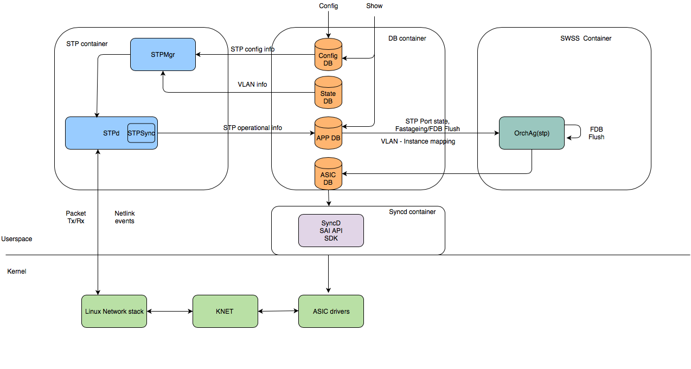
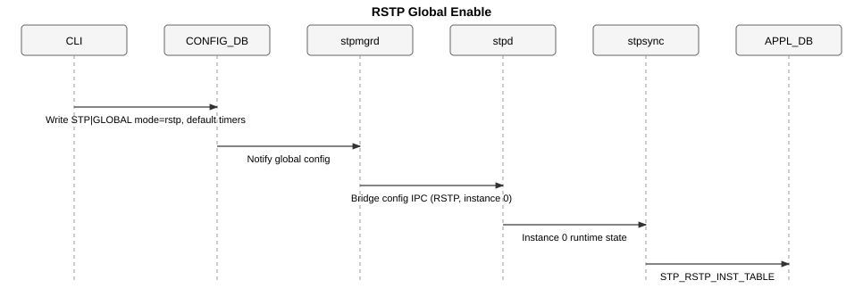
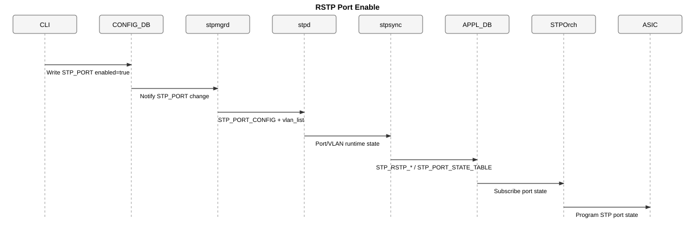
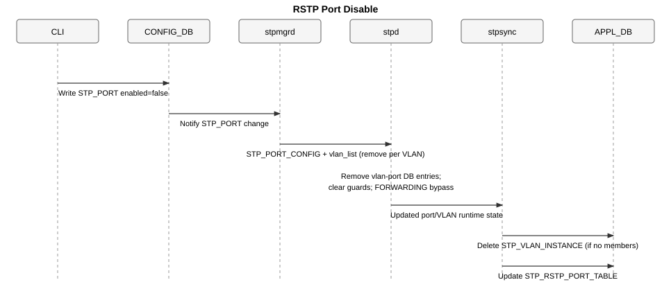
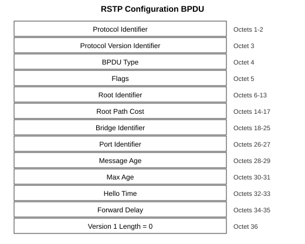
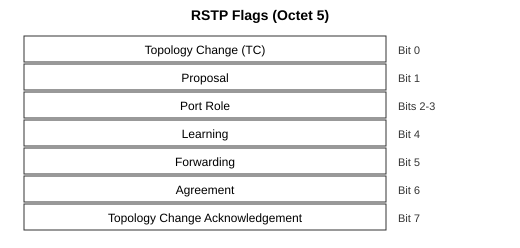
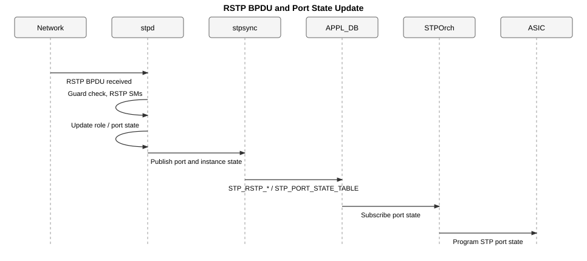
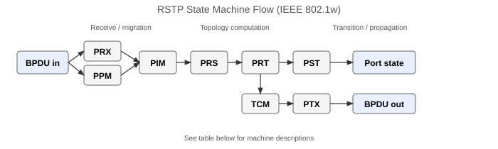
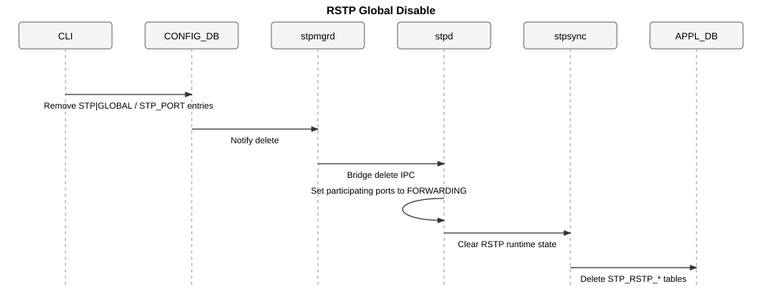

# RSTP (Rapid Spanning Tree Protocol) High-Level Design <!-- omit in toc -->

## Table of Contents <!-- omit in toc -->

- [1. Revision](#1-revision)
- [2. Scope](#2-scope)
- [3. Definitions/Abbreviations](#3-definitionsabbreviations)
- [4. Overview](#4-overview)
- [5. Requirements](#5-requirements)
- [6. Architecture Design](#6-architecture-design)
- [7. High-Level Design](#7-high-level-design)
  - [7.1. Enable sequence](#71-enable-sequence)
  - [7.2. Port enable sequence](#72-port-enable-sequence)
  - [7.3. Port disable sequence](#73-port-disable-sequence)
  - [7.4. VLAN members and participation](#74-vlan-members-and-participation)
  - [7.5. RSTP BPDU format](#75-rstp-bpdu-format)
  - [7.6. BPDU processing](#76-bpdu-processing)
  - [7.7. RSTP state machines](#77-rstp-state-machines)
  - [7.8. Disable](#78-disable)
  - [7.9. APPL_DB](#79-appl_db)
- [8. SAI API](#8-sai-api)
- [9. Configuration and Management](#9-configuration-and-management)
  - [9.1. CLI/YANG Model Enhancements](#91-cliyang-model-enhancements)
  - [9.2. Config DB Enhancements](#92-config-db-enhancements)
  - [9.3. Configuration Examples](#93-configuration-examples)
- [10. Warmboot and Fastboot Design Impact](#10-warmboot-and-fastboot-design-impact)
- [11. Memory Consumption](#11-memory-consumption)
- [12. Restrictions/Limitations](#12-restrictionslimitations)
- [13. Testing Requirements/Design](#13-testing-requirementsdesign)
  - [13.1. Unit Test cases](#131-unit-test-cases)
  - [13.2. System Test cases](#132-system-test-cases)
- [14. Open/Action Items](#14-openaction-items)

## 1. Revision

| Rev | Date       | Author      | Change Description                                      |
| --- | ---------- | ----------- | ------------------------------------------------------- |
| 0.1 | 09/24/2026 | Yash Pandit | Dedicated IEEE 802.1w RSTP mode for the SONiC STP stack |

## 2. Scope

This HLD adds dedicated RSTP mode to the existing SONiC spanning-tree stack. The scope covers:

- A new `rstp/` module in `stpd` (IEEE 802.1w state machines, one spanning-tree instance).
- `stpd` IPC handling for `L2_RSTP` on bridge, port, and VLAN-member messages.
- `stpsync` export of RSTP runtime state to APPL_DB.
- `stpmgrd` handling of `mode=rstp` and VLAN-to-instance-0 mapping.
- YANG `mode` value `rstp`, with `edge_port` / `link_type` allowed in RSTP mode.
- Config and show CLI for RSTP enable/disable and RSTP operational output.

Existing spanning-tree CONFIG_DB tables (`STP|GLOBAL`, `STP_PORT`) are reused.

## 3. Definitions/Abbreviations

| Term | Definition |
|------|------------|
| RSTP | Rapid Spanning Tree Protocol (IEEE 802.1w); one spanning tree for all VLANs |
| PVST | Per-VLAN Spanning Tree |
| MSTP | Multiple Spanning Tree Protocol |
| BPDU | Bridge Protocol Data Unit |
| `stpd` | Spanning-tree daemon in the STP container |
| `stpmgrd` | CONFIG_DB consumer in SWSS that sends IPC messages to `stpd` |
| `stpsync` | `stpd` component that writes spanning-tree operational data to APPL_DB |
| PRX/PPM/PIM/PRS/PRT/PST/TCM/PTX | IEEE 802.1w per-port state machines |

## 4. Overview

Rapid Spanning Tree Protocol (IEEE 802.1w) prevents Layer 2 loops and reconverges faster than classic STP. One spanning tree covers all VLANs on the bridge.

Typical uses:

- Join an existing RSTP domain with standard IEEE BPDUs.
- Match non-SONiC neighbors that run a single shared tree.
- Apply one global spanning-tree configuration so all VLANs follow the same topology.
- Interoperate with classic STP (IEEE 802.1D) neighbors on a per-port basis via protocol migration.

## 5. Requirements

1. `config spanning-tree enable rstp` sets `STP|GLOBAL|mode=rstp` and default bridge timers/priority. Per-port STP (`STP_PORT`) is added only via `config spanning-tree interface enable <ifname>` after global RSTP is enabled.
2. `config spanning-tree disable rstp` stops RSTP and removes spanning-tree configuration written by enable.
3. `stpd` processes IEEE spanning-tree BPDUs (RSTP and classic STP) on enabled ports when RSTP mode is active.
4. RSTP interoperates with classic STP neighbors per IEEE 802.1w protocol migration (PPM). Ports attached to STP-only peers send and process STP-format BPDUs until the peer speaks RSTP.
5. VLAN member add/remove updates RSTP port participation in instance 0.
6. A VLAN member on an STP-disabled or admin-disabled port is placed in FORWARDING for that VLAN without RSTP participation.
7. `show spanning-tree` displays RSTP summary when `mode=rstp`.
8. `show spanning-tree rstp` displays bridge, port role/state, designated vectors, and BPDU counters from APPL_DB.

## 6. Architecture Design

No SONiC macro-architecture change is introduced.

RSTP uses the spanning-tree layout in [SONiC_PVST_HLD.md](SONiC_PVST_HLD.md) and [MSTP.md](../MSTP/MSTP.md).



__Figure 1: High level architecture__

### Changes for `mode=rstp`

| Component | Change for `mode=rstp` |
|-----------|------------------------|
| `stpmgrd` | `mode=rstp` → `L2_RSTP`; all VLANs → instance 0; IPC on bridge/port/VLAN-member |
| `stpd` / `rstp/` | New RSTP protocol module; IPC handling for bridge, port, and VLAN-member messages |
| `stpsync` | APPL_DB producers: `STP_RSTP_INST_TABLE`, `STP_RSTP_PORT_TABLE` |
| CONFIG_DB | Allowed `STP\|GLOBAL` value: `mode=rstp` |
| Show CLI | `show spanning-tree rstp` subtree backed by RSTP APPL_DB tables |

Repositories: `sonic-stp`, `sonic-swss` (`stpmgrd` / `STPOrch`), `sonic-yang-models`, `sonic-utilities`.

## 7. High-Level Design

This is a built-in SONiC feature in the STP container. It does not change SAI.

### 7.1. Enable sequence



__Figure 2: Global RSTP enable__

1. Operator configures VLANs and VLAN members (before or after RSTP).
2. Operator runs `config spanning-tree enable rstp`; CLI writes `STP|GLOBAL` (`mode=rstp`) with default bridge timers and priority.
3. `stpmgrd` reads CONFIG_DB, selects RSTP mode (instance 0), and sends bridge config IPC to `stpd`.
4. `stpd` starts the RSTP module for instance 0 and applies global timers and bridge priority.
5. `stpsync` mirrors bridge runtime state to `STP_RSTP_INST_TABLE`.

Global enable does not create `STP_PORT` entries.

### 7.2. Port enable sequence



__Figure 3: RSTP port enable__

1. Operator runs `config spanning-tree interface enable <ifname>`; CLI writes `STP_PORT|enabled=true` (global RSTP must already be enabled).
2. `stpmgrd` builds `STP_PORT_CONFIG` with the port's VLAN list from `STATE_VLAN_MEMBER` and sends it to `stpd`.
3. `stpd` adds the port to the RSTP control set, applies edge port / link-type / root guard / BPDU guard from CONFIG, and maps the port's VLANs to instance 0.
4. `stpsync` updates `STP_VLAN_INSTANCE_TABLE`, `STP_RSTP_PORT_TABLE`, and `STP_PORT_STATE_TABLE` in APPL_DB.
5. `STPOrch` programs the port STP state in the ASIC from `STP_PORT_STATE_TABLE`.

### 7.3. Port disable sequence



__Figure 4: RSTP port disable__

1. Operator runs `config spanning-tree interface disable <ifname>`; CLI writes `STP_PORT|enabled=false`.
2. `stpmgrd` sends `STP_PORT_CONFIG` with the port's VLAN list to `stpd`.
3. `stpd` removes each VLAN mapping for the port, deletes `STP_VLAN_INSTANCE_TABLE` entries when no STP-participating members remain on that VLAN, disables root guard and BPDU guard on the port, and removes the port from the control set.
4. `stpsync` updates APPL_DB; `STPOrch` places VLANs on the port in FORWARDING (RSTP bypass).

### 7.4. VLAN members and participation

RSTP runs a single spanning tree for all VLANs (instance 0). Per-VLAN STP enable/disable is not supported in RSTP mode.

- VLAN member add (port STP-enabled): `stpmgrd` sends vlan-member IPC; port/VLAN joins instance 0.
- VLAN member add (port STP-disabled): that VLAN/port is placed in FORWARDING (RSTP bypass).
- VLAN member remove: the port drops from the instance when it has no remaining VLANs; unreferenced VLAN mappings are removed from APPL_DB.

Show **Vlans mapped** lists VLANs in `STP_VLAN_INSTANCE_TABLE` that have at least one STP-enabled L2 member port programmed in `stpd`.

### 7.5. RSTP BPDU format

SONiC RSTP mode exchanges standard IEEE 802.1w spanning-tree BPDUs on untagged Ethernet frames:

- Destination MAC: `01:80:C2:00:00:00` (Bridge Group Address).
- LLC header: DSAP `0x42`, SSAP `0x42`, Control `0x03`.
- RSTP Configuration BPDU: protocol version `2`, BPDU type `0x02` (36 octets after the LLC header).

When a port is attached to a classic STP neighbor, the Protocol Migration (PPM) state machine may send Configuration BPDUs with protocol version `0` and BPDU type `0x00` until the peer speaks RSTP. TCN BPDUs (type `0x80`) are also accepted on classic STP links.

<div align="center">

<p>Figure 5: RSTP Configuration BPDU format</p>
</div><br>
<div align="center">

<p>Figure 6: RSTP flags (octet 5)</p>
</div>

| Field | Value / notes |
|-------|----------------|
| Protocol Identifier | `0x0000` |
| Protocol Version Identifier | `2` (RSTP); `0` when sending classic STP Configuration BPDU |
| BPDU Type | `0x02` (RSTP Configuration BPDU); `0x00` (Configuration); `0x80` (TCN) |
| Flags | Proposal, Agreement, Learning, Forwarding, Port Role, TC, TC Ack (see Figure 6) |
| Root / Bridge Identifier | 8 octets: 4-bit priority, 12-bit system ID extension, 6-byte MAC |
| Port Identifier | 4-bit priority, 12-bit port number |
| Timers | Message Age, Max Age, Hello Time, Forward Delay (1/256 second units) |
| Version 1 Length | `0` (no Version 1 parameters) |

Refer to [IEEE 802.1w](https://standards.ieee.org/ieee/802.1w/1046/) for RSTP BPDU details.

### 7.6. BPDU processing



__Figure 7: RSTP port state update__

1. `stpd` receives a BPDU on the packet socket; port guard features are evaluated first.
2. Valid IEEE spanning-tree BPDUs are accepted: RSTP BPDUs (protocol version 2) and classic STP Configuration/TCN BPDUs (protocol version 0).
3. The Protocol Migration (PPM) state machine detects whether the peer speaks RSTP or classic STP and selects the BPDU format transmitted on that port.
4. BPDU contents drive the remaining state machines. Ports on classic STP neighbors use STP timing; RSTP-capable links use rapid transition.
5. `stpsync` publishes updated port roles and states to `STP_RSTP_PORT_TABLE` and `STP_PORT_STATE_TABLE`; `STPOrch` applies port state from `STP_PORT_STATE_TABLE`.

### 7.7. RSTP state machines

RSTP protocol logic in `stpd` follows the IEEE 802.1w per-port state machines (implementation under `src/sonic-stp/rstp/`).



__Figure 8: RSTP state machine flow__

| Machine | Function |
|---------|----------|
| PRX (Receive) | Parse and validate an incoming BPDU |
| PPM (Protocol migration) | Detect whether the peer speaks STP or RSTP |
| PIM (Port information) | Update port priority, path cost, and timer fields from the BPDU |
| PRS (Role selection) | Select root, designated, alternate, and backup roles |
| PRT (Role transition) | Apply a role change on the port |
| PST (Port state) | Transition the port among discarding, learning, and forwarding |
| TCM (Topology change) | Propagate topology-change notification |
| PTX (Transmit) | Transmit BPDUs on the port |

**Port roles** (`STP_RSTP_PORT_TABLE|role`):

| Role | Meaning |
|------|---------|
| ROOT | Best path to the root bridge on this switch |
| DESIGNATED | Forwarding port for the attached LAN segment |
| ALTERNATE | Backup path toward the root; blocks forwarding to avoid loops |
| BACKUP | Backup designated port on a shared LAN segment |
| DISABLED | Port not participating in RSTP |

**Port states** (`STP_RSTP_PORT_TABLE|port_state`):

| State | Meaning |
|-------|---------|
| DISABLED | Spanning tree disabled on the port |
| DISCARDING | Does not forward user traffic; may still receive BPDUs |
| LEARNING | Learns source MAC addresses; does not forward user traffic |
| FORWARDING | Forwards user traffic |
| ROOT-INC | Root-guard inconsistency (restrictedRole Alternate in DISCARDING) |

### 7.8. Disable



__Figure 9: Global RSTP disable__

On `config spanning-tree disable rstp`, CONFIG_DB entries are removed; `stpmgrd` notifies `stpd`; participating ports are returned to FORWARDING; RSTP instance and port APPL_DB tables are deleted.

### 7.9. APPL_DB

`stpsync` produces the following RSTP operational tables.

#### STP_RSTP_INST_TABLE

```
;Stores RSTP instance operational details (single instance 0)
key                   = STP_RSTP_INST_TABLE:0
vlan@                 = vlan_id-or-range[,vlan_id-or-range]     ; stpd-maintained VLAN mask (informational); show uses STP_VLAN_INSTANCE_TABLE
bridge_address        = 16HEXDIG                                ; local bridge address
root_address          = 16HEXDIG                                ; root bridge address
root_port             = ifName                                  ; root port name
root_path_cost        = 1*9DIGIT                                ; root path cost
root_hello_time       = 1*2DIGIT                                ; hello time from root bridge (1 to 10 sec, DEF:2 sec)
root_forward_delay    = 1*2DIGIT                                ; forward delay from root bridge (4 to 30 sec, DEF:15 sec)
root_max_age          = 1*2DIGIT                                ; max age from root bridge (6 to 40 sec, DEF:20 sec)
hold_time             = 1*2DIGIT                                ; transmit hold count (Txholdcount)
bridge_priority       = 1*5DIGIT                                ; local bridge priority
```

#### STP_RSTP_PORT_TABLE

```
;Stores RSTP per-port operational details
key                   = STP_RSTP_PORT_TABLE:ifname
port_number           = 1*4DIGIT                                ; port number of bridge port
priority              = 3*DIGIT                                 ; port priority (0 to 240, DEF:128)
path_cost             = 1*9DIGIT                                ; port path cost (1 to 200000000)
port_state            = "state"                                 ; DISABLED/DISCARDING/LEARNING/FORWARDING/ROOT-INC
role                  = "role"                                  ; DESIGNATED/ROOT/ALTERNATE/BACKUP/DISABLED
desig_cost            = 1*9DIGIT                                ; designated root path cost (802.1w RPC)
desig_root            = 16HEXDIG                                ; designated root
desig_bridge          = 16HEXDIG                                ; designated bridge
desig_port            = 1*4DIGIT                                ; designated port
fwd_transitions       = 1*5DIGIT                                ; number of forward transitions
bpdu_sent             = 1*10DIGIT                               ; BPDUs transmitted
bpdu_received         = 1*10DIGIT                               ; BPDUs received
rem_time              = 1*3DIGIT                                ; remaining time (protocol timer)
```

Existing APPL_DB tables reused: `STP_PORT_STATE_TABLE`, `STP_VLAN_INSTANCE_TABLE`, `STP_FASTAGEING_FLUSH_TABLE`.

## 8. SAI API

No SAI API changes. `STPOrch` programs port state from `STP_PORT_STATE_TABLE` using the existing STP SAI objects.

## 9. Configuration and Management

### 9.1. CLI/YANG Model Enhancements

`sonic-spanning-tree.yang` `STP|GLOBAL` `mode` includes `rstp`:

```yang
leaf mode {
    type enumeration {
        enum pvst {
            description
                "Per VLAN Spanning Tree Mode";
        }
        enum rstp {
            description
                "Rapid Spanning Tree Mode";
        }
        enum mst {
            description
                "Multiple Spanning Tree Mode";
        }
    }
    mandatory true;
    description
        "STP operating mode";
}
```

`edge_port` and `link_type` `must` clauses under `STP_PORT` allow `mode='rstp'`.

#### Config CLI

- **config spanning-tree {enable|disable} rstp**
  - Enables or disables RSTP globally.
  - On enable, writes `STP|GLOBAL|mode=rstp` with default bridge timers and priority.
  - On disable, removes RSTP global configuration and `STP_PORT` entries.
  - Disabled by default.

- **config spanning-tree interface {enable|disable} \<ifname\>**
  - Enables or disables RSTP on a port. Requires global RSTP to be enabled first.
  - On enable, `stpmgrd` sends `STP_PORT_CONFIG` with the port's VLAN list.
  - On disable, VLAN mappings for that port are removed; APPL_DB VLAN instance entries are cleaned up when no STP-participating members remain.

Existing spanning-tree CLI for hello-time, max-age, forward-delay, priority, interface cost/priority, edge port, link type, root guard, and BPDU guard apply in RSTP mode.

#### Show CLI

- **show spanning-tree rstp** — primary RSTP operational view (same summary as `show spanning-tree` when `mode=rstp`).

```
admin@sonic: show spanning-tree rstp

Spanning-tree Mode: RSTP

#######  RSTP (instance 0)       Vlans mapped : 10, 20
Bridge               Address 1000.022c.9569.5468
Root                 Address 1000.022c.9569.5468
                     Port Root    Root    Path cost 0
Operational          Hello Time 2, Forward Delay 15, Max Age 20, Txholdcount 6
Configured           Hello Time 2, Forward Delay 15, Max Age 20

Interface          Role         State           Cost       Prio.Nbr    Type
---------------    --------     ----------      -------    ---------   -----------
Ethernet0          DESIGNATED   FORWARDING      1          128.0       Auto
Ethernet16         DESIGNATED   FORWARDING      1          128.16      Auto
```

- **show spanning-tree brief** — root/bridge summary when `mode=rstp`.

```
admin@sonic: show spanning-tree brief

Spanning-tree Mode: RSTP
Root bridge: 1000.022c.9569.5468
Bridge: 1000.022c.9569.5468
Root port: Root
Root path cost: 0
```

- **show spanning-tree rstp interface** \<ifname\>

```
admin@sonic: show spanning-tree rstp interface Ethernet0

Link Type: Auto        Bpdu filter: False
Bpdu guard:  False

Instance           Role         State           Cost       Prio.Nbr     Vlans
---------------    --------     ----------      -------    ---------    -----------
0                  DESIGNATED   FORWARDING      1          128.0        10, 20

Port        Prio   Path   Edge   State         Role     Designated Designated          Designated
Num         rity   Cost   Port                             Cost     Root                Bridge
Ethernet0   128    1      N      FORWARDING    DESIGNATED  0        1000.022c.9569.5468 1000.022c.9569.5468
```

### 9.2. Config DB Enhancements

| Table | Change |
|-------|--------|
| `STP\|GLOBAL` | Allowed value `mode=rstp`. On enable, CLI also writes default `forward_delay`, `hello_time`, `max_age`, `priority`. |

No new CONFIG_DB tables. `STP_PORT` entries are created only by `config spanning-tree interface enable`.

### 9.3. Configuration Examples

```bash
config vlan add 10
config vlan add 20
config vlan member add 10 Ethernet0
config vlan member add 20 Ethernet0
config spanning-tree enable rstp
config spanning-tree interface enable Ethernet0
show spanning-tree rstp
```

## 10. Warmboot and Fastboot Design Impact

Warm boot is not supported. IEEE 802.1w has no method to restore spanning-tree state across a warm reboot without risking a loop. Use a cold reboot with RSTP still enabled so neighbors reconverge on link down.

Fastboot is not supported for the same reason.

### Warmboot and Fastboot Performance Impact

No additional CPU/IO cost in the boot-critical chain.

## 11. Memory Consumption

When RSTP is disabled, no RSTP instance is allocated. When enabled, RSTP allocates per-port structures for a single instance. Impact is O(max_stp_port) inside `stpd`.

## 12. Restrictions/Limitations

- RSTP cannot run concurrently with PVST or MSTP on the same switch. `STP|GLOBAL|mode` is a single value (`pvst`, `rstp`, or `mst`).
- Per-VLAN spanning-tree enable/disable is not supported in RSTP mode.

## 13. Testing Requirements/Design

Warm boot is not in the test matrix. Config reload after `config save` is covered as a cold-path persistence case.

### 13.1. Unit Test cases

CLI:

1. Verify CLI to enable RSTP globally.
2. Verify CLI to disable RSTP globally.
3. Verify CLI to enable spanning-tree on an interface (after global RSTP enable).
4. Verify CLI to disable spanning-tree on an interface.
5. Verify CLI to set bridge priority, hello-time, forward-delay, and max-age.
6. Verify CLI to set interface path cost and port priority.
7. Verify CLI to set and clear edge port.
8. Verify CLI to set link type (point-to-point, auto).
9. Verify CLI to set and clear root guard.
10. Verify CLI to set and clear BPDU guard (with and without shutdown).
11. Verify CLI to display spanning-tree running configuration.
12. Verify CLI to display RSTP state (`show spanning-tree`, `show spanning-tree rstp`, `show spanning-tree brief`, `show spanning-tree rstp interface`).
13. Verify CLI to display and clear spanning-tree statistics.
14. Verify that enabling RSTP is rejected while PVST or MSTP is already enabled, and the reverse.

CONFIG_DB / YANG:

1. Verify CONFIG_DB is populated with configured RSTP values (`mode=rstp`, timers, priority).
2. Verify global enable does not create `STP_PORT` until interface enable.
3. Verify YANG accepts `mode=rstp` and allows `edge_port` / `link_type` in RSTP mode.
4. Verify out-of-range timer, priority, cost, and invalid mode values are rejected with CONFIG_DB unchanged.

### 13.2. System Test cases

Enable, programming, and VLAN mapping:

1. Verify VLAN members may exist before global RSTP; per-port enable/disable updates APPL_DB; a disabled port's VLANs are FORWARDING (RSTP bypass).
2. Verify show Vlans mapped matches APPL_DB instance-0 VLANs and lists only VLANs with at least one STP-enabled L2 member.
3. Verify global RSTP disable removes STP config and APPL_DB RSTP tables and returns participating ports to FORWARDING.
4. Verify multiple VLANs, including a native (untagged) VLAN, share instance 0 and the same port role/state.

Root election and port roles:

5. With no superior peer, verify the DUT is root, both loop ports are Designated/Forwarding, and L2 frames forward.
6. With a superior peer, verify the DUT elects one Root/Forwarding port and one Alternate/Discarding port; frames and MAC learning follow port state.
7. Verify root follows the better bridge priority and that lowering DUT priority reclaims root.
8. With equal path cost, verify Root vs Alternate is deterministic by port id (lower id Root/Forwarding, higher id Alternate/Discarding).
9. Verify the Alternate port takes over when the Root port is shut, and that roles restore when the original Root port is started.
10. Verify a self-loop (DUT receives its own BPDU on a second port) elects Backup/Discarding, not Alternate, and restores Designated/Forwarding when the self-loop stops.

Path cost and port priority:

11. Verify raising path cost on the current Root port migrates Root to the lower-cost port; exactly one Root port throughout.
12. Verify a better advertised port priority toward the Alternate moves the Root port without changing cost or root bridge ID.
13. Verify configured port cost is advertised as root path cost on a Designated port and matches APPL_DB designated cost.

Timers, edge port, link type, and guards:

14. Verify hello-time, forward-delay, and max-age changes appear in show and captured BPDUs (1/256 second units).
15. Verify an edge port forwards immediately with operEdge set, and that receiving a BPDU clears operEdge.
16. Verify `link_type` point-to-point and auto are operationally P2P.
17. Verify root guard places the port in ROOT-INC/Discarding on a superior BPDU and restores a valid role after the superior BPDU stops, without disabling root guard.
18. Verify BPDU guard with shutdown admin-downs the port and logs a violation.
19. Verify BPDU guard without shutdown drops the BPDU, logs a one-time warning, and does not change the tree.

BPDU format and topology change:

20. Verify DUT-originated BPDUs are untagged IEEE 802.1w (dest `01:80:c2:00:00:00`, LLC 0x42/0x42/0x03, version 2, type 0x02, Version 1 Length 0, 36 octets after LLC).
21. Verify TX/RX BPDU counters increment in show and APPL_DB.
22. Verify a non-root Designated port advertises nonzero root path cost and Message Age.
23. Verify bridge ID and BPDU source MAC match the device base MAC.
24. Verify a TC-flagged RSTP BPDU flushes FDB entries for the affected VLANs in ASIC_DB and the kernel bridge FDB.

Persistence:

25. Verify RSTP config and roles rebuild after STP container restart.
26. Verify non-default timers, priority, and interface cost survive `config save` and `config reload` and reconverge.

Robustness:

27. Verify malformed/short frames are dropped without crashing `stpd`; tree state unchanged.

Interoperability with legacy STP:

28. Verify receiving only 802.1D Config BPDUs migrates DUT TX to STP format (version 0, type 0x00) while Config/TCN RX is still accepted.
29. Verify RSTP BPDUs after STP-format migration restore version-2 TX.
30. Verify a TCN from an STP peer triggers topology-change handling.

VLAN churn and flood containment:

31. Verify removing all RSTP VLANs from a port drops it from instance 0; re-adding restores it; the tree stays loop-free.
32. Verify deleting a VLAN member on a Discarding port does not crash `stpd` and does not create a loop.
33. Verify broadcast/unknown flood is bounded on the Alternate port (no L2 storm).

LAG, L3, SAI:

34. Verify RSTP behavior over LAG; BPDU is sent from one LAG member; adding or deleting a LAG member does not flap the protocol.
35. Verify adding and deleting a LAG as a VLAN member with RSTP enabled.
36. Verify L3 forwarding follows RSTP port state (forwards on Root/Designated, dropped on Alternate).
37. Verify `STPOrch` programs instance-0 port state on existing SAI STP objects when roles and states change.

## 14. Open/Action Items

None.
