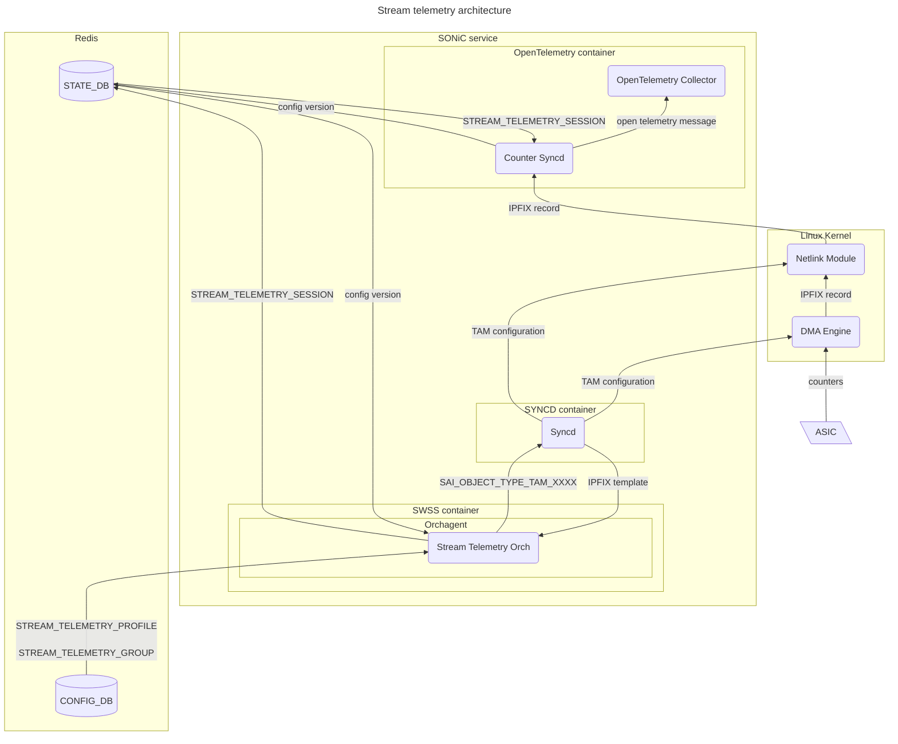
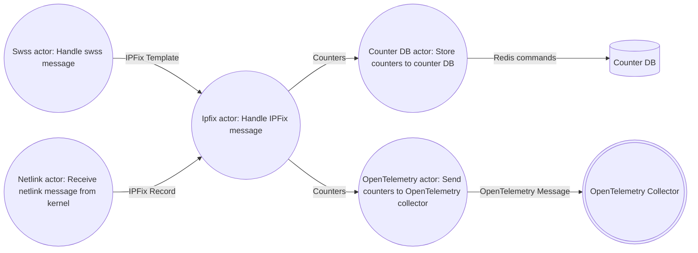
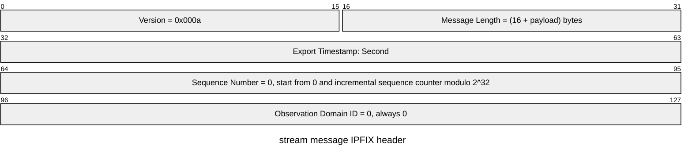
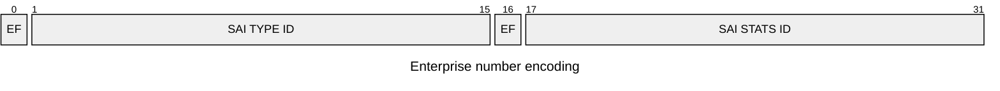
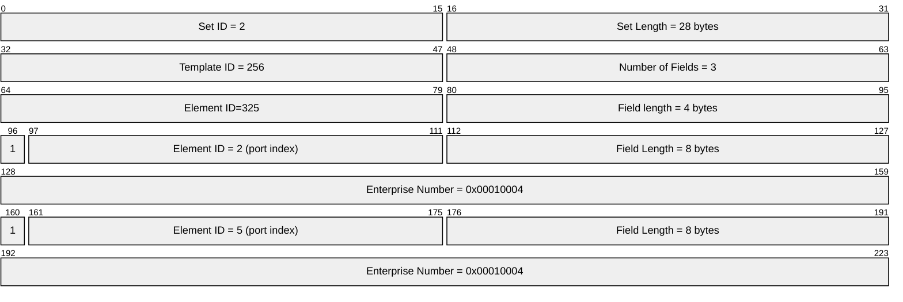
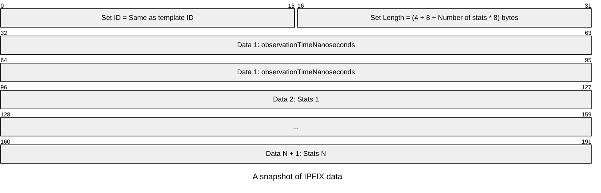
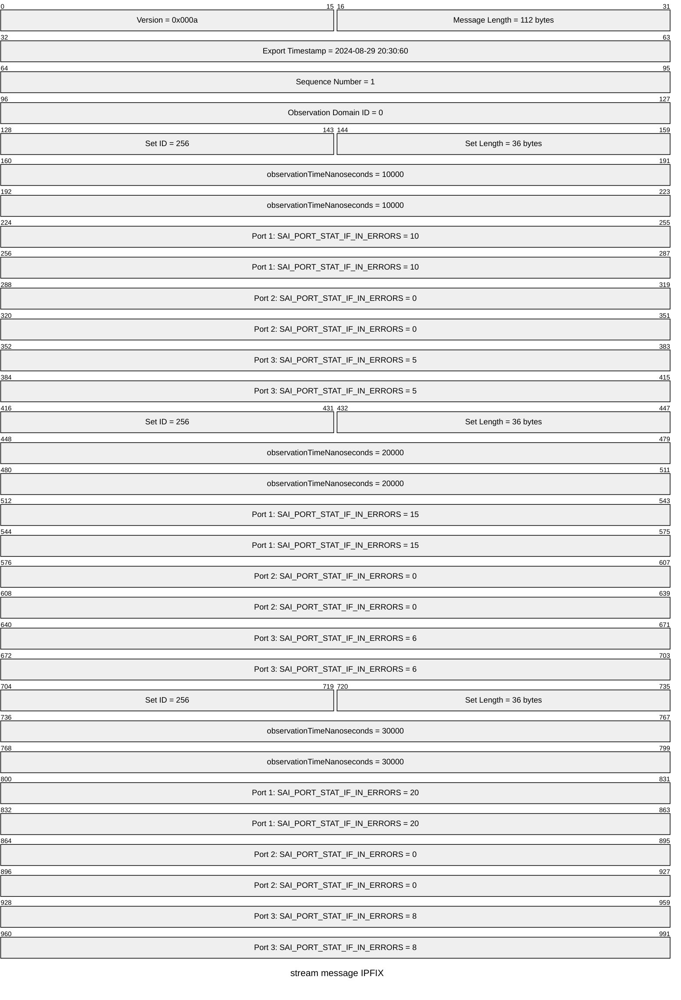
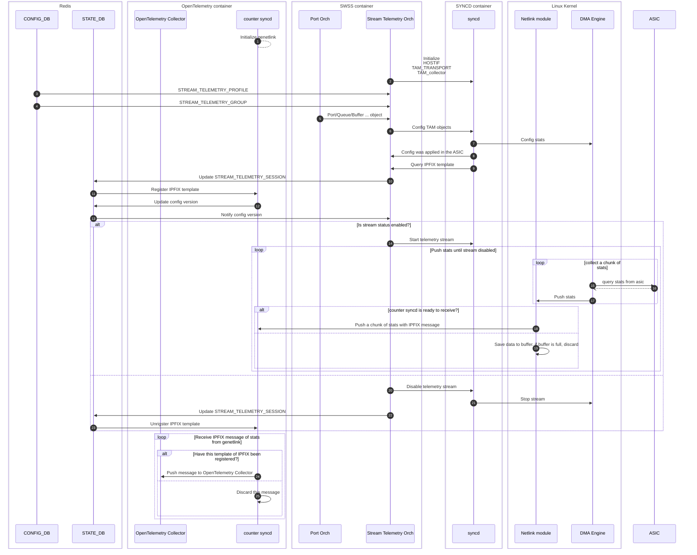

# Stream telemetry high level design <!-- omit in toc -->

## Table of Content <!-- omit in toc -->

- [Revision](#revision)
- [Scope](#scope)
- [Definitions/Abbreviations](#definitionsabbreviations)
- [Overview](#overview)
- [Requirements / Constraints](#requirements--constraints)
  - [Phase 1](#phase-1)
  - [Phase 2](#phase-2)
- [Architecture Design](#architecture-design)
- [High-Level Design](#high-level-design)
  - [Modules](#modules)
    - [Counter Syncd](#counter-syncd)
    - [Stream Telemetry Orch](#stream-telemetry-orch)
    - [Netlink Module and DMA Engine](#netlink-module-and-dma-engine)
  - [Data format](#data-format)
    - [IPFIX header](#ipfix-header)
    - [IPFIX template](#ipfix-template)
    - [IPFIX data](#ipfix-data)
    - [Netlink message](#netlink-message)
  - [Bandwidth Estimation](#bandwidth-estimation)
  - [Config DB](#config-db)
    - [DEVICE\_METADATA](#device_metadata)
    - [STREAM\_TELEMETRY\_PROFILE](#stream_telemetry_profile)
    - [STREAM\_TELEMETRY\_GROUP](#stream_telemetry_group)
  - [StateDb](#statedb)
    - [STREAM\_TELEMETRY\_SESSION](#stream_telemetry_session)
    - [STREAM\_TELEMETRY\_SESSION (deprecated)](#stream_telemetry_session-deprecated)
  - [Work Flow](#work-flow)
  - [SAI API](#sai-api)
- [Configuration and management](#configuration-and-management)
  - [Manifest (if the feature is an Application Extension)](#manifest-if-the-feature-is-an-application-extension)
  - [CLI/YANG model Enhancements](#cliyang-model-enhancements)
    - [Config CLI](#config-cli)
    - [Inspect stream CLI](#inspect-stream-cli)
    - [YANG](#yang)
  - [Config DB Enhancements](#config-db-enhancements)
  - [Warmboot and Fastboot Design Impact](#warmboot-and-fastboot-design-impact)
  - [Memory Consumption](#memory-consumption)
  - [Restrictions/Limitations](#restrictionslimitations)
  - [Testing Requirements/Design](#testing-requirementsdesign)
    - [Unit Test cases](#unit-test-cases)
    - [System Test cases](#system-test-cases)
  - [Open/Action items - if any](#openaction-items---if-any)

## Revision

| Rev | Date       | Author | Change Description |
| --- | ---------- | ------ | ------------------ |
| 0.1 | 09/06/2024 | Ze Gan | Initial version    |

## Scope

This document outlines the high-level design of stream telemetry, focusing primarily on the internal aspects of SONiC rather than external telemetry systems.

## Definitions/Abbreviations

| Abbreviation | Description                               |
| ------------ | ----------------------------------------- |
| SAI          | The Switch Abstraction Interface          |
| IPFIX        | Internet Protocol Flow Information Export |
| TAM          | Telemetry and Monitoring                  |
| BW           | Bandwidth                                 |

## Overview

The existing telemetry solution of SONiC relies on the syncd process to proactively query stats and counters via the SAI API. This approach causes the syncd process to spend excessive time on SAI communication. The stream telemetry described in this document aims to provide a more efficient method for collecting object stats. The main idea is that selected stats will be proactively pushed from the vendor's driver to the collector via netlink.

## Requirements / Constraints

### Phase 1

- The number of SAI object types should not exceed 32,768 ($2^{15}$). This means the value of SAI_OBJECT_TYPE_MAX should be less than 32,768.
- The number of SAI object extension types should not exceed 32,768.
- The number of stats types for a single SAI object type should not exceed 32,768.
- The number of extension stats types for a single SAI object type should not exceed 32,768.
- The number of SAI objects of the same type should not exceed 32,768.
- The vendor SDK should support publishing stats in IPFIX format and its IPFIX template.
- If a polling frequency for stats cannot be supported, the vendor's SDK should return this error.
- The vendor SDK should support querying the minimal polling interval for each counter.
- When reconfiguring any stream settings, whether it is the polling interval or the stats list, the existing stream will be interrupted and regenerated.
- If any of monitored objects is deleted, the existing stream will be interrupted and regenerated.

### Phase 2

- Supports updating configuration without interrupting the telemetry stream

## Architecture Design



## High-Level Design

### Modules

#### Counter Syncd

The `counter syncd` is a new module that runs within the OpenTelemetry container. Its primary responsibility is to receive counter messages via netlink and convert them into open telemetry messages for a collector. It subscribes to a socket of a specific family and multicast group of generic netlink. The configuration for generic netlink is defined as constants in `/etc/sonic/constants.yml` as follows.

``` yaml
constants:
    stream_telemetry:
        genl_family: "sonic_stel"
        genl_multicast_group: "ipfix"
}

```

- Architecture for CounterSyncd:



#### Stream Telemetry Orch

The `Stream Telemetry Orch` is a new object within the Orchagent. It has following primary duties:

1. Maintain the TAM SAI objects according to the stream telemetry configuration in the config DB.
2. Generate a unique template ID for each stream telemetry profile to ensure distinct identification and management.
3. Register and activate streams on counter syncd.

`Stream Telemetry Orch` leverages `tam_counter_subscription` objects to bind monitoring objects, such as ports, buffers, or queues, to streams. Therefore, this orch must ensure that the lifecycle of `tam_counter_subscription` objects is within the lifecycle of their respective monitoring objects.

#### Netlink Module and DMA Engine

These two modules need to be provided by vendors. This document proposes a ring buffer communication model to support all expected TAM configurations as follows.


### Data format

We will use IPFIX as the report format, with all numbers in the IPFIX message in network-order (Big-endian).

For more information on IPFIX, refer to the following resources:

- [Specification of the IP Flow Information Export (IPFIX) Protocol for the Exchange of Flow Information](https://datatracker.ietf.org/doc/html/rfc7011)
- [IP Flow Information Export (IPFIX) Entities](https://www.iana.org/assignments/ipfix/ipfix.xhtml)

#### IPFIX header

The `Version` and `Observation Domain ID` fields of the IPFIX header are identical for each IPFIX message.



#### IPFIX template


- For high-frequency counters, the native IPFIX timestamp unit of seconds is insufficient. Therefore, we introduce an additional element, `observationTimeNanoseconds`, for each record to meet our requirements.
- The element ID of IPFIX is derived from the object index. For example, for `Ethernet5`, the element ID will be `0x5 | 0x8000 = 0x8005`, where `0x8000` indicates that the enterprise bit is set to 1.
- The enterprise number is derived from the combination of the [SAI_OBJECT_TYPE](https://github.com/opencomputeproject/SAI/blob/master/inc/saitypes.h) and its corresponding stats ID. The high bits are used to indicate the SAI extension flag. For example, for `SAI_QUEUE_STAT_WRED_ECN_MARKED_PACKETS=0x00000022` of `SAI_OBJECT_TYPE_QUEUE=0x00000015`, the enterprise number will be `0x00000022 << 16 | 0x00000015 = 0x00220015`.



**EF is the extension flag: If this type or stat is an SAI extension, it should be set to 1.**

For example, if the switch has 8 ports, but we only want to get the `SAI_PORT_STAT_IF_IN_ERRORS = 0x00000004` of `SAI_OBJECT_TYPE_PORT = 0x00000001` on Ethernet2 and Ethernet5, the template will look like this:



#### IPFIX data

An IPFIX data message consists of snapshots that is a binary block that can be interpreted using the IPFIX template mentioned above.

The binary structure of a snapshot is as follows:



- The snapshot structure is derived from the IPFIX template, which is based on the stats we want to record.

Below is an example of an IPFIX message with 3 snapshots for the same stats record as the IPFIX template example:



- If the number of stats in a group is small, multiple snapshots may be encoded into a single IPFIX message.
- If the number of stats in a group exceeds 8K, the group must be split across multiple IPFIX messages.

The IPFIX template should be provided by vendors. This document does not restrict how to split or concatenate snapshots, but each separated snapshot must include its own `observationTimeNanoseconds`.

#### Netlink message

We expect all control messages and out-of-band information to be transmitted by the SAI. Therefore, it is unnecessary to read the attribute header of netlink and the message header of Genetlink from the socket. Instead, we can insert a bulk of IPFIX recordings as the payload of the netlink message. The sample code for building the message from the kernel side is as follows:

``` c

struct genl_multicast_group stel_mcgrps[] = {
    { .name = "ipfix" },
};

// Family definition
static struct genl_family stel_family = {
    .name = "sonic_stel",
    .version = 1,
    // ...
    .mcgrps = stel_mcgrps,
    .n_mcgrps = ARRAY_SIZE(stel_mcgrps),
};


void send_msgs_to_user(/* ... */)
{
    struct sk_buff *skb_out = nlmsg_new(ipfix_msg_len, GFP_KERNEL);

    for (size_t i = 0; i < bulk_count; i++)
    {
        struct ipfix *msg = ring_buffer.pop();
        if (msg == NULL)
        {
            break;
        }
        nla_append(skb_out, msg->data, msg->len);
    }

    genlmsg_multicast(&stel_family, skb_out, 0, 0/* group_id to ipfix group */, GFP_KERNEL);
}

```

### Bandwidth Estimation

We estimate the bandwidth based only on the effective data size, not the actual data size. The extra information in a message, such as the IPFIX header (16 bytes), data prefix (4 bytes), and observation time milliseconds (8 bytes), is negligible. For example, a IPFIX message could include $The Maximal Number Of Counters In One Message = \frac{0xFFFF_{Max Length Bytes} - 16_{Header Bytes} - 4_{DataPrefix Bytes} - 8_{Observation Time Milliseconds Bytes}}{8_{bytes}} \approx 8188$, So $The Percentage Of Effective Data = \frac{0xFFFF_{Max Length Bytes} - 16_{Header Bytes} - 4_{DataPrefix Bytes} - 8_{Observation Time Milliseconds Bytes}} {0xFFFF_{Max LengthBytes}} \approx 99.9\%$ .

The following table is an example of telemetry bandwidth of one cluster

| # of stats per port | # of ports per switch | # of switch | frequency (us) | Total BW per switch(Mbps) | Total BW(Mbps) |
| ------------------- | --------------------- | ----------- | -------------- | ------------------------- | -------------- |
| 30                  | 64                    | 10,000      | 10             | 12,288                    | 122,880,000    |

- ${Total BW Per Switch} = \frac{{\verb|#| Of Stats Per Port} \times 8_{bytes} \times {\verb|#| Of Ports Per Switch} \times {Frequency} \times 1,000 \times 8}{1,000,000}$
- ${Total BM} = {Total BW Per Switch} \times {\verb|#| Of Switch}$

### Config DB

Any configuration changes in the config DB will interrupt the existing session and initiate a new one.

#### DEVICE_METADATA

```
DEVICE_METADATA|localhost
    "stream_telemetry_chunk_size": {{uint32}}
    "stream_telemetry_chunk_count": {{uint32}} (Optional)
```

```
; field                      = value
stream_telemetry_chunk_size  = uint32; reporting byte size of chunk under the stream telemetry.
stream_telemetry_chunk_count = uint32; chunk count under the stream telemetry. Some platforms may not support setting this value.
```

#### STREAM_TELEMETRY_PROFILE

```
STREAM_TELEMETRY_PROFILE|{{profile_name}}
    "stream_state": {{enabled/disabled}}
    "poll_interval": {{uint32}}
```

```
key                = STREAM_TELEMETRY_PROFILE:profile_name a string as the identifier of stream telemetry
; field            = value
stream_state       = enabled/disabled ; Enabled/Disabled stream.
poll_interval      = uint32 ; The interval to poll counter, unit microseconds.
```

#### STREAM_TELEMETRY_GROUP

```
STREAM_TELEMETRY_GROUP|{{profile_name}}|{{group_name}}
    "object_names": {{list of object name}}
    "object_counters": {{list of stats of object}}
```

```
key             = STREAM_TELEMETRY_GROUP:group_name:profile_name
                    ; group_name is the object type, like PORT, BUFFER_PG or BUFFER_POOL.
                    ; Multiple groups can be bound to a same stream telemetry profile.
; field         = value
object_names    = A list of object name.
                    ; The syntax of object name is top_object_name|index.
                    ; The object_name is the object of the top level, like port, Ethernet0,Ethernet4.
                    ; The index indicates the object in second level, like priority group.
                    ; An example is Ethernet0|0,Ethernet4|3.
object_counters = A list of stats of object;
```

For the schema of `STREAM_TELEMETRY_GROUP`, please refer to its [YANG model](sonic-stream-telemetry.yang).

### StateDb

#### STREAM_TELEMETRY_SESSION

```
STREAM_TELEMETRY_SESSION|{{profile_name}}|{{group_name}}
    "session_status": {{enabled/disabled}}
    "session_type": {{ipfix}}
    "session_config": {{binary array}}
    "config_version": {{uint32_t}}
```

```
key                 = STREAM_TELEMETRY_SESSION:profile_name ; a string as the identifier of stream telemetry
; field             = value
session_status      = enable/disable ; Enable/Disable stream.
session_type        = ipfix ; Specified the session type.
session_config      = binary array; 
                      If the session type is IPFIX, This field stores the IPFIX template to interpret the message of this session.
config_version      = uint32_t; Indicates which version is being used. The default value is 0.
                      This value will be increased once the new config was applied by CounterSyncd.
```

#### STREAM_TELEMETRY_SESSION (deprecated)

```
STREAM_TELEMETRY_SESSION|{{profile_name}}
    "session_status": {{enabled/disabled}}
    "session_type": {{ipfix}}
    "session_template": {{binary array}}
```

```
key                 = STREAM_TELEMETRY_SESSION:profile_name ; a string as the identifier of stream telemetry
; field             = value
session_status      = enable/disable ; Enable/Disable stream.
session_type        = ipfix ; Specified the session type.
session_template    = binary array; The IPFIX template to interpret the message of this session.
```

### Work Flow



### SAI API

[SAI-Proposal-TAM-stream-telemetry.md](https://github.com/opencomputeproject/SAI/blob/master/doc/TAM/SAI-Proposal-TAM-stream-telemetry.md)

## Configuration and management

### Manifest (if the feature is an Application Extension)

N/A

### CLI/YANG model Enhancements

#### Config CLI

``` shell

# Add a new profile
sudo config stream_telemetry profile add $profile_name --stream_state=$stream_state --poll_interval=$poll_interval --chunk_size=$chunk_size --cache_size=$cache_size

# Change stream state
sudo config stream_telemetry profile set $profile_name --stream_state=$stream_state

# Remove a existing profile
sudo config stream_telemetry group "$profile|$group_name" --object_names="$object1,$object2" --object_counters="$object_counters1,$object_counters2"

```

#### Inspect stream CLI

Fetch all counters on the stream-telemetry

``` shell
sudo stream-telemetry $profile_name --json/--table --duration=$duration
```

#### YANG

[sonic-stream-telemetry.yang](sonic-stream-telemetry.yang)

### Config DB Enhancements

[Config DB](#config-db)

### Warmboot and Fastboot Design Impact

Warmboot/fastboot support is not required.

### Memory Consumption

In addition to constant memory consumption, dynamic memory consumption can be adjusted by configuring the chunk size and cache size of the stream-telemetry profile table in the config DB.

$Dynamic Memory Consumption_{bytes} = \sum_{Profile} ({Cache Size} \times {Chunk Size} \times 8_{bytes} \times \sum_{Group} ({Object Count} \times {Stat Count}))$

### Restrictions/Limitations

[Requirements / Constraints](#requirements--constraints)

### Testing Requirements/Design

#### Unit Test cases

- Test that the `STREAM_TELEMETRY_GROUP` can be correctly converted to the SAI objects and their corresponding SAI STAT IDs by the Orchagent.

#### System Test cases

- Test that the counter can be correctly monitored by the counter syncd.
- Verify that the bulk size is accurate when reading messages from the netlink socket.
- Ensure that counters can be correctly retrieved using the telemetry stream CLI.

### Open/Action items - if any
