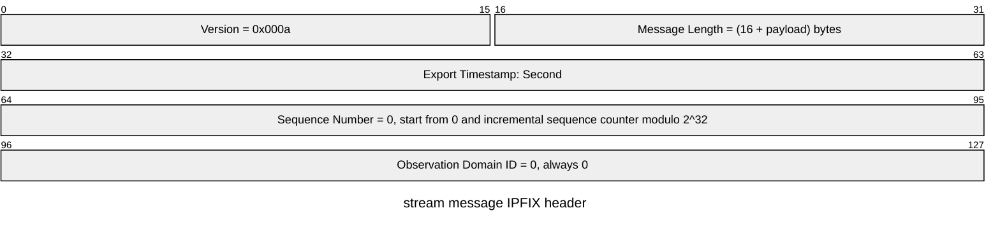
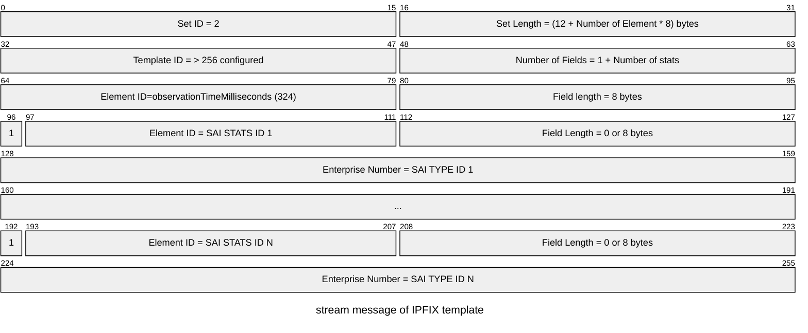
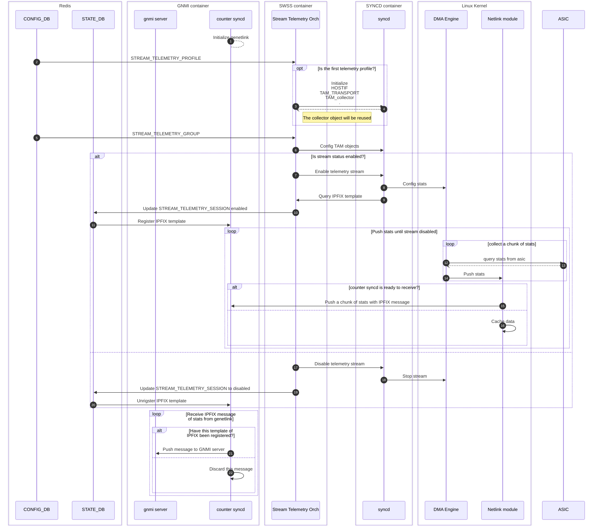
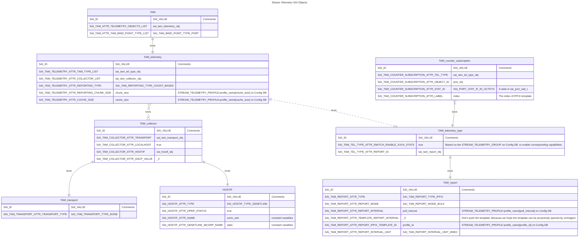

# Stream telemetry high level design #
- [Stream telemetry high level design](#stream-telemetry-high-level-design)
  - [Table of Content](#table-of-content)
    - [Revision](#revision)
    - [Scope](#scope)
    - [Definitions/Abbreviations](#definitionsabbreviations)
    - [Overview](#overview)
    - [Requirements](#requirements)
    - [Architecture Design](#architecture-design)
    - [High-Level Design](#high-level-design)
      - [Modules](#modules)
        - [Netlink Module](#netlink-module)
      - [Data format](#data-format)
        - [IPFIX header](#ipfix-header)
        - [IPFIX template](#ipfix-template)
        - [IPFIX data](#ipfix-data)
        - [Bandwidth Estimation](#bandwidth-estimation)
      - [Config DB](#config-db)
        - [STREAM\_TELEMETRY\_PROFILE](#stream_telemetry_profile)
        - [STREAM\_TELEMETRY\_GROUP](#stream_telemetry_group)
      - [StateDb](#statedb)
        - [STREAM\_TELEMETRY\_SESSION](#stream_telemetry_session)
      - [Work Flow](#work-flow)
    - [SAI API](#sai-api)
      - [Create HOSTIF object](#create-hostif-object)
      - [Creating TAM transport object](#creating-tam-transport-object)
      - [Creating TAM collector object](#creating-tam-collector-object)
      - [Creating TAM report object](#creating-tam-report-object)
      - [Creating TAM telemetry type object](#creating-tam-telemetry-type-object)
      - [Creating TAM telemetry object](#creating-tam-telemetry-object)
      - [Create TAM counter subscription objects](#create-tam-counter-subscription-objects)
      - [Create TAM object](#create-tam-object)
      - [Query IPFIX template](#query-ipfix-template)
      - [Enable/Disable telemetry stream](#enabledisable-telemetry-stream)
    - [Configuration and management](#configuration-and-management)
      - [Manifest (if the feature is an Application Extension)](#manifest-if-the-feature-is-an-application-extension)
      - [CLI/YANG model Enhancements](#cliyang-model-enhancements)
      - [Config DB Enhancements](#config-db-enhancements)
    - [Warmboot and Fastboot Design Impact](#warmboot-and-fastboot-design-impact)
    - [Memory Consumption](#memory-consumption)
    - [Restrictions/Limitations](#restrictionslimitations)
    - [Testing Requirements/Design](#testing-requirementsdesign)
      - [Unit Test cases](#unit-test-cases)
      - [System Test cases](#system-test-cases)
    - [Open/Action items - if any](#openaction-items---if-any)


## Table of Content 

### Revision  

### Scope  

This section describes the scope of this high-level design document in SONiC.

### Definitions/Abbreviations 

This section covers the abbreviation if any, used in this high-level design document and its definitions.

### Overview 

The purpose of this section is to give an overview of high-level design document and its architecture implementation in SONiC. 

### Requirements

This section list out all the requirements for the HLD coverage and exemptions (not supported) if any for this design.

### Architecture Design 

This section covers the changes that are required in the SONiC architecture. In general, it is expected that the current architecture is not changed.
This section should explain how the new feature/enhancement (module/sub-module) fits in the existing architecture. 

If this feature is a SONiC Application Extension mention which changes (if any) needed in the Application Extension infrastructure to support new feature.

``` mermaid

---
title: Stream telemetry architecture
---
flowchart BT
    subgraph Redis
        config_db[(CONFIG_DB)]
        state_db[(STATE_DB)]
    end

    subgraph SONiC service
    subgraph GNMI container
        gnmi(GNMI server)
        counter_syncd(Counter Syncd)
    end
    subgraph SWSS container
    subgraph Orchagent
        st_orch(Stream Telemetry Orch)
    end
    end
    subgraph SYNCD container
        syncd(Syncd)
    end
    end

    subgraph Linux Kernel
        dma_engine(DMA Engine)
        netlink_module(Netlink Module)
    end

    asic[\ASIC\]

    config_db --STREAM_TELEMETRY_PROFILE
                STREAM_TELEMETRY_GROUP--> st_orch
    st_orch --SAI_OBJECT_TYPE_TAM_REPORT
                SAI_OBJECT_TYPE_TAM_TEL_TYPE
                SAI_OBJECT_TYPE_TAM_TRANSPORT
                SAI_OBJECT_TYPE_TAM_COLLECTOR
                SAI_OBJECT_TYPE_TAM_EVENT
                SAI_OBJECT_TYPE_TAM--> syncd
    syncd --IPFIX template--> st_orch
    syncd --TAM configuration--> dma_engine
    syncd --TAM configuration--> netlink_module
    st_orch --STREAM_TELEMETRY_SESSION--> state_db
    state_db --STREAM_TELEMETRY_SESSION--> counter_syncd
    asic --counters--> dma_engine
    dma_engine --IPFIX record--> netlink_module
    netlink_module --IPFIX record--> counter_syncd
    counter_syncd --telemetry message--> gnmi
```



### High-Level Design ###

#### Modules ####

##### Netlink Module #####

generic_netlink

netlink configuration constants in /etc/sonic/constants.yml

``` yaml
constants:
    stream_telemetry:
        genl_family: "sonic_stel"
        genl_multicast_group: "stats"
}

```

Ring buffer model

Pin CPU?


#### Data format ####

We would like to use IPFIX as the report format, and the bytes order of all numbers in the IPFIX message is network-order(Big-endian order).

The reference of IPFIX:

- [Specification of the IP Flow Information Export (IPFIX) Protocol for the Exchange of Flow Information](https://datatracker.ietf.org/doc/html/rfc7011)
- [IP Flow Information Export (IPFIX) Entities](https://www.iana.org/assignments/ipfix/ipfix.xhtml)

##### IPFIX header #####



##### IPFIX template #####



- To some high frequency counters, the unit of timestamp of native IPFIX is second which cannot meet our requirement. So, we introduce an extra element, `observationTimeMilliseconds`, for each record.
- Normally, to use the [SAI_OBJECT_TYPE](https://github.com/opencomputeproject/SAI/blob/master/inc/saitypes.h) as the enterprise number of IPFIX directly and derive the element ID of IPFIX from SAI stats ID via AND `0x8000`.
For example, to the `SAI_QUEUE_STAT_WRED_ECN_MARKED_PACKETS=0x00000022` of `SAI_OBJECT_TYPE_QUEUE = 21`, the enterprise number would be: `0x000000015`, and the element ID would be `0x8022`.
- We don't support the stats ID exceeds to `65535` currently, because the IPFIX specification itself limits the element ID to two bytes. If a larger stats IDs are needed in the future, we will need to extend IPFIX to a private encoding with 8 bytes element IDs.
- In order to the a flexibility and an efficiency, this system will support partial telemetry. It means this system will only report stats from selected ports/queue or so on. For example, if we only configure to report stats on Ethernet2 and Ethernet8, the report data will only include stats from these two ports even though there are 256 ports on this switch. To achieve this, the selection information needs to be encoded into the IPFIX template via field length. **The template should includes ALL objects for the stats. Meanwhile, if an object is selected, the length of corresponding field is 8, vice versa it's 0.**
For example, if the switch has 8 ports, but we only want to get the `SAI_PORT_STAT_IF_IN_OCTETS = 0` on Ethernet2 and Ethernet5. The template will look like:

```

0...31
|Set ID = 2|Set Length = 76<12+8*8>|
|Template ID  =  256|Number of Fields = 9|
|Type = 324|Field Length = 8|
|1|Element ID = 0|Field Length = 0|
|Enterprise Number = 0|
|1|Element ID = 0|Field Length = 0|
|Enterprise Number = 0|
|1|Element ID = 0|Field Length = 8|
|Enterprise Number = 0|
|1|Element ID = 0|Field Length = 0|
|Enterprise Number = 0|
|1|Element ID = 0|Field Length = 0|
|Enterprise Number = 0|
|1|Element ID = 0|Field Length = 8|
|Enterprise Number = 0|
|1|Element ID = 0|Field Length = 0|
|Enterprise Number = 0
|1|Element ID = 0|Field Length = 0|
|Enterprise Number = 0|

```

##### IPFIX data #####

A message of IPFIX data contains two level hierarchies, namely chunks and snapshots. A chunk contains a numbers of snapshots. And a snapshot is a binary block that can be interpreted by the IPFIX template mentioned above.

The binary block of snapshot is as follows:


- The chunk size can be configured via SAI.
- The shot structure is derived from the IPFIX template, which is also derived from the stats we want to record.

The following is an IPFIX message example of the same stats record as the IPFIX template example, and the chunk size is 3

```

0...31
|Version = 0x000a|Message Length = 64|
|Export Timestamp = 2024-08-29 20:30:60|
|Sequence Number = 1|
|Observation Domain ID = 0|
|Set ID = 256|Set Length = 24|
|Record 1: observationTimeMilliseconds = 100|
|Record 2: SAI_PORT_STAT_IF_IN_OCTETS = 10 |
|Record 3: SAI_PORT_STAT_IF_IN_OCTETS = 0 |
|Set ID = 256|Set Length = 24|
|Record 1: observationTimeMilliseconds = 200|
|Record 2: SAI_PORT_STAT_IF_IN_OCTETS = 10 |
|Record 3: SAI_PORT_STAT_IF_IN_OCTETS = 5 |
|Set ID = 256|Set Length = 24|
|Record 1: observationTimeMilliseconds = 300|
|Record 2: SAI_PORT_STAT_IF_IN_OCTETS = 30 |
|Record 3: SAI_PORT_STAT_IF_IN_OCTETS = 20 |

```

##### Bandwidth Estimation #####

We estimate the bandwidth based only on the effective data size, not the actual data size. Because the extra information of a message is the IPFIX header(16 bytes), data prefix(4 bytes) and observation time milliseconds(4 bytes) which is negligible. For example, if we want to collect 30 stats on 256 ports, and the chunk size is 100. The percentage of effective data = `(4 * 30 * 256 * 100<effective data>) / (16<header> + 4 * 100<data prefix> + 4 * 100<observation time milliseconds> + 4 * 30 * 256 * 100<effective data>) = 99.9%`.

The following table is telemetry bandwidth of one cluster

| # of stats per port | # of ports per switch | # of switch | frequency (ms) | Total BW per switch(Mbps) | Total BW(Mbps) |
| ------------------- | --------------------- | ----------- | -------------- | ------------------------- | -------------- |
| 30                  | 512                   | 10000       | 1              | 122.88                    | 1,228,800      |

- *Total BW per switch = <# of stats per port> * <# of ports per switch> * <frequency * 1000> * 8 / 1,000,000*
- *Total BM = <Total BW per switch> * <# of switch>*

#### Config DB ####

Any configuration changes in the config DB will interrupt existing session and restart new one.

##### STREAM_TELEMETRY_PROFILE #####

```
STREAM_TELEMETRY_PROFILE:{{profile_name}}
    "stream_status": {{enable/disable}}
    "poll_interval": {{uint32}}
    "profile_id": {{uint16}}
    "chunk_size": {{uint32}} (OPTIONAL)
    "cache_size": {{uint32}} (OPTIONAL)
```

```
key                = STREAM_TELEMETRY_PROFILE:profile_name a string as the identifier of stream telemetry
; field            = value
stream_status      = enable/disable ; Enable/Disable stream.
poll_interval      = uint32 ; The interval to poll counter, unit milliseconds.
profile_id         = uint16 ; A numeric identifier of stream telemetry. The range is 256-65535.
chunk_size         = uint32 ; number of stats groups in a telemetry message.
cache_size         = uint32 ; number of chunks that can be cached.
```

##### STREAM_TELEMETRY_GROUP #####

```
STREAM_TELEMETRY_GROUP:{{group_name}}:{{profile_name}}
    "object_names": {{list of object name}}
    "object_counters": {{list of stats of object}}
```

```
key             = STREAM_TELEMETRY_GROUP:group_name:profile_name
                    ; group_name is the object type, like PORT, QUEUE or INGRESS_PRIORITY_GROUP.
                    ; Multiple groups can be bound to a same stream telemetry profile.
; field         = value
object_names    = list of object name
                    ; The object name in the group, like Ethernet0,Ethernet8. comma separated list.
object_counters = list of stats of object
                    ; The stats name in the group. like SAI_PORT_STAT_IF_IN_OCTETS,SAI_PORT_STAT_IF_IN_UCAST_PKTS.
                    ; comma separated list.
```

#### StateDb ####

##### STREAM_TELEMETRY_SESSION #####

```
STREAM_TELEMETRY_SESSION:{{profile_name}}
    "session_status": {{enable/disable}}
    "session_template": {{binary array}}
```

```
key                 = STREAM_TELEMETRY_SESSION:profile_name ; a string as the identifier of stream telemetry
; field             = value
session_status      = enable/disable ; Enable/Disable stream.
session_template    = binary array; The IPFIX template to interpret the message from netlink
```

#### Work Flow



This section covers the high level design of the feature/enhancement. This section covers the following points in detail.
		
	- Is it a built-in SONiC feature or a SONiC Application Extension?
	- What are the modules and sub-modules that are modified for this design?
	- What are the repositories that would be changed?
	- Module/sub-module interfaces and dependencies. 
	- SWSS and Syncd changes in detail
	- DB and Schema changes (APP_DB, ASIC_DB, COUNTERS_DB, LOGLEVEL_DB, CONFIG_DB, STATE_DB)
	- Sequence diagram if required.
	- Linux dependencies and interface
	- Warm reboot requirements/dependencies
	- Fastboot requirements/dependencies
	- Scalability and performance requirements/impact
	- Memory requirements
	- Docker dependency
	- Build dependency if any
	- Management interfaces - SNMP, CLI, RestAPI, etc.,
	- Serviceability and Debug (logging, counters, trace etc) related design
	- Is this change specific to any platform? Are there dependencies for platforms to implement anything to make this feature work? If yes, explain in detail and inform community in advance.
	- SAI API requirements, CLI requirements, ConfigDB requirements. Design is covered in following sections.

### SAI API ###

This section covers the changes made or new API added in SAI API for implementing this feature. If there is no change in SAI API for HLD feature, it should be explicitly mentioned in this section.
This section should list the SAI APIs/objects used by the design so that silicon vendors can implement the required support in their SAI. Note that the SAI requirements should be discussed with SAI community during the design phase and ensure the required SAI support is implemented along with the feature/enhancement.



| Object Type              | Scope                        |
| ------------------------ | ---------------------------- |
| HOSTIF                   | Global                       |
| TAM_transport            | Global                       |
| TAM_collector            | Global                       |
| TAM                      | per STREAM_TELEMETRY profile |
| TAM_telemetry            | per STREAM_TELEMETRY profile |
| TAM_telemetry_type       | per STREAM_TELEMETRY profile |
| TAM_report               | per STREAM_TELEMETRY profile |
| TAM_counter_subscription | per stats of object          |


#### Create HOSTIF object ####

``` c++

sai_attr_list[0].id = SAI_HOSTIF_ATTR_TYPE;
sai_attr_list[0].value.s32 = SAI_HOSTIF_TYPE_GENETLINK;

sai_attr_list[1].id = SAI_HOSTIF_ATTR_OPER_STATUS;
sai_attr_list[1].value.boolean = true;

// Set genetlink family
sai_attr_list[2].id = SAI_HOSTIF_ATTR_NAME;
strncpy(sai_attr_list[2].value.chardata, "sonic_stel", strlen("sonic_stel") + 1);

// Set genetlink group
sai_attr_list[3].id = SAI_HOSTIF_ATTR_GENETLINK_MCGRP_NAME;
strncpy(sai_attr_list[3].value.chardata, "stats", strlen("stats") + 1);

attr_count = 4;
create_hostif(sai_hostif_obj, switch_id, attr_count, sai_attr_list);

```

#### Creating TAM transport object ####

``` c++

sai_attr_list[0].id = SAI_TAM_TRANSPORT_ATTR_TRANSPORT_TYPE;
sai_attr_list[0].value.s32 = SAI_TAM_TRANSPORT_TYPE_NONE; 

attr_count = 1;
sai_create_tam_transport_fn(&sai_tam_transport_obj, switch_id, attr_count, sai_attr_list);

```

#### Creating TAM collector object ####

``` c++
typedef enum _sai_tam_collector_attr_t
{
    // ...

    /**
     * @brief Hostif object used to reach local host via GENETLINK
     *
     * @type sai_object_id_t
     * @flags CREATE_AND_SET
     * @objects SAI_OBJECT_TYPE_HOSTIF
     * @allownull true
     * @default SAI_NULL_OBJECT_ID
     * @validonly SAI_TAM_COLLECTOR_ATTR_LOCALHOST == true
     */
    SAI_TAM_COLLECTOR_ATTR_HOSTIF,

    // ...
} sai_tam_collector_attr_t;
```

``` c++

sai_attr_list[0].id = SAI_TAM_COLLECTOR_ATTR_TRANSPORT;
sai_attr_list[0].value.oid = sai_tam_transport_obj;

sai_attr_list[1].id = SAI_TAM_COLLECTOR_ATTR_LOCALHOST;
sai_attr_list[1].value.booldata = true;

sai_attr_list[2].id = SAI_TAM_COLLECTOR_ATTR_HOSTIF;
sai_attr_list[2].value.oid = sai_hostif_obj;

sai_attr_list[3].id = SAI_TAM_COLLECTOR_ATTR_DSCP_VALUE;
sai_attr_list[3].value.u8 = 0;

attr_count = 4;
sai_create_tam_collector_fn(&sai_tam_collector_obj, switch_id, attr_count, sai_attr_list);

```

#### Creating TAM report object ####

``` c++
/**
 * @brief Attributes for TAM report
 */
typedef enum _sai_tam_report_attr_t
{

    // ...

    /**
     * @brief Set ID for IPFIX template
     *
     * According to the IPFIX spec, the available range should be 256-65535.
     * The value 0 means the ID will be decided by the vendor's SAI.
     *
     * @type sai_uint16_t
     * @flags CREATE_AND_SET
     * @default 0
     * @validonly SAI_TAM_REPORT_ATTR_TYPE == SAI_TAM_REPORT_TYPE_IPFIX
     */
    SAI_TAM_REPORT_ATTR_REPORT_IPFIX_TEMPLATE_ID,

    /**
     * @brief query IPFIX template 
     *
     * Return the IPFIX template binary buffer
     *
     * @type sai_uint8_list_t
     * @flags READ_ONLY
     * @validonly SAI_TAM_REPORT_ATTR_TYPE == SAI_TAM_REPORT_TYPE_IPFIX
     */
    SAI_TAM_REPORT_ATTR_IPFIX_TEMPLATE,

    // ...

} sai_tam_report_attr_t;

```

``` c++

sai_attr_list[0].id = SAI_TAM_REPORT_ATTR_TYPE;
sai_attr_list[0].value.s32 = SAI_TAM_REPORT_TYPE_IPFIX;

sai_attr_list[1].id = SAI_TAM_REPORT_ATTR_REPORT_MODE;
sai_attr_list[1].value.s32 = SAI_TAM_REPORT_MODE_BULK;

sai_attr_list[2].id = SAI_TAM_REPORT_ATTR_REPORT_INTERVAL;
sai_attr_list[2].value.u32 = poll_interval; // STREAM_TELEMETRY_PROFILE:profile_name[poll_interval] on Config DB

// sai_attr_list[].id = SAI_TAM_REPORT_ATTR_ENTERPRISE_NUMBER; Ignore this value

sai_attr_list[3].id = SAI_TAM_REPORT_ATTR_TEMPLATE_REPORT_INTERVAL;
sai_attr_list[3].value.s32 = 0; // Don't push the template, Because we hope the template can be proactively queried by orchagent

sai_attr_list[4].id = SAI_TAM_REPORT_ATTR_REPORT_IPFIX_TEMPLATE_ID;
sai_attr_list[4].value.u16 = profile_id;// STREAM_TELEMETRY_PROFILE:profile_name[profile_id] on Config DB;

sai_attr_list[5].id = SAI_TAM_REPORT_ATTR_REPORT_INTERVAL_UNIT;
sai_attr_list[5].value.s32 = SAI_TAM_REPORT_INTERVAL_UNIT_MSEC;

attr_count = 6;
sai_create_tam_report_fn(&sai_tam_report_obj, switch_id, attr_count, sai_attr_list);

```

#### Creating TAM telemetry type object ####

``` c++

sai_attr_list[0].id = SAI_TAM_TEL_TYPE_ATTR_TAM_TELEMETRY_TYPE;
sai_attr_list[0].value.s32 = SAI_TAM_TELEMETRY_TYPE_COUNTER_SUBSCRIPTION;

// Based on the STREAM_TELEMETRY_GROUP on Config DB, to enable corresponding capabilities.
sai_attr_list[1].id = SAI_TAM_TEL_TYPE_ATTR_SWITCH_ENABLE_PORT_STATS ;
sai_attr_list[1].value.boolean = true;

sai_attr_list[2].id = SAI_TAM_TEL_TYPE_ATTR_SWITCH_ENABLE_MMU_STATS ;
sai_attr_list[2].value.boolean = true;

// ...

sai_attr_list[3].id = SAI_TAM_TEL_TYPE_ATTR_REPORT_ID;
sai_attr_list[3].value.oid = sai_tam_report_obj;

attr_count = 4;
sai_create_tam_tel_type_fn(&sai_tam_tel_type_obj, switch_id, attr_count, sai_attr_list);

```

#### Creating TAM telemetry object ####

Extern TAM telemetry attributes in SAI

``` c++

typedef enum _sai_tam_reporting_type_t
{
    /**
     * @brief Report type is time based
     */
    SAI_TAM_REPORTING_TYPE_TIME_BASED,

    /**
     * @brief Report type is count based
     */
    SAI_TAM_REPORTING_TYPE_COUNT_BASED,

} sai_tam_reporting_type_t;

typedef enum _sai_tam_telemetry_attr_t
{
    // ...

    /**
     * @brief Tam telemetry reporting unit
     *
     * @type sai_tam_reporting_unit_t
     * @flags CREATE_AND_SET
     * @default SAI_TAM_REPORTING_UNIT_SEC
     * @condition SAI_TAM_TELEMETRY_ATTR_REPORTING_TYPE == SAI_TAM_REPORTING_TYPE_TIME_BASED
     */
    SAI_TAM_TELEMETRY_ATTR_TAM_REPORTING_UNIT,

    /**
     * @brief Tam event reporting interval
     *
     * defines the gap between two reports
     *
     * @type sai_uint32_t
     * @flags CREATE_AND_SET
     * @default 1
     * @condition SAI_TAM_TELEMETRY_ATTR_REPORTING_TYPE == SAI_TAM_REPORTING_TYPE_TIME_BASED
     */
    SAI_TAM_TELEMETRY_ATTR_REPORTING_INTERVAL,

    /**
     * @brief Tam telemetry reporting type
     *
     * @type sai_tam_reporting_type_t
     * @flags CREATE_AND_SET
     * @default SAI_TAM_REPORTING_TYPE_TIME_BASED
     */
    SAI_TAM_TELEMETRY_ATTR_REPORTING_TYPE,

    /**
     * @brief Tam telemetry reporting chunk size
     *
     * defines the size of reporting chunk, which means TAM will report to the collector every time
     * if the report count reaches the chunk size.
     *
     * @type sai_uint32_t
     * @flags CREATE_AND_SET
     * @default 1
     * @condition SAI_TAM_TELEMETRY_ATTR_REPORTING_TYPE == SAI_TAM_REPORTING_TYPE_COUNT_BASED
     */
    SAI_TAM_TELEMETRY_ATTR_REPORTING_CHUNK_SIZE,

    /**
     * @brief Tam telemetry cache size
     *
     * If the collector isn't ready to receive the report, this value indicates how many
     * reports that can be cached. 0 means no cache which is the default behavior.
     *
     * @type sai_uint32_t
     * @flags CREATE_AND_SET
     * @default 0
     */
    SAI_TAM_TELEMETRY_ATTR_CACHE_SIZE,

} sai_tam_telemetry_attr_t;

```

``` c++

sai_attr_list[0].id = SAI_TAM_TELEMETRY_ATTR_TAM_TYPE_LIST;
sai_attr_list[0].value.objlist.count = 1;
sai_attr_list[0].value.objlist.list[0] =  sai_tam_tel_type_obj;

sai_attr_list[1].id = SAI_TAM_TELEMETRY_ATTR_COLLECTOR_LIST;
sai_attr_list[1].value.objlist.count = 1;
sai_attr_list[1].value.objlist.list[0] = sai_tam_collector_obj;

sai_attr_list[2].id = SAI_TAM_TELEMETRY_ATTR_REPORTING_TYPE;
sai_attr_list[2].value.s32 = SAI_TAM_REPORTING_TYPE_COUNT_BASED

sai_attr_list[3].id = SAI_TAM_TELEMETRY_ATTR_REPORTING_CHUNK_SIZE;
sai_attr_list[3].value.u32 = chunk_size; // STREAM_TELEMETRY_PROFILE:profile_name[chunk_size] on Config DB

sai_attr_list[4].id = SAI_TAM_TELEMETRY_ATTR_CACHE_SIZE;
sai_attr_list[4].value.u32 = cache_size; // STREAM_TELEMETRY_PROFILE:profile_name[cache_size] on Config DB

attr_count = 5;

sai_create_tam_telemetry_fn(&sai_tam_telemetry_obj, switch_id, attr_count, sai_attr_list);

```

#### Create TAM counter subscription objects ####

Based on the STREAM_TELEMETRY_GROUP on Config DB, to create corresponding counter subscription objects.

``` c++

// Create counter subscription list

sai_attr_list[0].id = SAI_TAM_COUNTER_SUBSCRIPTION_ATTR_TEL_TYPE;
sai_attr_list[0].value.oid = sai_tam_tel_type_obj;

sai_attr_list[1].id = SAI_TAM_COUNTER_SUBSCRIPTION_ATTR_OBJECT_ID;
sai_attr_list[1].value.oid = port_obj;

sai_attr_list[2].id = SAI_TAM_COUNTER_SUBSCRIPTION_ATTR_STAT_ID;
sai_attr_list[2].value.oid = SAI_PORT_STAT_IF_IN_OCTETS;

sai_attr_list[3].id = SAI_TAM_COUNTER_SUBSCRIPTION_ATTR_LABEL;
sai_attr_list[3].value.oid = index; // The index of IPFIX template

attr_count = 4;

create_tam_counter_subscription(&sai_tam_counter_subscription_obj, switch_id, attr_count, sai_attr_lis);
// If this stats of object cannot support this poll frequency, this API should return SAI_STATUS_NOT_SUPPORTED.
```

#### Create TAM object ####

``` c++

sai_attr_list[0].id = SAI_TAM_ATTR_TELEMETRY_OBJECTS_LIST;
sai_attr_list[0].value.objlist.count = 1;
sai_attr_list[0].value.objlist.list[0] = sai_tam_telemetry_obj;
 
sai_attr_list[1].id = SAI_TAM_ATTR_TAM_BIND_POINT_TYPE_LIST;
sai_attr_list[1].value.objlist.count = 2;
sai_attr_list[1].value.objlist.list[0] = SAI_TAM_BIND_POINT_TYPE_PORT;
sai_attr_list[1].value.objlist.list[0] = SAI_TAM_BIND_POINT_TYPE_QUEUE; 
 
attr_count = 2;
sai_create_tam_fn(&sai_tam_obj, switch_id, attr_count, sai_attr_list);

```

#### Query IPFIX template ####

``` c++

sai_attribute_t attr;
get_tam_report_attribute(&sai_tam_report_obj, 1, &attr);

std::vector<uint8_t> ipfix_template(attr.value.u8list.list, attr.value.u8list.list + attr.value.u8list.count);
// Save ipfix_template to STATE DB

// Free memory
free(attr.value.u8list.list);

```

#### Enable/Disable telemetry stream ####

``` c++

sai_attribute_t attr;

// Enable telemetry stream

attr.id = SAI_TAM_TELEMETRY_ATTR_TAM_TYPE_LIST;
attr.value.objlist.count = 1;
attr.value.objlist.list[0] =  sai_tam_tel_type_obj;

// Disable telemetry stream

attr.id = SAI_TAM_TELEMETRY_ATTR_TAM_TYPE_LIST;
attr.value.objlist.count = 1;
attr.value.objlist.list[0] =  sai_tam_tel_type_obj;

get_tam_telemetry_attribute(&sai_tam_telemetry_obj, 1, &attr);

```

### Configuration and management 
This section should have sub-sections for all types of configuration and management related design. Example sub-sections for "CLI" and "Config DB" are given below. Sub-sections related to data models (YANG, REST, gNMI, etc.,) should be added as required.
If there is breaking change which may impact existing platforms, please call out in the design and get platform vendors reviewed. 

#### Manifest (if the feature is an Application Extension)

Paste a preliminary manifest in a JSON format.

#### CLI/YANG model Enhancements 

This sub-section covers the addition/deletion/modification of CLI changes and YANG model changes needed for the feature in detail. If there is no change in CLI for HLD feature, it should be explicitly mentioned in this section. Note that the CLI changes should ensure downward compatibility with the previous/existing CLI. i.e. Users should be able to save and restore the CLI from previous release even after the new CLI is implemented. 
This should also explain the CLICK and/or KLISH related configuration/show in detail.
https://github.com/sonic-net/sonic-utilities/blob/master/doc/Command-Reference.md needs be updated with the corresponding CLI change.

#### Config DB Enhancements  

This sub-section covers the addition/deletion/modification of config DB changes needed for the feature. If there is no change in configuration for HLD feature, it should be explicitly mentioned in this section. This section should also ensure the downward compatibility for the change. 
		
### Warmboot and Fastboot Design Impact  
Mention whether this feature/enhancement has got any requirements/dependencies/impact w.r.t. warmboot and fastboot. Ensure that existing warmboot/fastboot feature is not affected due to this design and explain the same.

### Memory Consumption
This sub-section covers the memory consumption analysis for the new feature: no memory consumption is expected when the feature is disabled via compilation and no growing memory consumption while feature is disabled by configuration. 
### Restrictions/Limitations  

### Testing Requirements/Design  
Explain what kind of unit testing, system testing, regression testing, warmboot/fastboot testing, etc.,
Ensure that the existing warmboot/fastboot requirements are met. For example, if the current warmboot feature expects maximum of 1 second or zero second data disruption, the same should be met even after the new feature/enhancement is implemented. Explain the same here.
Example sub-sections for unit test cases and system test cases are given below. 

#### Unit Test cases  

#### System Test cases

### Open/Action items - if any 

	
NOTE: All the sections and sub-sections given above are mandatory in the design document. Users can add additional sections/sub-sections if required.
