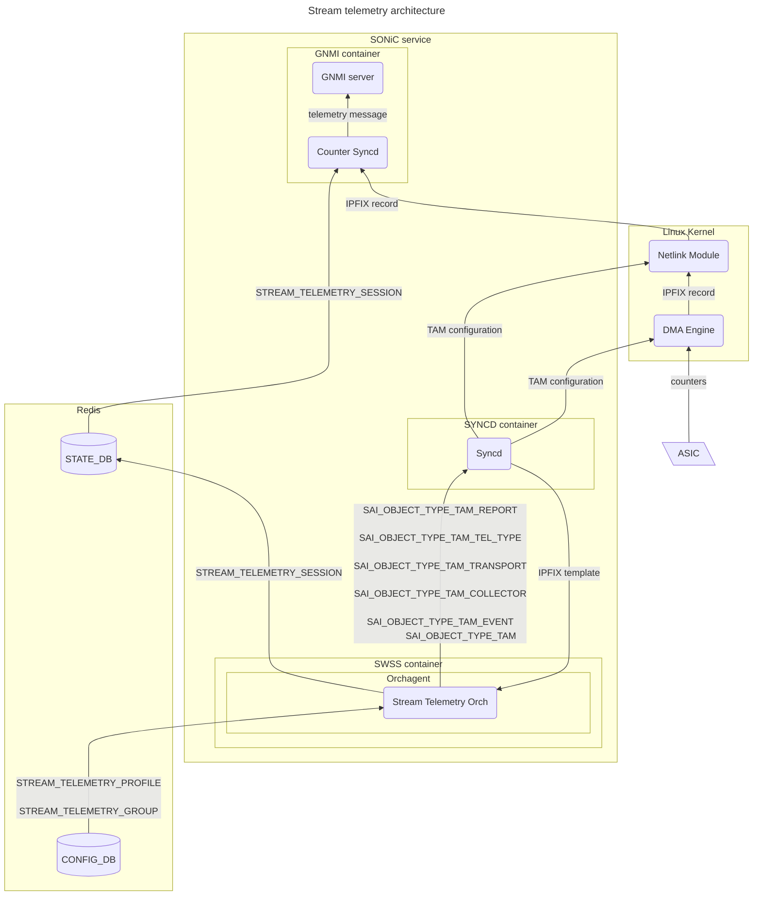
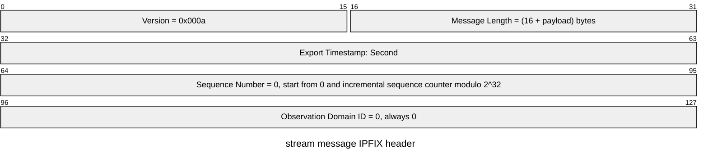
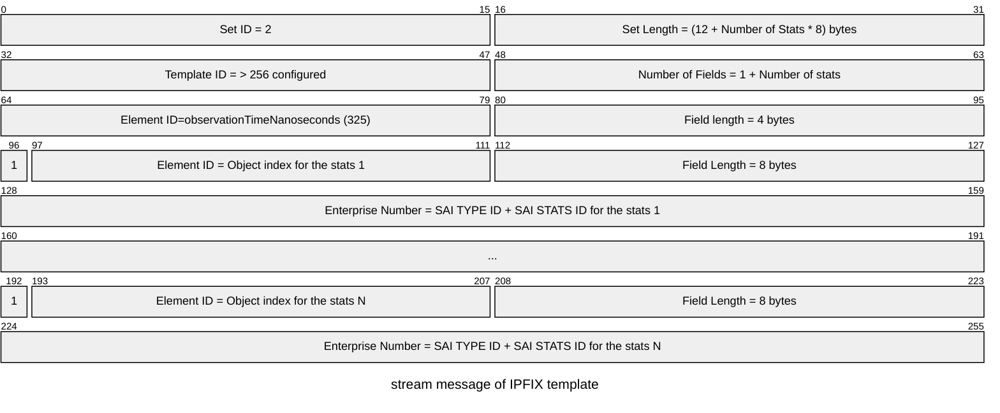
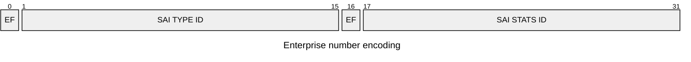
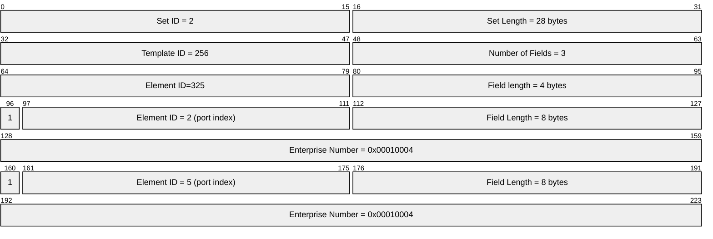
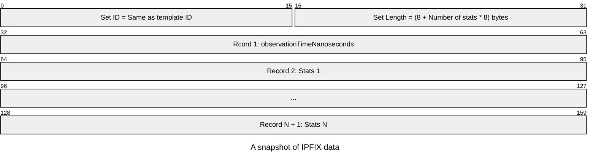
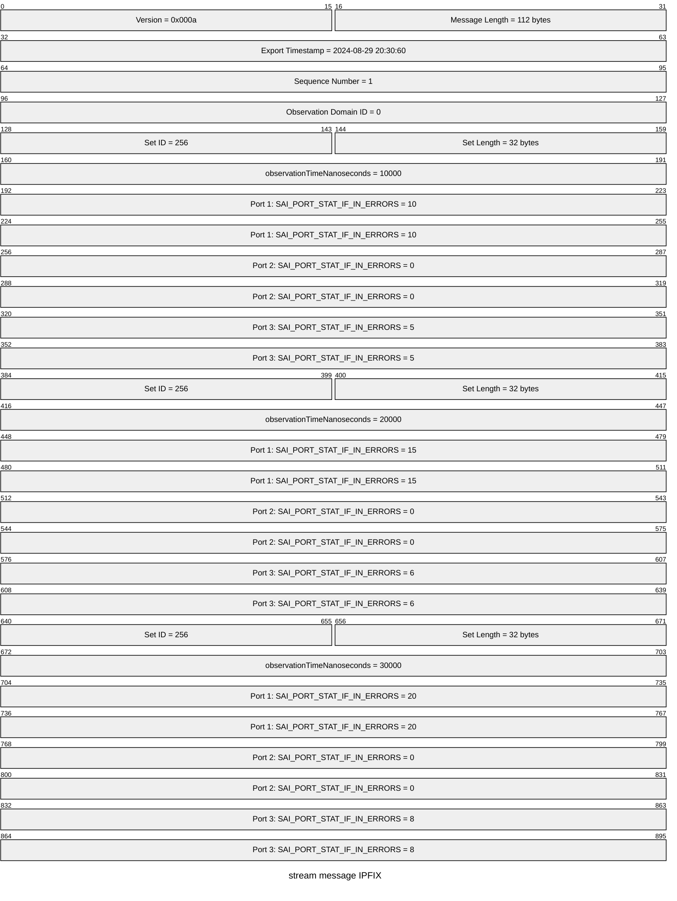
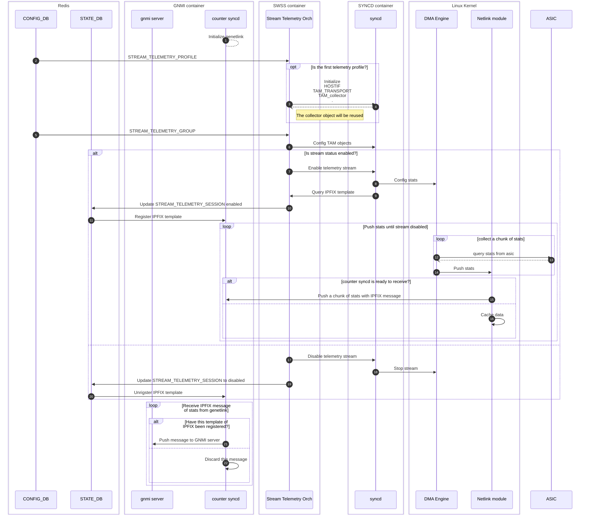
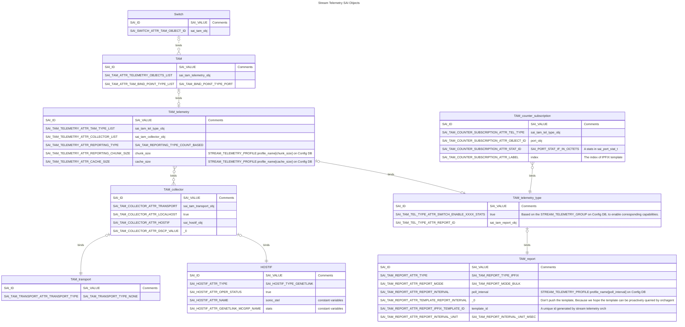

# Stream telemetry high level design <!-- omit in toc -->

## Table of Content ## <!-- omit in toc -->

- [Revision](#revision)
- [Scope](#scope)
- [Definitions/Abbreviations](#definitionsabbreviations)
- [Overview](#overview)
- [Requirements](#requirements)
- [Architecture Design](#architecture-design)
- [High-Level Design](#high-level-design)
  - [Modules](#modules)
    - [Counter Syncd](#counter-syncd)
    - [Stream Telemetry Orch](#stream-telemetry-orch)
    - [Netlink Module and DMA Engine](#netlink-module-and-dma-engine)
  - [Data format](#data-format)
    - [IPFIX header](#ipfix-header)
    - [IPFIX template](#ipfix-template)
    - [IPFIX data](#ipfix-data)
  - [Bandwidth Estimation](#bandwidth-estimation)
  - [Config DB](#config-db)
    - [STREAM\_TELEMETRY\_PROFILE](#stream_telemetry_profile)
    - [STREAM\_TELEMETRY\_GROUP](#stream_telemetry_group)
  - [StateDb](#statedb)
    - [STREAM\_TELEMETRY\_SESSION](#stream_telemetry_session)
  - [Work Flow](#work-flow)
  - [SAI API](#sai-api)
    - [Create HOSTIF object](#create-hostif-object)
    - [Creating TAM transport object](#creating-tam-transport-object)
    - [Creating TAM collector object](#creating-tam-collector-object)
    - [Creating TAM report object](#creating-tam-report-object)
    - [Creating TAM telemetry type object](#creating-tam-telemetry-type-object)
    - [Creating TAM telemetry object](#creating-tam-telemetry-object)
    - [Create TAM counter subscription objects](#create-tam-counter-subscription-objects)
    - [Create TAM object](#create-tam-object)
    - [Query IPFIX template](#query-ipfix-template)
    - [Enable/Disable telemetry stream](#enabledisable-telemetry-stream)
- [Configuration and management](#configuration-and-management)
  - [Manifest (if the feature is an Application Extension)](#manifest-if-the-feature-is-an-application-extension)
  - [CLI/YANG model Enhancements](#cliyang-model-enhancements)
    - [Config CLI](#config-cli)
    - [Inspect stream CLI](#inspect-stream-cli)
    - [YANG](#yang)
  - [Config DB Enhancements](#config-db-enhancements)
  - [Warmboot and Fastboot Design Impact](#warmboot-and-fastboot-design-impact)
  - [Memory Consumption](#memory-consumption)
  - [Restrictions/Limitations](#restrictionslimitations)
  - [Testing Requirements/Design](#testing-requirementsdesign)
    - [Unit Test cases](#unit-test-cases)
    - [System Test cases](#system-test-cases)
  - [Open/Action items - if any](#openaction-items---if-any)

## Revision

| Rev | Date       | Author | Change Description |
| --- | ---------- | ------ | ------------------ |
| 0.1 | 09/06/2024 | Ze Gan | Initial version    |

## Scope

This document outlines the high-level design of stream telemetry, focusing primarily on the internal aspects of SONiC rather than external telemetry systems.

## Definitions/Abbreviations

| Abbreviation | Description                               |
| ------------ | ----------------------------------------- |
| SAI          | The Switch Abstraction Interface          |
| IPFIX        | Internet Protocol Flow Information Export |
| TAM          | Telemetry and Monitoring                  |
| BW           | Bandwidth                                 |

## Overview

The existing telemetry solution of SONiC relies on the syncd process to proactively query stats and counters via the SAI API. This approach causes the syncd process to spend excessive time on SAI communication. The stream telemetry described in this document aims to provide a more efficient method for collecting object stats. The main idea is that selected stats will be proactively pushed from the vendor's driver to the collector via netlink.

## Requirements

- The number of SAI object types should not exceed 32,768 ($2^{15}$). This means the value of SAI_OBJECT_TYPE_MAX should be less than 32,768.
- The number of SAI object extension types should not exceed 32,768.
- The number of stats types for a single SAI object type should not exceed 32,768.
- The number of extension stats types for a single SAI object type should not exceed 32,768.
- The number of SAI objects of the same type should not exceed 32,768.
- The vendor SDK should support publishing stats in IPFIX format and its IPFIX template.
- If a polling frequency for stats cannot be supported, the vendor's SDK should report this error.
- When reconfiguring any stream settings, whether it is the polling interval or the stats list, the existing stream will be interrupted and regenerated.

## Architecture Design



STATE_DB channel model? Produce Table/Consume Table

## High-Level Design

### Modules

#### Counter Syncd

The `counter syncd` is a new module that runs within the GNMI container. Its primary responsibility is to receive counter messages via netlink and convert them into GNMI messages for an external collector. It subscribes to a socket of a specific family and multicast group of generic netlink. The configuration for generic netlink is defined as constants in `/etc/sonic/constants.yml` as follows.

``` yaml
constants:
    stream_telemetry:
        genl_family: "sonic_stel"
        genl_multicast_group: "stats"
}

```

#### Stream Telemetry Orch

The `Stream Telemetry Orch` is a new object within the Orchagent. It has following primary duties:

1. Maintain the TAM SAI objects according to the stream telemetry configuration in the config DB.
2. Generate a unique template ID for each stream telemetry profile to ensure distinct identification and management.
3. Register and activate streams on counter syncd.

`Stream Telemetry Orch` leverages `tam_counter_subscription` objects to bind monitoring objects, such as ports, buffers, or queues, to streams. Therefore, this orch must ensure that the lifecycle of `tam_counter_subscription` objects is within the lifecycle of their respective monitoring objects.

#### Netlink Module and DMA Engine

These two modules need to be provided by vendors. This document proposes a ring buffer communication model to support all expected TAM configurations as follows.


### Data format

We will use IPFIX as the report format, with all numbers in the IPFIX message in network-order (Big-endian).

For more information on IPFIX, refer to the following resources:

- [Specification of the IP Flow Information Export (IPFIX) Protocol for the Exchange of Flow Information](https://datatracker.ietf.org/doc/html/rfc7011)
- [IP Flow Information Export (IPFIX) Entities](https://www.iana.org/assignments/ipfix/ipfix.xhtml)

#### IPFIX header

The `Version` and `Observation Domain ID` fields of the IPFIX header are identical for each IPFIX message.



#### IPFIX template



- For high-frequency counters, the native IPFIX timestamp unit of seconds is insufficient. Therefore, we introduce an additional element, `observationTimeNanoseconds`, for each record to meet our requirements.
- The enterprise bit is always set to 1 for stats records.
- The element ID of IPFIX is derived from the object index. For example, for `Ethernet5`, the element ID will be `0x5 | 0x8000 = 0x8005`.
- The enterprise number is derived from the combination of the [SAI_OBJECT_TYPE](https://github.com/opencomputeproject/SAI/blob/master/inc/saitypes.h) and its corresponding stats ID. The high bits are used to indicate the SAI extension flag. For example, for `SAI_QUEUE_STAT_WRED_ECN_MARKED_PACKETS=0x00000022` of `SAI_OBJECT_TYPE_QUEUE=0x00000015`, the enterprise number will be `0x00000022 << 16 | 0x00000015 = 0x00220015`.



**EF is the extension flag: If this type or stat is an SAI extension, it should be set to 1.**

For example, if the switch has 8 ports, but we only want to get the `SAI_PORT_STAT_IF_IN_ERRORS = 0x00000004` of `SAI_OBJECT_TYPE_PORT = 0x00000001` on Ethernet2 and Ethernet5, the template will look like this:



#### IPFIX data

An IPFIX data message consists of two hierarchical levels: chunk and snapshots. A chunk contains multiple snapshots, and a snapshot is a binary block that can be interpreted using the IPFIX template mentioned above.

The binary structure of a snapshot is as follows:



- The chunk size can be configured via SAI.
- The snapshot structure is derived from the IPFIX template, which is based on the stats we want to record.

Below is an example of an IPFIX message for the same stats record as the IPFIX template example, with a chunk size of 3:



### Bandwidth Estimation

We estimate the bandwidth based only on the effective data size, not the actual data size. The extra information in a message, such as the IPFIX header (16 bytes), data prefix (4 bytes), and observation time milliseconds (4 bytes), is negligible. For example, if we want to collect 30 stats on 64 ports, and the chunk size is 100: $The Percentage Of Effective Data = \frac{8 \times 30 \times 64 \times 100_{Effective Data}}{16_{Header} + 4 \times 100_{Data Prefix} + 4 \times 100_{Observation Time Milliseconds} + 8 \times 30 \times 64 \times 100_{Effective Data}} \approx 99.9\%$ .

The following table is telemetry bandwidth of one cluster

| # of stats per port | # of ports per switch | # of switch | frequency (us) | Total BW per switch(Mbps) | Total BW(Mbps) |
| ------------------- | --------------------- | ----------- | -------------- | ------------------------- | -------------- |
| 30                  | 64                    | 10,000      | 10             | 12,288                    | 122,880,000    |

- ${Total BW Per Switch} = \frac{{\verb|#| Of Stats Per Port} \times 8_{bytes} \times {\verb|#| Of Ports Per Switch} \times {Frequency} \times 1,000 \times 8}{1,000,000}$
- ${Total BM} = {Total BW Per Switch} \times {\verb|#| Of Switch}$

### Config DB

Any configuration changes in the config DB will interrupt the existing session and initiate a new one.

#### STREAM_TELEMETRY_PROFILE

```
STREAM_TELEMETRY_PROFILE|{{profile_name}}
    "stream_state": {{enabled/disabled}}
    "poll_interval": {{uint32}}
    "chunk_size": {{uint32}} (OPTIONAL)
    "cache_size": {{uint32}} (OPTIONAL)
```

```
key                = STREAM_TELEMETRY_PROFILE:profile_name a string as the identifier of stream telemetry
; field            = value
stream_state       = enabled/disabled ; Enabled/Disabled stream.
poll_interval      = uint32 ; The interval to poll counter, unit milliseconds.
chunk_size         = uint32 ; number of stats groups in a telemetry message.
cache_size         = uint32 ; number of chunks that can be cached.
```

#### STREAM_TELEMETRY_GROUP

```
STREAM_TELEMETRY_GROUP|{{profile_name}}|{{group_name}}
    "object_names": {{list of object name}}
    "object_counters": {{list of stats of object}}
```

```
key             = STREAM_TELEMETRY_GROUP:group_name:profile_name
                    ; group_name is the object type, like PORT, BUFFER_PG or BUFFER_POOL.
                    ; Multiple groups can be bound to a same stream telemetry profile.
; field         = value
object_names    = A comma separated list of object name.
                    ; The syntax of object name is top_object_name|index_range.
                    ; The object_name is the object of the top level, like port, Ethernet0,Ethernet4.
                    ; The index range is the object in second level, like priority group.
                    ; An example is Ethernet0|0,Ethernet4|3-4.
object_counters = list of stats of object
                    ; The stats name in the group. like SAI_PORT_STAT_IF_IN_OCTETS,SAI_PORT_STAT_IF_IN_UCAST_PKTS.
                    ; comma separated list.
```

### StateDb

#### STREAM_TELEMETRY_SESSION

```
STREAM_TELEMETRY_SESSION|{{profile_name}}
    "session_status": {{enabled/disabled}}
    "session_type": {{ipfix}}
    "session_template": {{binary array}}
```

```
key                 = STREAM_TELEMETRY_SESSION:profile_name ; a string as the identifier of stream telemetry
; field             = value
session_status      = enable/disable ; Enable/Disable stream.
session_type        = ipfix ; Specified the session type.
session_template    = binary array; The IPFIX template to interpret the message of this session.
```

### Work Flow



### SAI API



| Object Type              | Scope                        |
| ------------------------ | ---------------------------- |
| HOSTIF                   | Global                       |
| TAM_transport            | Global                       |
| TAM_collector            | Global                       |
| TAM                      | per STREAM_TELEMETRY profile |
| TAM_telemetry            | per STREAM_TELEMETRY profile |
| TAM_telemetry_type       | per STREAM_TELEMETRY profile |
| TAM_report               | per STREAM_TELEMETRY profile |
| TAM_counter_subscription | per stats of object          |

#### Create HOSTIF object

``` c++

sai_attr_list[0].id = SAI_HOSTIF_ATTR_TYPE;
sai_attr_list[0].value.s32 = SAI_HOSTIF_TYPE_GENETLINK;

sai_attr_list[1].id = SAI_HOSTIF_ATTR_OPER_STATUS;
sai_attr_list[1].value.boolean = true;

// Set genetlink family
sai_attr_list[2].id = SAI_HOSTIF_ATTR_NAME;
strncpy(sai_attr_list[2].value.chardata, "sonic_stel", strlen("sonic_stel") + 1);

// Set genetlink group
sai_attr_list[3].id = SAI_HOSTIF_ATTR_GENETLINK_MCGRP_NAME;
strncpy(sai_attr_list[3].value.chardata, "stats", strlen("stats") + 1);

attr_count = 4;
create_hostif(sai_hostif_obj, switch_id, attr_count, sai_attr_list);

```

#### Creating TAM transport object

``` c++

sai_attr_list[0].id = SAI_TAM_TRANSPORT_ATTR_TRANSPORT_TYPE;
sai_attr_list[0].value.s32 = SAI_TAM_TRANSPORT_TYPE_NONE; 

attr_count = 1;
sai_create_tam_transport_fn(&sai_tam_transport_obj, switch_id, attr_count, sai_attr_list);

```

#### Creating TAM collector object

``` c++
typedef enum _sai_tam_collector_attr_t
{
    // ...

    /**
     * @brief Hostif object used to reach local host via GENETLINK
     *
     * @type sai_object_id_t
     * @flags CREATE_AND_SET
     * @objects SAI_OBJECT_TYPE_HOSTIF
     * @allownull true
     * @default SAI_NULL_OBJECT_ID
     * @validonly SAI_TAM_COLLECTOR_ATTR_LOCALHOST == true
     */
    SAI_TAM_COLLECTOR_ATTR_HOSTIF,

    // ...
} sai_tam_collector_attr_t;
```

``` c++

sai_attr_list[0].id = SAI_TAM_COLLECTOR_ATTR_TRANSPORT;
sai_attr_list[0].value.oid = sai_tam_transport_obj;

sai_attr_list[1].id = SAI_TAM_COLLECTOR_ATTR_LOCALHOST;
sai_attr_list[1].value.booldata = true;

sai_attr_list[2].id = SAI_TAM_COLLECTOR_ATTR_HOSTIF;
sai_attr_list[2].value.oid = sai_hostif_obj;

sai_attr_list[3].id = SAI_TAM_COLLECTOR_ATTR_DSCP_VALUE;
sai_attr_list[3].value.u8 = 0;

attr_count = 4;
sai_create_tam_collector_fn(&sai_tam_collector_obj, switch_id, attr_count, sai_attr_list);

```

#### Creating TAM report object

``` c++
/**
 * @brief Attributes for TAM report
 */
typedef enum _sai_tam_report_attr_t
{

    // ...

    /**
     * @brief Set ID for IPFIX template
     *
     * According to the IPFIX spec, the available range should be 256-65535.
     * The value 0 means the ID will be decided by the vendor's SAI.
     *
     * @type sai_uint16_t
     * @flags CREATE_AND_SET
     * @default 0
     * @validonly SAI_TAM_REPORT_ATTR_TYPE == SAI_TAM_REPORT_TYPE_IPFIX
     */
    SAI_TAM_REPORT_ATTR_REPORT_IPFIX_TEMPLATE_ID,

    /**
     * @brief query IPFIX template 
     *
     * Return the IPFIX template binary buffer
     *
     * @type sai_uint8_list_t
     * @flags READ_ONLY
     * @validonly SAI_TAM_REPORT_ATTR_TYPE == SAI_TAM_REPORT_TYPE_IPFIX
     */
    SAI_TAM_REPORT_ATTR_IPFIX_TEMPLATE,

    // ...

} sai_tam_report_attr_t;

```

``` c++

sai_attr_list[0].id = SAI_TAM_REPORT_ATTR_TYPE;
sai_attr_list[0].value.s32 = SAI_TAM_REPORT_TYPE_IPFIX;

sai_attr_list[1].id = SAI_TAM_REPORT_ATTR_REPORT_MODE;
sai_attr_list[1].value.s32 = SAI_TAM_REPORT_MODE_BULK;

sai_attr_list[2].id = SAI_TAM_REPORT_ATTR_REPORT_INTERVAL;
sai_attr_list[2].value.u32 = poll_interval; // STREAM_TELEMETRY_PROFILE:profile_name[poll_interval] on Config DB

// sai_attr_list[].id = SAI_TAM_REPORT_ATTR_ENTERPRISE_NUMBER; Ignore this value

sai_attr_list[3].id = SAI_TAM_REPORT_ATTR_TEMPLATE_REPORT_INTERVAL;
sai_attr_list[3].value.s32 = 0; // Don't push the template, Because we hope the template can be proactively queried by orchagent

sai_attr_list[4].id = SAI_TAM_REPORT_ATTR_REPORT_IPFIX_TEMPLATE_ID;
sai_attr_list[4].value.u16 = template_id;// A unique id generated by stream telemetry orch

sai_attr_list[5].id = SAI_TAM_REPORT_ATTR_REPORT_INTERVAL_UNIT;
sai_attr_list[5].value.s32 = SAI_TAM_REPORT_INTERVAL_UNIT_MSEC;

attr_count = 6;
sai_create_tam_report_fn(&sai_tam_report_obj, switch_id, attr_count, sai_attr_list);

```

#### Creating TAM telemetry type object

``` c++

sai_attr_list[0].id = SAI_TAM_TEL_TYPE_ATTR_TAM_TELEMETRY_TYPE;
sai_attr_list[0].value.s32 = SAI_TAM_TELEMETRY_TYPE_COUNTER_SUBSCRIPTION;

// Based on the STREAM_TELEMETRY_GROUP on Config DB, to enable corresponding capabilities.
sai_attr_list[1].id = SAI_TAM_TEL_TYPE_ATTR_SWITCH_ENABLE_PORT_STATS ;
sai_attr_list[1].value.boolean = true;

sai_attr_list[2].id = SAI_TAM_TEL_TYPE_ATTR_SWITCH_ENABLE_MMU_STATS ;
sai_attr_list[2].value.boolean = true;

// ...

sai_attr_list[3].id = SAI_TAM_TEL_TYPE_ATTR_REPORT_ID;
sai_attr_list[3].value.oid = sai_tam_report_obj;

attr_count = 4;
sai_create_tam_tel_type_fn(&sai_tam_tel_type_obj, switch_id, attr_count, sai_attr_list);

```

#### Creating TAM telemetry object

Extern TAM telemetry attributes in SAI

``` c++

typedef enum _sai_tam_reporting_type_t
{
    /**
     * @brief Report type is time based
     */
    SAI_TAM_REPORTING_TYPE_TIME_BASED,

    /**
     * @brief Report type is count based
     */
    SAI_TAM_REPORTING_TYPE_COUNT_BASED,

} sai_tam_reporting_type_t;

typedef enum _sai_tam_telemetry_attr_t
{
    // ...

    /**
     * @brief Tam telemetry reporting unit
     *
     * @type sai_tam_reporting_unit_t
     * @flags CREATE_AND_SET
     * @default SAI_TAM_REPORTING_UNIT_SEC
     * @condition SAI_TAM_TELEMETRY_ATTR_REPORTING_TYPE == SAI_TAM_REPORTING_TYPE_TIME_BASED
     */
    SAI_TAM_TELEMETRY_ATTR_TAM_REPORTING_UNIT,

    /**
     * @brief Tam event reporting interval
     *
     * defines the gap between two reports
     *
     * @type sai_uint32_t
     * @flags CREATE_AND_SET
     * @default 1
     * @condition SAI_TAM_TELEMETRY_ATTR_REPORTING_TYPE == SAI_TAM_REPORTING_TYPE_TIME_BASED
     */
    SAI_TAM_TELEMETRY_ATTR_REPORTING_INTERVAL,

    /**
     * @brief Tam telemetry reporting type
     *
     * @type sai_tam_reporting_type_t
     * @flags CREATE_AND_SET
     * @default SAI_TAM_REPORTING_TYPE_TIME_BASED
     */
    SAI_TAM_TELEMETRY_ATTR_REPORTING_TYPE,

    /**
     * @brief Tam telemetry reporting chunk size
     *
     * defines the size of reporting chunk, which means TAM will report to the collector every time
     * if the report count reaches the chunk size.
     *
     * @type sai_uint32_t
     * @flags CREATE_AND_SET
     * @default 1
     * @condition SAI_TAM_TELEMETRY_ATTR_REPORTING_TYPE == SAI_TAM_REPORTING_TYPE_COUNT_BASED
     */
    SAI_TAM_TELEMETRY_ATTR_REPORTING_CHUNK_SIZE,

    /**
     * @brief Tam telemetry cache size
     *
     * If the collector isn't ready to receive the report, this value indicates how many
     * reports that can be cached. 0 means no cache which is the default behavior.
     *
     * @type sai_uint32_t
     * @flags CREATE_AND_SET
     * @default 0
     */
    SAI_TAM_TELEMETRY_ATTR_CACHE_SIZE,

} sai_tam_telemetry_attr_t;

```

``` c++

sai_attr_list[0].id = SAI_TAM_TELEMETRY_ATTR_TAM_TYPE_LIST;
sai_attr_list[0].value.objlist.count = 1;
sai_attr_list[0].value.objlist.list[0] =  sai_tam_tel_type_obj;

sai_attr_list[1].id = SAI_TAM_TELEMETRY_ATTR_COLLECTOR_LIST;
sai_attr_list[1].value.objlist.count = 1;
sai_attr_list[1].value.objlist.list[0] = sai_tam_collector_obj;

sai_attr_list[2].id = SAI_TAM_TELEMETRY_ATTR_REPORTING_TYPE;
sai_attr_list[2].value.s32 = SAI_TAM_REPORTING_TYPE_COUNT_BASED

sai_attr_list[3].id = SAI_TAM_TELEMETRY_ATTR_REPORTING_CHUNK_SIZE;
sai_attr_list[3].value.u32 = chunk_size; // STREAM_TELEMETRY_PROFILE:profile_name[chunk_size] on Config DB

sai_attr_list[4].id = SAI_TAM_TELEMETRY_ATTR_CACHE_SIZE;
sai_attr_list[4].value.u32 = cache_size; // STREAM_TELEMETRY_PROFILE:profile_name[cache_size] on Config DB

attr_count = 5;

sai_create_tam_telemetry_fn(&sai_tam_telemetry_obj, switch_id, attr_count, sai_attr_list);

```

#### Create TAM counter subscription objects

Based on the STREAM_TELEMETRY_GROUP on Config DB, to create corresponding counter subscription objects.

Proposal a new subscription mode: OBJECT TYPE and Index

``` c++

typedef enum _sai_tam_counter_subscription_type_t
{
    /** @brief Object based subscription */
    SAI_TAM_COUNTER_SUBSCRIPTION_OBJECT_ID_BASE,

    /** @brief Index based subscription */
    SAI_TAM_COUNTER_SUBSCRIPTION_OBJECT_INDEX_BASE,

} sai_tam_counter_subscription_type_t;

typedef enum _sai_tam_counter_subscription_attr_t
{

    /**
     * @brief Subscribed object
     *
     * @type sai_object_id_t
     * @flags MANDATORY_ON_CREATE | CREATE_ONLY
     * @objects SAI_OBJECT_TYPE_BUFFER_POOL, SAI_OBJECT_TYPE_INGRESS_PRIORITY_GROUP, SAI_OBJECT_TYPE_PORT, SAI_OBJECT_TYPE_QUEUE
     * @validonly SAI_TAM_COUNTER_SUBSCRIPTION_TYPE == SAI_TAM_COUNTER_SUBSCRIPTION_OBJECT_ID_BASE
     */
    SAI_TAM_COUNTER_SUBSCRIPTION_ATTR_OBJECT_ID,

    /**
     * @brief Subscribed stat enum
     *
     * @type sai_uint32_t
     * @flags MANDATORY_ON_CREATE | CREATE_ONLY
     */
    SAI_TAM_COUNTER_SUBSCRIPTION_ATTR_STAT_ID,

    // ...

    /**
     * @brief Tam telemetry reporting type
     *
     * @type sai_tam_reporting_type_t
     * @flags MANDATORY_ON_CREATE | CREATE_ONLY
     * @default SAI_TAM_COUNTER_SUBSCRIPTION_OBJECT_ID_BASE
     */
    SAI_TAM_COUNTER_SUBSCRIPTION_TYPE,

    /**
     * @brief Subscribed object
     *
     * @type sai_object_type_t
     * @flags MANDATORY_ON_CREATE | CREATE_ONLY
     * @validonly SAI_TAM_COUNTER_SUBSCRIPTION_TYPE == SAI_TAM_COUNTER_SUBSCRIPTION_OBJECT_INDEX_BASE
     */
    SAI_TAM_COUNTER_SUBSCRIPTION_ATTR_OBJECT_TYPE,

    /**
     * @brief Subscribed object
     *
     * @type sai_uint32_t
     * @flags MANDATORY_ON_CREATE | CREATE_ONLY
     * @validonly SAI_TAM_COUNTER_SUBSCRIPTION_TYPE == SAI_TAM_COUNTER_SUBSCRIPTION_OBJECT_INDEX_BASE
     */
    SAI_TAM_COUNTER_SUBSCRIPTION_ATTR_OBJECT_INDEX,

} sai_tam_counter_subscription_attr_t;

```

- Index ID based

``` c++

// Create counter subscription list

sai_attr_list[0].id = SAI_TAM_COUNTER_SUBSCRIPTION_ATTR_TEL_TYPE;
sai_attr_list[0].value.oid = sai_tam_tel_type_obj;

sai_attr_list[1].id = SAI_TAM_COUNTER_SUBSCRIPTION_TYPE;
sai_attr_list[1].value.s32 = SAI_TAM_COUNTER_SUBSCRIPTION_OBJECT_INDEX_BASE;

sai_attr_list[2].id = SAI_TAM_COUNTER_SUBSCRIPTION_ATTR_OBJECT_TYPE;
sai_attr_list[2].value.s32 = SAI_OBJECT_TYPE_PORT;

sai_attr_list[3].id = SAI_TAM_COUNTER_SUBSCRIPTION_ATTR_OBJECT_INDEX;
sai_attr_list[3].value.u32 = 2; // Calculate this index according to 


attr_count = 4;

create_tam_counter_subscription(&sai_tam_counter_subscription_obj, switch_id, attr_count, sai_attr_lis);
// If this stats of object cannot support this poll frequency, this API should return SAI_STATUS_NOT_SUPPORTED.
```

- Object ID based

``` c++

// Create counter subscription list

sai_attr_list[0].id = SAI_TAM_COUNTER_SUBSCRIPTION_ATTR_TEL_TYPE;
sai_attr_list[0].value.oid = sai_tam_tel_type_obj;

sai_attr_list[1].id = SAI_TAM_COUNTER_SUBSCRIPTION_ATTR_OBJECT_ID;
sai_attr_list[1].value.oid = port_obj;

sai_attr_list[2].id = SAI_TAM_COUNTER_SUBSCRIPTION_ATTR_STAT_ID;
sai_attr_list[2].value.oid = SAI_PORT_STAT_IF_IN_OCTETS;

attr_count = 3;

create_tam_counter_subscription(&sai_tam_counter_subscription_obj, switch_id, attr_count, sai_attr_lis);
// If this stats of object cannot support this poll frequency, this API should return SAI_STATUS_NOT_SUPPORTED.
```

#### Create TAM object

``` c++

sai_attr_list[0].id = SAI_TAM_ATTR_TELEMETRY_OBJECTS_LIST;
sai_attr_list[0].value.objlist.count = 1;
sai_attr_list[0].value.objlist.list[0] = sai_tam_telemetry_obj;
 
sai_attr_list[1].id = SAI_TAM_ATTR_TAM_BIND_POINT_TYPE_LIST;
sai_attr_list[1].value.objlist.count = 2;
sai_attr_list[1].value.objlist.list[0] = SAI_TAM_BIND_POINT_TYPE_PORT;
sai_attr_list[1].value.objlist.list[0] = SAI_TAM_BIND_POINT_TYPE_QUEUE; 
 
attr_count = 2;
sai_create_tam_fn(&sai_tam_obj, switch_id, attr_count, sai_attr_list);

```

#### Query IPFIX template

``` c++

sai_attribute_t attr;
get_tam_report_attribute(&sai_tam_report_obj, 1, &attr);

std::vector<uint8_t> ipfix_template(attr.value.u8list.list, attr.value.u8list.list + attr.value.u8list.count);
// Save ipfix_template to STATE DB

// Free memory
free(attr.value.u8list.list);

```

#### Enable/Disable telemetry stream

``` c++

sai_object_id_t obj_list[100] = { 0 };
sai_attr.value.count = 0;

sai_attribute_t sai_attr;
sai_attr.id = SAI_SWITCH_ATTR_TAM_OBJECT_ID;
sai_attr.value.oidlist = obj_list;
sai_attr.value.count = 0;

get_switch_attribute(switch_id, 1, &sai_attr);

// Enable telemetry stream

sai_attr.value.oidlist[sai_attr.value.count] = sai_tam_obj;
sai_attr.value.count++;

// Disable telemetry stream

std::remove(sai_attr.value.oidlist, sai_attr.value.oidlist + sai_attr.value.count, sai_tam_obj);
sai_attr.value.count--;

set_switch_attribute(switch_id, sai_attr)

```

## Configuration and management

### Manifest (if the feature is an Application Extension)

N/A

### CLI/YANG model Enhancements 

#### Config CLI

``` shell

# Add a new profile
sudo config stream_telemetry profile add $profile_name --stream_state=$stream_state --poll_interval=$poll_interval --chunk_size=$chunk_size --cache_size=$cache_size

# Change stream state
sudo config stream_telemetry profile set $profile_name --stream_state=$stream_state

# Remove a existing profile
sudo config stream_telemetry group "$profile|$group_name" --object_names="$object1,$object2" --object_counters="$object_counters1,$object_counters2"

```

#### Inspect stream CLI

Fetch all counters on the stream-telemetry

``` shell
sudo stream-telemetry $profile_name --json/--table --duration=$duration
```

#### YANG

[sonic-stream-telemetry.yang](sonic-stream-telemetry.yang)

### Config DB Enhancements

[Config DB](#config-db)

### Warmboot and Fastboot Design Impact

Warmboot/fastboot support is not required.

### Memory Consumption

In addition to constant memory consumption, dynamic memory consumption can be adjusted by configuring the chunk size and cache size of the stream-telemetry profile table in the config DB.

$Dynamic Memory Consumption_{bytes} = \sum_{Profile} ({Cache Size} \times {Chunk Size} \times 8_{bytes} \times \sum_{Group} ({Object Count} \times {Stat Count}))$

### Restrictions/Limitations

[Requirements](#requirements)

### Testing Requirements/Design

#### Unit Test cases

- Test that the `STREAM_TELEMETRY_GROUP` can be correctly converted to the SAI objects and their corresponding SAI STAT IDs by the Orchagent.

#### System Test cases

- Test that the counter can be correctly monitored by the counter syncd.
- Test that the counter can be correctly fetched using the telemetry stream CLI.

### Open/Action items - if any
