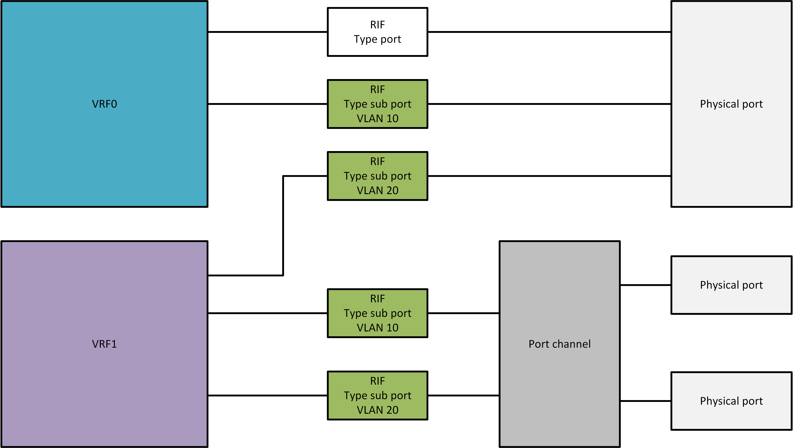
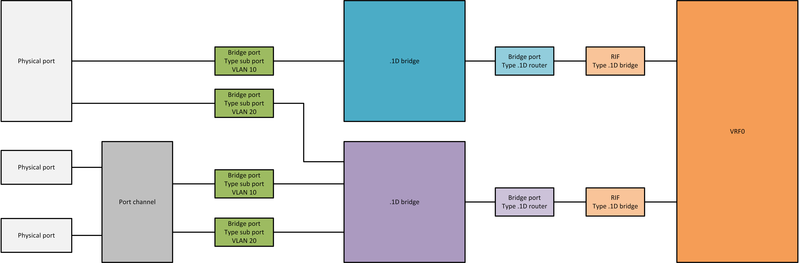
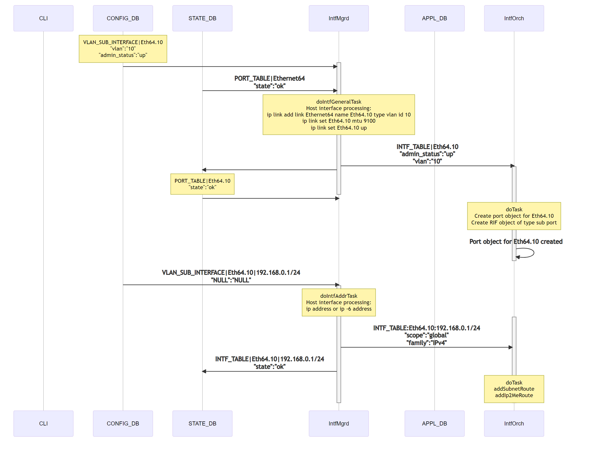
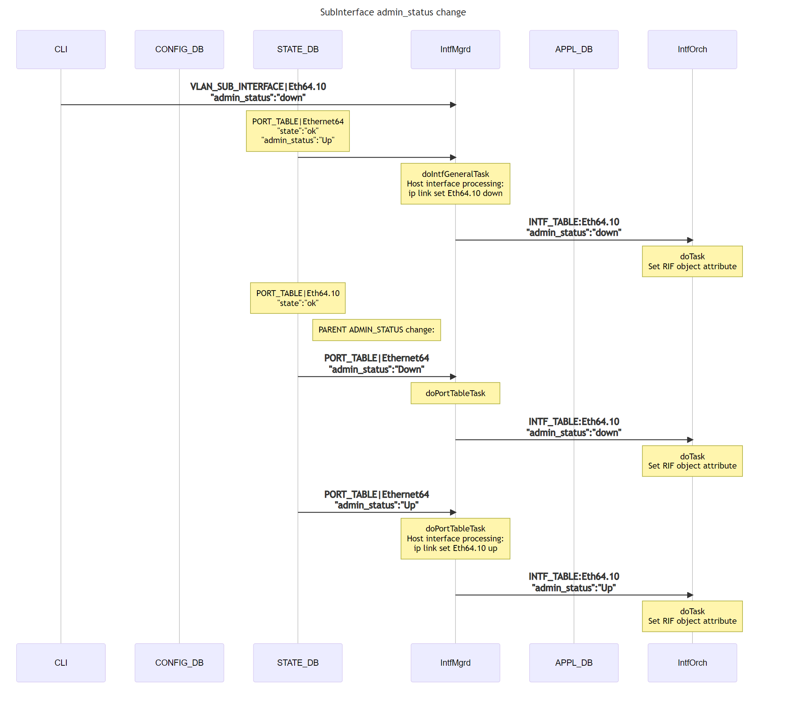
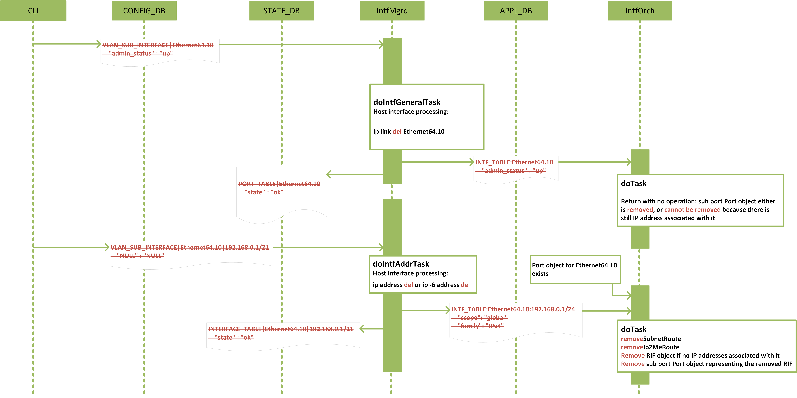
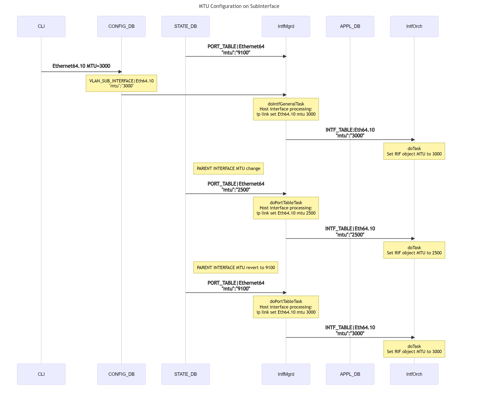
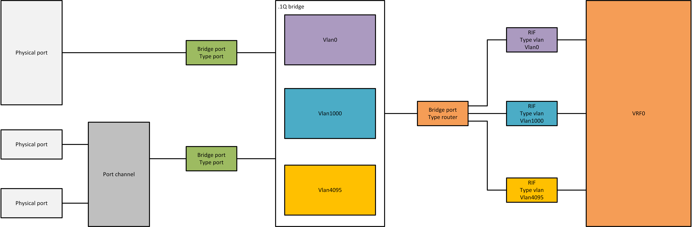

# SONiC sub port interface high level design

# Table of Contents
<!-- TOC -->

  * [Revision history](#revision-history)
  * [Scope](#scope)
  * [Acronyms](#acronyms)
  * [1 Requirements](#1-requirements)
  * [2 Schema design](#2-schema-design)
    * [2.1 Configuration](#21-configuration)
        * [2.1.1 Naming Convention for sub-interfaces](#211-naming-convention-for-sub-interfaces)
        * [2.1.2 config_db.json](#211-config-db-json)
        * [2.1.3 CONFIG_DB](#212-config-db)
        * [2.1.4 CONFIG_DB schemas](#213-config-db-schemas)
    * [2.2 APPL_DB](#22-appl-db)
    * [2.3 STATE_DB](#23-state-db)
    * [2.4 SAI](#24-sai)
        * [2.4.1 Create a sub port interface](#241-create-a-sub-port-interface)
        * [2.4.2 Runtime change on sub port interface attributes](#242-runtime-change-on-sub-port-interface-attributes)
            * [2.4.2.1 SAI-supported attributes](#2421-sai-supported-attributes)
            * [2.4.2.2 Set sub port interface admin status](#2422-set-sub-port-interface-admin-status)
        * [2.4.3 Remove a sub port interface](#243-remove-a-sub-port-interface)
    * [2.5 Linux integration](#25-linux-integration)
        * [2.5.1 Host sub port interfaces](#251-host-sub-port-interfaces)
        * [2.5.2 Route, neighbor subsystems](#252-route-neighbor-subsystems)
  * [3 Event flow diagrams](#3-event-flow-diagrams)
    * [3.1 Sub port interface creation](#31-sub-port-interface-creation)
    * [3.2 Sub port interface runtime admin status change](#32-sub-port-interface-runtime-admin-status-change)
    * [3.3 Sub port interface removal](#33-sub-port-interface-removal)
    * [3.4 Sub port MTU Configuration](#34-sub-port-mtu-configuration)
  * [4 CLI](#4-cli)
    * [4.1 Config commands](#41-config-commands)
        * [4.1.1 Config a sub port interface](#411-config-a-sub-port-interface)
        * [4.1.2 Config IP address on a sub port interface](#412-config-ip-address-on-a-sub-port-interface)
        * [4.1.3 Change admin status on a sub port interface](#413-change-admin-status-on-a-sub-port-interface)
    * [4.2 Show commands](#42-show-commands)
  * [5 Warm reboot support](#5-warm-reboot-support)
  * [6 Unit test](#6-unit-test)
    * [6.1 Sub port interface creation](#61-sub-port-interface-creation)
        * [6.1.1 Create a sub port interface](#611-create-a-sub-port-interface)
        * [6.1.2 Add an IP address to a sub port interface](#612-add-an-ip-address-to-a-sub-port-interface)
    * [6.2 Sub port interface admin status change](#62-sub-port-interface-admin-status-change)
    * [6.3 Sub port interface removal](#63-sub-port-interface-removal)
        * [6.3.1 Remove an IP address from a sub port interface](#631-remove-an-ip-address-from-a-sub-port-interface)
        * [6.3.2 Remove all IP addresses from a sub port interface](#632-remove-all-ip-addresses-from-a-sub-port-interface)
        * [6.3.3 Remove a sub port interface](#633-remove-a-sub-port-interface)
  * [7 Scalability](#7-scalability)
  * [8 upgrade and downgrade considerations](#8-upgrade-and-downgrade-considerations)
  * [9 Appendix](#9-appendix)
    * [9.1 Difference between a sub port interface and a vlan interface](#91-difference-between-a-sub-port-interface-and-a-vlan-interface)
  * [10 API Library](#10-api-library)
    * [10.1 SWSS CPP Library](#101-swss-cpp-library)
    * [10.2 Python Library](#102-python-library)
  * [11 Open questions](#11-open-questions)
  * [12 Acknowledgment](#12-acknowledgment)
  * [13 References](#13-references)

<!-- /TOC -->

# Revision history
| Rev |    Date     |       Author       | Change Description                                      |
|:---:|:-----------:|:------------------:|---------------------------------------------------------|
| 0.1 | 07/01/2019  | Wenda Ni           | Initial version                                         |
| 0.2 | 12/17/2020  | Broadcom           | Subinterface naming convention changes and enhancements |

# Scope
A sub port interface is a logical interface that can be created on a physical port or a port channel.
A sub port interface serves as an interface to either a .1D bridge or a VRF, but not both.
This design focuses on the use case of creating a sub port interface on a physical port or a port channel and using it as a router interface to a VRF as shown in Fig. 1.


__Fig. 1: Sub port router interface__

Multiple L3 sub port interfaces, each characterized by a VLAN id in the 802.1q tag, can be created on a physical port or a port channel.
Sub port interfaces attaching to the same physical port or port channel can interface to different VRFs, though they share the same VLAN id space and must have different VLAN ids.
Sub port interfaces attaching to different physical ports or port channels can use the same VLAN id, even when they interface to the same VRF.
However, there is no L2 bridging between these sub port interfaces; each sub port interface is considered to stay in a separate bridge domain.

This design does NOT cover the case of creating and using sub port as a bridge port to a .1D bridge shown in Fig. 2.


__Fig. 2: Sub port bridge port__

# Acronyms
| Acronym                  | Description                                |
|--------------------------|--------------------------------------------|
| VRF                      | Virtual routing and forwarding             |
| RIF                      | Router interface                           |

# 1 Requirements

Manage the life cycle of a sub port interface created on a physical port or a port channel and used as a router interface to a VRF:
* Creation with the specified dot1q vlan id encapsulation
* Runtime admin status change
* Removal

A sub port interface shall support the following features:
* L3 forwarding (both unicast and multicast)
* BGP
* ARP and NDP
* VRF
* RIF counters
* QoS setting inherited from parent physical port or port channel
* MTU: 
  MTU of the subinterface is inherited from the parent interface (physical or portchannel)
  If subinterface MTU is configured, MTU on subinterface will be configured with:
  - If Subinterface MTU <= parent port MTU, configured subinterface MTU will be applied.
  - If Subinterface MTU > parent port MTU, parent port MTU will be applied.
* Per sub port interface admin status config
  - Kernel subinterface netdev admin UP can be performed only if parent interface netdev is admin UP.
    Hence subinterface admin UP is performed only after parent interface is admin UP.

# 2 Schema design

We introduce a new table "VLAN_SUB_INTERFACE" in the CONFIG_DB to host the attributes of a sub port interface.
For APPL_DB and STATE_DB, we do not introduce new tables for sub port interfaces, but reuse existing tables to host sub port interface keys.

## 2.1 Configuration
### 2.1.1 Naming Convention for sub-interfaces:

Since Kernel has netdevice name length restriction to 15, Physical sub-interfaces(in case interface number > 99) and port channel sub-interfaces cannot follow the same nomenclature as physical interfaces.
Hence short name convention needs to be supported for subinterfaces.

All DB & kernel netdevice corresponding to the sub-interface will be created based on user configuration. 
- If user configures subinterfaces in short name format, all DB & kernel netdevices will be created in short name format. 
- If user configures subinterfaces in existing long name format, all DB & netdevices will be created with existing long name format. 

Short naming conventions for sub-interfaces will have Ethxxx.yyyy, Poxxx.yyyy format.
Long naming conventions for sub-interfaces will have Ethernetxx.yyyy. 
Physical subinterfaces on interface number exceeding 2 digits and PortChannel subinterfaces in long name format were not supported earlier and will NOT be supported due to name length restriction.

Intfmgrd & IntfsOrch which manages sub-interfaces should be aware of this mapping to get parent interface properties.

SWSS CPP library & Click Python API library will be provided to perform short name to long name conversion and vice versa.
Please refer to the API library section for details.

All click config CLIs for sub-interfaces will be enhanced to accept both long name & short name format for subinterfaces.

### 2.1.2 config_db.json
```
"VLAN_SUB_INTERFACE": {
    "{{ port_name }}.{{ subinterface_id }}": {
        "vlan" : <1-4094>,
        "admin_status" : "{{ adminstatus }}",
        "vrf_name" : <vrf-name>
    },
    "{{ port_name }}.{{ subinterface_id }}|{{ ip_prefix }}": {}
},
```
A key in the VLAN_SUB_INTERFACE table is the name of a sub port, which consists of two sections delimited by a "." (symbol dot).
The section before the dot is the name of the parent physical port or port channel. The section after the dot is a unique number which uniquely identifies the sub-interface on the parent interface. 
Sub-interface id value represents vlan id in long name format. 
Sub-interface id value in short name format uniqeuly identifies subinterface under the parent interface. It can be in range 1-99999999(Subinterface ID cannot exceed 8 digits).

vlan field is applicable only for short name format subinterfaces.
vlan field identifies the vlan to which the sub-interface is associated using .1Q trunking.
Note that subinterface_id and vlan_id for a subinterface can be different in short name format.

In Click CLI, user will be able to configure the vlan id associated with the sub-interface in short name format.
In existing long name format Sub-interface id is used as vlan id.

admin_status of a sub port interface can be either up or down.
In the case field "admin_status" is absent in the config_db.json file, a sub port interface is set admin status up by default at its creation.

Example configuration:
```
"VLAN_SUB_INTERFACE": {
    "Ethernet0.100": {
        "admin_status" : "up"
    },
    "Ethernet0.100|192.0.0.1/21": {},
    "Ethernet0.100|fc0a::/112": {}
    "Eth64.10": {
        "vlan" : 100,
        "admin_status" : "up"
    },
    "Eth64.10|192.168.0.1/21": {},
    "Eth64.10|fc00::/7": {}
},
```

### 2.1.3 CONFIG_DB
```
VLAN_SUB_INTERFACE|{{ port_name }}.{{ subinterface_id }}
    "vlan" : "{{ vlan-id }}"
    "admin_status" : "{{ adminstatus }}"

VLAN_SUB_INTERFACE|{{ port_name }}.{{ subinterface_id }}|{{ ip_prefix }}
    "NULL" : "NULL"
```

### 2.1.4 CONFIG_DB schemas
```
; Defines for sub port interface configuration attributes
key             = VLAN_SUB_INTERFACE|subif_name      ; subif_name is the name of the sub port interface

; subif_name annotations
subif_name      = port_name "." subinterface_id         ; port_name is the name of parent physical port or port channel
                                                ; In short name format subinterface_id is DIGIT 1-99999999
                                                ; In long name format subinterface_id is vlan id.

; field         = value
admin_status    = up / down                     ; admin status of the sub port interface

; field = value
vlan = <1-4094>                              ; Vlan id in range <1-4094>

; field = value
vrf_name = <vrf-name>                           ; Name of the Vrf
```

```
; Defines for sub port interface configuration attributes
key             = VLAN_SUB_INTERFACE|subif_name|IPprefix     ; an instance of this key will be repeated for each IP prefix

IPprefix        = IPv4prefix / IPv6prefix               ; an instance of this key/value pair will be repeated for each IP prefix

IPv4prefix      = dec-octet "." dec-octet "." dec-octet "." dec-octet "/" %d1-32
dec-octet       = DIGIT                 ; 0-9
                 / %x31-39 DIGIT        ; 10-99
                 / "1" 2DIGIT           ; 100-199
                 / "2" %x30-34 DIGIT    ; 200-249
                 / "25" %x30-35         ; 250-255

IPv6prefix      =                             6( h16 ":" ) ls32
                 /                       "::" 5( h16 ":" ) ls32
                 / [               h16 ] "::" 4( h16 ":" ) ls32
                 / [ *1( h16 ":" ) h16 ] "::" 3( h16 ":" ) ls32
                 / [ *2( h16 ":" ) h16 ] "::" 2( h16 ":" ) ls32
                 / [ *3( h16 ":" ) h16 ] "::"    h16 ":"   ls32
                 / [ *4( h16 ":" ) h16 ] "::"              ls32
                 / [ *5( h16 ":" ) h16 ] "::"              h16
                 / [ *6( h16 ":" ) h16 ] "::"
h16             = 1*4HEXDIG
ls32            = ( h16 ":" h16 ) / IPv4address
```

Example:
```
VLAN_SUB_INTERFACE|Ethernet0.100
    "admin_status" : "up"

VLAN_SUB_INTERFACE|Ethernet0.100|192.0.0.1/21
    "NULL" : "NULL"

VLAN_SUB_INTERFACE|Ethernet0.100|fc0a::/112
    "NULL" : "NULL"

VLAN_SUB_INTERFACE|Eth64.10
    "vlan" : 100,
    "admin_status" : "up"

VLAN_SUB_INTERFACE|Eth64.10|192.168.0.1/21
    "NULL" : "NULL"

VLAN_SUB_INTERFACE|Eth64.10|fc00::/7
    "NULL" : "NULL"
```

## 2.2 APPL_DB
```
INTF_TABLE:{{ port_name }}.{{ subinterface_id }}
    "vlan" : "{{ vlan id }}"
    "admin_status" : "{{ adminstatus }}"

; field         = value
admin_status    = up / down             ; admin status of the sub port interface

; field = value
vlan = <1-4094>                      ; Vlan id in range <1-4094>

; field = value
vrf_name = <vrf-name>                   ; Name of the Vrf

INTF_TABLE:{{ port_name }}.{{ vlan_id }}:{{ ip_prefix }}
    "scope" : "{{ visibility_scope }}"
    "family": "{{ address_family }}"

; field         = value
scope           = global / local        ; local is an interface visible on this localhost only
family          = IPv4 / IPv6           ; address family
```

Example:
```
INTF_TABLE:Ethernet0.100
    "admin_status" : "up"

INTF_TABLE:Ethernet0.100:192.0.0.1/24
    "scope" : "global"
    "family": "IPv4"

INTF_TABLE:Ethernet0.100:fc0a::/112
    "scope" : "global"
    "family": "IPv6"

INTF_TABLE:Eth64.10
    "vlan" : 100
    "admin_status" : "up"

INTF_TABLE:Eth64.10:192.168.0.1/24
    "scope" : "global"
    "family": "IPv4"

INTF_TABLE:Eth64.10:fc00::/7
    "scope" : "global"
    "family": "IPv6"
```

## 2.3 STATE_DB

Following the current schema, sub port interface state of a physical port is set to the PORT_TABLE, while sub port interface state of a port channel is set to the LAG_TABLE.
```
PORT_TABLE|{{ port_name }}.{{ subinterface_id }}
    "state" : "ok"
```
```
LAG_TABLE|{{ port_name }}.{{ subinterface_id }}
    "state" : "ok"
```
```
INTERFACE_TABLE|{{ port_name }}.{{ subinterface_id }}|{{ ip_prefix }}
    "state" : "ok"
```

Example:
```
PORT_TABLE|Ethernet0.100
    "state" : "ok"
```
```
INTERFACE_TABLE|Ethernet0.100|192.0.0.1/21
    "state" : "ok"
```
```
INTERFACE_TABLE|Ethernet0.100|fc0a::/112
    "state" : "ok"
```

```
PORT_TABLE|Eth64.10
    "state" : "ok"
```
```
INTERFACE_TABLE|Eth64.10|192.168.0.1/21
    "state" : "ok"
```
```
INTERFACE_TABLE|Eth64.10|fc00::/7
    "state" : "ok"
```

## 2.4 SAI
SAI attributes related to a sub port interface are listed in the Table below.

| SAI attributes                                   | attribute value/type                         |
|--------------------------------------------------|----------------------------------------------|
| SAI_ROUTER_INTERFACE_ATTR_VIRTUAL_ROUTER_ID      | VRF oid                                      |
| SAI_ROUTER_INTERFACE_ATTR_TYPE                   | SAI_ROUTER_INTERFACE_TYPE_SUB_PORT           |
| SAI_ROUTER_INTERFACE_ATTR_PORT_ID                | parent physical port or port channel oid     |
| SAI_ROUTER_INTERFACE_ATTR_OUTER_VLAN_ID          | VLAN id (sai_uint16_t)                       |
| SAI_ROUTER_INTERFACE_ATTR_SRC_MAC_ADDRESS        | MAC address                                  |
| SAI_ROUTER_INTERFACE_ATTR_MTU                    | mtu size                                     |

### 2.4.1 Create a sub port interface
```
sai_attribute_t sub_intf_attrs[6];

sub_intf_attrs[0].id = SAI_ROUTER_INTERFACE_ATTR_VIRTUAL_ROUTER_ID;
sub_intf_attrs[0].value.oid = vrf_oid;

sub_intf_attrs[1].id = SAI_ROUTER_INTERFACE_ATTR_TYPE;
sub_intf_attrs[1].value.s32 = SAI_ROUTER_INTERFACE_TYPE_SUB_PORT;

sub_intf_attrs[2].id = SAI_ROUTER_INTERFACE_ATTR_PORT_ID;
sub_intf_attrs[2].value.oid = parent_port_oid;  /* oid of the parent physical port or port channel */

sub_intf_attrs[3].id = SAI_ROUTER_INTERFACE_ATTR_OUTER_VLAN_ID;
sub_intf_attrs[3].value.u16 = 10;

sai_mac_t mac = {0x00, 0xe0, 0xec, 0xc2, 0xad, 0xf1};
sub_intf_attrs[4].id = SAI_ROUTER_INTERFACE_ATTR_SRC_MAC_ADDRESS;
memcpy(sub_intf_attrs[4].value.mac, mac, sizeof(sai_mac_t));

sub_intf_attrs[5].id = SAI_ROUTER_INTERFACE_ATTR_MTU;
sub_intf_attrs[5].value.u32 = 9100;

uint32_t sub_intf_attrs_count = 6;
sai_status_t status = create_router_interface(&rif_id, switch_oid, sub_intf_attrs_count, sub_intf_attrs);
```

### 2.4.2 Runtime change on sub port interface attributes
#### 2.4.2.1 SAI-supported attributes
The following attributes are supported in SAI spec to be changed at run time.

| SAI attributes                                        | attribute value/type                         |
|-------------------------------------------------------|----------------------------------------------|
| SAI_ROUTER_INTERFACE_ATTR_ADMIN_V4_STATE              | true / false                                 |
| SAI_ROUTER_INTERFACE_ATTR_ADMIN_V6_STATE              | true / false                                 |
| SAI_ROUTER_INTERFACE_ATTR_SRC_MAC_ADDRESS             | MAC address                                  |
| SAI_ROUTER_INTERFACE_ATTR_MTU                         | mtu size                                     |
| SAI_ROUTER_INTERFACE_ATTR_INGRESS_ACL                 | ACL table or ACL table group oid             |
| SAI_ROUTER_INTERFACE_ATTR_EGRESS_ACL                  | ACL table or ACL table group oid             |
| SAI_ROUTER_INTERFACE_ATTR_V4_MCAST_ENABLE             | true / false                                 |
| SAI_ROUTER_INTERFACE_ATTR_V6_MCAST_ENABLE             | true / false                                 |
| SAI_ROUTER_INTERFACE_ATTR_NEIGHBOR_MISS_PACKET_ACTION | sai_packet_action_t                          |
| SAI_ROUTER_INTERFACE_ATTR_LOOPBACK_PACKET_ACTION      | sai_packet_action_t                          |


#### 2.4.2.2 Set sub port interface admin status
```
sai_attribute_t sub_intf_attr;

sub_intf_attr.id = SAI_ROUTER_INTERFACE_ATTR_ADMIN_V4_STATE;
sub_intf_attr.value.booldata = false;
sai_status_t status = set_router_interface_attribute(rif_id, &attr);

sub_intf_attr.id = SAI_ROUTER_INTERFACE_ATTR_ADMIN_V6_STATE;
sub_intf_attr.value.booldata = false;
sai_status_t status = set_router_interface_attribute(rif_id, &attr);
```

### 2.4.3 Remove a sub port interface
```
sai_status_t status = remove_router_interface(rif_id);
```

## 2.5 Linux integration
### 2.5.1 Host sub port interfaces

Inside SONiC, we use iproute2 package to manage host sub port interfaces.
Specifically, we use `ip link add link <parent_port_name> name <subif_name> type vlan id <vlan_id>` to create a host sub port interface.
This command implies the dependency that a parent host interface must be created before the creation of a host sub port interface.

Example:
```
ip link add link Ethernet0 name Ethernet0.100 type vlan id 100
ip link set Ethernet0.100 mtu 9100
ip link set Ethernet0.100 up
ip link add link Ethernet64 name Eth64.10 type vlan id 100
ip link set Eth64.10 mtu 9100
ip link set Eth64.10 up
```
```
ip link del Ethernet0.100
ip link del Eth64.10
```

We use `ip address` and `ip -6 address` to add and remove ip adresses on a host sub port interface.

Example:
```
ip address add 192.0.0.1/24 dev Ethernet0.100
ip address add 192.168.0.1/24 dev Eth64.10
```

Please note that the use of iproute2 package is internal to SONiC, specifically IntfMgrd.
Users should always use SONiC CLIs defined in Section 4 to manage sub port interfaces in order to have an event flowing properly across all components and DBs shown in Section 3.
The direct use of iproute2 commands, e.g., `ip link` and `ip address`, by users are not recommended.

### 2.5.2 Route, neighbor subsystems

Once the host sub port interfaces are properly set, route and neighbor subsystems should function properly on sub port interfaces.
fpmsyncd should receive route add/del updates on sub port interfaces from zebra over TCP socket port 2620. These updates are received in the format of netlink messages.
neighsyncd should receive neigh add/del netlink messages on sub port interfaces from its subscription to the neighbor event notification group RTNLGRP_NEIGH.

Internally, a sub port interface is represented as a Port object to be perceived seamlessly by NeighOrch and RouteOrch to create neighor and route entries, respectively, on it.


# 3 Event flow diagrams
## 3.1 Sub port interface creation


* Field vlan added to config_db carries vlan id associated to the subinterface.
* Sub Interface will be created and treated ready only if vlan corresponding to subinterface is configured.

## 3.2 Sub port interface runtime admin status change


Admin status of the subinterface is tied to its parent interface admin status:
* Kernel does not allow subinterface netdev UP until its parent netdev is UP.
* IntfMgrd looks up the admin status of parent interface from STATE_DB|PORT_TABLE.
    - OP: admin UP of subinterface: If Parent interface is admin UP, subinterface admin UP is performed.
    - OP: admin down of subinterface: No dependency on parent interface admin status. Subinterface admin down performed.
* IntfMgrd also subscribes to STATE_DB|PORT_TABLE and APPL_DB|LAG_TABLE for parent interface admin status change to update associated subinterface admin status.

## 3.3 Sub port interface removal


## 3.4 Sub port MTU Configuration


MTU on subinterface has dependency on MTU configured on parent interface.

* Kernel does not allow subinterface netdev MTU to exceed its parent netdev MTU.
* By default kernel inherits subinterface netdev MTU from parent netdev.
* If Parent netdev MTU is updated to lower value than any of its subinterface netdev MTU, kernel updates subinterface netdev MTU to parent netdev MTU. But, kernel does NOT restore previous subinterface MTU if parent netdev MTU is configured > subinterface MTU.

To solve above dependency:

* Whenever MTU is updated on subinterface
    - If configured MTU <= Parent MTU, update subinterface MTU.
    - If configured MTU > Parent interface MTU, do not update subinterface MTU and cache the configured MTU.
* IntfMgrd subscribes to STATE_DB|PORT_TABLE & APPL_DB|LAG_TABLE.
    - If Parent interface MTU is changed to < subinterface MTU, APPL_DB|INTF_TABLE for subinterface is updated to parent interface MTU.
    - If Parent interface MTU is changed to > subinterface MTU, update subinterface MTU to user configured subinterface MTU.

# 4 CLIs
## 4.1 Config commands
### 4.1.1 Config a sub port interface
`subinterface` command category is introduced to the `config` command.

```
Usage: config [OPTIONS] COMMAND [ARGS]...

  SONiC command line - 'config' command

Options:
  --help  Show this message and exit.

Commands:
  ...
  subinterface           Sub-port-interface-related configuration tasks
```

`add` and `del` commands are supported on a sub port interface.
```
Usage: config subinterface [OPTIONS] COMMAND [ARGS]...

  Sub-port-interface-related configuration tasks

Options:
  --help    Show this message and exit.

Commands:
  add       Add a sub port interface
  del       Remove a sub port interface
```
```
Usage: config subinterface add <sub_port_interface_name> [vlan <1-4094>]
```
```
Usage: config subinterface del <sub_port_interface_name>
```

### 4.1.2 Config IP address on a sub port interface
Once a sub port interface is added, existing `config interface ip` is used to `add` or `del` ip address on it.
```
Usage: config interface ip [OPTIONS] COMMAND [ARGS]...

  Add or remove IP address

Options:
  --help    Show this message and exit.

Commands:
  add       Add an IP address towards the interface
  del       Remove an IP address from the interface
```
```
Usage: config interface ip add <sub_port_interface_name> <ip_addr>
```
```
Usage: config interface ip del <sub_port_interface_name> <ip_addr>
```

### 4.1.3 Change admin status on a sub port interface
Current `config interface startup` and `shutdown` commands are extended to sub port interfaces to set admin status up and down, respectively, on a sub port interface.
```
Usage: config interface startup [OPTIONS] <interface_name>

  Start up interface

Options:
  --help    Show this message and exit.
```
```
Usage: config interface shutdown [OPTIONS] <interface_name>

  Shut down interface

Options:
  --help    Show this message and exit.
```
```
Usage: config interface startup <sub_port_interface_name>
```
```
Usage: config interface shutdown <sub_port_interface_name>
```

## 4.2 Show commands
```
Usage: show subinterfaces [OPTIONS] COMMAND [ARGS]...

  Show details of the sub port interfaces

Options:
  -?, -h, --help  Show this message and exit.

Commands:
  status       Show sub port interface status information
```
Example:
```
Sub port interface    Speed    MTU    Vlan    Admin                 Type
------------------  -------  -----  ------  -------  -------------------
     Eth64.10          100G   9100    100       up  dot1q-encapsulation
     Ethernet0.100     100G   9100    100       up  dot1q-encapsulation
```
No operational status is defined on RIF (sub port interface being a type of RIF) in SAI spec.

# 5 Warm reboot support
There is no special runtime state that needs to be kept for sub port interfaces.
This said, current warm reboot infrastructure shall support sub port interfaces naturally without the need for additional extension.
This is confirmed by preliminary trials on a Mellanox device.

# 6 Unit test
## 6.1 Sub port interface creation
Test shall cover the parent interface being a physical port or a port channel.

### 6.1.1 Create a sub port interface
| Test case description                                                                                  |
|--------------------------------------------------------------------------------------------------------|
| Verify that sub port interface configuration is pushed to CONIFG_DB VLAN_SUB_INTERFACE table           |
| Verify that sub port interface configuration is synced to APPL_DB INTF_TABLE by Intfmgrd               |
| Verify that sub port interface state ok is pushed to STATE_DB by Intfmgrd                              |
| Verify that a sub port router interface entry is created in ASIC_DB                                    |

### 6.1.2 Add an IP address to a sub port interface
Test shall cover the IP address being an IPv4 address or an IPv6 address.

| Test case description                                                                                  |
|--------------------------------------------------------------------------------------------------------|
| Verify that ip address configuration is pushed to CONIFG_DB VLAN_SUB_INTERFACE table                   |
| Verify that ip address configuration is synced to APPL_DB INTF_TABLE by Intfmgrd                       |
| Verify that ip address state ok is pushed to STATE_DB INTERFACE_TABLE by Intfmgrd                      |
| Verify that a subnet route entry is created in ASIC_DB                                                 |
| Verify that an ip2me route entry is created in ASIC_DB                                                 |

## 6.2 Sub port interface admin status change
| Test case description                                                                                  |
|--------------------------------------------------------------------------------------------------------|
| Verify that sub port interface admin status change is pushed to CONIFG_DB VLAN_SUB_INTERFACE table     |
| Verify that sub port interface admin status change is synced to APPL_DB INTF_TABLE by Intfmgrd         |
| Verify that sub port router interface entry in ASIC_DB has the updated admin status                    |

## 6.3 Sub port interface removal
### 6.3.1 Remove an IP address from a sub port interface
Test shall cover the IP address being an IPv4 address or an IPv6 address.

| Test case description                                                                                  |
|--------------------------------------------------------------------------------------------------------|
| Verify that ip address configuration is removed from CONIFG_DB VLAN_SUB_INTERFACE table                |
| Verify that ip address configuration is removed from APPL_DB INTF_TABLE by Intfmgrd                    |
| Verify that ip address state ok is removed from STATE_DB INTERFACE_TABLE by Intfmgrd                   |
| Verify that subnet route entry is removed from ASIC_DB                                                 |
| Verify that ip2me route entry is removed from ASIC_DB                                                  |

### 6.3.2 Remove all IP addresses from a sub port interface
| Test case description                                                                                  |
|--------------------------------------------------------------------------------------------------------|
| Verify that sub port router interface entry is removed from ASIC_DB                                    |

### 6.3.3 Remove a sub port interface
Test shall cover the parent interface being a physical port or a port channel.

| Test case description                                                                                  |
|--------------------------------------------------------------------------------------------------------|
| Verify that sub port interface configuration is removed from CONIFG_DB VLAN_SUB_INTERFACE table        |
| Verify that sub port interface configuration is removed from APPL_DB INTF_TABLE by Intfmgrd            |
| Verify that sub port interface state ok is removed from STATE_DB by Intfmgrd                           |

# 7 Scalability
Scalability is ASIC-dependent.
We enforce a minimum scalability requirement on the number of sub port interfaces that shall be supported on a SONiC switch.

| Name                                                              | Scaling value             |
|-------------------------------------------------------------------|---------------------------|
| Number of sub port interfaces per physical port or port channel   | 250                       |
| Number of sub port interfaces per switch                          | 750                       |

# 8 Upgrade and Downgrade considerations
Since subinterface are supported in existing long name CONFIG_DB format, Upgrade and downgrade will be seamless with no impact to subinterface functionality.

# 9 Appendix
## 9.1 Difference between a sub port interface and a vlan interface
Sub port interface is a router interface (RIF type sub port Vlan#) between a VRF and a physical port or a port channel.
Vlan interface is a router interface (RIF type vlan Vlan#) facing a .1Q bridge. It is an interface between a bridge port type router (connecting to a .1Q bridge) and a VRF, as shown in Fig. 3.


__Fig. 3: Vlan interface__

# 10 API Library
All DB & Kernel netdev corresponding to the subinterface can be created with short name & existing long name format.
Intfmgrd & IntfsOrch which manages sub-interfaces should be able to fetch  parent interface properties for a given subinterface.

## 10.1 SWSS CPP Library
In CPP, applications can use subintf class provided by sonic-swss library to fetch attributes of subinterface.

Subintf class provides below methods:

1. isValid()
This method returns true if the subinterface is valid.
Subinterface will be considered valid if it follows format Ethxxx.yyyy, Poxxx.yyyy & Ethernetxx.yyyy.

2. subIntfIdx()
Returns a subinterface index as an integer type.

3. longName()
Returns subinterface name in longname format.

4. shortName()
Returns subinterface name in shortname format.

5. parentIntfLongName()
Returns parent interface name in longname format.

6. parentIntfShortName()
Returns parent interface in shortname format.


## 10.2 Python Library
In Python, applications can use interface library in utilities_common  to perform conversion to longname or shortname.

1. intf_get_longname()
Returns interface in longname format. 
It returns a longname format for both subinterface and parent interface depending on what argument is being passed.

2. intf_get_shortname()
Returns interface in shortname format. 
It returns a shortname format for both subinterface and parent interface depending on what argument is being passed.


# 11 Open questions:
1. Miss policy to be defined in SAI specification

    When a 802.1q tagged packet is received on a physical port or a port channel, it will go to the sub port interface that matches the VLAN id inside the packet.
    If no sub port interfaces match the VLAN id in the packet tag, what is the default policy on handling the packet?

    As shown in Fig. 1, there is possiblity that a physical port or a port channel may not have a RIF type port created.
    In this case, if an untagged packet is received on the physical port or port channel, what is the policy on handling the untagged packet?

# 12 Acknowledgment
Wenda would like to thank his colleagues with Microsoft SONiC team, Shuotian, Prince, Pavel, and Qi in particular, Itai with Mellanox for all discussions that shape the design proposal, and community members for comments and feedbacks that improve the design.

# 13 References
[1] SAI_Proposal_Bridge_port_v0.9.docx https://github.com/opencomputeproject/SAI/blob/master/doc/bridge/SAI_Proposal_Bridge_port_v0.9.docx

[2] Remove the need to create an object id for vlan in creating a sub port router interface https://github.com/opencomputeproject/SAI/pull/998

[3] Sub port interface schema https://github.com/sonic-net/sonic-swss-common/pull/284

[4] Sub port interface implementation https://github.com/sonic-net/sonic-swss/pull/969

[5] Use dot1p in packet 802.1q tag to map a packet to traffic class (TC) inside a switch pipeline https://github.com/sonic-net/sonic-swss/pull/871; https://github.com/sonic-net/sonic-buildimage/pull/3412; https://github.com/sonic-net/sonic-buildimage/pull/3422

[6] Generate a CONFIG_DB with sub port interface config from minigraph https://github.com/sonic-net/sonic-buildimage/pull/3413

[7] CLI to support sub port interface admin status change https://github.com/sonic-net/sonic-utilities/pull/638

[8] CLI to show subinterfaces status https://github.com/sonic-net/sonic-utilities/pull/642

[8] CLI to add/del ip address on a sub port interface https://github.com/sonic-net/sonic-utilities/pull/651
