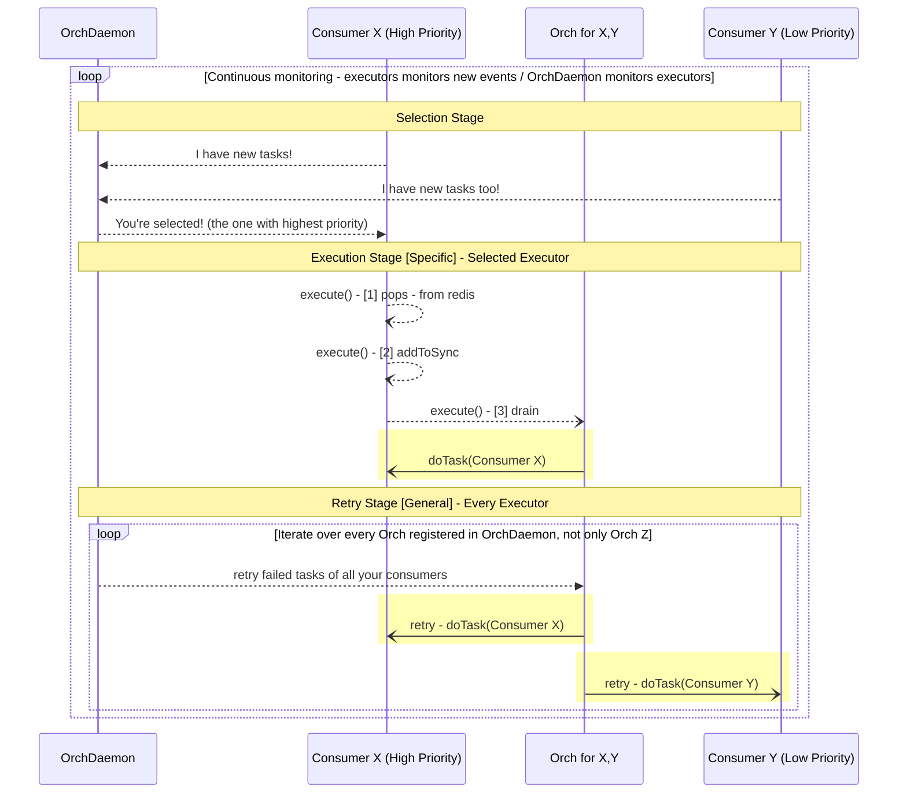
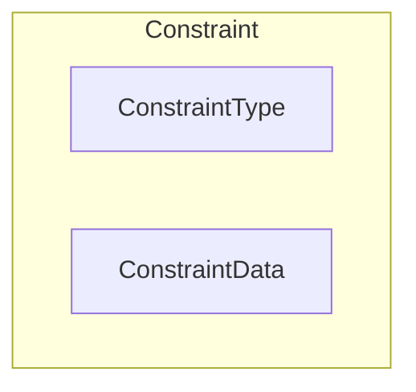
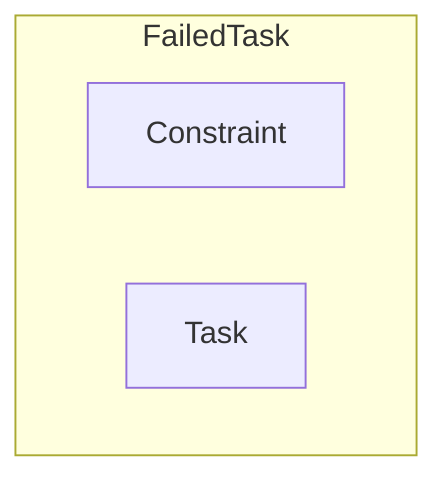
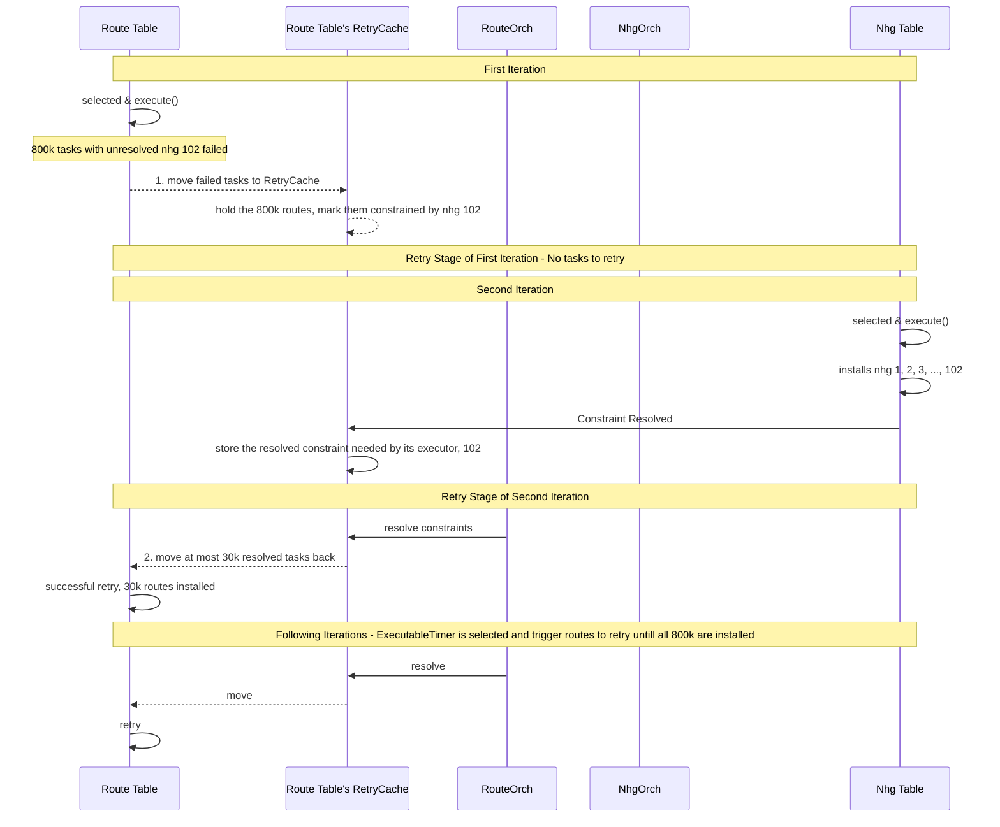

<!-- omit in toc -->
# Consumer Retry Optimization

<!-- omit in toc -->
## Revision

| Rev |   Date     |     Author      |   Change  Description     |
|:---:|:----------:|:---------------:|:-------------------------:|
| 1.0 | 10/03/2024 |   Yijiao Qin    |    Base version           |
<!-- | 1.1 | 09/26/2025 |   Yijiao Qin    |   Adopt multi-map SyncMap | -->

<!-- omit in toc -->
## Table of Contents

- [Overview](#overview)
- [Terminology](#terminology)
- [Problem Statement](#problem-statement)
- [Requirements](#requirements)
- [Context](#context)
- [Constraint Identification](#constraint-identification)
  - [Demo Example](#demo-example)
  - [Constraint Definition](#constraint-definition)
- [Failure Handling](#failure-handling)
  - [FailedTask Definition](#failedtask-definition)
  - [RetryMap](#retrymap)
  - [Separate Failed Tasks](#separate-failed-tasks)
- [Dedicated Agent: RetryCache](#dedicated-agent-retrycache)
  - [On-demand Allocation](#on-demand-allocation)
- [Constraint Resolution](#constraint-resolution)
  - [Notification](#notification)
  - [Check RetryCache During OrchDaemon's Retry Stage](#check-retrycache-during-orchdaemons-retry-stage)
- [Workflow Illustration of Optimized OrchDaemon Event Loop](#workflow-illustration-of-optimized-orchdaemon-event-loop)
- [Logging](#logging)
- [Test](#test)
  - [Check whether the duration of retry decreases](#check-whether-the-duration-of-retry-decreases)
  - [Check the CPU business](#check-the-cpu-business)

## Overview

This doc introduces the implementation of `RetryCache` in sonic-swss module.

This feature optimizes the retry logic of consumer instances when they fail to sync data. The main idea is to analyze the reason of why the task fails, and if it's due to some unsatisfied pre-requisite conditions, we would rather archive it until the constraint gets resolved.

By archiving this kind of failed task into the so-called retry cache, the ochdaemon would not process it during the retry stage.

From the coding perspective, we limit our scope to instances of `ConsumerBase`, which stores pending tasks in a `SyncMap`.

## Terminology

|       Terms              |                  Description            |
| ------------------------ | --------------------------------------- |
| SWSS                     | Switch State Service                    |

## Problem Statement

Consider a use case when millions of BGP routes are learnt in the control plane and sent to swss module for processing. The orchagent needs to validate a route before installing it into the dataplane.

For example, it may check whether the outgoing interface of the route actually exists. The check could fail due to a lot of random factors, for example, there could be some timing issue and the interface creation is not yet completed by SAI, hence can't be detected by swss, or there may be some misconfiguration for the interface. Another example is the next hop check, it checks whether the next hop referred by the route is valid, which could also fail when ARP service fails to resolve the mac address for the destination ip. When these tasks fail, they would not be discarded, but kept where they are (`m_toSync`), waiting for the next try. They would finally go through when their constraints are resolved, for example, ARP service finally resolves the mac, or the device gets created by SAI, in the future.

But this design could bring problems when the failing routes are scaled but stuck in the orchagent's internal store. Currently all the failed tasks gets retried periodically without differentiation, and every incoming event would in the end trigger a global retry for all failed ones. Consider when several events happen before constraints are resolved, each event brings in a global retry process which involves millions of routes. It's such heavy workload and takes lots of cpu cycles but actually makes no sense since the failed routes would not succeed at all since the constraints are still there.

Not only computation resources are wasted, the following events are also affected by the latency since they are blocked and need to wait for the retry in the previous event loop to finish.

## Requirements

Based on the problem stated above, we call for a more sophiscated retry logic, which skips unnecessary retries if they have no chance to succeed.

To achieve this, the orchagent should be able to analyze the failures, determine what its constraint is, track this unsatisfied constraint and make immediate notifications when it gets resolved. It determines one constraint at a time, even though there could be several constraints failing that task.

It should archive the failed tasks, remove them from the `SyncMap`, hence the global retry process would not process them.

Those failed tasks, whose constraints are not determined, are still left in `SyncMap`, following the original retry logic.

Use the stated problem above for example, we want to avoid retrying processing those millions of routes before their outgoing interfaces and mac addresse are resolved. We want to retry these routes immediately when their constraints are resolved.

Summary:

- The system should be robust inserting scaled routes
  - should not affect the normal workflow due to prolonged retry
- Limit the upper bound of duration
  - skip retrying with constraints not yet resolved
    - save CPU cycles
  - throttle the retry for those whose constraints already been resolved
    - avoid starvation
- Detect specific constraints which are predefined
  - identify the constraint for a specific failed task
  - archive them with contexts, for easy restoration
  - identify when the constraint gets resolved
  - make in-time notification of constraint resolution
  - do readable logging for debugging

## Context

`OrchDaemon` repeats its event loop, once started.

The workflow per iteration consists of 3 stages as illustrated below:

1. Selection stage
   - select an executor who has new events
2. Execution stage ***[specific to the selected executor]***
   - the selected executor parsed events and stores them into its `SyncMap` as tasks, then executes those tasks, removing successful ones while keeping those failed.
3. Retry stage ***[general for all executors]***
   - all executors retry pending tasks, takes long with too much failure.

<br>



## Constraint Identification

### Demo Example

- let's dispatch a task to set the next hop group of `x.x.x.x/x` to be "1", but nhg 1 doesn't exist at the moment.

### Constraint Definition

When a task fails, it's important to understand why, and identify the constraint.

In this example, the task fails because the route refers to an invalid next hop group. The task would always fail no matter how often you retry it, unless this nhg constraint is resolved, when `nhgorch` successfully installs nhg 1.

Hence we define 3 customized c++ types:

- `enum ConstraintType`
  - for example, nhg missing is a type of constraint
- `ConstraintData`
  - for example, it specifies which nhg constraints the task to succeed
- `Constraint`
  - which is a pair consisting of `ConstraintType` and `ConstraintData`



In the demo example, we code the constraint into the below variable:

```c
Constraint demo_cst = std::make_pair(RETRY_CST_NHG, "1");
```

## Failure Handling

### FailedTask Definition

  Every task is `KeyOpFieldsValuesTuple` defined in `libswsscommon`, from the perspective of SWSS module.

- we can print the demo task (installing route x.x.x.x/x with nhg 1) as:

  ```c
  ROUTE_TABLE:x.x.x.x/x | SET | nexthop_group:1
  ```

- ***key***: `ROUTE_TABLE:x.x.x.x/x`
- ***op***: `SET`
- ***FV tuples***: `nexthop_group:1`

Now we define a new type ***`FailedTask`***, which combines the task with its constraint:

  ```c++
  using Task = swss::KeyOpFieldsValuesTuple;
  using FailedTask = std::pair<Constraint, Task>;

  Constraint cst = std::make_pair(RETRY_CST_NHG, "1");

  FailedTask ftask = std::make_pair(cst, task);
  ```



### RetryMap

SWSS orchagent `routeorch` has its dedicated consumer to process route tasks. Our demo task would be added into this consumer's local store, `m_toSync`. To achieve a quick query, `m_toSync` is designed to be a map, which indexes tasks by keys. Hence, the demo task is stored in `m_toSync` as below:
<p align="center">

</p>

However, `m_toSync` doesn't distinguish

- new tasks in this run
- failed tasks from the previous run

Now we add a new field `m_toRetry`, to dedicatedly store failed tasks, with its type as `RetryMap`.

<p align="center">

</p>

p.s. `m_toRetry` maps a task key to a `FailedTask`, while a `m_toSync` maps a key to a regular `Task`.

|          | Customized C++ Type   |  Map Key  |  Map Value         |
| :-------:|:-------: | :--- | :------------- |
| m_toSync | SyncMap |  KEY(`std::string`)  | Task (`swss::KeyOpFieldsValuesTuple`)     |
| m_toRetry| RetryMap|  KEY(`std::string`)  | FailedTask(`std::pair<Constraint, Task>`)|

### Separate Failed Tasks

When a consumer loops over tasks in `m_toSync` to executes them one by one, it either successfully processes and erases it, or finds something wrong and thus leaving it in `m_toSync` as it is, then continue to the next.

***New Behavior of Failure Handling:***

- move the task from `m_toSync` to `m_toRetry`
- and move it back only if its constraint is resolved and ready to retry

By doing so, when the consumer later gets selected by orchdaemon, its `m_toSync` are free of previous legacies whose constraints are unresolved and should not be retried.

The task would be stored in `m_toRetry` as the entry below:

|   Key  |  Value         |
| :---: | :-------------: |
|`ROUTE_TABLE:x.x.x.x/x`| `(RETRY_CST_NHG, "1")`, `ROUTE_TABLE:x.x.x.x/x\| SET \|nexthop_group:1`|

So that we can

- access the task and its constraint in O(1)
- delete a task in O(1), given a task key:
  - use the key to pop the task from `m_toRetry`
  - use the popped constraint to delete the task key from `m_retryKeys`

## Dedicated Agent: RetryCache

We define the new class `RetryCache` in retrycache.h

- which serves as an agent for a consumer to
  - store failed tasks and constraints
- `m_toRetry` implements the quick task look-up
  - O(1), given the task key
- `m_retryKeys` implements quick constraint resolution
  - O(1) look-up for the set of related tasks, given a constraint
- implements quick deletion in both maps, given a task
  - O(1) look-up in `m_toRetry` using task key
    - find the constraint stored in `FailedTask` entry in `m_toRetry`
  - O(1) look-up in `m_retryKeys` using the retrieved constraint
- `m_resolvedConstraints` decouples resolution notification and actual retry process
  - when notified of the resolution, add the constraint into the set
  - when OrchDaemon enters retry stage, loop over the set and retry resolved tasks

<p align="center">

</p>

### On-demand Allocation

Orchagent could allocate a retry cache for a consumer on demand, during the initialization process, and maintain them by `m_retryCaches`, similar to `m_consumerMap`.

For orchagent, similar to access `ConsumerBase` with executor name by quering `m_consumerMap`, now it could also access a retry cache by the executor name with `m_retryCaches`.

If a task fails, orchagent identifies the constraint and moves the task from its consumer's `m_toSync` to the corresponding retry cache's `m_toRetry`, the two maps are indeed linked together by the executor name.

<p align="center">

</p>

Since every consumer could access its orchagent, now it could access its retry cache via its orchagent.

Now for a consumer, its pending tasks are distributed in two different maps:

- new or resolved tasks in `m_toSync`
- failed tasks with unresolved constraints in `m_toRetry`

## Constraint Resolution

### Notification

The resolution happens during the execution stage.

For example, when `nhgorch` successfully installs nhg 1, it resolves the constraint for `routeorch`'s tasks depending on nhg 1. `nhgorch` should notify `routeorch` of this resolution.

`nhgorch` has no idea about which nhg is needed by others, so it notifies on every successful nhg installment.

`routeorch` receives the notifications, and gets the route table executor's retrycache to check whether there are tasks affected by this constraint. If no, it ignores this notification. Otherwise, it adds this constraint into the route table executor's `m_resolvedConstraints`.

The route table executor only marks the constraint as resolved but doesn't retry tasks right now, since it's still in nhg executor's execution stage.

### Check RetryCache During OrchDaemon's Retry Stage

In the original design, OrchDaemon drains all tables in the retry stage.

***New:*** OrchDaemon checks the executors' retrycaches, move resolved tasks back to m_toSync, then drains.

To avoid blocking, we set a threshold [30k] for number of tasks moved back to `m_toSync`.

- Below attached the logs of installing 800k routes referring to nhg 102 with nhg 102 missing.
- These routes get retried after nhgorch installs nhg 102.
- `routeorch` retries 30k routes in the retry stage of each iteration.
- Only the ExecutableTimer instance gets selected every 1 second, hence the retry stage happens about once per second, we coud thus see routes are retried every 1 second.

```c++
2024-09-30.23:56:27.579214| (RETRY_CST_NHG, 102) resolution notified -> 800000 tasks
2024-09-30.23:56:27.600488| (RETRY_CST_NHG, 102) | ROUTE_TABLE | 30000 retried
2024-09-30.23:56:29.189674| (RETRY_CST_NHG, 102) | ROUTE_TABLE | 30000 retried
2024-09-30.23:56:30.184353| (RETRY_CST_NHG, 102) | ROUTE_TABLE | 30000 retried
2024-09-30.23:56:31.177945| (RETRY_CST_NHG, 102) | ROUTE_TABLE | 30000 retried
2024-09-30.23:56:32.034060| (RETRY_CST_NHG, 102) | ROUTE_TABLE | 30000 retried
2024-09-30.23:56:32.914382| (RETRY_CST_NHG, 102) | ROUTE_TABLE | 30000 retried
2024-09-30.23:56:34.055416| (RETRY_CST_NHG, 102) | ROUTE_TABLE | 30000 retried
2024-09-30.23:56:34.949810| (RETRY_CST_NHG, 102) | ROUTE_TABLE | 30000 retried
2024-09-30.23:56:35.857533| (RETRY_CST_NHG, 102) | ROUTE_TABLE | 30000 retried
2024-09-30.23:56:36.822628| (RETRY_CST_NHG, 102) | ROUTE_TABLE | 30000 retried
2024-09-30.23:56:37.745675| (RETRY_CST_NHG, 102) | ROUTE_TABLE | 30000 retried
2024-09-30.23:56:38.720946| (RETRY_CST_NHG, 102) | ROUTE_TABLE | 30000 retried
2024-09-30.23:56:39.855677| (RETRY_CST_NHG, 102) | ROUTE_TABLE | 30000 retried
2024-09-30.23:56:40.803662| (RETRY_CST_NHG, 102) | ROUTE_TABLE | 30000 retried
2024-09-30.23:56:42.035631| (RETRY_CST_NHG, 102) | ROUTE_TABLE | 30000 retried
2024-09-30.23:56:43.004442| (RETRY_CST_NHG, 102) | ROUTE_TABLE | 30000 retried
2024-09-30.23:56:43.968165| (RETRY_CST_NHG, 102) | ROUTE_TABLE | 30000 retried
2024-09-30.23:56:44.928843| (RETRY_CST_NHG, 102) | ROUTE_TABLE | 30000 retried
2024-09-30.23:56:45.886013| (RETRY_CST_NHG, 102) | ROUTE_TABLE | 30000 retried
2024-09-30.23:56:47.374204| (RETRY_CST_NHG, 102) | ROUTE_TABLE | 30000 retried
2024-09-30.23:56:48.440001| (RETRY_CST_NHG, 102) | ROUTE_TABLE | 30000 retried
2024-09-30.23:56:49.626867| (RETRY_CST_NHG, 102) | ROUTE_TABLE | 30000 retried
2024-09-30.23:56:50.644571| (RETRY_CST_NHG, 102) | ROUTE_TABLE | 30000 retried
2024-09-30.23:56:51.682208| (RETRY_CST_NHG, 102) | ROUTE_TABLE | 30000 retried
2024-09-30.23:56:52.697740| (RETRY_CST_NHG, 102) | ROUTE_TABLE | 30000 retried
2024-09-30.23:56:53.779511| (RETRY_CST_NHG, 102) | ROUTE_TABLE | 30000 retried
2024-09-30.23:56:54.852819| (RETRY_CST_NHG, 102) | ROUTE_TABLE | 20000 retried
```

## Workflow Illustration of Optimized OrchDaemon Event Loop



## Logging

We record tasks when they are moved between `m_toSync` and `m_toRetry`.

- `++++` means the tuple is moved into retry cache, i.e. from `m_toSync` to `m_toRetry`
- `----` means the tuple is moved out of retry cache, i.e. from  `m_toRetry` to `m_toSync`

Compared with `swss.rec`, each record in `retry.rec` have a timestamp and direction field before the tuple field.

```bash
root@MC-54:/var/log/swss# cat retry.rec | grep 5.5.78.31/32   

2024-09-11.18:55:38.383953| ++++ |ROUTE_TABLE:5.5.78.31/32|SET|nexthop_group:1                                                         
2024-09-11.18:56:22.144220| ---- |ROUTE_TABLE:5.5.78.31/32|SET|nexthop_group:1
```

## Test

### Check whether the duration of retry decreases

1. Insert 40k routes referring to a non-existent nhg, which would keep retrying but never succeed

2. Delete a non-existent next hop group, which makes `NEXTHOP_GROUP_TABLE` to be selected and triggers all executors retrying

3. Measure the duration of retry stage in `OrchDaemon`'s event loop.

4. Measure the duration of retrying `ROUTE_TABLE` and the size of `m_toSync` before and after retry

Before optimization.

```c++
NEXTHOP_GROUP_TABLE's run: retry stage takes 484 milliseconds!
```

```c++
ROUTE_TABLE retry : 40000 entries -> 40000 entries in m_toSync, takes 468 milliseconds 
```

After optimization:

```c++
NEXTHOP_GROUP_TABLE's run: retry stage takes 6 milliseconds!
```

```c++
ROUTE_TABLE retry : 0 entries -> 0 entries in m_toSync, takes 0 milliseconds 
```

### Check the CPU business

After optimization, the %CPU of orchagent would decrease during retry stage.
