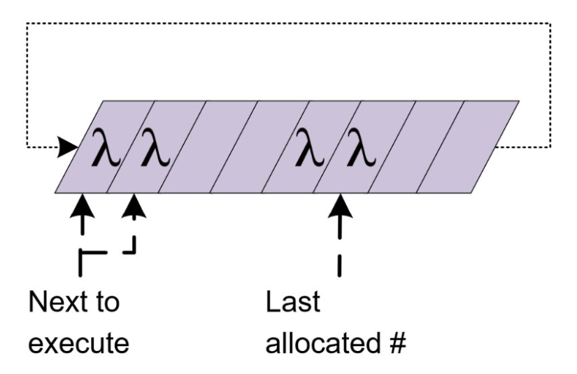
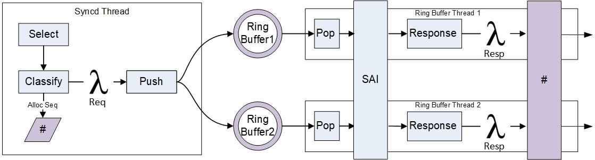
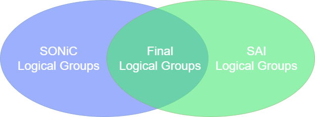
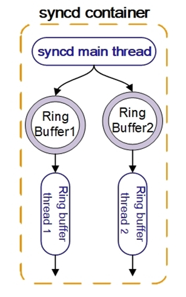

# SYNCD Optimization for SONiC

## Table of Contents

- [SYNCD Optimization for SONiC](#syncd-optimization-for-sonic)
  - [Table of Contents](#table-of-contents)
    - [Revision](#revision)
    - [Scope](#scope)
    - [Terminology](#terminology)
    - [Overview](#overview)
    - [Requirements](#requirements)
    - [Architecture Design](#architecture-design)
    - [Implementation](#implementation)
      - [SAI API](#sai-api)
      - [YANG model changes](#yang-model-changes)
      - [CLI](#cli)

### Revision

| Rev |   Date   |           Author            | Change Description |
| :-: | :------: | :-------------------------: | ------------------ |
| 0.1 | 10/10/24 | Daniela Murin (**Marvell**) | Initial Draft      |

### Scope

This document discusses the `syncd` optimization enhancements that better utilize SAI's multi-threading capabilities.

### Terminology

| Term      | Definition                              |
| --------- | --------------------------------------- |
| ASIC      | Application Specific Integrated Circuit |
| SYNCD     | ASIC Synchronization Service            |
| SAI       | Switch Abstraction Interface            |
| SWSS      | Switch State Service                    |
| Sequencer | Class that sequences functions          |
| CRUD      | Create, Read, Update, Delete            |

### Overview
This document outlines the enhanced support for `syncd`, enabling concurrent SAI API calls. The enhancement introduces multiple threads within `syncd`, each dedicated to a logical group. These logical groups are organized based on objects and operations to optimize communication with SAI.
### Requirements
1. Allow `syncd` to configure SAI from several threads concurrently
2. Ensure dependent configurations are managed and executed on the same thread to maintain consistency
3. Ensure shared resources are protected while using multiple threads to prevent race conditions and data corruption
4. All replies must be sent in the correct order that SWSS expects to receive them
5. This optimization is off by default and can be enabled by a flag in `syncd`

### Architecture Design

#### High-Level Design

1. Incoming requests are received by`syncd`
2. A sequence number is allocated based on the order of incoming requests
3. CRUD requests are wrapped in a lambda function, with their sequence number, and pushed into their respective ring buffer based on their logical groups
4. Non-CRUD executed in the correct order in the main `syncd` thread based on their sequence number
5. The requests are executed concurrently within their respective threads
6. The responses received from the hardware, and are wrapped in a lambda function and send to the`sequencer` class
7. The responses are executed by the `sequencer` class in the correct order that`swss` expects to receive them
### Sequencer

A new class that is responsible for executing function in a specific order.
Lambda functions and all of their dependencies are placed inside the queue according to their sequence number.


#### Methods and Variables
1. Next to execute: number of the next function to execute
2. Last allocated number: number of the next allocation
3. allocateSequencerNumber()
	- Allocates ID that determines the function's execution order
4. executeFunctionInSequence()
	- Executes the function if its sequence is reached, or stores it until the appropriate sequence is ready for execution
	- After a successful execution, will execute all sequential functions in the queue
5. waitSequenceNumber()
	- If the current thread encounters a dependency issue with another thread, this function will block the thread until all previous functions have been executed
	- This allows the sequencer to drain all previous functions, allowing any dependency issues to be resolved before continuing
	- Watchdog/timeout mechanism to prevent starvation
#### Key Sequencer Features
1. Ensures all operations are executed in the correct order
2. Handles dependencies between functions, ensuring prerequisites are completed before execution
3. Manages concurrent execution across multiple threads without conflicts
4. Prevents resource starvation by ensuring all functions are executed in a timely manner

#### Put it all together
Non-CRUD functions will be executed in the main `syncd` thread, this does not change.
CRUD functions will be executed in their corresponding ring buffers.

### Logical Groups
Each logical group has its own ring buffer based on SAI attributes that it supports. These logical groups are decided at the SONiC level.
We have created 2 logical groups, and all other operation logic does not change: 
1. Routing 
```
	SAI_OBJECT_TYPE_NEXT_HOP,
	SAI_OBJECT_TYPE_NEIGHBOR_ENTRY,
	SAI_OBJECT_TYPE_ROUTE_ENTRY,
	...
```

2. L1
```
	SAI_OBJECT_TYPE_PORT,
	SAI_OBJECT_TYPE_PORT_SERDES,
	SAI_OBJECT_TYPE_PORT_CONNECTOR
	...
```

3. Main - main `syncd` thread, which includes everything else

### SAI Capability Attribute
As of now, there are no SAI changes.

For future enhancement, we wish to introduced a new SAI capability that indicates potential multi-threading support.
SONiC NOS includes the logical groups that it supports, and this SAI attribute will return "groups" that it supports.
The final logical groups that `syncd` will use appear in both.  

The logical groups in SONiC are minimally dependent on one another.



### Implementation
##### Background: Ring buffer and Lambda function in SWSS by Alibaba
Leveraging on Alibaba's contribution: https://github.com/sonic-net/SONiC/blob/3e9cfba11b195e64f5d2f7138fb15fdcc4affbfa/doc/bgp_loading_optimization/bgp-loading-optimization-hld.md
1. main thread that reads from APPL_DB 
2. wraps the function into a lambda and pushes it into the ring buffer
3. ring buffer thread that reads from the ring buffer and executes the function
4. singleton ring buffer
##### Multi-threading in SYNCD
1. main threads that reads from ASIC_DB
2. multiple ring buffers based on logical groups
3. a thread for each ring buffer that executes the functions
4. responses are sent in the correct order by using the Sequencer class


##### Send functions to their corresponding ring buffers

Within `Syncd::processEvent()`, send the functions to their respective ring buffer.
```c++
// allocate sequence number
SequenceStatus st = m_sequencer->allocateSequenceNumber(&seq);

// send to ring buffer
if (st == SUCCESS) {
	ret = sendToRingBuffer(kco, seq);
}
else {
	SWSS_LOG_THROW("failed to allocate sequence number");
}
		 
// if there is no corresponding ring buffer for the function, execute through the sequencer 
if (ret != SUCCESS)
{
	auto lambda = [=](){ processSingleEvent(kco); }; 
	m_sequencer->executeFuncInSequence(seq, lambda);
} 
```

##### Use the Sequencer class to send responses in the correct order

When the `executeFuncInSequence` method is called, execute the lambda function if the sequence is next to send. After the execution, check if there are more functions that can be executed in the correct order. 
Otherwise, store the function.

Currently, `syncd` supports multiple threads, including flex counters and notifications. However, these threads utilize the same mutex, which prevents simultaneous execution. 
Allow existing threads to execute concurrently.
#### SAI API

There are currently no new SAI APIs required for this feature.
#### YANG model changes

No Changes.
#### CLI

No changes.

### Warmboot and Fastboot Design Impact

There is no impact on warmboot or fastboot

### Testing Requirements/Design

#### Unit Test cases

#### System Test cases

#### Phase 2
Smarter logical groups with no/minimal dependencies
SAI API that will provide logical groups capabilities