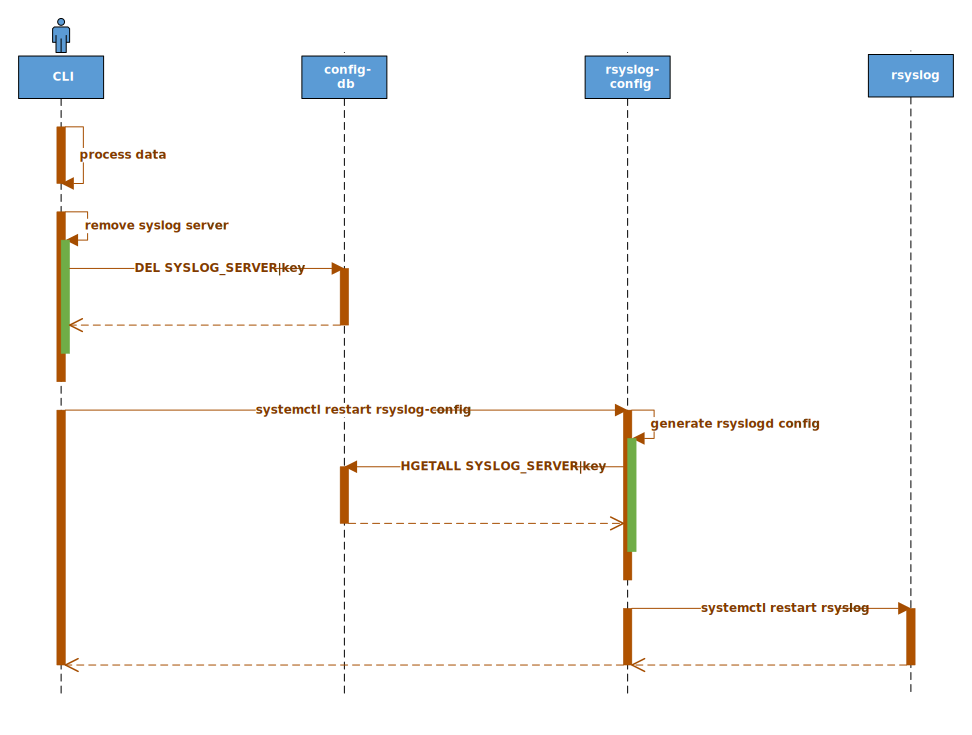

<!-- omit in toc -->
# SONiC Syslog Source IP

## High Level Design document

## Table of contents

- [1. Introduction](#1-introduction)
  - [1.1. Feature overview](#11-feature-overview)
  - [1.2. Requirements](#12-requirements)
    - [1.2.1. Functionality](#121-functionality)
    - [1.2.2. Command interface](#122-command-interface)
    - [1.2.3. Error handling](#123-error-handling)
    - [1.2.4. Event logging](#124-event-logging)
      - [1.2.4.1. Table 1: Event logging](#1241-table-1-event-logging)
- [2. Design](#2-design)
  - [2.1. Overview](#21-overview)
  - [2.2. Syslog Forwarding Output Module](#22-syslog-forwarding-output-module)
    - [2.2.1. Overview](#221-overview)
      - [2.2.1.1. Table 2: Syslog global config Module](#2211-table-2-syslog-global-config-module)
      - [2.2.1.2. Table 3: Syslog Forwarding Output Module](#2212-table-3-syslog-forwarding-output-module)
    - [2.2.2. IpFreeBind](#222-ipfreebind)
  - [2.3. Configuration agent](#23-configuration-agent)
    - [2.3.1. Overview](#231-overview)
    - [2.3.2. global syslog configuration](#232-global-syslog-configuration)
      - [2.3.2.1. Table 4: Global configuration parameters](#2321-table-4-global-configuration-parameters)
      - [2.3.2.2. Format: `set`:](#2322-format-set)
    - [2.3.3. SSIP parameters](#233-ssip-parameters)
      - [2.3.3.1. Table 5: SSIP parameters](#2331-table-5-ssip-parameters)
    - [2.3.4. SSIP configuration](#234-ssip-configuration)
      - [2.3.4.1. VRF/Source: `unset/unset`](#2341-vrfsource-unsetunset)
      - [2.3.4.2. VRF/Source: `unset/set`](#2342-vrfsource-unsetset)
      - [2.3.4.3. VRF/Source: `set/unset`](#2343-vrfsource-setunset)
      - [2.3.4.4. VRF/Source: `set/set`](#2344-vrfsource-setset)
      - [2.3.4.5. Filter/Severity: `set/set`](#2345-filterseverity-setset)
      - [2.3.4.6. Protocol: `set`](#2346-protocol-set)
  - [2.4. DB schema](#24-db-schema)
    - [2.4.1. Config DB](#241-config-db)
      - [2.4.1.1. Global syslog table](#2411-global-syslog-table)
      - [2.4.1.2. SSIP table](#2412-ssip-table)
    - [2.4.2. Data sample](#242-data-sample)
    - [2.4.3. Configuration sample](#243-configuration-sample)
    - [2.4.4. Configuration migration](#244-configuration-migration)
  - [2.5. Flows](#25-flows)
    - [2.5.1. SSIP add](#251-ssip-add)
      - [2.5.1.1. Figure 1: SSIP add flow](#2511-figure-1-ssip-add-flow)
    - [2.5.2. SSIP remove](#252-ssip-remove)
      - [2.5.2.1. Figure 2: SSIP remove flow](#2521-figure-2-ssip-remove-flow)
  - [2.6. CLI](#26-cli)
    - [2.6.1. Command structure](#261-command-structure)
    - [2.6.2. Usage examples](#262-usage-examples)
      - [2.6.2.1. Config command group](#2621-config-command-group)
      - [2.6.2.2. Show command group](#2622-show-command-group)
  - [2.7. YANG model](#27-yang-model)
  - [2.8. Warm/Fast boot](#28-warmfast-boot)
- [3. Test plan](#3-test-plan)
  - [3.1. Unit tests via VS](#31-unit-tests-via-vs)
  - [3.2. Data plane tests via PTF](#32-data-plane-tests-via-ptf)


## Revision

| Rev | Date       | Author         | Description           |
|:---:|:----------:|:--------------:|:----------------------|
| 0.1 | 18/04/2022 | Nazarii Hnydyn | Initial version       |
| 0.2 | 08/01/2023 | Ido Avraham    | Added syslog configuration capabilities. </br> Configure remote syslog servers: protocol, filter, log severity level. </br> Update global syslog configuration: log severity level, message format |

## About this manual

This document provides general information about Syslog Source IP implementation in SONiC

## Scope

This document describes the high level design of Syslog Source IP feature in SONiC

**In scope:**  
1. Syslog Source IP configuration for UDP protocol

**Out of scope:**  
1. Syslog Source IP configuration for TCP protocol

## Abbreviations

| Term  | Meaning                                   |
|:------|:------------------------------------------|
| SONiC | Software for Open Networking in the Cloud |
| SSIP  | Syslog Source IP                          |
| IP    | Internet Protocol                         |
| UDP   | User Datagram Protocol                    |
| TCP   | Transmission Control Protocol             |
| DB    | Database                                  |
| VRF   | Virtual Routing and Forwarding            |
| OMFWD | Syslog Forwarding Output Module           |
| CLI   | Сommand-line Interface                    |
| YANG  | Yet Another Next Generation               |
| VS    | Virtual Switch                            |
| PTF   | Packet Test Framework                     |

## List of figures

- [Figure 1: SSIP add flow](#figure-1-ssip-add-flow)  
- [Figure 2: SSIP remove flow](#figure-2-ssip-remove-flow)

## List of tables

- [Table 1: Event logging](#2241-table-1-event-logging)
- [Table 2: Syslog global config Module](#3211-table-2-syslog-global-config-module)
- [Table 3: Syslog Forwarding Output Module](#3212-table-3-syslog-forwarding-output-module)
- [Table 4: Global configuration parameters](#3321-table-4-global-configuration-parameters)
- [Table 5: SSIP parameters](#3331-table-5-ssip-parameters)

# 1. Introduction

## 1.1. Feature overview

SSIP is a feature which allows user to change UDP packet source IP address.  
Any configured address can be used for source IP mangling.  
This might be useful for security reasons.

SSIP also extends the existing syslog implementation with VRF device and server UDP port configuration support.
The feature doesn't change the existing DB schema which makes it fully backward compatible.

## 1.2. Requirements

### 1.2.1. Functionality

**This feature will support the following functionality:**
1. Syslog Source IP address configuration
2. Syslog server port configuration
3. Syslog VRF device support
4. Syslog protocol configuration
5. Syslog message severity level configuration
6. Syslog filter configuration

### 1.2.2. Command interface

**This feature will support the following commands:**
1. config: add/delete syslog server configuration
2. show: display syslog server configuration
3. config: set/unset global syslog configuration
4. show: display global syslog configuration

### 1.2.3. Error handling

**This feature will provide error handling for the next situations:**
1. Invalid object reference
2. Invalid options/parameters

### 1.2.4. Event logging

**This feature will provide event logging for the next situations:**
1. Syslog server add/delete

#### 1.2.4.1. Table 1: Event logging

| Event                             | Severity |
|:----------------------------------|:---------|
| Syslog server add/delete: success | NOTICE   |
| Syslog server add/delete: error   | ERROR    |

# 2. Design

## 2.1. Overview

SSIP will reuse syslog `omfwd` functionality which offers the next features:  
1. Source IP address configuration
2. Server port configuration
3. VRF device configuration
4. Server protocol configuration
5. Messages regex filtering 
6. Messages severity filtering

## 2.2. Syslog Forwarding Output Module

### 2.2.1. Overview

#### 2.2.1.1. Table 2: Syslog global config Module

| Parameter          | Default  | Description                                                                   |
|:-------------------|:---------|:------------------------------------------------------------------------------|
| format             | standard | template format                                                               |
| severity           | notice   | messages with severity equal or grater then this severity will be forwarded   |
| welf_firewall_name | hostname | firewall name to be used in template, default is system current hostname      |

**MAN page:** [template](
    https://www.rsyslog.com/doc/v8-stable/configuration/templates.html
    "Syslog template configuration"
)

#### 2.2.1.2. Table 3: Syslog Forwarding Output Module

| Parameter     | Default  | Description                                                                               |
|:--------------|:---------|:------------------------------------------------------------------------------------------|
| target        | none     | Name or IP-Address of the system that shall receive messages. Any resolvable name is fine |
| address       | none     | Bind socket to a given local IP address. This option is only supported for UDP, not TCP   |
| port          | 514      | Name or numerical value of port to use when connecting to target                          |
| protocol      | udp      | Type of protocol to use for forwarding (e.g., tcp/udp)                                    |
| device        | none     | Bind socket to given device (e.g., eth0/vrf0)                                             |
| ipfreebind    | 2        | Manages the IP_FREEBIND option on the UDP socket                                          |
| filter        | none     | compares the log against the provided regular expression                                  |
| priority      | notice   | logs with specified priority and higher will be forwarded                                 |

**MAN page:** [omfwd](
    https://www.rsyslog.com/doc/v8-stable/configuration/modules/omfwd.html#omfwd-syslog-forwarding-output-module
    "Syslog Forwarding Output Module"
)

**MAN page:** [filter](
    https://www.rsyslog.com/doc/v8-stable/configuration/filters.html
    "Syslog filter configuration"
)

### 2.2.2. IpFreeBind

**IP_FREEBIND (since Linux 2.4)**
```
If enabled, this boolean option allows binding to an IP address that is nonlocal or does not (yet) exist.
This permits listening on a socket, without requiring the underlying network interface  
or the specified dynamic IP address to be up at the time that the application is trying to bind to it.  
This option is the per-socket equivalent of the ip_nonlocal_bind.
```

**MAN page:** [ip_freebind](
    https://linux.die.net/man/7/ip
    "IP_FREEBIND"
)

## 2.3. Configuration agent

### 2.3.1. Overview

Configuration management of `rsyslogd` is done by `rsyslog-config` service.  
The service is triggered by CLI once data is validated and pushed to Config DB.  

The `rsyslog-config` service performs the next actions:
1. Renders `rsyslog.conf.j2` template with `sonic-cfggen` to generate a new `rsyslogd` config file
2. Restarts `rsyslog` service which triggers `rsyslogd` to load a new config file

### 2.3.2. global syslog configuration

#### 2.3.2.1. Table 4: Global configuration parameters
| SONiC                 | Rsyslogd | Config DB Schema                           |
|:----------------------|:---------|:-------------------------------------------|
| format                | template | SYSLOG_CONFIG\|GLOBAL\|format              |
| severity              | priority | SYSLOG_CONFIG\|GLOBAL\|severity            |
| welf_firewall_name    | severity | SYSLOG_CONFIG\|GLOBAL\|welf_firewall_name  |

* severity: this field is a global log severity. 
  this will be the default value for all the servers in the system
  unless overridden by setting the `server.severity` field.
  for example you can look at `2.4.3 configuration sample`
  server "4.4.4.4" does not set `severity` field so it will use this global severity value.
  server "4.4.4.5" does set it so it will use his local value and not this global value.
  

#### 2.3.2.2. Format: `set`:

Format:
template(name="WelfFormat" type="string" string="%TIMESTAMP% %HOSTNAME% id=firewall time=\"%timereported\
:::date-year%-%timereported:::date-month%-%timereported:::date-day% %timereported:::date-hour%:%timereported:::date-minute%:%timereported\
:::date-second%\" fw=\"{{ firewall-name  }}\" pri=%syslogpriority% msg=\"%syslogtag%%msg:::sp-if-no-1st-sp%%msg:::drop-last-lf%\"\n")

### 2.3.3. SSIP parameters

**SSIP will have the next parameter mapping:**

#### 2.3.3.1. Table 5: SSIP parameters
| SONiC         | Rsyslogd | Config DB Schema                   |
|:--------------|:---------|:-----------------------------------|
| key           | target   | SYSLOG_SERVER\|key                 |
| source        | address  | SYSLOG_SERVER\|key\|source         |
| port          | port     | SYSLOG_SERVER\|key\|port           |
| vrf           | device   | SYSLOG_SERVER\|key\|vrf            |
| protocol      | protocol | SYSLOG_SERVER\|key\|protocol       |
| filter_type   | ereregex | SYSLOG_SERVER\|key\|filter_type    |
| filter_regex  | ereregex | SYSLOG_SERVER\|key\|filter_regex   |
| severity      | priority | SYSLOG_SERVER\|key\|severity       |

### 2.3.4. SSIP configuration

SSIP offers `vrf` and `source` parameters for flexible configuration management.  
Each parameter combination requires a dedicated handling approach.

**Note:**
1. The destination might be not reachable over the specified `vrf`/`source`: no way to check - user's responsibility
2. Additional validation is required when MGMT/DATA VRF is removed while reference still exists in syslog configuration
3. `severity` field will be default log severity for rules that do not define it.

#### 2.3.4.1. VRF/Source: `unset/unset`

Linux kernel decides which source IP to use within the default VRF.

**Example:**
```
*.notice action(type="omfwd" target="2.2.2.2" protocol="udp")
```

#### 2.3.4.2. VRF/Source: `unset/set`

Check if source IP is configured on any default VRF member:  
yes - set source IP, no - generate error

**Example:**
```
*.notice action(type="omfwd" target="2.2.2.2" protocol="udp" address="1.1.1.1")
```

#### 2.3.4.3. VRF/Source: `set/unset`

Check VRF type:
1. Default
2. MGMT
3. DATA

Default VRF:
1. Skip VRF configuration

MGMT VRF:
1. Check if MGMT VRF is enabled:  
yes - set VRF, no - generate error

DATA VRF:
1. Check if VRF is a member of SONiC VRF table:  
yes - set VRF, no - generate error

**Example:**
```
Default VRF:
*.notice action(type="omfwd" target="2.2.2.2" protocol="udp")
MGMT VRF:
*.notice action(type="omfwd" target="2.2.2.2" protocol="udp" device="mgmt")
DATA VRF:
*.notice action(type="omfwd" target="2.2.2.2" protocol="udp" device="Vrf-Data")
```

#### 2.3.4.4. VRF/Source: `set/set`

Check VRF type:
1. Default
2. MGMT
3. DATA

Default VRF:
1. Check if source IP is configured on any DEFAULT VRF member:  
yes - set source IP, no - generate error
2. Skip VRF configuration

MGMT VRF:
1. Check if MGMT VRF is enabled:  
yes - set VRF, no - generate error
2. Check if source IP is configured on any MGMT VRF member:  
yes - set source IP, no - generate error

DATA VRF:
1. Check if VRF is a member of SONiC VRF table:  
yes - set VRF, no - generate error
2. Check if source IP is configured on any DATA VRF member:  
yes - set source IP, no - generate error

**Example:**
```
Default VRF:
*.notice action(type="omfwd" target="2.2.2.2" protocol="udp" address="1.1.1.1")
MGMT VRF:
*.notice action(type="omfwd" target="2.2.2.2" protocol="udp" address="1.1.1.1" device="mgmt")
DATA VRF:
*.notice action(type="omfwd" target="2.2.2.2" protocol="udp" address="1.1.1.1" device="Vrf-Data")
```

#### 2.3.4.5. Filter/Severity: `set/set`

Log regex filter

Filter:
    Filter value can be either Include or Exclude.

    Include:
    Compares the log string against the provided POSIX ERE regular expression.
    yes - sends log string to remote server, no - do not send

    Exclude:
    Compares the log string against the provided POSIX ERE regular expression.
    yes - does not send string log to remote server, no - sends

Protocol:
messages are forwarded via configured protocol

Severity:
sends logs with severity equal or higher then configured

**Example:**
```
Include:
:msg, ereregex, "include_str*" 
*.notice action(type="omfwd" Target="4.4.4.4" Port="514" Protocol="tcp" Device="eth0" Template="SONiCFileFormat")
Exclude:
:msg, !ereregex, "exclude_str*" 
*.info action(type="omfwd" Target="4.4.4.5" Port="514" Protocol="udp" Device="eth0" Template="SONiCFileFormat")
```

#### 2.3.4.6. Protocol: `set`

messages are forwarded via configured protocol

**Example:**
```
*.notice action(type="omfwd" Target="5.5.5.5" Port="514" Protocol="tcp" Device="eth0" Template="SONiCFileFormat")
```

## 2.4. DB schema

### 2.4.1. Config DB

#### 2.4.1.1. Global syslog table
```abnf
; define schema for syslog global configuration attributes under SYSLOG_CONFIG|GLOBAL

; field = value
format              = template-format ; template to send logs
welf_firewall_name  = template
severity            = log-level

; value annotations
template        = rsyslog template  ; string regex 
welf-format     = "welf"            ; WebTrends Enhanced Log file Format
standard-format = "standard"        ; Standard Log file format
template-format = welf-format / standard-format
log-level       = "debug" / "info" / "notice" / "warn" / "error" / "crit"
```

#### 2.4.1.2. SSIP table
```abnf
; defines schema for syslog table configuration attributes
key = SYSLOG_SERVER|server_ip_address ; server IP address. Must be unique

; field = value
source      = ip-addr    ; source IP address
port        = 1*5DIGIT   ; server UDP port (0..65535)
vrf         = vrf-device ; VRF device
protocol    = protocol   ; protocol
filter_type = filter-re  ; filter regular expression
severity    = log-level  ; log level severity

; value annotations
h16         = 1*4HEXDIG
ls32        = h16 ":" h16
dec-octet   = DIGIT               ; 0-9
              / %x31-39 DIGIT     ; 10-99
              / "1" 2DIGIT        ; 100-199
              / "2" %x30-34 DIGIT ; 200-249
              / "25" %x30-35      ; 250-255
ipv4-addr   = dec-octet "." dec-octet "." dec-octet "." dec-octet
ipv6-addr   = 6( h16 ":" ) ls32
              /                       "::" 5( h16 ":" ) ls32
              / [               h16 ] "::" 4( h16 ":" ) ls32
              / [ *1( h16 ":" ) h16 ] "::" 3( h16 ":" ) ls32
              / [ *2( h16 ":" ) h16 ] "::" 2( h16 ":" ) ls32
              / [ *3( h16 ":" ) h16 ] "::"    h16 ":"   ls32
              / [ *4( h16 ":" ) h16 ] "::"              ls32
              / [ *5( h16 ":" ) h16 ] "::"              h16
              / [ *6( h16 ":" ) h16 ] "::"
ip-addr     = ipv4-addr / ipv6-addr
vrf-default = "default"
vrf-mgmt    = "mgmt"
vrf-data    = "Vrf-" 1*255VCHAR
vrf-device  = vrf-default / vrf-mgmt / vrf-data
protocol    = udp / tcp
re-include  = "egregex"
re-exclude  = "!egregex"
filter-re   = re-include / re-exclude
log-level   = "debug" / "info" / "notice" / "warn" / "error" / "crit"
```

### 2.4.2. Data sample

**Config DB:**
```bash
redis-cli -n 4 HGETALL 'SYSLOG_SERVER|2.2.2.2'
1) "source"
2) "1.1.1.1"
3) "port"
4) "514"
5) "vrf"
6) "default"
7) "protocol"
8) "udp"

redis-cli -n 4 HGETALL 'SYSLOG_SERVER|3.3.3.3'
1) "source"
2) "1.1.1.1"
3) "port"
4) "514"
5) "vrf"
6) "mgmt"
7) "protocol"
8) "udp"

redis-cli -n 4 HGETALL 'SYSLOG_SERVER|2222::2222'
1) "source"
2) "1111::1111"
3) "port"
4) "514"
5) "vrf"
6) "Vrf-Data"
7) "protocol"
8) "udp"

redis-cli -n 4 HGETALL 'SYSLOG_SERVER|4.4.4.4'
 1) "source"
 2) "4.4.4.4"
 3) "port"
 4) "514"
 5) "vrf"
 6) "default"
 7) "protocol"
 8) "udp"
 9) "filter_type"
10) "include"
11) "filter_regex"
12) "include_str*"

redis-cli -n 4 HGETALL 'SYSLOG_SERVER|4.4.4.5'
 1) "source"
 2) "4.4.4.4"
 3) "port"
 4) "514"
 5) "vrf"
 6) "default"
 7) "protocol"
 8) "udp"
 9) "filter_type"
10) "exlude"
11) "filter_regex"
12) "exclude_str*"
13) "severity"
14) "info"

redis-cli -n 4 HGETALL 'SYSLOG_SERVER|5.5.5.5'
 1) "source"
 2) "5.5.5.5"
 3) "port"
 4) "514"
 5) "vrf"
 6) "default"
 7) "protocol"
 8) "tcp"
 
 ```

### 2.4.3. Configuration sample

**Syslog remote logging:**
```json
{
    "SYSLOG_SERVER": {
        "2.2.2.2": {
            "source": "1.1.1.1",
            "port": "514",
            "vrf": "default"
        },
        "3.3.3.3": {
            "source": "1.1.1.1",
            "port": "514",
            "vrf": "mgmt"
        },
        "2222::2222": {
            "source": "1111::1111",
            "port": "514",
            "vrf": "Vrf-Data"
        },
        "4.4.4.4": {
            "source": "4.4.4.4",
            "port": "514",
            "vrf": "default",
            "protocol": "udp",
            "filter_type": "include",
            "filter_regex": "include_str*"
        },
        "4.4.4.5": {
            "source": "4.4.4.5",
            "port": "514",
            "vrf": "default",
            "protocol": "udp",
            "filter_type": "exclude",
            "filter_regex": "exclude_str*",
            "severity": "info"
        },
         "5.5.5.5": {
            "source": "5.5.5.5",
            "port": "514",
            "vrf": "default",
            "protocol": "tcp",
        },
    },
    "SYSLOG_CONFIG": {
        "format": "welf",
        "severity": "info",
        "welf_firewall_name": "my_hostname"
    }
}
```

### 2.4.4. Configuration migration

No special handling is required

## 2.5. Flows

### 2.5.1. SSIP add


#### 2.5.1.1. Figure 1: SSIP add flow

### 2.5.2. SSIP remove



#### 2.5.2.1. Figure 2: SSIP remove flow

## 2.6. CLI

### 2.6.1. Command structure

**User interface**:
```
config
|--- syslog
     |--- add <server_ip> OPTIONS
     |--- del <server_ip>

show
|--- syslog
```

**Options:**

_config syslog add_
1. `-s|--source` - source ip address
2. `-p|--port` - server udp port
3. `-r|--vrf` - vrf device
4. `--protocol` - server protocol
5. `--filter_type` - filter type <include|exclude>
6. `--filter_regex` - filter regex value
7. `--severity` - set log severity

### 2.6.2. Usage examples

#### 2.6.2.1. Config command group

**The following command adds/deletes syslog server:**
```bash
config syslog add '2.2.2.2' \
--source '1.1.1.1' \
--port '514' \
--vrf 'default'
config syslog del '2.2.2.2'
```

#### 2.6.2.2. Show command group

**The following command shows syslog server configuration:**
```bash
root@sonic:/home/admin# show syslog
SERVER IP    SOURCE IP    PORT    VRF        PROTOCOL  FILTER_TYPE   FILTER REGEX  SEVERITY
-----------  -----------  ------  --------   --------  -----------   ------------  --------
2.2.2.2      1.1.1.1      514     default     udp                                  notice
3.3.3.3      1.1.1.1      514     mgmt        udp                                  notice
2222::2222   1111::1111   514     Vrf-Data    udp                                  notice
4.4.4.4      4.4.4.4      514     default     udp      include       include_str*  notice
4.4.4.5      4.4.4.5      514     default     udp      exclude       exclude_str*  info
5.5.5.5      5.5.5.5      514     default     tcp                                  notice
```

## 2.7. YANG model

An existing YANG model `sonic-syslog.yang` will be extended in order to provide support for SSIP.

**Skeleton code:**
```yang
module sonic-syslog {

    yang-version 1.1;

    namespace "http://github.com/sonic-net/sonic-system-syslog";
    prefix syslog;

    import ietf-inet-types {
        prefix inet;
    }

    import sonic-mgmt_vrf {
        prefix mvrf;
    }

    import sonic-vrf {
        prefix vrf;
    }

    description "Syslog YANG Module for SONiC OS: remote syslog logging";

    revision 2022-04-18 {
        description "Initial revision.";
    }

    typedef vrf-device {
        description "Represents syslog VRF device";
        type enumeration {
            enum default;
            enum mgmt;
        }
    }

    typedef log-format {
        description "Represents syslog log format";
        type enumeration {
            enum welf;
            enum standard;
        }
    }

    typedef rsyslog-protocol {
        description "The protocol to send logs to remote server";
        type enumeration {
            enum tcp;
            enum udp;
        }
    }

    typedef syslog-filter-type {
        description "The filter type";
        type enumeration {
            enum include;
            enum exclude;
        }
    }

    typedef rsyslog-severity {
        description "The protocol to send logs to remote server";
        type enumeration {
            enum none;
            enum debug;
            enum info;
            enum notice;
            enum warn;
            enum error;
            enum crit;
        }
    }


    container sonic-syslog {

        container SYSLOG_SERVER {

            description "SYSLOG_SERVER part of config_db.json";

            list SYSLOG_SERVER_LIST {

                key "server_address";

                leaf server_address {
                    description "Syslog server IP address or a DNS domain name";
                    type inet:host;
                }

                leaf source {
                    description "Syslog source IP address";
                    type inet:ip-address;
                    must "(contains(current(), '.') and contains(../server_address, '.'))
                    or (contains(current(), ':') and contains(../server_address, ':'))";
                }

                leaf port {
                    description "Syslog server UDP port";
                    type inet:port-number;
                }

                leaf vrf {
                    description "Syslog VRF device";
                    type union {
                        type leafref {
                            path "/vrf:sonic-vrf/vrf:VRF/vrf:VRF_LIST/vrf:name";
                        }
                        type vrf-device;
                    }
                    must "(current() != 'mgmt')
                    or (/mvrf:sonic-mgmt_vrf/mvrf:MGMT_VRF_CONFIG/mvrf:vrf_global/mvrf:mgmtVrfEnabled = 'true')";
                }

                leaf filter_type {
                    description "Syslog filter type";
                    type syslog-filter-type;
                }

                leaf filter_regex {
                    description "Filter regex";
                    type string;
                }

                leaf protocol {
                    description "The protocol to send logs to remote server";
                    type rsyslog-protocol;
                }

                leaf severity {
                    description "Limit the severity to send logs to remote server";
                    type rsyslog-severity;
                    default "notice"
                }

            }
            /* end of list SYSLOG_SERVER_LIST */
        }
        /* end of container SYSLOG_SERVER */

        container SYSLOG_CONFIG {

            description "SYSLOG_CONFIG part of config_db.json";

            container GLOBAL {

                leaf format {
                    description "Log format";
                    type log-format;
                    default "standard";
                }

                leaf welf_firewall_name {
                    description "WELF format Firewall name";
                    type string;
                    must "(../format != 'standard')";
                }

                leaf severity {
                    type rsyslog-severity;
                }

            }
            /* end of list SYSLOG_CONFIG_LIST */
        }
        /* end of container SYSLOG_CONFIG */
    }
    /* end of container sonic-syslog */
}
/* end of module sonic-syslog */
```

## 2.8. Warm/Fast boot

No special handling is required

# 3. Test plan

## 3.1. Unit tests via VS

SSIP basic configuration test:
1. Verify rsyslog.conf after syslog server creation/removal

SSIP extended configuration test:
1. Create syslog server with IPv4/IPv6 source IP
2. Verify rsyslog.conf
3. Create syslog server with default/mgmt/data VRF device
4. Verify rsyslog.conf

## 3.2. Data plane tests via PTF

TBD