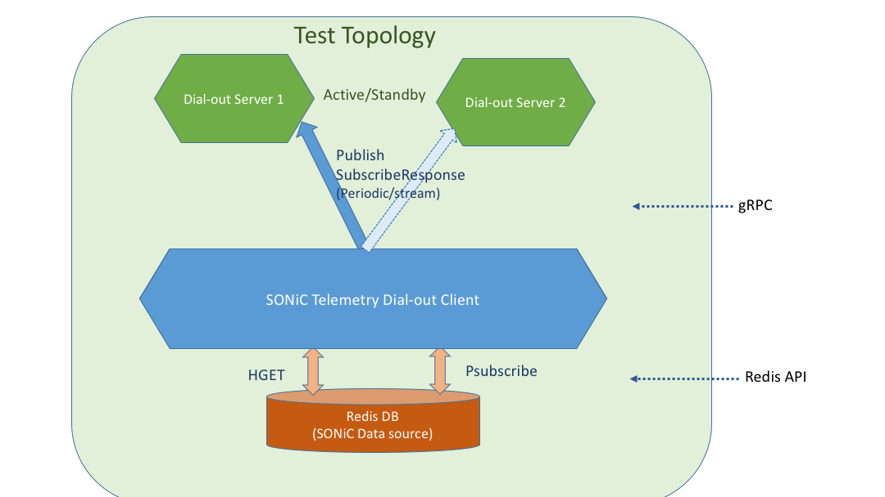

# SONiC telemetry in dial-out mode

   * [Overview of telemetry in dialout mode](#overview-of-telemetry-in-dialout-mode)
   * [SONiC system telemetry software architecture](#sonic-system-telemetry-software-architecture)
   * [Services provided in dialout mode](#services-provided-in-dialout-mode)
   * [Configurations for dialout mode](#configurations-for-dialout-mode)
   * [dialout_client_cli and dialout_server_cli](#dialout_client_cli-and-dialout_server_cli)
   * [AutoTest](#autotest)
   * [Performance and Scale Test](#performance-and-scale-test)

# Overview of telemetry in dialout mode

When the telemetry service works in dialout mode, it initiates connections towards collectors then streams data to them. The exact list of collectors, paths of data, and various connection related variables are configured via other channels like netconf or CLI.

It is useful in some scenarios. A few typical examples:

* Firewall/Nat service sits between network device and telemetry collectors, and the collectors cannot initiate connections.
* Collectors prefer to work in stateless mode and shed the complexity of maintaining telemetry state of each and every network element to another configuration system.

# SONiC system telemetry software architecture
System telemetry in SONiC supports both dial-in mode and dial-out mode. The DB client takes care of retrieving data from SONiC redis databases, while non-DB client serves data outside of redis databases. gRPC dial-out client is described in this document,


# Services provided in dialout mode
gNMIDialout service is defined for telemetry in dialout mode. It has one streaming RPC: Publish. The message from client to collector reuses [SubscribeResponse](https://github.com/openconfig/gnmi/blob/f6185680be3b63e2b17e155f06bfc892f74fc3e7/proto/gnmi/gnmi.proto#L216) from gNMI spec, while the PublishResponse message is optional and skipped by default.

```
// gNMIDialOut defines a service which is used by a target system (typically a
// network element) to initiate connections to a client (collector). The server
// is implemented at the collector, such that the target can initiate connections
// to the collector, based on a configured set of telemetry subscriptions.
service gNMIDialOut {
  // Publish allows the target to send telemetry updates (in the form of
  // SubscribeResponse messaages, which have the same semantics as in the
  // gNMI Subscribe RPC, to a client. The client may optionally return the
  // PublishResponse message in response to the dial-out connection from the
  // target as acknowledgement to the SubscribeResponse message
  //
  // The configuration of subscriptions associated with the publish RPC may
  // be through the OpenConfig telemetry configuration and operational state
  // model:
  // https://github.com/openconfig/public/blob/master/release/models/telemetry/openconfig-telemetry.yang
  rpc Publish(stream SubscribeResponse) returns (stream PublishResponse);
}

message PublishResponse {
  int64 timestamp = 1;          // Timestamp in nanoseconds since Epoch.
  Path prefix = 2;              // Prefix used for paths in the message.
  // An alias for the path specified in the prefix field.
  // Reference: gNMI Specification Section 2.4.2
  string alias = 3;
  repeated Path path = 4;     // Paths for which the notifications have been received.
}
```

# Configurations for dialout mode
The configuration of dialout telemetry in SONiC is implemented with reference to openconfig [telemetry yang model](https://github.com/openconfig/public/blob/master/release/models/telemetry/openconfig-telemetry.yang)

There are three categories of configuration:
* Global
  * encoding:  It may be one of `JSON_IETF`, `ASCII`, `BYTES`  and `PROTO`.  Default value is JSON_IETF.
  * src_ip: Source ip address of the connection from device, if not specificied, the device management IP will be used.
  * retry_interval: When connection to collector is down, how long dialout client should wait before retry. 30 seconds by default.
  * unidirectional: Whether to make the Publish RPC one directly only, no PublishResponse is expected by default.
* DestinationGroup
  * dst_addr: Multiple IP address plus port number of the collectors may be specified. dialout client will try the next one in a DesistinationGroup if current one got disconnected due to failure.
  Number of DestinationGroups is not limited.
* Subscription
  * dst_group: The DestinationGroup to be used by this subscription.
  * path_target: The DB target for this subscription
  * paths:  The list of paths subscribed to in this instance of subscription.
  * report_type: May be one of "periodic", "stream" or "once". "periodic" is the default value
  * report_interval:  How frequent the data for all paths should be sent to collector, in millisecond, default value is "5000".

One example configuration:
```
{
  "TELEMETRY_CLIENT": {
        "Global": {
            "encoding": "JSON_IETF",
            "retry_interval": "30",
            "src_ip": "30.57.185.38",
            "unidirectional": "true"
        },
        "DestinationGroup_HS": {
            "dst_addr": "30.57.186.214:8081,30.57.185.39:8081"
        },
        "Subscription_HS_RDMA": {
            "dst_group": "HS",
            "path_target": "COUNTERS_DB",
            "paths": "COUNTERS/Ethernet*,COUNTERS_PORT_NAME_MAP",
            "report_interval": "5000",
            "report_type": "periodic"
        }
    }
}
```

# dialout_client_cli and dialout_server_cli
dialout_client_cli is the program running inside SONiC system to collect telemetry data based on the configuration and stream data to collectors. The service has been integrated as part of SONiC.

In case some development testing is wanted, it may be manually started with command "/usr/sbin/dialout_client_cli -insecure -logtostderr -v 1".

dialout_server_cli is the testing program prepared for verifying the dialout service.

Below is one example testing scenario:
* dialout_client_cli has been started on SONiC, but the collectors are not up.

```
root@sonic:/# /usr/sbin/dialout_client_cli  -insecure -logtostderr -v 1
I0212 01:13:20.625697     608 dialout_client_cli.go:43] Starting telemetry publish client
I0212 01:13:50.627810     608 dialout_client.go:239] Dialout connection for {30.57.186.214:8081} failed: HS_RDMA, cs.conTryCnt Dial to ({30.57.186.214:8081}, timeout 30s): context deadline exceeded%!(EXTRA uint64=1)
I0212 01:14:20.628098     608 dialout_client.go:239] Dialout connection for {30.57.185.39:8081} failed: HS_RDMA, cs.conTryCnt Dial to ({30.57.185.39:8081}, timeout 30s): context deadline exceeded%!(EXTRA uint64=2)
```

* start dialout_server_cli on 30.57.185.39:8081

```
root@ASW:/tmp# ./dialout_server_cli -allow_no_client_auth -logtostderr -port 8081 -insecure -v 2
I0212 09:21:19.068612   29112 dialout_server.go:65] Created Server on localhost:8081
I0212 09:21:19.068748   29112 dialout_server_cli.go:90] Starting RPC server on address: localhost:8081
```

* dialout_client_cli is able to connect to collector on  30.57.185.39:8081

```
I0212 01:21:29.414704     630 dialout_client.go:242] Dialout service connected to {30.57.185.39:8081} successfully for HS_RDMA
```

* dialout_server_cli will receive the telemetry data

```
root@ASW-A2-16-A02.NA62:/tmp# ./dialout_server_cli -allow_no_client_auth -logtostderr -port 8081 -insecure -v 2
I0212 09:21:19.068612   29112 dialout_server.go:65] Created Server on localhost:8081
I0212 09:21:19.068748   29112 dialout_server_cli.go:90] Starting RPC server on address: localhost:8081
== subscribeResponse:
update: <
  timestamp: 1518398489415679977
  prefix: <
    target: "COUNTERS_DB"
  >
  update: <
    path: <
      elem: <
        name: "COUNTERS"
      >
      elem: <
        name: "Ethernet*"
      >
      elem: <
        name: "SAI_PORT_STAT_PFC_7_RX_PKTS"
      >
    >
    val: <
      json_ietf_val: "{\"Ethernet0\":{\"SAI_PORT_STAT_PFC_7_RX_PKTS\":\"0\"},\"Ethernet1\":{\"SAI_PORT_STAT_PFC_7_RX_PKTS\":\"0\"},\"Ethernet10\":{\"SAI_PORT_STAT_PFC_7_RX_PKTS\":\"0\"},\"Ethernet11\":{\"SAI_PORT_STAT_PFC_7_RX_PKTS\":\"0\"},\"Ethernet12\":{\"SAI_PORT_STAT_PFC_7_RX_PKTS\":\"0\"},\"Ethernet13\":{\"SAI_PORT_STAT_PFC_7_RX_PKTS\":\"0\"},\"Ethernet14\":{\"SAI_PORT_STAT_PFC_7_RX_PKTS\":\"0\"},\"Ethernet15\":{\"SAI_PORT_STAT_PFC_7_RX_PKTS\":\"0\"},\"Ethernet16\":{\"SAI_PORT_STAT_PFC_7_RX_PKTS\":\"0\"},\"Ethernet17\":{\"SAI_PORT_STAT_PFC_7_RX_PKTS\":\"0\"},\"Ethernet18\":{\"SAI_PORT_STAT_PFC_7_RX_PKTS\":\"0\"},\"Ethernet19\":{\"SAI_PORT_STAT_PFC_7_RX_PKTS\":\"0\"},\"Ethernet2\":{\"SAI_PORT_STAT_PFC_7_RX_PKTS\":\"0\"},\"Ethernet20\":{\"SAI_PORT_STAT_PFC_7_RX_PKTS\":\"0\"},\"Ethernet21\":{\"SAI_PORT_STAT_PFC_7_RX_PKTS\":\"0\"},\"Ethernet22\":{\"SAI_PORT_STAT_PFC_7_RX_PKTS\":\"0\"},\"Ethernet23\":{\"SAI_PORT_STAT_PFC_7_RX_PKTS\":\"0\"},\"Ethernet24\":{\"SAI_PORT_STAT_PFC_7_RX_PKTS\":\"0\"},\"Ethernet25\":{\"SAI_PORT_STAT_PFC_7_RX_PKTS\":\"0\"},\"Ethernet26\":{\"SAI_PORT_STAT_PFC_7_RX_PKTS\":\"0\"},\"Ethernet27\":{\"SAI_PORT_STAT_PFC_7_RX_PKTS\":\"0\"},\"Ethernet28\":{\"SAI_PORT_STAT_PFC_7_RX_PKTS\":\"0\"},\"Ethernet29\":{\"SAI_PORT_STAT_PFC_7_RX_PKTS\":\"0\"},\"Ethernet3\":{\"SAI_PORT_STAT_PFC_7_RX_PKTS\":\"0\"},\"Ethernet30\":{\"SAI_PORT_STAT_PFC_7_RX_PKTS\":\"0\"},\"Ethernet31\":{\"SAI_PORT_STAT_PFC_7_RX_PKTS\":\"0\"},\"Ethernet32\":{\"SAI_PORT_STAT_PFC_7_RX_PKTS\":\"0\"},\"Ethernet33\":{\"SAI_PORT_STAT_PFC_7_RX_PKTS\":\"0\"},\"Ethernet34\":{\"SAI_PORT_STAT_PFC_7_RX_PKTS\":\"0\"},\"Ethernet35\":{\"SAI_PORT_STAT_PFC_7_RX_PKTS\":\"0\"},\"Ethernet36\":{\"SAI_PORT_STAT_PFC_7_RX_PKTS\":\"0\"},\"Ethernet37\":{\"SAI_PORT_STAT_PFC_7_RX_PKTS\":\"0\"},\"Ethernet38\":{\"SAI_PORT_STAT_PFC_7_RX_PKTS\":\"0\"},\"Ethernet39\":{\"SAI_PORT_STAT_PFC_7_RX_PKTS\":\"0\"},\"Ethernet4\":{\"SAI_PORT_STAT_PFC_7_RX_PKTS\":\"0\"},\"Ethernet40\":{\"SAI_PORT_STAT_PFC_7_RX_PKTS\":\"0\"},\"Ethernet41\":{\"SAI_PORT_STAT_PFC_7_RX_PKTS\":\"0\"},\"Ethernet42\":{\"SAI_PORT_STAT_PFC_7_RX_PKTS\":\"0\"},\"Ethernet43\":{\"SAI_PORT_STAT_PFC_7_RX_PKTS\":\"0\"},\"Ethernet44\":{\"SAI_PORT_STAT_PFC_7_RX_PKTS\":\"0\"},\"Ethernet45\":{\"SAI_PORT_STAT_PFC_7_RX_PKTS\":\"0\"},\"Ethernet46\":{\"SAI_PORT_STAT_PFC_7_RX_PKTS\":\"0\"},\"Ethernet47\":{\"SAI_PORT_STAT_PFC_7_RX_PKTS\":\"0\"},\"Ethernet48\":{\"SAI_PORT_STAT_PFC_7_RX_PKTS\":\"0\"},\"Ethernet5\":{\"SAI_PORT_STAT_PFC_7_RX_PKTS\":\"0\"},\"Ethernet52\":{\"SAI_PORT_STAT_PFC_7_RX_PKTS\":\"0\"},\"Ethernet56\":{\"SAI_PORT_STAT_PFC_7_RX_PKTS\":\"0\"},\"Ethernet6\":{\"SAI_PORT_STAT_PFC_7_RX_PKTS\":\"0\"},\"Ethernet60\":{\"SAI_PORT_STAT_PFC_7_RX_PKTS\":\"0\"},\"Ethernet64\":{\"SAI_PORT_STAT_PFC_7_RX_PKTS\":\"0\"},\"Ethernet68\":{\"SAI_PORT_STAT_PFC_7_RX_PKTS\":\"0\"},\"Ethernet7\":{\"SAI_PORT_STAT_PFC_7_RX_PKTS\":\"0\"},\"Ethernet8\":{\"SAI_PORT_STAT_PFC_7_RX_PKTS\":\"0\"},\"Ethernet9\":{\"SAI_PORT_STAT_PFC_7_RX_PKTS\":\"0\"}}"
    >
  >
>
```

# AutoTest

```
bogon:sonic-telemetry jipanyang$ go test -v ./dialout/dialout_client/
=== RUN   TestGNMIDialOutPublish
=== RUN   TestGNMIDialOutPublish/DialOut_to_first_collector_in_stream_mode_and_synced
=== RUN   TestGNMIDialOutPublish/DialOut_to_second_collector_in_stream_mode_upon_failure_of_first_collector
--- PASS: TestGNMIDialOutPublish (26.22s)
    --- PASS: TestGNMIDialOutPublish/DialOut_to_first_collector_in_stream_mode_and_synced (0.52s)
    --- PASS: TestGNMIDialOutPublish/DialOut_to_second_collector_in_stream_mode_upon_failure_of_first_collector (7.53s)
PASS
ok    github.com/jipanyang/sonic-telemetry/dialout/dialout_client 26.233s
```
# Performance and Scale Test
To be provided


