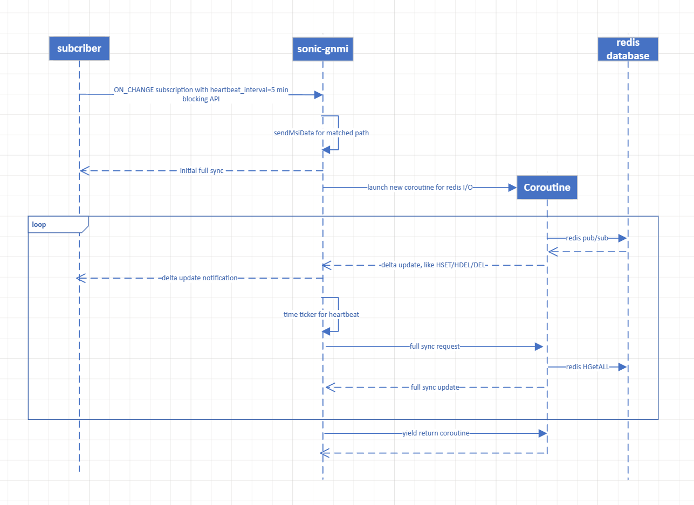

# SONiC GNMI Stream mode subscription heartbeat support

   * [Stream mode subscribe in SONiC](#stream-mode-subscribe-in-sonic)
   * [Protobuf definition](#protobuf-definition)
   * [Implementation](#implementation)
   * [Test scenario and error handling](#test-scenario-and-error-handling)
      * [Normal cases](#normal-cases)
      * [Abnormal cases](#Abnormal-cases)
      * [Performance cases](#performance-cases)

# Stream mode subscription in SONiC

[The GNMI specification](https://github.com/openconfig/reference/blob/master/rpc/gnmi/gnmi-specification.md#35152-stream-subscriptions) defines 3 different streaming modes for each Subscription that found in SubscriptionList:

- On Change (ON_CHANGE)
- Sampled (SAMPLE)
- Target Defined (TARGET_DEFINED)

#### On Change (**ON_CHANGE**) Subscription:
When a subscription is defined to be "on change", data updates are only sent when the value of the data item changes. With `ON_CHANGE` stream mode of `Subscription`
- SONiC will first send all data on the requested path to data collector,
- Will send the sync_response message to indicate the end of all data.
- Then stream data to collector upon any change on the path.

Here we missed one parameter support, which is `heartbeat` as below:

- A `heartbeat` interval MAY be specified along with an "on change" subscription - in this case, the value of the data item(s) MUST be re-sent once per heartbeat interval regardless of whether the value has changed or not.

This is a useful feature which could execute full sync periodically between the subscriber and SONiC telemetry service.

# Protobuf definition

The heartbeat parameter is already reserved in GNMI protobuf. as [The GNMI protobuf](#https://github.com/openconfig/gnmi/blob/5473f2ef722ee45c3f26eee3f4a44a7d827e3575/proto/gnmi/gnmi.proto#L309 )


```
message Subscription {
  Path path = 1;               // The data tree path.
  SubscriptionMode mode = 2;   // Subscription mode to be used.
  uint64 sample_interval = 3;  // ns between samples in SAMPLE mode.
  // Indicates whether values that have not changed should be sent in a SAMPLE
  // subscription.
  bool suppress_redundant = 4;
  // Specifies the maximum allowable silent period in nanoseconds when
  // suppress_redundant is in use. The target should send a value at least once
  // in the period specified.
  uint64 heartbeat_interval = 5;
}
```


# Implementation

Now SONiC gnmi uses [Redis pubsub](#https://redis.io/docs/interact/pubsub/) for handling on_change update, now for heartbeat implementation we should need to launch corresponding timer to trigger full sync as heartbeat interval, but it's better to pipeline all redis I/O handing into single corroutine to avoid inconsistency.
As below diagram shown, both delta update monitoring and full sync will be handled in the same corroutine, thus we don't need to concern the update maybe dis-ordered.



# Test scenario and error handling

SONiC gRPC data telemetry is largely based on gNMI protocol, the GetRquest/GetResponse and SubscribeRequest/SubscribeResponse RPC have been implemented, with hearbeat being supported, we need add below test scenario accordingly.

gnmi_cli example for heartbeat usage

```
root@ASW:~# gnmi_cli -client_types=gnmi -a 127.0.0.1:50051 -t APPL_DB -logtostderr -insecure -v 2 -qt s -q "ROUTE_TABLE" -streaming_type ON_CHANGE -heartbeat_interval 50 
```
Add below test cases into server test TestGnmiSubscribe(#https://github.com/sonic-net/sonic-gnmi/blob/752f1fceffa2d8fa7138638dd49c2d0aec96bc7b/gnmi_server/server_test.go#L2735)

## Normal test cases

case 1: Client subscribes to a path with "on_change" mode and 5 minutes as heartbeat_interval assigned. Make sure that the client receives full update as regular heartbeat interval, no matter data is changed or not.  

case 2: Client subscribes to a path with "on_change" mode and 5 minutes as heartbeat_interval assigned. Make some data change in redis side then delta updates will be notified to client immediately, and client will still receive full update as original heartbeat interval. This means delta update will not interrupt heartbeat full sync.

## Abnormal test cases

case 1: Client subscribes to a path with "on_change" mode and 10 second as heartbeat_interval assigned. Explicit "rpc error: code = InvalidArgument desc = invalid heartbeat" will be returned. Since minimal heartbeat_interval should be limited into 5 minutes (TBD), otherwise full sync process will not be converged continually.

case 2: Make some internal error which breaks the connection. Client will be identified as connection error immediately and it's required to reconnect and re-setup subscription as before.  

case 3: Make some internal error which represents that full sync cannot be handled correctly. Client will receive  "rpc error: code = Internal Error desc = xxx",  and it's required to reconnect and re-setup subscription as before.

## Performance test case

case 1: Evaluate the peak load subscription sync-up time cost, which should be used as minimum heartbeat_interval parameter value. Any existing run_test? (TBD)

case 2: Evaluate the redis I/O throughput for "hset/del/hdel", make sure no impact to common business.