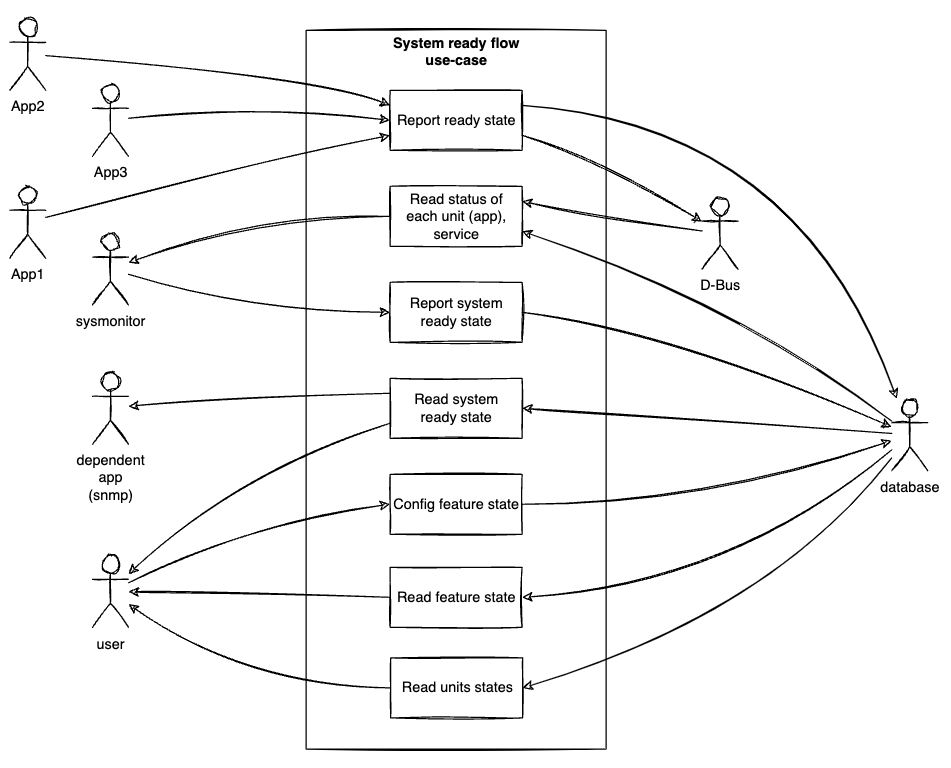
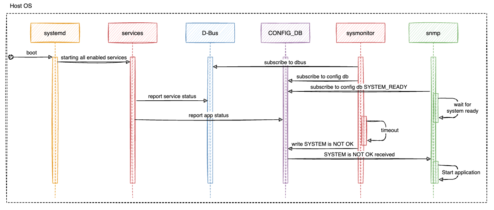

# System Ready HLD

#### Rev 0.3

# Table of Contents

- [List of Tables](#list-of-tables)
- [Revision](#revision)
- [Definition/Abbreviation](#definitionabbreviation)
- [About This Manual](#about-this-manual)
- [1 Introduction and Scope](#1-introduction-and-scope)
  - [1.1 Limitation of Existing tools](#11-existingtools-limitation)
  - [1.2 Benefits of this feature](#12-benefits-of-this-feature)
- [2 Feature Requirements](#2-feature-requirements)
  - [2.1 Functional Requirements](#21-functional-requirements)
  - [2.2 Configuration and Management Requirements](#22-configuration-and-management-requirements)
  - [2.3 Scalability Requirements](#23-scalability-requirements)
  - [2.4 Warm Boot Requirements](#24-warm-boot-requirements)
- [3 Feature Description](#3-feature-description)
- [4 Feature Design](#4-feature-design)
  - [4.1 Overview](#41-design-overview)
  - [4.2 Sysmonitor](#42-db-changes)
    - [4.2.1 Subtasks in Sysmonitor](#421-subtasks-in-sysmonitor)
  - [4.3 Service Identification](#43-service-identification)
  - [4.4 System ready Framework logic](#44-systemready-fremework-logic)
  - [4.5 Provision for apps to mark closest UP status](#45-provision-for-apps-to-mark-UP)
    - [4.5.1 CONFIG_DB Changes](#451-config-db-changes)
    - [4.5.2 STATE_DB Changes](#452-state-db-changes)
    - [4.5.3 Feature yang Changes](#453-feature-yang-changes)
  - [4.6 Syslogs](#46-syslogs)
- [5 CLI](#5-cli)
  - [5.1 Output Format](#51-cli-output-format)
  - [5.2 show system-health sysready-status](#53-system-health sysready-status)
  - [5.3 show system-health sysready-status brief](#54-system-health sysready-status-brief)
  - [5.4 show system-health sysready-status detail](#55-system-health sysready-status-detail)
- [6 Serviceability and Debug](#6-serviceability-and-debug)
- [7 Warm reboot Support](#7-warm-reboot-support)
- [8 Unit Test Cases ](#8-unit-test-cases)
- [9 References ](#9-references)

# List of Figures

- [Figure 1: System ready system chart](#figure-1-system-ready-system-chart)
- [Figure 2: System ready use-cause diagrams](#figure-2-system-ready-use-cause-diagram)
- [Figure 3: System status OK sequence diagram](#figure-3-system-status-ok-sequence-diagram)
- [Figure 4: System status DOWN sequence diagram](#figure-4-system-status-down-sequence-diagram)
- [Figure 5: System ready feature disabled flow](#figure-5-system-ready-feature-disabled-flow)

# List of Tables

- [Table 1: Abbreviations](#table-1-abbreviations)

# Revision
| Rev | Date             | Author                  | Change Description                                           |
|:---:|:----------------:|:-----------------------:|:------------------------------------------------------------:|
| 0.1 |                  | Senthil Kumar Guruswamy | Initial version                                              |
| 0.2 |                  | Senthil Kumar Guruswamy | Update as per review comments                                |
| 0.3 |                  | Senthil Kumar Guruswamy | Integrate systemready to system-health                       |
| 0.4 | 16 June 2023     | Yevhen Fastiuk 🇺🇦       | Report host daemons status. System status permanent. System ready admin state |


# Definition/Abbreviation

### Table 1: Abbreviations

| **Term**    | **Meaning**                                   |
| ----------- | --------------------------------------------- |
| FEATURE     | Docker/Service                                |
| App         | Docker/Service                                |
| Host daemon | The demonized application running on the host |


# About this Manual

This document provides general information about the System Ready feature implementation in SONiC. 


# 1 Introduction and Scope

This document describes the Functionality and High level design of the System Ready feature.

At present, there is no mechanism to know that the system is up and ready with all the essential sonic services and also, all the docker apps are ready along with port ready status to start the network traffic.
With the asynchronous architecture of SONiC, we will not be able to verify if the config has been applied all the way down to the hardware. 
However, if we could get the closest up status of each docker app considering their config receive ready and port ready, the system readiness could be arrived.

A new python based System monitor tool is introduced to monitor all the essential system host services including docker wrapper services on an event based model and declare the system is ready.
This framework gives provision for docker apps to notify its closest up status.
CLIs are provided to fetch the current system status and also service running status and its app ready status along with failure reason if any.
This feature will be part of system-health framework.

###### Figure 1: System ready system chart

## 1.1 Limitation of Existing tools:
 - Monit tool is a poll based approach which monitors the configured services for every 1 minute.
 - Container_checker in monit checks only for running status of expected containers.
 - Monits custom script execution can only run a logic to take some action but it is yet again a poll based approach.


## 1.2 Benefits of this feature:
 - Event based model where the feedback is immediate
 - Know the overall system status through syslog and as well through CLIs
 - It brings in the concept of application readiness to allow each application/service/docker to declare themselves as ready based on different application specific criteria.
 - Compatibility with application extension framework.
    SONiC package installation process will register new feature in CONFIG DB.
    Third party dockers(signature verified) gets integrated into sonic os and runs similar to the existing dockers accessing db etc.
    Now, once the feature is enabled, it becomes part of either sonic.target or multi-user.target and when it starts, it automatically comes under the system monitor framework watchlist.
    Hence any third party docker needs to follow the framework logic by including "check_up_status" field in their manifest json file while registering itself in CONFIG_DB and also make use of the provision given to docker apps to mark its closest up status in STATE_DB.


# 2 Feature Requirements

## 2.1 Functional Requirements

Following requirements are addressed by the design presented in this document:

1. Identify the list of sonic services to be monitored.
2. system-health to include the sysmon framework to check system status of all the service units and receive service state change notifications to declare the system ready status.
3. Provision for apps to notify its closest up status in STATE DB. This should internally cover Port ready status. Also support application extension framework.
4. Allow host daemons to report their app's ready status
5. Appropriate system ready syslogs to be raised.
6. New CLI to be introduced to know the current system status all services.
   - "show system-health sysready-status" covers the overall system status.
7. During the techsupport data collection, the new CLI to be included for debugging.
8. The feature should have enable/disable configuration.
   - By default it is enabled, so it preserves all the behavior described in this document.
   - In disabled state it will still report system ready status, but it will wait for only one event - `PortInitDone`
9. The feature should respect multi-asic according to [this design](https://github.com/sonic-net/SONiC/blob/master/doc/multi_asic/SONiC_multi_asic_hld.md#2421-systemd-services). If service is configured to be ignored or system ready feature should wait for it's app status - wait for all instances of that service.

###### Figure 2: System ready use-cause diagram


## 2.2 Configuration and Management Requirements

This feature will support CLI and one configuration command is supported.


## 2.3 Scalability Requirements

NA

## 2.4 Warm Boot Requirements

warmboot-finalizer sonic service to be monitored as part of all services.


# 3 Feature Description

This feature provides framework to determine the current system status to declare the system is (almost) ready for network traffic.

System ready is arrived at considering the following factors.
1. Configured sonic docker services and its UP status (including Portready status)
2. Configured sonic host services


# 4 Feature Design
## 4.1 Design Overview

- System-health's newly introduced sysmonitor subtask tracks the sonic host service list, all the docker wrapper services for their running status and also, their app ready status including portready and declare the system is ready.
- When sysmonitor daemon boots up, it polls for the service list status once and maintains the operational data in STATE_DB and publishes the system ready status in form of syslog and as well as in STATE_DB.
- Subsequently, when any service state changes, sysmonitor gets the event notification for that service to be checked for its status and update the STATE_DB promptly.
- Hence the system status is always up-to-date to be notifed to user in the form of syslog, STATE_DB update and as well as could be fetched by appropriate CLIs.
- Once system declare the status (any of it, `UP`, `DOWN`, or `FAILED`) the applications which were waiting for it can continue execution and take actions according to received status.
  - `UP` system status should be concidered as healthy system status
  - `DOWN` system status means that required daemon/s didn't notify its ready status during timeout period.
  - `FAILED` system status means that some daemon was failed during it's execution or SONiC application reported `false` `up_status`.

System status OK flow: 

###### Figure 3: System status OK sequence diagram

System status DOWN (by timeout):

###### Figure 4: System status DOWN sequence diagram


## 4.2 Sysmonitor 

Sysmonitor is the subtask of system-health service which does the job of checking the service status and updating the system readiness.

### 4.2.1 Subtasks in Sysmonitor

1. subscribe to system dbus
   - With the dbus subscription, any systemd events gets notified to this task and it puts the event in the multiprocessing queue.

1. subscribe to the new FEATURE table in STATE_DB of Redis database
   - With the STATE_DB feature table subscription, any input to the FEATURE table gets notified to this task and it puts the event in the queue.

1. Timeout task
   - Timeout can be configured trought the platform's `system_health_monitoring_config.json` file by the `timeout` field.
   System will be declared DOWN once timeout reached.

1. Main task
   - Runs through the polling of all service status check once and listen for events in queue populated by dbus task and statedb task to take appropriate action of checking the specific event unit status 
     and updating system status in the STATE_DB.


## 4.3 Service Identification

- It covers the enabled services from FEATURE table of CONFIG_DB.
- Also, since the idea is to cover only the sonic services but not the general system services, sysmonitor tracks services under "multi-user.target" and "sonic.target". It also inportant to track all "generated" systemd services from `/run/systemd/generator/` folder, such as `ntp-config`, `interfaces-config`, etc.
- This covers all the sonic docker services and most of the sonic host services.
- Additionaly, in `system_health_monitoring_config.json` we introduce a new fields: `services_to_wait` and `services_to_report_app_status`.
   - `services_to_wait` - holds explicit list of services we would like to wait for in order to declare system ready state. This list shouldn't include the SONiC applications, because it is up to them to specify the effect on system ready by paramerizing FEATURE table.
   - `services_to_report_app_status` - some daemon may want to notify the readiness to systemd earlier that functional readiness.
   That parameter will hold all services that should notify app ready state by itself using the same mechanism as SONiC application.


## 4.4 System ready Framework logic

The system ready framework design should just not only display the current status of the services in the system 
but align the services within framework to flag the status as "Down" if the service is not running when it was intended to be running.

- For services:
    - Loaded, enabled/enabled-runtime/static, active & running, active & exited state services are considered 'OK'.
    - For active and running services, up_status marked by docker app should be True to be considered 'OK'.
    - Failed state services are considered 'Failed'.
    - Activating state services are considered as 'Starting'.
    - Deactivating state services are considered as 'Stopping'.
    - Inactive state services category:
        - oneshot services are considered as 'OK'.
        - Special services with condition pathexists check failure are considered as 'OK'.
        - Other services in inactive state are considered to be 'Down'.
        - Services exited with error code concidered 'Failed'.
    - Any service type other than oneshot if by default goes to inactive state, RemainAfterExit=yes entry needs to be added to their service unit file to be inline with the framework.
    - Host daemons marked their status via `up_status` field in STATE_DB as `true` considered 'OK'.
    - Host daemons marked their status via `up_status` field in STATE_DB as `false` considered 'Failed'.

System ready feature disabled flow:

###### Figure 5: System ready feature disabled flow


## 4.5 Provision for apps to mark closest UP status

The feature provides framework for services to mark its closest UP status. 
In simple, each app is responsible in marking its closest up status in STATE_DB. Sysmonitor tool just reads from it.

### 4.5.1 CONFIG_DB Changes (init_cfg.json)

Docker apps marking their UP status in STATE_DB will input an entry in FEATURE table of CONFIG_DB with check_up_status flag set to true through /etc/sonic/init_cfg.json file change.
Sysmonitor checks for the check_up_status flag in CONFIG_DB before reading the app ready status from STATE_DB. 
If the flag does not exist or if set to False, then sysmonitor will not read the app ready status but just checks the running status of the service.
Docker applications can mark `irrel_for_sysready` field in `FEATURE` table to instruct sysmonitor to ignore the application's status.

For application extension package support,
a new manifest variable is introduced to control whether "check_up_status" should be up true or false which will also be an indication whether docker implements marking the up_status flag in STATE_DB.

```
- Schema in /etc/sonic/init_cfg.json
  This json file will be fed to FEATURE table of CONFIG_DB during bootup.
  This json file will be factory default and no config command will be provided for "check_up_status" entry to be updated in CONFIG_DB later.
           {
              "FEATURE": {
                 "<dockername>": {
                     ...
                     "state": "enabled",
                     "check_up_status": "true",
                     "irrel_for_sysready": "true"
                 }
              }
            }
```

The feature configuration is controlled by `sysready_state` field of `DEVICE_METADATA` table.
```yang
module sonic-device_metadata {
    ...

    container sonic-device_metadata {

        container DEVICE_METADATA {

            description "DEVICE_METADATA part of config_db.json";

            container localhost {
                ...

                leaf sysready_state {
                    type stypes:state;
                }
            }
            /* end of container localhost */
        }
        /* end of container DEVICE_METADATA */
    }
    /* end of top level container */
}
/* end of module sonic-device_metadata */
```


### 4.5.2 STATE_DB Changes
- Docker apps which rely on config, can mark 'up_status' to true in STATE_DB  when they are ready to receive configs from CONFIG_DB and/or some extra dependencies are met.
- Respective apps should mark its up_status considering Port ready status. Hence there is no separate logic check needed by system monitoring tool
- Any docker app which has multiple independent daemons can maintain a separate intermediate key-value in the redis-db for each of the daemons and the startup script that invokes each of these daemons can determine the status from the redis entries by each daemon and finally update the STATE_DB up_status.
- Along with up_status, docker apps should update the fail_reason field with appropriate reason in case of failure or empty string in case of success.
- Also, update_time field to be fed in as well in the format of epoch time.
- Deamon's application mentioned in `services_to_report_app_status` must report their status in `up_status` field in `SERVICE_APP` table of `STATE_DB`.

For instances,
- swss docker app can wait for port init done and wait for Vrfmgr, Intfmgr and Vxlanmgr to be ready before marking its up status.
- Other apps like udld,stp etc once after waiting for PortInitDone status and interface db creation, they could mark their UP status.
- Database app which is the first/base app to be up, may set the UP_STATUS to True once all the required number of redis-server instances are in running state. 
  However, as the supervisor monitors all the redis db instances as part of critical process list, there is no need of a separate app ready status in database docker.


STATE_DB:
- For SONiC application the `<table>` is `FEATURE`
- For daemon's applications mentioned in `services_to_report_app_status` the `<table>` is `SERVICE_APP`
```
- sonic-db-cli STATE_DB HSET "<table>|<dockername>" up_status true
- sonic-db-cli STATE_DB HSET "<table>|<dockername>" fail_reason "<some reason in string format>" / ""
- sonic-db-cli STATE_DB HSET "<table>|<dockername>" update_time "<epoch time format >"

- Schema in STATE_DB
  sonic-db-dump -n STATE_DB output
          "<table>|<dockername>": {
            "type": "hash",
            "value": {
              "up_status": "true",
              "fail_reason": "",
              "update_time": "<epoch timestamp>"

            }
           },

- Example:
  "<table>|bgp": {
    "type": "hash",
    "value": {
      "fail_reason": "",
      "update_time": "1634119649.7268105",
      "up_status": "true"
    }
  },

```


In addition to this, sysmonitor posts the system status to SYSTEM_READY table in STATE_DB as below.

```
  "SYSTEM_READY|SYSTEM_STATE": {
    "type": "hash",
    "value": {
      "Status": "UP"
    }
  }
```

### 4.5.3 Health configuration file changes
As it was mentioned before that feature will use `system_health_monitoring_config.json` file as configuration.
The example of that file is here:
```json
{
    "services_to_ignore": ["rsyslog", "syncd", "redis", "orchagent", "portsyncd", "portmgrd", "pmon"],
    "services_to_wait": ["ntp-config", "interfaces-config", "hostcfgd"],
    "services_to_report_app_status": ["hostcfgd"],
    "timeout": 10,
    "devices_to_ignore": [],
    "user_defined_checkers": [],
    "polling_interval": 3,
    "led_color": {
        "fault": "orange",
        "normal": "green",
        "booting": "orange_blink"
    }
}
```
- `services_to_ignore` - is used to filter services we don't want to wait for
- `services_to_wait` - is explicit list of services we would like to wait for
- `services_to_report_app_status` - the list of services which must report their status in order to declare system ready
- `timeout` - the timeout after which sysmonitor will consider the system is `DOWN`

### 4.5.4 Feature yang Changes

Following field is added to the sonic-feature.yang file.

```
container sonic-feature {

       container FEATURE {
 
                ...

                leaf check_up_status {
                    description "This configuration controls the system ready tool to check
                                the app ready/up status";
                    type boolean;
                    default false;
                }
        }
}
```

## 4.6 Syslogs:

- Syslog to be generated for any Sonic systemd services that changes event(active/inactive)
- A dedicated task in sysmonitor runs to listen for any service state change events.
  Upon receiving any state change events, the task check for its status and identify the particular event service that caused the change and raise a syslog for that service.
- syslog is generated for "System is ready" and  "System is not ready - One or more services are not up" scenario, only when there is a change between the two states.

```
Example 1:
 Jul 02 11:53:51.020133 2021 sonic INFO system#monitor: System is not ready
 Jul 02 11:53:51.020133 2021 sonic INFO system#monitor: System is not ready - one or more services are not up

Example 2:
 Jul 02 17:01:00.454978 2021 sonic INFO system#monitor: pmon.service service state changed to [inactive/dead]
 Jul 02 17:01:28.725101 2021 sonic INFO system#monitor: pmon.service service state changed to [active/running]
```

## 5 CLI:

Only Click command is supported and not KLISH commands as KLISH will not work if Mgmt-framework service is down.
- show system-health sysready-status


### 5.1 Output Format:
    1. Short message indicating system is ready or not
    2. Header - Service-Name, Service-Status, App-Ready-Status, Down-Reason
    3. List of servies and it status values
    4. Output Strings for Service-Status and App-Ready-Status:
        "OK" - when a service is up
        "Down" - to emphasise a service is not running when it was intended to be running.
        "Starting" - Initializing
        "Stopping" - Deactivating
    5. Down-Reason will be extracted from "Result" property of systemctl command and then displayed appropriately.
       Different reasons can be:
        start-limit-hit
        exit-code
        Inactive
        custom strings from apps

```
    <"System is ready"/"System is not ready - one or more services are not up">
    Service-Name        Service-Status       App-Ready-Status   Down-Reason
     <service1>         OK                   OK                 -
     <service2>         Down                 Down               start-limit-hit
     <service3>         OK                   Down               Inactive
```


### 5.2 show system-health sysready-status

```
    root@sonic:/# show system-health sysready-status
    System is ready

    Service-Name                   Service-Status       App-Ready-Status     Down-Reason
    as7712-pddf-platform-monitor   OK                   OK                   -
    bgp                            OK                   OK                   -
    caclmgrd                       OK                   OK                   -
    config-setup                   OK                   OK                   -
    containerd                     OK                   OK                   -

    root@sonic:/# show system-health sysready-status
    System is not ready - one or more services are not up

    Service-Name                   Service-Status       App-Ready-Status     Down-Reason
    aaastatsd                      Down                 Down                 start-limit-hit
    as7712-pddf-platform-monitor   OK                   OK                   -
    bgp                            OK                   Starting             -
    caclmgrd                       OK                   OK                   -
    config-setup                   OK                   OK                   -
    ntp-config                     Starting             Starting             -
    pmon                           OK                   Down                 Transceiver daemon is not up
```

### 5.3 show system-health sysready-status brief
- The output of this command will just display the brief status of the entire sonic services.
- Output format of the CLI :

```
    <"System is ready"/"System is not ready - one or more services are not up">

    Example 1:
    root@sonic:/# show system-health sysready-status brief
    System is not ready - one or more services are not up

    root@sonic:/#
```

### 5.4 show system-health sysready-status detail
- The output of this command will display AppStatus-UpdateTime column in addition to the existing to give more info on the time the app readiness was marked.
- Output format of the CLI :

```
    <"System is ready"/"System is not ready - one or more services are not up">
    Service-Name                      Service-Status    App-Ready-Status    Down-Reason    AppStatus-UpdateTime
    --------------------------------  ----------------  ------------------  -------------  ----------------------
    as7326-56x-pddf-platform-monitor  OK                OK                  -              -


    Example 1:
    root@sonic:/# show system-health sysready-status detail
    System is not ready - one or more services are not up

    Service-Name                      Service-Status    App-Ready-Status    Down-Reason    AppStatus-UpdateTime
    --------------------------------  ----------------  ------------------  -------------  ----------------------
    as7326-56x-pddf-platform-monitor  OK                OK                  -              -
    auditd                            OK                OK                  -              -
    bgp                               OK                OK                  -              -
    caclmgrd                          OK                OK                  -              -
    config-chassisdb                  OK                OK                  -              -


    root@sonic:/#
```

## 6 Serviceability and Debug

- The system logging mechanisms explained in section 4.6 shall be used.
- The show commands can be used as debug aids.
- Techsupport:
  In generate dump tool, show system-health sysready-status detail CLI is included to be saved to the dump in the name of system-health-sysready.status


## 7 Warm Reboot Support

Sysmonitor monitors the running status of warmboot-finalizer.service
This can be enhanced to hook to the actual completion of warboot-finalizer service later.


## 8 Unit Test Cases

1. Check show system-health sysready-status
2. Check show system-health sysready-status brief
3. Check show system-health sysready-status detail
4. Make any of the docker apps down and check failed apps details are shown
5. Make any of the host apps down and check failed apps details are shown
6. Check top command for sysmonitor CPU and memory usage
7. Check syslogs for any service state change.
8. Check syslog for overall system status change.

## 9 References
NA
