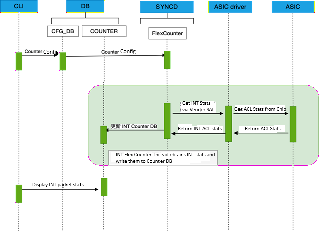

# SONiC TAM INT (In-band Network Telemetry) HLD #

## Table of Content

### 1. Revision

| Rev | Date | Author | Change Description |
|-----|------|--------|--------------------|
| 0.1 | 2026-02-09 | | INT/IFA Features HLD -- initial draft |

### 2. Scope

This document describes the In-band Network Telemetry (INT) feature family in SONiC TAM infrastructure, including:
- **INT**: In-band Network Telemetry — ACL-driven per-flow telemetry header insertion with configurable metadata (switch ID, ports, latency, queue depth) at each transit hop
- **IFA**: In-band Flow Analyzer — flow-level aggregation and end-to-end latency analytics with per-namespace tracking

This document covers the CONFIG_DB schema, SAI object model, orchestration logic, database schemas, and platform considerations for both features. Common TAM infrastructure (collectors, samplers, tammgrd, tamOrch base) is covered in [TAM_Infra_HLD.md](TAM_Infra_HLD.md).

### 3. Definitions/Abbreviations

| Term | Definition |
|------|------------|
| INT | In-band Network Telemetry |
| IFA | In-band Flow Analyzer |
| Hop-by-hop | Telemetry data added at each switch in the path |
| Instruction Bitmap | Bitmask specifying which metadata fields to include |
| INT Sink | Endpoint that receives and processes INT packets |
| INT Source | Starting point that initiates INT header insertion |
| INT Transit | Middle switch that adds INT metadata |
| Flow Analytics | Per-flow statistics collection and reporting |
| Namespace ID | Unique identifier for IFA flow monitoring domain |

### 4. Overview

The INT feature family provides comprehensive in-band telemetry capabilities for network visibility. Unlike MOD (which reports dropped packets), INT features collect telemetry from successfully forwarded packets, providing insights into network path, latency, queue depths, and flow behavior.

#### 4.1 Key Features

**INT (In-band Network Telemetry):**
- Inserts telemetry headers into transit packets
- Hop-by-hop metadata collection
- Configurable instruction bitmap for metadata selection
- Minimal packet overhead

#### 4.2 Real-World Use Cases

#### Use Case 1: Latency Troubleshooting in Multi-Tier Applications

**Scenario**: Video streaming service experiences intermittent jitter affecting user experience.

**Problem**: End-to-end monitoring shows 50ms latency spikes, but cannot identify which hop is responsible.

**INT Solution**:
1. Enable INT on all spine and leaf switches
2. Configure instruction bitmap `0x0F` (switch ID + ports + latency + queue depth)
3. INT headers collect per-hop latency at each transit node
4. Analysis reveals spine switch #3 has queue buildup during peak hours

**Resolution**: QoS reconfiguration at spine switch #3 eliminates jitter.

**Metrics Collected**:
- Hop-by-hop latency breakdown
- Queue depth at each hop
- Ingress/egress port identification
- Switch ID for each hop

#### Use Case 2: Path Verification in ECMP Networks

**Scenario**: Database replication traffic must follow specific paths for compliance (data sovereignty).

**Problem**: ECMP load balancing may route traffic through unapproved geographic regions.

**INT Solution**:
1. Configure INT for database replication flows (port 5432)
2. Collect switch IDs and port information
3. Monitor actual paths taken by packets
4. Verify no unexpected switches in path

**Resolution**: Identify policy violations and adjust routing weights.

#### Use Case 3: Congestion Detection for Capacity Planning

**Scenario**: E-commerce platform needs to plan network capacity for upcoming sales event.

**Problem**: Traditional SNMP polling (5-minute intervals) misses microsecond-level congestion.

**INT Solution**:
1. Enable INT on critical paths (web servers → databases)
2. Collect queue depth and port utilization metrics
3. Identify bottleneck links during load tests
4. Detect queue buildup patterns

**Resolution**: Proactive link upgrades before sales event.

#### Use Case 4: Combined INT + MOD for Complete Visibility

**Scenario**: Financial trading platform requires zero packet loss and sub-millisecond latency.

**Problem**: Need to monitor both successful packets (latency) and dropped packets (loss).

**Combined TAM Solution**:
- **MOD**: Captures dropped packets with reasons (ACL drops, buffer overflow, TTL expired)
- **INT**: Monitors latency and queue depth on forwarded packets
- **IFA**: Tracks flow-level latency statistics

**Workflow**:
1. MOD detects packet drops → Alert ops team
2. INT data shows queue buildup preceding drops → Identify congestion point
3. IFA provides historical latency trends → Root cause analysis

**Resolution**: Comprehensive visibility enables proactive issue prevention.

#### Use Case 5: Microservices Communication Debugging

**Scenario**: Kubernetes cluster with 100+ microservices experiencing intermittent timeouts.

**Problem**: Which hop in the service mesh is adding unexpected latency?

**INT Solution**:
1. Configure INT for east-west traffic (10.0.0.0/8)
2. Instruction bitmap includes timestamps and hop latency
3. Correlate INT data with application-level tracing (Jaeger/Zipkin)
4. Identify network latency vs. application latency

**Resolution**: Pinpoint specific network hops causing delays, distinguish from application issues.

### 5. Architecture


#### 5.1 INT Data Flow

```
┌─────────────────────────────────────────────────────────────────┐
│                        Source Switch                             │
│  ┌──────────────────────────────────────────────────────────┐  │
│  │  ACL Match (INT Flow Group)                             │  │
│  │  - Match 5-tuple or other criteria                       │  │
│  │  - Trigger INT insertion                                 │  │
│  └────────────────┬─────────────────────────────────────────┘  │
│                   │                                             │
│  ┌────────────────▼─────────────────────────────────────────┐  │
│  │  INT Header Insertion (INT Source)                       │  │
│  │  - Add INT shim header                                   │  │
│  │  - Initialize hop count                                  │  │
│  │  - Set instruction bitmap                                │  │
│  │  - Insert source node metadata                           │  │
│  └────────────────┬─────────────────────────────────────────┘  │
└───────────────────┼──────────────────────────────────────────────┘
                    │
                    ▼ Packet with INT header
┌─────────────────────────────────────────────────────────────────┐
│                       Transit Switch(es)                         │
│  ┌──────────────────────────────────────────────────────────┐  │
│  │  INT Transit Processing                                  │  │
│  │  - Detect INT header                                     │  │
│  │  - Parse instruction bitmap                              │  │
│  │  - Append transit node metadata:                         │  │
│  │    * Switch ID                                           │  │
│  │    * Ingress/Egress ports                                │  │
│  │    * Queue depth                                         │  │
│  │    * Timestamp                                           │  │
│  │    * Hop latency                                         │  │
│  │  - Increment hop count                                   │  │
│  └────────────────┬─────────────────────────────────────────┘  │
└───────────────────┼──────────────────────────────────────────────┘
                    │
                    ▼ Packet with INT metadata from multiple hops
┌─────────────────────────────────────────────────────────────────┐
│                         Sink Switch                              │
│  ┌──────────────────────────────────────────────────────────┐  │
│  │  INT Sink Processing                                     │  │
│  │  - Extract INT headers and metadata                      │  │
│  │  - Parse per-hop telemetry                               │  │
│  │  - Generate telemetry report                             │  │
│  │  - Export to collector via IPFIX/gRPC                    │  │
│  │  - Strip INT headers from packet                         │  │
│  │  - Forward original packet to destination                │  │
│  └──────────────────────────────────────────────────────────┘  │
└─────────────────────────────────────────────────────────────────┘
                    │
                    ▼
             Telemetry Collector
```

#### 5.2 IFA Data Flow

```
┌─────────────────────────────────────────────────────────────────┐
│                        Source Switch                             │
│  ┌──────────────────────────────────────────────────────────┐  │
│  │  Flow Detection                                          │  │
│  │  - Match source-ip, destination-ip                       │  │
│  │  - Create IFA flow entry                                 │  │
│  │  - Initialize flow state                                 │  │
│  └────────────────┬─────────────────────────────────────────┘  │
│                   │                                             │
│  ┌────────────────▼─────────────────────────────────────────┐  │
│  │  IFA Metadata Insertion                                  │  │
│  │  - Add IFA header                                        │  │
│  │  - Record ingress timestamp                              │  │
│  │  - Set namespace ID                                      │  │
│  │  - Initialize latency accumulator                        │  │
│  └────────────────┬─────────────────────────────────────────┘  │
└───────────────────┼──────────────────────────────────────────────┘
                    │
                    ▼
┌─────────────────────────────────────────────────────────────────┐
│                       Transit Switch(es)                         │
│  ┌──────────────────────────────────────────────────────────┐  │
│  │  IFA Transit Processing                                  │  │
│  │  - Record ingress timestamp                              │  │
│  │  - Calculate hop latency                                 │  │
│  │  - Update cumulative latency                             │  │
│  │  - Record queue depth                                    │  │
│  │  - Record egress timestamp                               │  │
│  └────────────────┬─────────────────────────────────────────┘  │
└───────────────────┼──────────────────────────────────────────────┘
                    │
                    ▼
┌─────────────────────────────────────────────────────────────────┐
│                         Sink Switch                              │
│  ┌──────────────────────────────────────────────────────────┐  │
│  │  IFA Flow Analytics                                      │  │
│  │  - Calculate end-to-end latency                          │  │
│  │  - Per-hop latency breakdown                             │  │
│  │  - Identify bottleneck hops                              │  │
│  │  - Generate flow report                                  │  │
│  │  - Export to collector                                   │  │
│  └──────────────────────────────────────────────────────────┘  │
└─────────────────────────────────────────────────────────────────┘
```


### 6. Configuration


#### 6.1 CONFIG_DB Schema

##### TAM_FEATURES Table (INT/IFA)

```
TAM_FEATURES|INT
    "status": "ACTIVE"               # Enable/disable INT
    "poll-interval": "1500"          # Polling interval in ms

TAM_FEATURES|IFA
    "status": "ACTIVE"               # Enable/disable IFA
    "poll-interval": "2000"

```

##### TAM_SESSION Table (INT Configuration)

```
TAM_SESSION|s-int
    "type": "INT"                    # Session type: INT
    "flowgroup": "fg-int"            # ACL rule for flow selection
    "collector": "c1"                # Collector reference
    "hop-limit": "16"                # Maximum INT hops (default: 16)
    "instruction-bitmap": "0x0F"     # INT metadata fields to collect
    "sample-rate": "s1"              # Sampling rate
```

**INT Instruction Bitmap Values:**
| Bit | Value | Metadata Field |
|-----|-------|----------------|
| 0 | 0x01 | Switch ID |
| 1 | 0x02 | Ingress/Egress Port IDs |
| 2 | 0x04 | Hop latency |
| 3 | 0x08 | Queue depth |
| 4 | 0x10 | Ingress timestamp |
| 5 | 0x20 | Egress timestamp |
| 6 | 0x40 | Queue congestion status |
| 7 | 0x80 | Egress port utilization |

**Common Bitmaps:**
- `0x0F` (15): Switch ID + Ports + Latency + Queue depth
- `0x3F` (63): All basic fields
- `0xFF` (255): All available fields

##### TAM_SESSION Table (IFA Configuration)

```
TAM_SESSION|s-ifa
    "type": "IFA"                    # Session type: IFA
    "source-ip": "10.0.0.1"          # Flow source IP
    "destination-ip": "10.0.0.2"     # Flow destination IP
    "collector": "c1"                # Collector reference
    "namespace-id": "100"            # IFA namespace (default: 0)
    "sample-rate": "s1"              # Sampling rate
```

**IFA Parameters:**
- `source-ip`: Flow source IP address (required)
- `destination-ip`: Flow destination IP address (required)
- `namespace-id`: Isolates IFA domains (0-65535)

##### TAM_FLOW_GROUP Table (INT/IFA Flow Selection)

```
TAM_FLOW_GROUP|fg-int
    "aging_interval": "60"
    "ports": ["Ethernet0", "Ethernet4"]

TAM_FLOW_GROUP|fg-int|rule1
    "src_ip_prefix": "10.0.0.0/8"
    "dst_ip_prefix": "10.1.0.0/16"
    "ip_protocol": "6"               # TCP
    "l4_dst_port": "443"             # HTTPS traffic
```

#### 6.2 Role-Based Configuration

Switches can operate in different INT roles:

##### INT Source Configuration
```json
{
  "TAM_SESSION": {
    "s-int-source": {
      "type": "INT",
      "role": "source",
      "flowgroup": "fg-int",
      "collector": "c1",
      "hop-limit": "16",
      "instruction-bitmap": "0x0F"
    }
  }
}
```

##### INT Transit Configuration
```json
{
  "TAM_SESSION": {
    "s-int-transit": {
      "type": "INT",
      "role": "transit",
      "instruction-bitmap": "0x0F"
    }
  }
}
```

##### INT Sink Configuration
```json
{
  "TAM_SESSION": {
    "s-int-sink": {
      "type": "INT",
      "role": "sink",
      "collector": "c1"
    }
  }
}
```

**Note:** A switch can be configured with multiple roles simultaneously.

### 7. SAI Object Model for INT Features


#### 7.1 INT Object Creation Sequence

**INT Object Creation Order:**
```
1. samplepacket (platform-dependent, required by some platforms)
2. tam_report (IPFIX type, required for SAI compliance)
3. tam_int (IFA2 type with device ID and sampling)
4. acl_table (with FIELD_TAM_INT_TYPE capability)
5. For each port:
   a. acl_counter (packet/byte statistics)
   b. acl_entry (with ACTION_INT_INSERT action)
```
**Dependency Chain:**
```
samplepacket (independent)
tam_report (independent)
tam_int (depends on: samplepacket, tam_report)
acl_table (independent)
acl_counter (depends on: acl_table)
acl_entry (depends on: acl_table, acl_counter, tam_int)
```

// Action:
SAI_ACL_ENTRY_ATTR_ACTION_TAM_INT_OBJECT = tam_int_id
SAI_ACL_ENTRY_ATTR_ACTION_ACL_COUNTER = acl_counter_id
```

#### 6. ACL Counter (for statistics)
Tracks how many packets match INT flow selection.

```cpp
sai_acl_api->create_acl_counter(&acl_counter_id, gSwitchId, attr_list);

// Attributes:
SAI_ACL_COUNTER_ATTR_TABLE_ID = acl_table_id
SAI_ACL_COUNTER_ATTR_ENABLE_PACKET_COUNT = true
SAI_ACL_COUNTER_ATTR_ENABLE_BYTE_COUNT = true
```

### 7.2 INT/IFA-Specific SAI Objects

#### Object 0: Samplepacket (Platform-Dependent)

**Purpose**: Initialize sampling for INT/IFA processing.

**Platform Support**:
- **Required**: Platform A (for SDK initialization)
- **Optional**: Platform B and others (can skip if not using sampling)

```cpp
sai_samplepacket_api->create_samplepacket(&samplepacket_id, gSwitchId, attr_list);

// Attributes:
SAI_SAMPLEPACKET_ATTR_SAMPLE_RATE = 1  // 1:1 sampling (no sampling)
SAI_SAMPLEPACKET_ATTR_TYPE = SAI_SAMPLEPACKET_TYPE_MIRROR_SESSION  // platform default
SAI_SAMPLEPACKET_ATTR_MODE = SAI_SAMPLEPACKET_MODE_EXCLUSIVE
```

**Configuration Note**: Uses 1:1 sampling by default (capture all INT packets).

#### Object 1: TAM Report (IPFIX Type)

**Purpose**: Define the reporting mechanism (required for SAI compliance).

```cpp
sai_tam_api->create_tam_report(&tam_report_id, gSwitchId, attr_list);

// Attributes:
SAI_TAM_REPORT_ATTR_TYPE = SAI_TAM_REPORT_TYPE_IPFIX
```

**Note**: This object is created for SAI specification compliance even if not actively used.

#### Object 2: TAM INT Object

**Purpose**: Configure INT functionality with IFA2 support.

```cpp
sai_tam_api->create_tam_int(&tam_int_id, gSwitchId, attr_list);

// Attributes:
SAI_TAM_INT_ATTR_TYPE = SAI_TAM_INT_TYPE_IFA2  // IFA 2.0 specification
SAI_TAM_INT_ATTR_INT_PRESENCE_TYPE = SAI_TAM_INT_PRESENCE_TYPE_L3_PROTOCOL
SAI_TAM_INT_ATTR_INLINE = true  // In-band mode
SAI_TAM_INT_ATTR_DEVICE_ID = switch_id_as_ipv4  // Network byte order
SAI_TAM_INT_ATTR_INGRESS_SAMPLEPACKET_ENABLE = samplepacket_id  // Link to sampling
SAI_TAM_INT_ATTR_INT_PRESENCE_L3_PROTOCOL = protocol_number  // INT detection protocol
SAI_TAM_INT_ATTR_REPORT_ID = tam_report_id  // Link to report object
```

**Key Attributes**:
- `DEVICE_ID`: Set from TAM_SWITCH|device "switch-id" (typically switch loopback IP)
- `INGRESS_SAMPLEPACKET_ENABLE`: Links to samplepacket object for sampling control
- `INT_PRESENCE_L3_PROTOCOL`: L3 protocol number used to detect INT packets

#### Object 3: ACL Table (INT Flow Selection)

**Purpose**: Create ACL table with INT-specific match fields.

```cpp
sai_acl_api->create_acl_table(&acl_table_id, gSwitchId, attr_list);

// Attributes:
SAI_ACL_TABLE_ATTR_ACL_STAGE = SAI_ACL_STAGE_INGRESS
SAI_ACL_TABLE_ATTR_FIELD_IN_PORT = true
SAI_ACL_TABLE_ATTR_FIELD_TAM_INT_TYPE = true  // INT-specific match field
SAI_ACL_TABLE_ATTR_ACL_ACTION_TYPE_LIST = {
    SAI_ACL_ACTION_TYPE_TAM_INT_OBJECT,
    SAI_ACL_ACTION_TYPE_COUNTER
}
```

**Critical Difference**: `SAI_ACL_TABLE_ATTR_FIELD_TAM_INT_TYPE` enables matching on INT packet type, distinguishing this from generic ACL tables.

#### Object 4: ACL Counter (Per-Port Statistics)

**Purpose**: Track INT packet statistics for each port.

```cpp
sai_acl_api->create_acl_counter(&acl_counter_id, gSwitchId, attr_list);

// Attributes:
SAI_ACL_COUNTER_ATTR_TABLE_ID = acl_table_id
SAI_ACL_COUNTER_ATTR_ENABLE_PACKET_COUNT = true
SAI_ACL_COUNTER_ATTR_ENABLE_BYTE_COUNT = true
```

**Note**: One counter is created per port for independent statistics tracking.

#### Object 5: ACL Entry (Per-Port INT Action)

**Purpose**: Enable INT insertion for each port.

```cpp
sai_acl_api->create_acl_entry(&acl_entry_id, gSwitchId, attr_list);

// Attributes:
SAI_ACL_ENTRY_ATTR_TABLE_ID = acl_table_id
SAI_ACL_ENTRY_ATTR_PRIORITY = 1
SAI_ACL_ENTRY_ATTR_ACTION_COUNTER = acl_counter_id
SAI_ACL_ENTRY_ATTR_ACTION_TAM_INT_OBJECT = tam_int_id
SAI_ACL_ENTRY_ATTR_ACTION_INT_INSERT = true  // CRITICAL: Enables INT insertion
SAI_ACL_ENTRY_ATTR_FIELD_IN_PORT = port_id
SAI_ACL_ENTRY_ATTR_FIELD_TAM_INT_TYPE = {
    .enable = true,
    .data.s32 = SAI_TAM_INT_TYPE_IFA2,
    .mask.u8 = 0x0F
}
```

**Critical Actions**:
- `ACTION_INT_INSERT`: Triggers INT header insertion
- `FIELD_TAM_INT_TYPE`: Matches packets with IFA2 INT headers

**Per-Port Configuration**: One ACL entry is created per port, allowing per-port INT control.

### 7.2.1 IFA-Specific SAI Objects (Future Extension)

#### TAM IFA Object
```cpp
sai_tam_api->create_tam_ifa(&tam_ifa_id, gSwitchId, attr_list);

// Attributes:
SAI_TAM_IFA_ATTR_DEVICE_ID = switch_id
SAI_TAM_IFA_ATTR_NAMESPACE_ID = 100  // IFA namespace
SAI_TAM_IFA_ATTR_SAMPLING_RATE = 1  // Sampling rate
```

#### TAM Event (Flow State Type)
```cpp
sai_tam_api->create_tam_event(&tam_event_id, gSwitchId, attr_list);

// Attributes:
SAI_TAM_EVENT_ATTR_TYPE = SAI_TAM_EVENT_TYPE_FLOW_STATE
SAI_TAM_EVENT_ATTR_ACTION_LIST = {tam_event_action_id}
SAI_TAM_EVENT_ATTR_COLLECTOR_LIST = {tam_collector_id}
```

### 7.3 INT Activation Sequence

```
1. Configure INT session in CONFIG_DB
2. tammgrd updates APPL_DB
3. tamOrch creates SAI objects:
   a. create_samplepacket() (Platform A requirement, optional for others)
   b. create_tam_int_report()
   c. create_tam_int() with instruction bitmap and hop limit
   d. create_acl_table() for flow matching
   e. For each port:
      - create_acl_counter() for statistics
      - create_acl_entry() with INT action and ACTION_INT_INSERT
   f. create_flex_counter() for INT statistics
4. Hardware begins INT processing on matched flows
5. INT metadata inserted/updated at each hop
6. Telemetry exported at sink to collector
```

#### 7.4 INT Configuration Procedure (Implementation Details)

This section provides the detailed step-by-step SAI API configuration for INT as a **transit forwarding node**, showing the actual SAI attribute settings required.

### Overview

The INT configuration creates the following objects in sequence:
1. **Samplepacket** (platform-dependent)
2. **TAM Report** (IPFIX type)
3. **TAM INT** object with IFA2 configuration
4. **ACL Table** for INT flow matching
5. **Per-port ACL Counters and Entries**

### Step 1: Create Samplepacket Object

**Purpose**: Initialize sampling for INT processing. 

**Platform Note**: Platform A requires this object for SDK initialization. Other platforms may skip this step if sampling is not used.

```cpp
sai_object_id_t samplepacket_id;
sai_attribute_t attr_list[3];
uint32_t attr_count = 0;

// Set sampling rate (1:1 = capture all packets)
attr_list[attr_count].id = SAI_SAMPLEPACKET_ATTR_SAMPLE_RATE;
attr_list[attr_count].value.u32 = sample_rate;  // Default: 1 (no sampling)
attr_count++;

// Set samplepacket type
attr_list[attr_count].id = SAI_SAMPLEPACKET_ATTR_TYPE;
attr_list[attr_count].value.s32 = SAI_SAMPLEPACKET_TYPE_MIRROR_SESSION;  // platform default
attr_count++;

// Set mode to exclusive
attr_list[attr_count].id = SAI_SAMPLEPACKET_ATTR_MODE;
attr_list[attr_count].value.s32 = SAI_SAMPLEPACKET_MODE_EXCLUSIVE;
attr_count++;

sai_status_t status = sai_samplepacket_api->create_samplepacket(
    &samplepacket_id, 
    gSwitchId,
    attr_count, 
    attr_list
);

if (status != SAI_STATUS_SUCCESS) {
    SWSS_LOG_ERROR("Failed to create samplepacket: %d", status);
    return false;
}
```

**Attributes:**
| Attribute | Value | Notes |
|-----------|-------|-------|
| SAI_SAMPLEPACKET_ATTR_SAMPLE_RATE | 1 (default) | 1:1 sampling = no sampling |
| SAI_SAMPLEPACKET_ATTR_TYPE | SAI_SAMPLEPACKET_TYPE_MIRROR_SESSION | Platform A requirement |
| SAI_SAMPLEPACKET_ATTR_MODE | SAI_SAMPLEPACKET_MODE_EXCLUSIVE | Exclusive mode |

### Step 2: Create TAM Report (IPFIX Type)

**Purpose**: Define the reporting mechanism. While this object is not actively used in the INT data path, SAI specification requires it for compilation.

```cpp
sai_object_id_t tam_report_id;
sai_attribute_t tam_attr_list[1];

tam_attr_list[0].id = SAI_TAM_REPORT_ATTR_TYPE;
tam_attr_list[0].value.s32 = SAI_TAM_REPORT_TYPE_IPFIX;

sai_status_t status = sai_tam_api->create_tam_report(
    &tam_report_id, 
    gSwitchId, 
    1, 
    tam_attr_list
);

if (status != SAI_STATUS_SUCCESS) {
    SWSS_LOG_ERROR("Failed to create TAM report: %d", status);
    return false;
}
```

**Attributes:**
| Attribute | Value | Notes |
|-----------|-------|-------|
| SAI_TAM_REPORT_ATTR_TYPE | SAI_TAM_REPORT_TYPE_IPFIX | Required for SAI compliance |

### Step 3: Create TAM INT Object

**Purpose**: Configure INT functionality including device ID, sampling, and L3 protocol detection.

```cpp
sai_object_id_t tam_int_id;
sai_attribute_t attr_list[7];
uint32_t attr_count = 0;

// Set INT type to IFA2
attr_list[attr_count].id = SAI_TAM_INT_ATTR_TYPE;
attr_list[attr_count].value.s32 = SAI_TAM_INT_TYPE_IFA2;
attr_count++;

// Set INT presence detection type
attr_list[attr_count].id = SAI_TAM_INT_ATTR_INT_PRESENCE_TYPE;
attr_list[attr_count].value.s32 = SAI_TAM_INT_PRESENCE_TYPE_L3_PROTOCOL;
attr_count++;

// Enable inline mode
attr_list[attr_count].id = SAI_TAM_INT_ATTR_INLINE;
attr_list[attr_count].value.booldata = true;
attr_count++;

// Set device ID (switch identifier, typically switch-id from CONFIG_DB)
struct in_addr ipv4_addr;
inet_pton(AF_INET, switch_id.c_str(), &ipv4_addr);
attr_list[attr_count].id = SAI_TAM_INT_ATTR_DEVICE_ID;
attr_list[attr_count].value.u32 = htonl(ipv4_addr.s_addr);
attr_count++;

// Link to samplepacket object (enables ingress sampling)
attr_list[attr_count].id = SAI_TAM_INT_ATTR_INGRESS_SAMPLEPACKET_ENABLE;
attr_list[attr_count].value.oid = samplepacket_id;
attr_count++;

// Set L3 protocol for INT detection
attr_list[attr_count].id = SAI_TAM_INT_ATTR_INT_PRESENCE_L3_PROTOCOL;
attr_list[attr_count].value.u8 = l3_protocol;  // Protocol number for INT detection
attr_count++;

// Link to TAM report
attr_list[attr_count].id = SAI_TAM_INT_ATTR_REPORT_ID;
attr_list[attr_count].value.oid = tam_report_id;
attr_count++;

sai_status_t status = sai_tam_api->create_tam_int(
    &tam_int_id, 
    gSwitchId, 
    attr_count, 
    attr_list
);

if (status != SAI_STATUS_SUCCESS) {
    SWSS_LOG_ERROR("Failed to create TAM INT: %d", status);
    return false;
}
```

**Attributes:**
| Attribute | Value | Notes |
|-----------|-------|-------|
| SAI_TAM_INT_ATTR_TYPE | SAI_TAM_INT_TYPE_IFA2 | IFA 2.0 specification |
| SAI_TAM_INT_ATTR_INT_PRESENCE_TYPE | SAI_TAM_INT_PRESENCE_TYPE_L3_PROTOCOL | Detect INT via L3 protocol |
| SAI_TAM_INT_ATTR_INLINE | true | In-band INT mode |
| SAI_TAM_INT_ATTR_DEVICE_ID | Switch IP (network byte order) | Node identifier |
| SAI_TAM_INT_ATTR_INGRESS_SAMPLEPACKET_ENABLE | samplepacket_id | Link to sampling object |
| SAI_TAM_INT_ATTR_INT_PRESENCE_L3_PROTOCOL | Protocol number | L3 protocol for detection |
| SAI_TAM_INT_ATTR_REPORT_ID | tam_report_id | Link to report object |

**Key Differences from Generic TAM Objects:**
- Uses `SAI_TAM_INT_ATTR_INGRESS_SAMPLEPACKET_ENABLE` to enable sampling
- Requires `SAI_TAM_INT_ATTR_INT_PRESENCE_L3_PROTOCOL` for INT packet detection
- Device ID is set from switch-id in CONFIG_DB (not hardcoded)

### Step 4: Create ACL Table for INT Flow Selection

**Purpose**: Create ACL table to match packets requiring INT insertion.

```cpp
sai_object_id_t acl_table_id;
sai_attribute_t attr_list[4];
uint32_t attr_count = 0;
int32_t action_list[2];
uint32_t action_count = 0;

// Set ACL stage to ingress
attr_list[attr_count].id = SAI_ACL_TABLE_ATTR_ACL_STAGE;
attr_list[attr_count].value.s32 = SAI_ACL_STAGE_INGRESS;  // Default port ingress
attr_count++;

// Enable ingress port matching
attr_list[attr_count].id = SAI_ACL_TABLE_ATTR_FIELD_IN_PORT;
attr_list[attr_count].value.booldata = true;
attr_count++;

// Enable TAM INT type matching (KEY DIFFERENCE)
attr_list[attr_count].id = SAI_ACL_TABLE_ATTR_FIELD_TAM_INT_TYPE;
attr_list[attr_count].value.booldata = true;
attr_count++;

// Define ACL actions
attr_list[attr_count].id = SAI_ACL_TABLE_ATTR_ACL_ACTION_TYPE_LIST;
attr_list[attr_count].value.s32list.list = action_list;
action_list[action_count++] = SAI_ACL_ACTION_TYPE_TAM_INT_OBJECT;
action_list[action_count++] = SAI_ACL_ACTION_TYPE_COUNTER;
attr_list[attr_count].value.s32list.count = action_count;
attr_count++;

sai_status_t status = sai_acl_api->create_acl_table(
    &acl_table_id, 
    gSwitchId, 
    attr_count, 
    attr_list
);

if (status != SAI_STATUS_SUCCESS) {
    SWSS_LOG_ERROR("Failed to create ACL table: %d", status);
    return false;
}
```

**Attributes:**
| Attribute | Value | Notes |
|-----------|-------|-------|
| SAI_ACL_TABLE_ATTR_ACL_STAGE | SAI_ACL_STAGE_INGRESS | Ingress processing |
| SAI_ACL_TABLE_ATTR_FIELD_IN_PORT | true | Match on ingress port |
| **SAI_ACL_TABLE_ATTR_FIELD_TAM_INT_TYPE** | **true** | **INT-specific match field** |
| SAI_ACL_TABLE_ATTR_ACL_ACTION_TYPE_LIST | TAM_INT_OBJECT, COUNTER | INT action + counter |

**Critical Note**: `SAI_ACL_TABLE_ATTR_FIELD_TAM_INT_TYPE` is the key difference for INT ACL tables. This allows matching on INT packet type.

### Step 5: Create Per-Port ACL Counters and Entries

**Purpose**: For each port, create an ACL counter and entry to enable INT insertion.

```cpp
// Iterate through all ports
for (auto const &curr : gPortsOrch->getAllPorts())
{
    sai_object_id_t port_id = curr.second.m_port_id;
    
    // Step 5.1: Create ACL Counter for this port
    sai_object_id_t acl_counter_id;
    sai_attribute_t counter_attr_list[3];
    uint32_t counter_attr_count = 0;
    
    counter_attr_list[counter_attr_count].id = SAI_ACL_COUNTER_ATTR_TABLE_ID;
    counter_attr_list[counter_attr_count].value.oid = acl_table_id;
    counter_attr_count++;
    
    counter_attr_list[counter_attr_count].id = SAI_ACL_COUNTER_ATTR_ENABLE_PACKET_COUNT;
    counter_attr_list[counter_attr_count].value.booldata = true;
    counter_attr_count++;
    
    counter_attr_list[counter_attr_count].id = SAI_ACL_COUNTER_ATTR_ENABLE_BYTE_COUNT;
    counter_attr_list[counter_attr_count].value.booldata = true;
    counter_attr_count++;
    
    sai_status_t status = sai_acl_api->create_acl_counter(
        &acl_counter_id, 
        gSwitchId, 
        counter_attr_count,
        counter_attr_list
    );
    
    if (status != SAI_STATUS_SUCCESS) {
        SWSS_LOG_ERROR("Failed to create ACL counter for port: %d", status);
        continue;
    }
    
    // Step 5.2: Create ACL Entry for this port
    sai_object_id_t acl_entry_id;
    sai_attribute_t entry_attr_list[7];
    uint32_t entry_attr_count = 0;
    
    // Set table ID
    entry_attr_list[entry_attr_count].id = SAI_ACL_ENTRY_ATTR_TABLE_ID;
    entry_attr_list[entry_attr_count].value.oid = acl_table_id;
    entry_attr_count++;
    
    // Set priority
    entry_attr_list[entry_attr_count].id = SAI_ACL_ENTRY_ATTR_PRIORITY;
    entry_attr_list[entry_attr_count].value.u32 = 1;  // Priority 1
    entry_attr_count++;
    
    // Action: Attach counter
    entry_attr_list[entry_attr_count].id = SAI_ACL_ENTRY_ATTR_ACTION_COUNTER;
    entry_attr_list[entry_attr_count].value.aclaction.parameter.oid = acl_counter_id;
    entry_attr_list[entry_attr_count].value.aclaction.enable = true;
    entry_attr_count++;
    
    // Action: Attach TAM INT object
    entry_attr_list[entry_attr_count].id = SAI_ACL_ENTRY_ATTR_ACTION_TAM_INT_OBJECT;
    entry_attr_list[entry_attr_count].value.aclaction.parameter.oid = tam_int_id;
    entry_attr_list[entry_attr_count].value.aclaction.enable = true;
    entry_attr_count++;
    
    // Action: Enable INT insertion (KEY ACTION)
    entry_attr_list[entry_attr_count].id = SAI_ACL_ENTRY_ATTR_ACTION_INT_INSERT;
    entry_attr_list[entry_attr_count].value.aclaction.parameter.booldata = true;
    entry_attr_list[entry_attr_count].value.aclaction.enable = true;
    entry_attr_count++;
    
    // Match field: Ingress port
    entry_attr_list[entry_attr_count].id = SAI_ACL_ENTRY_ATTR_FIELD_IN_PORT;
    entry_attr_list[entry_attr_count].value.aclfield.data.oid = port_id;
    entry_attr_list[entry_attr_count].value.aclfield.enable = true;
    entry_attr_count++;
    
    // Match field: TAM INT type (IFA2)
    entry_attr_list[entry_attr_count].id = SAI_ACL_ENTRY_ATTR_FIELD_TAM_INT_TYPE;
    entry_attr_list[entry_attr_count].value.aclfield.enable = true;
    entry_attr_list[entry_attr_count].value.aclfield.data.s32 = SAI_TAM_INT_TYPE_IFA2;
    entry_attr_list[entry_attr_count].value.aclfield.mask.u8 = 0x0F;
    entry_attr_count++;
    
    SWSS_LOG_INFO("Creating ACL entry - table:0x%lx, counter:0x%lx, tam_int:0x%lx, port:0x%lx", 
                  acl_table_id, acl_counter_id, tam_int_id, port_id);
    
    status = sai_acl_api->create_acl_entry(
        &acl_entry_id, 
        gSwitchId, 
        entry_attr_count, 
        entry_attr_list
    );
    
    if (status != SAI_STATUS_SUCCESS) {
        SWSS_LOG_ERROR("Failed to create ACL entry for port: %d", status);
        continue;
    }
    
    // Store entry and counter IDs for cleanup
    m_acl_entry_ids[port_id] = acl_entry_id;
    m_acl_counter_ids[port_id] = acl_counter_id;
}
```

**ACL Counter Attributes:**
| Attribute | Value | Notes |
|-----------|-------|-------|
| SAI_ACL_COUNTER_ATTR_TABLE_ID | acl_table_id | Link to ACL table |
| SAI_ACL_COUNTER_ATTR_ENABLE_PACKET_COUNT | true | Track packet count |
| SAI_ACL_COUNTER_ATTR_ENABLE_BYTE_COUNT | true | Track byte count |

**ACL Entry Attributes:**
| Attribute | Value | Notes |
|-----------|-------|-------|
| SAI_ACL_ENTRY_ATTR_TABLE_ID | acl_table_id | Link to ACL table |
| SAI_ACL_ENTRY_ATTR_PRIORITY | 1 | Entry priority |
| SAI_ACL_ENTRY_ATTR_ACTION_COUNTER | acl_counter_id | Attach counter |
| SAI_ACL_ENTRY_ATTR_ACTION_TAM_INT_OBJECT | tam_int_id | Attach TAM INT object |
| **SAI_ACL_ENTRY_ATTR_ACTION_INT_INSERT** | **true** | **Enable INT insertion** |
| SAI_ACL_ENTRY_ATTR_FIELD_IN_PORT | port_id | Match on port |
| SAI_ACL_ENTRY_ATTR_FIELD_TAM_INT_TYPE | SAI_TAM_INT_TYPE_IFA2 with mask 0x0F | Match INT type |

**Critical Actions:**
- `SAI_ACL_ENTRY_ATTR_ACTION_INT_INSERT`: This is the key action that enables INT header insertion
- `SAI_ACL_ENTRY_ATTR_FIELD_TAM_INT_TYPE`: Matches packets with INT/IFA2 headers

### Configuration Summary

**Object Creation Order:**
```
1. samplepacket (if platform requires)
2. tam_report (IPFIX type)
3. tam_int (with IFA2 type and ingress sampling)
4. acl_table (with FIELD_TAM_INT_TYPE)
5. For each port:
   - acl_counter
   - acl_entry (with ACTION_INT_INSERT)
```

**Key Differences from Generic TAM:**
1. **Samplepacket object**: Required for Platform A, optional for others
2. **TAM INT attributes**: Uses `INGRESS_SAMPLEPACKET_ENABLE` and `INT_PRESENCE_L3_PROTOCOL`
3. **ACL table**: Includes `FIELD_TAM_INT_TYPE` for INT packet matching
4. **ACL entry**: Includes `ACTION_INT_INSERT` to trigger header insertion
5. **Per-port configuration**: Creates ACL entries for each port individually

**Platform Notes:**
- **Platform A**: Requires samplepacket object for SDK initialization
- **Platform B**: Can skip samplepacket if not using sampling
- **All platforms**: Must support `SAI_TAM_INT_TYPE_IFA2` and related ACL attributes

### 8. INT Metadata Format

### 8.1 INT Header Structure

```
 0                   1                   2                   3
 0 1 2 3 4 5 6 7 8 9 0 1 2 3 4 5 6 7 8 9 0 1 2 3 4 5 6 7 8 9 0 1
+-+-+-+-+-+-+-+-+-+-+-+-+-+-+-+-+-+-+-+-+-+-+-+-+-+-+-+-+-+-+-+-+
|Ver|R|C|E|M|Rsvd| Hop Count     | Instruction Bitmap            |
+-+-+-+-+-+-+-+-+-+-+-+-+-+-+-+-+-+-+-+-+-+-+-+-+-+-+-+-+-+-+-+-+
|                    Max Hop Count                              |
+-+-+-+-+-+-+-+-+-+-+-+-+-+-+-+-+-+-+-+-+-+-+-+-+-+-+-+-+-+-+-+-+
|                    Total Hop Count                            |
+-+-+-+-+-+-+-+-+-+-+-+-+-+-+-+-+-+-+-+-+-+-+-+-+-+-+-+-+-+-+-+-+
|                    Instruction Mask                           |
+-+-+-+-+-+-+-+-+-+-+-+-+-+-+-+-+-+-+-+-+-+-+-+-+-+-+-+-+-+-+-+-+
|                    Domain Specific ID                         |
+-+-+-+-+-+-+-+-+-+-+-+-+-+-+-+-+-+-+-+-+-+-+-+-+-+-+-+-+-+-+-+-+
|                    Instructions and Hop Data                  |
|                    (variable length)                          |
+-+-+-+-+-+-+-+-+-+-+-+-+-+-+-+-+-+-+-+-+-+-+-+-+-+-+-+-+-+-+-+-+
```

### 8.2 Per-Hop Metadata (based on instruction bitmap)

**Switch ID (Bit 0 = 0x01):**
```
+-+-+-+-+-+-+-+-+-+-+-+-+-+-+-+-+-+-+-+-+-+-+-+-+-+-+-+-+-+-+-+-+
|                         Switch ID (32 bits)                    |
+-+-+-+-+-+-+-+-+-+-+-+-+-+-+-+-+-+-+-+-+-+-+-+-+-+-+-+-+-+-+-+-+
```

**Ingress/Egress Port IDs (Bit 1 = 0x02):**
```
+-+-+-+-+-+-+-+-+-+-+-+-+-+-+-+-+-+-+-+-+-+-+-+-+-+-+-+-+-+-+-+-+
|      Ingress Port (16 bits)   |      Egress Port (16 bits)    |
+-+-+-+-+-+-+-+-+-+-+-+-+-+-+-+-+-+-+-+-+-+-+-+-+-+-+-+-+-+-+-+-+
```

**Hop Latency (Bit 2 = 0x04):**
```
+-+-+-+-+-+-+-+-+-+-+-+-+-+-+-+-+-+-+-+-+-+-+-+-+-+-+-+-+-+-+-+-+
|                    Hop Latency (32 bits, ns)                   |
+-+-+-+-+-+-+-+-+-+-+-+-+-+-+-+-+-+-+-+-+-+-+-+-+-+-+-+-+-+-+-+-+
```

**Queue Depth (Bit 3 = 0x08):**
```
+-+-+-+-+-+-+-+-+-+-+-+-+-+-+-+-+-+-+-+-+-+-+-+-+-+-+-+-+-+-+-+-+
|      Queue ID (16 bits)       |    Queue Depth (16 bits)      |
+-+-+-+-+-+-+-+-+-+-+-+-+-+-+-+-+-+-+-+-+-+-+-+-+-+-+-+-+-+-+-+-+
```

**Timestamps (Bits 4-5 = 0x30):**
```
+-+-+-+-+-+-+-+-+-+-+-+-+-+-+-+-+-+-+-+-+-+-+-+-+-+-+-+-+-+-+-+-+
|                  Ingress Timestamp (64 bits, ns)               |
|                                                                |
+-+-+-+-+-+-+-+-+-+-+-+-+-+-+-+-+-+-+-+-+-+-+-+-+-+-+-+-+-+-+-+-+
|                  Egress Timestamp (64 bits, ns)                |
|                                                                |
+-+-+-+-+-+-+-+-+-+-+-+-+-+-+-+-+-+-+-+-+-+-+-+-+-+-+-+-+-+-+-+-+
```

### 8.3 IFA Metadata Format

IFA uses a specialized format for flow analytics:

```
+-+-+-+-+-+-+-+-+-+-+-+-+-+-+-+-+-+-+-+-+-+-+-+-+-+-+-+-+-+-+-+-+
|                    IFA Header                                  |
+-+-+-+-+-+-+-+-+-+-+-+-+-+-+-+-+-+-+-+-+-+-+-+-+-+-+-+-+-+-+-+-+
|      Namespace ID (16 bits)   |    Sequence Number (16 bits)  |
+-+-+-+-+-+-+-+-+-+-+-+-+-+-+-+-+-+-+-+-+-+-+-+-+-+-+-+-+-+-+-+-+
|                    Source IP (32 bits)                         |
+-+-+-+-+-+-+-+-+-+-+-+-+-+-+-+-+-+-+-+-+-+-+-+-+-+-+-+-+-+-+-+-+
|                    Destination IP (32 bits)                    |
+-+-+-+-+-+-+-+-+-+-+-+-+-+-+-+-+-+-+-+-+-+-+-+-+-+-+-+-+-+-+-+-+
|                    Cumulative Latency (32 bits, ns)            |
+-+-+-+-+-+-+-+-+-+-+-+-+-+-+-+-+-+-+-+-+-+-+-+-+-+-+-+-+-+-+-+-+
|                    Per-Hop Latency Data (variable)             |
+-+-+-+-+-+-+-+-+-+-+-+-+-+-+-+-+-+-+-+-+-+-+-+-+-+-+-+-+-+-+-+-+
```

### 9. INT State Machine

### 9.1 INT Feature Activation

```
┌─────────────┐
│  DISABLED   │
│ (Initial)   │
└──────┬──────┘
       │ TAM_FEATURES|INT status="ACTIVE"
       │ TAM_SESSION|s-int type="INT"
       ▼
┌─────────────────────────────────────────┐
│  CREATING_INT_OBJECTS                   │
│  1. create_tam_int_report()             │
│  2. create_tam_transport(IPFIX/gRPC)    │
│  3. create_tam_collector()              │
│  4. create_tam_int()                    │
│     - INT instruction bitmap            │
│     - Hop limit configuration           │
│     - Node ID (switch-id)               │
│  5. create_tam_event(TYPE_INT)          │
│  6. create_tam()                        │
│  7. create_acl_table(INT flow matching) │
│  8. create_acl_entry(flowgroup)         │
│  9. bind_tam_to_acl()                   │
│  10. create_flex_counter(INT stats)     │
└──────┬──────────────────────────────────┘
       │ All objects created successfully
       ▼
┌─────────────────────────────────────────┐
│  ENABLING                               │
│  enable_int_set_switch_attribute()      │
│  - Set SAI_SWITCH_ATTR_TAM_OBJECT_ID    │
│  - Enable INT on matched flows          │
└──────┬──────────────────────────────────┘
       │ Switch attribute set
       ▼
┌─────────────┐
│   ENABLED   │
│  (Active)   │◄─────────────────┐
│  - Insert   │                  │
│    INT      │  Session update  │
│    headers  │  (no state chg)  │
└──────┬──────┘                  │
       │ status="INACTIVE"       │
       ▼                         │
┌─────────────────────────────────────────┐
│  DISABLING                              │
│  disable_int_set_switch_attribute()     │
│  - Clear SAI_SWITCH_ATTR_TAM_OBJECT_ID  │
└──────┬──────────────────────────────────┘
       │ Switch attribute cleared
       ▼
┌─────────────────────────────────────────┐
│  DELETING_INT_OBJECTS                   │
│  (Reverse order)                        │
│  1. delete_flex_counter()               │
│  2. unbind_tam_from_acl()               │
│  3. delete_acl_entry()                  │
│  4. delete_acl_table()                  │
│  5. delete_tam()                        │
│  6. delete_tam_event()                  │
│  7. delete_tam_int()                    │
│  8. delete_tam_collector()              │
│  9. delete_tam_transport()              │
│  10. delete_tam_int_report()            │
└──────┬──────────────────────────────────┘
       │ All objects deleted
       ▼
┌─────────────┐
│  DISABLED   │
└─────────────┘
```

### 9.2 IFA Feature Activation

```
┌─────────────┐
│  DISABLED   │
│ (Initial)   │
└──────┬──────┘
       │ TAM_FEATURES|IFA status="ACTIVE"
       │ TAM_SESSION|s-ifa type="IFA"
       ▼
┌─────────────────────────────────────────┐
│  CREATING_IFA_OBJECTS                   │
│  1. create_tam_transport(IPFIX)         │
│  2. create_tam_collector()              │
│  3. create_tam_ifa()                    │
│     - Flow source/dest IP               │
│     - Latency measurement config        │
│     - Namespace ID                      │
│  4. create_tam_event(TYPE_FLOW_STATE)   │
│  5. create_tam()                        │
│  6. create_acl_table(IFA flow match)    │
│  7. create_acl_entry(5-tuple match)     │
│  8. bind_tam_to_acl()                   │
│  9. create_flex_counter(IFA stats)      │
└──────┬──────────────────────────────────┘
       │ All objects created successfully
       ▼
┌─────────────────────────────────────────┐
│  ENABLING                               │
│  enable_ifa_set_switch_attribute()      │
│  - Set SAI_SWITCH_ATTR_TAM_OBJECT_ID    │
│  - Enable IFA on matched flows          │
└──────┬──────────────────────────────────┘
       │ Switch attribute set
       ▼
┌─────────────┐
│   ENABLED   │
│  (Active)   │◄─────────────────┐
│  - Collect  │                  │
│    latency  │  Session update  │
│    metrics  │  (no state chg)  │
└──────┬──────┘                  │
       │ status="INACTIVE"       │
       ▼                         │
┌─────────────────────────────────────────┐
│  DISABLING                              │
│  disable_ifa_set_switch_attribute()     │
│  - Clear SAI_SWITCH_ATTR_TAM_OBJECT_ID  │
└──────┬──────────────────────────────────┘
       │ Switch attribute cleared
       ▼
┌─────────────────────────────────────────┐
│  DELETING_IFA_OBJECTS                   │
│  (Reverse order)                        │
│  1. delete_flex_counter()               │
│  2. unbind_tam_from_acl()               │
│  3. delete_acl_entry()                  │
│  4. delete_acl_table()                  │
│  5. delete_tam()                        │
│  6. delete_tam_event()                  │
│  7. delete_tam_ifa()                    │
│  8. delete_tam_collector()              │
│  9. delete_tam_transport()              │
└──────┬──────────────────────────────────┘
       │ All objects deleted
       ▼
┌─────────────┐
│  DISABLED   │
└─────────────┘
```

### 10. Multi-Feature Concurrent Operation

```
┌──────────────────────────────────────────────┐
│  Multiple TAM Features Active Simultaneously │
├──────────────────────────────────────────────┤
│  DROPMONITOR: ENABLED (genetlink to CPU)     │
│  INT:         ENABLED (header insertion)     │
│  IFA:         ENABLED (flow analytics)       │
├──────────────────────────────────────────────┤
│  Each feature maintains independent:         │
│  - SAI TAM objects                           │
│  - TAM event types                           │
│  - Collectors                                │
│  - State machines                            │
│  - Session configurations                    │
│  - ACL tables/entries                        │
└──────────────────────────────────────────────┘
```

**Resource Sharing:**
- Multiple features can share collectors
- Different ACL tables per feature
- Independent sampling rates
- Separate flex counters

### 11. Database Schemas



### 11.1 COUNTERS_DB (INT Statistics)

```
COUNTERS_TAM_INT:<acl_counter_oid>
    "packets": "12345"               # Packets with INT inserted
    "bytes": "6789012"               # Bytes processed

COUNTERS_TAM_INT_HOP:<switch_id>:<hop_id>
    "packets": "456"
    "avg_latency": "1250"            # Average hop latency (ns)
    "max_latency": "5000"            # Max hop latency (ns)
    "avg_queue_depth": "25"          # Average queue depth
```

### 11.2 STATE_DB (IFA Flow Statistics)

```
TAM_IFA_FLOW:<src_ip>:<dst_ip>
    "namespace_id": "100"
    "packet_count": "1000"
    "avg_latency": "12500"           # End-to-end latency (ns)
    "max_latency": "50000"
    "min_latency": "5000"
    "hop_count": "5"
    "first_seen": "1234567890.123"
    "last_seen": "1234567950.456"
```

### 12. Flex Counter Integration

### 12.1 INT Flex Counters

```cpp
// Register flex counter for INT statistics
auto flex_counter_manager = FlexCounterManager::getInstance();

flex_counter_manager->addCounter(
    TAM_INT_FLEX_COUNTER_GROUP,      // Counter group name
    tam_int_acl_counter_oid,          // ACL counter OID
    "TAM_INT",                        // Counter key
    TAM_INT_COUNTER_FLEX_COUNTER_GROUP // DB key
);
```

**Polling Behavior:**
- Poll interval from `TAM_FEATURES|INT poll-interval`
- Updates COUNTERS_DB periodically
- Tracks packet/byte counts for INT-enabled flows

### 12.2 Counter Queries

```bash
# Query INT packet counts
redis-cli -n 2 HGETALL "COUNTERS_TAM_INT:<counter_oid>"

# Query IFA flow statistics
redis-cli -n 6 KEYS "TAM_IFA_FLOW:*"
redis-cli -n 6 HGETALL "TAM_IFA_FLOW:10.0.0.1:10.0.0.2"
```

### 13. Troubleshooting

### 13.1 INT Verification

#### Step 1: Check INT Configuration
```bash
# Verify INT is enabled
redis-cli -n 4 HGETALL "TAM_FEATURES|INT"
# Expected: status=ACTIVE

# Check INT session
redis-cli -n 4 HGETALL "TAM_SESSION|s-int"
# Verify flowgroup, collector, hop-limit, instruction-bitmap

# Check flow group
redis-cli -n 4 KEYS "TAM_FLOW_GROUP|fg-int*"
redis-cli -n 4 HGETALL "TAM_FLOW_GROUP|fg-int|rule1"
```

#### Step 2: Verify SAI Objects
```bash
# Check for INT object creation
sudo cat /var/log/syslog | grep "create_tam_int"
sudo cat /var/log/syslog | grep "instruction_bitmap"
sudo cat /var/log/syslog | grep "hop_limit"

# Check ACL table/entry creation
sudo cat /var/log/syslog | grep "create_acl_table"
sudo cat /var/log/syslog | grep "create_acl_entry"
sudo cat /var/log/syslog | grep "ACTION_TAM_INT"
```

#### Step 3: Check INT Statistics
```bash
# Check flex counter group
redis-cli -n 2 KEYS "COUNTERS_TAM_INT:*"

# Get INT packet counts
redis-cli -n 2 HGETALL "COUNTERS_TAM_INT:<counter_oid>"

# Verify packets are being processed
# If packets=0, INT may not be matching flows correctly
```

### 13.2 IFA Verification

#### Step 1: Check IFA Configuration
```bash
# Verify IFA is enabled
redis-cli -n 4 HGETALL "TAM_FEATURES|IFA"

# Check IFA session
redis-cli -n 4 HGETALL "TAM_SESSION|s-ifa"
# Verify source-ip, destination-ip, namespace-id
```

#### Step 2: Check IFA Flow Statistics
```bash
# List active IFA flows
redis-cli -n 6 KEYS "TAM_IFA_FLOW:*"

# Get flow details
redis-cli -n 6 HGETALL "TAM_IFA_FLOW:10.0.0.1:10.0.0.2"

# Check for latency metrics
# avg_latency, max_latency, min_latency should be populated
```

### 13.3 Common Issues

#### Issue 1: INT Headers Not Inserted
**Symptoms:**
- INT configured and enabled
- ACL counters show matched packets
- No INT headers in captured packets at sink

**Diagnosis:**
```bash
# Check ACL entry action
sudo cat /var/log/syslog | grep "ACTION_TAM_INT_OBJECT"

# Verify instruction bitmap
sudo cat /var/log/syslog | grep "instruction_bitmap" | grep "0x0F"

# Check switch attribute
sudo cat /var/log/syslog | grep "SAI_SWITCH_ATTR_TAM_OBJECT_ID"
```

**Resolution:**
1. Verify ACL entry has correct INT action
2. Check instruction bitmap is non-zero
3. Ensure switch attribute is set
4. Verify platform supports INT feature

#### Issue 2: IFA Flows Not Tracked
**Symptoms:**
- IFA enabled
- No flow entries in STATE_DB
- Traffic is flowing between source and destination IPs

**Diagnosis:**
```bash
# Check if traffic matches configured IPs
redis-cli -n 4 HGET "TAM_SESSION|s-ifa" "source-ip"
redis-cli -n 4 HGET "TAM_SESSION|s-ifa" "destination-ip"

# Verify flow group ACL
redis-cli -n 4 KEYS "TAM_FLOW_GROUP|*"

# Check for SAI errors
sudo cat /var/log/syslog | grep "create_tam_ifa" | grep -i error
```

**Resolution:**
1. Verify source-ip and destination-ip match actual traffic
2. Check namespace-id doesn't conflict with other IFA domains
3. Ensure platform supports IFA feature
4. Review SAI capability: `sai_query_attribute_capability TAM_IFA`

#### Issue 3: Multiple Features Interfering
**Symptoms:**
- INT works alone, but fails when IFA is enabled
- Resource exhaustion errors in logs

**Diagnosis:**
```bash
# Check for resource errors
sudo cat /var/log/syslog | grep "INSUFFICIENT_RESOURCES"
sudo cat /var/log/syslog | grep "NO_MEMORY"

# Count active SAI objects
sudo cat /var/log/syslog | grep "create_tam" | wc -l
sudo cat /var/log/syslog | grep "create_acl" | wc -l
```

**Resolution:**
1. Disable one feature temporarily to isolate issue
2. Check platform limits for simultaneous TAM features
3. Reduce complexity (fewer ACL rules, lower sampling)
4. Review platform documentation for TAM scale limits

### 13.4 Diagnostic Commands Summary

| Command | Purpose |
|---------|---------|
| `show tam int` | INT status and configuration |
| `show tam int statistics` | INT packet counts and metadata |
| `show tam ifa` | IFA status and flow tracking |
| `show tam ifa flows` | Active IFA flows with latencies |
| `redis-cli -n 4 HGETALL "TAM_FEATURES\|INT"` | INT configuration |
| `redis-cli -n 2 KEYS "COUNTERS_TAM_INT:*"` | INT statistics |
| `redis-cli -n 6 KEYS "TAM_IFA_FLOW:*"` | IFA flows |
| `docker logs swss \| grep tamorch \| grep INT` | INT orchestration logs |

### 14. Performance and Scaling

### 14.1 INT Overhead

**Header Size:**
- Base INT header: 16 bytes
- Per-hop metadata (instruction bitmap 0x0F): 12 bytes per hop
- Example: 5 hops = 16 + (5 × 12) = 76 bytes overhead

**Processing Overhead:**
- Source: Header insertion (~100-200 ns)
- Transit: Metadata append (~50-100 ns per hop)
- Sink: Header parsing and removal (~200-300 ns)

**Network Overhead:**
- For 1500-byte packets: ~5% overhead (76 / 1500)
- For 64-byte packets: ~120% overhead (significant)

### 14.2 Scaling Limits

| Parameter | Typical Limit | Notes |
|-----------|---------------|-------|
| Max INT hops | 16 | Configurable via hop-limit |
| Max concurrent flows (INT) | 1K-10K | Depends on ACL table size |
| Max IFA flows | 10K-100K | Depends on platform |
| INT packet rate | Platform-specific | Limited by ASIC capabilities |
| Instruction bitmap fields | 8 bits (8 fields) | Standard INT spec |

### 14.3 Optimization Recommendations

1. **Selective INT Insertion**: Use ACL flow groups to target specific flows
2. **Minimal Instruction Bitmap**: Only collect necessary metadata (e.g., 0x0F instead of 0xFF)
3. **Sampling**: Apply sampling for high-volume flows
4. **Hop Limit**: Set appropriate hop-limit to prevent excessive header growth
5. **IFA for Long-Term Monitoring**: Use IFA instead of INT for continuous monitoring
6. **Offload Processing**: Use hardware offload where available (platform-specific)

### 15. Warmboot and Fastboot Design Impact

#### 15.1 Warmboot

The INT feature has no impact on the warmboot data-plane continuity guarantee. INT operates via ACL-based header insertion in the forwarding pipeline — it does not modify port state, forwarding tables, or the critical convergence path.

**Behavior during warmboot:**

- SAI INT/TAM objects are **not preserved** across a warm reboot. The SAI/ASIC state is torn down and rebuilt by orchagent on restart.
- On startup, `tammgrd` re-reads all TAM tables from CONFIG_DB and re-populates APPL_DB.
- `tamOrch` recreates all SAI objects (TAM + ACL) on startup.
- INT header insertion resumes within the normal orchagent convergence window.
- Any packets forwarded during the convergence window do not carry INT headers — this is acceptable as telemetry data is best-effort.

**No additional warmboot stalls are introduced.** TAM Docker startup is independent of the critical convergence path.

#### 15.2 Fastboot

TAM Docker does **not** participate in the critical-path startup sequence.

- TAM Docker is started after the critical path (port bring-up, VLAN, route convergence) completes.
- No Jinja template rendering or heavy CPU processing is performed during boot.
- No third-party dependencies are added.

**Boot time impact: None** when INT features are disabled.

#### 15.3 Summary

| Aspect | Impact | Notes |
| --- | --- | --- |
| Data-plane downtime | None | INT is ACL-based, control-plane programmed |
| Boot critical chain stalls | None | TAM Docker not in critical path |
| CPU-heavy boot processing | None | No template rendering or heavy I/O |
| Third-party dependency changes | None | No new dependencies |
| INT telemetry gap on reboot | Brief | Packets during orchagent convergence window do not carry INT headers |
| Feature disabled overhead | None | No memory or CPU cost when TAM_FEATURES\|INT/IFA is INACTIVE |

### 16. Memory Consumption

#### 16.1 Feature Disabled

When all INT-related `TAM_FEATURES` entries are set to `INACTIVE`:

- **No SAI TAM or ACL objects created** — zero ASIC table entries consumed
- **No COUNTERS_DB entries** — INT/IFA counter tables are empty
- **tammgrd memory** — minimal (~2 MB RSS, subscribe-only mode)

#### 16.2 Feature Enabled — Control Plane Objects

| Component | Memory | Notes |
| --- | --- | --- |
| TAM infrastructure objects (shared with other features) | ~1 KB | SAI object metadata |
| INT ACL table + entries | ~10 KB | One ACL entry per configured port |
| IFA flow state table | ~500 bytes/flow | Per active flow, bounded by aging |
| `tamOrch` in-memory state | ~50 KB | SAI OID cache, APPL_DB subscriber |
| `tammgrd` daemon | ~5 MB RSS | Python process with Redis subscribers |

#### 16.3 COUNTERS_DB Growth

| Feature | Entry Size | Notes |
| --- | --- | --- |
| INT | ~200 bytes per ACL counter | One counter per flow group |
| IFA | ~500 bytes per flow | Bounded by aging interval |

#### 16.4 Summary

| Scenario | Additional Memory |
| --- | --- |
| All INT features disabled | ~0 MB (no TAM Docker overhead above base) |
| INT enabled, no active flows | ~15 MB (container + daemons) |
| IFA enabled, 1000 active flows | ~15.5 MB (~500 KB COUNTERS_DB) |

### 17. Restrictions/Limitations

| # | Restriction | Details |
| --- | --- | --- |
| 1 | **Transit node only (current release)** | The current implementation supports INT in transit mode only (adding metadata to existing INT packets). Source (initiating INT headers) and sink (terminating and reporting) modes are not supported in this release. |
| 2 | **ACL resource dependency** | INT activation consumes ACL table entries (one per port). On platforms with limited ACL resources, enabling INT across all ports may exhaust ACL table capacity. |
| 3 | **SAI platform capability required** | If the platform SAI does not support INT TAM objects, INT features are silently disabled at startup with a warning log. |
| 4 | **Samplepacket object is platform-dependent** | Platform A requires the samplepacket object for SDK initialization. Other platforms may skip it. This is handled transparently by platform detection. |
| 5 | **IFA flow table size** | The IFA flow state table is bounded by Redis memory and the configured aging interval. No hard per-session limit is enforced in software; hardware may impose limits. |
| 6 | **No dynamic ACL updates** | Changing flow group membership (ports, match criteria) while INT is active requires disabling and re-enabling the INT feature. |
| 7 | **Single collector per session** | Only one TAM collector is supported per INT session in this release. Multi-collector support is a future enhancement. |
| 8 | **INT header overhead** | INT header insertion adds bytes to each packet. Ensure MTU settings account for INT overhead on INT-enabled interfaces. |

### 18. Testing Requirements/Design

INT testing covers unit tests, system tests, scale tests, and warmboot/fastboot regression. Feature infrastructure tests (tamOrch state machine, SAI rollback) are covered in [TAM_Infra_HLD.md Section 18](TAM_Infra_HLD.md#18-testing-requirementsdesign).

#### 18.1 Unit Test Cases

##### 18.1.1 CONFIG_DB Schema Validation

| Test | Pass Criteria |
| --- | --- |
| `TAM_FEATURES\|INT` with valid status=ACTIVE | Entry accepted, propagated to APPL_DB |
| `TAM_SESSION` with invalid instruction-bitmap | YANG validation rejects |
| `TAM_SESSION` with hop-limit=0 | YANG validation rejects |
| `TAM_FLOW_GROUP` with invalid port reference | leafref validation rejects |
| `TAM_SESSION` referencing non-existent collector | leafref validation rejects |

##### 18.1.2 tamOrch INT SAI Object Creation

| Test | Pass Criteria |
| --- | --- |
| `TAM_FEATURES\|INT` status=ACTIVE received | TAM infrastructure objects + INT ACL objects created; all bound to switch |
| Inject SAI failure at any INT object creation step | All objects rolled back; tamOrch returns to DISABLED state |
| Platform doesn't support INT | Feature silently disabled; warning logged; no crash |
| `TAM_FEATURES\|INT` status=INACTIVE | ACL entries removed; TAM objects deleted in reverse order |
| Re-enable after disable | All objects recreated cleanly; no resource leaks |

##### 18.1.3 ACL Flow Group Integration

| Test | Pass Criteria |
| --- | --- |
| TAM_FLOW_GROUP with port list | One ACL entry created per specified port |
| TAM_FLOW_GROUP with src/dst IP filter | ACL match criteria reflect IP filter |
| Add port to existing flow group | New ACL entry created for added port |
| Remove port from flow group | Corresponding ACL entry deleted |

#### 18.2 System Test Cases

##### 18.2.1 Basic INT Header Insertion

| Step | Expected Result |
| --- | --- |
| Configure TAM switch-id, collector, flow group, enable INT | SAI objects created; ACL entries programmed |
| Send traffic matching configured flow group | Packets received at collector with INT headers |
| Verify instruction bitmap fields are populated | Fields match configured instruction-bitmap (e.g. 0x0F = switch ID + ports + latency + queue) |
| Disable INT | ACL entries removed; forwarded packets no longer carry INT headers |

##### 18.2.2 IFA Flow Tracking

| Step | Expected Result |
| --- | --- |
| Configure IFA session with namespace-id and collector | IFA SAI objects created |
| Send traffic matching IFA flow | Per-flow state created in COUNTERS_DB |
| Wait > aging-interval | Flow state entry removed from COUNTERS_DB |

##### 18.2.3 Enable / Disable Lifecycle

| Step | Expected Result |
| --- | --- |
| Disable INT; re-enable | SAI objects and ACL entries recreated; no resource leaks |
| Repeat 10 times | No ASIC resource exhaustion; consistent object count |

##### 18.2.4 Warmboot Regression

| Step | Expected Result |
| --- | --- |
| Enable INT; verify SAI objects and ACL entries | Baseline established |
| Trigger warm reboot | Zero data-plane downtime for production flows |
| After reboot, verify tamOrch recreates INT objects | All SAI and ACL objects present in ASIC_DB |
| Send INT-enabled traffic post-reboot | INT headers correctly inserted |
| Measure warmboot stall introduced by INT | Must be zero seconds additional stall |

#### 18.3 Scale Test Cases

| Test | Pass Criteria |
| --- | --- |
| Enable INT on all ports (max port count) | ACL entries created for all ports without ACL table exhaustion |
| IFA: 1000 concurrent flows (stateful) | All 1000 entries appear in COUNTERS_DB; total growth <= 1 MB |
| Long-running: 24 hours continuous INT telemetry | No memory leaks; no daemon restarts; COUNTERS_DB ages correctly |
| Repeated enable/disable: 100 rapid cycles | No ASIC resource exhaustion; consistent final state |

### 19. Open/Action items

| # | Item | Type | Notes |
| --- | --- | --- | --- |
| 1 | **INT Source and Sink mode support** | Future Enhancement | Current implementation supports transit mode only. Source (initiating INT headers) and sink (terminating and reporting) modes require additional SAI bind points and ACL action types. See Restriction #1. |
| 2 | **Dynamic ACL updates** | Future Enhancement | Allow flow group port membership and match criteria updates while INT is active without a full disable/re-enable cycle. See Restriction #6. |
| 3 | **Multi-collector support** | Future Enhancement | Only one TAM collector per INT session. Multi-collector support requires schema and tamOrch changes. See Restriction #7. |
| 4 | **INT header overhead documentation** | Design Gap | Exact per-instruction-bitmap INT header sizes need to be documented for MTU planning guidance. See Restriction #8. |
| 5 | **IFA flow table size limit** | Design Gap | Define a soft configurable limit on the IFA flow table size to prevent unbounded COUNTERS_DB growth in high-flow environments. |
| 6 | **INT v2.0 specification upgrade** | Future Enhancement | Upgrade to INT v2.0 specification for enhanced metadata fields and improved interoperability. |
| 7 | **Hardware IPFIX export** | Future Enhancement | Direct ASIC-to-collector export without CPU involvement to support high-rate INT telemetry. |
| 8 | **PR merge order dependency** | Dependency | Same as TAM infrastructure: PRs must merge in order — sonic-swss-common, sonic-yang-models, sonic-swss, sonic-buildimage, sonic-utilities. |

### 20. Future Enhancements

1. **INT v2.0 Support**: Upgrade to latest INT specification
2. **P4-based INT Customization**: Allow custom INT metadata fields
3. **Hardware IPFIX Export**: Direct export from ASIC without CPU involvement
4. **Enhanced IFA Analytics**: More sophisticated latency analysis and anomaly detection
6. **INT-over-gRPC**: Alternative to IPFIX for telemetry export
7. **Dynamic Flow Group Updates**: Runtime modification of ACL rules without disruption
8. **Multi-Tenant INT**: Namespace isolation for multi-tenant environments
9. **Compressed INT Headers**: Reduce overhead with compression
10. **INT Sink Aggregation**: Intelligent aggregation at sink before export

### 21. References

- INT Specification v2.1: github.com/p4lang/p4-applications/tree/master/docs/INT_v2_1.pdf
- IFA Specification: Open Compute Project IFA documentation
- SAI TAM Specification: github.com/opencomputeproject/SAI
- GitHub Issue: sonic-net/SONiC#2141
- TAM Infrastructure HLD: TAM_Infra_HLD.md

### Appendix A: INT Instruction Bitmap Reference

| Bit | Value | Field | Size | Description |
|-----|-------|-------|------|-------------|
| 0 | 0x01 | Switch ID | 4 bytes | Unique switch identifier |
| 1 | 0x02 | Ingress/Egress Ports | 4 bytes | Port IDs (2+2 bytes) |
| 2 | 0x04 | Hop Latency | 4 bytes | Time spent in this hop (ns) |
| 3 | 0x08 | Queue Depth | 4 bytes | Queue occupancy + queue ID |
| 4 | 0x10 | Ingress Timestamp | 8 bytes | Packet arrival time |
| 5 | 0x20 | Egress Timestamp | 8 bytes | Packet departure time |
| 6 | 0x40 | Queue Congestion | 1 byte | Congestion indicator |
| 7 | 0x80 | Egress Port Utilization | 1 byte | Port utilization percentage |

**Common Combinations:**
- **Basic**: `0x0F` (15) = Switch ID + Ports + Latency + Queue depth
- **Timestamps**: `0x3F` (63) = Basic + Ingress/Egress timestamps
- **Full**: `0xFF` (255) = All fields

### Appendix B: Configuration Examples

### Example 1: INT Source Configuration
```json
{
  "TAM_FEATURES": {
    "INT": {
      "status": "ACTIVE",
      "poll-interval": "1500"
    }
  },
  "TAM_COLLECTORS_TABLE": {
    "c1": {
      "ip": "192.168.100.10",
      "port": "9999",
      "protocol": "UDP"
    }
  },
  "TAM_FLOW_GROUP": {
    "fg-int": {
      "aging_interval": "60",
      "ports": ["Ethernet0"]
    },
    "fg-int|rule1": {
      "src_ip_prefix": "10.0.0.0/8",
      "dst_ip_prefix": "10.1.0.0/16",
      "ip_protocol": "6",
      "l4_dst_port": "443"
    }
  },
  "TAM_SESSION": {
    "s-int": {
      "type": "INT",
      "flowgroup": "fg-int",
      "collector": "c1",
      "hop-limit": "16",
      "instruction-bitmap": "0x0F"
    }
  }
}
```

### Example 2: IFA Configuration
```json
{
  "TAM_FEATURES": {
    "IFA": {
      "status": "ACTIVE",
      "poll-interval": "2000"
    }
  },
  "TAM_SESSION": {
    "s-ifa": {
      "type": "IFA",
      "source-ip": "10.0.0.1",
      "destination-ip": "10.0.0.100",
      "namespace-id": "100",
      "collector": "c1",
      "sample-rate": "s1"
    }
  }
}
```

### Example 3: Multi-Feature Configuration  
```json
{
  "TAM_FEATURES": {
    "DROPMONITOR": { "status": "ACTIVE", "poll-interval": "1000" },
    "INT": { "status": "ACTIVE", "poll-interval": "1500" },
    "IFA": { "status": "ACTIVE", "poll-interval": "2000" }
  },
  "TAM_SESSION": {
    "s-drop": {
      "type": "DROPMONITOR",
      "collector": "c1",
      "sample-rate": "s1"
    },
    "s-int": {
      "type": "INT",
      "flowgroup": "fg-int",
      "collector": "c1",
      "hop-limit": "16",
      "instruction-bitmap": "0x0F"
    },
    "s-ifa": {
      "type": "IFA",
      "source-ip": "10.0.0.1",
      "destination-ip": "10.0.0.100",
      "collector": "c1"
    }
  }
}
```
