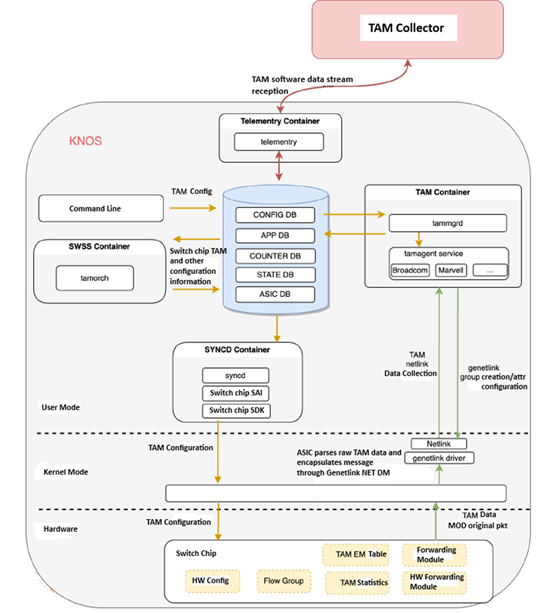
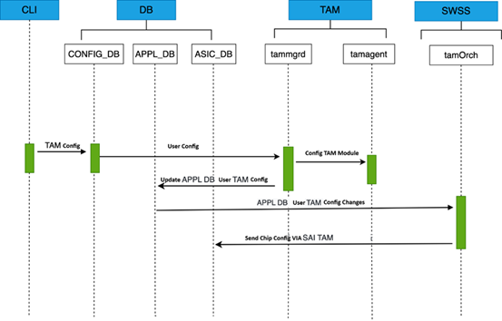
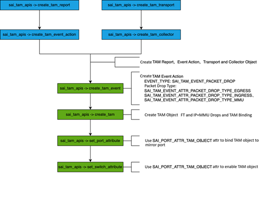
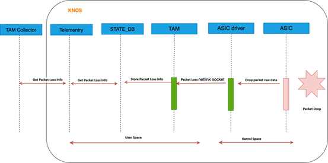

# SONiC TAM Infrastructure HLD #

## Table of Content

### 1. Revision

| Rev | Date | Author | Change Description |
|-----|------|--------|--------------------|
| 0.1 | 2026-02-09 | | TAM Infrastructure HLD - initial draft |

### 2. Scope

This document describes the infrastructure components for Telemetry and Monitoring (TAM) in SONiC. It covers the TAM Docker container, configuration management, database schemas, SAI object model, orchestration framework, and platform-specific implementations.

### 3. Definitions/Abbreviations

| Term | Definition |
|------|------------|
| TAM | Telemetry and Monitoring |
| MOD | Mirror on Drop |
| INT | In-band Network Telemetry |
| IFA | In-band Flow Analyzer |
| HDC | High Delay Capture |
| UDT | User Defined Trap |
| Genetlink | Generic Netlink - Linux kernel-to-userspace communication |
| IPFIX | IP Flow Information Export |
| IPP | Ingress Pipeline Processing - packet processing stage at ingress |
| MMU | Memory Management Unit - buffering and queue management stage |
| EPP | Egress Pipeline Processing - packet processing stage at egress |

#### 3.1 Document Structure

This TAM documentation suite follows a **hierarchical structure** with this document serving as the infrastructure foundation:

```
TAM_Infra_HLD.md (THIS DOCUMENT)
    - Common infrastructure for all TAM features
    - Generic SAI object model (12-object genetlink architecture)
    - Shared CONFIG_DB schemas and validation
    - Platform detection and orchestration framework
    - References to feature-specific implementations

        TAM_MOD_HLD.md (MOD Feature HLD)
            - Mirror on Drop specific configuration
            - IPFIX reporting implementation
            - Drop type filtering (IPP/MMU/EPP)
            - Section 7.4: Detailed MOD SAI configuration

        TAM_int.md (INT/IFA Feature HLD)
            - In-band Network Telemetry specifics
            - ACL-based activation
            - Per-flow INT header insertion
            - Section 7.4: Detailed INT SAI configuration

        TAM_HDC_HLD.md (HDC Feature HLD)
            - High Delay Capture specifics
            - Latency threshold configuration
            - SAI object model for latency event detection
```

**Navigation Guidelines:**
- **Infrastructure questions?**  -> Read this document
- **MOD implementation details?**  -> See [TAM_MOD_HLD.md](TAM_MOD_HLD.md)
- **INT/IFA implementation details?**  -> See [TAM_int.md](TAM_int.md)
- **HDC implementation details?**  -> See TAM_HDC_HLD.md (forthcoming)
- **Platform-specific variations?**  -> Check Section 9 here + feature-specific HLDs

### 4. Overview

#### 4.1 Introduction

Telemetry and Monitoring (TAM) is a critical infrastructure component in modern data center networks, enabling real-time visibility into packet forwarding behavior, drop events, queue congestion, and flow-level performance metrics. As network speeds increase to 400G and beyond, traditional SNMP-based monitoring becomes insufficient for detecting microsecond-level events such as microbursts, packet drops, and latency spikes.

The SONiC TAM infrastructure provides a **unified, scalable platform** for advanced network telemetry features, addressing the growing need for granular observability in high-speed switching environments. This infrastructure supports multiple telemetry modalities:

- **Mirror on Drop (MOD)**: Captures and exports dropped packets with full metadata (5-tuple, drop reason, pipeline stage) using IPFIX reporting, enabling root cause analysis of packet loss events.

- **In-band Network Telemetry (INT)**: Embeds real-time telemetry metadata directly into data plane packets as they traverse the network, allowing per-flow path tracking, latency measurement, and queue depth monitoring without dedicated control plane traffic.

- **In-band Flow Analyzer (IFA)**: Extends INT with flow-level aggregation and long-term tracking, focusing on latency analysis and path visualization across multi-hop networks.

- **High Delay Capture (HDC)**: Detects packets experiencing abnormally high latency and triggers mirroring or metadata collection, useful for identifying network congestion hotspots.

- ** Elephant Flow Detection (EFD**:Elephant Flow Detection is a network telemetry feature that identifies and flags high-bandwidth traffic flows ("elephant flows") that exceed configured rate thresholds, helping operators manage network congestion and performance.

- ** Watson Interface **: Watson is a high-speed streaming telemetry interface that transmits device statistics and events continuously at sub-second intervals. TAM Counter Subscription is the SAI-level mechanism that enables applications to subscribe to specific statistics for streaming through Watson.

#### 4.2 Architectural Philosophy

The TAM infrastructure follows a **layered design pattern** with clear separation of concerns:

1. **Common Infrastructure Layer** (described in this document):
   - Unified SAI object model based on genetlink communication
   - Standardized CONFIG_DB schemas for cross-feature configuration
   - Platform-agnostic orchestration framework (tamOrch)
   - Shared components: policers, hostif, collectors, event handling

2. **Feature-Specific Layer** (described in TAM_MOD_HLD.md and TAM_int.md):
   - MOD: IPFIX-based drop monitoring with per-stage filtering (IPP/MMU/EPP)
   - INT: ACL-driven per-flow telemetry insertion with configurable metadata
   - IFA: Flow aggregation and latency-focused analytics

3. **Platform Adaptation Layer**:
   - Vendor-specific SAI implementations
   - Platform-specific optimizations (CPU queue assignment, event types)
   - Hardware-specific capabilities (per-stage drop monitoring, INT instruction support)

This architecture **abstracts platform differences** while providing **flexibility for feature-specific customizations**. For example, MOD requires full packet encapsulation and CPU port binding for IPFIX export, while INT uses direct ACL actions for in-band header insertion without CPU involvement.

#### 4.3 Design Goals

The TAM infrastructure is designed to achieve the following objectives:

1. **Unified Configuration Model**: A single CONFIG_DB schema for collectors, samplers, and features, reducing configuration complexity and enabling centralized management.

2. **Platform Portability**: Abstract vendor-specific SAI implementations behind a common tamOrch orchestration layer, allowing features to work across multiple platforms with minimal code changes.

3. **Scalability**: Support high-rate telemetry events (1000+ packets/second) with CPU rate limiting (policers) and efficient genetlink/IPFIX transport, preventing CPU overload while maintaining visibility.

4. **Extensibility**: Enable new telemetry features (e.g., future microburst detection) to leverage existing infrastructure objects (collectors, reports, transports) without duplicating code.

5. **Production Readiness**: Incorporate robust error handling, rollback mechanisms, and comprehensive logging to ensure reliability in enterprise deployments.

#### 4.4 Key Components

- **TAM Docker Container**: Isolated environment for TAM services
- **tammgrd Daemon**: Configuration management daemon
- **tamOrch Agent**: SWSS orchestration agent for SAI programming
- **Database Schemas**: CONFIG_DB, APPL_DB, COUNTERS_DB tables
- **SAI TAM API**: Hardware abstraction layer for telemetry
- **Feature-Specific HLDs**: 
  - [TAM_MOD_HLD.md](TAM_MOD_HLD.md) - Mirror on Drop (MOD) implementation
  - [TAM_int.md](TAM_int.md) - INT/IFA implementation
  - TAM_HDC_HLD.md - High Delay Capture (HDC) implementation (forthcoming)

### 5. Architecture



#### 5.1 Component Overview

```
+-------------------------------------------------------------------+
|                         CONFIG_DB                                 |
|  (TAM_SWITCH, TAM_COLLECTORS, TAM_SAMPLINGRATE, TAM_FEATURES,    |
|   TAM_SESSION, TAM_FLOW_GROUP)                                    |
+------------------------+------------------------------------------+
                         |
                         v
+-------------------------------------------------------------------+
|                      TAM Docker Container                         |
|  +----------------------------------------------------------+    |
|  |  tammgrd: Configuration Daemon                           |    |
|  |  - Monitors CONFIG_DB TAM tables                         |    |
|  |  - Validates configuration                               |    |
|  |  - Updates APPL_DB with TAM configuration                |    |
|  +----------------------------------------------------------+    |
|  +----------------------------------------------------------+    |
|  |  TAM Agent: Event Handler                                |    |
|  |  - Receives events via genetlink                         |    |
|  |  - Parses metadata (5-tuple, drop reason, etc.)          |    |
|  |  - Writes to COUNTERS_DB                                 |    |
|  +----------------------------------------------------------+    |
+-------------------------------------------------------------------+
                         |
                         v
+-------------------------------------------------------------------+
|                         APPL_DB                                   |
|           (TAM_TABLE, TAM_COLLECTOR, TAM_SAMPLER)                 |
+------------------------+------------------------------------------+
                         |
                         v
+-------------------------------------------------------------------+
|                    SWSS Container                                 |
|  +----------------------------------------------------------+    |
|  |  tamOrch: TAM Orchestration Agent                        |    |
|  |  - Subscribes to APPL_DB TAM tables                      |    |
|  |  - Creates SAI TAM objects                               |    |
|  |  - Manages object lifecycle                              |    |
|  |  - Platform-specific adaptations                         |    |
|  +----------------------------------------------------------+    |
+------------------------+------------------------------------------+
                         |
                         v
+-------------------------------------------------------------------+
|                      SYNCD/SAI Layer                              |
|  - SAI TAM API implementation                                    |
|  - Platform-agnostic orchestration via SAI capability query      |
|  - Genetlink family registration                                 |
|  - Hardware programming                                          |
+------------------------+------------------------------------------+
                         |
                         v
+-------------------------------------------------------------------+
|                      ASIC/Hardware                                |
|  - Telemetry event detection                                     |
|  - Metadata collection                                           |
|  - Event reporting to CPU                                        |
+-------------------------------------------------------------------+
```

#### 5.2 Data Flow

**Configuration Flow:**
1. User configures TAM via CLI/REST  -> CONFIG_DB
2. tammgrd daemon monitors CONFIG_DB changes
3. tammgrd validates configuration and updates APPL_DB
4. tamOrch subscribes to APPL_DB and invokes SAI APIs
5. SAI layer programs hardware and establishes communication channels
 
**Event Flow:**
1. Hardware detects telemetry event
2. Event sent via genetlink to TAM agent
3. TAM agent processes and writes to databases
4. Telemetry container exports to collectors
 

### 6. Configuration Management



#### 6.1 CONFIG_DB Schema

The TAM infrastructure uses the following CONFIG_DB tables:

##### TAM_SWITCH Table
Defines switch-level TAM configuration.

```
TAM_SWITCH|device
    "switch-id": "10.6.0.24"        # IPv4 loopback as identifier
    "device-id": "1234"              # Optional device ID
```

##### TAM_COLLECTORS_TABLE
Defines external collectors for telemetry export.

```
TAM_COLLECTOR|c1
    "ip": "1.1.1.1"
    "port": "9999"
    "protocol": "UDP"
```

**Validation:**
- `name`: 1-32 characters, alphanumeric with hyphens/underscores
- `ip`: Must be valid IPv4 or IPv6 address
- `port`: Valid port number (1-65535)
- `protocol`: Must be "UDP" or "TCP" (default: UDP)

##### TAM_SAMPLINGRATE_TABLE
Configures sampling rates for telemetry features.

```
TAM_SAMPLER|s1
    "rate": "1"                      # 1:1 sampling (capture all events)
```

**Validation:**
- `rate`: uint32, typically 1-65535
- Rate of 1 means capture all events (1:1)
- Higher values reduce sampling (1:N)

##### TAM_FEATURES Table
Enables/disables TAM features and configures polling intervals.

```
TAM_FEATURES|DROPMONITOR
    "status": "ACTIVE"               # Feature enable status (ACTIVE/INACTIVE)
    "poll-interval": "1000"          # Polling interval in milliseconds (1000-30000)

TAM_FEATURES|IFA
    "status": "INACTIVE"             # In-band Flow Analyzer
    "poll-interval": "2000"

TAM_FEATURES|INT
    "status": "ACTIVE"               # In-band Network Telemetry
    "poll-interval": "1500"

TAM_FEATURES|HDC
    "status": "INACTIVE"             # High Delay Capture
    "poll-interval": "2000"

TAM_FEATURES|MICROBURST
    "status": "INACTIVE"             # Microburst Detection
    "poll-interval": "1000"
```

**Validation:**
- `status`: Must be "ACTIVE" or "INACTIVE"
- `poll-interval`: 1000-30000 milliseconds

##### TAM_SESSION Table
Defines telemetry sessions binding features to collectors.

```
TAM_SESSION|s-drop
    "type": "DROPMONITOR"            # Session type
    "flowgroup": "fg-1"              # ACL rule for flow matching
    "collector": "c1"                # Collector reference
    "sample-rate": "s1"              # Sampling rate reference

TAM_SESSION|s-ifa
    "type": "IFA"                    # IFA session
    "source-ip": "10.0.0.1"          # Flow source IP
    "destination-ip": "10.0.0.2"     # Flow destination IP
    "collector": "c1"
    "sample-rate": "s1"

TAM_SESSION|s-int
    "type": "INT"                    # INT session
    "flowgroup": "fg-int"            # ACL for INT flow selection
    "collector": "c1"
    "hop-limit": "16"                # Max INT hops
    "instruction-bitmap": "0x0F"     # INT metadata to collect

TAM_SESSION|s-hdc
    "type": "HDC"                    # HDC session
    "flowgroup": "fg-all"            # ACL rule for flow selection
    "collector": "c1"                # Collector reference
    "latency-threshold": "1000"      # Threshold in microseconds
    "sample-rate": "s1"              # Sampling rate
```

**Reference Validation:**
All references (flowgroup, collector, sample-rate) must point to existing objects. Configuration will fail if references are invalid.

**Feature-Specific Configuration:**
- For MOD-specific CONFIG_DB schemas and session configuration, see [TAM_MOD_HLD.md Section 6](TAM_MOD_HLD.md#6-configuration-management)
- For INT-specific CONFIG_DB schemas and session configuration, see [TAM_int.md Section 6](TAM_int.md#6-configuration-management)
- For HDC-specific CONFIG_DB schemas and session configuration, see TAM_HDC_HLD.md (forthcoming)

##### TAM_FLOW_GROUP Table
Defines flow groups for filtering telemetry.

```
TAM_FLOW_GROUP|fg-1
    "aging_interval": "60"
    "ports": ["Ethernet0", "PortChannel10"]

TAM_FLOW_GROUP|fg-1|rule1
    "src_ip_prefix": "0.0.0.0/0"
    "dst_ip_prefix": "10.0.0.0/8"
    "ip_protocol": "6"
    "l4_dst_port": "443"
```

#### 6.2 tammgrd Daemon

The `tammgrd` daemon is responsible for:
- Monitoring CONFIG_DB TAM tables for changes
- Validating configuration against YANG models
- Transforming CONFIG_DB entries to APPL_DB format
- Reference validation (collectors, samplers, flow groups)

**Configuration Flow:**
```
CONFIG_DB change  -> tammgrd detects  -> Validation  -> APPL_DB update
```

**Validation Rules:**
- Check collector IP validity (IPv4/IPv6)
- Verify sampling rate range (1-65535)
- Validate reference integrity (collector exists, sampler exists)
- Ensure feature compatibility with platform capabilities

### 7. SAI Object Model

#### 7.1 SAI TAM API Overview

The SAI TAM interface defines the hardware abstraction layer through which tamOrch programs the ASIC for telemetry. All TAM infrastructure objects are created via `sai_tam_api` function pointers registered by the platform SAI implementation.



The key SAI TAM API functions used by the infrastructure are:

| Function | Purpose |
|----------|---------|
| `create_tam_report` | Define reporting mechanism (genetlink, IPFIX) |
| `create_tam_event_action` | Bind report to an action |
| `create_tam_transport` | Define transport parameters |
| `create_tam_collector` | Associate collector with UDT and transport |
| `create_tam_event` | Bind event type (drop, INT) to action and collector |
| `create_tam` | Top-level TAM object binding event list and bind points |
| `set_switch_attribute` | Activate TAM by attaching TAM object to switch |

#### 7.2 Object Creation Sequence

The SAI TAM object creation follows strict dependency ordering. Each TAM feature (MOD, INT, IFA, etc.) creates a subset of these objects based on its requirements.

**Creation Order:**
```
1. tam_report (independent)
2. tam_event_action (depends on tam_report)
3. tam_transport (independent)
4. policer (independent)
5. hostif (independent)
6. hostif_trap_group (depends on policer)
7. hostif_user_defined_trap (depends on hostif_trap_group)
8. hostif_table_entry (depends on hostif, hostif_user_defined_trap)
9. tam_collector (depends on hostif_user_defined_trap)
10. tam_event (depends on tam_event_action, tam_collector)
11. tam (depends on tam_event)
12. switch_attribute (depends on tam)
```

#### 7.2 Detailed SAI Objects

##### Object 1: TAM Report (Genetlink Type)
Defines the reporting mechanism for telemetry events.

```cpp
sai_tam_api->create_tam_report(&tam_report_id, gSwitchId, attr_list);
```

**Attributes:**
| Attribute | Value | Notes |
|-----------|-------|-------|
| SAI_TAM_REPORT_ATTR_TYPE | SAI_TAM_REPORT_TYPE_GENETLINK | Uses genetlink for CPU punt |

##### Object 2: TAM Event Action
Specifies the action to take when a telemetry event is detected.

```cpp
sai_tam_api->create_tam_event_action(&tam_event_action_id, gSwitchId, attr_list);
```

**Attributes:**
| Attribute | Value | Notes |
|-----------|-------|-------|
| SAI_TAM_EVENT_ACTION_ATTR_REPORT_TYPE | tam_report_id | Links to genetlink report |

##### Object 3: TAM Transport
Configures the transport layer for event delivery.

```cpp
sai_tam_api->create_tam_transport(&tam_transport_id, gSwitchId, attr_list);
```

**Attributes:**
| Attribute | Value | Notes |
|-----------|-------|-------|
| SAI_TAM_TRANSPORT_ATTR_TRANSPORT_TYPE | SAI_TAM_TRANSPORT_TYPE_NONE | No transport layer (genetlink handles it) |
| SAI_TAM_TRANSPORT_ATTR_SRC_PORT | 0 | Not used with TYPE_NONE |
| SAI_TAM_TRANSPORT_ATTR_DST_PORT | 0 | Not used with TYPE_NONE |

##### Object 4: Policer (CPU Rate Limiting)
Limits the rate of events punted to the CPU to prevent overload.

```cpp
sai_policer_api->create_policer(&sai_policer_obj, gSwitchId, attr_list);
```

**Attributes:**
| Attribute | Value | Notes |
|-----------|-------|-------|
| SAI_POLICER_ATTR_METER_TYPE | SAI_METER_TYPE_PACKETS | Rate limit by packet count |
| SAI_POLICER_ATTR_MODE | SAI_POLICER_MODE_SR_TCM | Single Rate Three Color Marker |
| SAI_POLICER_ATTR_CIR | 1000 | Committed Information Rate = 1000 pps |
| SAI_POLICER_ATTR_CBS | 2000 | Committed Burst Size = 2000 packets |
| SAI_POLICER_ATTR_PIR | 0 | Not used in SR_TCM mode |
| SAI_POLICER_ATTR_PBS | 0 | Not used in SR_TCM mode |
| SAI_POLICER_ATTR_GREEN_PACKET_ACTION | SAI_PACKET_ACTION_FORWARD | Pass green packets to CPU |
| SAI_POLICER_ATTR_YELLOW_PACKET_ACTION | SAI_PACKET_ACTION_DROP | Drop yellow packets |
| SAI_POLICER_ATTR_RED_PACKET_ACTION | SAI_PACKET_ACTION_DROP | Drop red packets |

**Note:** CIR/CBS values are currently hardcoded. Making them configurable via CLI/CONFIG_DB is a future enhancement (see Section 15).

##### Object 5: Hostif (Genetlink Channel)
Creates a genetlink socket for kernel-to-userspace communication.

```cpp
sai_hostif_api->create_hostif(&sai_hostif_obj, gSwitchId, attr_list);
```

**Attributes:**
| Attribute | Value | Notes |
|-----------|-------|-------|
| SAI_HOSTIF_ATTR_TYPE | SAI_HOSTIF_TYPE_GENETLINK | Genetlink socket type |
| SAI_HOSTIF_ATTR_NAME | "NET_DM" | Family name for genetlink |
| SAI_HOSTIF_ATTR_GENETLINK_MCGRP_NAME | "events" | Multicast group name |

**Kernel Registration:**
```c
// In kernel, this creates:
struct genl_family net_dm_genl_family = {
    .name = "NET_DM",
    .mcgrps = { { .name = "events" } }
};
```

##### Object 6: Hostif Trap Group
Groups traps and applies CPU queue and rate limiting.

```cpp
sai_hostif_api->create_hostif_trap_group(&trap_group_obj, gSwitchId, attr_list);
```

**Attributes:**
| Attribute | Value | Notes |
|-----------|-------|-------|
| SAI_HOSTIF_TRAP_GROUP_ATTR_POLICER | sai_policer_obj | Attach policer for rate limiting |

**Queue Assignment Strategy:**

tamOrch does not set the QUEUE attribute. The CPU queue is determined implicitly when the User Defined Trap (UDT) with type `SAI_HOSTIF_USER_DEFINED_TRAP_TYPE_TAM` is associated with this trap group.

**How It Works:**
1. tamOrch creates trap_group - No queue specified, only policer
2. tamOrch creates UDT with TYPE=TAM - Associates UDT with trap_group
3. Vendor SAI detects TAM trap type - Automatically assigns platform-specific queue
4. Hardware configured - TAM packets routed to assigned queue
5. tamOrch never knows queue number - Completely transparent

**Platform-Specific Queue Mapping (handled internally by vendor SAI):**
- **Platform A SAI**: Assigns a platform-specific queue when TAM UDT binds to trap_group
- **Platform B SAI**: Assigns a platform-specific queue when TAM UDT binds to trap_group

> **Note**: Exact queue numbers are SAI-implementation-defined. Refer to the platform-specific SAI documentation.

**Key Advantages:**
- tamOrch has zero queue logic
- Queue assignment happens at UDT creation time
- Vendor-controlled for platform optimization
- Standard SAI pattern

##### Object 7: User Defined Trap
Creates a user-defined trap for TAM events.

```cpp
sai_hostif_api->create_hostif_user_defined_trap(&udt_obj, gSwitchId, attr_list);
```

**Attributes:**
| Attribute | Value | Notes |
|-----------|-------|-------|
| SAI_HOSTIF_USER_DEFINED_TRAP_ATTR_TYPE | SAI_HOSTIF_USER_DEFINED_TRAP_TYPE_TAM | TAM-specific trap |
| SAI_HOSTIF_USER_DEFINED_TRAP_ATTR_TRAP_GROUP | trap_group_obj | Associate with trap group |

##### Object 8: Hostif Table Entry
Directs packets matching the user-defined trap to the genetlink hostif.

```cpp
sai_hostif_api->create_hostif_table_entry(&table_entry_obj, gSwitchId, attr_list);
```

**Attributes:**
| Attribute | Value | Notes |
|-----------|-------|-------|
| SAI_HOSTIF_TABLE_ENTRY_ATTR_TYPE | SAI_HOSTIF_TABLE_ENTRY_TYPE_TRAP_ID | Entry type is trap-based |
| SAI_HOSTIF_TABLE_ENTRY_ATTR_TRAP_ID | udt_obj | User-defined trap to match |
| SAI_HOSTIF_TABLE_ENTRY_ATTR_CHANNEL_TYPE | SAI_HOSTIF_TABLE_ENTRY_CHANNEL_TYPE_GENETLINK | Use genetlink channel |
| SAI_HOSTIF_TABLE_ENTRY_ATTR_HOST_IF | sai_hostif_obj | Target hostif for packets |

##### Object 9: TAM Collector
Configures the collector for telemetry events.

```cpp
sai_tam_api->create_tam_collector(&tam_collector_id, gSwitchId, attr_list);
```

**Attributes:**
| Attribute | Value | Notes |
|-----------|-------|-------|
| SAI_TAM_COLLECTOR_ATTR_HOSTIF_TRAP | udt_obj | Link to UDT for CPU punt |
| SAI_TAM_COLLECTOR_ATTR_SRC_IP | switch management IP | Sourced from CONFIG_DB `TAM_SWITCH` |
| SAI_TAM_COLLECTOR_ATTR_DST_IP | collector IP | Sourced from CONFIG_DB `TAM_COLLECTORS` |
| SAI_TAM_COLLECTOR_ATTR_DSCP_VALUE | 0 | Default DSCP |
| SAI_TAM_COLLECTOR_ATTR_TRANSPORT | tam_transport_id | Transport object (TYPE_NONE) |


##### Object 10: TAM Event
Defines the event to monitor and how to handle it.

```cpp
sai_tam_api->create_tam_event(&tam_event_id, gSwitchId, attr_list);
```

**Attributes:**
| Attribute | Value | Notes |
|-----------|-------|-------|
| SAI_TAM_EVENT_ATTR_TYPE | (varies by feature) | MOD: PACKET_DROP, INT: INT, etc. |
| SAI_TAM_EVENT_ATTR_ACTION_LIST | {tam_event_action_id} | Action to take on event |
| SAI_TAM_EVENT_ATTR_COLLECTOR_LIST | {tam_collector_id} | Collector(s) to send to |
| SAI_TAM_EVENT_ATTR_SWITCH_EVENT_TYPE | (varies by platform) | Platform-specific |

##### Object 11: TAM
Binds the TAM event to the switch.

```cpp
sai_tam_api->create_tam(&tam_id, gSwitchId, attr_list);
```

**Attributes:**
| Attribute | Value | Notes |
|-----------|-------|-------|
| SAI_TAM_ATTR_EVENT_OBJECTS_LIST | {tam_event_id} | Event(s) to monitor |
| SAI_TAM_ATTR_TAM_BIND_POINT_TYPE_LIST | {SAI_TAM_BIND_POINT_TYPE_SWITCH} | Bind to switch (all ports) |

##### Object 12: Switch Attribute Binding
Activates telemetry on the switch by binding the TAM object.

```cpp
sai_switch_api->set_switch_attribute(gSwitchId, &switch_attr);
```

**Attributes:**
| Attribute | Value | Notes |
|-----------|-------|-------|
| SAI_SWITCH_ATTR_TAM_OBJECT_ID | tam_id | Enable TAM on switch |

**This is the final step that activates telemetry.**

#### 7.3 Object Deletion Order (Critical)

**MUST follow reverse dependency order to avoid SAI_STATUS_OBJECT_IN_USE errors:**

```cpp
bool TamOrch::tam_remove_feature() {
    // Step 1: Disable on switch first
    disable_set_switch_attribute();

    // Step 2: Delete TAM objects
    sai_tam_api->remove_tam(m_tam_id);
    sai_tam_api->remove_tam_event(m_tam_event_id);

    // Step 3: Delete collector
    sai_tam_api->remove_tam_collector(m_tam_collector_id);

    // Step 4: Delete hostif chain
    sai_hostif_api->remove_hostif_table_entry(m_sai_hostif_table_entry_obj);
    sai_hostif_api->remove_hostif_user_defined_trap(m_sai_hostif_udt_obj);
    sai_hostif_api->remove_hostif_trap_group(m_sai_hostif_trap_group_obj);
    sai_hostif_api->remove_hostif(m_sai_hostif_obj);

    // Step 5: Delete policer
    sai_policer_api->remove_policer(m_sai_policer_obj);

    // Step 6: Delete transport and event action
    sai_tam_api->remove_tam_transport(m_tam_transport_id);
    sai_tam_api->remove_tam_event_action(m_tam_event_action_id);

    // Step 7: Delete report (last)
    sai_tam_api->remove_tam_report(m_tam_report_id);

    return true;
}
```

**Deletion Dependency Chain:**
```
switch_attribute  -> tam  -> tam_event  -> tam_collector  -> hostif_table_entry  -> 
hostif_user_defined_trap  -> hostif_trap_group  -> policer/hostif  -> 
tam_transport  -> tam_event_action  -> tam_report
```

#### 7.4 Feature-Specific Implementation Details

This infrastructure document describes the **common SAI object model** used by all TAM features (Section 7.2). Each feature customizes this model based on its specific requirements.

##### Implementation Summary

| Feature | Objects Used | Report Type | Transport Type | Key Differences |
|---------|--------------|-------------|----------------|------------------|
| **MOD** | 6 objects + 2 bindings | Genetlink | PORT (full L2/L3/L4 headers) | CPU port binding, drop type filters (IPP/MMU/EPP) |
| **INT** | 5-6 objects | IPFIX | NONE (kernel netlink) | ACL-based activation, per-flow insertion |
| **IFA** | 5-6 objects | IPFIX | NONE | Flow tracking, latency measurement |

##### Detailed Implementation References

##### Mirror on Drop (MOD) Configuration

**Complete step-by-step implementation:** See [TAM_MOD_HLD.md Section 7.4](TAM_MOD_HLD.md#74-mod-configuration-procedure---implementation-details)

**Key MOD Implementation Details:**
- **8-Step Configuration Process**:
  1. Create TAM Report (IPFIX with enterprise number)
  2. Create TAM Event Action
  3. Create TAM Transport (PORT type with MAC/VLAN/UDP)
  4. Create TAM Collector (with CONFIG_DB IP configuration)
  5. Create TAM Event (IPP/MMU/EPP drop monitoring)
  6. Create TAM Object (PORT + SWITCH bind points)
  7. Set CPU Port Attribute (packet-to-CPU binding)
  8. Set Switch Attribute (global activation)

- **Platform-Specific Variations**:
  - Implementation variant A: Single unified event object for all pipeline stages
  - Implementation variant B: Separate event objects per pipeline stage (IPP, MMU, EPP)  determined via SAI capability query

- **IPFIX Export**: Full packet encapsulation via CPU port
- **Drop Type Filtering**: Configurable per pipeline stage
- **User Metadata**: Stage identifiers (IPP=100, MMU=200, EPP=300)

**Code Example Preview** (full implementation in TAM_MOD_HLD.md):
```cpp
// MOD uses IPFIX report type
tam_attr_list[0].id = SAI_TAM_REPORT_ATTR_TYPE;
tam_attr_list[0].value.s32 = SAI_TAM_REPORT_TYPE_IPFIX;
tam_attr_list[1].id = SAI_TAM_REPORT_ATTR_ENTERPRISE_NUMBER;
tam_attr_list[1].value.s32 = 0x12312344;
sai_tam_api->create_tam_report(&tam_report_id, gSwitchId, count, tam_attr_list);

// MOD uses PORT transport with full headers
tam_attr_list[0].id = SAI_TAM_TRANSPORT_ATTR_TRANSPORT_TYPE;
tam_attr_list[0].value.s32 = SAI_TAM_TRANSPORT_TYPE_PORT;
// ... UDP ports, MAC addresses, VLAN config ...
sai_tam_api->create_tam_transport(&tam_transport_id, gSwitchId, count, tam_attr_list);
```

##### In-band Network Telemetry (INT) Configuration

**Complete step-by-step implementation:** See [TAM_int.md Section 7.4](TAM_int.md#74-knos-int-configuration-procedure)

**Key INT Implementation Details:**
- **5-Step Configuration Process**:
  1. Create samplepacket object (ingress sampling)
  2. Create TAM Report (IPFIX for INT metadata)
  3. Create TAM INT object (with samplepacket enable)
  4. Create ACL Table (INT-specific match fields)
  5. Create per-port ACL counters and entries (ACTION_INT_INSERT)

- **ACL-Based Activation**: No switch-wide binding, per-flow control
- **INT Header Insertion**: Direct ACL action, no CPU port needed
- **Metadata Collection**: Configurable INT instruction bitmap
- **Simplified Model**: Fewer objects than MOD, no genetlink/hostif chain

**Code Example Preview** (full implementation in TAM_int.md):
```cpp
// INT uses samplepacket for sampling
tam_attr_list[0].id = SAI_SAMPLEPACKET_ATTR_SAMPLE_RATE;
tam_attr_list[0].value.u32 = 1;  // 1:1 sampling
tam_attr_list[1].id = SAI_SAMPLEPACKET_ATTR_TYPE;
tam_attr_list[1].value.s32 = SAI_SAMPLEPACKET_TYPE_SLOW;
sai_samplepacket_api->create_samplepacket(&samplepacket_oid, gSwitchId, count, tam_attr_list);

// INT uses ACL action for per-flow activation
acl_entry_attr.id = SAI_ACL_ENTRY_ATTR_ACTION_INT_INSERT;
acl_entry_attr.value.aclaction.enable = true;
sai_acl_api->create_acl_entry(&acl_entry_oid, gSwitchId, count, acl_entry_attrs);
```

##### In-band Flow Analyzer (IFA) Configuration

**Implementation details:** See [TAM_int.md Section 7.5](TAM_int.md#75-ifa-configuration-procedure) (if available)

**Key IFA Implementation Details:**
- Similar to INT but with flow tracking
- Latency and path measurement focus
- May use different INT instruction bitmaps

##### Quick Comparison: MOD vs INT

| Aspect | MOD (Mirror on Drop) | INT (In-band Network Telemetry) |
|--------|----------------------|----------------------------------|
| **Report Type** | IPFIX | IPFIX (for INT metadata) |
| **Transport** | PORT (L2/L3/L4 headers) | NONE (direct insertion) |
| **Event Type** | PACKET_DROP | INT |
| **Activation** | Switch + CPU port binding | ACL ACTION_INT_INSERT per-flow |
| **CPU Port** | Required | Not required |
| **Object Count** | 6 + 2 bindings | 5-6 objects |
| **Collector** | External IPFIX | INT collector (local/remote) |
| **Platform Variation** | IPP/MMU/EPP stages | Unified INT object |
| **Configuration Complexity** | Higher (8 steps) | Lower (5 steps) |

##### When to Use Each Document

- **For infrastructure questions** (common to all features): Read this document (TAM_infra.md)
- **For MOD implementation**: See [TAM_MOD_HLD.md Section 7.4](TAM_MOD_HLD.md#74-mod-configuration-procedure---implementation-details)
- **For INT implementation**: See [TAM_int.md Section 7.4](TAM_int.md#74-knos-int-configuration-procedure)
- **For platform differences**: Check Section 9 in this document + feature-specific HLDs

### 8. Orchestration State Machine

#### 8.1 tamOrch State Machine

The `tamOrch::doTask()` function implements a state machine that monitors APPL_DB tables and manages TAM object lifecycle.

**Generic Feature Flow:**
```
+-------------+
|  DISABLED   |
| (Initial)   |
+------+------+
       | TAM_FEATURES|<feature> status="ACTIVE"
       v
+-----------------------------------------+
|  CREATING_OBJECTS                       |
|  1. create_tam_report()                 |
|  2. create_tam_event_action()           |
|  3. create_tam_transport()              |
|  4. create_policer() (if needed)        |
|  5. create_hostif() (if needed)         |
|  6. create_hostif_trap_group()          |
|  7. create_hostif_user_defined_trap()   |
|  8. create_hostif_table_entry()         |
|  9. create_tam_collector()              |
|  10. create_tam_event()                 |
|  11. create_tam()                       |
+------+----------------------------------+
       | All objects created successfully
       v
+-----------------------------------------+
|  ENABLING                               |
|  set_switch_attribute()                 |
|  - Set SAI_SWITCH_ATTR_TAM_OBJECT_ID    |
+------+----------------------------------+
       | Switch attribute set
       v
+-------------+
|   ENABLED   |
|  (Active)   |<-----------+
+------+------+            |
       | status="INACTIVE" | Config update
       v                   |
+----------------------------------+--+
|  DISABLING                          |
|  clear_switch_attribute()           |
+------+------------------------------+
       |
       v
+-----------------------------------------+
|  DELETING_OBJECTS                       |
|  (Reverse order of creation)            |
+------+----------------------------------+
       |
       v
+-------------+
|  DISABLED   |
+-------------+
```

#### 8.2 APPL_DB Table Monitoring

tamOrch subscribes to the following APPL_DB tables:

```cpp
void TamOrch::doTask(Consumer &consumer) {
    string table_name = consumer.getTableName();

    if (table_name == APP_TAM_COLLECTOR_TABLE) {
        tamCheckCollectorAndFillValues();
    }
    else if (table_name == APP_TAM_SAMPLER_TABLE) {
        tamCheckSamplerAndFillValues();
    }
    else if (table_name == APP_TAM_DROPMONITOR_TABLE) {
        auto status = fvField(fv, "status");
        if (status == "enable") {
            tam_create_drop_monitor();
        }
        else if (status == "disable") {
            tam_remove_drop_monitor();
        }
    }
    else if (table_name == APP_TAM_INT_TABLE) {
        tam_create_tam_int();
    }
    // Additional feature handlers...
}
```

#### 8.3 Error Handling

##### Object Creation Failures
```cpp
sai_status_t status = sai_tam_api->create_tam_report(&tam_report_id, ...);
if (status != SAI_STATUS_SUCCESS) {
    SWSS_LOG_ERROR("Failed to create TAM report: %d", status);
    return false;
}

status = sai_tam_api->create_tam_event_action(&tam_event_action_id, ...);
if (status != SAI_STATUS_SUCCESS) {
    SWSS_LOG_ERROR("Failed to create TAM event action: %d", status);
    // Rollback: Delete tam_report before returning
    sai_tam_api->remove_tam_report(tam_report_id);
    return false;
}
```

**Rollback Strategy:**
- If any object creation fails, delete all previously created objects in reverse order
- Return to DISABLED state
- Log error with SAI status code

##### Common SAI Error Codes
| Error Code | Meaning | Recovery Action |
|------------|---------|-----------------|
| SAI_STATUS_SUCCESS | Operation succeeded | Continue |
| SAI_STATUS_FAILURE | Generic failure | Retry after delay |
| SAI_STATUS_NOT_SUPPORTED | Feature not supported | Disable TAM feature |
| SAI_STATUS_NO_MEMORY | Out of resources | Reduce sampling rate, retry |
| SAI_STATUS_INSUFFICIENT_RESOURCES | Hardware table full | Reduce configuration, retry |
| SAI_STATUS_INVALID_PARAMETER | Bad attribute value | Check configuration |
| SAI_STATUS_OBJECT_IN_USE | Cannot delete (still referenced) | Check deletion order |

### 9. Platform Specifics

#### 9.1 Platform Detection

```cpp
string platform = getenv("ASIC_VENDOR");
const string MRVL_TL_PLATFORM_SUBSTRING = "marvell";

if (platform.find(MRVL_TL_PLATFORM_SUBSTRING) != string::npos) {
    // Platform A: unified event model (single TAM event object)
} else {
    // Platform B: per-stage event model (IPP/MMU/EPP)
}
```

#### 9.2 Platform-Specific Variations

##### Platform A (Unified Event Model)
- Single TAM event object for all events
- Platform-specific CPU queue for TAM traffic
- Unified drop monitoring (no per-stage separation)

##### Platform B (Per-Stage Event Model)
- Per-stage TAM events (IPP, MMU, EPP)
- Platform-specific CPU queue for TAM traffic
- Pipeline-aware event creation

**Feature-Specific Platform Variations:**
- For MOD platform differences, see [TAM_MOD_HLD.md Section 7.4 Platform Notes](TAM_MOD_HLD.md#platform-specific-implementation-notes)
- For INT platform differences, see [TAM_int.md](TAM_int.md)

**Platform-Specific TAM Event Creation:**

**Variant A - Unified Event:**
```cpp
sai_tam_api->create_tam_event(&m_tam_event_id, gSwitchId, attr_list);
sai_tam_api->create_tam(&m_tam_id, gSwitchId, attr_list);
```

**Variant B - Per-Stage Events:**
```cpp
// Create three events for pipeline stages
sai_tam_api->create_tam_event(&m_tam_event_id_ipp, gSwitchId, attr_list_ipp);
// SAI_TAM_EVENT_ATTR_SWITCH_EVENT_TYPE = SAI_SWITCH_EVENT_TYPE_PACKET_DROP_IPP

sai_tam_api->create_tam_event(&m_tam_event_id_mmu, gSwitchId, attr_list_mmu);
// SAI_TAM_EVENT_ATTR_SWITCH_EVENT_TYPE = SAI_SWITCH_EVENT_TYPE_PACKET_DROP_MMU

sai_tam_api->create_tam_event(&m_tam_event_id_epp, gSwitchId, attr_list_epp);
// SAI_TAM_EVENT_ATTR_SWITCH_EVENT_TYPE = SAI_SWITCH_EVENT_TYPE_PACKET_DROP_EPP

// Create three TAM objects
sai_tam_api->create_tam(&m_tam_id_ipp, gSwitchId, attr_list_ipp);
sai_tam_api->create_tam(&m_tam_id_mmu, gSwitchId, attr_list_mmu);
sai_tam_api->create_tam(&m_tam_id_epp, gSwitchId, attr_list_epp);
```

### 10. Genetlink Communication

#### 10.1 Genetlink Overview

Genetlink (Generic Netlink) is used for telemetry event delivery from the ASIC/SAI to user-space applications.

**Configuration:**
- Family Name: "NET_DM"
- Multicast Group: "events"
- Type: SAI_HOSTIF_TYPE_GENETLINK

#### 10.2 Event Delivery Mechanism

```
+-------------+
|  ASIC/SAI   |
+------+------+
       | Generates telemetry event
       v
+-----------------------------+
|  Kernel Genetlink           |
|  - Family: NET_DM           |
|  - MC Group: events         |
+------+----------------------+
       | genlmsg_multicast()
       v
+-----------------------------+
|  TAM Agent (Userspace)      |
|  - Subscribes to NET_DM     |
|  - Receives events          |
|  - Processes metadata       |
+-----------------------------+
```



#### 10.3 Verification

```bash
# Check if genetlink family registered
sudo genl-ctrl-list | grep NET_DM

# Expected output:
# Name: NET_DM
#   ID: 0x20
#   Multicast groups:
#     events (ID: 0x1)
```

### 11. Database Schemas

#### 11.1 COUNTERS_DB

TAM events are written to COUNTERS_DB for statistics collection:

```
COUNTERS_TAM_DM:<flow_key>
    "drop_count": <count>
    "last_seen": <timestamp>
    "src_ip": <source_ip>
    "dst_ip": <destination_ip>
    "src_port": <source_port>
    "dst_port": <destination_port>
    "protocol": <protocol>
    "drop_reason": <reason>
```

### 12. Flex Counter Integration

For features requiring statistics collection (e.g., INT), tamOrch uses flex counters:

```cpp
auto flex_counter_manager = FlexCounterManager::getInstance();
flex_counter_manager->addCounter(
    TAM_INT_FLEX_COUNTER_GROUP,
    tam_int_acl_counter_oid,
    "TAM_INT",
    TAM_INT_COUNTER_FLEX_COUNTER_GROUP
);
```

**Flex Counter Tables:**
- Updates periodically to track packet statistics
- Integrated with standard SONiC counter collection

### 13. Scaling and Limits

| Parameter | Default | Range | Notes |
|-----------|---------|-------|-------|
| Sampling Rate | 1 | 1-65535 | 1 = capture all events |
| Aging Interval | 60s | 1-1800s | Flow aging timeout |
| Poll Interval | 10s | 1-1800s | Database update rate |
| CPU Policer CIR | 1000 pps | Platform-dependent | Rate limit to CPU |
| CPU Policer CBS | 2000 | Platform-dependent | Burst size |
| Max Collectors | 1 | 1 | Current limitation |

### 14. Troubleshooting

#### 14.1 Verification Commands

```bash
# Check CONFIG_DB configuration
redis-cli -n 4 KEYS "TAM_*"
redis-cli -n 4 HGETALL "TAM_SWITCH|device"
redis-cli -n 4 HGETALL "TAM_FEATURES|DROPMONITOR"

# Check APPL_DB tables
redis-cli -n 0 KEYS "TAM_*"
redis-cli -n 0 HGETALL "TAM_COLLECTOR:c1"

# Check genetlink family
sudo genl-ctrl-list | grep NET_DM

# Check SAI object creation logs
sudo cat /var/log/syslog | grep "create_tam"
sudo cat /var/log/syslog | grep "SAI_STATUS"

# Check tammgrd daemon
docker exec -it tam ps aux | grep tammgrd
docker logs tam | grep tammgrd

# Check tamOrch logs
docker logs swss | grep tamorch
```

#### 14.2 Common Issues

##### Issue: TAM Not Enabling
**Diagnosis:**
```bash
redis-cli -n 4 HGET "TAM_FEATURES|DROPMONITOR" "status"
docker logs tam | grep tammgrd
```

**Resolution:**
- Ensure status="ACTIVE" in CONFIG_DB
- Restart tammgrd daemon
- Check configuration validation errors

##### Issue: SAI Object Creation Fails
**Diagnosis:**
```bash
sudo cat /var/log/syslog | grep "SAI_STATUS" | grep -v "SUCCESS"
```

**Resolution:**
- SAI_STATUS_NOT_SUPPORTED: Platform doesn't support TAM
- SAI_STATUS_NO_MEMORY: Reduce sampling rate
- SAI_STATUS_INVALID_PARAMETER: Check configuration

##### Issue: Genetlink Not Registered
**Diagnosis:**
```bash
sudo genl-ctrl-list | grep NET_DM
docker logs tam | grep "genetlink\|NET_DM"
```

**Resolution:**
- Check hostif creation in syslog
- Verify kernel genetlink support
- Restart TAM container

### 15. Warmboot and Fastboot Design Impact

#### 15.1 Warmboot

The TAM infrastructure has no impact on the warmboot data-plane continuity guarantee. All TAM components operate entirely in the control plane (SAI object programming and CPU-path event processing) — they do not modify forwarding tables, port state, or any path that carries production traffic.

**Behavior during warmboot:**

- SAI TAM objects are **not preserved** across a warm reboot. The SAI/ASIC state is torn down and rebuilt by orchagent on restart.
- On startup, `tammgrd` re-reads all TAM tables from CONFIG_DB and re-populates APPL_DB.
- `tamOrch` subscribes to APPL_DB on startup and recreates all SAI objects in dependency order.
- Telemetry event collection resumes within the normal orchagent convergence window (same as other orchagent-managed features).
- Any telemetry events that occur during the convergence window are not captured — this is acceptable since the window is brief and telemetry data is best-effort.

**No additional warmboot stalls are introduced.** TAM Docker startup is independent of the critical convergence path.

#### 15.2 Fastboot

TAM Docker does **not** participate in the critical-path startup sequence. It can be delayed without impacting port bring-up, VLAN programming, or route convergence.

- TAM Docker is started after the critical path completes.
- `tammgrd` and the TAM Agent have no dependencies on port state or routing tables.
- No Jinja template rendering or heavy CPU processing is performed during boot.
- No third-party dependencies are updated by this feature.

**Boot time impact: None** when all TAM features are disabled. When enabled, TAM Docker startup adds negligible overhead well outside the critical path.

#### 15.3 Summary

| Aspect | Impact | Notes |
| --- | --- | --- |
| Data-plane downtime | None | TAM is control-plane only |
| Boot critical chain stalls | None | TAM Docker not in critical path |
| CPU-heavy boot processing | None | No template rendering or heavy I/O |
| Third-party dependency changes | None | No new dependencies |
| Docker delay possible | Yes | TAM Docker can be fully deferred |
| Telemetry gap on reboot | Brief | Events during orchagent convergence window are not captured |
| Feature disabled overhead | None | No memory or CPU cost when all TAM_FEATURES entries are INACTIVE |

### 16. Memory Consumption

#### 16.1 Feature Disabled

When all `TAM_FEATURES` entries are set to `INACTIVE` (or the TAM Docker is not started):

- **No SAI objects are created** — zero ASIC table entries consumed
- **No COUNTERS_DB entries** — all TAM counter tables are empty
- **No genetlink socket** — no kernel memory allocated for `NET_DM` family
- **tammgrd memory** — minimal (~2 MB RSS, subscribe-only mode)
- **TAM Agent memory** — zero (not started when all features are INACTIVE)

Memory consumption when disabled is bounded by the TAM Docker container base overhead only (~20–30 MB total), consistent with other SONiC feature dockers.

#### 16.2 Feature Enabled — Control Plane Objects

| Component | Memory | Notes |
| --- | --- | --- |
| 11 shared SAI objects (report, event_action, transport, policer, hostif, trap_group, udt, table_entry, collector, event, tam) | ~1 KB | Kernel + SAI object metadata |
| `tamOrch` in-memory state | ~50 KB | SAI OID cache, APPL_DB subscriber |
| `tammgrd` daemon | ~5 MB RSS | Python process with Redis subscribers |
| TAM Agent process | ~10 MB RSS | Genetlink socket + event processing buffers |

#### 16.3 COUNTERS_DB Growth

TAM agents write per-flow state to COUNTERS_DB. Growth is bounded by the active flow count and the configured aging interval.

| Parameter | Value |
| --- | --- |
| Per-flow entry size | ~500 bytes (Redis hash with ~9 string fields) |
| Aging | Flows are expired after `aging-interval` seconds of inactivity |
| Growth bound | Bounded — stale flows are removed; no unbounded growth |

With default `aging-interval=60s` and typical datacenter traffic patterns, 1000 concurrent flows consume ~500 KB in COUNTERS_DB — negligible.

#### 16.4 Summary

| Scenario | Additional Memory |
| --- | --- |
| All features compiled in, disabled by config | ~0 MB (no TAM Docker started) |
| Features enabled, no active events | ~15 MB (container + daemons, no DB growth) |
| Features enabled, 1000 active flows | ~15.5 MB (~500 KB COUNTERS_DB) |

### 17. Restrictions/Limitations

| # | Restriction | Details |
| --- | --- | --- |
| 1 | **Shared infrastructure objects** | All TAM features share the same policer, hostif, trap_group, and UDT objects. Only one set of infrastructure objects is created regardless of how many features are simultaneously enabled. |
| 2 | **CPU punting required** | All telemetry events are delivered to user space via the CPU genetlink path. Direct hardware-to-collector export via front-panel ports is not supported. |
| 3 | **Kernel genetlink dependency** | The `NET_DM` genetlink family must be supported by the kernel. A minimum kernel version with genetlink drop monitor support is required. |
| 4 | **SAI TAM capability required** | If the platform SAI does not report TAM capability, all TAM features are silently disabled at startup with a warning log. No error is raised. |
| 5 | **Policer CIR/CBS not configurable** | Infrastructure policer parameters (CIR=1000 pps, CBS=2000) are hardcoded. CLI configuration of CIR/CBS is a future enhancement. |
| 6 | **Single collector per feature** | Only one TAM collector is supported per feature session in this release. Multi-collector support is a future enhancement. |
| 7 | **No gRPC export** | Telemetry export uses IPFIX only. gRPC-based export is not supported in this release. |
| 8 | **Platform detection is binary** | Platform detection uses a single environment-variable string match. More granular SAI capability-based detection is a future enhancement. |
| 9 | **No dynamic reconfiguration** | Changing collector IP or sampler rate while a feature is active requires disabling and re-enabling the feature to take effect. |

### 18. Testing Requirements/Design

TAM infrastructure testing covers unit tests (component-level), system tests (end-to-end), and warmboot/fastboot regression. Feature-specific test cases are covered in their respective HLDs ([TAM_MOD_HLD.md Section 13](TAM_MOD_HLD.md#13-testing-requirementsdesign), [TAM_int.md](TAM_int.md)).

#### 18.1 Unit Test Cases

##### 18.1.1 CONFIG_DB Schema Validation

| Test | Pass Criteria |
| --- | --- |
| `TAM_SWITCH\|device` with valid IPv4 `switch-id` | Entry accepted, propagated to APPL_DB |
| `TAM_SWITCH\|device` with invalid IP (e.g. `"abc"`) | YANG validation rejects with error |
| `TAM_COLLECTORS` with `port` outside 1–65535 | YANG validation rejects |
| `TAM_SAMPLINGRATE` with `rate=0` | YANG validation rejects |
| `TAM_FEATURES\|<feature>` with unknown feature name | YANG validation rejects |

##### 18.1.2 tammgrd CONFIG_DB -> APPL_DB Propagation

| Test | Pass Criteria |
| --- | --- |
| Add `TAM_SWITCH` entry | `APP_TAM_SWITCH_TABLE` entry created in APPL_DB |
| Add `TAM_COLLECTORS` entry | `APP_TAM_COLLECTOR_TABLE` entry created in APPL_DB |
| Add `TAM_SAMPLINGRATE` entry | `APP_TAM_SAMPLER_TABLE` entry created in APPL_DB |
| Set `TAM_FEATURES\|<feature>` status to `ACTIVE` | Corresponding APPL_DB table `status=enable` set |
| Delete `TAM_COLLECTORS` entry | Corresponding APPL_DB entry removed |
| Update `TAM_SAMPLINGRATE` rate | APPL_DB entry updated without daemon restart |

##### 18.1.3 tamOrch SAI Object Creation and Rollback

| Test | Pass Criteria |
| --- | --- |
| Feature enable received | All SAI objects created in dependency order; `SAI_SWITCH_ATTR_TAM_OBJECT_ID` set |
| Inject SAI failure at step N (for N=1..11) | All previously created objects rolled back; tamOrch returns to DISABLED state |
| `sai_tam_api == nullptr` (unsupported platform) | Feature silently disabled; warning logged; no crash |
| Feature disable received | `SAI_SWITCH_ATTR_TAM_OBJECT_ID` cleared first; all objects deleted in reverse order |
| Re-enable after disable | All SAI objects recreated cleanly; no resource leaks |

##### 18.1.4 tamOrch State Machine Transitions

| Test | Pass Criteria |
| --- | --- |
| Initial state is DISABLED | No SAI objects exist |
| enable -> CREATING -> ENABLING -> ENABLED | All transitions logged at NOTICE level |
| SAI failure during CREATING | Transition back to DISABLED; objects cleaned up |
| disable from ENABLED | Transition through DISABLING -> DELETING -> DISABLED |
| Config update while ENABLED | State remains ENABLED; no unnecessary object recreation |

#### 18.2 System Test Cases

##### 18.2.1 Infrastructure Bring-Up

| Step | Expected Result |
| --- | --- |
| Configure `TAM_SWITCH`, `TAM_COLLECTORS`, `TAM_SAMPLINGRATE`; set a feature ACTIVE | All CONFIG_DB tables populated; APPL_DB propagated; SAI objects created in ASIC_DB |
| Verify genetlink family registered | `genl-ctrl-list` shows `NET_DM` family with `events` multicast group |
| Disable the feature | `SAI_SWITCH_ATTR_TAM_OBJECT_ID` cleared; SAI objects removed from ASIC_DB |

##### 18.2.2 Enable / Disable Lifecycle

| Step | Expected Result |
| --- | --- |
| Disable feature (`TAM_FEATURES\|<feature>` status=INACTIVE) | SAI objects deleted; events stop |
| Re-enable | SAI objects recreated; events resume |
| Repeat enable/disable 10 times | No resource leaks; ASIC_DB has correct object count each cycle |

##### 18.2.3 Warmboot Regression

| Step | Expected Result |
| --- | --- |
| Enable a TAM feature; verify SAI objects created | Baseline established |
| Trigger warm reboot | Zero data-plane downtime for production flows (warmboot SLA met) |
| After reboot, verify tamOrch recreates TAM SAI objects | All SAI objects present in ASIC_DB |
| Measure additional warmboot stall introduced by TAM | Must be zero seconds additional stall |

##### 18.2.4 Fastboot Regression

| Test | Expected Result |
| --- | --- |
| TAM enabled; perform fastboot | Boot critical path (port/VLAN/route convergence) completes within existing SLA |
| TAM Docker starts after critical path | No TAM-related delays in critical-path logs |

#### 18.3 Scale Test Cases

| Test | Pass Criteria |
| --- | --- |
| High event rate: sustain >10,000 pps telemetry events | CPU policer limits to <=1000 pps; system stable; no memory growth after stabilization |
| Concurrent flows: 1000 unique 5-tuple flows (stateful) | All 1000 entries appear in COUNTERS_DB; total growth <= 1 MB |
| Long-running stability: run TAM infrastructure continuously for 24 hours | No memory leaks in TAM Agent or tammgrd; no daemon restarts |
| Repeated enable/disable: 100 rapid cycles | No ASIC resource exhaustion; final state consistent with expected object count |

### 19. Open/Action items

| # | Item | Type | Notes |
| --- | --- | --- | --- |
| 1 | **Configurable policer CIR/CBS** | Future Enhancement | Policer parameters are currently hardcoded (CIR=1000 pps, CBS=2000). Add CLI configuration and corresponding CONFIG_DB fields. See Restriction #5. |
| 2 | **Multi-collector support** | Future Enhancement | Only one TAM collector is supported per session. Multi-collector support requires schema and tamOrch changes. See Restriction #6. |
| 3 | **Platform capability-based detection** | Future Enhancement | Replace binary string-match platform detection with SAI capability query at runtime for more granular platform adaptation. See Restriction #8. |
| 4 | **Dynamic reconfiguration without feature restart** | Future Enhancement | Allow collector IP and sampler rate changes to take effect without requiring a full disable/re-enable cycle. See Restriction #9. |
| 5 | **Configurable collector IPs** | Design Gap | Ensure all collector IPs are read dynamically from CONFIG_DB `TAM_COLLECTORS` with no hardcoded defaults. |
| 6 | **Enhanced error reporting** | Future Enhancement | Provide detailed error messages and automated recovery suggestions in syslog when SAI object creation fails. |
| 7 | **YANG model enhancement** | Future Enhancement | Add more comprehensive cross-table validation rules (e.g., leafref checks between TAM_SESSION and TAM_COLLECTORS). |
| 8 | **Flex counter optimization** | Future Enhancement | Reduce COUNTERS_DB polling overhead for high-frequency TAM statistics collection. |
| 9 | **Minimum kernel version requirement** | Design Gap | The exact minimum kernel version supporting `NET_DM` genetlink (and which SONiC branches it applies to) needs to be confirmed and documented. |
| 10 | **PR merge order dependency** | Dependency | PRs must merge in order: (1) `sonic-swss-common` — table definitions; (2) `sonic-yang-models` — YANG models; (3) `sonic-swss` — tamOrch agent; (4) `sonic-buildimage` — TAM Docker; (5) `sonic-utilities` — CLI commands. |

### 20. References

- GitHub Issue: sonic-net/SONiC#2141
- SAI TAM Specification: github.com/opencomputeproject/SAI
- Linux Genetlink Documentation: kernel.org/doc/html/latest/networking/genetlink.html
- SONiC Architecture Documentation: github.com/sonic-net/SONiC/wiki

##### Appendix A: tamOrch Class Structure

```cpp
class TamOrch : public Orch {
public:
    TamOrch(DBConnector *applDb, const vector<string> &tableNames);
    
private:
    // Configuration handlers
    void tamCheckCollectorAndFillValues();
    void tamCheckSamplerAndFillValues();
    
    // Feature-specific handlers
    bool tam_create_drop_monitor();
    bool tam_remove_drop_monitor();
    bool tam_create_tam_int();
    
    // SAI object management
    sai_object_id_t m_tam_report_id;
    sai_object_id_t m_tam_event_action_id;
    sai_object_id_t m_tam_transport_id;
    sai_object_id_t m_sai_policer_obj;
    sai_object_id_t m_sai_hostif_obj;
    sai_object_id_t m_sai_hostif_trap_group_obj;
    sai_object_id_t m_sai_hostif_udt_obj;
    sai_object_id_t m_sai_hostif_table_entry_obj;
    sai_object_id_t m_tam_collector_id;
    sai_object_id_t m_tam_event_id;
    sai_object_id_t m_tam_id;
    
    // Platform detection
    string m_platform;
};
```

##### Appendix B: Configuration Example

```json
{
  "TAM_SWITCH": {
    "device": {
      "switch-id": "10.6.0.24",
      "device-id": "1234"
    }
  },
  "TAM_COLLECTORS_TABLE": {
    "c1": {
      "ip": "192.168.1.100",
      "port": "9999",
      "protocol": "UDP"
    }
  },
  "TAM_SAMPLINGRATE_TABLE": {
    "s1": {
      "rate": "1"
    }
  },
  "TAM_FEATURES": {
    "DROPMONITOR": {
      "status": "ACTIVE",
      "poll-interval": "1000"
    }
  },
  "TAM_SESSION": {
    "s-drop": {
      "type": "DROPMONITOR",
      "flowgroup": "fg-1",
      "collector": "c1",
      "sample-rate": "s1"
    }
  }
}
```
