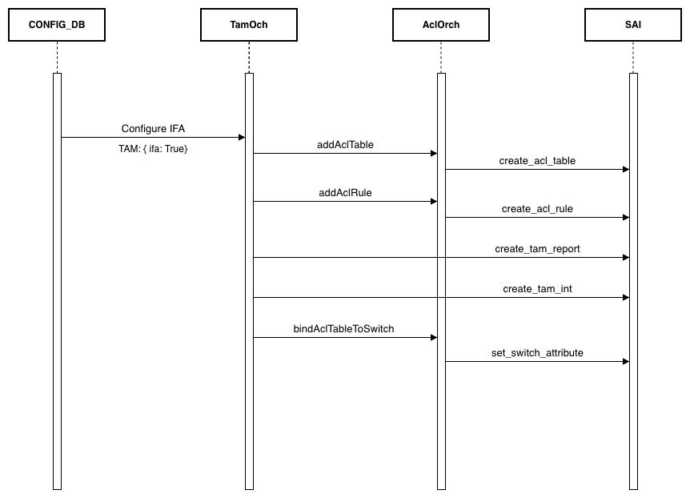
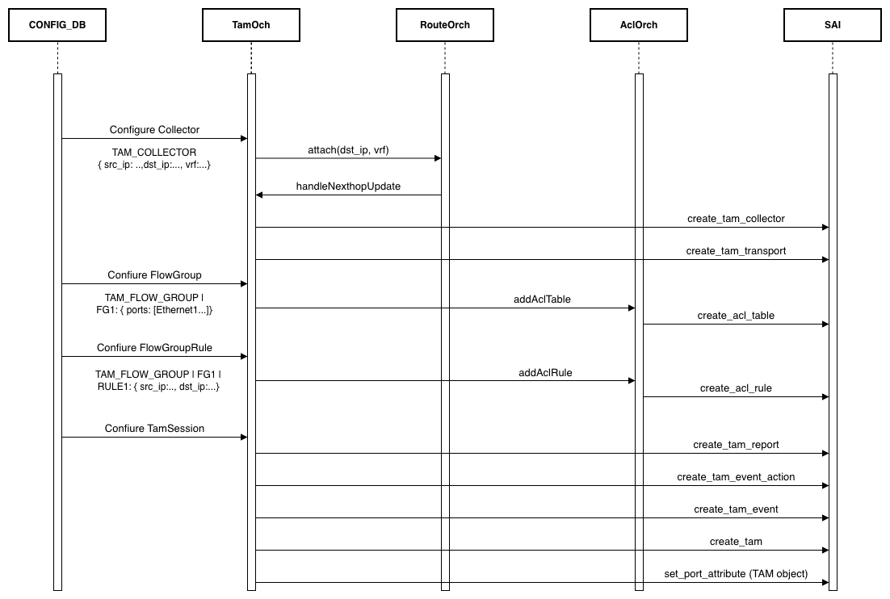

# SONiC Telemetry and Monitoring (TAM) High Level Design

### Rev 0.1

## Table of Contents

## 1. Revision
Rev | Date | Author | Change Description
----|------|--------|-------------------
|v0.1|2025-10-09|Senthil Krishnamurthy|Initial version of TAM HLD

## 2. Scope
This document describes the high level design of Telemetry and Monitoring (TAM) in SONiC.

## 3. Definitions/Abbreviations
Definitions/Abbreviation|Description
------------------------|-----------
TAM| Telemetry and Monitoring
SAI| Switch Abstraction Interface
IPFIX| IP Flow Information Export
VRF| Virtual Routing and Forwarding
INT| In-band Network Telemetry
IFA| In-band Flow Analyzer

## 4. Overview
TAM provides a framework to observe and report network events and telemetry by exporting messages to a collector. Telemetry provides information about the network traffic, such as congestion, latency, and port buffer utlization, on a per-device basis. Monitoring provides insights packet drops, and flow statistics.

### 4.1 Telemetry
Inband Telemetry (INT) is a variant of telemetry that provides insights into the path taken by the packets through the network, including per-hop latency, queue depth, and other metrics. Inband Flow Analyzer (IFA) is a mechanism INT uses to embed the telemetry data directly into the packet. In an IFA-aware network, the hops can perform one of the three roles:
1. **Initiator Node**: This node initiates the IFA packet and can operate in one of two modes:
    a. **Inband Mode**: IFA header and the first IFA metadata, with telemetry data, is added to the data packet.
    b. **Probe Mode**: Incoming data packets are sampled and the first IFA metadata is added to the sampled packet.
2. **Transit Node**: Matches on IFA packet and adds new IFA metadata to the packet.
3. **Terminator Node**: Inband IFA packet are stripped off the IFA header and metadata, and the datapacket is forwarded to the next hop, and the metadata is exported to a collector. Probe IFA packets are teminated and mirroed to a collector.

### 4.2 Monitoring
TAM supports the Drop-Monitor (DM) feature, which provides visibility into packet drops in the dataplane. The dropped packets are trapped to a collector along with metadata that includes the reason for the drop and the payload of the packet, upto a maximum length. It can operate in two modes:
1. **Stateless DM**: Drop reasons are exported on a per-packet per-drop basis.
2. **Stateful DM**: Drop reasons are exported on a per-flow basis, in periodic intervals.

## 5. Requirements
TAM will be implemented in multiple phases.

### 5.1 Phase 1
- Support Initiator and Transit roles for INT/IFA
- Support IFA version 2.0 for the IFA header and metadata inserted in the packet
- Support drop-monitor (DM) telemetry type with IPFIX reporting
- Support stateless drop-monitoring
- Collector endpoint can be either IPv4 or IPv6
- Collectors can be reachable via default or mgmt VRF (mgmt VRF must be enabled to use it)
- Flow groups can be defined to seletcs packets for IFA and DM
- TAM Session can be bound to one or more flow-groups
- TAM Session can be bound to one or more collectors

### 5.2 Phase 2
- Support stateful drop-monitoring
- Support Terminator role for INT/IFA
- Support packet sampling

### 5.3 Phase 3
- Support additional telemetry types (e.g., flow-statistics)
- Support additional report types (e.g., gRPC)

## 6. Module Design
### 6.1 Overall design
- Management framework writes TAM tables to CONFIG_DB using yang model
- TamOrch (new) in orchagent subscribes to CONFIG_DB TAM_* tables and programs SAI TAM objects
- Syncd/SAI implement TAM object model and programs the dataplane
- Telemetry data is exported to collectors from front-panel ports without punts to CPU

### 6.2 Configuration and control flow
The SWSS container is enhanced to add a new component, TamOrch, to process TAM configuration and control.

#### 6.2.1 Inband Telemetry
The following figure shows the configuration and control flows for TAM INT using IFAv2:


1) Administrator configures TAM device attributes (CONFIG_DB), with IFA enabled
2) tamorch uses aclorch to create an ACL table and an ACL rule to match on IP_PROTO 253 (IFA)
3) tamorch creates SAI TAM_REPORT and TAM_INT objects
4) The ACL table is bound to the switch

#### 6.2.2 Drop Monitoring
The following figure shows the configuration and control flows for TAM Drop Monitoring:


1) Administrator configures TAM collectors, flow-groups, and sessions (CONFIG_DB)
2) If the collector config uses a VRF, tamorch resolves the VRF to resolve the nexthop for the collector destination IP
3) tamorch creates SAI TAM_COLLECTOR and TAM_TRANSPORT objects using the resolved nexthop
4) tamorch uses aclorch to create an ACL table and an ACL rule with match conditions from the flow-group rules
5) The ACL table is bound to the list of front-panel ports specified in the flow-group
6) tamorch processes the TAM_SESSION_TABLE to create SAI TAM objects (report, event_action, event, tam)

### 6.3 SWSS and syncd changes
- New tamorch: consumes CONFIG_DB TAM tables, maps to SAI TAM objects, maintains reference counts and object lifecycles
- syncd/SAI: no changes

## 8. Configuration and Management
### 8.1 CONFIG_DB
Configure IFA by creating a TAM table:
```
"TAM": {
  "device": {
    "device-id": 1234,     // 28bits
    "enterprise-id": 1234,
    "ifa": true // boolean
  }
}
```

Configure drop-monitor by creating flow-groups, collectors, and sessions:
```
"TAM_FLOW_GROUP": {
  "fg-1": {
    "aging_interval": 60,
    "ports": ["Ethernet0", "PortChannel10"]
  },
  "fg-1|rule1": {
    "src_ip_prefix": "0.0.0.0/0",
    "dst_ip_prefix": "10.0.0.0/8",
    "ip_protocol": 6,
    "l4_dst_port": 443
  }
},
"TAM_COLLECTOR": {
  "c1": {
    "dst_ip": "192.0.2.10",
    "dst_port": 4739,
    "dscp_value": 32,
    "vrf": "vrf_blue"
  }
},
"TAM_SESSION": {
  "s-drop": {
    "type": "drop-monitor",
    "report_type": "ipfix",
    "flow_group": "fg-1",
    "collector": ["c1"]
  }
}
```
Configure sFlow TAM Session:
```
"TAM_SESSION": {
  "s-sflow": {
    "type": "sflow",
    "report_type": "ipfix",
    "collector": ["c1"]
  }
}
```

### 8.2 DB and Schema changes

```
; Defines schema for TAM device configuration attributes
key                 = TAM:device                     ; TAM device-level configuration
; field             = value
DEVICE_ID           = 1*9DIGIT                       ; 1..134217727
ENTERPRISE_ID       = 1*9DIGIT                       ; 1..134217727
IFA                 = "true" / "false"               ; Enable IFA device-type hint
```

```
; Defines schema for TAM flow-group configuration attributes
key                 = TAM_FLOW_GROUP:flow_group_name
; field             = value
PORTS               = ifname-list                    ; comma-separated list of interfaces

; value annotations
flow_group_name     = 1*255VCHAR
ifname-list         = ifname *( "," ifname )
ifname              = 1*64VCHAR
```

```
; Defines schema for TAM flow-group match rules
key                 = TAM_FLOW_GROUP:flow_group_name|rule_name
; field             = value
SRC_IP_PREFIX       = ip_prefix                      ; mandatory
DST_IP_PREFIX       = ip_prefix                      ; mandatory
L4_SRC_PORT         = port_num                       ; optional
L4_DST_PORT         = port_num                       ; optional
IP_PROTOCOL         = 1*3DIGIT                       ; 1..255 (optional)

; value annotations
rule_name           = 1*64VCHAR
ip_prefix           = IPv4prefix / IPv6prefix
IPv4prefix          = IPv4address "/" 1*2DIGIT       ; 0..32
IPv6prefix          = IPv6address "/" 1*3DIGIT       ; 0..128
port_num            = 1*5DIGIT                       ; 1..65535
```

```
; Defines schema for TAM collector configuration attributes
key                 = TAM_COLLECTOR:collector_name
; field             = value
SRC_IP              = IPv4address / IPv6address      ; optional
DST_IP              = IPv4address / IPv6address      ; mandatory
DST_PORT            = port_num                       ; mandatory
DSCP_VALUE          = dscp                           ; DSCP 0..63 (default 32)
VRF                 = "default" / "mgmt" / vrf_name  ; VRF for collector reachability

; value annotations
collector_name      = 1*255VCHAR
vrf_name            = 1*255VCHAR
dscp                = 1*2DIGIT                       ; 0..63
```

```
; Defines schema for TAM session configuration attributes
key                 = TAM_SESSION:session_name
; field             = value
TYPE                = "drop-monitor"
REPORT_TYPE         = "ipfix"
FLOW_GROUP          = flow_group_name                 ; optional
COLLECTOR           = collector_list                  ; one or more collectors

; value annotations
session_name        = 1*255VCHAR
collector_list      = collector_name *( "," collector_name )
```

> Note: Refer to swss-schema.md for standard value annotations such as IPv4address/IPv6address and ifname, and for general BNF conventions used across SONiC documents.


## 9. Warmboot and Fastboot Impact
- No additional sleeps in boot-critical path. TAM object creation occurs after dependencies are up. Service can be delayed until SYSTEM_READY is Up. When disabled/unused, no impact.

## 10. Memory Consumption
- Minimal control-plane state in orchagent (object maps). No growth when feature disabled.

## 11. Restrictions/Limitations
- Requires platform/SAI support for TAM drop monitoring and IPFIX export; otherwise feature remains inoperative (capability=false)
- Exact limits (number of flow-groups/rules/collectors) depend on platform
- mgmt VRF usage requires MGMT_VRF enabled

## 12. Testing Requirements
### 12.1 Unit tests (one-liners)
1) Validate CONFIG_DB for each table and field
2) Validate reference checks (ports, VRF, flow_group, collector)
3) Validate tamorch creates/updates/deletes SAI TAM objects per CONFIG_DB changes
4) Capability gating: with capability=false, CONFIG_DB writes do not program SAI

### 12.2 System tests
1) Configure flow-group, rule, collector, session; verify IPFIX is exported to collector
2) Verify VRF selection (default vs mgmt) and DSCP marking
3) Verify rule match scoping and port/PortChannel membership
4) Reboot/warm-reboot and verify export resumes with preserved configuration

## 13. Open/Action items
- Finalize CLI commands and Command-Reference.md updates aligned to YANG
- Document per-platform capability and limits
