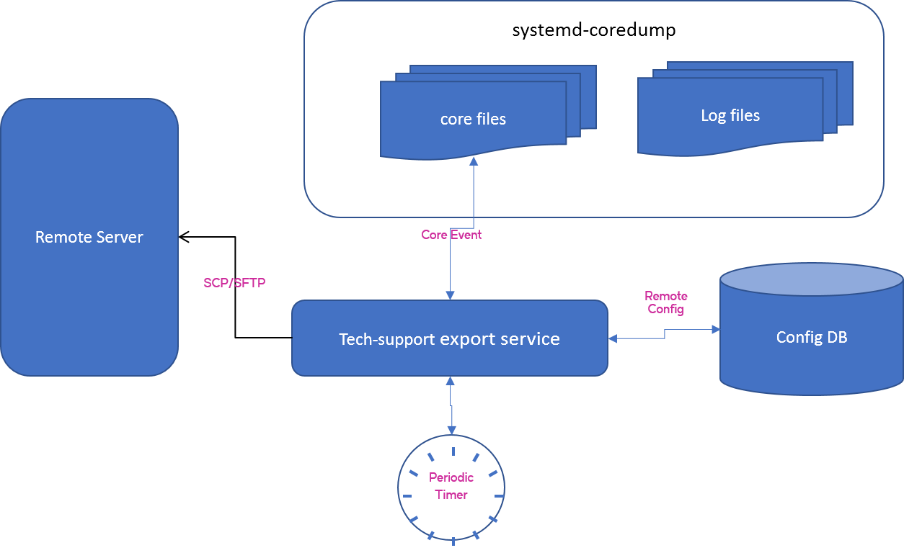

# Core file manager

## High Level Design Document
**Rev 2.0**

## Table of Contents

* [List of Tables](#list-of-tables)
* [Revision](#revision)
* [About This Manual](#about-this-manual)
* [Scope](#scope)
* [Definition/Abbreviation](#definitionabbreviation)
* [Requirements Overview](#requirements-overview)
  * [Functional Requirements](#functional-requirements)
  * [Scalability Requirements](#scalability-requirements)
  * [Warmboot Requirements](#warmboot-requirements)
  * [Configuration and Management Requirements](#configuration-and-management-requirements)
* [Functional Description](#functional-description)
  * [Design](#design)
  *   [ Core-dump generation service](#core-dump-generation-service)
  *   [ Tech-support export service](#tech-support-export-service)
* [CLI commands](#cli-commands)
* [Serviceability and DEBUG](#serviceability-and-debug)
* [Warm Boot Support](#warm-boot-support)
* [Unit Test](#unit-test)

# List of Tables

[Table 1: Abbreviations](#table-1-abbreviations)

# Revision

Rev   |   Date   |  Author   | Change Description
:---: | :-----:  | :------:  | :---------
1.0   | 05/07/19 | Kalimuthu | Initial version
2.0   | 03/08/19 | Rajendra  | Review Comments 

# About this Manual

This document describes a core file management framework in SONiC network operating system. This feature helps to manage the  generation of core files  and exporting them to an external server for better debuggability.

# Scope

This document describes the following enhancements to the SONiC Core File handling: -

 - The Debian "systemd-coredump" service is added to the SONiC host O/S, replacing the existing SONiC core dump handling. This service can be managed through the associated "coredumpctl" tool and "coredump.conf".
 - A SONiC service called core file manager is added to provide additional management and export of the core dumps that systemd-coredump generates to a remote host.
 - The core file manager service also includes "show tech-support" data along with the core file when exporting crash reports to remote host. Exporting of crash reports is done both periodically and on discovery of a new core file.
 - SONiC UI capabilities are added to manage the core file manager service and systemd-coredump functionality.
This document describes the high level design details of core file manager framework that consists of core file and tech-support data generation framework. It also provides the exporting of  tech-support data to a remote server when a new core is generated and also on a periodic interval.  This document describes the tools used to support the core file generation and export functionality.

# Definition/Abbreviation

### Table 1: Abbreviations

| **Term**     |  **Meaning**                  |
|:-------------|:------------------------------|
| tech-support | Technical support data        |
| SCP          | Secure Copy Protocol          |
| SFTP         | Secure File Transfer Protocol |

## Requirements Overview

### Functional Requirements

This document describes new mechanisms to manage the core files that are generated in a SONiC environment. When a process is terminated unexpectedly, the System generates the core dump of that process in most cases. The core files are stored on the persistent storage like SSDs. These core files need to be managed on the SONiC devices to optimize disk space usage, exported to remote server for offline analysis and recorded to maintain a history of occurrences. In addition, existing "tech-support" information is associated with the core dumps and managed similarly.

### Core Manager Requirements

  1. Add a new SONiC service to manage the core dumps as follows: - 

	 a.  Support per-process core file rotation and archiving to optimize disk space 

 	 b.  Strip Core files sensitive information 

 2.  Add a new SONIC service to collect and export the tech-support data as follows:-

	 a.  Collect tech-support data when a new core dump is discovered, and export it to a remote server.

	 b. Periodically collect and export tech-support data

### Configuration and Management Requirements

To configure the core dump and tech-support data, export to an external server and to view the core details the following config and show commands shall be supported. It is to be noted that the tech-support data always includes the core dumps generated on the system.

### Config commands

>1. Config command to enable/disable the coredump generation of processes.
>2.  Config command to store the details of exporting tech-support data to an external server which includes remote server name, path, transfer protocol type and the user credentials.
>2. Config command to enable/disable the tech-support export
>3. Config command  to configure the tech-support export periodic interval.

### Show commands
> 1. Show commands to display the core file information
> 2. show commands to display the tech-support export information.
 
### Scalability Requirements
There should be a limit on the size of the core file generated and the space occupied on the disk.

### Warmboot Requirements
> NA

# Functional Description

## Design

The corefile management functionality is divided into two main services. 

	1. Core-dump generation service.
	2.  Tech-support data export service.

## Core-dump generation service

1.  Core files are usually generated when process terminates unexpectedly. Typical conditions are access violations, termination signals (except SIGKILL), etc.,
2.  ulimit configuration might prevent generation of core due to size configurations. We need to ensure this is not the case.
3.  Service restart functions - will not generate the core dump as it handle the graceful stop and start. This includes docker service restart as well.

## systemd-coredump

The [systemd-coredump](https://www.freedesktop.org/software/systemd/man/systemd-coredump.html) is a native systemd tool that is available in Debian o/s version 9 (stretch) and above. This tool provides an array of features to manage application core files. When it is installed, as part of base configuration it provides following functionality:

1.  Configures kernel to dump a core when application performs unexpected exit. The process ID, UID, GID, signal received, time of termination, command name of the terminated process are collected. The core dump generate may be affected by ulimit settings. Care should be taken that ulimit settings do not conflict with systemd-coredump configuration.
    
2.  Maintains a record of all crashes that have occurred. The list is searchable using various key patterns. More about the [coredumpctl](https://www.freedesktop.org/software/systemd/man/coredumpctl.html#) tool can be found [here](https://www.freedesktop.org/software/systemd/man/coredumpctl.html#).
    
3.  If core files are deleted, a record is still maintained with some minimal information about the crash that has happened and indicating that the core file is missing. This helps maintain a historic record of all crash events even when core files have been deleted.
    
4.  Core files generated are stored in /var/lib/systemd/coredump with unique file name. E.g (core.myprogram.1000.30b28dabbdae41098a58bedd99bb1a95.28153.1560967987000000000000.lz4). The unique filename helps user to associate an identifiable signature to a core file. The filename format is core.<program-name>.<uid>.<boot-id>.<PID>.<timestamp>. The boot-id of a Debian system can be read from the file /proc/sys/kernel/random/boot_id. The boot-id helps identify all the core files generated on a system before it rebooted.
    
5.  Core files are compressed using LZ4 which provides optimal compression and decompression speed
    
6.  Maximum size of the core file stored. Configured as 2GB. This value is when corefile is in uncompressed format. On disk when it is stored in compressed format, it will occupy less space.
    
7.  File permissions of core files generated are set appropriately so that only root user can access them
    
8.  Ensures a maximum of 10% of total disk space to be used for storing core files.
    
9.  Ensures to keep at least 15% of total disk space as free.
    
10.  When too many core files are generated and take up more space than allocated disk space, oldest core files are automatically deleted to make way for the newly created ones.
  
## SONiC Code Changes

Current SONiC code has some basic support for generation and compression of core files. Once systemd-coredump package is included in SONiC image, current functionality is removed. Following are the changes proposed:

>-   Install “systemd-coredump” as part of build_debian.sh
>-   Remove coredump directory entry in “/usr/lib/tmpfiles.d/systemd.conf” so that core files are not deleted by the tmpfile cleanup service.
>-   Setting of “kernel/core_pattern” in “build_debian.sh” is removed as systemd-coredump sets this parameter.
>-   A symlink /var/core is created to point to the systemd-coredump standard core file destination “var/lib/systemd/coredump”
>-   “show techsupport” command is modified to capture the core files from the symlink “/var/core”. It is also modified to consider that core files are lz4 compressed instead of gz files.
 
## Configuration commands:

For SONiC switches following CLI commands will be provided to manage core files

#### show core [ config | info | list ]

>######  **\<config>** Show coredump configuration
>######  **\<info>** Show information about one or more coredumps
>######	 **\<list>** List available coredumps

Display list of current core files available and their information. This is a wrapper command for the coredumpctl utility provided by systemd-coredump package.

#### config core <enable|disable>

Enable or disable coredump functionality. This configuration entry will be part of Config DB and thus can be stored as part of startup-configuration.

When disabled, this command will set ProcessSizeMax=0 in the /etc/systemd/coredump.conf file. The configuration variable ProcessSizeMax specifies maximum size in bytes of a core which will be processed. By setting it to 0 core dump generation can be disabled. When enabled this command will set ProcessSizeMax to be the same value as ExternalSizeMax. The configuration variable ExternalSizeMax indicates the maximum (uncompressed) size in bytes of a core to be saved.
 
## Core Dump Event Logging

Report of available core files can be obtained using the coredumpctl utility.
		
	root@sonic:/home/admin# coredumpctl list
	TIME PID UID GID SIG COREFILE EXE
	Tue 2019-06-18 15:14:12 UTC 5038 0 0 11 present /home/admin/hello
	Tue 2019-06-18 15:17:30 UTC 4458 0 0 6 present /usr/bin/vlanmgrd
	Tue 2019-06-18 15:20:44 UTC 9275 0 0 11 present /home/admin/hello
	Tue 2019-06-18 15:20:45 UTC 9281 0 0 11 present /home/admin/hello

User can filter the core events list to view information of a particular core event using PID or program name as search string. In below example only the core information generated by the vlanmgrd application is seen.

	root@sonic:/home/admin# coredumpctl list vlanmgrd
	TIME PID UID GID SIG COREFILE EXE
	Tue 2019-06-18 15:17:30 UTC 4458 0 0 6 present /usr/bin/vlanmgrd

It is also possible to view detailed information along with backtrace of a particular core file using PID as search string.

	root@sonic:/home/admin# coredumpctl dump 9275
	PID: 9275 (hello)
	UID: 0 (root)
	GID: 0 (root)

	Signal: 11 (SEGV)
	Timestamp: Tue 2019-06-18 15:20:44 UTC (37min ago)
	Command Line: ./hello
	Executable: /home/admin/hello
	Control Group: /system.slice/system-serial\x2dgetty.slice/serial-getty@ttyS2.service
	Unit: serial-getty@ttyS2.service
	Slice: system-serial\x2dgetty.slice
	Boot ID: f687508200b948a58c20222631c5ebbc
	Machine ID: 7bfb28a79813456090ec1df35a2073f5
	Hostname: sonic

	Storage: /var/lib/systemd/coredump/core.hello.0.f687508200b948a58c20222631c5ebbc.9275.1560871244000000000000.lz4
	Message: Process 9275 (hello) of user 0 dumped core.

	Stack trace of thread 9275:
	#0 0x00000000004005e7 main (hello)
	#1 0x00007f6ece5712e1 __libc_start_main (libc.so.6)
	#2 0x0000000000400519 _start (hello)
	Refusing to dump core to tty (use shell redirection or specify --output).

  
## Core File Rotation and Archive

When core file is generated for the same process multiple times, the framework should keep the generated core file in compressed form for the last N-1 number of core files. The number and the maximum size of the core files can be configured through /etc/systemd/coredump.conf file. The latest core file shall be kept in uncompressed format.

The archived core file is generated in a pre-defined format by the systemd-coredump tool.

Format: core.<program-name>.<uid>.<boot-id>.<PID>.<timestamp>
Examples:
	core.orchagent.0.8bc64adf67544e9e8b897cc5c1c9fde7.10618.1479890855000000000000.lz4  
	core.orchagent.0.8bc64adf67544e9e8b897cc5c1c9fde7.11686.1479886973000000000000.lz4  
	core.orchagent.0.8bc64adf67544e9e8b897cc5c1c9fde7.1748.1479887528000000000000.lz4  
	core.orchagent.0.8bc64adf67544e9e8b897cc5c1c9fde7.18600.1479888638000000000000.lz4  
	core.orchagent.0.8bc64adf67544e9e8b897cc5c1c9fde7.21734.1479888083000000000000.lz4  
	core.orchagent.0.8bc64adf67544e9e8b897cc5c1c9fde7.23065.1479890300000000000000.lz4  
	core.orchagent.0.8bc64adf67544e9e8b897cc5c1c9fde7.26069.1479889746000000000000.lz4  
	core.orchagent.0.8bc64adf67544e9e8b897cc5c1c9fde7.31104.1479891410000000000000.lz4  
	core.orchagent.0.8bc64adf67544e9e8b897cc5c1c9fde7.5952.1479889193000000000000.lz4
  
# Tech-support export service 

The tech-support data is a vital information for debugging of a system and is captured by collecting the  device configuration, system information, log files  and core files. The export service captures the tech-support data and export it to a remote server for better offline debugging.  The tech-support data is captured and exported under the following conditions 

  1.  On detection of a new core file
  2.  On a periodical interval

The export service is configured to monitors the coredump path for any new core file creation. Upon detection of a new core file, it triggers the tech-support data collection and export it to a remote server.   In addition, export service can be configured to capture and upload the tech-support data periodically. 

### Config DB Schema

In order to export the tech support data, remote server details have to be configured on the device. Through CLI interface, external storage server can be configured which includes server IP, path and access information like user credentials and transport protocol. This information is stored as part of config DB.
,
>>
    "EXPORT": {
        "export": {
            "config": "<enable/disable>",
            "servername": "<remote server address>",
            "destdir": "<remote directory>",
            "username": "<remote username>",
            "password": "<remote password>",
            "protocol": "<scp/sftp>",
            "interval": "<priodic interval>",
           
        }
    },

While configuring the export service, the remote server password is encrypted with device universally unique identifier (UUID) and stored into the config DB, so that the password can be decrypted only on the device. The protocol fields specifies the one of the file transfer protocol either SCP or SFTP.  The interval field specifies the duration in which it captures the tech-support data and export it.

## CLI commands
    
To enable the export feature:
    
### Config CLI commands

>##### sudo config export server username destdir protocol <server_ip> <username> <destination-directory> <scp|sftp>
> where: 
>>  server    => Name of the remote server to upload the tech-support data.
>>  username => remote server username.
>>  destdir      => destination server upload directory  path.
>> protocol => transfer protocol either SCP/SFTP

Upon entering the config command, the user is prompted for getting the remote server password. 

>##### sudo config export <enable|disable>

This will export show tech-support data, on detection of a new core file. In addition, the data is also exported periodically.

By default, the export service is disabled. 

### Config CLI commands - Interval
>##### sudo config export interval <interval in minutes>
>where  interval can be 
>> 0   =>  disable the periodic export of tech-support data
>> <30 - 1440>  => any value between 30 minutes to 24 hours. by default, 30 minutes is the export interval. 

1.  To disable or change the periodic export interval, use the following command:
   
### Disable Mode
>##### sudo config export interval 0 (To disable)
>##### sudo config export interval 60 (To change it to one hour)
  
### Show CLI commands

  To display the tech-support export configuration
    >> show export
    Dumps the export configurations.

## Serviceability and DEBUG
NA

## Warm Boot Support
NA

## Unit Test

SNO|   Testcase|  Description   | Result
:---: | :-----:  | :------  | :---------:|:-----:
1| Service Startup| 1. Check the coredump service on startup  2. Check the export service on startup  | Pass
2| coredumpctl | 1. List the core files   2. Verify the contents (backtrace) of the core file   -- coredumpctl list   -- coredumpctl info| Pass
3| show export service | 1. List the export service info   -- show export   2. Verify the coonfig db by show running config   -- show runningconfiguration all | Pass
4| config export service | 1. Verify the config export with different CLI options   2. Verify the export service enable/disable | Pass
5|  tech-support export | 1. Verify the tech-support export   -- When a new core is generated   -- On a periodic interval | Pass
6| Invalid arguments| Verify the various arguments with an invalid combination | Pass

