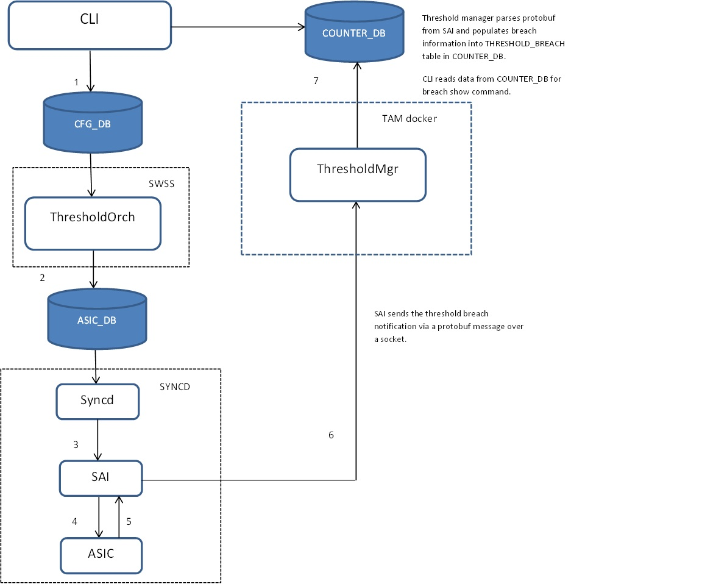
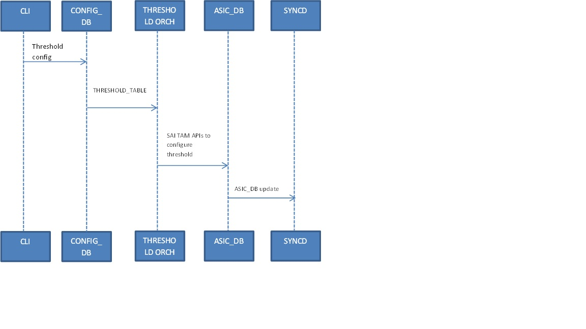
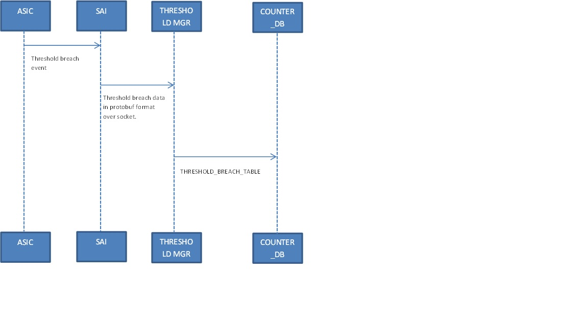

# Feature Name
Threshold feature.

# High Level Design Document
#### Rev 0.1

# Table of Contents
  * [List of Tables](#list-of-tables)
  * [Revision](#revision)
  * [About This Manual](#about-this-manual)
  * [Scope](#scope)
  * [Definition/Abbreviation](#definition-abbreviation)
  * [1 Feature Overview](#1-feature-overview)
	  * [1.1 Requirements](#1_1-requirements)
		  * [1.1.1 Functional Requirements](#111-functional-requirements)
		  * [1.1.2 Configuration and Management Requirements](#112-configuration-and-management-requirements)
		  * [1.1.3 Scalability Requirements](#113-scalability-requirements)
	  * [1.2 Design Overview](#12-design-overview)
		  * [1.2.1 Basic Approach](#121-basic-approach)
		  * [1.2.2 Container](#122-container)
		  * [1.2.3 SAI Overview](#123-sai-overview)
  * [2 Functionality](#2-functionality)
	  * [2.1 Target Deployment Use Cases](#21-target-deployment-use-cases)
	  * [2.2 Functional Description](#22-functional-description)
  * [3 Design](#3-design)
	  * [3.1 Overview](#31-overview)
		  * [3.1.1 ThresholdMgr](#311-thresholdmgr)	
	  * [3.2 DB Changes](#32_db-changes)  
		  * [3.2.1 CONFIG DB](#321-config-db)
		  * [3.2.2 APP DB](#322-app-db)
		  * [3.2.3 STATE DB](#323-state-db)
		  * [3.2.4 ASIC DB](#324-asic-db)
		  * [3.2.5 COUNTERS DB](#325-counters-db)
	  * [3.3 Switch State Service Design](#33-switch-state-service-design)
		  * [3.3.1 Orchestration Agent](#331-orchestration-agent)
		  * [3.3.2 Other Process](#332-other-process)
	  * [3.4 Syncd](#34-syncd)
	  * [3.5 SAI](#35-sai)
	  * [3.6 CLI](#36-cli)
		  * [3.6.1 Data Models](#361-data-models)
		  * [3.6.2 Configuration Commands](#362-configuration-commands)
		  * [3.6.3 Show Commands](#363-show-commands)
		  * [3.6.4 Clear Commands](#364-clear-commands)
		  * [3.6.5 Debug Commands](#365-debug-commands)
		  * [3.6.6 REST API Support](#366-rest-api-support)  
  * [4 Flow Diagrams](#4-flow-diagrams)
	  * [4.1 Config Call Flow](#41-config-call-flow)
	  * [4.2 Breach Event Call Flow](#42-breach-event-call-flow)
  * [5 Error Handling](#5-error-handling)
  * [6 Serviceability And Debug](#6-serviceability-and-debug)
  * [7 Warm Boot Support](#7-warm-boot-support)
  * [8 Scalability](#8-scalability)
  * [9 Unit Test](#9-unit-test)

# List of Tables
[Table 1: Abbreviations](#table-1-abbreviations)

# Revision
| Rev |     Date    |       Author       | Change Description                |
|:---:|:-----------:|:------------------:|-----------------------------------|
| 0.1 | 06/12/2019  |   Shirisha Dasari  | Initial version                   |

# About this Manual
This document provides general information about the threshold feature implementation in SONiC.

# Scope
This document describes the high level design of threshold feature. 

# Definition/Abbreviation
### Table 1: Abbreviations
| **Term**                 | **Meaning**                         |
|--------------------------|-------------------------------------|
| SAI                      | Switch abstraction interface        |
| TAM                      | Telemetry and monitoring            |
| Watermark                | Peak counter value reached          |
| ThresholdMgr             | Threshold manager                   |

# 1 Feature Overview
The threshold feature allows configuration of a threshold on supported buffers in ingress and egress. A threshold breach notification (entry update in COUNTERS\_DB) is generated on breach of the configured buffer threshold in ASIC.   

## 1.1 Requirements
### 1.1.1 Functional Requirements

1.0 Threshold feature allows the user to configure a threshold on a buffer (i.e buffer usage) and record all threshold breach events for that buffer.

1.1 On breach of the configured threshold in ASIC, a breach event entry is added to COUNTERS\_DB. User can list out the breach event data through a CLI command. In addition, the breach entries in COUNTERS\_DB are also available to SONiC telemetry feature as well.

1.2 The threshold feature can be used to track and be notified of congestion events in the network real-time.

1.3 Monitoring of buffer usage can be achieved via the watermark feature available in SONiC.

1.4 Along with the watermark feature, the threshold feature provides data that can be used to design applications to monitor MMU buffer usage.  

2.0.0 The threshold for a buffer must be configured in terms of percentage of buffer allocation.
 
2.0.1 The configured threshold can be cleared at any point by the user.

2.0.2 The supported counters for threshold feature are listed below.

2.0.2.1 SAI\_INGRESS\_PRIORITY\_GROUP\_STAT\_SHARED\_WATERMARK\_BYTES -- Current ingress priority-group shared buffer usage in bytes.

2.0.2.2 SAI\_INGRESS\_PRIORITY\_GROUP\_STAT\_XOFF\_ROOM\_WATERMARK\_BYTES -- Current ingress priority-group headroom buffer usage in bytes.

2.0.2.3 SAI\_QUEUE\_STAT\_SHARED\_WATERMARK\_BYTES -- Current egress queue buffer usage in bytes.

2.0.3 The counters listed in 2.0.2.1, 2.0.2.2 and 2.0.2.3 are to be supported for all ports on SONiC.

2.0.4 The threshold can be configured on one or more of the 8 priority-groups of a port.

2.0.5 The threshold can be configured on one or more of the unicast/multicast queues of a port.

2.0.6 On breach of the configured threshold, the breach information is written into  THRESHOLD\_BREACH\_TABLE of COUNTERS\_DB. 

2.0.6.1 The breach entry must indicate the counter on which the threshold breached.

2.0.6.2 The breach entry must indicate the port associated with the counter on which the breach occurred.

2.0.6.3 The breach entry must indicate the counter index of the port (ref 2.0.4, 2.0.5) on which the breach occurred i.e the priority-group index for 2.0.2.1, 2.0.2.2 and queue index and type for 2.0.2.3. 

2.0.6.4 The breach entry must contain the buffer usage in terms of percentage at the time of breach.

2.0.6.5 The breach entry must contain the absolute buffer usage in bytes at the time of breach.

2.0.6.6 The breach entry must contain the time stamp of the breach event. The ASIC provides the time stamp of breach event via the breach event protobuf.

2.0.7 The threshold feature must be a part of the TAM container along with other TAM features.

3.0 The threshold feature must be supported on physical ports. LAG member ports will continue to be tracked at the physical port level.

3.1 The threshold feature does not support dynamic port breakout.

3.2 In case of static port breakout, the user is expected to reconfigure the broken out ports.

3.3 CPU port counters for queues are not supported for threshold configuration.

4.0 The threshold can be configured in percentage mode only.

4.1 The breach entry in COUNTERS\_DB must show the usage at breach in bytes and percentage.

5.0 UI commands available to check currently configured thresholds.

5.1 UI commands available to show threshold breach events.

### 1.1.2 Configuration and Management Requirements

The threshold feature will use the python click framework for CLI. 

### 1.1.3 Scalability Requirements
There is no limit enforced on the threshold configuration and breach event entries.

## 1.2 Design Overview
### 1.2.1 Basic Approach
The threshold feature is newly developed.  

### 1.2.2 Container
A new container, "tam" is created to host the ThresholdMgr. 

### 1.2.3 SAI Overview
The SAI TAM spec specifies the TAM APIs to be used to configure the threshold functionality. Please refer section 3.5 for more details.

# 2 Functionality
## 2.1 Target Deployment Use Cases

The threshold feature can be used as a monitoring tool to detect congestion in the network. The breach information is available in COUNTERS\_DB thereby allowing applications to be built upon data from the threshold and watermark features to manage and monitor networks.

## 2.2 Functional Description

In a live network, tracking and monitoring buffer usage on a switch can be extremely useful in detecting and isolating potential and actual congestion events in the network. The availability of telemetry information w.r.t buffer usage on network nodes can help to develop network-level monitoring applications. 

The watermark feature in SONiC makes the buffer usage counters readily available in COUNTERS\_DB for multiple users. The watermarks can be used to track peak buffer occupancy across users and intervals. In addition to this, it may also be useful for the user to know when the buffer usage crosses a certain threshold. The threshold feature implements this specific functionality.

The threshold feature allows configuration of the threshold value as a percentage of the buffer limits(MMU configuration via buffer profile or otherwise). The SAI APIs take threshold as a percentage and convert this percentage to an absolute value based upon the appropriate buffer limits configured. For example, if the configured buffer limit for a given priority-group of a port (shared) buffer is 5000 bytes, a threshold value of 10% configured by the user translates to an absolute value of 500 bytes. SAI configures the threshold for the buffer  as 500 bytes and a threshold breach event gets generated if the buffer usage crosses 500 bytes. Note that the original buffer limit and the absolute threshold value configured is not exposed to the user, the user can simply set a threshold in terms of % and be notified when the threshold is crossed.

The supported buffers for threshold are:

1. Ingress port priority group
	1. Shared - Specifies the shared buffer usage on a priority group.
	2. Headroom - Specifies the additional buffer limit that can be utilized when the shared limits are exhausted in the case where flow control is enabled. It accounts for the round trip time of data to be received once flow control is asserted. 
2. Egress port queues
	1. Unicast 
	2. Multicast
 

# 3 Design
## 3.1 Overview

The above diagram illustrates the architecture of the threshold feature within SONiC. The call flow sequence is listed below:

1. CLI takes threshold configuration and populates it into THRESHOLD\_TABLE of config DB.
2. The ThresholdOrch component of Orchagent in SWSS docker picks up the config DB updates on THRESHOLD\_TABLE and converts the config into SAIREDIS calls. ASIC\_DB is updated by SAIREDIS and SYNCD gets notified of incoming updates.
3. SYNCD invokes the SAI APIs for configuring the threshold. 
4. SAI configures the ASIC with threshold configuration.
5. ASIC notifies SAI of a threshold breach notification.
6. SAI collates the breach information into a protobuf message and sends it out to the configured collector (in this case, ThresholdMgr) on a socket.
7. ThresholdMgr parses the threshold breach protobuf message and populates the information into COUNTERS\_DB.
8. The data available in COUNTERS\_DB is used by CLI for showing breach information.  

Some salient points are listed below:

1. ThresholdMgr currently only handles the breach event protobuf processing. It can be extended to support handling of dynamic port breakout configuration etc. in future.
2. ThresholdOrch subscribes to notifications on THRESHOLD\_TABLE of config DB. Since the configuration is in-line with SAI configuration, the orch agent directly picks this config up from config DB.
3. TAM docker currently only hosts ThresholdMgr. It is intended that new TAM applications would be hosted in this container going forward.

## 3.1.1 ThresholdMgr

ThresholdMgr running in the TAM container handles the protobuf parsing of the threshold breach report data. SAI is configured by ThresholdOrch to send the threshold breach event notification to a local collector i.e ThresholdMgr.

The protobuf data received on the socket is decoded and parsed. The data is formatted and written into the THRESHOLD\_BREACH\_TABLE of COUNTERS\_DB.

Once the dynamic port breakout feature is available, ThresholdMgr needs to be enhanced to subscribe to changes on PORT\_TABLE in APP\_DB and STATE\_DB to handle any breakout configuration. 
  
## 3.2 DB Changes
### 3.2.1 CONFIG DB

#### THRESHOLD\_TABLE

    ; New table
    ; Defines threshold configuration.

    key                      = buffer|type|alias|index ; buffer can be "priority-group" or "queue".
                                                       ; type (buffer type) can be 
                                                       ; "shared"
                                                       ; "headroom"  
                                                       ; "unicast"
                                                       ; "multicast" 
                                                       ; alias is unique across all DBs
                                                       ; index (buffer index per port)
    threshold                = 1*3DIGIT                ; Threshold in % (1-100) 

    Example:
   
    Queue threshold configuration:
    127.0.0.1:6379[4]> keys *THRESHOLD*
    1) "THRESHOLD_TABLE|queue|unicast|Ethernet32|4"

	127.0.0.1:6379[4]> HGETALL "THRESHOLD_TABLE|queue|unicast|Ethernet32|4"
	1) "threshold"
	2) "80"

    Priority-group configuration:
	127.0.0.1:6379[4]> keys *THRESHOLD*
	1) "THRESHOLD_TABLE|priority-group|shared|Ethernet40|6"

	127.0.0.1:6379[4]> hgetall THRESHOLD_TABLE|priority-group|shared|Ethernet40|6
	1) "threshold"
	2) "20"
	

### 3.2.2 APP DB
N/A
### 3.2.3 STATE DB
N/A
### 3.2.4 ASIC DB

The ASIC DB is updated by SAI REDIS upon invocation of SAI REDIS APIs by ThresholdOrch.
Following is an example of the ASIC\_DB configuration on applying a configuration of 80% threshold on queue 4 of port "Ethernet32"

    127.0.0.1:6379[1]> keys *TAM*
    1) "ASIC_STATE:SAI_OBJECT_TYPE_TAM_REPORT:oid:0x490000000005b1"
    2) "ASIC_STATE:SAI_OBJECT_TYPE_TAM_TRANSPORT:oid:0x4c0000000005b3"
    3) "ASIC_STATE:SAI_OBJECT_TYPE_TAM_COLLECTOR:oid:0x4e0000000005b4"
    4) "ASIC_STATE:SAI_OBJECT_TYPE_TAM_EVENT:oid:0x5000000000063c"
    5) "ASIC_STATE:SAI_OBJECT_TYPE_TAM_EVENT_THRESHOLD:oid:0x4a00000000063b"
    6) "ASIC_STATE:SAI_OBJECT_TYPE_TAM_EVENT_ACTION:oid:0x4f0000000005b2"
    7) "ASIC_STATE:SAI_OBJECT_TYPE_TAM:oid:0x3c00000000063d"

    127.0.0.1:6379[1]> hgetall ASIC_STATE:SAI_OBJECT_TYPE_TAM_REPORT:oid:0x490000000005b1
    1) "SAI_TAM_REPORT_ATTR_TYPE"
    2) "SAI_TAM_REPORT_TYPE_PROTO"

    127.0.0.1:6379[1]> hgetall ASIC_STATE:SAI_OBJECT_TYPE_TAM_TRANSPORT:oid:0x4c0000000005b3
    1) "SAI_TAM_TRANSPORT_ATTR_TRANSPORT_TYPE"
    2) "SAI_TAM_TRANSPORT_TYPE_UDP"
    3) "SAI_TAM_TRANSPORT_ATTR_SRC_PORT"
    4) "7070"
    5) "SAI_TAM_TRANSPORT_ATTR_DST_PORT"
    6) "7071"

    127.0.0.1:6379[1]> hgetall ASIC_STATE:SAI_OBJECT_TYPE_TAM_COLLECTOR:oid:0x4e0000000005b4
    1) "SAI_TAM_COLLECTOR_ATTR_SRC_IP"
    2) "10.10.10.10"
    3) "SAI_TAM_COLLECTOR_ATTR_DST_IP"
    4) "127.0.0.1"
    5) "SAI_TAM_COLLECTOR_ATTR_TRANSPORT"
    6) "oid:0x4c0000000005b3"
    7) "SAI_TAM_COLLECTOR_ATTR_DSCP_VALUE"
    8) "0"

    127.0.0.1:6379[1]> hgetall ASIC_STATE:SAI_OBJECT_TYPE_TAM_EVENT:oid:0x5000000000063c
    1) "SAI_TAM_EVENT_ATTR_TYPE"
    2) "SAI_TAM_EVENT_TYPE_QUEUE_THRESHOLD"
    3) "SAI_TAM_EVENT_ATTR_ACTION_LIST"
    4) "1:oid:0x4f0000000005b2"
    5) "SAI_TAM_EVENT_ATTR_COLLECTOR_LIST"
    6) "1:oid:0x4e0000000005b4"
    7) "SAI_TAM_EVENT_ATTR_THRESHOLD"
    8) "oid:0x4a00000000063b"

    127.0.0.1:6379[1]> hgetall  ASIC_STATE:SAI_OBJECT_TYPE_TAM_EVENT_THRESHOLD:oid:0x4a00000000063b
    1) "SAI_TAM_EVENT_THRESHOLD_ATTR_ABS_VALUE"
    2) "80"
    3) "SAI_TAM_EVENT_THRESHOLD_ATTR_UNIT"
    4) "SAI_TAM_EVENT_THRESHOLD_UNIT_PERCENTAGE"

    127.0.0.1:6379[1]> hgetall ASIC_STATE:SAI_OBJECT_TYPE_TAM_EVENT_ACTION:oid:0x4f0000000005b2
    1) "SAI_TAM_EVENT_ACTION_ATTR_REPORT_TYPE"
    2) "oid:0x490000000005b1"

    127.0.0.1:6379[1]> hgetall ASIC_STATE:SAI_OBJECT_TYPE_TAM:oid:0x3c00000000063d
    1) "SAI_TAM_ATTR_EVENT_OBJECTS_LIST"
    2) "1:oid:0x5000000000063c"
    3) "SAI_TAM_ATTR_TAM_BIND_POINT_TYPE_LIST"
    4) "1:SAI_TAM_BIND_POINT_TYPE_QUEUE"

    The following config binds the TAM threshold configuration to the appropriate queue:

    127.0.0.1:6379[1]> hgetall ASIC_STATE:SAI_OBJECT_TYPE_QUEUE:oid:0x150000000001f8
    1) "NULL"
    2) "NULL"
    3) "SAI_QUEUE_ATTR_TYPE"
    4) "SAI_QUEUE_TYPE_UNICAST"
    5) "SAI_QUEUE_ATTR_INDEX"
    6) "4"
    7) "SAI_QUEUE_ATTR_TAM_OBJECT"
    8) "oid:0x3c00000000063d"

### 3.2.5 COUNTERS DB
#### THRESHOLD\_BREACH\_TABLE
    
    ; New table
    ; Defines threshold breach information.

    key                     =  breach-report:index     ; Breach report index.
                                                        
    buffer                  = 1*255VCHAR               ; Buffer - "priority-group" or "queue".
    type                    = 1*255VCHAR               ; Buffer type -
                                                       ; "shared"
                                                       ; "headroom"
                                                       ; "unicast"
                                                       ; "multicast"
    port                    = 1*64VCHAR                ; Port on which breach occurred. Unique across all DBs.
    index                   = 1*2DIGIT                 ; Priority group/queue index. 
    breach_value            = 1*3DIGIT                 ; Counter value in % at breach.
	counter                 = 1*64DIGIT                ; SAI counter value in bytes at breach.
	time-stamp              = %y-%m-%d - %H:%M:%S     ; time-stamp when the threshold breach occurred

    Example:
    
	Queue breach entry:	

	127.0.0.1:6379[2]> KEYS THRESHOLD*
	1) "THRESHOLD_BREACH_TABLE:breach-report:1"
	127.0.0.1:6379[2]> HGETALL THRESHOLD_BREACH_TABLE:breach-report:1
	1) "buffer"
	2) "queue"
    3) "type"
    4) "unicast"
	5) "port"
    6) "Ethernet32"
    7) "index"
	8) "4"
    9) "breach_value"
    10) "82"
    11) "SAI_QUEUE_STAT_SHARED_WATERMARK_BYTES"
    12) "8100"
    13) "time-stamp"
	14) "2019-06-14 - 11:29:33"

	Priority-group breach entry:
	
	127.0.0.1:6379[2]> KEYS THRESHOLD*
	1) "THRESHOLD_BREACH_TABLE:breach-report:2"
	127.0.0.1:6379[2]> HGETALL THRESHOLD_BREACH_TABLE:breach-report:2
	1) "buffer"
	2) "priority-group"
    3) "type"
    4) "shared"
	5) "port"
    6) "Ethernet32"
    7) "index"
	8) "7"
    9) "breach_value"
    10) "71"
    11) "SAI_INGRESS_PRIORITY_GROUP_STAT_SHARED_WATERMARK_BYTES"
    12) "8100"
    13) "time-stamp"
	14) "2019-06-14 - 11:29:33"
	

## 3.3 Switch State Service Design
### 3.3.1 Orchestration Agent

A new orchestration agent class, ThresholdOrch is added to convert the incoming threshold config to ASIC configuration. ThresholdOrch subscribes to the THRESHOLD\_TABLE of CONFIG\_DB and converts the configuration to SAI TAM API call sequence described in section 3.5.

ThresholdOrch maintains data pertaining to all the currently configured thresholds and the associated TAM object bindings. TAM object bindings are re-used wherever possible. 

### 3.3.2 Other Process 
N/A

## 3.4 SyncD
N/A

## 3.5 SAI

The SAI TAM API spec defines all TAM APIs supported in SAI. In addition, buffer, port, queue and switch APIs are used to bind the TAM objects to buffer statistics to be monitored.

TAM objects used for threshold configuration are listed below:

1) TAM threshold object - sai_create_tam_event_threshold_fn()
2) TAM report object - sai_create_tam_report_fn()
3) TAM event action object - sai_create_tam_event_action_fn()
4) TAM event object - sai_create_tam_event_fn()
5) TAM object - sai_create_tam_fn() 
       
The conversion of threshold from percentage to bytes is a SAI-dependent function. For example, in the case of Broadcom SAI, the percentage configuration uses the following principle:

1) For static buffer limits - configured % is the % of allocated static limit of the buffer.
2) For dynamic buffer limits - configured % is % of total shared pool limit for the buffer i.e service-pool shared limit.

## 3.6 CLI
### 3.6.1 Data Models
NA
### 3.6.2 Configuration Commands

1) config priority-group threshold {port_alias} {PGindex} {shared \| headroom} {value}.

This command is used to configure a threshold for a specific priority-group shared/headroom buffer of a port. The threshold value is provided in %. Valid values are 1-100. 

2) config queue threshold {port_alias} {queueindex} {unicast \| multicast} {value}

This command is used to configure a threshold for a specific unicast/multicast queue of a port. The threshold value is provided in %. Valid values are 1-100.

### 3.6.3 Show Commands
1) show priority-group threshold {shared \| headroom}

This show command shows the threshold configuration for the shared/headroom priority-group buffers of all ports.

2) show queue threshold {unicast \| multicast}

This show command shows the threshold configuration for the unicast/multicast queue buffers of all ports.

3) show threshold breaches

This command shows the threshold breaches recorded by the system. 

### 3.6.4 Clear commands

1) sonic-clear priority-group threshold {port_alias} {PGindex} {shared \| headroom}

This command can be used to clear a previously configured threshold on shared/headroom priority-group buffer of a port.

2) sonic-clear priority-group threshold 

This command can be used to clear all currently configured priority-group thresholds. 
	
3) sonic-clear queue threshold {port_alias} {queueindex} {unicast \| multicast}

This command can be used to clear a previously configured threshold on unicast/multicast queue buffer of a port.

4) sonic-clear queue threshold 

This command can be used to clear all currently configured priority-group thresholds.

5) sonic-clear threshold breach {eventid}

This command can be used to clear all/particular threshold breaches recorded by the system. The event-id when provided specifies the breach event index (index is indicated in the output of show threshold breaches).

### 3.6.5 Debug Commands
Debug commands will be available once the debug framework is available. The debug commands are needed to dump:

- Threshold entries and TAM object bindings maintained by ThresholdOrch.
- Incoming protobuf data at ThresholdMgr.

### 3.6.6 REST API Support
N/A

# 4 Flow Diagrams
## 4.1 Config call flow 

## 4.2 Breach event call flow

# 5 Error Handling

## CLI
- CLI configuration sanity is enforced by the CLI handler and any invalid configuration is rejected. An error is displayed to the user notifying the reason for rejection of the configuration.

## ThresholdMgr
- Any errors encountered during parsing of protobuf message are logged.

## ThresholdOrch
- Any error occurring in the orchestration agent is logged appropriately via SWSS logging.
- Errors or failures of SAI APIs are logged by ThresholdOrch.
- On failure of a SAI TAM API in the config sequence of section 3.5, the previously configured steps are rolled back i.e previously created intermediate TAM objects for threshold, event etc are destroyed. 

# 6 Serviceability and Debug
Debug commands specified in section 3.6.5 will be supported once the debug framework is available. 

# 7 Warm Boot Support
Warm boot is supported for the threshold feature.

# 8 Scalability

There is no limit enforced on the threshold configuration and breach event entries.

# 9 Unit Test
## CLI

1.  Verify CLI command to configure shared/headroom priority-group threshold on a port.
2.  Verify CLI command to configure unicast/multicast queue threshold on a port.
3.  Verify if priority-group shared and priority-group headroom thresholds can be configured on a port.
4.  Verify if queue unicast and queue multicast thresholds can be configured on a port.
5.  Verify if priority-group and queue threshold configuration can be done on a port.
6.  Verify if the same threshold value can be configured on multiple port's priority-group/queue. 
7. Verify if configured threshold for priority-group can be cleared using the clear command.
8. Verify if configured threshold for queue can be cleared using the clear command.
9. Verify CLI show command to display all the currently configured thresholds across priority-groups on each port.
10. Verify CLI show command to display all the currently configured thresholds across queues on each port.
11. Verify CLI show command to display threshold breaches.
12. Verify CLI clear command to clear priority-group threshold.
13. Verify CLI clear command to clear queue threshold.
14. Verify CLI clear command to clear threshold breaches.

## ThresholdOrch
1. Verify if threshold configuration from config DB is received by ThresholdOrch.
2. Verify if threshold configuration semantics are verified by ThresholdOrch before processing the data. 
4. Verify if ThresholdOrch checks for an existing configuration with the incoming threshold config parameters and handles it appropriately.
5. Verify if ThresholdOrch is able to add new threshold configuration via SAI TAM APIs successfully.
6. Verify if ThresholdOrch is able to delete existing threshold configuration via SAI TAM APIs successfully.
7. Verify if ThresholdOrch is able to use existing TAM threshold objects for threshold config that uses a previously configured threshold value.
8. Verify if ThresholdOrch is able to use existing TAM objects for threshold config that warrants the re-use of existing TAM objects.
9. Verify if a change of threshold value on previous threshold configuration is handled appropriately.
10. Verify if all the internal tables and data are updated appropriately on addition of new threshold configuration.
11. Verify if all the internal tables and data are updated appropriately on deletion of new threshold configuration.
12. Verify if ThresholdOrch logs any errors arising out of SAI API failure.
13. Verify if ThresholdOrch rolls back config in a clean way if there is a SAI API failure.

## ThresholdMgr
1. Verify if ThresholdMgr is able to receive protobuf messages from SAI on configuration of a threshold in SAI.
2. Verify if ThresholdMgr is able to decode and process the incoming protobuf message as a threshold breach event notification.
3. Verify if ThresholdMgr logs errors encountered in recv and processing of the threshold breach event notification.
4. Verify if ThresholdMgr can update the COUNTERS\_DB with the threshold breach data.
5. Verify if ThresholdMgr is able to generate multiple threshold breach entries in COUNTERS\_DB each with a unique breach report index.

## Functional Tests
1. Verify if a threshold on a priority-group shared buffer of a port can be configured successfully. 
2. Verify if a threshold breach event gets generated by SAI and an entry is populated in THRESHOLD\_BREACH table for priority-group shared buffer on port once traffic is started.
3. Verify if a threshold on a priority-group headroom buffer of a port can be configured successfully. 
4. Verify if a threshold breach event gets generated by SAI and an entry is populated in THRESHOLD\_BREACH table for priority-group headroom buffer once traffic is started.
5. Verify if a threshold on a queue unicast buffer of a port can be configured successfully. 
6. Verify if a threshold breach event gets generated by SAI and an entry is populated in THRESHOLD\_BREACH table for queue unicast buffer on port once traffic is started.
7. Verify if a threshold on a queue multicast buffer of a port can be configured successfully. 
8. Verify if a threshold breach event gets generated by SAI and an entry is populated in THRESHOLD\_BREACH table for queue multicast buffer on port once traffic is started.
9. Verify that there is no crash encountered at any of the layers with an invalid threshold configuration. 
10. Verify that an invalid configuration is rejected gracefully at appropriate layers. 

## Negative test cases
1. Verify if CLI throws an error if the threshold value is <1% or >100%.
2. Verify if CLI returns an error if CLI is unable to write the threshold config to config DB. 
3. Verify if CLI returns an error if CLI is unable to read the threshold config from config DB.
4. Verify if CLI returns an error if CLI is unable to read threshold breach information from counter DB.
5. Verify if CLI throws an error on providing invalid index in arguments.
6. Verify if CLI throws an error on invalid commands i.e commands other than unicast, multicast, shared, headroom and event-id. 
7. Verify if ThresholdOrch logs an error on receipt of an incorrect config DB THRESHOLD\_TABLE entry.
8. Verify if ThresholdOrch logs an error if it is unable to read from the config THRESHOLD\_TABLE.
9. Verify if ThresholdOrch logs all errors encountered during processing of the incoming threshold config request.
10. Verify if ThresholdOrch handles invalid threshold value in the incoming table entry data.
11. Verify if ThresholdOrch handles invalid index values for priority groups in table key.
12. Verify if ThresholdOrch handles invalid buffer and buffer_type in incoming table keys.
13. Verify if ThresholdMgr logs an error message if it is unable to write into the COUNTERS\_DB.
7. Verify if ThresholdMgr logs an error message is there is an error encountered while creating the socket.
8. Verify if ThresholdMgr logs an error and drops a protobuf received with invalid port oid.
9. Verify if ThresholdMgr logs an error and drops a protobuf received with invalid pg oid.
10. Verify if ThresholdMgr logs an error and drops a protobuf received with invalid queue oid.
11. Verify if ThresholdMgr logs an error and drops a protobuf received with invalid buffer stats report.
12. Verify if ThresholdMgr logs an error if the incoming protobuf cannot be decoded into the breach proto format.
