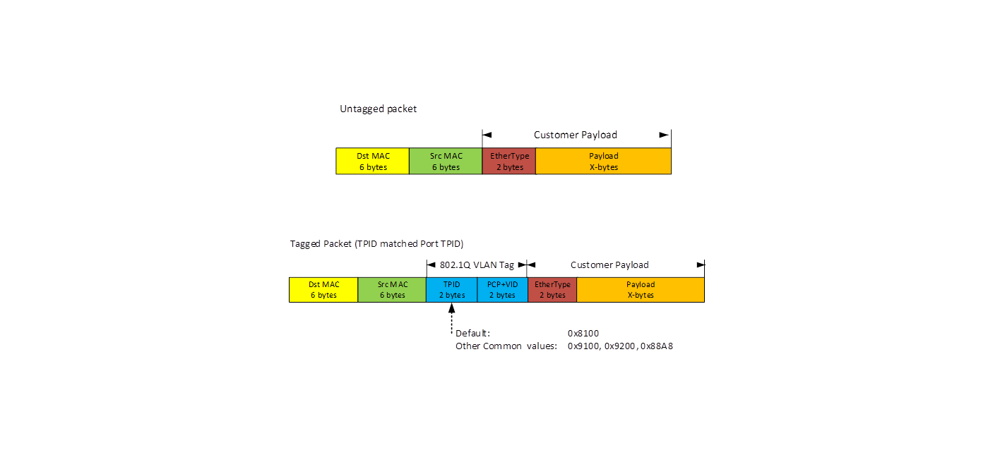
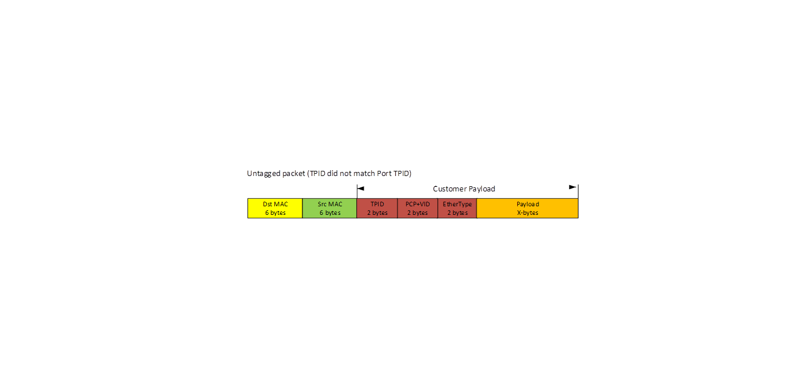
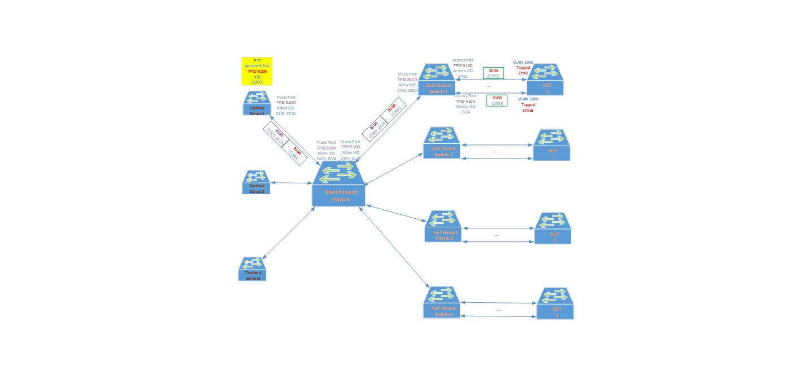
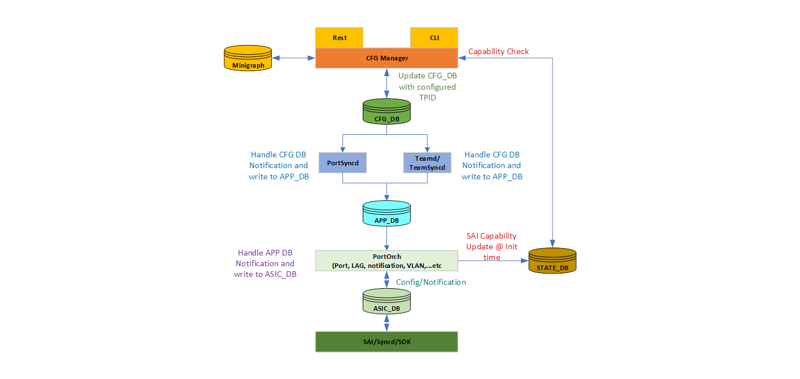

**SONiC Interface TPID Configuration HLD**
===============================

  |**Title**          |**SONiC Interface TPID Configuration HLD**   |
  |:------------------|:--------------------------------------------|
  |**Authors**        |**Microsoft SONiC Team**                     |
  |**Status**         |**In Review**                                |
  |**Created**        |**07/01/2020**                               |
  |**Doc Revision**   |**0.2**                                      |
  ------------------ --------------------------------------------

**Abbreviations and acronyms:**
===============================

  |**Abbreviation/Acronym**|**Meaning**                                                             |
  |:-----------------------|:-----------------------------------------------------------------------|
  |TPID                    |**T**ag **P**rotocol **ID**entifier                                     |
  |VLAN                    |**V**irtual **L**ocal **A**rea **N**etworks                             |
  |PBB                     |**P**rovider **B**ack **B**one                                          |
  |SAI                     |**S**witch **A**bstraction **I**nterface                                |
  |DUT                     |**D**evice **U**nder **T**est                                           |
  |802.1q                  |IEEE standard Trunking to identify which VLAN that the packet belongs to|
  |802.1ad                 |IEEE standard for VLAN stacking also known as Q-in-Q                    |

**Usage of TPID**
=================

TPID (**T**ag **P**rotocol **Id**entifier) is a 16 bit field set to a value (usually 0x8100) in order to identify the frame as an IEEE
802.1Q-tagged frame. This field is located at the same position as the EtherType/Length field in the untagged frames. This is how a
switch/router can identify whether the frame received is a tagged or untagged frame. Typical value used for TPID is 0x8100. Some other values
that have been used are 0x9100, 0x9200 and 0x88A8 (used for Q-in-Q outer TPID). When TPID is present, there is a VLAN ID that follows it.
The TPID and the VLAN ID combined is typically known as VLAN TAG. The VLAN TAG allows the administrator to separate L2 traffic so that traffic that
belong to the same VLAN Domain (VLAN ID) will only be forwarded to destination(s) that belong to the same VLAN Domain. This is especially
useful for L2 flooded/multicast traffic so that interfaces not part of the VLAN Domain will not receive those flooded/multicast packets.

As described earlier, on ingress the TPID configured on the interface serves as a way to detect whether the packet received is Tagged or
Untagged. On Egress, the TPID configured will be used to "tag" the outgoing packet if the packet needs to be tagged with a VLAN Tag.



Some Network forwarding feature may use some special TPID value such as 0x88A8 for Q-in-Q or PBB (Provider Back Bone). Just want to clarify that
being able to set the TPID value of an interface to 0x88A8 does not mean that it is able to handle the full feature of Q-in-Q or PBB. It does
allow the Switch/Router to recognize that there is a VLAN TAG when the outer TPID of the packet received matches that of the TPID configured on
the ingress interface. When the TPID does not match, the packet is recognized by the receiving interface as untagged. The unrecognized VLAN
Tag and the rest of that packet are all treated as customer payload and forward it accordingly.



Most Switch/Router HW platforms support configuring TPID on its physical interfaces. A SAI proposal to set the TPID on physical port and LAG has
already been accepted by the SAI community. This document provides the high-level design for support TPID setting in SONiC.

**SONiC TPID Use case**
=======================

Currently SONiC Testbed setup uses fanout switches to connect to the testbed server and running the PTF test cases. The fanout switch ports
connecting to the DUT are configured as access ports. But the PTF test cases also need to test tagged packet functionality. In order to make
this work, the fanout switch is configured with 802.1Q tunnel on the DUT facing ports side so that tagged packets are not to be used for service
delimiting purpose. Having the capability for SONiC to configure the port's TPID value will allow SONiC to handle tagged packets in the same
way. With this TPID configuration capability, these fanout switches can be converted to run in SONiC.



**Linux Kernel TPID Support**
=============================

Currently LINUX kernel hardcode the TPID support to be 0x8100 for the default 802.1Q or you can override it to 0x88A8 if you specify it with
"type vlan proto 802.1ad". There is no way to specify other values as these values are hard coded internally. For this SONiC TPID
configuration feature it is primarily used for the HW ASIC to be able to treat non-matching TPID VLAN tags as customer payload in order to
preserve the VLAN TAG. There is no attempt to configure the LINUX Kernel to handle Q-in-Q packets nor changing its default 802.1Q TPID 0x8100 to
some other values.

**SONiC TPID Setting High Level Design**
========================================

**Default TPID**
----------------

SONiC default TPID is 0x8100. There is no need to explicitly configure the TPID of each interface to the default TPID value unless a different
value is desired. Once configured with a different value and the configuration is saved, the TPID value configured will persists across reboot.

**SAI TPID setting Capability**
-------------------------------

Not all SAI vendors can support TPID setting feature. If SAI is not capable of handling TPID config request, SONiC need to block the user at
the CLI front-end and not allow the config go to the backend (Orchagent) in order to find out SAI is not capable and fail there. To achieve this
CLI config precheck, SONiC during boot up will query SAI using SAI capability query API to check if the HW SKU can support TPID setting for
PORT and LAG objects. This capability query result will be stored in the STATE\_DB so that the front-end CLI handler will be able to check and
reject TPID setting on port/LAG if such capability is not supported by the SAI vendor running this HW platform. SONiC will be adding two
entries in STATE\_DB under the existing "SWITCH\_CAPABILITY\|switch" table:

*127.0.0.1:6379\[6\]\> hgetall \"SWITCH\_CAPABILITY\|switch\"*  
*1) \"**PORT_TPID_CAPABLE**\"*  
*2) \"**true**\"*  
*3) \"**LAG_TPID_CAPABLE**\"*  
*4) \"**false**\"*  
*5) \"MIRROR\"*  
*6) \"true\"*  
*7) \"MIRRORV6\"*  
*8) \"true\"*  
*9) \"ACL\_ACTIONS\|INGRESS\"*  
*10) \"PACKET\_ACTION,MIRROR\_INGRESS\_ACTION\"*  
*11) \"ACL\_ACTIONS\|EGRESS\"*  
*12) \"PACKET\_ACTION\"*  
*13) \"ACL\_ACTION\|PACKET\_ACTION\"*  
*14) \"DROP,FORWARD\"*  
*127.0.0.1:6379\[6\]\>*  

For the STATE\_DB shown above this switch/router is only capable of handling PORT TPID setting but not for LAG TPID setting.

**TPID Configuration Flow**
---------------------------

Port/LAG TPID is configured by either CLI or Restful API talking to CFG manager, which check against State DB to ensure that the corresponding
object TPID capability is "true" before proceed to update the corresponding port/LAG objects inside CFG DB. portsyncd once received
the CFG Update notification will then push the config into PORT\_TABLE/LAG\_TABLE inside APP DB. If there is any change with
PORT\_TABLE/LAG\_TABLE, its subscriber, PortsOrch, will write into ASIC DB and SYNCd will go through SAI to program the ASIC with the configured
TPID value for the specified Port/LAG object.

The following diagram summarizes how TPID configuration is handled within SONiC:




**CFG Mgr TPID Setting Handling**
---------------------------------

As mentioned earlier, TPID config is only allowed if SAI capability check passes. Here is a sample CLI config attempt output on the config session
if the SAI capability is not yet available:
```
admin@SONiC:~$ sudo config interface tpid Ethernet64 0x9200
System not ready to accept TPID config. Please try again later.
```

Sample CLI config attempt output on the config session if the SAI capability for LAG is "false":
```
admin@SONiC:~$ sudo config interface tpid PortChannel0002 0x9200
HW is not capable to support PortChannel TPID config.
```

In case a port is already configured as part of a LAG, TPID config directly to the LAG member port is not allowed and will fail as following:
```
admin@SONiC:~$ sudo config interface tpid Ethernet4 0x9200
Ethernet4 is already member of PortChannel0002. Set TPID NOT allowed.
```

To simplify the handling of TPID setting to avoid complex TPID usage counters and validation checking, we have simplified it by restricting
the configurable values to the commonly used TPID values: 0x8100 (default), 0x9100, 0x9200, and 0x88A8. If user attempt to configure any
TPID value other than these 4 values, the request will be rejected:
```
admin@SONiC:~$ sudo config interface tpid Ethernet64 0x0800
TPID 0x0800 is not allowed. Allowed: 0x8100, 0x9100, 0x9200, or 0x88A8.
```


### **TPID setting in Config DB**

Before configuring TPID on Ethernet64:

*admin\@SONiC:\~\$ redis-cli -n 4*  
*127.0.0.1:6379\[4\]\> hgetall \"PORT\|Ethernet64\"*  
*1) \"index\"*  
*2) \"16\"*  
*3) \"lanes\"*  
*4) \"65,66,67,68\"*  
*5) \"description\"*  
*6) \"ARISTA01T0:Ethernet1\"*  
*7) \"admin\_status\"*  
*8) \"up\"*  
*9) \"mtu\"*  
*10) \"9100\"*  
*11) \"alias\"*  
*12) \"fortyGigE0/64\"*  
*13) \"pfc\_asym\"*  
*14) \"off\"*  
*15) \"speed\"*  
*16) \"40000\"*  
***17) \"tpid\"***  
***18) \"0x8100\"***  
*127.0.0.1:6379\[4\]\>*  
```
admin@SONiC:~$ sudo config interface tpid Ethernet64 0x9200
admin@SONiC:~$ redis-cli -n 4
```

*127.0.0.1:6379\[4\]\> hgetall \"PORT\|Ethernet64\"*  
*1) \"index\"*  
*2) \"16\"*  
*3) \"lanes\"*  
*4) \"65,66,67,68\"*  
*5) \"description\"*  
*6) \"ARISTA01T0:Ethernet1\"*  
*7) \"admin\_status\"*  
*8) \"up\"*  
*9) \"mtu\"*  
*10) \"9100\"*  
*11) \"alias\"*  
*12) \"fortyGigE0/64\"*  
*13) \"pfc\_asym\"*  
*14) \"off\"*  
*15) \"speed\"*  
*16) \"40000\"*  
***17) \"tpid\"***  
***18) \"0x9200\"***  
*127.0.0.1:6379\[4\]\>*  

Sample output for LAG after TPID configured:
```
admin@SONiC:~$ sudo config interface tpid PortChannel0002 0x9100
admin@SONiC:~$ redis-cli -n 4
```
*127.0.0.1:6379\[4\]\> hgetall \"PORTCHANNEL\|PortChannel0002\"*  
*1) \"mtu\"*  
*2) \"9100\"*  
*3) \"admin\_status\"*  
*4) \"up\"*  
*5) \"members@\"*  
*6) \"Ethernet0,Ethernet4\"*  
*7) \"min\_links\"*  
*8) \"2\"*  
***9) \"tpid\"***  
***10) \"0x9100\"***  
*127.0.0.1:6379\[4\]\>*  

### **TPID setting in APP\_DB**

Sample APP\_DB for Ethernet64 after TPID configured with 0x9200:

*admin\@SONiC:\~\$ redis-cli -n 0*  
*127.0.0.1:6379\> hgetall \"PORT\_TABLE:Ethernet64\"*  
*1) \"index\"*  
*2) \"16\"*  
*3) \"lanes\"*  
*4) \"65,66,67,68\"*  
*5) \"description\"*  
*6) \"ARISTA01T0:Ethernet1\"*  
*7) \"admin\_status\"*  
*8) \"up\"*  
*9) \"mtu\"*  
*10) \"9100\"*  
*11) \"alias\"*  
*12) \"fortyGigE0/64\"*  
*13) \"pfc\_asym\"*  
*14) \"off\"*  
*15) \"speed\"*  
*16) \"40000\"*  
*17) \"oper\_status\"*  
*18) \"up\"*  
*19) \"ipredriver\"*  
*20) \"0x1,0x1,0x1,0x1\"*  
*21) \"preemphasis\"*  
*22) \"0xa760,0xa760,0xa760,0xa760\"*  
*23) \"idriver\"*  
*24) \"0x1,0x1,0x1,0x1\"*  
***25) \"tpid\"***  
***26) \"0x9200\"***  
*127.0.0.1:6379\>*  

Sample APP\_DB for Portchannel0002 after TPID configured with 0x9100

*admin\@SONiC:\~\$ redis-cli -n 0*  
*127.0.0.1:6379\> hgetall \"LAG\_TABLE:PortChannel0002\"*  
*1) \"mtu\"*  
*2) \"9100\"*  
*3) \"admin\_status\"*  
*4) \"up\"*  
*5) \"oper\_status\"*  
*6) \"up\"*  
***7) \"tpid\"***  
***8) \"0x9100\"***  
*127.0.0.1:6379\>*  

**Show interface tpid cmd**
---------------------------

A new show command is added so that user can display what are the configured TPID values for the port or LAG involved:
```
admin@SONiC:~$ show interface tpid
      Interface             Alias     TPID     
---------------    --------------   ------  
      Ethernet0    fortyGigE0/0     0x8100 
      Ethernet4    fortyGigE0/4     0x8100 
      Ethernet8    fortyGigE0/8     0x8100 
     Ethernet12    fortyGigE0/12    0x8100 
     Ethernet16    fortyGigE0/16    0x8100 
     Ethernet20    fortyGigE0/20    0x8100 
     Ethernet24    fortyGigE0/24    0x8100 
     Ethernet28    fortyGigE0/28    0x8100 
     Ethernet32    fortyGigE0/32    0x8100 
     Ethernet36    fortyGigE0/36    0x8100 
     Ethernet40    fortyGigE0/40    0x8100 
     Ethernet44    fortyGigE0/44    0x8100 
     Ethernet48    fortyGigE0/48    0x8100 
     Ethernet52    fortyGigE0/52    0x8100 
     Ethernet56    fortyGigE0/56    0x8100 
     Ethernet60    fortyGigE0/60    0x8100 
     Ethernet64    fortyGigE0/64    0x9200 
     Ethernet68    fortyGigE0/68    0x8100 
     Ethernet72    fortyGigE0/72    0x8100 
     Ethernet76    fortyGigE0/76    0x8100 
     Ethernet80    fortyGigE0/80    0x8100 
     Ethernet84    fortyGigE0/84    0x8100 
     Ethernet88    fortyGigE0/88    0x8100 
     Ethernet92    fortyGigE0/92    0x8100 
     Ethernet96    fortyGigE0/96    0x8100 
    Ethernet100    fortyGigE0/100   0x88A8 
    Ethernet104    fortyGigE0/104   0x8100 
    Ethernet108    fortyGigE0/108   0x8100 
    Ethernet112    fortyGigE0/112   0x8100 
    Ethernet116    fortyGigE0/116   0x8100 
    Ethernet120    fortyGigE0/120   0x8100 
    Ethernet124    fortyGigE0/124   0x8100 
PortChannel0002              N/A    0x9100 
PortChannel0005              N/A    0x8100 
PortChannel0008              N/A    0x8100 
PortChannel0011              N/A    0x8100 
PortChannel0014              N/A    0x8100 
PortChannel0017              N/A    0x8100 
PortChannel0020              N/A    0x8100 
PortChannel0023              N/A    0x8100 
admin@SONiC:~$
```

Alternatively, we could also add this TPID setting as part of the "show interface status" output. But usually not a good idea to touch the
output of an existing show cmd as it may cause parsing issues for existing applications that the user may already be running with.

**SAI TPID Attributes/APIs**
----------------------------
```
sai_attribute_t attr;
attr.id = SAI_PORT_ATTR_TPID;
attr.value.u16 = tpid;

sai_status_t status = sai_port_api->set_port_attribute(port_id, &attr);

sai_attribute_t attr;
attr.id = SAI_LAG_ATTR_TPID;
attr.value.u16 = tpid;

sai_status_t status = sai_lag_api->set_lag_attribute(lag_id, &attr);
```

**SAI Capability Query**
------------------------
```
sai_status_t status  = sai_query_attribute_capability(gSwitchId, SAI_OBJECT_TYPE_PORT, SAI_PORT_ATTR_TPID, &capability);
sai_status_t status = sai_query_attribute_capability(gSwitchId, SAI_OBJECT_TYPE_LAG, SAI_LAG_ATTR_TPID, &capability);
```

**Testing**
===========

The following test cases are to be run manually (eventually as part of the pytest) to validate that the TPID setting feature functionality is correct:

**Functional testing**
----------------------

-   If SAI is not capable to handle TPID setting (for port, and/or LAG), those config attempts are rejected correctly.
-   Ensure TPID values other than the 4 allowed values are rejected at configuration time.
-   Ensure TPID can be changed multiple times on the same interface.
-   Ensure TPID config cannot be applied to LAG member port directly.
-   Set Port/LAG TPID and ensure tagged traffic for miss matched TPID are handled as untagged packet while TPID matched packets are
    switched according to the VID correctly.
-   Ensure all ports (except LAG member ports) and LAGs in the system can all be configured with non-default TPID values if SAI is capable
    to handle TPID config.

**Config Save Validation**
--------------------------

-   Ensure that the TPID configured can be saved to startup config and properly applied when startup config replays at boot time.

**WARM Boot/Fast Boot support**
-------------------------------

-   Ensure that after Warmboot/fastboot the configured TPID are kept correctly and that traffic are handled correctly after the
    Warmboot/fastboot.
-   Change existing TPID configuration after Warmboot to ensure TPID config is functioning correctly.
-   Make new TPID configuration after warmboot to ensure TPID config is functioning correctly.
-   Power cycle the DUT and ensure the startup config is applied correctly.

**References**
==============

a)  SONiC Configuration Management  
b)  <https://github.com/sonic-net/SONiC/wiki/Architecture>  
c)  <https://github.com/opencomputeproject/SAI/pull/1089> 
 
