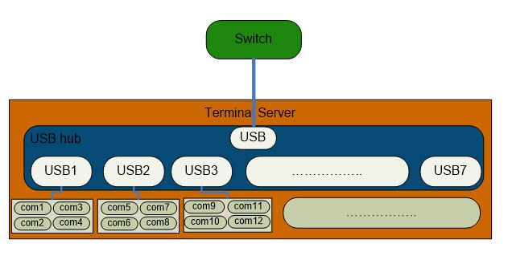
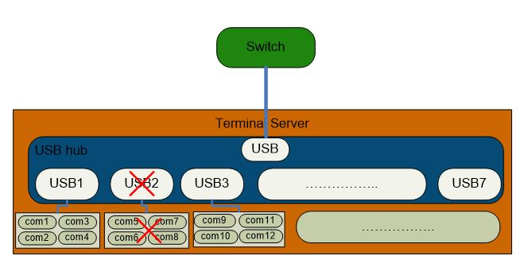
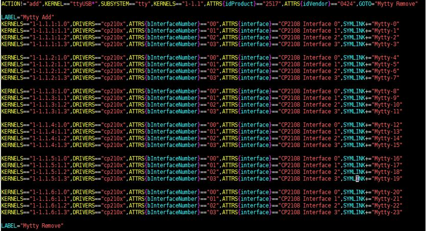
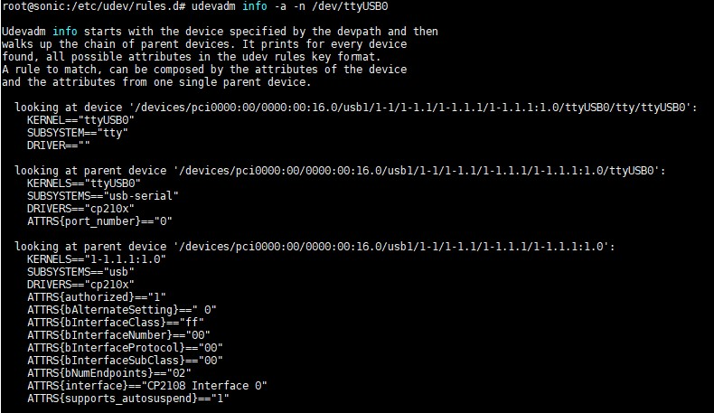
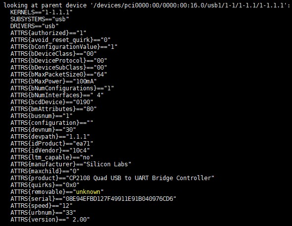
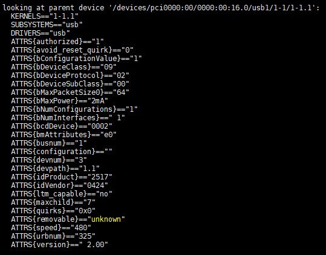
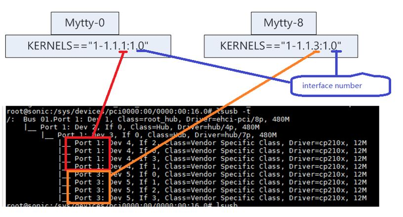

# 1. udev rules design for terminal server

# 2. High Level Design Document

## 2.1. Revision

| Rev  |    Date    |                Author                 | Change Description |
| :--: | :--------: | :-----------------------------------: | ------------------ |
| 0.1  | 07/24/2020 |  Sandy Li     | Initial version    |


## 2.2. About this Manual

This document provides the high-level design for how to set customized ports name for ttyUSB devices

## 2.3. udev rules
udev allows for rules that specify what name is given to a device. udev allows you to identify devices based on their properties, like vendor ID and device ID, dynamically. Rules consist of "matches" and "actions". There are many matches keys like “ACTION”  ”KERNEL”  “SUBSYSTEM”  “DRIVER” and some” ATTRS”.
        ACTION=="add",KERNELS=="1-1.1.3",ATTRS{devpath}=="1.1.3",ATTRS{idProduct}=="2303",ATTRS{idVendor}=="067b",SYMLINK+="myttypl2303"

Here all the "==" items are matches keys. SYMLINK is action.


The figure below depicts an example of a switch connect to a terminal server. In this topology there are several serial ports. 



without udev rules the ports would be ttyUSB0,ttyUSB1......ttyUSBn.If all ports are work well ttyUSB0 ~ ttyUSBn map to com1 ~ com(n+1).

If some ports been broken like the following figure




Then ports would be ttyUSB0 ~ ttyUSB(n-4).From the ports name you never know which ports are the damaged ports.udev rules can help to solve this problem

## 2.4 rules design principle
For a terminal sever device following info are known:
1.usb hub chip type
2.usb to uart chip type
3.front panel ports sequence map with the usb to uart chip interface number.

So matches items could be vendor id,device id,usb hub ports number,usb to uart chip interface id.These items fixed then front ports sequence be fixed.Then  you can make names for each ports. 
## 2.5 example
Here is a terminal server with 8 ports are available.It's topologyas figure XXXXXX.the usb hub port 2 was damaged.We can get the device info by "lsusb" "lsusb -t","ls /dev/ttyUSB*".Details as below:

```
root@sonic:~# lsusb
Bus 001 Device 022: ID 10c4:ea71 Cygnal Integrated Products, Inc.
Bus 001 Device 021: ID 10c4:ea71 Cygnal Integrated Products, Inc.
Bus 001 Device 009: ID 0424:2517 Standard Microsystems Corp. Hub
Bus 001 Device 002: ID 8087:07db Intel Corp.
Bus 001 Device 001: ID 1d6b:0002 Linux Foundation 2.0 root hub
root@sonic:~# lsusb -t
/:  Bus 01.Port 1: Dev 1, Class=root_hub, Driver=ehci-pci/8p, 480M
    |__ Port 1: Dev 2, If 0, Class=Hub, Driver=hub/4p, 480M
        |__ Port 1: Dev 9, If 0, Class=Hub, Driver=hub/7p, 480M
            |__ Port 1: Dev 21, If 2, Class=Vendor Specific Class, Driver=cp210x, 12M
            |__ Port 1: Dev 21, If 0, Class=Vendor Specific Class, Driver=cp210x, 12M
            |__ Port 1: Dev 21, If 3, Class=Vendor Specific Class, Driver=cp210x, 12M
            |__ Port 1: Dev 21, If 1, Class=Vendor Specific Class, Driver=cp210x, 12M
            |__ Port 3: Dev 22, If 0, Class=Vendor Specific Class, Driver=cp210x, 12M
            |__ Port 3: Dev 22, If 1, Class=Vendor Specific Class, Driver=cp210x, 12M
            |__ Port 3: Dev 22, If 2, Class=Vendor Specific Class, Driver=cp210x, 12M
            |__ Port 3: Dev 22, If 3, Class=Vendor Specific Class, Driver=cp210x, 12M
root@sonic:~# ls /dev/ttyUSB* -l
crw-rw---- 1 root dialout 188, 0 Jul 28 12:17 /dev/ttyUSB0
crw-rw---- 1 root dialout 188, 1 Jul 28 12:17 /dev/ttyUSB1
crw-rw---- 1 root dialout 188, 2 Jul 28 12:17 /dev/ttyUSB2
crw-rw---- 1 root dialout 188, 3 Jul 28 12:17 /dev/ttyUSB3
crw-rw---- 1 root dialout 188, 4 Jul 28 12:17 /dev/ttyUSB4
crw-rw---- 1 root dialout 188, 5 Jul 28 12:17 /dev/ttyUSB5
crw-rw---- 1 root dialout 188, 6 Jul 28 12:17 /dev/ttyUSB6
crw-rw---- 1 root dialout 188, 7 Jul 28 12:17 /dev/ttyUSB7
```

From the info there are 8 ttyUSB ports. But ttyUSB0 would not mean the front panel port 1,ttyUSB7 would not the front panel port 8.Usually we access to one port by the front panel port sequence. If this sequence are not the same it would be inconvenient for users to access one port.According to 2.4 make a udev rules.Map the ports as the front panel sequence.Rules as below:


### 2.5.1 get the udev info
udevadm command could help to get port's udev info.e.g get ttyUSB0 udev info
udevadm info -a -n /dev/ttyUSB0




### 2.5.2 rules analyze
From the udevadm info we can get the info of its parents level till the root.
Top level:     root hub
Second level:  usb hub , vendor id = 0x2517,product id= 0424
Third level:   usb to uart chip(cp210x), vendor id = ea71, product id =10c4
bottom level:  ttyUSB ports  
Follow as hardware design 
the front panel port 1 connect to the usb2517 port 1, chip cp210x interface 0
the front panel port 2 connect to the usb2517 port 1, chip cp210x interface 1
the front panel port 3 connect to the usb2517 port 1, chip cp210x interface 2
the front panel port 4 connect to the usb2517 port 1, chip cp210x interface 3
the front panel port 5 connect to the usb2517 port 2, chip cp210x interface 0
the front panel port 6 connect to the usb2517 port 2, chip cp210x interface 1
the front panel port 7 connect to the usb2517 port 2, chip cp210x interface 2
the front panel port 8 connect to the usb2517 port 2, chip cp210x interface 3
the front panel port 9 connect to the usb2517 port 3, chip cp210x interface 0
the front panel port 10 connect to the usb2517 port 3, chip cp210x interface 1
the front panel port 11 connect to the usb2517 port 3, chip cp210x interface 2
the front panel port 12 connect to the usb2517 port 3, chip cp210x interface 3
.....

If we want to set the port name as Mytty-X.Then rules as below:

```
KERNELS=="1-1.1.1:1.0",DRIVERS=="cp210x",ATTRS{bInterfaceNumber}=="00",ATTRS{interface}=="CP2108 Interface 0",SYMLINK+="Mytty-1"
KERNELS=="1-1.1.1:1.1",DRIVERS=="cp210x",ATTRS{bInterfaceNumber}=="01",ATTRS{interface}=="CP2108 Interface 1",SYMLINK+="Mytty-2"
KERNELS=="1-1.1.1:1.2",DRIVERS=="cp210x",ATTRS{bInterfaceNumber}=="02",ATTRS{interface}=="CP2108 Interface 2",SYMLINK+="Mytty-3"
KERNELS=="1-1.1.1:1.3",DRIVERS=="cp210x",ATTRS{bInterfaceNumber}=="03",ATTRS{interface}=="CP2108 Interface 3",SYMLINK+="Mytty-4"

KERNELS=="1-1.1.2:1.0",DRIVERS=="cp210x",ATTRS{bInterfaceNumber}=="00",ATTRS{interface}=="CP2108 Interface 0",SYMLINK+="Mytty-5"
KERNELS=="1-1.1.2:1.1",DRIVERS=="cp210x",ATTRS{bInterfaceNumber}=="01",ATTRS{interface}=="CP2108 Interface 1",SYMLINK+="Mytty-6"
KERNELS=="1-1.1.2:1.2",DRIVERS=="cp210x",ATTRS{bInterfaceNumber}=="02",ATTRS{interface}=="CP2108 Interface 2",SYMLINK+="Mytty-7"
KERNELS=="1-1.1.2:1.3",DRIVERS=="cp210x",ATTRS{bInterfaceNumber}=="03",ATTRS{interface}=="CP2108 Interface 3",SYMLINK+="Mytty-8"

KERNELS=="1-1.1.3:1.0",DRIVERS=="cp210x",ATTRS{bInterfaceNumber}=="00",ATTRS{interface}=="CP2108 Interface 0",SYMLINK+="Mytty-9"
KERNELS=="1-1.1.3:1.1",DRIVERS=="cp210x",ATTRS{bInterfaceNumber}=="01",ATTRS{interface}=="CP2108 Interface 1",SYMLINK+="Mytty-10"
KERNELS=="1-1.1.3:1.2",DRIVERS=="cp210x",ATTRS{bInterfaceNumber}=="02",ATTRS{interface}=="CP2108 Interface 2",SYMLINK+="Mytty-11"
KERNELS=="1-1.1.3:1.3",DRIVERS=="cp210x",ATTRS{bInterfaceNumber}=="03",ATTRS{interface}=="CP2108 Interface 3",SYMLINK+="Mytty-12"

KERNELS=="1-1.1.4:1.0",DRIVERS=="cp210x",ATTRS{bInterfaceNumber}=="00",ATTRS{interface}=="CP2108 Interface 0",SYMLINK+="Mytty-13"
KERNELS=="1-1.1.4:1.1",DRIVERS=="cp210x",ATTRS{bInterfaceNumber}=="01",ATTRS{interface}=="CP2108 Interface 1",SYMLINK+="Mytty-14"
KERNELS=="1-1.1.4:1.2",DRIVERS=="cp210x",ATTRS{bInterfaceNumber}=="02",ATTRS{interface}=="CP2108 Interface 2",SYMLINK+="Mytty-15"
KERNELS=="1-1.1.4:1.3",DRIVERS=="cp210x",ATTRS{bInterfaceNumber}=="03",ATTRS{interface}=="CP2108 Interface 3",SYMLINK+="Mytty-16"
```




Force this rule to efficiently then:

```
root@sonic:~# ls /dev/Mytty* -l
lrwxrwxrwx 1 root root 7 Jul 28 12:17 /dev/Mytty-1 -> ttyUSB0
lrwxrwxrwx 1 root root 7 Jul 28 12:17 /dev/Mytty-10 -> ttyUSB5
lrwxrwxrwx 1 root root 7 Jul 28 12:17 /dev/Mytty-11 -> ttyUSB6
lrwxrwxrwx 1 root root 7 Jul 28 12:17 /dev/Mytty-12 -> ttyUSB7
lrwxrwxrwx 1 root root 7 Jul 28 12:17 /dev/Mytty-2 -> ttyUSB1
lrwxrwxrwx 1 root root 7 Jul 28 12:17 /dev/Mytty-3 -> ttyUSB2
lrwxrwxrwx 1 root root 7 Jul 28 12:17 /dev/Mytty-4 -> ttyUSB3
lrwxrwxrwx 1 root root 7 Jul 28 12:17 /dev/Mytty-9 -> ttyUSB4
root@sonic:~#
```


 