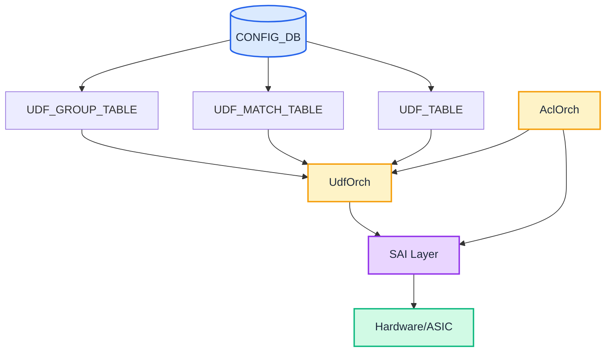
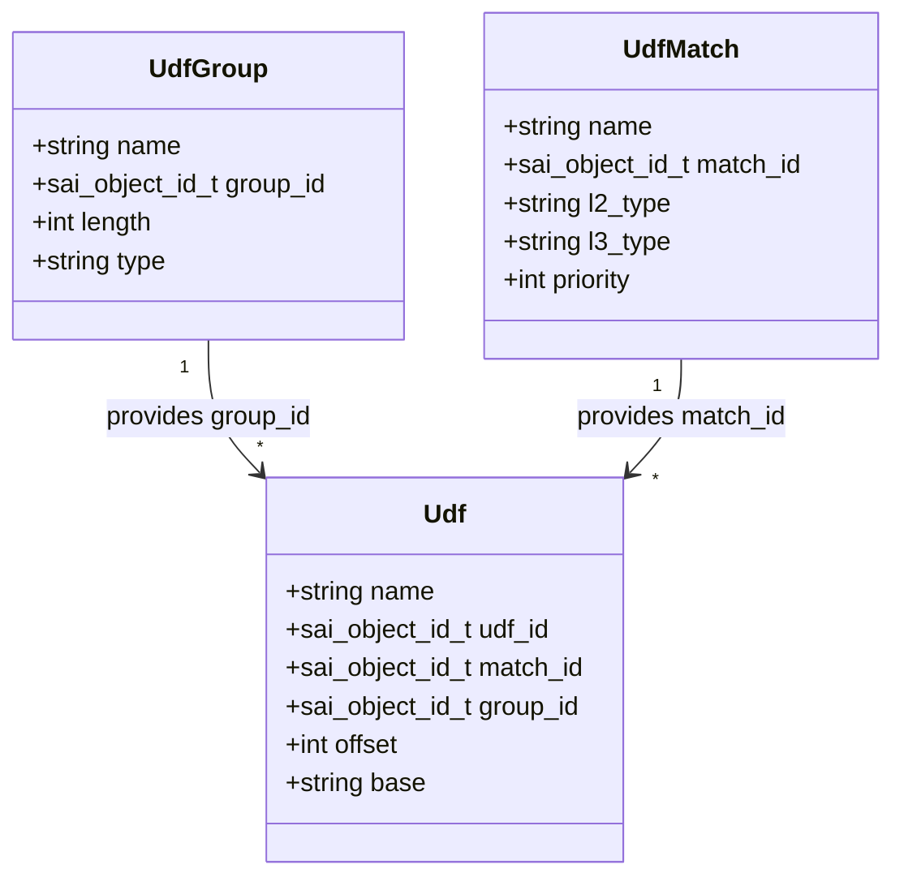
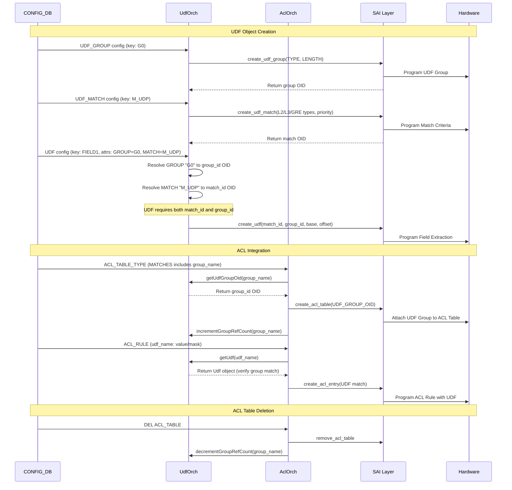

# User Defined Field (UDF) Feature in SONiC

## Table of Content

- [1. Revision](#1-revision)
- [2. Scope](#2-scope)
- [3. Definitions/Abbreviations](#3-definitionsabbreviations)
  - [3.1 Quick Reference](#31-quick-reference)
- [4. Core Concepts and Mental Model](#4-core-concepts-and-mental-model)
  - [4.1 What is UDF?](#41-what-is-udf)
  - [4.2 The Three UDF Objects - Mental Model](#42-the-three-udf-objects---mental-model)
  - [4.3 Packet Parsing Flow - Complete Example](#43-packet-parsing-flow---complete-example)
  - [4.4 Design Patterns and ACL Key Mapping](#44-design-patterns-and-acl-key-mapping)
  - [4.5 Group Index Mapping to ACL Key](#45-group-index-mapping-to-acl-key)
  - [4.6 Summary - When to Use Each Pattern](#46-summary---when-to-use-each-pattern)
  - [4.7 Common Pattern Examples](#47-common-pattern-examples)
- [5. Requirements](#5-requirements)
- [6. Architecture Design](#6-architecture-design)
- [7. High-Level Design](#7-high-level-design)
- [8. SAI API](#8-sai-api)
- [9. Configuration and Management](#9-configuration-and-management)
- [10. Restrictions/Limitations](#10-restrictionslimitations)
  - [10.1 Configuration Limits](#101-configuration-limits)
  - [10.2 Validation Requirements](#102-validation-requirements)
  - [10.2.1 Visual: One UDF Per Group Per Rule](#1021-visual-one-udf-per-group-per-rule)
  - [10.3 Semantic Consistency Requirement](#103-semantic-consistency-requirement)
- [11. Testing Requirements/Design](#11-testing-requirementsdesign)
  - [11.1 Unit Tests](#111-unit-tests)
  - [11.2 System Tests](#112-system-tests)
  - [11.3 Negative Tests](#113-negative-tests)

## 1. Revision

| Revision | Date       | Author        | Description          |
|----------|------------|---------------|----------------------|
| 0.1      | 2026-03-12 | Satishkumar Rodd   | Initial version      |

## 2. Scope

This document describes the high-level design for User Defined Field (UDF) feature in SONiC. The UDF feature enables custom packet field extraction for advanced packet processing capabilities, with integration into ACL (Access Control List) tables and rules for flexible packet matching and filtering.

## 3. Definitions/Abbreviations

| Term    | Description                                      |
|---------|--------------------------------------------------|
| UDF     | User Defined Field                               |
| SAI     | Switch Abstraction Interface                     |
| SWSS    | Switch State Service                             |
| ACL     | Access Control List                              |
| BTH     | Base Transport Header (InfiniBand/RoCE)          |
| RoCE    | RDMA over Converged Ethernet                     |
| GRE     | Generic Routing Encapsulation                    |
| OID     | Object Identifier                                |

### 3.1 Quick Reference

### Object Schema Summary

| Object | Key | Attributes | Example |
|--------|-----|------------|---------|
| **UDF_GROUP** | `group_name` | TYPE (GENERIC/HASH)<br/>LENGTH (1-20 bytes) | `G0: {TYPE: "GENERIC", LENGTH: "2"}` |
| **UDF_MATCH** | `match_name` | L3_TYPE, L3_TYPE_MASK<br/>PRIORITY (0-255) | `M_UDP: {L3_TYPE: "0x11", L3_TYPE_MASK: "0xFF", PRIORITY: "10"}` |
| **UDF** | `udf_name` | GROUP (group name)<br/>MATCH (match name)<br/>BASE (L2/L3/L4)<br/>OFFSET (0-255) | `FIELD1: {GROUP: "G0", MATCH: "M_UDP", BASE: "L4", OFFSET: "0"}` |
| **ACL_TABLE_TYPE** | `type_name` | MATCHES (includes GROUP names) | `T1: {MATCHES: ["IN_PORTS", "G0"], ...}` |
| **ACL_RULE** | `table\|rule` | UDF_NAME: "value/mask" | `TABLE1\|R1: {FIELD1: "0x1234/0xffff", ...}` |

### Configuration Order (Critical!)

```
1. UDF_GROUP (independent)
2. UDF_MATCH (independent)
3. UDF (requires both GROUP and MATCH)
4. ACL_TABLE_TYPE (references GROUP names)
5. ACL_TABLE (uses table type)
6. ACL_RULE (references UDF names)

Deletion: Reverse order
```

### Mental Model (One-Liner)

- **GROUP** = WHERE in ACL key (field position/index)
- **MATCH** = WHEN to extract (packet type/context)
- **UDF** = HOW to extract (base + offset)
- **ACL** = WHAT to match (data/mask + action)

### Key Constraints

| Constraint | Rule |
|------------|------|
| **Schema** | UDF_GROUP and UDF_MATCH are independent; UDF requires BOTH |
| **ACL Table** | ACL_TABLE_TYPE MATCHES references GROUP names (not UDF names) |
| **ACL Rule** | ACL_RULE references UDF names (not GROUP names) |
| **One UDF per group per rule** | Single rule can only use ONE UDF from a given GROUP |
| **Semantic consistency** | All UDFs in same GROUP must extract same semantic field |

## 4. Core Concepts and Mental Model

### 4.1 What is UDF?

UDF (User Defined Field) enables extraction of custom packet fields for ACL matching and hashing. Key capabilities:

- Extract fields from any packet offset (L2/L3/L4 base)
- Match packets by L2 EtherType, L3 Protocol, or GRE Type
- Use extracted fields in ACL rules
- Support ECMP/LAG hashing on custom fields
- Enable custom protocol processing (e.g., InfiniBand/RoCE)

### 4.2 The Three UDF Objects - Mental Model

```
┌──────────────────────────────────────────────────────────────┐
│                     ONE-LINE MENTAL MODEL                     │
├──────────────────────────────────────────────────────────────┤
│  GROUP defines WHERE in ACL key  (field position/index)      │
│  MATCH defines WHEN to extract   (packet type/context)       │
│  UDF defines HOW to extract      (base + offset)             │
│  ACL defines WHAT to match       (data/mask + action)        │
└──────────────────────────────────────────────────────────────┘
```

#### UDF Group
- Represents **one field** in the ACL key
- Has a **fixed length** (1-20 bytes)
- Maps to a **group index** in the ACL table (0-255)
- Group index = **position of field** in the ACL key
- **Think**: "WHERE in the ACL key does this field go?"

**Critical Design Rule: Semantic Consistency** - All UDFs in a group must extract the **same logical field** across different packet types. See [Section 12.3](#123-semantic-consistency-requirement) for detailed explanation and examples.

#### UDF Match
- Defines **packet type/context** (L2/L3/L4 conditions)
- Used to decide **which UDF applies** for a given packet
- Multiple matches allow different extraction for different packet types
- **Think**: "WHEN should extraction happen?"

#### UDF
- Defines **how to extract bytes** from the packet
- Combines: Group ID, Match ID, Base (L2/L3/L4), Offset
- Multiple UDFs can belong to the same group (different packet types)
- All UDFs in the same group **must extract the same semantic field**
- **Think**: "HOW to extract the bytes?"

**Key Point**: UDF_GROUP and UDF_MATCH are **independent** objects. UDF requires **BOTH**.

### 4.3 Packet Parsing Flow - Complete Example

**Scenario**: Extract BTH opcode (byte 8 of RoCE header) from UDP packets

```
PACKET STRUCTURE:
┌───────────┬───────────┬───────────┬───────────────────────────┐
│ Ethernet  │    IP     │    UDP    │ RoCE (BTH Header)         │
│ 14 bytes  │ 20 bytes  │  8 bytes  │ ...opcode(offset 8)...    │
└───────────┴───────────┴───────────┴───────────────────────────┘
     L2          L3          L4         L4+0  ....  L4+8

CONFIGURATION:
┌──────────────────────────────────────────────────────────────┐
│ UDF_GROUP:                                                    │
│   ROCE_GROUP: {TYPE: "GENERIC", LENGTH: "1"}                 │
│                                                               │
│ UDF_MATCH:                                                    │
│   M_IPV4_UDP: {L3_TYPE: "0x11", PRIORITY: "10"}              │
│                                                               │
│ UDF:                                                          │
│   BTH_OPCODE: {GROUP: "ROCE_GROUP", MATCH: "M_IPV4_UDP",     │
│                BASE: "L4", OFFSET: "8"}                       │
└──────────────────────────────────────────────────────────────┘

RUNTIME PACKET PROCESSING:
┌─────────────────────────────────────────────────────────────┐
│                                                              │
│  1. Packet Arrives (IPv4 + UDP + RoCE)                      │
│     │                                                        │
│     ▼                                                        │
│  2. Hardware Parser Identifies:                             │
│     • L2 Type: 0x0800 (IPv4)                                │
│     • L3 Type: 0x11 (UDP)                                   │
│     │                                                        │
│     ▼                                                        │
│  3. ACL Table References:                                   │
│     • UDF Group Index 0 → ROCE_GROUP                        │
│     │                                                        │
│     ▼                                                        │
│  4. UDF Match Selection:                                    │
│     • Check all UDFs in ROCE_GROUP                          │
│     • IPV4_UDP matches (L2=0x0800, L3=0x11) ✓               │
│     • Select UDF: BTH_OPCODE                                │
│     │                                                        │
│     ▼                                                        │
│  5. Field Extraction:                                       │
│     • BASE: L4 (start of UDP header)                        │
│     • OFFSET: 8 bytes from L4                               │
│     • LENGTH: 1 byte                                        │
│     • Extract: packet[L4+8] = 0x64                          │
│     │                                                        │
│     ▼                                                        │
│  6. Populate ACL Key:                                       │
│     • ACL_Key[UDF_Field_0] ← 0x64                           │
│     │                                                        │
│     ▼                                                        │
│  7. ACL Entry Comparison:                                   │
│     • Rule: UDF_Field_0 = 0x64/0xFF → DROP                  │
│     • Match! → Action: DROP packet                          │
│                                                              │
└─────────────────────────────────────────────────────────────┘
```

### 4.4 Design Patterns and ACL Key Mapping

UDF Groups map to ACL key positions. The following table shows how different UDF configurations result in different ACL key layouts:

```
ACL Key Structure:
  qset = {SrcIp, DstIp, InPorts, ..., B2Chunk1, B2Chunk2, B2Chunk3, ...}
         └─────────────────────────┘  └───────────────────────────────┘
          Standard ACL Fields               UDF Fields (2-byte chunks)

┌──────────────────────────────────────────────────────────────────────────────┐
│ Pattern 1: Single Group, Multiple UDFs (Same field, different packet types) │
├──────────────────────────────────────────────────────────────────────────────┤
│ G1(Length=2)  U1  M1  → IPv4 UDP dest port                                   │
│ G1(Length=2)  U2  M2  → IPv6 UDP dest port                                   │
│                                                                               │
│ ACL Key: qset = { B2Chunk1 }                                                 │
│          Only ONE field, runtime selects U1 or U2 based on match             │
└──────────────────────────────────────────────────────────────────────────────┘

┌──────────────────────────────────────────────────────────────────────────────┐
│ Pattern 2: Multiple Groups, Different Matches (Different fields, different   │
│            packet types)                                                      │
├──────────────────────────────────────────────────────────────────────────────┤
│ G1(Length=2)  U1  M1  → IPv4 UDP dest port                                   │
│ G2(Length=2)  U2  M2  → IPv6 TCP src port                                    │
│                                                                               │
│ ACL Key Layout:                                                              │
│   B2Chunk1  B2Chunk2                                                         │
│   G1        G2                                                               │
│   ↓         ↓                                                                │
│   UDF[0]    UDF[1]                                                           │
│                                                                               │
│ Runtime: Only matching UDF executes (M1 OR M2), other field = 0             │
└──────────────────────────────────────────────────────────────────────────────┘

┌──────────────────────────────────────────────────────────────────────────────┐
│ Pattern 3: Multiple Groups, Different Lengths (Complex multi-field)          │
├──────────────────────────────────────────────────────────────────────────────┤
│ G1(Length=3)  U1  M1  → RoCE BTH opcode (3 bytes)                            │
│ G2(Length=2)  U2  M2  → GRE key (2 bytes)                                    │
│                                                                               │
│ ACL Key Layout (byte chunks):                                                │
│   B2Chunk1  B2Chunk2  | B2Chunk3                                             │
│   G1                  | G2                                                   │
│   ↓                   | ↓                                                    │
│   UDF[0] (3 bytes)    | UDF[1] (2 bytes)                                     │
│                                                                               │
│ Note: G1 spans 2 chunks (3 bytes), G2 uses 1 chunk (2 bytes)                │
└──────────────────────────────────────────────────────────────────────────────┘
```

**Key Principles**:
1. **One Group = One ACL Field Position**: Each group maps to a specific index in the ACL key
2. **Multiple UDFs per Group**: Only ONE executes per packet (based on UDF_MATCH)
3. **Field Length**: Groups can span multiple 2-byte chunks (1-20 bytes total)
4. **Runtime Selection**: UDF_MATCH determines which UDF extracts data for each packet
   - Selection is priority-based: highest priority matching UDF wins
   - If no UDF matches, the group field returns 0 (no match)
5. **Semantic Consistency**: All UDFs in the same group must extract the same logical field

#### Example: Multi-Protocol RoCE + GRE Extraction

Complete configuration showing Pattern 3 in practice:

```
UDF_GROUP:
  ROCE_OPCODE_GROUP: {TYPE: "GENERIC", LENGTH: "1"}
  GRE_KEY_GROUP: {TYPE: "GENERIC", LENGTH: "4"}

UDF_MATCH:
  M_IPV4_ROCE: {L2_TYPE: "0x0800", L3_TYPE: "0x11", PRIORITY: "10"}
  M_IPV6_ROCE: {L2_TYPE: "0x86DD", L3_TYPE: "0x11", PRIORITY: "10"}
  M_IPV4_GRE: {L2_TYPE: "0x0800", GRE_TYPE: "0x6558", PRIORITY: "10"}
  M_IPV6_GRE: {L2_TYPE: "0x86DD", GRE_TYPE: "0x6558", PRIORITY: "10"}

UDF:
  BTH_OPCODE_V4: {GROUP: "ROCE_OPCODE_GROUP", MATCH: "M_IPV4_ROCE", BASE: "L4", OFFSET: "8"}
  BTH_OPCODE_V6: {GROUP: "ROCE_OPCODE_GROUP", MATCH: "M_IPV6_ROCE", BASE: "L4", OFFSET: "8"}
  GRE_KEY_V4: {GROUP: "GRE_KEY_GROUP", MATCH: "M_IPV4_GRE", BASE: "L3", OFFSET: "28"}
  GRE_KEY_V6: {GROUP: "GRE_KEY_GROUP", MATCH: "M_IPV6_GRE", BASE: "L3", OFFSET: "48"}

Runtime Behavior:
  IPv4 RoCE → M_IPV4_ROCE → BTH_OPCODE_V4 → UDF[0] = opcode, UDF[1] = 0
  IPv6 RoCE → M_IPV6_ROCE → BTH_OPCODE_V6 → UDF[0] = opcode, UDF[1] = 0
  IPv4 GRE  → M_IPV4_GRE  → GRE_KEY_V4    → UDF[0] = 0, UDF[1] = key
  IPv6 GRE  → M_IPV6_GRE  → GRE_KEY_V6    → UDF[0] = 0, UDF[1] = key
```

### 4.5 Group Index Mapping to ACL Key

```
SAI ACL TABLE CREATION:
  SAI_ACL_TABLE_ATTR_USER_DEFINED_FIELD_GROUP_MIN + 0  →  ROCE_OPCODE_GROUP
  SAI_ACL_TABLE_ATTR_USER_DEFINED_FIELD_GROUP_MIN + 1  →  GRE_KEY_GROUP
  SAI_ACL_TABLE_ATTR_USER_DEFINED_FIELD_GROUP_MIN + 2  →  UDP_DPORT_GROUP

RESULTING ACL KEY:
┌──────────────────┬──────────┬──────────┬──────────┬─────────┐
│ Standard Fields  │  UDF[0]  │  UDF[1]  │  UDF[2]  │   ...   │
│ (SIP, DIP, etc)  │  ROCE    │   GRE    │   UDP    │         │
│                  │ 1 byte   │ 4 bytes  │ 2 bytes  │         │
└──────────────────┴──────────┴──────────┴──────────┴─────────┘
                      ↑          ↑          ↑
                   Index 0    Index 1    Index 2

SAI ACL ENTRY MATCHING:
  SAI_ACL_ENTRY_ATTR_USER_DEFINED_FIELD_GROUP_MIN + 0  →  data/mask for ROCE
  SAI_ACL_ENTRY_ATTR_USER_DEFINED_FIELD_GROUP_MIN + 1  →  data/mask for GRE
  SAI_ACL_ENTRY_ATTR_USER_DEFINED_FIELD_GROUP_MIN + 2  →  data/mask for UDP
```

**Key Insight**: The index must match between table declaration and entry matching!

### 4.6 Summary - When to Use Each Pattern

| Pattern | Groups | Matches | UDFs | Use Case | Example |
|---------|--------|---------|------|----------|---------|
| **1** | 1 | Multiple | Multiple | Same field, different packet types | UDP port from IPv4 and IPv6 |
| **2** | Multiple | 1 | Multiple | Multiple fields, same packet type | Src+Dst port from IPv4 UDP |
| **3** | Multiple | Multiple | Multiple | Multiple fields, multiple packet types | RoCE opcode + GRE key extraction |

### 4.7 Common Pattern Examples

#### Pattern 1: Single Field, Multi-Protocol (RECOMMENDED for IPv4/IPv6)

**Use when**: Extracting the same logical field from different IP versions

```json
{
  "UDF_GROUP": {
    "UDP_DPORT": {"TYPE": "GENERIC", "LENGTH": "2"}
  },
  "UDF_MATCH": {
    "M_IPV4_UDP": {"L2_TYPE": "0x0800", "L3_TYPE": "0x11", "PRIORITY": "10"},
    "M_IPV6_UDP": {"L2_TYPE": "0x86DD", "L3_TYPE": "0x11", "PRIORITY": "10"}
  },
  "UDF": {
    "DPORT_V4": {"GROUP": "UDP_DPORT", "MATCH": "M_IPV4_UDP", "BASE": "L4", "OFFSET": "2"},
    "DPORT_V6": {"GROUP": "UDP_DPORT", "MATCH": "M_IPV6_UDP", "BASE": "L4", "OFFSET": "2"}
  },
  "ACL_TABLE_TYPE": {
    "T1": {"MATCHES": ["IN_PORTS", "UDP_DPORT"], "ACTIONS": ["PACKET_ACTION"], "BIND_POINTS": ["PORT"]}
  },
  "ACL_RULE": {
    "TABLE1|BLOCK_DNS": {"DPORT_V4": "0x0035/0xffff", "PACKET_ACTION": "DROP"}
  }
}
```

**Key benefit**: Same rule works for both IPv4 and IPv6 (runtime selects correct UDF)

#### Pattern 2: Multiple Fields, Single Protocol

**Use when**: Extracting multiple different fields from the same packet type

```json
{
  "UDF_GROUP": {
    "TCP_SPORT": {"TYPE": "GENERIC", "LENGTH": "2"},
    "TCP_DPORT": {"TYPE": "GENERIC", "LENGTH": "2"}
  },
  "UDF_MATCH": {
    "M_TCP": {"L3_TYPE": "0x06", "PRIORITY": "10"}
  },
  "UDF": {
    "SRC_PORT": {"GROUP": "TCP_SPORT", "MATCH": "M_TCP", "BASE": "L4", "OFFSET": "0"},
    "DST_PORT": {"GROUP": "TCP_DPORT", "MATCH": "M_TCP", "BASE": "L4", "OFFSET": "2"}
  },
  "ACL_TABLE_TYPE": {
    "T1": {"MATCHES": ["TCP_SPORT", "TCP_DPORT"], "ACTIONS": ["PACKET_ACTION"], "BIND_POINTS": ["PORT"]}
  },
  "ACL_RULE": {
    "TABLE1|BLOCK_RANGE": {
      "SRC_PORT": "0x0400/0xff00",
      "DST_PORT": "0x1f90/0xffff",
      "PACKET_ACTION": "DROP"
    }
  }
}
```

**Key benefit**: Match on combinations of multiple custom fields

#### Pattern 3: RoCE/InfiniBand Custom Field Extraction

**Use when**: Extracting fields from custom protocols like RoCE

```json
{
  "UDF_GROUP": {
    "BTH_OPCODE": {"TYPE": "GENERIC", "LENGTH": "1"}
  },
  "UDF_MATCH": {
    "M_ROCE": {"L2_TYPE": "0x8915", "PRIORITY": "100"}
  },
  "UDF": {
    "IB_OPCODE": {"GROUP": "BTH_OPCODE", "MATCH": "M_ROCE", "BASE": "L2", "OFFSET": "18"}
  },
  "ACL_TABLE_TYPE": {
    "ROCE_TABLE": {"MATCHES": ["BTH_OPCODE"], "ACTIONS": ["PACKET_ACTION"], "BIND_POINTS": ["PORT"]}
  },
  "ACL_RULE": {
    "ROCE_TABLE|BLOCK_SEND": {"IB_OPCODE": "0x00/0xff", "PACKET_ACTION": "DROP"}
  }
}
```

**Key benefit**: Enable custom protocol processing not supported by standard ACL

## 5. Requirements

### 5.1 Functional Requirements

| Requirement | Description |
|-------------|-------------|
| UDF Groups | GENERIC (ACL) and HASH (load balancing) types, 1-20 bytes |
| UDF Match | L2 EtherType, L3 Protocol, GRE Type matching with masks and priority |
| UDF Extraction | Configurable base (L2/L3/L4), offset (0-255), length (1-20 bytes) |
| Configuration | CONFIG_DB interface with YANG validation |
| ACL Integration | Dynamic UDF field resolution in ACL tables and rules |

## 6. Architecture Design

### 6.1 System Architecture



**Key Components:**
- **UdfOrch**: Manages UDF objects, provides UDF group OIDs to AclOrch
- **AclOrch**: Resolves UDF fields, attaches UDF groups to ACL tables
- **SAI UDF API**: Creates UDF groups, matches, and extraction objects
- **SAI ACL API**: Attaches UDF groups to ACL tables and applies UDF matching

### 6.2 UDF Object Model



| Object | Key Attributes | Purpose |
|--------|----------------|---------|
| **UDF Group** | Type (GENERIC/HASH), Length (1-20) | Groups UDFs for ACL or hashing |
| **UDF Match** | L2/L3/GRE Type+Mask, Priority | Defines when to extract fields (independent object) |
| **UDF** | Base (L2/L3/L4), Offset (0-255), **match_id, group_id** | Specifies field extraction, **requires both match_id and group_id** |

**Key Design**: UDF object requires both match_id (from UdfMatch) and group_id (from UdfGroup). UdfGroup and UdfMatch are independent of each other.

### 6.3 ACL Integration Dependency

```
UdfGroup (independent)          UdfMatch (independent)
    │                                │
    │                                │
    │                                └─→ Udf (requires both group_id and match_id)
    │
    ├─→ ACL Table Type (MATCHES field references GROUP name, e.g., "G0")
    │         │
    │         └─→ ACL Table (uses table type, attaches GROUP to ACL)
    │                   │
    │                   └─→ ACL Rule (references UDF name, e.g., "FIELD1")
    │                             │
    └─────────────────────────────┘ (Rule validates UDF belongs to declared GROUP)
```

**Key Flow**:
1. **ACL_TABLE_TYPE** declares which **GROUP** is available (e.g., "G0")
2. **ACL_RULE** references specific **UDF name** (e.g., "FIELD1")
3. **AclOrch** verifies the UDF belongs to the declared GROUP
4. Runtime selects which UDF executes based on packet match

### 6.4 Component Responsibilities

| Component | Location | Responsibilities |
|-----------|----------|------------------|
| **UdfOrch** | `udforch.cpp/h` | • Manages UDF objects<br/>• Resolves group names to OIDs via `getUdfGroupOid()`<br/>• Provides Udf objects to AclOrch via `getUdf()`<br/>• Tracks ACL table references to UDF groups via `incrementGroupRefCount()` / `decrementGroupRefCount()`<br/>• Blocks `removeUdfGroup()` when ACL ref count > 0 |
| **AclOrch** | `aclorch.cpp` | • Resolves GROUP names in ACL_TABLE_TYPE to group OIDs<br/>• Verifies UDF names in ACL_RULE belong to declared groups<br/>• Attaches UDF groups to ACL tables and calls `incrementGroupRefCount()`<br/>• Calls `decrementGroupRefCount()` when an ACL table is removed<br/>• Applies UDF matching in ACL rules |

**Key Classes**:

| Class | Key Methods | Responsibility |
|-------|-------------|----------------|
| **UdfOrch** | `doUdfGroupTask()`<br/>`doUdfMatchTask()`<br/>`doUdfTask()` (reads GROUP and MATCH attributes, resolves both OIDs)<br/>`getUdfGroupOid(name)`<br/>`getUdf(name)`<br/>`incrementGroupRefCount(name)`<br/>`decrementGroupRefCount(name)`<br/>`getGroupRefCount(name)` | Orchestrates UDF lifecycle, resolves OIDs, enforces ACL ref-count guard on deletion |
| **UdfGroup** | `create()`, `remove()`, `getOid()` | Manages SAI UDF group objects (independent) |
| **UdfMatch** | `create()`, `remove()`, `getOid()` | Manages SAI UDF match objects (independent) |
| **Udf** | `create()`, `remove()`<br/>`getConfig()` (returns group_id) | Manages SAI UDF, **requires both match_id and group_id** |

**YANG Model Validation** (`sonic-udf.yang`):
- Schema validation for UDF configuration before writing to CONFIG_DB
- Enforces data type constraints (e.g., LENGTH: 1-20, OFFSET: 0-255)
- Validates mandatory fields and relationships between UDF objects

### 6.5 Configuration and Data Flow



**Key Steps:**
1. CONFIG_DB → UdfOrch → SAI → ASIC (UDF objects)
2. CONFIG_DB → AclOrch → Query UdfOrch → SAI → ASIC (ACL with UDF)
3. AclOrch tracks UDF group references via `incrementGroupRefCount` / `decrementGroupRefCount` so UdfOrch can safely reject premature group deletions

## 7. High-Level Design

### 7.1 Implementation Files

| File | Purpose |
|------|---------|
| `udforch.h/cpp` | UDF orchestrator implementation |
| `udf_constants.h` | Type mappings and constants |
| `orchdaemon.cpp` | Integration into orchagent |

### 7.2 Key Classes

| Class | Responsibility | SAI Object |
|-------|----------------|------------|
| `UdfGroup` | Manages UDF group (type, length) | `SAI_OBJECT_TYPE_UDF_GROUP` |
| `UdfMatch` | Manages match criteria (L2/L3/GRE) | `SAI_OBJECT_TYPE_UDF_MATCH` |
| `Udf` | Manages field extraction (base, offset) | `SAI_OBJECT_TYPE_UDF` |
| `UdfOrch` | Orchestrates all UDF objects | N/A |

### 7.3 Configuration Order

**Creation Order:**
1. UDF_GROUP (independent)
2. UDF_MATCH (independent)
3. UDF (depends on both UDF_GROUP and UDF_MATCH - requires both group_id and match_id)
4. ACL_TABLE_TYPE (references UDF_GROUP names in MATCHES)
5. ACL_TABLE (uses ACL_TABLE_TYPE)
6. ACL_RULE (references UDF names)

**Deletion Order:** Reverse of creation

**Key Dependency**: UDF requires both match_id (from UDF_MATCH) and group_id (from UDF_GROUP). UDF_GROUP and UDF_MATCH are independent and can be created in any order.

### 7.4 Orchestration Logic

**UdfOrch Processing Flow**:

1. **UDF_GROUP Task**:
   - Parse CONFIG_DB entry (simple key: `group_name`, e.g., "G0")
   - Validate TYPE (GENERIC/HASH) and LENGTH (1-20)
   - Call SAI to create UDF group
   - Store group_id OID in UdfGroup object

2. **UDF_MATCH Task**:
   - Parse CONFIG_DB entry (simple key: `match_name`, e.g., "M_UDP")
   - Validate match criteria (L2/L3/GRE TYPE and masks)
   - Validate PRIORITY (0-255)
   - Call SAI to create UDF match (independent object)
   - Store match_id OID in UdfMatch object

3. **UDF Task**:
   - Parse CONFIG_DB entry (simple key: `udf_name`, e.g., "FIELD1")
   - Read GROUP attribute and resolve to group_id OID via `getUdfGroupOid(group_name)`
   - Read MATCH attribute and resolve to match_id OID via `getUdfMatch(match_name)`
   - Validate BASE (L2/L3/L4) and OFFSET (0-255)
   - Call SAI to create UDF with **both match_id and group_id**
   - Store udf_id OID in Udf object

**AclOrch Integration**:
- **ACL Table Creation**: Query UdfOrch via `getUdfGroupOid(group_name)` to get group_id OID
- Attach group_id to ACL table via SAI (based on GROUP name in ACL_TABLE_TYPE MATCHES)
- Call `gUdfOrch->incrementGroupRefCount(group_name)` after successful ACL table creation
- **ACL Table Deletion**: Call `gUdfOrch->decrementGroupRefCount(group_name)` before or after SAI table removal
- **ACL Rule Creation**: Query UdfOrch via `getUdf(udf_name)` to verify UDF exists and belongs to declared group
- Apply UDF matching in ACL entry via SAI

**UDF Group Deletion Guard**:
- `removeUdfGroup()` checks `m_udfGroupRefCount[name] > 0` before calling SAI
- If any ACL table still references the group, deletion is rejected with an error log and returns `false` (triggering retry)
- This prevents SAI rejections and infinite retry loops that would occur if the deletion were attempted blindly

### 7.5 CONFIG_DB Schema

| Table | Key | Fields | Example |
|-------|-----|--------|---------|
| **UDF_GROUP** | `<group_name>` | TYPE (GENERIC/HASH)<br/>LENGTH (1-20) | Key: `G0`<br/>`TYPE="GENERIC"`<br/>`LENGTH="3"` |
| **UDF_MATCH** | `<match_name>` | L2_TYPE, L2_TYPE_MASK<br/>L3_TYPE, L3_TYPE_MASK<br/>GRE_TYPE, GRE_TYPE_MASK<br/>PRIORITY (0-255, default 90)<br/>**Mask defaulting**: if a TYPE field is set but its MASK is omitted, the mask defaults to exact-match (`0xFFFF` for 16-bit, `0xFF` for 8-bit). A mask of 0 would silently make the TYPE ineffective. | Key: `M_UDP`<br/>`L3_TYPE="0x11"`<br/>`L3_TYPE_MASK="0xFF"`<br/>`PRIORITY="10"` |
| **UDF** | `<udf_name>` | GROUP (group name)<br/>MATCH (match name)<br/>BASE (L2/L3/L4)<br/>OFFSET (0-255) | Key: `FIELD1`<br/>`GROUP="G0"`<br/>`MATCH="M_UDP"`<br/>`BASE="L4"`<br/>`OFFSET="0"` |
| **ACL_TABLE_TYPE** | `<type_name>` | MATCHES (includes GROUP names)<br/>ACTIONS<br/>BIND_POINTS | Key: `T1`<br/>`MATCHES=["IN_PORTS","G0"]`<br/>`ACTIONS=["PACKET_ACTION","COUNTER"]`<br/>`BIND_POINTS=["PORT"]` |
| **ACL_TABLE** | `<table_name>` | type<br/>ports<br/>stage | Key: `TABLE1`<br/>`type="T1"`<br/>`ports=["Ethernet0"]`<br/>`stage="INGRESS"` |
| **ACL_RULE** | `<table>\|<rule>` | PRIORITY<br/><udf_name>: "value/mask"<br/>PACKET_ACTION | Key: `TABLE1\|R1`<br/>`PRIORITY="101"`<br/>`FIELD1="0x33/0xff"`<br/>`PACKET_ACTION="DROP"` |

**Key Design Points:**
- **Simple keys**: UDF_GROUP, UDF_MATCH, and UDF all use simple keys (not composite)
- **UDF attributes**: UDF explicitly specifies both GROUP and MATCH attributes
- **Independence**: UDF_GROUP and UDF_MATCH are independent objects
- **UDF requires both OIDs**: UDF creation requires both match_id (from UdfMatch) and group_id (from UdfGroup)
- **GROUP name in ACL_TABLE_TYPE**: ACL_TABLE_TYPE MATCHES references the GROUP name (e.g., "G0")
- **UDF name in ACL_RULE**: ACL_RULE references the UDF name (e.g., "FIELD1") to specify which field to match
- **One UDF per group per rule**: A single ACL_RULE can only reference ONE UDF from a given GROUP (since GROUP produces one value per packet)
- **At least one match criteria required**: L2_TYPE, L3_TYPE, or GRE_TYPE must be specified in UDF_MATCH
- **UDF value/mask format**: Hexadecimal "0xVALUE/0xMASK" in ACL_RULE


### 7.6 ACL Integration

**AclOrch Resolution Flow:**
1. Parse ACL_TABLE_TYPE MATCHES → identify UDF GROUP names (e.g., "G0")
2. Query UdfOrch: `getUdfGroupOid(group_name)` → get group OID
3. Attach to ACL table: `SAI_ACL_TABLE_ATTR_USER_DEFINED_FIELD_GROUP_MIN + index` with group_id OID
4. Apply in ACL rule: `SAI_ACL_ENTRY_ATTR_USER_DEFINED_FIELD_GROUP_MIN + index` with byte array data/mask
5. Rule references UDF by UDF name (not group name) to specify which field to match

**Example: Multiple UDFs in Same Group with Different Packet Matches**
```json
CONFIG_DB:
  UDF_GROUP:
    G0: {TYPE: "GENERIC", LENGTH: "3"}
  UDF_MATCH:
    M_UDP: {L3_TYPE: "0x11", L3_TYPE_MASK: "0xFF", PRIORITY: "10"}
    M_TCP: {L3_TYPE: "0x06", L3_TYPE_MASK: "0xFF", PRIORITY: "10"}
  UDF:
    FIELD1: {GROUP: "G0", MATCH: "M_UDP", BASE: "L4", OFFSET: "0"}
    FIELD2: {GROUP: "G0", MATCH: "M_TCP", BASE: "L4", OFFSET: "0"}
  ACL_TABLE_TYPE:
    T1: {MATCHES: ["IN_PORTS", "G0"], ACTIONS: ["PACKET_ACTION", "COUNTER"], BIND_POINTS: ["PORT"]}
  ACL_TABLE:
    TABLE1: {type: "T1", ports: ["Ethernet0"], stage: "INGRESS"}
  ACL_RULE:
    TABLE1|R1: {PRIORITY: "101", FIELD1: "0x33/0xff", PACKET_ACTION: "DROP"}
    TABLE1|R2: {PRIORITY: "101", FIELD2: "0x34/0xff", PACKET_ACTION: "DROP"}
```

**Key Points**:
- UDF object explicitly specifies GROUP and MATCH attributes
- UDF_GROUP and UDF_MATCH are independent objects
- **ACL_TABLE_TYPE MATCHES references GROUP name**: `"G0"` (not UDF name)
- **ACL_RULE references UDF name**: `FIELD1` or `FIELD2` to specify which field to match
- **One UDF per group per rule**: Each rule can only reference ONE UDF from a given GROUP (R1 uses FIELD1, R2 uses FIELD2)
- Multiple UDFs can belong to the same group; runtime selects based on packet match

## 8. SAI API

### 8.1 UDF Group API

**API Function**: `sai_create_udf_group_fn`

**Attributes**:

| Attribute | Type | Flags | Description |
|-----------|------|-------|-------------|
| `SAI_UDF_GROUP_ATTR_TYPE` | `sai_udf_group_type_t` | CREATE_ONLY | Group type: `SAI_UDF_GROUP_TYPE_GENERIC` or `SAI_UDF_GROUP_TYPE_HASH` |
| `SAI_UDF_GROUP_ATTR_LENGTH` | `sai_uint16_t` | MANDATORY_ON_CREATE, CREATE_ONLY | Total extraction length in bytes (1-20, SONiC implementation constraint defined in `udf_constants.h`) |
| `SAI_UDF_GROUP_ATTR_UDF_LIST` | `sai_object_list_t` | READ_ONLY | List of UDF objects in this group |

**API Calls**:
- **Create**: `sai_udf_api->create_udf_group(&group_id, switch_id, attr_count, attr_list)`
- **Remove**: `sai_udf_api->remove_udf_group(group_id)`

### 8.2 UDF Match API

**API Function**: `sai_create_udf_match_fn`

**Attributes**:

| Attribute | Type | Flags | Description |
|-----------|------|-------|-------------|
| `SAI_UDF_MATCH_ATTR_L2_TYPE` | `sai_acl_field_data_t` (uint16) | CREATE_ONLY | EtherType value and mask (e.g., 0x0800 for IPv4) |
| `SAI_UDF_MATCH_ATTR_L3_TYPE` | `sai_acl_field_data_t` (uint8) | CREATE_ONLY | IP Protocol value and mask (e.g., 0x11 for UDP) |
| `SAI_UDF_MATCH_ATTR_GRE_TYPE` | `sai_acl_field_data_t` (uint16) | CREATE_ONLY | GRE Protocol Type value and mask |
| `SAI_UDF_MATCH_ATTR_PRIORITY` | `sai_uint8_t` | CREATE_ONLY | Match priority (0-255, higher value = higher priority, consistent with `SAI_ACL_ENTRY_ATTR_PRIORITY`) |

**API Calls**:
- **Create**: `sai_udf_api->create_udf_match(&match_id, switch_id, attr_count, attr_list)`
- **Remove**: `sai_udf_api->remove_udf_match(match_id)`

**Note**: At least one of L2_TYPE, L3_TYPE, or GRE_TYPE must be specified. Each type includes both data and mask fields.

### 8.3 UDF API

**API Function**: `sai_create_udf_fn`

**Attributes**:

| Attribute | Type | Flags | Description |
|-----------|------|-------|-------------|
| `SAI_UDF_ATTR_MATCH_ID` | `sai_object_id_t` | MANDATORY_ON_CREATE, CREATE_ONLY | Reference to UDF Match object |
| `SAI_UDF_ATTR_GROUP_ID` | `sai_object_id_t` | MANDATORY_ON_CREATE, CREATE_ONLY | Reference to UDF Group object |
| `SAI_UDF_ATTR_BASE` | `sai_udf_base_t` | CREATE_AND_SET | Extraction base: `SAI_UDF_BASE_L2`, `SAI_UDF_BASE_L3`, or `SAI_UDF_BASE_L4` |
| `SAI_UDF_ATTR_OFFSET` | `sai_uint16_t` | MANDATORY_ON_CREATE, CREATE_ONLY | Byte offset from base (0-255) |
| `SAI_UDF_ATTR_HASH_MASK` | `sai_u8_list_t` | CREATE_AND_SET | Hash mask (only for HASH type groups) |

**API Calls**:
- **Create**: `sai_udf_api->create_udf(&udf_id, switch_id, attr_count, attr_list)`
- **Remove**: `sai_udf_api->remove_udf(udf_id)`

### 8.4 ACL Integration API

**UDF Group Attachment to ACL Table**:

| Attribute | Type | Flags | Description |
|-----------|------|-------|-------------|
| `SAI_ACL_TABLE_ATTR_USER_DEFINED_FIELD_GROUP_MIN + index` | `sai_object_id_t` | CREATE_ONLY | Attach UDF group OID to ACL table at specified index (0-255) |

**Details**:
- The index value (0-255) is added to `SAI_ACL_TABLE_ATTR_USER_DEFINED_FIELD_GROUP_MIN`
- Each index corresponds to one UDF group
- The UDF group OID is passed as the attribute value
- Field length is derived from the UDF group's `SAI_UDF_GROUP_ATTR_LENGTH`

**API Call**: `sai_acl_api->create_acl_table(&table_id, switch_id, attr_count, attr_list)`

**UDF Matching in ACL Entry**:

| Attribute | Type | Flags | Description |
|-----------|------|-------|-------------|
| `SAI_ACL_ENTRY_ATTR_USER_DEFINED_FIELD_GROUP_MIN + index` | `sai_acl_field_data_t sai_u8_list_t` | CREATE_AND_SET | Match on extracted UDF field with data/mask byte arrays |

**Details**:
- The index must match the index used in the ACL table
- Data type is `sai_acl_field_data_t` containing `sai_u8_list_t` for both data and mask
- Byte array length must match the UDF group's `SAI_UDF_GROUP_ATTR_LENGTH`
- Both `data.list` and `mask.list` must be specified with `count` field

**API Call**: `sai_acl_api->create_acl_entry(&entry_id, switch_id, attr_count, attr_list)`

### 8.5 API Usage Flow

1. **Create UDF Group**: Set TYPE and LENGTH attributes
2. **Create UDF Match**: Set L2/L3/GRE TYPE and PRIORITY attributes
3. **Create UDF**: Set MATCH_ID, GROUP_ID, BASE, and OFFSET attributes
4. **Attach to ACL Table**: Use `SAI_ACL_TABLE_ATTR_USER_DEFINED_FIELD_GROUP_MIN + index` with group_id OID
5. **Match in ACL Rule**: Use `SAI_ACL_ENTRY_ATTR_USER_DEFINED_FIELD_GROUP_MIN + index` with byte array data/mask

### 8.6 ACL Integration Example

**Scenario**: Match UDP packets with custom field value 0x1234 at L4 offset 8

**Step 1: Create UDF Group (length = 2 bytes)**
```c
sai_attribute_t group_attrs[2];
group_attrs[0].id = SAI_UDF_GROUP_ATTR_TYPE;
group_attrs[0].value.s32 = SAI_UDF_GROUP_TYPE_GENERIC;
group_attrs[1].id = SAI_UDF_GROUP_ATTR_LENGTH;
group_attrs[1].value.u16 = 2;  // 2 bytes
sai_udf_api->create_udf_group(&group_id, switch_id, 2, group_attrs);
```

**Step 2: Create UDF Match (UDP packets)**
```c
sai_attribute_t match_attrs[2];
match_attrs[0].id = SAI_UDF_MATCH_ATTR_L2_TYPE;
match_attrs[0].value.aclfield.data.u16 = 0x0800;  // IPv4
match_attrs[0].value.aclfield.mask.u16 = 0xFFFF;
match_attrs[1].id = SAI_UDF_MATCH_ATTR_L3_TYPE;
match_attrs[1].value.aclfield.data.u8 = 0x11;     // UDP
match_attrs[1].value.aclfield.mask.u8 = 0xFF;
sai_udf_api->create_udf_match(&match_id, switch_id, 2, match_attrs);
```

**Step 3: Create UDF (L4 offset 8)**
```c
sai_attribute_t udf_attrs[4];
udf_attrs[0].id = SAI_UDF_ATTR_MATCH_ID;
udf_attrs[0].value.oid = match_id;
udf_attrs[1].id = SAI_UDF_ATTR_GROUP_ID;
udf_attrs[1].value.oid = group_id;
udf_attrs[2].id = SAI_UDF_ATTR_BASE;
udf_attrs[2].value.s32 = SAI_UDF_BASE_L4;
udf_attrs[3].id = SAI_UDF_ATTR_OFFSET;
udf_attrs[3].value.u16 = 8;
sai_udf_api->create_udf(&udf_id, switch_id, 4, udf_attrs);
```

**Step 4: Attach UDF Group to ACL Table (index 0)**
```c
sai_attribute_t table_attrs[3];
table_attrs[0].id = SAI_ACL_TABLE_ATTR_ACL_STAGE;
table_attrs[0].value.s32 = SAI_ACL_STAGE_INGRESS;
table_attrs[1].id = SAI_ACL_TABLE_ATTR_ACL_BIND_POINT_TYPE_LIST;
table_attrs[1].value.objlist.count = 1;
table_attrs[1].value.objlist.list[0] = SAI_ACL_BIND_POINT_TYPE_PORT;
// Attach UDF group at index 0
table_attrs[2].id = SAI_ACL_TABLE_ATTR_USER_DEFINED_FIELD_GROUP_MIN + 0;
table_attrs[2].value.oid = group_id;
sai_acl_api->create_acl_table(&table_id, switch_id, 3, table_attrs);
```

**Step 5: Create ACL Entry with UDF Match (value = 0x1234)**
```c
sai_attribute_t entry_attrs[2];
entry_attrs[0].id = SAI_ACL_ENTRY_ATTR_TABLE_ID;
entry_attrs[0].value.oid = table_id;
// Match UDF field at index 0 with value 0x1234
entry_attrs[1].id = SAI_ACL_ENTRY_ATTR_USER_DEFINED_FIELD_GROUP_MIN + 0;
entry_attrs[1].value.aclfield.enable = true;
entry_attrs[1].value.aclfield.data.u8list.count = 2;
entry_attrs[1].value.aclfield.data.u8list.list[0] = 0x12;
entry_attrs[1].value.aclfield.data.u8list.list[1] = 0x34;
entry_attrs[1].value.aclfield.mask.u8list.count = 2;
entry_attrs[1].value.aclfield.mask.u8list.list[0] = 0xFF;
entry_attrs[1].value.aclfield.mask.u8list.list[1] = 0xFF;
sai_acl_api->create_acl_entry(&entry_id, switch_id, 2, entry_attrs);
```

## 9. Configuration and Management

### 9.1 YANG Model

**File**: `sonic-udf.yang`

| Table | Validation | Constraints |
|-------|------------|-------------|
| **UDF_GROUP** | TYPE (enum: GENERIC/HASH)<br/>LENGTH: 1-20 | Mandatory fields |
| **UDF_MATCH** | L2/L3/GRE_TYPE (hex string)<br/>PRIORITY: 1-255 | At least one TYPE required |
| **UDF** | BASE (enum: L2/L3/L4)<br/>OFFSET: 0-255<br/>GROUP (string)<br/>MATCH (string) | Must reference valid GROUP and MATCH |


## 10. Restrictions/Limitations

### 10.1 Configuration Limits

**Source**: `udf_constants.h`

| Parameter | Min | Max | Notes |
|-----------|-----|-----|-------|
| **UDF Length** | 1 byte | 20 bytes | `UDF_MIN_LENGTH` to `UDF_MAX_LENGTH` |
| **UDF Group Length** | 1 byte | 20 bytes | `UDF_GROUP_MIN_LENGTH` to `UDF_GROUP_MAX_LENGTH` |
| **UDF Offset** | 0 | 255 | `UDF_MAX_OFFSET` (uint16_t) |
| **UDF Name** | 1 char | 64 chars | `UDF_NAME_MAX_LENGTH` |
| **Priority** | 0 | 255 | uint8_t, all values valid |

### 10.2 Validation Requirements

| Requirement | Validation | Error Handling |
|-------------|------------|----------------|
| **BASE field** | Must be "L2", "L3", or "L4" | Reject config, log error |
| **UDF_MATCH criteria** | At least one of L2_TYPE, L3_TYPE, or GRE_TYPE must be non-zero (checked against both data and mask) | Reject config, log error |
| **UDF_MATCH mask defaulting** | If TYPE is set but MASK is omitted, mask defaults to exact-match (0xFF / 0xFFFF). Applied in `doUdfMatchTask` after the field parse loop. | Silent default, logged at debug level |
| **UDF_GROUP deletion** | Blocked if ACL table ref count > 0 (tracked via `incrementGroupRefCount` / `decrementGroupRefCount`) | Reject deletion, return false (triggers retry) |
| **UDF attributes** | Must have both GROUP and MATCH attributes | Reject config, log error |
| **Dependencies** | UDF requires both UDF_GROUP OID and UDF_MATCH OID | Retry until both resolved |
| **Group/Match existence** | GROUP and MATCH referenced by UDF must exist | Reject config, log error |
| **ACL_TABLE_TYPE** | MATCHES field must reference existing GROUP names | Reject config, log error |
| **ACL_RULE UDF reference** | UDF name in rule must belong to a GROUP declared in the table's type | Reject config, log error |
| **One UDF per group per rule** | A single ACL_RULE can reference only ONE UDF from a given GROUP | Reject config, log error |
| **Semantic consistency** | All UDFs in the same group must extract the same semantic field | User validation required |

### 10.2.1 Visual: One UDF Per Group Per Rule

```
Given:
  UDF_GROUP: {G0: {TYPE: "GENERIC", LENGTH: "2"}}
  UDF: {
    FIELD1: {GROUP: "G0", MATCH: "M_UDP", ...},
    FIELD2: {GROUP: "G0", MATCH: "M_TCP", ...}
  }

✅ VALID - Different rules, same group:
┌────────────────────────────────────────────┐
│ ACL_RULE:                                  │
│   TABLE1|R1: {                             │
│     FIELD1: "0x33/0xff",  ← One UDF (G0)   │
│     PACKET_ACTION: "DROP"                  │
│   }                                        │
│   TABLE1|R2: {                             │
│     FIELD2: "0x34/0xff",  ← Different UDF  │
│     PACKET_ACTION: "DROP"    (also from G0)│
│   }                                        │
└────────────────────────────────────────────┘

❌ INVALID - Same rule, multiple UDFs from same group:
┌────────────────────────────────────────────┐
│ ACL_RULE:                                  │
│   TABLE1|R1: {                             │
│     FIELD1: "0x33/0xff",  ← Both from G0   │
│     FIELD2: "0x34/0xff",  ← CONFLICT! ❌   │
│     PACKET_ACTION: "DROP"                  │
│   }                                        │
│                                            │
│ Reason: G0 produces ONE value per packet.  │
│ A single rule cannot match two different   │
│ values from the same field position.       │
└────────────────────────────────────────────┘
```

### 10.3 Semantic Consistency Requirement

**Critical Design Constraint**: A UDF Group must maintain consistent semantic meaning across all packets.

**Why This Matters**:
- A UDF Group represents **one logical ACL field** with a fixed position in the ACL key
- While SAI allows **multiple UDFs per group**, these are **alternate extractors** for different packet types, **not different fields**
- At runtime, **only ONE UDF is selected per packet** based on UDF_MATCH evaluation
- The group produces **one value per packet**, regardless of which UDF was selected
- The ACL rule applies a **single data/mask** to this field

**The Problem**:
If multiple UDFs under the same group extract **different semantic fields**, the ACL rule becomes ambiguous:
```
Example of INCORRECT configuration:
  UDF_GROUP:
    MIXED_GROUP: {TYPE: "GENERIC", LENGTH: "2"}

  UDF:
    UDP_PORT: {GROUP: "MIXED_GROUP", MATCH: "M_UDP", BASE: "L4", OFFSET: "2"}
    TCP_FLAGS: {GROUP: "MIXED_GROUP", MATCH: "M_TCP", BASE: "L4", OFFSET: "13"}

  ACL_TABLE_TYPE:
    T1: {MATCHES: ["IN_PORTS", "MIXED_GROUP"], ...}

  ACL_RULE:
    R1: {UDP_PORT: "0x0050/0xFFFF", ...}   // Matches UDP port 80
    R2: {TCP_FLAGS: "0x0002/0x003F", ...}  // Matches TCP SYN flag
                                            // PROBLEM: Both rules use same GROUP
                                            // but data/mask have different meanings!
```

**Correct Usage**:
Multiple UDFs in the same group should extract the **same field** from different packet contexts:
```
Example of CORRECT configuration:
  UDF_GROUP:
    UDP_DPORT_GROUP: {TYPE: "GENERIC", LENGTH: "2"}

  UDF:
    UDP_DPORT_V4: {GROUP: "UDP_DPORT_GROUP", MATCH: "M_IPV4_UDP", BASE: "L4", OFFSET: "2"}
    UDP_DPORT_V6: {GROUP: "UDP_DPORT_GROUP", MATCH: "M_IPV6_UDP", BASE: "L4", OFFSET: "2"}

  ACL_TABLE_TYPE:
    T1: {MATCHES: ["IN_PORTS", "UDP_DPORT_GROUP"], ...}

  ACL_RULE:
    R1: {UDP_DPORT_V4: "0x0050/0xFFFF", ...}  // UDP dest port = 80 (IPv4)
    R2: {UDP_DPORT_V6: "0x0050/0xFFFF", ...}  // UDP dest port = 80 (IPv6)
                                               // Clear: Same semantic field,
                                               // same data/mask meaning!
```

**Design Guidelines**:
- ✅ **One group = One field semantic**: All UDFs in a group extract the same logical field
- ✅ **Multiple packet types**: Use different UDFs for IPv4/IPv6, TCP/UDP variants of the same field
- ✅ **Same offset concept**: Offsets may differ (e.g., IPv4 vs IPv6 header lengths), but the field meaning is identical
- ❌ **Different fields**: Never mix different field semantics in one group (e.g., port + flags)
- ❌ **Ambiguous rules**: If the ACL data/mask meaning changes per packet type, the design is wrong

**Validation**:
- This is a **user design constraint**, not automatically validated by the system
- Users must ensure semantic consistency when configuring multiple UDFs per group
- Incorrect configurations will lead to unpredictable ACL behavior

### 10.4 Platform and Feature Limitations

| Category | Limitation | Status/Details |
|----------|------------|----------------|
| **Resource Limits** | Platform-dependent | Discovered through SAI errors when exhausted |
| **Base Types** | L2, L3, L4 only | No L4_DST_PORT or other extended types |
| **Match Types** | L2_TYPE, L3_TYPE, GRE_TYPE only | No L4_DST_PORT_TYPE support |
| **Warmboot** | Not supported | No state reconciliation in v1 |
| **Fastboot** | Not supported | No object preservation in v1 |
| **Dynamic Updates** | Limited | UDF_ATTR_GROUP_ID is CREATE_ONLY (cannot change after creation) |
| **CLI** | Not implemented | Direct CONFIG_DB manipulation required |

### 10.5 Design Constraints

| Constraint | Impact |
|------------|--------|
| **UDF dependency** | UDF requires both UDF_GROUP and UDF_MATCH to exist before creation |
| **Independent objects** | UDF_GROUP and UDF_MATCH are independent; can be created in any order |
| **No group reassignment** | UDF cannot change its group after creation (SAI_UDF_ATTR_GROUP_ID is CREATE_ONLY) |
| **No match reassignment** | UDF cannot change its match after creation (SAI_UDF_ATTR_MATCH_ID is CREATE_ONLY) |
| **One UDF per group per rule** | A single ACL_RULE can reference only ONE UDF from a given GROUP (GROUP produces one value per packet) |
| **Semantic consistency** | All UDFs in the same group must extract the same semantic field (see [Section 12.3](#123-semantic-consistency-requirement)) |

## 11. Testing Requirements/Design

### 11.1 Unit Tests
- UdfGroup: Create/remove, validation (length, type)
- UdfMatch: L2/L3/GRE matching, priority validation
- Udf: Dependency handling, offset/base validation
- UdfOrch: CONFIG_DB subscription, label mapping

### 11.2 System Tests
- **End-to-End**: Complete UDF + ACL configuration, packet matching
- **ACL Integration**: UDF fields in ACL tables/rules, dynamic resolution
- **Error Handling**: SAI failures, invalid configs, missing dependencies
- **Scale**: Max objects, performance (< 1s for 100 objects)

### 11.3 Negative Tests
- Invalid type/priority/base/offset/length
- Missing mandatory fields
- Dependency violations

## Appendix A: Configuration Examples

### A.1 RoCE BTH Reserved Field
```json
{
  "UDF_GROUP": {
    "ROCE_GROUP": {"TYPE": "GENERIC", "LENGTH": "1"}
  },
  "UDF_MATCH": {
    "IB_MATCH": {"L2_TYPE": "0x8915", "L2_TYPE_MASK": "0xFFFF", "PRIORITY": "100"}
  },
  "UDF": {
    "BTH_RESERVED": {
      "GROUP": "ROCE_GROUP",
      "MATCH": "IB_MATCH",
      "BASE": "L2",
      "OFFSET": "18"
    }
  }
}
```

### A.2 VXLAN VNI for ECMP Hash
```json
{
  "UDF_GROUP": {
    "VXLAN_HASH_GROUP": {"TYPE": "HASH", "LENGTH": "3"}
  },
  "UDF_MATCH": {
    "VXLAN_MATCH": {"L3_TYPE": "0x11", "L3_TYPE_MASK": "0xFF", "PRIORITY": "50"}
  },
  "UDF": {
    "VNI": {
      "GROUP": "VXLAN_HASH_GROUP",
      "MATCH": "VXLAN_MATCH",
      "BASE": "L4",
      "OFFSET": "12"
    }
  }
}
```

### A.3 Custom UDP Application Signature
```json
{
  "UDF_GROUP": {
    "APP_GROUP": {"TYPE": "GENERIC", "LENGTH": "4"}
  },
  "UDF_MATCH": {
    "UDP_MATCH": {"L3_TYPE": "0x11", "L3_TYPE_MASK": "0xFF", "PRIORITY": "10"}
  },
  "UDF": {
    "APP_SIGNATURE": {
      "GROUP": "APP_GROUP",
      "MATCH": "UDP_MATCH",
      "BASE": "L4",
      "OFFSET": "8"
    }
  }
}
```

---

**End of Document**

