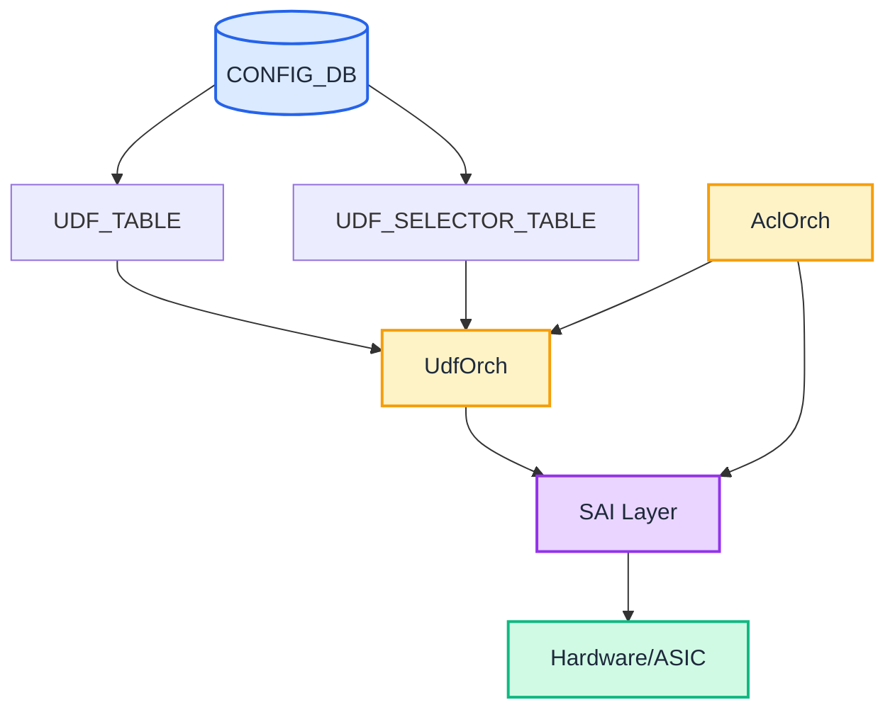
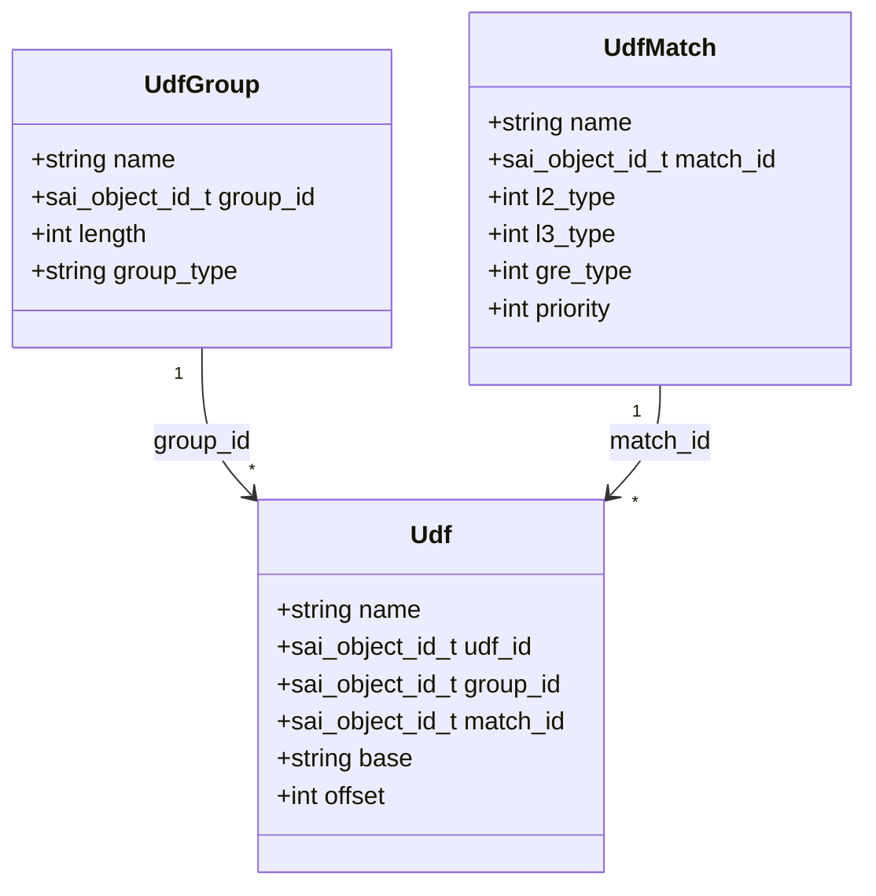
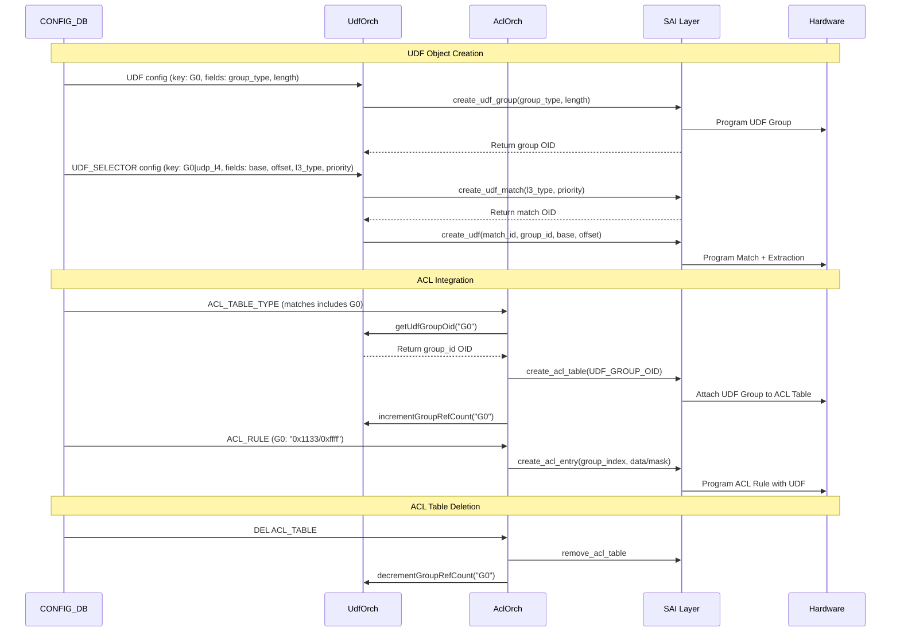

# User Defined Field (UDF) Feature in SONiC

## Table of Content

- [1. Revision](#1-revision)
- [2. Scope](#2-scope)
- [3. Definitions/Abbreviations](#3-definitionsabbreviations)
  - [3.1 Quick Reference](#31-quick-reference)
- [4. Core Concepts and Mental Model](#4-core-concepts-and-mental-model)
  - [4.1 What is UDF?](#41-what-is-udf)
  - [4.2 The Two UDF Config Objects - Mental Model](#42-the-two-udf-config-objects---mental-model)
  - [4.3 Packet Parsing Flow - Complete Example](#43-packet-parsing-flow---complete-example)
  - [4.4 Design Patterns and ACL Key Mapping](#44-design-patterns-and-acl-key-mapping)
  - [4.5 Group Index Mapping to ACL Key](#45-group-index-mapping-to-acl-key)
  - [4.6 Summary - When to Use Each Pattern](#46-summary---when-to-use-each-pattern)
  - [4.7 Common Pattern Examples](#47-common-pattern-examples)
- [5. Requirements](#5-requirements)
- [6. Architecture Design](#6-architecture-design)
- [7. High-Level Design](#7-high-level-design)
- [8. SAI API](#8-sai-api)
- [9. Configuration and Management](#9-configuration-and-management)
- [10. Restrictions/Limitations](#10-restrictionslimitations)
  - [10.1 Configuration Limits](#101-configuration-limits)
  - [10.2 Validation Requirements](#102-validation-requirements)
  - [10.2.1 Visual: One UDF Per Group Per Rule](#1021-visual-one-udf-per-group-per-rule)
  - [10.3 Semantic Consistency Requirement](#103-semantic-consistency-requirement)
- [11. Testing Requirements/Design](#11-testing-requirementsdesign)
  - [11.1 Unit Tests](#111-unit-tests)
  - [11.2 System Tests](#112-system-tests)
  - [11.3 Negative Tests](#113-negative-tests)

## 1. Revision

| Revision | Date       | Author        | Description          |
|----------|------------|---------------|----------------------|
| 0.1      | 2026-03-12 | Satishkumar Rodd   | Initial version      |

## 2. Scope

This document describes the high-level design for User Defined Field (UDF) feature in SONiC. The UDF feature enables custom packet field extraction for advanced packet processing capabilities, with integration into ACL (Access Control List) tables and rules for flexible packet matching and filtering.

## 3. Definitions/Abbreviations

| Term    | Description                                      |
|---------|--------------------------------------------------|
| UDF     | User Defined Field                               |
| SAI     | Switch Abstraction Interface                     |
| SWSS    | Switch State Service                             |
| ACL     | Access Control List                              |
| BTH     | Base Transport Header (InfiniBand/RoCE)          |
| RoCE    | RDMA over Converged Ethernet                     |
| GRE     | Generic Routing Encapsulation                    |
| OID     | Object Identifier                                |

### 3.1 Quick Reference

### Object Schema Summary

| Object | Key | Fields | Example |
|--------|-----|--------|---------|
| **UDF** | `group_name` | group_type (GENERIC/HASH)<br/>length (1-16 bytes)<br/>description (optional) | `G0: {group_type: "GENERIC", length: "3"}` |
| **UDF_SELECTOR** | `group_name\|selector_name` | base (L2/L3/L4)<br/>offset (0-255)<br/>l2_type, l2_type_mask<br/>l3_type, l3_type_mask<br/>gre_type, gre_type_mask<br/>priority (0-255) | `G0\|udp_l4: {base: "L4", offset: "0", l3_type: "0x11", priority: "10"}` |
| **ACL_TABLE_TYPE** | `type_name` | matches (GROUP names, comma-separated)<br/>actions<br/>bind_points | `T1: {matches: "IN_PORTS,G0,G1", ...}` |
| **ACL_RULE** | `table\|rule` | `<group_name>: "value/mask"` | `TABLE1\|R1: {G0: "0x1133/0xffff", ...}` |

### Configuration Order (Critical!)

```
1. UDF (independent — defines the field)
2. UDF_SELECTOR (requires UDF — defines when/how to extract)
3. ACL_TABLE_TYPE (references UDF names in matches)
4. ACL_TABLE (uses table type)
5. ACL_RULE (references UDF group names directly)

Deletion: Reverse order
```

### Mental Model (One-Liner)

- **UDF** = WHERE and how big (field position/length in ACL key)
- **UDF_SELECTOR** = WHEN and HOW to extract (packet type + base + offset)
- **ACL** = WHAT to match (data/mask + action)

### Key Constraints

| Constraint | Rule |
|------------|------|
| **UDF_SELECTOR key** | Composite `group_name\|selector_name`; group must exist in UDF table |
| **ACL Table** | ACL_TABLE_TYPE matches references UDF group names |
| **ACL Rule** | ACL_RULE uses UDF group name directly (e.g., `G0: "0x1133/0xffff"`) |
| **Semantic consistency** | All selectors under a group must extract the same semantic field |

## 4. Core Concepts and Mental Model

### 4.1 What is UDF?

UDF (User Defined Field) enables extraction of custom packet fields for ACL matching and hashing. Key capabilities:

- Extract fields from any packet offset (L2/L3/L4 base)
- Match packets by L2 EtherType, L3 Protocol, or GRE Type
- Use extracted fields in ACL rules
- Support ECMP/LAG hashing on custom fields
- Enable custom protocol processing (e.g., InfiniBand/RoCE)

### 4.2 The Two UDF Config Objects - Mental Model

```
┌──────────────────────────────────────────────────────────────┐
│                     ONE-LINE MENTAL MODEL                     │
├──────────────────────────────────────────────────────────────┤
│  UDF defines WHERE and how big   (field in ACL key)          │
│  UDF_SELECTOR defines WHEN/HOW   (packet type + extraction)  │
│  ACL defines WHAT to match       (data/mask + action)        │
└──────────────────────────────────────────────────────────────┘
```

#### UDF
- Represents **one named field** in the ACL key (e.g., "G0")
- Has a **fixed length** (1-16 bytes)
- Maps to a **group index** in the ACL table
- **Think**: "WHERE in the ACL key does this field go, and how wide is it?"

#### UDF_SELECTOR
- Composite key `<group_name>|<selector_name>` ties a selector directly to its group
- Specifies **which packets** trigger extraction (L2/L3/GRE type + masks + priority)
- Specifies **how to extract** bytes (base L2/L3/L4 + offset)
- Multiple selectors under the same group handle different packet types
- **Think**: "WHEN and HOW to extract bytes into this field?"

**Critical Design Rule: Semantic Consistency** — All selectors under a group must extract the same logical field. See [Section 10.3](#103-semantic-consistency-requirement).

### 4.3 Packet Parsing Flow - Complete Example

**Scenario**: Extract BTH opcode (byte 8 of RoCE header) from UDP packets

```
PACKET STRUCTURE:
┌───────────┬───────────┬───────────┬───────────────────────────┐
│ Ethernet  │    IP     │    UDP    │ RoCE (BTH Header)         │
│ 14 bytes  │ 20 bytes  │  8 bytes  │ ...opcode(offset 8)...    │
└───────────┴───────────┴───────────┴───────────────────────────┘
     L2          L3          L4         L4+0  ....  L4+8

CONFIGURATION:
┌──────────────────────────────────────────────────────────────┐
│ UDF:                                                          │
│   ROCE_GROUP: {group_type: "GENERIC", length: "1"}           │
│                                                               │
│ UDF_SELECTOR:                                                 │
│   ROCE_GROUP|ipv4_udp: {base: "L4", offset: "8",             │
│                          l3_type: "0x11", priority: "10"}    │
└──────────────────────────────────────────────────────────────┘

RUNTIME PACKET PROCESSING:
┌─────────────────────────────────────────────────────────────┐
│                                                              │
│  1. Packet Arrives (IPv4 + UDP + RoCE)                      │
│     │                                                        │
│     ▼                                                        │
│  2. Hardware Parser Identifies:                             │
│     • L2 Type: 0x0800 (IPv4)                                │
│     • L3 Type: 0x11 (UDP)                                   │
│     │                                                        │
│     ▼                                                        │
│  3. ACL Table References:                                   │
│     • UDF Group Index 0 → ROCE_GROUP                        │
│     │                                                        │
│     ▼                                                        │
│  4. Selector Matching:                                      │
│     • Check all UDF_SELECTORs for ROCE_GROUP                │
│     • ROCE_GROUP|ipv4_udp matches (L3=0x11) ✓               │
│     • Use: base=L4, offset=8                                │
│     │                                                        │
│     ▼                                                        │
│  5. Field Extraction:                                       │
│     • BASE: L4 (start of UDP header)                        │
│     • OFFSET: 8 bytes from L4                               │
│     • LENGTH: 1 byte                                        │
│     • Extract: packet[L4+8] = 0x64                          │
│     │                                                        │
│     ▼                                                        │
│  6. Populate ACL Key:                                       │
│     • ACL_Key[UDF_Field_0] ← 0x64                           │
│     │                                                        │
│     ▼                                                        │
│  7. ACL Entry Comparison:                                   │
│     • Rule: UDF_Field_0 = 0x64/0xFF → DROP                  │
│     • Match! → Action: DROP packet                          │
│                                                              │
└─────────────────────────────────────────────────────────────┘
```

### 4.4 Design Patterns and ACL Key Mapping

UDF Groups map to ACL key positions. The following table shows how different UDF configurations result in different ACL key layouts:

```
ACL Key Structure:
  qset = {SrcIp, DstIp, InPorts, ..., B2Chunk1, B2Chunk2, B2Chunk3, ...}
         └─────────────────────────┘  └───────────────────────────────┘
          Standard ACL Fields               UDF Fields (2-byte chunks)

┌──────────────────────────────────────────────────────────────────────────────┐
│ Pattern 1: Single Group, Multiple Selectors (Same field, different protocols)│
├──────────────────────────────────────────────────────────────────────────────┤
│ UDF: G1 (length=2)                                                           │
│ UDF_SELECTOR: G1|ipv4_udp  → IPv4 UDP dest port                              │
│ UDF_SELECTOR: G1|ipv6_udp  → IPv6 UDP dest port                              │
│                                                                               │
│ ACL Key: qset = { B2Chunk1 }                                                 │
│          Only ONE field; runtime selects ipv4_udp or ipv6_udp based on pkt  │
└──────────────────────────────────────────────────────────────────────────────┘

┌──────────────────────────────────────────────────────────────────────────────┐
│ Pattern 2: Multiple Groups, Different Selectors (Different fields)           │
├──────────────────────────────────────────────────────────────────────────────┤
│ UDF: G1 (length=2),  G2 (length=2)                                           │
│ UDF_SELECTOR: G1|udp → IPv4 UDP dest port                                    │
│ UDF_SELECTOR: G2|tcp → IPv6 TCP src port                                     │
│                                                                               │
│ ACL Key Layout:                                                              │
│   B2Chunk1  B2Chunk2                                                         │
│   G1        G2                                                               │
│   ↓         ↓                                                                │
│   UDF[0]    UDF[1]                                                           │
│                                                                               │
│ Runtime: Only matching selector executes; other field = 0                   │
└──────────────────────────────────────────────────────────────────────────────┘

┌──────────────────────────────────────────────────────────────────────────────┐
│ Pattern 3: Multiple Groups, Different Lengths (Complex multi-field)          │
├──────────────────────────────────────────────────────────────────────────────┤
│ UDF: G1 (length=3),  G2 (length=2)                                           │
│ UDF_SELECTOR: G1|s1  → RoCE BTH opcode (3 bytes)                             │
│ UDF_SELECTOR: G2|s2  → GRE key (2 bytes)                                     │
│                                                                               │
│ ACL Key Layout (byte chunks):                                                │
│   B2Chunk1  B2Chunk2  | B2Chunk3                                             │
│   G1                  | G2                                                   │
│   ↓                   | ↓                                                    │
│   UDF[0] (3 bytes)    | UDF[1] (2 bytes)                                     │
│                                                                               │
│ Note: G1 spans 2 chunks (3 bytes), G2 uses 1 chunk (2 bytes)                │
└──────────────────────────────────────────────────────────────────────────────┘
```

**Key Principles**:
1. **One UDF = One ACL Field Position**: Each group maps to a specific index in the ACL key
2. **Multiple Selectors per UDF**: Only ONE executes per packet (based on priority + match)
3. **Field Length**: Groups can span multiple 2-byte chunks (1-16 bytes total)
4. **Runtime Selection**: Priority-based; highest priority matching selector wins. If none matches, field = 0
5. **Semantic Consistency**: All selectors under a group must extract the same logical field

#### Example: Multi-Protocol RoCE + GRE Extraction

Complete configuration showing Pattern 3 in practice:

```
UDF:
  ROCE_OPCODE: {group_type: "GENERIC", length: "1"}
  GRE_KEY:     {group_type: "GENERIC", length: "4"}

UDF_SELECTOR:
  ROCE_OPCODE|ipv4_roce: {base: "L4", offset: "8", l2_type: "0x0800", l3_type: "0x11", priority: "10"}
  ROCE_OPCODE|ipv6_roce: {base: "L4", offset: "8", l2_type: "0x86DD", l3_type: "0x11", priority: "10"}
  GRE_KEY|ipv4_gre:      {base: "L3", offset: "28", l2_type: "0x0800", gre_type: "0x6558", priority: "10"}
  GRE_KEY|ipv6_gre:      {base: "L3", offset: "48", l2_type: "0x86DD", gre_type: "0x6558", priority: "10"}

Runtime Behavior:
  IPv4 RoCE → ROCE_OPCODE|ipv4_roce → UDF[0] = opcode, UDF[1] = 0
  IPv6 RoCE → ROCE_OPCODE|ipv6_roce → UDF[0] = opcode, UDF[1] = 0
  IPv4 GRE  → GRE_KEY|ipv4_gre      → UDF[0] = 0,      UDF[1] = key
  IPv6 GRE  → GRE_KEY|ipv6_gre      → UDF[0] = 0,      UDF[1] = key
```

### 4.5 Group Index Mapping to ACL Key

```
SAI ACL TABLE CREATION:
  SAI_ACL_TABLE_ATTR_USER_DEFINED_FIELD_GROUP_MIN + 0  →  ROCE_OPCODE_GROUP
  SAI_ACL_TABLE_ATTR_USER_DEFINED_FIELD_GROUP_MIN + 1  →  GRE_KEY_GROUP
  SAI_ACL_TABLE_ATTR_USER_DEFINED_FIELD_GROUP_MIN + 2  →  UDP_DPORT_GROUP

RESULTING ACL KEY:
┌──────────────────┬──────────┬──────────┬──────────┬─────────┐
│ Standard Fields  │  UDF[0]  │  UDF[1]  │  UDF[2]  │   ...   │
│ (SIP, DIP, etc)  │  ROCE    │   GRE    │   UDP    │         │
│                  │ 1 byte   │ 4 bytes  │ 2 bytes  │         │
└──────────────────┴──────────┴──────────┴──────────┴─────────┘
                      ↑          ↑          ↑
                   Index 0    Index 1    Index 2

SAI ACL ENTRY MATCHING:
  SAI_ACL_ENTRY_ATTR_USER_DEFINED_FIELD_GROUP_MIN + 0  →  data/mask for ROCE
  SAI_ACL_ENTRY_ATTR_USER_DEFINED_FIELD_GROUP_MIN + 1  →  data/mask for GRE
  SAI_ACL_ENTRY_ATTR_USER_DEFINED_FIELD_GROUP_MIN + 2  →  data/mask for UDP
```

**Key Insight**: The index must match between table declaration and entry matching!

### 4.6 Summary - When to Use Each Pattern

| Pattern | UDF Groups | Selectors per Group | Use Case | Example |
|---------|-----------|---------------------|----------|---------|
| **1** | 1 | Multiple | Same field, different packet types | UDP port from IPv4 and IPv6 |
| **2** | Multiple | 1 each | Multiple fields, same packet type | Src+Dst port from IPv4 UDP |
| **3** | Multiple | Multiple each | Multiple fields, multiple packet types | RoCE opcode + GRE key extraction |

### 4.7 Common Pattern Examples

#### Pattern 1: Single Field, Multi-Protocol (RECOMMENDED for IPv4/IPv6)

**Use when**: Extracting the same logical field from different IP versions

```json
{
  "UDF": {
    "UDP_DPORT": {"group_type": "GENERIC", "length": "2"}
  },
  "UDF_SELECTOR": {
    "UDP_DPORT|ipv4_udp": {"base": "L4", "offset": "2", "l2_type": "0x0800", "l3_type": "0x11", "priority": "10"},
    "UDP_DPORT|ipv6_udp": {"base": "L4", "offset": "2", "l2_type": "0x86DD", "l3_type": "0x11", "priority": "10"}
  },
  "ACL_TABLE_TYPE": {
    "T1": {"matches": "IN_PORTS,UDP_DPORT", "actions": "PACKET_ACTION", "bind_points": "PORT"}
  },
  "ACL_RULE": {
    "TABLE1|BLOCK_DNS": {"UDP_DPORT": "0x0035/0xffff", "PACKET_ACTION": "DROP"}
  }
}
```

**Key benefit**: Single rule matches both IPv4 and IPv6; runtime selects the correct selector

#### Pattern 2: Multiple Fields, Single Protocol

**Use when**: Extracting multiple different fields from the same packet type

```json
{
  "UDF": {
    "TCP_SPORT": {"group_type": "GENERIC", "length": "2"},
    "TCP_DPORT": {"group_type": "GENERIC", "length": "2"}
  },
  "UDF_SELECTOR": {
    "TCP_SPORT|tcp": {"base": "L4", "offset": "0", "l3_type": "0x06", "priority": "10"},
    "TCP_DPORT|tcp": {"base": "L4", "offset": "2", "l3_type": "0x06", "priority": "10"}
  },
  "ACL_TABLE_TYPE": {
    "T1": {"matches": "TCP_SPORT,TCP_DPORT", "actions": "PACKET_ACTION", "bind_points": "PORT"}
  },
  "ACL_RULE": {
    "TABLE1|BLOCK_RANGE": {
      "TCP_SPORT": "0x0400/0xff00",
      "TCP_DPORT": "0x1f90/0xffff",
      "PACKET_ACTION": "DROP"
    }
  }
}
```

**Key benefit**: Match on combinations of multiple custom fields

#### Pattern 3: RoCE/InfiniBand Custom Field Extraction

**Use when**: Extracting fields from custom protocols like RoCE

```json
{
  "UDF": {
    "BTH_OPCODE": {"group_type": "GENERIC", "length": "1"}
  },
  "UDF_SELECTOR": {
    "BTH_OPCODE|roce": {"base": "L2", "offset": "18", "l2_type": "0x8915", "priority": "100"}
  },
  "ACL_TABLE_TYPE": {
    "ROCE_TABLE": {"matches": "BTH_OPCODE", "actions": "PACKET_ACTION", "bind_points": "PORT"}
  },
  "ACL_RULE": {
    "ROCE_TABLE|BLOCK_SEND": {"BTH_OPCODE": "0x00/0xff", "PACKET_ACTION": "DROP"}
  }
}
```

**Key benefit**: Enable custom protocol processing not supported by standard ACL

## 5. Requirements

### 5.1 Functional Requirements

| Requirement | Description |
|-------------|-------------|
| UDF | GENERIC (ACL) and HASH (load balancing) types, 1-16 bytes |
| UDF_SELECTOR | L2 EtherType, L3 Protocol, GRE Type matching with masks and priority; configurable base (L2/L3/L4) and offset (0-255) |
| Configuration | CONFIG_DB interface with YANG validation |
| ACL Integration | UDF group names used directly in ACL table types and rules |

## 6. Architecture Design

### 6.1 System Architecture



**Key Components:**
- **UdfOrch**: Manages UDF and UDF_SELECTOR objects, provides group OIDs to AclOrch
- **AclOrch**: Resolves UDF group names, attaches groups to ACL tables, matches group names in rules
- **SAI UDF API**: Creates UDF groups, matches, and extraction objects (internal to UdfOrch)
- **SAI ACL API**: Attaches UDF groups to ACL tables and applies UDF matching

### 6.2 UDF Object Model



| Config Object | Key Attributes | SAI Objects Created |
|--------------|----------------|-------------------|
| **UDF** | group_type (GENERIC/HASH), length (1-20) | SAI UDF Group |
| **UDF_SELECTOR** | base (L2/L3/L4), offset, L2/L3/GRE type+mask, priority | SAI UDF Match + SAI UDF |

### 6.3 ACL Integration Dependency

```
UDF (group_name: "G0")
    │
    ├─→ UDF_SELECTOR (key: "G0|selector_name", base, offset, match criteria)
    │
    ├─→ ACL_TABLE_TYPE (matches field references group name "G0")
    │         │
    │         └─→ ACL_TABLE (uses table type, attaches group to ACL)
    │                   │
    │                   └─→ ACL_RULE (field key is group name: G0: "0x1133/0xffff")
```

**Key Flow**:
1. **UDF** defines the named field "G0"
2. **UDF_SELECTOR** entries under "G0" define when/how to extract bytes for each packet type
3. **ACL_TABLE_TYPE** declares "G0" in matches → attaches SAI UDF group to ACL table
4. **ACL_RULE** matches against "G0" directly by group name

### 6.4 Component Responsibilities

| Component | Location | Responsibilities |
|-----------|----------|------------------|
| **UdfOrch** | `udforch.cpp/h` | • Manages UDF and UDF_SELECTOR objects<br/>• For each UDF_SELECTOR entry, creates both a SAI UDF Match and SAI UDF object internally<br/>• Resolves group names to OIDs via `getUdfGroupOid()`<br/>• Tracks ACL table references via `incrementGroupRefCount()` / `decrementGroupRefCount()`<br/>• Blocks group removal when ACL ref count > 0 |
| **AclOrch** | `aclorch.cpp` | • Resolves group names in ACL_TABLE_TYPE matches to group OIDs<br/>• Attaches UDF groups to ACL tables and calls `incrementGroupRefCount()`<br/>• Calls `decrementGroupRefCount()` when an ACL table is removed<br/>• Applies UDF matching in ACL rules using group name directly |

**Key Classes**:

| Class | Key Methods | Responsibility |
|-------|-------------|----------------|
| **UdfOrch** | `doUdfFieldTask()` (creates SAI UDF group)<br/>`doUdfSelectorTask()` (creates SAI UDF match + SAI UDF)<br/>`getUdfGroupOid(name)`<br/>`incrementGroupRefCount(name)`<br/>`decrementGroupRefCount(name)` | Orchestrates UDF lifecycle, resolves OIDs, enforces ref-count guard |
| **UdfGroup** | `create()`, `remove()`, `getOid()` | Manages SAI UDF group objects |
| **UdfMatch** | `create()`, `remove()`, `getOid()` | Manages SAI UDF match objects (created per UDF_SELECTOR entry) |
| **Udf** | `create()`, `remove()`, `getConfig()` | Manages SAI UDF objects (created per UDF_SELECTOR entry) |

**YANG Model Validation** (`sonic-udf.yang`):
- Schema validation for UDF configuration before writing to CONFIG_DB
- Enforces data type constraints (e.g., LENGTH: 1-20, OFFSET: 0-255)
- Validates mandatory fields and relationships between UDF objects

### 6.5 Configuration and Data Flow



**Key Steps:**
1. `UDF` → UdfOrch creates SAI UDF Group
2. `UDF_SELECTOR` → UdfOrch creates SAI UDF Match + SAI UDF (both, internally)
3. `ACL_TABLE_TYPE` → AclOrch attaches group OID to ACL table, increments ref count
4. `ACL_RULE` → AclOrch resolves group name to index, programs SAI ACL entry directly

## 7. High-Level Design

### 7.1 Implementation Files

| File | Purpose |
|------|---------|
| `udforch.h/cpp` | UDF orchestrator implementation |
| `udf_constants.h` | Type mappings and constants |
| `orchdaemon.cpp` | Integration into orchagent |

### 7.2 Key Classes

| Class | Responsibility | SAI Object |
|-------|----------------|------------|
| `UdfGroup` | Manages UDF group (group_type, length) | `SAI_OBJECT_TYPE_UDF_GROUP` |
| `UdfMatch` | Manages match criteria (L2/L3/GRE type+mask, priority) — shared across selectors with identical criteria | `SAI_OBJECT_TYPE_UDF_MATCH` |
| `Udf` | Manages field extraction (base, offset) — one SAI UDF object per UDF_SELECTOR entry | `SAI_OBJECT_TYPE_UDF` |
| `UdfOrch` | Orchestrates all UDF objects; processes `UDF` and `UDF_SELECTOR` CONFIG_DB tables | N/A |
| `UdfMatchSignature` | Content-equality key used for match deduplication (`l2_type`, `l3_type`, `gre_type`, masks, priority) | N/A |

### 7.3 Configuration Order

**Creation Order:**
1. UDF (independent — defines the group)
2. UDF_SELECTOR (depends on UDF — group must exist)
3. ACL_TABLE_TYPE (references UDF names in matches)
4. ACL_TABLE (uses ACL_TABLE_TYPE)
5. ACL_RULE (references UDF group names directly)

**Deletion Order:** Reverse of creation

### 7.4 Orchestration Logic

**UdfOrch Processing Flow**:

1. **UDF Task** (key: `group_name`, e.g., "G0"):
   - Validate `group_type` (GENERIC/HASH) and `length` (1-20)
   - Call SAI `create_udf_group()` → store group OID

2. **UDF_SELECTOR Task** (key: `group_name|selector_name`, e.g., "G0|udp_l4"):
   - Parse group name from composite key; resolve to group OID (retry if not yet created)
   - Validate match criteria (L2/L3/GRE type + masks), `base`, `offset`, `priority`
   - Apply default exact-match masks if type is set but mask is omitted
   - Look up `m_matchSigToName` for a shared match with identical criteria; if found, reuse the existing SAI UDF_MATCH object (increment `m_matchRefCount`); otherwise call SAI `create_udf_match()` and register in the deduplication maps
   - Call SAI `create_udf(match_id, group_id, base, offset)` → store udf OID
   - Record `m_selectorToMatchName[selectorKey] = matchName` for cleanup on deletion

**Match Deduplication**:

Multiple UDF_SELECTOR entries may have identical match criteria (e.g., two fields both selecting IPv4 packets). Rather than creating duplicate SAI UDF_MATCH objects, UdfOrch deduplicates them:

| Internal Map | Key | Value | Purpose |
|---|---|---|---|
| `m_matchSigToName` | `UdfMatchSignature` (all type/mask/priority fields) | match name | Find existing match by content |
| `m_matchRefCount` | match name | reference count | Delete SAI object only when count reaches 0 |
| `m_selectorToMatchName` | selector composite key | match name | Look up correct match on UDF_SELECTOR DEL |

On deletion of a UDF_SELECTOR, `releaseSharedMatch()` decrements the ref count and removes the SAI UDF_MATCH object only when the last user goes away.

**AclOrch Integration**:
- **ACL Table Creation**: Query UdfOrch via `getUdfGroupOid(group_name)` → attach to ACL table via SAI → call `incrementGroupRefCount(group_name)`
- **ACL Table Deletion**: Call `decrementGroupRefCount(group_name)` after SAI table removal
- **ACL Rule Creation**: Group name in rule (e.g., `G0`) maps directly to ACL key index — no UDF name lookup needed

**UDF Group Deletion Guard**:
- `removeUdfGroup()` checks `m_udfGroupRefCount[name] > 0` before calling SAI
- Rejected with error log if any ACL table still holds a reference (returns `false`, triggering retry)

### 7.5 CONFIG_DB Schema

| Table | Key | Fields | Example |
|-------|-----|--------|---------|
| **UDF** | `<group_name>` | `group_type` (GENERIC/HASH)<br/>`length` (1-20)<br/>`description` (optional) | Key: `G0`<br/>`group_type="GENERIC"`<br/>`length="3"` |
| **UDF_SELECTOR** | `<group_name>\|<selector_name>` | `base` (L2/L3/L4)<br/>`offset` (0-255)<br/>`l2_type`, `l2_type_mask`<br/>`l3_type`, `l3_type_mask`<br/>`gre_type`, `gre_type_mask`<br/>`priority` (0-255, default 0)<br/>**Mask defaulting**: if a type field is set but mask is omitted, defaults to exact-match (`0xFFFF`/`0xFF`) | Key: `G0\|udp_l4`<br/>`base="L4"`<br/>`offset="0"`<br/>`l3_type="0x11"`<br/>`priority="10"` |
| **ACL_TABLE_TYPE** | `<type_name>` | `matches` (UDF group names, comma-separated)<br/>`actions`<br/>`bind_points` | Key: `T1`<br/>`matches="IN_PORTS,G0,G1"`<br/>`actions="PACKET_ACTION,COUNTER"`<br/>`bind_points="PORT"` |
| **ACL_TABLE** | `<table_name>` | `type`<br/>`ports`<br/>`stage` | Key: `TABLE1`<br/>`type="T1"`<br/>`ports="Ethernet0"`<br/>`stage="ingress"` |
| **ACL_RULE** | `<table>\|<rule>` | `priority`<br/>`<group_name>`: "value/mask"<br/>`PACKET_ACTION` | Key: `TABLE1\|R1`<br/>`priority="101"`<br/>`G0="0x1133/0xffff"`<br/>`PACKET_ACTION="DROP"` |

**Key Design Points:**
- **UDF key is the group name**: Used directly in ACL_TABLE_TYPE matches and ACL_RULE fields
- **UDF_SELECTOR composite key**: `group_name|selector_name` — group must exist in UDF table
- **ACL_RULE uses group name**: `G0: "0x1133/0xffff"` — no separate UDF name indirection
- **At least one match criteria required**: `l2_type`, `l3_type`, or `gre_type` must be set in UDF_SELECTOR
- **One group per field per rule**: A single ACL_RULE references each group at most once
- **Value/mask format**: Hexadecimal `"0xVALUE/0xMASK"` in ACL_RULE


### 7.6 ACL Integration

**AclOrch Resolution Flow:**
1. Parse ACL_TABLE_TYPE matches → identify UDF group names (e.g., "G0", "G1")
2. Query UdfOrch: `getUdfGroupOid(group_name)` → get group OID
3. Attach to ACL table: `SAI_ACL_TABLE_ATTR_USER_DEFINED_FIELD_GROUP_MIN + index` with group OID
4. For ACL rule field `G0: "0x1133/0xffff"` → resolve group name to index → apply `SAI_ACL_ENTRY_ATTR_USER_DEFINED_FIELD_GROUP_MIN + index` with byte array data/mask

**Example: Two Groups, Multiple Selectors**
```json
{
  "UDF": {
    "G0": {"group_type": "GENERIC", "length": "3"},
    "G1": {"group_type": "GENERIC", "length": "3"}
  },
  "UDF_SELECTOR": {
    "G0|udp_l4":    {"base": "L4", "offset": "0", "l3_type": "0x11", "priority": "10"},
    "G0|proto18_l3":{"base": "L3", "offset": "0", "l3_type": "0x12", "priority": "10"},
    "G1|proto18_l3":{"base": "L3", "offset": "0", "l3_type": "0x12", "priority": "10"}
  },
  "ACL_TABLE_TYPE": {
    "T1": {"matches": "IN_PORTS,G0,G1", "actions": "PACKET_ACTION,COUNTER", "bind_points": "PORT"}
  },
  "ACL_TABLE": {"TABLE1": {"type": "T1", "ports": "Ethernet0", "stage": "ingress"}},
  "ACL_RULE": {
    "TABLE1|R1": {"priority": "101", "G0": "0x1133/0xffff", "G1": "0x2244/0xffff", "PACKET_ACTION": "DROP"},
    "TABLE1|R2": {"priority": "101", "G0": "0x1134/0xffff", "G1": "0x2245/0xffff", "PACKET_ACTION": "DROP"}
  }
}
```

## 8. SAI API

### 8.1 UDF Group API

**API Function**: `sai_create_udf_group_fn`

**Attributes**:

| Attribute | Type | Flags | Description |
|-----------|------|-------|-------------|
| `SAI_UDF_GROUP_ATTR_TYPE` | `sai_udf_group_type_t` | CREATE_ONLY | Group type: `SAI_UDF_GROUP_TYPE_GENERIC` or `SAI_UDF_GROUP_TYPE_HASH` |
| `SAI_UDF_GROUP_ATTR_LENGTH` | `sai_uint16_t` | MANDATORY_ON_CREATE, CREATE_ONLY | Total extraction length in bytes (1-20, SONiC implementation constraint defined in `udf_constants.h`) |
| `SAI_UDF_GROUP_ATTR_UDF_LIST` | `sai_object_list_t` | READ_ONLY | List of UDF objects in this group |

**API Calls**:
- **Create**: `sai_udf_api->create_udf_group(&group_id, switch_id, attr_count, attr_list)`
- **Remove**: `sai_udf_api->remove_udf_group(group_id)`

### 8.2 UDF Match API

**API Function**: `sai_create_udf_match_fn`

**Attributes**:

| Attribute | Type | Flags | Description |
|-----------|------|-------|-------------|
| `SAI_UDF_MATCH_ATTR_L2_TYPE` | `sai_acl_field_data_t` (uint16) | CREATE_ONLY | EtherType value and mask (e.g., 0x0800 for IPv4) |
| `SAI_UDF_MATCH_ATTR_L3_TYPE` | `sai_acl_field_data_t` (uint8) | CREATE_ONLY | IP Protocol value and mask (e.g., 0x11 for UDP) |
| `SAI_UDF_MATCH_ATTR_GRE_TYPE` | `sai_acl_field_data_t` (uint16) | CREATE_ONLY | GRE Protocol Type value and mask |
| `SAI_UDF_MATCH_ATTR_PRIORITY` | `sai_uint8_t` | CREATE_ONLY | Match priority (0-255, higher value = higher priority, consistent with `SAI_ACL_ENTRY_ATTR_PRIORITY`) |

**API Calls**:
- **Create**: `sai_udf_api->create_udf_match(&match_id, switch_id, attr_count, attr_list)`
- **Remove**: `sai_udf_api->remove_udf_match(match_id)`

**Note**: At least one of L2_TYPE, L3_TYPE, or GRE_TYPE must be specified. Each type includes both data and mask fields.

### 8.3 UDF API

**API Function**: `sai_create_udf_fn`

**Attributes**:

| Attribute | Type | Flags | Description |
|-----------|------|-------|-------------|
| `SAI_UDF_ATTR_MATCH_ID` | `sai_object_id_t` | MANDATORY_ON_CREATE, CREATE_ONLY | Reference to UDF Match object |
| `SAI_UDF_ATTR_GROUP_ID` | `sai_object_id_t` | MANDATORY_ON_CREATE, CREATE_ONLY | Reference to UDF Group object |
| `SAI_UDF_ATTR_BASE` | `sai_udf_base_t` | CREATE_AND_SET | Extraction base: `SAI_UDF_BASE_L2`, `SAI_UDF_BASE_L3`, or `SAI_UDF_BASE_L4` |
| `SAI_UDF_ATTR_OFFSET` | `sai_uint16_t` | MANDATORY_ON_CREATE, CREATE_ONLY | Byte offset from base (0-255) |
| `SAI_UDF_ATTR_HASH_MASK` | `sai_u8_list_t` | CREATE_AND_SET | Hash mask (only for HASH type groups) |

**API Calls**:
- **Create**: `sai_udf_api->create_udf(&udf_id, switch_id, attr_count, attr_list)`
- **Remove**: `sai_udf_api->remove_udf(udf_id)`

### 8.4 ACL Integration API

**UDF Group Attachment to ACL Table**:

| Attribute | Type | Flags | Description |
|-----------|------|-------|-------------|
| `SAI_ACL_TABLE_ATTR_USER_DEFINED_FIELD_GROUP_MIN + index` | `sai_object_id_t` | CREATE_ONLY | Attach UDF group OID to ACL table at specified index (0-255) |

**Details**:
- The index value (0-255) is added to `SAI_ACL_TABLE_ATTR_USER_DEFINED_FIELD_GROUP_MIN`
- Each index corresponds to one UDF group
- The UDF group OID is passed as the attribute value
- Field length is derived from the UDF group's `SAI_UDF_GROUP_ATTR_LENGTH`

**API Call**: `sai_acl_api->create_acl_table(&table_id, switch_id, attr_count, attr_list)`

**UDF Matching in ACL Entry**:

| Attribute | Type | Flags | Description |
|-----------|------|-------|-------------|
| `SAI_ACL_ENTRY_ATTR_USER_DEFINED_FIELD_GROUP_MIN + index` | `sai_acl_field_data_t sai_u8_list_t` | CREATE_AND_SET | Match on extracted UDF field with data/mask byte arrays |

**Details**:
- The index must match the index used in the ACL table
- Data type is `sai_acl_field_data_t` containing `sai_u8_list_t` for both data and mask
- Byte array length must match the UDF group's `SAI_UDF_GROUP_ATTR_LENGTH`
- Both `data.list` and `mask.list` must be specified with `count` field

**API Call**: `sai_acl_api->create_acl_entry(&entry_id, switch_id, attr_count, attr_list)`

### 8.5 API Usage Flow

1. **Create UDF Group**: Set TYPE and LENGTH attributes
2. **Create UDF Match**: Set L2/L3/GRE TYPE and PRIORITY attributes
3. **Create UDF**: Set MATCH_ID, GROUP_ID, BASE, and OFFSET attributes
4. **Attach to ACL Table**: Use `SAI_ACL_TABLE_ATTR_USER_DEFINED_FIELD_GROUP_MIN + index` with group_id OID
5. **Match in ACL Rule**: Use `SAI_ACL_ENTRY_ATTR_USER_DEFINED_FIELD_GROUP_MIN + index` with byte array data/mask

### 8.6 ACL Integration Example

**Scenario**: Match UDP packets with custom field value 0x1234 at L4 offset 8

**Step 1: Create UDF Group (length = 2 bytes)**
```c
sai_attribute_t group_attrs[2];
group_attrs[0].id = SAI_UDF_GROUP_ATTR_TYPE;
group_attrs[0].value.s32 = SAI_UDF_GROUP_TYPE_GENERIC;
group_attrs[1].id = SAI_UDF_GROUP_ATTR_LENGTH;
group_attrs[1].value.u16 = 2;  // 2 bytes
sai_udf_api->create_udf_group(&group_id, switch_id, 2, group_attrs);
```

**Step 2: Create UDF Match (UDP packets)**
```c
sai_attribute_t match_attrs[2];
match_attrs[0].id = SAI_UDF_MATCH_ATTR_L2_TYPE;
match_attrs[0].value.aclfield.data.u16 = 0x0800;  // IPv4
match_attrs[0].value.aclfield.mask.u16 = 0xFFFF;
match_attrs[1].id = SAI_UDF_MATCH_ATTR_L3_TYPE;
match_attrs[1].value.aclfield.data.u8 = 0x11;     // UDP
match_attrs[1].value.aclfield.mask.u8 = 0xFF;
sai_udf_api->create_udf_match(&match_id, switch_id, 2, match_attrs);
```

**Step 3: Create UDF (L4 offset 8)**
```c
sai_attribute_t udf_attrs[4];
udf_attrs[0].id = SAI_UDF_ATTR_MATCH_ID;
udf_attrs[0].value.oid = match_id;
udf_attrs[1].id = SAI_UDF_ATTR_GROUP_ID;
udf_attrs[1].value.oid = group_id;
udf_attrs[2].id = SAI_UDF_ATTR_BASE;
udf_attrs[2].value.s32 = SAI_UDF_BASE_L4;
udf_attrs[3].id = SAI_UDF_ATTR_OFFSET;
udf_attrs[3].value.u16 = 8;
sai_udf_api->create_udf(&udf_id, switch_id, 4, udf_attrs);
```

**Step 4: Attach UDF Group to ACL Table (index 0)**
```c
sai_attribute_t table_attrs[3];
table_attrs[0].id = SAI_ACL_TABLE_ATTR_ACL_STAGE;
table_attrs[0].value.s32 = SAI_ACL_STAGE_INGRESS;
table_attrs[1].id = SAI_ACL_TABLE_ATTR_ACL_BIND_POINT_TYPE_LIST;
table_attrs[1].value.objlist.count = 1;
table_attrs[1].value.objlist.list[0] = SAI_ACL_BIND_POINT_TYPE_PORT;
// Attach UDF group at index 0
table_attrs[2].id = SAI_ACL_TABLE_ATTR_USER_DEFINED_FIELD_GROUP_MIN + 0;
table_attrs[2].value.oid = group_id;
sai_acl_api->create_acl_table(&table_id, switch_id, 3, table_attrs);
```

**Step 5: Create ACL Entry with UDF Match (value = 0x1234)**
```c
sai_attribute_t entry_attrs[2];
entry_attrs[0].id = SAI_ACL_ENTRY_ATTR_TABLE_ID;
entry_attrs[0].value.oid = table_id;
// Match UDF field at index 0 with value 0x1234
entry_attrs[1].id = SAI_ACL_ENTRY_ATTR_USER_DEFINED_FIELD_GROUP_MIN + 0;
entry_attrs[1].value.aclfield.enable = true;
entry_attrs[1].value.aclfield.data.u8list.count = 2;
entry_attrs[1].value.aclfield.data.u8list.list[0] = 0x12;
entry_attrs[1].value.aclfield.data.u8list.list[1] = 0x34;
entry_attrs[1].value.aclfield.mask.u8list.count = 2;
entry_attrs[1].value.aclfield.mask.u8list.list[0] = 0xFF;
entry_attrs[1].value.aclfield.mask.u8list.list[1] = 0xFF;
sai_acl_api->create_acl_entry(&entry_id, switch_id, 2, entry_attrs);
```

## 9. Configuration and Management

### 9.1 YANG Model

**File**: `sonic-udf.yang`

| Table | Validation | Constraints |
|-------|------------|-------------|
| **UDF** | `group_type` (enum: GENERIC/HASH)<br/>`length` (1-20) | Mandatory fields |
| **UDF_SELECTOR** | `base` (enum: L2/L3/L4)<br/>`offset` (0-255)<br/>`l2_type`/`l3_type`/`gre_type` (hex string)<br/>`priority` (0-255) | `base` and `offset` mandatory; at least one type field required; parent UDF entry must exist |


## 10. Restrictions/Limitations

### 10.1 Configuration Limits

**Source**: `udf_constants.h`

| Parameter | Min | Max | Notes |
|-----------|-----|-----|-------|
| **UDF Group Length** | 1 byte | 20 bytes | `UDF_GROUP_MIN_LENGTH` to `UDF_GROUP_MAX_LENGTH` |
| **UDF Offset** | 0 | 255 | `UDF_MAX_OFFSET` (uint16_t) |
| **UDF Name** | 1 char | 64 chars | `UDF_NAME_MAX_LENGTH` |
| **Priority** | 0 | 255 | uint8_t, all values valid |

### 10.2 Validation Requirements

| Requirement | Validation | Error Handling |
|-------------|------------|----------------|
| **BASE field** | Must be "L2", "L3", or "L4" | Reject config, log error |
| **UDF_MATCH criteria** | At least one of L2_TYPE, L3_TYPE, or GRE_TYPE must be non-zero (checked against both data and mask) | Reject config, log error |
| **UDF_SELECTOR mask defaulting** | If TYPE is set but MASK is omitted, mask defaults to exact-match (0xFF / 0xFFFF). Applied in `doUdfSelectorTask` after the field parse loop. | Silent default, logged at debug level |
| **UDF group deletion** | Blocked if ACL table ref count > 0 (tracked via `incrementGroupRefCount` / `decrementGroupRefCount`) | Reject deletion, return false (triggers retry) |
| **UDF_SELECTOR dependencies** | `doUdfSelectorTask` retries until the parent UDF group OID is available | Retry until dependency resolved |
| **Group/Match existence** | GROUP and MATCH referenced by UDF must exist | Reject config, log error |
| **ACL_TABLE_TYPE** | MATCHES field must reference existing GROUP names | Reject config, log error |
| **ACL_RULE UDF reference** | UDF name in rule must belong to a GROUP declared in the table's type | Reject config, log error |
| **One UDF per group per rule** | A single ACL_RULE can reference only ONE UDF from a given GROUP | Reject config, log error |
| **Semantic consistency** | All UDFs in the same group must extract the same semantic field | User validation required |

### 10.2.1 Visual: One UDF Per Group Per Rule

```
Given:
  UDF_GROUP: {G0: {TYPE: "GENERIC", LENGTH: "2"}}
  UDF: {
    FIELD1: {GROUP: "G0", MATCH: "M_UDP", ...},
    FIELD2: {GROUP: "G0", MATCH: "M_TCP", ...}
  }

✅ VALID - Different rules, same group:
┌────────────────────────────────────────────┐
│ ACL_RULE:                                  │
│   TABLE1|R1: {                             │
│     FIELD1: "0x33/0xff",  ← One UDF (G0)   │
│     PACKET_ACTION: "DROP"                  │
│   }                                        │
│   TABLE1|R2: {                             │
│     FIELD2: "0x34/0xff",  ← Different UDF  │
│     PACKET_ACTION: "DROP"    (also from G0)│
│   }                                        │
└────────────────────────────────────────────┘

❌ INVALID - Same rule, multiple UDFs from same group:
┌────────────────────────────────────────────┐
│ ACL_RULE:                                  │
│   TABLE1|R1: {                             │
│     FIELD1: "0x33/0xff",  ← Both from G0   │
│     FIELD2: "0x34/0xff",  ← CONFLICT! ❌   │
│     PACKET_ACTION: "DROP"                  │
│   }                                        │
│                                            │
│ Reason: G0 produces ONE value per packet.  │
│ A single rule cannot match two different   │
│ values from the same field position.       │
└────────────────────────────────────────────┘
```

### 10.3 Semantic Consistency Requirement

**Critical Design Constraint**: A UDF Group must maintain consistent semantic meaning across all packets.

**Why This Matters**:
- A UDF Group represents **one logical ACL field** with a fixed position in the ACL key
- While SAI allows **multiple UDFs per group**, these are **alternate extractors** for different packet types, **not different fields**
- At runtime, **only ONE UDF is selected per packet** based on UDF_MATCH evaluation
- The group produces **one value per packet**, regardless of which UDF was selected
- The ACL rule applies a **single data/mask** to this field

**The Problem**:
If multiple selectors under the same group extract **different semantic fields**, the ACL rule becomes ambiguous:
```
❌ INCORRECT:
  UDF: {MIXED: {group_type: "GENERIC", length: "2"}}
  UDF_SELECTOR:
    MIXED|udp:  {base: "L4", offset: "2",  l3_type: "0x11"}  // UDP dest port
    MIXED|tcp:  {base: "L4", offset: "13", l3_type: "0x06"}  // TCP flags
  ACL_RULE:
    R1: {MIXED: "0x0050/0xFFFF"}  // Is this port 80 or TCP flag 0x50? Ambiguous!
```

**Correct Usage**:
All selectors under a group extract the **same field** from different packet contexts:
```
✅ CORRECT:
  UDF: {UDP_DPORT: {group_type: "GENERIC", length: "2"}}
  UDF_SELECTOR:
    UDP_DPORT|ipv4: {base: "L4", offset: "2", l2_type: "0x0800", l3_type: "0x11"}
    UDP_DPORT|ipv6: {base: "L4", offset: "2", l2_type: "0x86DD", l3_type: "0x11"}
  ACL_RULE:
    R1: {UDP_DPORT: "0x0050/0xFFFF"}  // Clearly UDP dest port = 80, both IPv4 and IPv6
```

**Design Guidelines**:
- ✅ **One group = One field semantic**: All selectors in a group extract the same logical field
- ✅ **Multiple packet types**: Use different selectors for IPv4/IPv6 variants of the same field
- ❌ **Different fields**: Never mix different field semantics in one group
- ❌ **Ambiguous rules**: If the data/mask meaning changes per packet type, the design is wrong

**Validation**:
- This is a **user design constraint**, not automatically validated by the system
- Users must ensure semantic consistency when configuring multiple UDFs per group
- Incorrect configurations will lead to unpredictable ACL behavior

### 10.4 Platform and Feature Limitations

| Category | Limitation | Status/Details |
|----------|------------|----------------|
| **Resource Limits** | Platform-dependent | Discovered through SAI errors when exhausted |
| **Base Types** | L2, L3, L4 only | No L4_DST_PORT or other extended types |
| **Match Types** | L2_TYPE, L3_TYPE, GRE_TYPE only | No L4_DST_PORT_TYPE support |
| **Warmboot** | Not supported | No state reconciliation in v1 |
| **Fastboot** | Not supported | No object preservation in v1 |
| **Dynamic Updates** | Limited | UDF_ATTR_GROUP_ID is CREATE_ONLY (cannot change after creation) |
| **CLI** | Not implemented | Direct CONFIG_DB manipulation required |

### 10.5 Design Constraints

| Constraint | Impact |
|------------|--------|
| **UDF_SELECTOR dependency** | UDF_SELECTOR requires its UDF group to exist before creation |
| **No group reassignment** | SAI UDF group/match/udf attributes are CREATE_ONLY; delete and recreate to change |
| **One group per rule** | A single ACL_RULE references each group at most once (group produces one value per packet) |
| **Semantic consistency** | All UDFs in the same group must extract the same semantic field (see [Section 12.3](#123-semantic-consistency-requirement)) |

## 11. Testing Requirements/Design

### 11.1 Unit Tests
- UdfGroup: Create/remove, validation (length, type)
- UdfMatch: L2/L3/GRE matching, priority validation
- Udf: Dependency handling, offset/base validation
- UdfOrch: CONFIG_DB subscription, label mapping

### 11.2 System Tests
- **End-to-End**: Complete UDF + ACL configuration, packet matching
- **ACL Integration**: UDF fields in ACL tables/rules, dynamic resolution
- **Error Handling**: SAI failures, invalid configs, missing dependencies
- **Scale**: Max objects, performance (< 1s for 100 objects)

### 11.3 Negative Tests
- Invalid type/priority/base/offset/length
- Missing mandatory fields
- Dependency violations

## Appendix A: Configuration Examples

### A.1 RoCE BTH Reserved Field
```json
{
  "UDF": {
    "ROCE_GROUP": {"group_type": "GENERIC", "length": "1"}
  },
  "UDF_SELECTOR": {
    "ROCE_GROUP|ib": {"base": "L2", "offset": "18", "l2_type": "0x8915", "l2_type_mask": "0xFFFF", "priority": "100"}
  }
}
```

### A.2 VXLAN VNI for ECMP Hash
```json
{
  "UDF": {
    "VXLAN_VNI": {"group_type": "HASH", "length": "3"}
  },
  "UDF_SELECTOR": {
    "VXLAN_VNI|udp": {"base": "L4", "offset": "12", "l3_type": "0x11", "l3_type_mask": "0xFF", "priority": "50"}
  }
}
```

### A.3 Custom UDP Application Signature
```json
{
  "UDF": {
    "APP_SIG": {"group_type": "GENERIC", "length": "4"}
  },
  "UDF_SELECTOR": {
    "APP_SIG|udp": {"base": "L4", "offset": "8", "l3_type": "0x11", "l3_type_mask": "0xFF", "priority": "10"}
  }
}
```

---

**End of Document**

