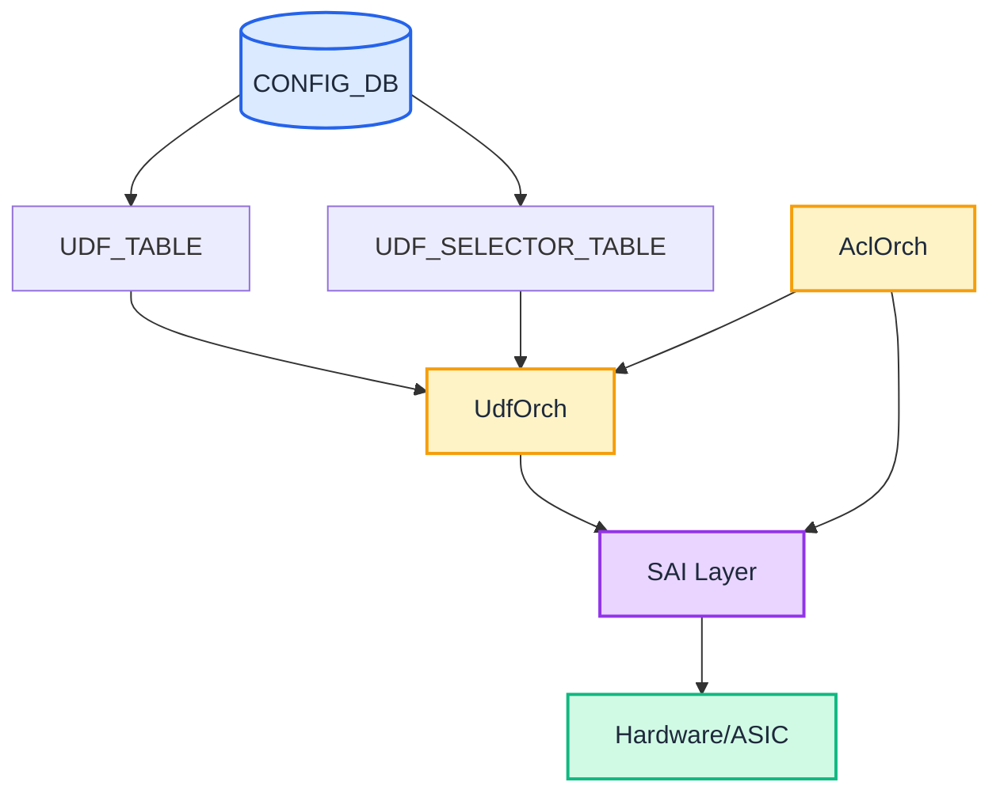
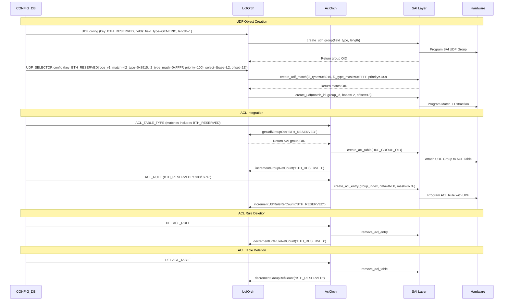

# User Defined Field (UDF) Feature in SONiC

## Table of Content

- [1. Revision](#1-revision)
- [2. Scope](#2-scope)
- [3. Definitions, Abbreviations & Quick Reference](#3-definitions-abbreviations--quick-reference)
  - [3.1 Quick Reference](#31-quick-reference)
- [4. Requirements](#4-requirements)
- [5. Architecture Design](#5-architecture-design)
- [6. High-Level Design](#6-high-level-design)
- [7. SAI API](#7-sai-api)
- [8. Configuration and Management](#8-configuration-and-management)
  - [8.1 YANG Model](#81-yang-model)
  - [8.2 Configuration Interface](#82-configuration-interface)
  - [8.3 STATE_DB and ASIC_DB](#83-state_db-and-asic_db)
- [9. Restrictions/Limitations](#9-restrictionslimitations)
  - [9.1 Platform and Feature Limitations](#91-platform-and-feature-limitations)
  - [9.2 Design Constraints](#92-design-constraints)
- [10. Testing Requirements/Design](#10-testing-requirementsdesign)
  - [10.1 Unit Tests](#101-unit-tests)
  - [10.2 System Tests](#102-system-tests)
  - [10.3 Negative Tests](#103-negative-tests)
- [11. Open/Action Items](#11-openaction-items)

## 1. Revision

| Revision | Date       | Author        | Description          |
|----------|------------|---------------|----------------------|
| 0.1      | 2026-04-21 | Satishkumar Rodd   | Initial version      |

## 2. Scope

A User-Defined Field (UDF) extends the ACL engine to match on arbitrary bytes at a fixed offset in the packet, beyond the standard L2/L3/L4 fields the hardware already understands. This lets operators write ACL rules against protocol fields the pipeline doesn't natively parse.

This document covers the high-level design for the User Defined Field (UDF) feature in SONiC, including:

- CONFIG_DB schema for `UDF` and `UDF_SELECTOR` tables
- UdfOrch manages the lifecycle of SAI UDF Group/Match/Object via direct SAI API calls and integrates with ACL for name resolution, attachment, and ref-counting.
- YANG model validation for UDF configuration

## 3. Definitions, Abbreviations & Quick Reference

| Term    | Description                                      |
|---------|--------------------------------------------------|
| UDF     | User Defined Field                               |
| SAI     | Switch Abstraction Interface                     |
| SWSS    | Switch State Service                             |
| ACL     | Access Control List                              |
| BTH     | Base Transport Header (InfiniBand/RoCE)          |
| RoCE    | RDMA over Converged Ethernet                     |
| GRE     | Generic Routing Encapsulation                    |
| OID     | Object Identifier                                |

### 3.1 Quick Reference

### How It Fits Together

Reading from ACL back to the packet — each layer answers one question:

```json
{
  "UDF": {
    "BTH_RESERVED": { "field_type": "GENERIC", "length": "1" }
  },
  "UDF_SELECTOR": {
    "BTH_RESERVED|roce_v1": {
      "select_base": "L2", "select_offset": "22",
      "match_l2_type": "0x8915", "match_l2_type_mask": "0xFFFF", "match_priority": "100"
    },
    "BTH_RESERVED|roce_v2": {
      "select_base": "L4", "select_offset": "16",
      "match_l3_type": "0x11", "match_l3_type_mask": "0xFF", "match_priority": "100"
    }
  },
  "ACL_TABLE_TYPE": { "ROCE_ACL_TYPE": { "matches": ["IN_PORTS","BTH_RESERVED"] } },
  "ACL_TABLE":      { "ROCE_TABLE":    { "type": "ROCE_ACL_TYPE", "stage": "ingress" } },
  "ACL_RULE":       { "ROCE_TABLE|BLOCK_RSVD": { "BTH_RESERVED": "0x00/0x7F", "PACKET_ACTION": "DROP" } }
}
```

### Object Roles(one-liner)

- **UDF** = WHERE and how big (udf_field position/length in ACL key)
- **UDF_SELECTOR** = WHEN and HOW to extract (packet type + base + offset)
- **ACL** = WHAT to match (data/mask + action)

**CONFIG_DB to SAI mapping:**
```
UDF["BTH_RESERVED"]                ──→ SAI_OBJECT_TYPE_UDF_GROUP

UDF_SELECTOR["BTH_RESERVED|roce_v1"]
  match_*                            ──→ SAI_OBJECT_TYPE_UDF_MATCH  (l2_type=0x8915)
  select_*                           ──→ SAI_OBJECT_TYPE_UDF        (L2+22)

UDF_SELECTOR["BTH_RESERVED|roce_v2"]
  match_*                            ──→ SAI_OBJECT_TYPE_UDF_MATCH  (l3_type=0x11)
  select_*                           ──→ SAI_OBJECT_TYPE_UDF        (L4+16, same UDF_GROUP)
```

### Key Constraints

| Constraint | Rule |
|------------|------|
| **UDF_SELECTOR key** | Composite `udf_field_name\|selector_name`; udf_field must exist in UDF table |
| **ACL Table** | ACL_TABLE_TYPE matches references udf_field names |
| **ACL Rule** | ACL_RULE uses udf_field name directly (e.g., `BTH_RESERVED: "0x00/0x7F"`) |

## 4. Requirements

### 4.1 Functional Requirements

| Requirement | Description |
|-------------|-------------|
| Custom field definition | Operator must be able to define named packet fields with configurable type (GENERIC for ACL, HASH for load balancing) and extraction length (1-255 bytes) |
| ACL integration | Defined fields must be usable directly as match qualifiers in ACL table types and ACL rules, including value/mask matching |
| CONFIG_DB configuration | All UDF configuration must be driven through CONFIG_DB with YANG schema validation |
| Dependency ordering | The system must handle out-of-order CONFIG_DB updates by retrying dependent objects until their prerequisites are available |

## 5. Architecture Design

### 5.1 System Architecture



**Key Components:**
- **UdfOrch**: Manages UDF and UDF_SELECTOR objects, provides udf_field OIDs to AclOrch
- **AclOrch**: Resolves udf_field names, attaches udf_fields to ACL tables, matches udf_field names in rules
- **SAI UDF API**: Creates SAI UDF groups, matches, and extraction objects (internal to UdfOrch)
- **SAI ACL API**: Attaches SAI UDF groups to ACL tables and applies UDF matching

### 5.2 ACL Integration Dependency

```
UDF (udf_field_name: "BTH_RESERVED")
    │
    ├─→ UDF_SELECTOR (key: "BTH_RESERVED|roce_v1", "match_l2_type"="0x8915", "select_base"="L2", "select_offset"="22")
    ├─→ UDF_SELECTOR (key: "BTH_RESERVED|roce_v2", "match_l3_type"="0x11",   "select_base"="L4", "select_offset"="16")
    │
    ├─→ ACL_TABLE_TYPE (matches field references udf_field name "BTH_RESERVED")
    │         │
    │         └─→ ACL_TABLE (uses table type, attaches udf_field to ACL)
    │                   │
    │                   └─→ ACL_RULE (field key is udf_field name: BTH_RESERVED: "0x00/0x7F")
```

**Key Flow**:
1. **UDF** defines the named udf_field `BTH_RESERVED`
2. **UDF_SELECTOR** entries under `BTH_RESERVED` define when/how to extract bytes for each packet type
3. **ACL_TABLE_TYPE** declares `BTH_RESERVED` in matches → attaches SAI UDF group to ACL table
4. **ACL_RULE** matches against `BTH_RESERVED` directly by udf_field name

### 5.3 Component Responsibilities

| Component | Location | Responsibilities |
|-----------|----------|------------------|
| **UdfOrch** | `udforch.cpp/h` | • Manages UDF and UDF_SELECTOR objects<br/>• For each UDF_SELECTOR entry, creates both a SAI UDF Match and SAI UDF object internally<br/>• Resolves udf_field names to SAI OIDs via `getUdfGroupOid()`<br/>• Tracks ACL table references via `incrementGroupRefCount()` / `decrementGroupRefCount()`<br/>• Blocks udf_field removal when ACL ref count > 0 |
| **AclOrch** | `aclorch.cpp` | • Resolves udf_field names in ACL_TABLE_TYPE matches to SAI OIDs<br/>• Attaches udf_fields to ACL tables and calls `incrementGroupRefCount()`<br/>• Calls `decrementGroupRefCount()` when an ACL table is removed<br/>• Applies UDF matching in ACL rules using udf_field name directly |

**Key Classes**:

| Class | Key Methods | Responsibility |
|-------|-------------|----------------|
| **UdfOrch** | `doUdfFieldTask()` (creates SAI UDF group)<br/>`doUdfSelectorTask()` (creates SAI UDF match + SAI UDF)<br/>`getUdfGroupOid(name)`<br/>`incrementGroupRefCount(name)`<br/>`decrementGroupRefCount(name)` | Orchestrates UDF lifecycle, resolves OIDs, enforces ref-count guard |
| **UdfGroup** | `create()`, `remove()`, `getOid()` | Manages SAI UDF group objects |
| **UdfMatch** | `create()`, `remove()`, `getOid()` | Manages SAI UDF match objects|
| **Udf** | `create()`, `remove()`, `getConfig()` | Manages SAI UDF objects (created per UDF_SELECTOR entry) |

**YANG Model Validation** (`sonic-udf.yang`):
- Schema validation for UDF configuration before writing to CONFIG_DB
- Enforces data type constraints (e.g., LENGTH: 1-255, OFFSET: 0-255)
- Validates mandatory fields and relationships between UDF objects

### 5.4 Configuration and Data Flow



**Key Steps:**
1. `UDF` → UdfOrch creates SAI UDF Group for the named udf_field (`BTH_RESERVED`)
2. `UDF_SELECTOR` → UdfOrch creates SAI UDF Match + SAI UDF for the extraction rule (`BTH_RESERVED|roce_v1`)
3. `ACL_TABLE_TYPE` → AclOrch attaches udf_field OID to ACL table, increments group ref count
4. `ACL_RULE` → AclOrch programs SAI ACL entry, increments rule ref count
5. `DEL ACL_RULE` → AclOrch removes SAI entry, decrements rule ref count
6. `DEL ACL_TABLE` → AclOrch removes SAI table, decrements group ref count

## 6. High-Level Design

### 6.1 Implementation Files

| File | Purpose |
|------|---------|
| `udforch.h/cpp` | UDF orchestrator implementation |
| `udf_constants.h` | Type mappings and constants |
| `orchdaemon.cpp` | Integration into orchagent |

### 6.2 Key Classes

| Class | Responsibility | SAI Object |
|-------|----------------|------------|
| `UdfGroup` | Manages SAI UDF group (field_type, length) | `SAI_OBJECT_TYPE_UDF_GROUP` |
| `UdfMatch` | Manages match criteria (L2/L3/GRE type+mask, priority) — shared across selectors with identical criteria | `SAI_OBJECT_TYPE_UDF_MATCH` |
| `Udf` | Manages field extraction (base, offset) — one SAI UDF object per UDF_SELECTOR entry | `SAI_OBJECT_TYPE_UDF` |
| `UdfOrch` | Orchestrates all UDF objects; processes `UDF` and `UDF_SELECTOR` CONFIG_DB tables | N/A |
| `UdfMatchSignature` | Content-equality key used for match deduplication (`l2_type`, `l3_type`, `gre_type`, masks, priority) | N/A |

### 6.3 Configuration Order

1. UDF (independent — defines the group)
2. UDF_SELECTOR (depends on UDF — group must exist)
3. ACL_TABLE_TYPE (references UDF group names in matches)
4. ACL_TABLE (uses ACL_TABLE_TYPE)
5. ACL_RULE (references UDF group names directly)


### 6.4 Orchestration Logic

**UdfOrch Processing Flow**:

1. **UDF Task** (key: `udf_field_name`, e.g., "BTH_RESERVED"):
   - Validate `field_type` (GENERIC/HASH) and `length` (1-255)
   - Call SAI `create_udf_group()` → store udf_field OID

2. **UDF_SELECTOR Task** (key: `udf_field_name|selector_name`, e.g., "BTH_RESERVED|roce_v1"):
   - Parse udf_field name from composite key; resolve to SAI group OID — **retry on next consumer cycle if parent UDF not yet created**
   - Validate `match` subgroup: L2/L3/GRE type + masks, `priority`; apply default exact-match masks if type is set but mask is omitted
   - Validate `select` subgroup: `base` (L2/L3/L4) and `offset` (0-255)
   - Look up `m_matchSigToName` for a shared match with identical criteria; if found, reuse the existing SAI UDF_MATCH object (increment `m_matchRefCount`); otherwise call SAI `create_udf_match()` and register in the deduplication maps
   - Call SAI `create_udf(match_id, group_id, base, offset)` → store udf OID
   - Record `m_selectorToMatchName[selectorKey] = matchName` for cleanup on deletion
   - **Idempotency**: if the object already exists with the same config, return success; if config differs, reject — SAI UDF fields are CREATE_ONLY and cannot be updated in place

**Match Deduplication**:

Multiple UDF_SELECTOR entries may have identical match criteria (e.g., two fields both selecting IPv4 packets). Rather than creating duplicate SAI UDF_MATCH objects, UdfOrch deduplicates them:

| Internal Map | Key | Value | Purpose |
|---|---|---|---|
| `m_matchSigToName` | `UdfMatchSignature` (all type/mask/priority fields) | match name | Find existing match by content |
| `m_matchRefCount` | match name | reference count | Delete SAI object only when count reaches 0 |
| `m_selectorToMatchName` | selector composite key | match name | Look up correct match on UDF_SELECTOR DEL |

On deletion of a UDF_SELECTOR, `releaseSharedMatch()` decrements the ref count and removes the SAI UDF_MATCH object only when the last user goes away.

**AclOrch Integration**:
- **ACL Table Creation**: Query UdfOrch via `getUdfGroupOid(udf_field_name)` → attach to ACL table via SAI → call `incrementGroupRefCount(udf_field_name)`
- **ACL Table Deletion**: Call `decrementGroupRefCount(udf_field_name)` after SAI table removal
- **ACL Rule Creation**: udf_field name in rule (e.g., `BTH_RESERVED`) maps directly to ACL key index — call `incrementUdfRuleRefCount(udf_field_name)`
- **ACL Rule Deletion**: Call `decrementUdfRuleRefCount(udf_field_name)`

**Deletion Guards**:
- **udf_field**: `removeUdfGroup()` checks `m_udfGroupRefCount[name] > 0` — rejected if any ACL table still holds a reference
- **UDF_SELECTOR**: deletion blocked if `m_udfRuleRefCount[udf_field_name] > 0` and this is the last selector for the field — rejected if any ACL rule still matches against it

**Platform Capability Check (UdfOrch ctor)**:

At startup, UdfOrch probes `sai_query_attribute_capability(gSwitchId, SAI_OBJECT_TYPE_UDF_GROUP, SAI_UDF_GROUP_ATTR_TYPE, &cap)`.
to determine the UDF support at hardware.

### 6.5 CONFIG_DB Schema

| Table | Key | Fields | Example |
|-------|-----|--------|---------|
| **UDF** | `<udf_field_name>` | `field_type` (GENERIC/HASH)<br/>`length` (1-255)<br/>`description` (optional) | Key: `BTH_RESERVED`<br/>`field_type="GENERIC"`<br/>`length="1"` |
| **UDF_SELECTOR** | `<udf_field_name>\|<selector_name>` | `select_base`, `select_offset`, `match_l2_type`, `match_l2_type_mask`, `match_l3_type`, `match_l3_type_mask`, `match_gre_type`, `match_gre_type_mask`, `match_l4_dst_port`, `match_l4_dst_port_mask`, `match_priority` | Key: `BTH_RESERVED\|roce_v1`<br/>`select_base="L2"`<br/>`select_offset="22"`<br/>`match_l2_type="0x8915"`<br/>`match_l2_type_mask="0xFFFF"`<br/>`match_priority="100"` |
| **ACL_TABLE_TYPE** | `<type_name>` | `matches` (udf_field names, comma-separated)<br/>`actions`<br/>`bind_points` | Key: `ROCE_ACL_TYPE`<br/>`matches="IN_PORTS,BTH_RESERVED"`<br/>`actions="PACKET_ACTION,COUNTER"`<br/>`bind_points="PORT"` |
| **ACL_TABLE** | `<table_name>` | `type`<br/>`ports`<br/>`stage` | Key: `ROCE_TABLE`<br/>`type="ROCE_ACL_TYPE"`<br/>`ports="Ethernet0"`<br/>`stage="ingress"` |
| **ACL_RULE** | `<table>\|<rule>` | `priority`<br/>`<udf_field_name>`: "value/mask"<br/>`PACKET_ACTION` | Key: `ROCE_TABLE\|BLOCK_RSVD`<br/>`priority="101"`<br/>`BTH_RESERVED="0x00/0x7F"`<br/>`PACKET_ACTION="DROP"` |

**UDF_SELECTOR field detail:**

| Field | Type | Description |
|-------|------|-------------|
| `select_base` | enum (L2/L3/L4) | Extraction base layer; mandatory |
| `select_offset` | uint8 (0-255) | Byte offset from base; mandatory |
| `match_l2_type` / `match_l2_type_mask` | hex string | EtherType value/mask (e.g., `0x8915`) |
| `match_l3_type` / `match_l3_type_mask` | hex string | IP protocol value/mask (e.g., `0x11`) |
| `match_gre_type` / `match_gre_type_mask` | hex string | GRE protocol type value/mask |
| `match_l4_dst_port` / `match_l4_dst_port_mask` | hex string | L4 destination port value/mask (e.g., `0x12B7` for RoCEv2 port 4791) |
| `match_priority` | uint8 (0-255) | Match priority; default 0 |

At least one of `match_l2_type`, `match_l3_type`, `match_gre_type`, `match_l4_dst_port` must be set.

**Key Design Points:**
- **UDF key is the udf_field name**: Used directly in ACL_TABLE_TYPE matches and ACL_RULE fields
- **UDF_SELECTOR composite key**: `udf_field_name|selector_name` — udf_field must exist in UDF table
- **ACL_RULE uses udf_field name**: `BTH_RESERVED: "0x00/0x7F"` — no separate name indirection
- **At least one match criteria required**: at least one of `l2_type`, `l3_type`, `gre_type`, or `l4_dst_port` must be set in UDF_SELECTOR
- **Mask defaulting**: if a type/port field is set but mask is omitted, defaults to exact-match (`0xFFFF`/`0xFF`)
- **One udf_field per rule**: A single ACL_RULE references each udf_field at most once
- **Value/mask format**: Hexadecimal `"0xVALUE/0xMASK"` in ACL_RULE


### 6.6 ACL Integration

**AclOrch Resolution Flow:**
1. Parse ACL_TABLE_TYPE matches → identify udf_field names (e.g., `BTH_RESERVED`, `BTH_OPCODE`)
2. Query UdfOrch: `getUdfGroupOid(udf_field_name)` → get SAI group OID
3. Attach to ACL table: `SAI_ACL_TABLE_ATTR_USER_DEFINED_FIELD_GROUP_MIN + index` with SAI group OID
4. For ACL rule field `BTH_RESERVED: "0x00/0x7F"` → resolve udf_field name to index → apply `SAI_ACL_ENTRY_ATTR_USER_DEFINED_FIELD_GROUP_MIN + index` with byte array data/mask

**Example: Two udf_fields, Multiple Selectors (RoCE BTH Reserved + Opcode)**
```json
{
  "UDF": {
    "BTH_RESERVED": {"field_type": "GENERIC", "length": "1"},
    "BTH_OPCODE":   {"field_type": "GENERIC", "length": "1"}
  },
  "UDF_SELECTOR": {
    "BTH_RESERVED|roce_v1": {"select_base": "L2", "select_offset": "22", "match_l2_type": "0x8915", "match_l2_type_mask": "0xFFFF", "match_priority": "100"},
    "BTH_OPCODE|roce_v1":   {"select_base": "L2", "select_offset": "14", "match_l2_type": "0x8915", "match_l2_type_mask": "0xFFFF", "match_priority": "100"}
  },
  "ACL_TABLE_TYPE": {
    "ROCE_ACL_TYPE": {"matches": "IN_PORTS,BTH_RESERVED,BTH_OPCODE", "actions": "PACKET_ACTION,COUNTER", "bind_points": "PORT"}
  },
  "ACL_TABLE": {"ROCE_TABLE": {"type": "ROCE_ACL_TYPE", "ports": "Ethernet0", "stage": "ingress"}},
  "ACL_RULE": {
    "ROCE_TABLE|BLOCK_RSVD":  {"priority": "101", "BTH_RESERVED": "0x00/0x7F", "PACKET_ACTION": "DROP"},
    "ROCE_TABLE|BLOCK_OPCODE":{"priority": "100", "BTH_OPCODE": "0x04/0xFF",   "PACKET_ACTION": "DROP"}
  }
}
```

## 7. SAI API

### 7.1 UDF Group API

**API Function**: `sai_create_udf_group_fn`

**Attributes**:

| Attribute | Type | Flags | Description |
|-----------|------|-------|-------------|
| `SAI_UDF_GROUP_ATTR_TYPE` | `sai_udf_field_type_t` | CREATE_ONLY | Group type: `SAI_UDF_GROUP_TYPE_GENERIC` or `SAI_UDF_GROUP_TYPE_HASH` |
| `SAI_UDF_GROUP_ATTR_LENGTH` | `sai_uint16_t` | MANDATORY_ON_CREATE, CREATE_ONLY | Total extraction length in bytes (1-255) |
| `SAI_UDF_GROUP_ATTR_UDF_LIST` | `sai_object_list_t` | READ_ONLY | List of UDF objects in this group |

**API Calls**:
- **Create**: `sai_udf_api->create_udf_group(&group_id, switch_id, attr_count, attr_list)`
- **Remove**: `sai_udf_api->remove_udf_group(group_id)`

### 7.2 UDF Match API

**API Function**: `sai_create_udf_match_fn`

**Attributes**:

| Attribute | Type | Flags | Description |
|-----------|------|-------|-------------|
| `SAI_UDF_MATCH_ATTR_L2_TYPE` | `sai_acl_field_data_t` (uint16) | CREATE_ONLY | EtherType value and mask (e.g., 0x0800 for IPv4) |
| `SAI_UDF_MATCH_ATTR_L3_TYPE` | `sai_acl_field_data_t` (uint8) | CREATE_ONLY | IP Protocol value and mask (e.g., 0x11 for UDP) |
| `SAI_UDF_MATCH_ATTR_GRE_TYPE` | `sai_acl_field_data_t` (uint16) | CREATE_ONLY | GRE Protocol Type value and mask |
| `SAI_UDF_MATCH_ATTR_L4_DST_PORT_TYPE` | `sai_acl_field_data_t` (uint16) | CREATE_ONLY | L4 destination port value and mask (e.g., 4791 for RoCE v2 UDP) |
| `SAI_UDF_MATCH_ATTR_PRIORITY` | `sai_uint8_t` | CREATE_ONLY | Match priority (0-255) |

**API Calls**:
- **Create**: `sai_udf_api->create_udf_match(&match_id, switch_id, attr_count, attr_list)`
- **Remove**: `sai_udf_api->remove_udf_match(match_id)`

**Note**: At least one of L2_TYPE, L3_TYPE, or GRE_TYPE must be specified. Each type includes both data and mask fields.

### 7.3 UDF API

**API Function**: `sai_create_udf_fn`

**Attributes**:

| Attribute | Type | Flags | Description |
|-----------|------|-------|-------------|
| `SAI_UDF_ATTR_MATCH_ID` | `sai_object_id_t` | MANDATORY_ON_CREATE, CREATE_ONLY | Reference to UDF Match object |
| `SAI_UDF_ATTR_GROUP_ID` | `sai_object_id_t` | MANDATORY_ON_CREATE, CREATE_ONLY | Reference to UDF Group object |
| `SAI_UDF_ATTR_BASE` | `sai_udf_base_t` | CREATE_AND_SET | Extraction base: `SAI_UDF_BASE_L2`, `SAI_UDF_BASE_L3`, or `SAI_UDF_BASE_L4` |
| `SAI_UDF_ATTR_OFFSET` | `sai_uint16_t` | MANDATORY_ON_CREATE, CREATE_ONLY | Byte offset from base (0-255) |
| `SAI_UDF_ATTR_HASH_MASK` | `sai_u8_list_t` | CREATE_AND_SET | Hash mask (only for HASH type groups) |

**API Calls**:
- **Create**: `sai_udf_api->create_udf(&udf_id, switch_id, attr_count, attr_list)`
- **Remove**: `sai_udf_api->remove_udf(udf_id)`

### 7.4 ACL Integration API

**UDF Group Attachment to ACL Table**:

| Attribute | Type | Flags | Description |
|-----------|------|-------|-------------|
| `SAI_ACL_TABLE_ATTR_USER_DEFINED_FIELD_GROUP_MIN + index` | `sai_object_id_t` | CREATE_ONLY | Attach UDF group OID to ACL table at specified index (0-255) |

**Details**:
- The index value (0-255) is added to `SAI_ACL_TABLE_ATTR_USER_DEFINED_FIELD_GROUP_MIN`
- Each index corresponds to one UDF field.
- The UDF group OID is passed as the attribute value
- Field length is derived from the UDF group's `SAI_UDF_GROUP_ATTR_LENGTH`

**API Call**: `sai_acl_api->create_acl_table(&table_id, switch_id, attr_count, attr_list)`

**UDF Matching in ACL Entry**:

| Attribute | Type | Flags | Description |
|-----------|------|-------|-------------|
| `SAI_ACL_ENTRY_ATTR_USER_DEFINED_FIELD_GROUP_MIN + index` | `sai_acl_field_data_t sai_u8_list_t` | CREATE_AND_SET | Match on extracted UDF field with data/mask byte arrays |

**Details**:
- The index must match the index used in the ACL table
- Data type is `sai_acl_field_data_t` containing `sai_u8_list_t` for both data and mask
- Byte array length must match the UDF group's `SAI_UDF_GROUP_ATTR_LENGTH`
- Both `data.list` and `mask.list` must be specified with `count` field

**API Call**: `sai_acl_api->create_acl_entry(&entry_id, switch_id, attr_count, attr_list)`

### 7.5 API Usage Flow

1. **Create UDF Group**: Set TYPE and LENGTH attributes
2. **Create UDF Match**: Set L2/L3/GRE TYPE and PRIORITY attributes
3. **Create UDF**: Set MATCH_ID, GROUP_ID, BASE, and OFFSET attributes
4. **Attach to ACL Table**: Use `SAI_ACL_TABLE_ATTR_USER_DEFINED_FIELD_GROUP_MIN + index` with group_id OID
5. **Match in ACL Rule**: Use `SAI_ACL_ENTRY_ATTR_USER_DEFINED_FIELD_GROUP_MIN + index` with byte array data/mask

### 7.6 ACL Integration Example

**Scenario**: Match RoCE v1 packets where the BTH Reserved field (byte 8 of BTH, at L2 offset 22, 1 byte) equals `0x00` in its 7 reserved bits — illustrates the SAI ternary-match syntax (`data/mask`). Blocking protocol-violating packets (reserved ≠ 0) requires the two-rule pattern shown in Appendix A.1.

**Step 1: Create SAI UDF Group for BTH_RESERVED (length = 1 byte)**
```c
sai_attribute_t group_attrs[2];
group_attrs[0].id = SAI_UDF_GROUP_ATTR_TYPE;
group_attrs[0].value.s32 = SAI_UDF_GROUP_TYPE_GENERIC;
group_attrs[1].id = SAI_UDF_GROUP_ATTR_LENGTH;
group_attrs[1].value.u16 = 1;  // 1 byte (BTH Reserved field)
sai_udf_api->create_udf_group(&group_id, switch_id, 2, group_attrs);
```

**Step 2: Create SAI UDF Match (RoCE v1 packets, EtherType 0x8915)**
```c
sai_attribute_t match_attrs[2];
match_attrs[0].id = SAI_UDF_MATCH_ATTR_L2_TYPE;
match_attrs[0].value.aclfield.data.u16 = 0x8915;  // RoCE v1 EtherType
match_attrs[0].value.aclfield.mask.u16 = 0xFFFF;
match_attrs[1].id = SAI_UDF_MATCH_ATTR_PRIORITY;
match_attrs[1].value.u8 = 100;
sai_udf_api->create_udf_match(&match_id, switch_id, 2, match_attrs);
```

**Step 3: Create SAI UDF (L2 base, offset 22 — BTH byte 8, 7-bit reserved field)**
```c
sai_attribute_t udf_attrs[4];
udf_attrs[0].id = SAI_UDF_ATTR_MATCH_ID;
udf_attrs[0].value.oid = match_id;
udf_attrs[1].id = SAI_UDF_ATTR_GROUP_ID;
udf_attrs[1].value.oid = group_id;
udf_attrs[2].id = SAI_UDF_ATTR_BASE;
udf_attrs[2].value.s32 = SAI_UDF_BASE_L2;
udf_attrs[3].id = SAI_UDF_ATTR_OFFSET;
udf_attrs[3].value.u16 = 22;  // Ethernet(14B) + BTH byte 8 = L2+22
sai_udf_api->create_udf(&udf_id, switch_id, 4, udf_attrs);
```

**Step 4: Attach SAI UDF Group to ACL Table (BTH_RESERVED at index 0)**
```c
sai_attribute_t table_attrs[3];
table_attrs[0].id = SAI_ACL_TABLE_ATTR_ACL_STAGE;
table_attrs[0].value.s32 = SAI_ACL_STAGE_INGRESS;
table_attrs[1].id = SAI_ACL_TABLE_ATTR_ACL_BIND_POINT_TYPE_LIST;
table_attrs[1].value.objlist.count = 1;
table_attrs[1].value.objlist.list[0] = SAI_ACL_BIND_POINT_TYPE_PORT;
// Attach BTH_RESERVED udf_field at index 0
table_attrs[2].id = SAI_ACL_TABLE_ATTR_USER_DEFINED_FIELD_GROUP_MIN + 0;
table_attrs[2].value.oid = group_id;
sai_acl_api->create_acl_table(&table_id, switch_id, 3, table_attrs);
```

**Step 5: Create ACL Entry — match BTH Reserved == 0x00 (mask 0x7F, 7 reserved bits)**
```c
sai_attribute_t entry_attrs[2];
entry_attrs[0].id = SAI_ACL_ENTRY_ATTR_TABLE_ID;
entry_attrs[0].value.oid = table_id;
// Match BTH_RESERVED at index 0: (byte & 0x7F) == 0x00
entry_attrs[1].id = SAI_ACL_ENTRY_ATTR_USER_DEFINED_FIELD_GROUP_MIN + 0;
entry_attrs[1].value.aclfield.enable = true;
entry_attrs[1].value.aclfield.data.u8list.count = 1;
entry_attrs[1].value.aclfield.data.u8list.list[0] = 0x00;  // match value
entry_attrs[1].value.aclfield.mask.u8list.count = 1;
entry_attrs[1].value.aclfield.mask.u8list.list[0] = 0x7F;  // 7-bit reserved field mask
sai_acl_api->create_acl_entry(&entry_id, switch_id, 2, entry_attrs);
```

## 8. Configuration and Management

### 8.1 YANG Model

**File**: `sonic-udf.yang`

| Table | Validation | Constraints |
|-------|------------|-------------|
| **UDF** | `field_type` (enum: GENERIC/HASH)<br/>`length` (1-255) | Mandatory fields |
| **UDF_SELECTOR** | `select_base` (enum: L2/L3/L4), `select_offset` (uint8 0-255), `match_l2_type`/`match_l3_type`/`match_gre_type`/`match_l4_dst_port` (hex string), their masks, `match_priority` (uint8 0-255) | `select_base` and `select_offset` mandatory; at least one of `match_l2_type`/`match_l3_type`/`match_gre_type`/`match_l4_dst_port` required; parent UDF entry must exist (leafref) |

### 8.2 Configuration Interface

No dedicated `config udf` / `show udf` CLI is provided. Configuration is applied via **GCU (Generic Config Update)** as the preferred path, with `sonic-cfggen` and `redis-cli` available as lower-level alternatives. All three rely on the same CONFIG_DB schema and are gated by the `sonic-udf.yang` model.

**GCU (preferred)** — atomic, YANG-validated JSON patch:

```bash
sudo config apply-patch <<'EOF'
[
  {"op":"add","path":"/UDF/BTH_RESERVED",
   "value":{"field_type":"GENERIC","length":"1"}},
  {"op":"add","path":"/UDF_SELECTOR/BTH_RESERVED|roce_v1",
   "value":{"select_base":"L2","select_offset":"22",
            "match_l2_type":"0x8915","match_l2_type_mask":"0xFFFF",
            "match_priority":"100"}}
]
EOF
```

**sonic-cfggen** — load from a JSON file at boot or on demand:

```bash
sonic-cfggen -j udf.json --write-to-db
```

**redis-cli** — direct hash writes; bypasses YANG validation, use for debug only:

```bash
redis-cli -n 4 HSET "UDF|BTH_RESERVED" field_type GENERIC length 1
redis-cli -n 4 HSET "UDF_SELECTOR|BTH_RESERVED|roce_v1" \
    select_base L2 select_offset 22 \
    match_l2_type 0x8915 match_l2_type_mask 0xFFFF match_priority 100
```

UDF state can be inspected via ASIC_DB

### 8.3 STATE_DB and ASIC_DB

UdfOrch does **not** write to STATE_DB. Successful SAI programming is reflected in ASIC_DB.

**ASIC_DB entries written on successful UDF programming:**

| ASIC_DB Key | Content |
|-------------|---------|
| `ASIC_STATE:SAI_OBJECT_TYPE_UDF_GROUP:<oid>` | `SAI_UDF_GROUP_ATTR_TYPE`, `SAI_UDF_GROUP_ATTR_LENGTH` |
| `ASIC_STATE:SAI_OBJECT_TYPE_UDF_MATCH:<oid>` | `SAI_UDF_MATCH_ATTR_L2_TYPE` / `L3_TYPE` / `GRE_TYPE`, `SAI_UDF_MATCH_ATTR_PRIORITY` |
| `ASIC_STATE:SAI_OBJECT_TYPE_UDF:<oid>` | `SAI_UDF_ATTR_MATCH_ID`, `SAI_UDF_ATTR_GROUP_ID`, `SAI_UDF_ATTR_BASE`, `SAI_UDF_ATTR_OFFSET` |

To verify UDF programming, query ASIC_DB:
```bash
redis-cli -n 1 KEYS "ASIC_STATE:SAI_OBJECT_TYPE_UDF*"
redis-cli -n 1 HGETALL "ASIC_STATE:SAI_OBJECT_TYPE_UDF_GROUP:<oid>"
```


## 9. Restrictions/Limitations

### 9.1 Platform and Feature Limitations

| Category | Limitation | Status/Details |
|----------|------------|----------------|
| **Resource Limits** | Platform-dependent | Discovered through SAI errors when exhausted |
| **Base Types** | L2, L3, L4 only | No extended base types beyond L4 |
| **CLI** | Not implemented | Direct CONFIG_DB manipulation required |
| **Boot model** | Cold-boot only  | On orchagent restart (config reload, crash-restart, warm-reboot-attempted), UdfOrch flushes stale ASIC_DB UDF objects and reprograms from CONFIG_DB. Operators using UDF should set `warm_restart_enable=false`. Full convergence after an orchagent-only crash-restart may require a swss-container restart. |
| **CRM resource tracking** | Not implemented | UDF objects are not tracked by CRM. `show crm` does not warn before hardware UDF group limits are exhausted. Exhaustion surfaces as `SAI_STATUS_INSUFFICIENT_RESOURCES` in syslog only. |
| **HASH type UDF** | Schema accepted; ECMP wiring not implemented | `field_type=HASH` creates the SAI UDF_GROUP object but is not wired to the ECMP hash pipeline.|
| **Base anchors and inner headers** | `select_base` anchors at the outermost L2/L3/L4; no SAI primitive for an "inner" base | Inner fields of encapsulated packets (VXLAN, IPinIP, GRE payload) are reachable only by computing an offset that spans the outer headers + encap header sizes — they cannot be anchored directly. Variable-length encap headers (GRE K/C/S flags, TCP options) are not accounted for; the operator is responsible for any header-length variation. |
| **Parser scan depth** | Offset validated to 0–255 by SAI only; effective reach is ASIC-parser-bound | `SAI_UDF_ATTR_OFFSET` has no parser-depth attribute. If the chosen offset exceeds the ASIC's parser scan limit, `create_udf` succeeds but packets silently miss at runtime. The operator must know the target platform's parser reach. |

## 10. Testing Requirements/Design

### 10.1 Unit Tests

Orchagent unit tests live in `sonic-swss/tests/mock_tests/udforch_ut.cpp`, linked into the existing aclorch unit test binary.

- UdfGroup: create/remove, validation (length, field_type)
- UdfMatch: L2 / L3 / GRE / L4_DST_PORT matching, priority validation
- Udf: dependency handling, offset/base validation
- UdfOrch: CONFIG_DB subscription, group OID resolution, ref-count tracking

### 10.2 System Tests

System tests live in `sonic-net/sonic-mgmt` at `tests/udf/test_udf.py` (sonic-mgmt PR — Open Item #9). Topology: one DUT + PTF (`pytest.mark.topology("t0", "t1")`). All CONFIG_DB writes go through `sonic-cfggen -j -w`; SAI object correctness is verified by diffing ASIC_DB OID sets before and after each operation.

Module baseline (programmed by the suite's setup fixture):

```
UDF|G0                       length=3  field_type=GENERIC
UDF|G1                       length=3  field_type=GENERIC
UDF_SELECTOR|G0|udp_l4       select_base=L4  select_offset=0  match_l3_type=0x11
UDF_SELECTOR|G0|proto18_l3   select_base=L3  select_offset=0  match_l3_type=0x12
UDF_SELECTOR|G1|proto18_l3   select_base=L3  select_offset=0  match_l3_type=0x12
ACL_TABLE_TYPE|T1            MATCHES=IN_PORTS,G0,G1  ACTIONS=PACKET_ACTION,COUNTER
ACL_TABLE|TABLE1             type=T1  ports=<UP intf>  stage=ingress
ACL_RULE|TABLE1|RULE_A       priority=101  G0=0x33/0xff  G1=0x44/0xff  PACKET_ACTION=DROP
ACL_RULE|TABLE1|RULE_B       priority=101  G0=0x34/0xff  G1=0x45/0xff  PACKET_ACTION=DROP
```

UDP traffic uses `sport=0x3333 / dport=0x3333`, producing 3 bytes of `0x33` at L4 offset 0 (matches `RULE_A`'s G0 pattern).

#### 10.2.1 Baseline programming

| Step | Goal | Expected results |
|-|-|-|
| Apply baseline config (UDF, selectors, ACL_TABLE_TYPE, ACL_TABLE, RULE_A, RULE_B) | Pipeline programs cleanly | ASIC_DB has expected UDF_GROUP / UDF_MATCH / UDF / ACL_TABLE / ACL_ENTRY OIDs; UDF_GROUP refcount = 4 (TABLE_TYPE + TABLE + RULE_A + RULE_B) |

#### 10.2.2 End-to-end traffic

UDP at L4 offset 0; G0 length=3 extracts 3 bytes; rule matches `0x33/0xff` per byte.

| Step | Goal | Expected results |
|-|-|-|
| Install `RULE_UDP` (G0=0x33/0xff, priority=200); send 500 UDP packets `sport=0x3333 dport=0x3333` | UDF match — drop | `RULE_UDP` counter delta ≥ 50 |
| Send 500 UDP packets `sport=0x4444 dport=0x4444` | UDF non-match — forward | `RULE_UDP` counter delta ≤ 10 |
| Send 500 UDP packets `sport=0x3232 dport=0x3232` | UDF mask check | No match (mask 0xff requires exact 0x33) |
| Delete `RULE_UDP` from CONFIG_DB | ACL rule remove | `ACL_ENTRY` OID for `RULE_UDP` removed; G0 selectors retained |

#### 10.2.3 UDF/ACL dependency and teardown order

| Step | Goal | Expected results |
|-|-|-|
| Delete `UDF\|G0` while selectors and rules still reference it | Wrong-order delete — recoverable | UDF_GROUP retained; orchagent logs error; correct-order delete after still succeeds |
| Top-down teardown: rules → selectors → group | Ordered teardown | All ACL_ENTRY / UDF / UDF_GROUP OIDs removed in dependency order; recreate works |

#### 10.2.4 ACL rule priority

| Step | Goal | Expected results |
|-|-|-|
| Install `R_LOW` (priority=50, G0=0x33) and `RULE_UDP` (priority=200, G0=0x33); send matching UDP | Higher rule priority wins | `RULE_UDP` counter increments; `R_LOW` does not |

#### 10.2.5 Forward reference resolution

| Step | Goal | Expected results |
|-|-|-|
| Write `ACL_TABLE_TYPE\|T_FWD` (references `G_FWD`) before `UDF\|G_FWD` and `UDF_SELECTOR\|G_FWD\|test` exist; then create them | Forward reference resolves | TABLE_TYPE OID appears only after `G_FWD` + selector arrive |

#### 10.2.6 Multiple selectors per group

| Step | Goal | Expected results |
|-|-|-|
| Baseline: G0 with 2 selectors, G1 with 1 selector | Distinct selectors — distinct OIDs | ≥ 2 SAI UDF OIDs for G0, ≥ 1 for G1; distinct match configs produce distinct UDF_MATCH OIDs |

#### 10.2.7 SAI attribute correctness

Covers all four match-type round-trips, all three base round-trips, auto-mask fill, and match-presence regressions.

| Step | Goal | Expected results |
|-|-|-|
| Selector `match_l2_type=0x0800` | L2_TYPE attr round-trip | UDF_MATCH OID has `SAI_UDF_MATCH_ATTR_L2_TYPE = 0x0800` |
| Selector `match_l3_type=0x06` | L3_TYPE attr round-trip | UDF_MATCH OID has `SAI_UDF_MATCH_ATTR_L3_TYPE = 0x06` |
| Selector `match_gre_type=0x6558` | GRE_TYPE attr round-trip | UDF_MATCH OID has `SAI_UDF_MATCH_ATTR_GRE_TYPE = 0x6558` |
| Selector `match_l4_dst_port=0x12B7` | L4_DST_PORT attr round-trip | UDF_MATCH OID has `SAI_UDF_MATCH_ATTR_L4_DST_PORT_TYPE = 0x12B7` |
| Selector `match_l3_type=0x06` with no explicit mask | Auto-mask fill | UDF_MATCH `L3_TYPE` mask = 0xFF |
| Selector `select_base=L2 select_offset=12` | L2 base round-trip | UDF OID has `SAI_UDF_ATTR_BASE = SAI_UDF_BASE_L2` |
| Selector `select_base=L3 select_offset=4` | L3 base round-trip | UDF OID has BASE = `SAI_UDF_BASE_L3` |
| Selector `select_base=L4 select_offset=0` | L4 base round-trip | UDF OID has BASE = `SAI_UDF_BASE_L4` |
| Selector `match_l4_dst_port=0` with explicit `mask=0xFFFF` | Port-0 match — explicit | UDF_MATCH OID has L4_DST_PORT=0, MASK=0xFFFF |
| Selector `match_l4_dst_port=0` with no mask | Port-0 match — auto-fill | UDF_MATCH OID present; port-0 is matchable |
| Selector with only `match_l2_type=0x0800` (no other match fields) | Single-field match | UDF_MATCH OID created with L2_TYPE attr |

#### 10.2.8 Match-type traffic filtering

| Step | Goal | Expected results |
|-|-|-|
| Selector `match_l2_type=0x0800`; send IPv4 UDP | L2 ethertype filter | ACL counter increments |
| Selector `match_l4_dst_port=0x12B7`; send UDP with `dport=4791` | L4 dst-port match | ACL counter increments |
| Selector `match_l4_dst_port=0x12B7`; send UDP with `dport=80` | L4 dst-port non-match | No counter increment |
| Selector `match_l2_type=0x86DD`; send IPv6 UDP | L2 match — IPv6 | ACL counter increments |

#### 10.2.9 Reference counting

Covers UDF_MATCH dedup across groups, UDF_GROUP refcount across ACL layers, and ACL_RULE refcount on selectors.

| Step | Goal | Expected results |
|-|-|-|
| Two selectors in different groups with identical match config | UDF_MATCH dedup | One shared UDF_MATCH OID; removing one selector retains it; removing both frees it |
| `ACL_TABLE_TYPE\|T1` references G0 (no TABLE or rules) | TABLE_TYPE refcount holds | Deleting G0 rejected |
| Add `ACL_TABLE\|TABLE1` referencing T1 | TABLE refcount independent | Deleting TABLE_TYPE alone rejected while TABLE references G0 |
| Two TABLEs both reference T1 | Refcount stacks | Deleting one TABLE leaves G0 still held |
| With RULE_A + RULE_B referencing G0 (G0 has 2 selectors), delete one selector | Intermediate selector deletable | First selector removed; G0 still programmed |
| After full ACL teardown, delete the last G0 selector | Last selector deletable | Last selector removed cleanly when refcount = 0 |

#### 10.2.10 Immutability and idempotency

| Step | Goal | Expected results |
|-|-|-|
| Re-write `UDF_SELECTOR\|G0\|udp_l4` with identical values | Identical SET — no-op | No ASIC_DB churn; OIDs unchanged |
| Delete `UDF\|G0` while selectors reference it | Delete-while-referenced — recoverable | UDF_GROUP retained; correct delete sequence after succeeds |
| Replay identical SET twice on a committed selector | Idempotent SET — no refcount leak | Single delete frees UDF_MATCH cleanly |

#### 10.2.11 Validation edge cases

| Step | Goal | Expected results |
|-|-|-|
| ACL_RULE references `G_T` which is in udforch but NOT in TABLE's MATCHES | UDF outside MATCHES — accepted | ACL_ENTRY OID created |
| Delete non-existent `UDF_SELECTOR\|NONEXISTENT\|phantom` | Double-delete — no-op | No ASIC_DB change |
| Delete non-existent `UDF\|NONEXISTENT_GROUP` | Double-delete (group) — no-op | No ASIC_DB change |
| Delete `ACL_TABLE_TYPE\|T1` while `ACL_TABLE\|TABLE1` references it | TABLE_TYPE delete blocked by TABLE | TABLE_TYPE retained; error logged |

### 10.3 Negative Tests

#### 10.3.1 Invalid CONFIG_DB

| Step | Goal | Expected results |
|-|-|-|
| Push `UDF\|G_ZERO` with `length=0` | YANG length constraint | Write rejected; no UDF_GROUP OID |
| Push `ACL_RULE` with match value `not_a_hex/0xff` | Malformed hex | No ACL_ENTRY OID; orchagent logs error |
| Push `ACL_RULE` referencing non-existent group `G9` | Unresolvable UDF reference | No ACL_ENTRY OID |
| Push `UDF_SELECTOR` with `select_offset=200` | Large in-range offset — no crash | Existing UDF_GROUP / UDF_MATCH / UDF OIDs retained |

#### 10.3.2 Selector field validation

| Step | Goal | Expected results |
|-|-|-|
| Push `UDF_SELECTOR` missing `select_base` | Mandatory field check | Rejected; no UDF_MATCH OID |
| Push `UDF_SELECTOR` with unknown `select_base` value | Enum constraint | Rejected |
| Push `UDF_SELECTOR` with only `match_priority` and no L2 / L3 / GRE / L4_DST_PORT | At-least-one-match check | Rejected |

## 11. Open/Action Items

| # | Item | Owner |
|---|------|-------|
| 1 | CLI support (`show udf`, `config udf`) | TBD |
| 2 | STATE_DB observability (OID + programming status) | TBD |
| 3 | Platform validation beyond Broadcom TH5 (Mellanox Spectrum, Marvell Prestera, Cisco 8000) | Platform vendors |
| 4 | Warm-restart hitless reconciliation | TBD |
| 5 | Multi-ASIC / VoQ-chassis support | TBD |
| 6 | CRM counters for UDF_GROUP / UDF_MATCH / UDF | TBD |
| 7 | HASH type UDF — ECMP hash pipeline wiring via HashOrch | TBD |
| 8 | Operator notification for rejected config (STATE_DB status, requires item 2) | TBD |
| 9 | sonic-mgmt E2E test suite — parallel PR | Satishkumar |

## Appendix A: Configuration Examples

### A.1 RoCE BTH Reserved Field (ACL — drop non-compliant packets)
```json
{
  "UDF": {
    "BTH_RESERVED": {"field_type": "GENERIC", "length": "1"}
  },
  "UDF_SELECTOR": {
    "BTH_RESERVED|roce_v1": {"select_base": "L2", "select_offset": "22", "match_l2_type": "0x8915", "match_l2_type_mask": "0xFFFF", "match_priority": "100"},
    "BTH_RESERVED|roce_v2": {"select_base": "L4", "select_offset": "16", "match_l3_type": "0x11", "match_l3_type_mask": "0xFF", "match_priority": "100"}
  },
  "ACL_TABLE_TYPE": {
    "ROCE_ACL_TYPE": {"matches": "IN_PORTS,BTH_RESERVED", "actions": "PACKET_ACTION,COUNTER", "bind_points": "PORT"}
  },
  "ACL_TABLE": {
    "ROCE_TABLE": {"type": "ROCE_ACL_TYPE", "ports": "Ethernet0", "stage": "ingress"}
  },
  "ACL_RULE": {
    "ROCE_TABLE|BLOCK_RSVD": {"priority": "101", "BTH_RESERVED": "0x00/0x7F", "PACKET_ACTION": "DROP"}
  }
}
```

**Configuration → SAI → FP walkthrough**

The diagram below traces the configuration above through three layers: CONFIG_DB schema, SAI objects programmed by UdfOrch + AclOrch, and the forwarding pipeline (FP). FP behavior varies by vendor SDK; the diagram describes it abstractly.

```
┌────────────────────────────────────────────────────────────────────┐
│ Layer 1: CONFIG_DB                                                 │
│   UDF             BTH_RESERVED  (GENERIC, length=1)                │
│   UDF_SELECTOR    BTH_RESERVED|roce_v1                             │
│                     match_l2_type=0x8915                           │
│                     select_base=L2  select_offset=22               │
│   UDF_SELECTOR    BTH_RESERVED|roce_v2                             │
│                     match_l3_type=0x11                             │
│                     select_base=L4  select_offset=16               │
│   ACL_TABLE_TYPE  ROCE_ACL_TYPE   matches=IN_PORTS,BTH_RESERVED    │
│   ACL_TABLE       ROCE_TABLE                                       │
│   ACL_RULE        BLOCK_RSVD      BTH_RESERVED=0x00/0x7F → DROP    │
└─────────────────────────────────┬──────────────────────────────────┘
                                  │  UdfOrch + AclOrch
                                  ▼
┌────────────────────────────────────────────────────────────────────┐
│ Layer 2: SAI objects                                               │
│   UDF_GROUP   G1   length=1, type=GENERIC                          │
│   UDF_MATCH   M1   L2_TYPE=0x8915                                  │
│   UDF_MATCH   M2   L3_TYPE=0x11                                    │
│   UDF         U1   GROUP=G1, MATCH=M1, BASE=L2, OFFSET=22          │
│   UDF         U2   GROUP=G1, MATCH=M2, BASE=L4, OFFSET=16          │
│   ACL_TABLE        USER_DEFINED_FIELD_GROUP_MIN+0 = G1             │
│   ACL_ENTRY        USER_DEFINED_FIELD_GROUP_MIN+0 = 0x00/0x7F      │
│                    PACKET_ACTION=DROP, priority=101                │
└─────────────────────────────────┬──────────────────────────────────┘
                                  │  vendor SAI → SDK
                                  ▼
┌────────────────────────────────────────────────────────────────────┐
│ Layer 3: Forwarding pipeline (abstract)                            │
│                                                                    │
│   The UDF group owns a slot in the ACL key:                        │
│                                                                    │
│       ACL key  =  [ standard fields | G1 slot (1 byte) | ... ]     │
│                                                                    │
│   Many parse-stage entries can WRITE into G1's slot;               │
│   the ACL FP entry READS G1's slot and is blind to which           │
│   parse entry filled it.                                           │
│                                                                    │
│   UDF parse stage                                                  │
│     entry from (M1, U1)   classify L2 EtherType == 0x8915          │
│                           write G1 ← byte at L2+22                 │
│     entry from (M2, U2)   classify L3 Protocol  == 0x11            │
│                           write G1 ← byte at L4+16                 │
│                                                                    │
│   ACL lookup stage                                                 │
│     entry from BLOCK_RSVD read G1, match 0x00/0x7F → DROP          │
└────────────────────────────────────────────────────────────────────┘
```

**Role of the UDF group in the FP**

The UDF group is the binding entity between extraction and ACL match. Every UDF group referenced by an ACL table claims a fixed-width slot in that table's ACL key (slot width = `SAI_UDF_GROUP_ATTR_LENGTH`). Every UDF object created against that group is a parse-stage entry that writes its extracted bytes into the same slot. The ACL FP entry reads only the slot; it has no visibility into which UDF object did the write. This is what lets one ACL rule cover heterogeneous packet shapes (RoCEv1 and RoCEv2 here) using a single key slot and a single FP entry.

**Packet walk-through**

A RoCEv1 frame (EtherType 0x8915) matches the `(M1, U1)` parse entry, which writes the byte at L2+22 into G1's slot. The `BLOCK_RSVD` ACL entry then reads that slot and compares against `0x00/0x7F`; on match, the packet is dropped.

A RoCEv2 frame (IP protocol 0x11) takes the `(M2, U2)` branch, writing the byte at L4+16 into the same G1 slot. The ACL entry behaves identically — one rule, both encapsulations, because both selectors are bound to G1.

**Why two UDF_MATCH objects**

The two selectors classify on different fields (`L2_TYPE` vs `L3_TYPE`), so UdfOrch creates two distinct UDF_MATCH objects. When two selectors carry the same match-field set, UdfOrch de-duplicates them into a single UDF_MATCH (see §6.4 match deduplication via `UdfMatchSignature`).

### A.2 VXLAN VNI for ECMP Hash
```json
{
  "UDF": {
    "VXLAN_VNI": {"field_type": "HASH", "length": "3"}
  },
  "UDF_SELECTOR": {
    "VXLAN_VNI|udp": {"select_base": "L4", "select_offset": "12", "match_l3_type": "0x11", "match_l3_type_mask": "0xFF", "match_priority": "50"}
  }
}
```

### A.3 Custom UDP Application Signature
```json
{
  "UDF": {
    "APP_SIG": {"field_type": "GENERIC", "length": "4"}
  },
  "UDF_SELECTOR": {
    "APP_SIG|udp": {"select_base": "L4", "select_offset": "8", "match_l3_type": "0x11", "match_l3_type_mask": "0xFF", "match_priority": "10"}
  }
}
```

---

**End of Document**

