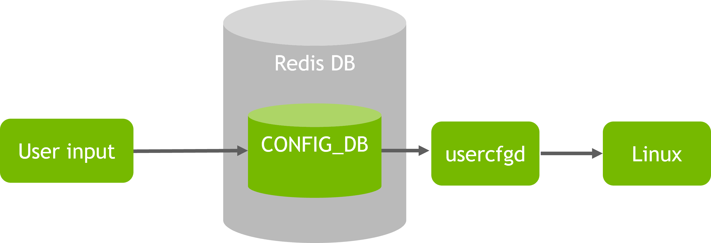
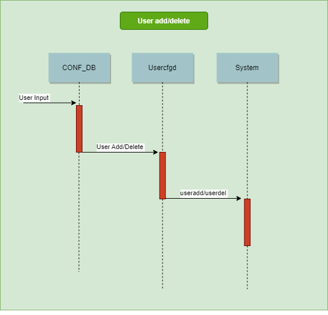
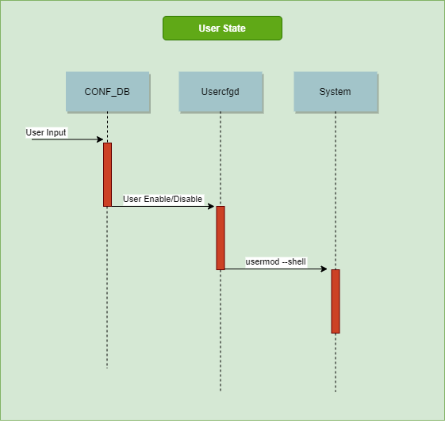
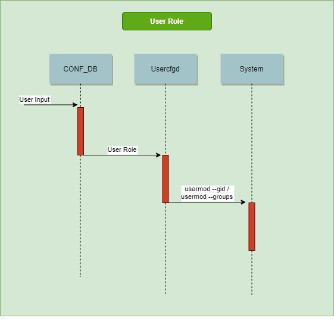
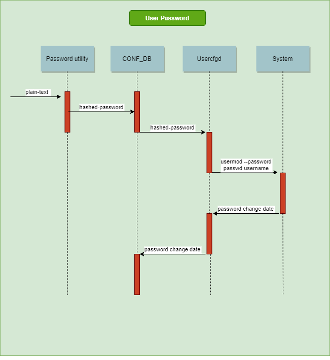
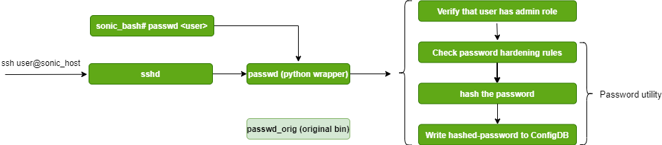

# User Management design #

##  1. Table of Content


* 1. [Table of Content](#TableofContent)
	* 1.1. [Revision](#Revision)
	* 1.2. [Scope](#Scope)
	* 1.3. [Definitions/Abbreviations](#DefinitionsAbbreviations)
	* 1.4. [Overview](#Overview)
	* 1.5. [Requirements](#Requirements)
		* 1.5.1. [Define defaults](#Definedefaults)
		* 1.5.2. [Configurations](#Configurations)
* 2. [Design](#Design)
	* 2.1. [Architecture Design](#ArchitectureDesign)
	* 2.2. [High-Level Design](#High-LevelDesign)
	* 2.2. [Usercfd Role](#UsercfdRole)
* 3. [Configuration and management](#Configurationandmanagement)
		* 3.1. [ConfigDB Tables](#ConfigDBTables)
		* 3.2. [ConfigDB schemas](#ConfigDBschemas)
		* 3.3. [CLI/YANG model](#CLIYANGmodel)
* 4. [Build](#Build)
		* 4.1. [Compilation](#Compilation)
		* 4.2. [Feature default](#Featuredefault)
* 5. [Flows](#Flows)
		* 5.1. [Init Flow](#InitFlow)
		* 5.2. [Upgrade Flow](#UpgradeFlow)
		* 5.3. [User add/delete](#UserAddDelete)
		* 5.4. [User state](#UserState)
		* 5.5. [User full-name](#UserFullName)
		* 5.6. [User role](#UserRole)
		* 5.7. [User hashed-password](#UserHashedPassword)
        * 5.8. [User password expiration](#UserPasswordExpiration)
        * 5.9. [User passwdrd prompt](#UserPasswdrdPrompt)
* 6. [SAI API](#SAIAPI)
* 7. [Warmboot and Fastboot Design Impact](#WarmbootandFastbootDesignImpact)
* 8. [Restrictions/Limitations](#RestrictionsLimitations)
* 9. [Test Plan](#TestPlan)
		* 9.1. [Unit Test cases](#UnitTestcases)


###  1.1. Revision
|  Rev  |  Date   |      Author      | Change Description |
| :---: | :-----: | :--------------: | ------------------ |
|  0.1  | 12/2022 | Mohammed Zayadna | Phase 1 Design     |

###  1.2. <a name='Scope'></a>Scope

This HLD document described the requirements, architecture and configuration details of User Management feature in switches Sonic OS based.

###  1.3. <a name='DefinitionsAbbreviations'></a>Definitions/Abbreviations
Role - capability of user


###  1.4. <a name='Overview'></a>Overview

This document provides high level design for the username mgmt and configuration in Sonic.<br/>
As of today, Sonic doesn’t have special configurations and management for local users. Users can be configured only by regular Linux commands.<br/>
The goal is to standardize and define the User management configurations and functionality.<br/>
It will define the default roles (capabilities), default users and describe the supported configurations
for users.<br/>

Note:
The compilition of the feature code will be controlled by a build flag and it will be disabled by default.

###  1.5. <a name='Requirements'></a>Requirements
####  1.5.1. <a name='Definedefaults'></a>Define defaults
* Default roles: admin and monitor<br/>
* Default users: admin and monitor
####  1.5.2. <a name='Configurations'></a>Configurations
* **add/delete user**

	Add/Delete a user from system. Default users shouldn't be deleted.<br/>
    Defining the password is mandatory when adding a new user.
* **enable/disable user**

	Control login of the user by enabling/disabling user state.
* **change full-name**

	Change Gecos field (Description) of user
* **change role (capability)**

	Control the capability of user by changing the role
* **change password**

	Change the password of a user.

##  2 <a name='Design'></a>Design

###  2.1 <a name='ArchitectureDesign'></a>Architecture Design


(flow description in the chapter below)

###  2.2 <a name='High-LevelDesign'></a>High-Level Design

Sonic has two main users:
* Admin: Administrator with limited access rights.It is part of sudo group.<br/>
* Root: Superuser with highest access rights. Login is disabled for this user.

We will define two roles for users:<br/>
* **admin**: a role for administrator users with write and read permissions.<br/>
	Each admin user will be part of the following groups:<br/>
	**primary group**: admin<br/>
	**secondary groups**: sudo,docker,redis,adm

* **monitor**: a role for monitoring users with read permissions only. <br/>
	Each monitor user will be part of the following groups:<br/>
	**primary group**: adm<br/>
	**secondary groups**: N/A

In addition, we will define two default users:
* **admin**: User role is admin.<br/>
	The only change from the current admin in Sonic is the additional group: adm

* **monitor**: User role is monitor. <br/>
	User with monitoring permissions only .<br/>

**Note**:
 Group adm is used for system monitoring tasks. Members of this group can read the files under "/var/log"


###  2.3 <a name='UsercfdRole'></a>Usercfgd Role:

Usercfgd is the daemon that get events from USER_TABLE in CONF_DB and apply the new configuration on the system.<br/>
The new daemon should start running after "config-setup.service" (i.e. after database is ready) but before systemd enables "system-logind.service" (i.e. before user can login to system)<br/>


)<br/>


##  3 <a name='Configurationandmanagement'></a>Configuration and management

###  3.1 <a name='ConfigDBTables'></a>ConfigDB Tables

```
USER_TABLE:{
  "<username>":{
    "state": {{enabled/disabled}}
    "full-name": {{string}}
    "hashed-password": {{string}}
    "hashed-password_history": {{string}}
    "role": {{admin/monitor}}
    "passwd_date_of_last_change": {{uint32}}
  }
}
```

```
ROLE_TABLE:{
  "<role-name>":{
    "primary_group": {{string}}
    "secondary_groups": {{string}}
  }
}
```
###  3.2 <a name='ConfigDBschemas'></a>ConfigDB schemas

```
; Defines schema for User configuration attributes in USER_TABLE:
key                                   = "<username>"                ;user configuration
; field                               = value
STATE                                 = "enabled" / "disabled"      ; user enable/disable
FULL-NAME                             = STRING                      ; Full-name/Description of user
HASHED-PASSWORD                       = STRING                      ; Hashed password
HASHED-PASSWORD_HISTORY               = STRING                      ; List of old passwords (0-99)
PASSWD_DATE_OF_LAST_CHANGE            = UINT32                      ; date of password last change
ROLE                                  = "admin" / "monitor"         ; Role/Capability

```

```
; Defines schema for role configuration attributes in ROLE_TABLE:
key                                   = "<role name>"               ;Role configuration
; field                               = value
PRIMARY_GROUP                         = STRING                      ; Primary linux group
SECONDARY_GROUP                       = STRING                      ; List of secondary linux groups
```

###  3.3 <a name='CLIYANGmodel'></a>CLI/YANG model

##### YANG model
```yang

module sonic-user-mgmt {
    yang-version 1.1;
    namespace "http://github.com/Azure/sonic-user-mgmt";
	prefix user-mgmt;

    description "User Management YANG Module for SONiC OS";

	revision 2022-12-01 {
        description "First Revision";
    }
   container sonic-user-mgmt {

        container USER_TABLE {

            description "USER MANAGEMENT part of config_db.json";

            list USER_TABLE_LIST {

                key "name";

                leaf name {
                  type string {
                        pattern '[a-zA-Z_]([a-zA-Z0-9_-]{0,31}|[a-zA-Z0-9_-]{0,30}$)';
                        length 1..32 {
                              error-message "Invalid length for the username.";
                              error-app-tag username-invalid-length;
                        }				  
				          }
                  description "User name.";
                }                

                leaf state {
                    default "enabled";
                    type string {
                        pattern "enabled|disabled";
                    }
                }
                
                leaf role {
                    default "admin";
                    type string {
                        pattern "admin|monitor";
                    }
                }                
                
                leaf full-name {
                    type string;
                }
                
                leaf hashed-password {
                    mandatory true;
                    type string;
                }
                
                leaf password_history {
                    type string;
                  	description "List of hashed passwords seperated by comma."; 
                }

                leaf passwd_date_of_last_change {
                    type uint32;
                }                
               
            } /* end of list USER_TABLE_LIST */

        } /* end of container USER_TABLE */

    } /* end of container sonic-user-mgmt */

} /* end of module sonic-user-mgmt */


```

```yang
//filename:  sonic-role-mgmt.yang
module sonic-role-mgmt {
    yang-version 1.1;
    namespace "http://github.com/Azure/sonic-role-mgmt";
	prefix role-mgmt;

    description "Role Management YANG Module for SONiC OS";

	revision 2022-12-01 {
        description "First Revision";
    }
   container sonic-role-mgmt {

        container ROLE_TABLE {

            description "ROLE MANAGEMENT part of config_db.json";

            list ROLE_TABLE_LIST {

                key "name";

                leaf name {
                  type string {
                        pattern '[a-zA-Z_]([a-zA-Z0-9_-]{0,31}|[a-zA-Z0-9_-]{0,30}$)';
                        length 1..32 {
                              error-message "Invalid length for the role-name.";
                              error-app-tag rolename-invalid-length;
                        }
                  }
                  description "Role name.";
                }       

                leaf primary_group {
                    mandatory true;
                    type string;
                  	description "Primary linux group.";                    
                }
                
                leaf secondary_groups {
                    mandatory true;
                    type string;
                  	description "List of secondary linux groups seperated by comma.";                    
                }                

               
            } /* end of list ROLE_TABLE_LIST */

        } /* end of container ROLE_TABLE */

    } /* end of container sonic-role-mgmt */

} /* end of module sonic-role-mgmt */


```

##### Config CLI

```
==============================================================================
root@host:~$ config username add --help
Usage: config user add [OPTIONS] <username> <password>

  Add new user with password

Options:
  -?, -h, --help  Show this message and exit.

==============================================================================
root@host:~$ config username del --help
Usage: config user del [OPTIONS] <username>

  Delete a user

Options:
  -?, -h, --help  Show this message and exit.

==============================================================================
root@host:~$ config username state --help
Usage: config user state [OPTIONS] <username> <state>

  Specify a user state [enabled | disabled]

Options:
  -?, -h, --help  Show this message and exit.
==============================================================================
root@host:~$ config username full-name --help
Usage: config user full-name [OPTIONS] <username> <full-name>

  Specify a user full-name (Gecos field)

Options:
  -?, -h, --help  Show this message and exit.

==============================================================================
root@host:~$ config username role --help
Usage: config user role [OPTIONS] <username> <role>

  Specify a user role (capabilities)

Options:
  -?, -h, --help  Show this message and exit.

==============================================================================
root@host:~$ config username password --help
Usage: config user password [OPTIONS] <username> <password>

  Specify a user password

Options:
  -?, -h, --help  Show this message and exit.
```

##### Show CLI

```
==============================================================================
root@host:~$ show username
USERNAME        STATE       ROLE             FULL-NAME   
---------     ---------    --------     -----------------------
admin          enabled      admin         System Administrator
monitor        enabled      monitor       System Monitor      

```

##  4 <a name='Build'></a>Build

###  4.1 <a name='Compilation'></a>Compilation

Feature won't be compiled by default. it can be controlled by a compilation flag:
```
"ENABLE_USER_MGMT"                : "n"
```

Both default users will be created during build with the default password, userinfo and will be added to default secondary groups.<br/>
The following variables will be added to "rules/config" file
```
# DEFAULT_USERNAME - default username for installer build
DEFAULT_USERNAME = admin

# DEFAULT_PASSWORD - default password for installer build
DEFAULT_PASSWORD = YourPaSsWoRd

# DEFAULT_ADMIN_USERINFO - default user info of admin user
DEFAULT_ADMIN_USERINFO = "System Administrator"

# ADMIN_SECONDARY_GROUPS - default secondary groups list for users with role: admin
ADMIN_SECONDARY_GROUPS = sudo,docker,redis,adm

# DEFAULT_MONITOR_USERNAME - default monitor username for installer build
DEFAULT_MONITOR_USERNAME = monitor

# DEFAULT_MONITOR_PASSWORD - default monitor password for installer build
DEFAULT_MONITOR_PASSWORD = MonitorPaSsWoRd

# DEFAULT_MONITOR_USERINFO - default user info of monitor user
DEFAULT_MONITOR_USERINFO = "System Monitor"

# MONITOR_SECONDARY_GROUPS - default secondary groups list for users with role: monitor
MONITOR_SECONDARY_GROUPS =
```

User can change the default users names or passwords by the following environment variables
```
"USERNAME"                        : "admin"
"PASSWORD"                        : "YourPaSsWoRd"
"USERNAME_MONITOR"                : "monitor"
"PASSWORD_MONITOR"                : "MonitorPaSsWoRd"
```

###  4.2 <a name='Featuredefault'></a>Feature defaults
The default values from rules/config will be passed to init_cfg.json file during build.
If [California-SB237 feature](https://github.com/sonic-net/SONiC/tree/master/doc/California-SB237) is enabled, "passwd_date_of_last_change" field
will be added to init_cfg.json during build to expire password on init.

```
"ROLE_TABLE": {
    "admin":{
        "primary_group": "admin",
        "secondary_groups": "sudo,docker,redis,adm"
    },
    "monitor":{
        "primary_group": "adm",
        "secondary_groups": ""
    }
},
"USER_TABLE": {
    "admin":{
        "state": "enabled",
        "full-name": "System Administrator",
        "role": "admin"
    },
    "monitor":{
        "state": "enabled",
        "full-name": "System Monitor",
        "role": "monitor"
    }
},
```
##  5 <a name='Flows'></a>Flows

###  5.1 <a name='InitFlow'></a>Init Flow
As described above, Usercfgd will start running after database is ready but before enabling of login.<br/>
All defaults will be saved in init_cfg.json except the password.<br/>
Usercfgd checks at init if password is missing in DB for each user and if so, it will get the current password of user from "/etc/shadow" and save it in DB both in "password" and "password_history" fields. So password will be added to DB at first-boot.<br/>


### Impact on init time

System was tested with 2 default users.


###  5.2 <a name='UpgradeFlow'></a>Upgrade Flow
USER_TABLE and ROLE_TABLE will be migrated to the new image without changes.
Usercfgd will apply all configurations at first-boot.


###  5.3 <a name='UserAddDelete'></a>User add/delete
#####  5.3.1 <a name='FlowDigram:'></a>Flow digram:

#####  5.3.2 <a name='FlowDescription::'></a>Flow description:
Usercfgd will add/delete the user by running the following commands:

- “useradd --no-user-group --create-home --shell /bin/bash {user_name}“:<br/>
	It will create a directory for user under "/home/"

- “userdel --remove {user_name}“<br/>
	It will delete the user directory under "/home/"

###### Notes:<br/>
1. User must set a password when he adds a new user. ( see password flow) <br/>
2. Default role “admin”


###  5.4 <a name='UserState'></a>User state
#####  5.4.1 <a name='FlowDigram:'></a>Flow digram:

#####  5.4.2 <a name='FlowDescription::'></a>Flow description:
Usercfgd will do the following:

If:

- state “disable”: lock user and change shell of user to: "/bin/nologin"<br/>
	Run: usermod --lock --shell "/bin/nologin" {user_name}<br/>

- state “enable”: unlock user and change shell of user to: "/bin/bash"<br/>
	Run: usermod --unlock --shell "/bin/bash" {user_name}<br/>

if user tries to login with disabled user, He will be blocked.

###  5.5 <a name='UserFullName'></a>User full-name
#####  5.5.1 <a name='FlowDigram:'></a>Flow digram:

#####  5.5.2 <a name='FlowDescription::'></a>Flow description:
Usercfgd will modify the user full-name (Gecos field) by running:

- usermod --comment {full-name} {user_name}

###  5.6 <a name='UserRole'></a>User role
#####  5.6.1 <a name='FlowDigram:'></a>Flow digram:

#####  5.6.2 <a name='FlowDescription::'></a>Flow description:
Usercfgd will get the "primary_group" and "secondary_groups" of the new role from ROLE_TABLE and run:

- usermod  --gid {primary_group} {user_name}
- usermod  --groups {secondary_groups} {user_name}

###  5.7 <a name='UserPassword'></a>User password
#####  5.7.1 <a name='FlowDigram:'></a>Flow digram:

#####  5.7.2 <a name='FlowDescription::'></a>Flow description:
User will configure a plain-text password using config command.<br/>
We will check using passwordutil if it is aligned with password hardening poilicies ( if passwh is enabled).<br/>
if so the password will be hashed and written to USER_TABLE.<br/>

Usercfgd will apply the hashed password by:

- Calling the linux command: "usermod --password {password} {user_name}"
- Adding the hashed-password to list of user passwords: “hashed-password_history” in USER_TABLE
- update date of last password change: “passwd_date_of_last_change” in USER_TABLE


###  5.8 <a name='UserPasswordExpiration'></a>User password expiration
Usercfgd will bypass password expiration data by keeping it in config db.<br/>
passwd_date_of_last_change will be updated in config db after each password update and applied on system after db migration.<br/>
This will preserve the password expiration date after upgrade.<br/>
If passwd_date_of_last_change field does not exist in config db on init daemon will take it from the system to support password expiration as part of password hardening rules.

###  5.9 <a name='UserPasswdrdPrompt'></a>User password prompt
Password change via ssh connection will be supported by replacing passwd binary by python wrapper.<br/>
Wrapper will handle password prompt during ssh connection to apply password using user management deamon.<br/>
In this case user management will check password hardening rules before applying.
The motivation is to keep password in config db after password change.




###  6 <a name='SAIAPI'></a>SAI API
No change.


###  7 <a name='WarmbootandFastbootDesignImpact'></a>Warmboot and Fastboot Design Impact
Not relevant.

###  8 <a name='RestrictionsLimitations'></a>Restrictions/Limitations

##### Username/Role-name
username/role-name max length is 32 and it begins with a letter or an underscore,
followed by letters, digits, underscores, or dashes.<br/>
They can end with a dollar sign.


###  9 <a name='TestPlan'></a>Test Plan
####  9.1 <a name='UnitTestcases'></a>Unit Test cases
###### Configuration – good flow
  - Verify default values
  - Add/Delete user
  - Enable/Disable user
  - Configure role of user
  - Configure password of user
  - Check password last change date after configure password
  - Configure full-name of user

###### Configuration - Negative flow
  - Change default users role
  - Delete default users
  - Add existing user
  - Add user with invalid username
  - Configure invalid role (Doesn't exist in ROLE_TABLE)
