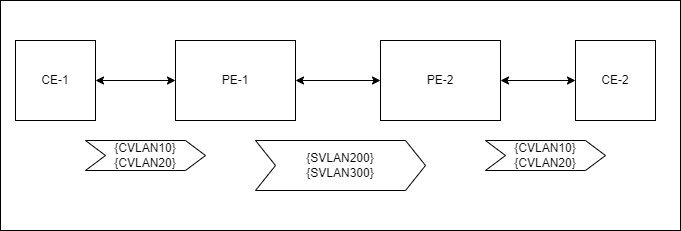
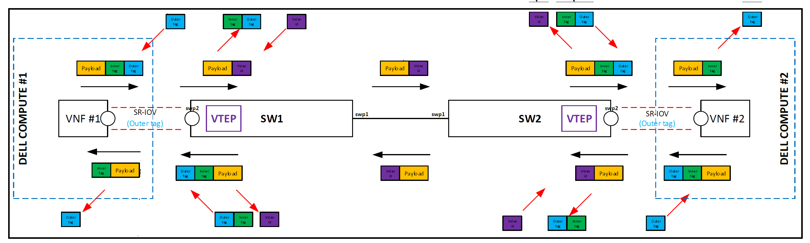
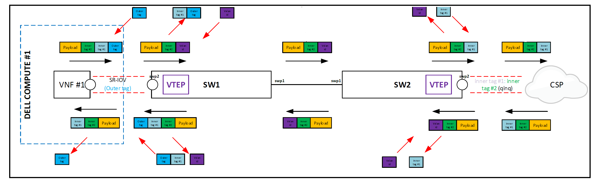
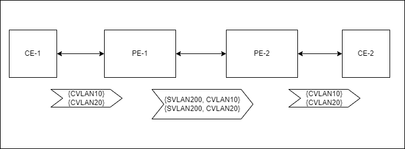
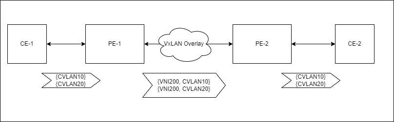
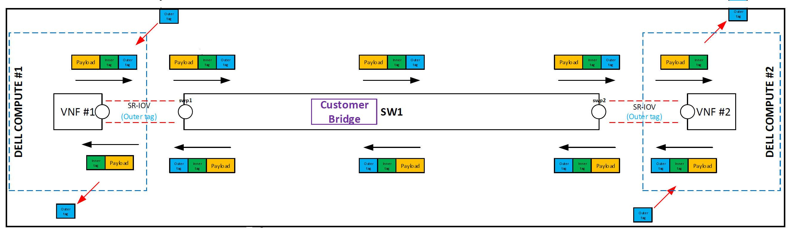
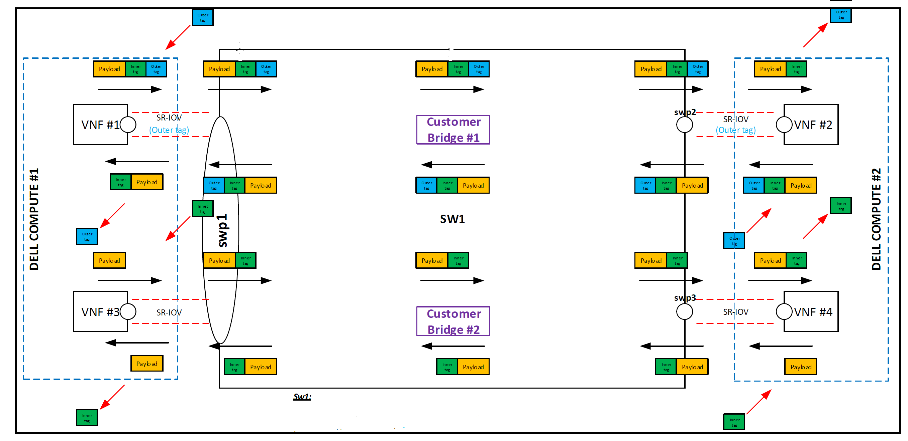
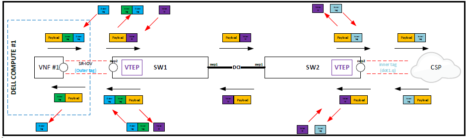
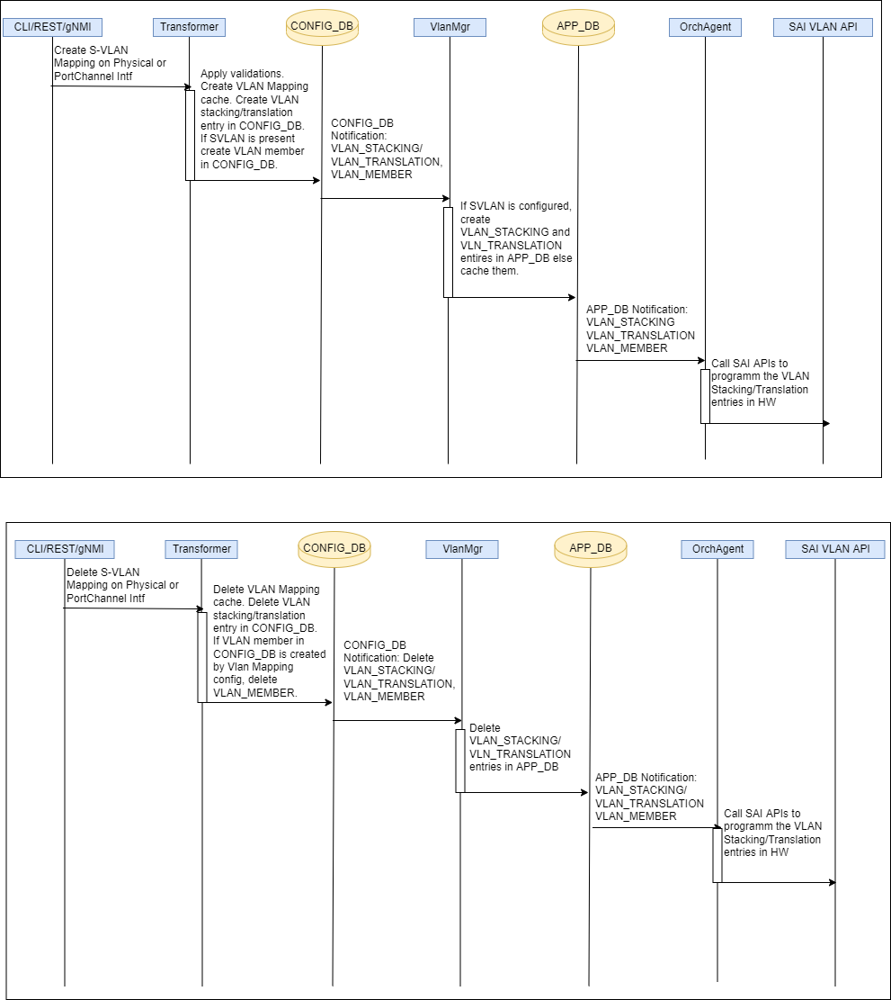
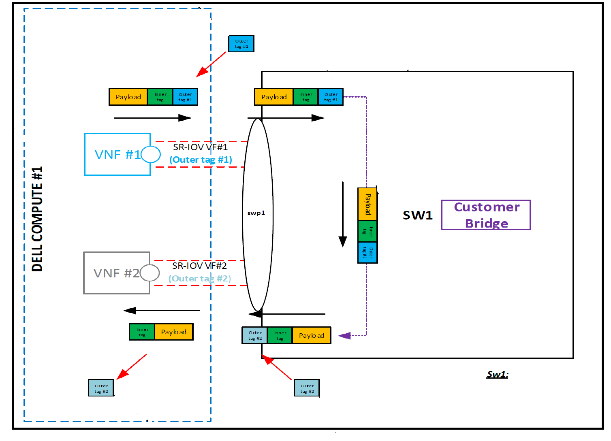

# VLAN Stacking and translation support for SONiC

# High Level Design Document
# Table of Contents

<!-- TOC depthFrom:1 depthTo:6 withLinks:1 updateOnSave:1 orderedList:0 -->

- [Feature Name](#feature-name)
- [High Level Design Document](#high-level-design-document)
- [Table of Contents](#table-of-contents)
- [List of Tables](#list-of-tables)
- [Revision](#revision)
- [About this Manual](#about-this-manual)
- [Definition/Abbreviation](#definitionabbreviation)
		- [Table 1: Abbreviations](#table-1-abbreviations)
- [1 Feature Overview](#1-feature-overview)
	- [1.1 Target Deployment Use Cases](#11-target-deployment-use-cases)
	- [1.2 Requirements](#12-requirements)
	- [1.3 Design Overview](#13-design-overview)
		- [1.3.1 Basic Approach](#131-basic-approach)
		- [1.3.2 Container](#132-container)
		- [1.3.3 SAI Overview](#133-sai-overview)
- [2 Functionality](#2-functionality)
- [3 Design](#3-design)
	- [3.1 Overview](#31-overview)
		- [3.1.1 Service and Docker Management](#311-service-and-docker-management)
		- [3.1.2 Packet Handling](#312-packet-handling)
	- [3.2 DB Changes](#32-db-changes)
		- [3.2.1 CONFIG DB](#321-config-db)
		- [3.2.2 APP DB](#322-app-db)
		- [3.2.3 STATE DB](#323-state-db)
		- [3.2.4 ASIC DB](#324-asic-db)
		- [3.2.5 COUNTER DB](#325-counter-db)
		- [3.2.6 ERROR DB](#326-error-db)
	- [3.3 Switch State Service Design](#33-switch-state-service-design)
		- [3.3.1 Orchestration Agent](#331-orchestration-agent)
		- [3.3.2 Other Processes](#332-other-processes)
	- [3.4 SyncD](#34-syncd)
	- [3.5 SAI](#35-sai)
	- [3.6 User Interface](#36-user-interface)
		- [3.6.1 Data Models](#361-data-models)
		- [3.6.2 CLI](#362-cli)
			- [3.6.2.1 Configuration Commands](#3621-configuration-commands)
			- [3.6.2.2 Show Commands](#3622-show-commands)
			- [3.6.2.3 Exec Commands](#3623-exec-commands)
		- [3.6.3 REST API Support](#363-rest-api-support)
		- [3.6.4 gNMI Support](#364-gnmi-support)
	- [3.7 Warm Boot Support](#37-warm-boot-support)
	- [3.8 Upgrade and Downgrade Considerations](#38-upgrade-and-downgrade-considerations)
- [4 Flow Diagrams](#4-flow-diagrams)
- [5 Error Handling](#5-error-handling)
- [6 Serviceability and Debug](#6-serviceability-and-debug)
- [7 Scalability](#7-scalability)
- [8 Platform](#8-platform)
- [9 Security and Threat Model](#9-security-and-threat-model)
- [10 Limitations](#10-limitations)
- [11 Unit Test](#11-unit-test)
- [12 Internal Design Information](#12-internal-design-information)
	- [12.1 IS-CLI Compliance](#121-is-cli-compliance)
	- [12.2 SONiC Packaging](#122-sonic-packaging)
	- [12.3 Unsupported usecases](#123-unsupported-usecases)
  - [12.4 Release Matrix](#124-release-matrix)

<!-- /TOC -->

# List of Tables
[Table 1: Abbreviations](#table-1-Abbreviations)

# Revision
| Rev |     Date    |       Author       | Change Description                |
|:---:|:-----------:|:------------------:|-----------------------------------|
| 0.1 | <06/13/2022>| Phaniraj Vattem, Oliver Hu, Zhenhong Zhao, Sucheta Mahara | Initial version                   |

# About this Manual
This document provides comprehensive functional and design information about the "Q-in-Q tunneling and VLAN translation" feature implementation in SONiC.

# Definition/Abbreviation

### Table 1: Abbreviations
| **Term**                 | **Meaning**                         |
|--------------------------|-------------------------------------|
| C-VLAN                   | Customer VLAN               |
| S-VLAN                   | Service Provider  VLAN               |
| C-TAG                    | Customer VLAN Tag               |
| S-TAG                    | Service Provider VLAN Tag.              |
| CE                       | Customer Edge          |
| PE                       | (Service) Provider Edge|
| VXLAN                    | Virtual extensible Local Area Network  |
| VTEP                     | VXLAN Tunnel End Point|
| VNI                      | Virtual Network Identifier|

# 1 Feature Overview

This feature supports carrying customer traffic over Provider networks using QinQ Tunneling or VLAN translation mechanisms. 
This feature also supports carrying customer traffic over a Provider Network using VXLAN. 
This implementation will only support carrying Layer2 traffic across provider network.  

A Q-in-Q VLAN tunnel will enable a Service Providers to seperate VLAN traffic from different customers in their network and also group multiple customer VLANs(C-VLAN) and tunnel them with a single service provider VLAN(S-VLAN). In Q-in-Q tunneling, customer traffic arriving at a Service Provider Edge (PE) interface will be added with an S-TAG, that identifies a single C-VLAN or a group of C-VLANs. These packets travel in the provider network based on the S-TAG while preserving the original customer VLAN (C-TAG) in the packet. Though the packet is double tagged, the forwarding decisions are made based on the outer S-TAG. At the other end of the provider network, as the traffic leaves PE, the S-VLAN in the packet is removed before handing off the traffic to the customer network.

VLAN-translation will allow swapping single or double tagged traffic (C-VLANS) with an S-VLAN at the provider edge device and traffic will be forwarded based on S-VLAN in the provider network. The C-VLANs will be lost in the translation.

If the Provider network enabled with VXLAN overlay, the customer traffic identified by the S-VLANs need to be mapped to VXLAN VNIs and is forwarded based on VNI. The S-VLAN header will be replaced with VNI. At the egress of the provider network, the VNI will be mapped to an S-VLAN and further forwarding decisions are made based on S-VLAN.

This feature will be supported on Physical Interfaces (Ethernet) and PortChannels.

## 1.1 Target Deployment Use Cases
### 1.1.1 VLAN Translation usecases
#### Usecase - 1  Native VLAN Translation


#### Usecase - 2  VLAN Translation with VxLAN
   * Ingress - Map single/double C-TAGs to VNI
   * Egress  - Map VNI to single/double C-TAGs

CVLANs on both the ends are same


#### Usecase - 3 VLAN Translation with VxLAN
   * Ingress - Map single/double C-TAGs to VNI - 3rd tag present in the packet is treated as payload
   * Egress  - Map VNI to single/double C-TAGs

CVLANs on both the ends are different



### 1.1.2 Q-in-Q Tunneling usecases
#### Usecase - 1 Native 



#### Usecase -2 Q-in-Q Tunnel with VxLAN



### 1.1.3 point-to-point usecases




### 1.1.4 VxLAN DCI usecase


## 1.2 Requirements
### 1.2.1 Functional requirements for 4.1
* Ability to translate a customer VLAN (single & double tagged) to Provider VLAN and forward based on Provider VLAN
   * point-to-point use cases - the traffic ingresses from one port and egress on to a different port within the same PE.
* Ability to translate a customer VLAN (single & double tagged) to VxLAN VNI and forward in the overlay network
* Ability to tunnel Customer VLANs across a Provider Network
   * point-to-point use cases - the traffic ingresses from one port and egress on to a different port within the same PE.
* Ability to tunnel Customer VLANs across a Overlay (VxLAN) Network
* Support forwarding L2 traffic with VLAN translation and Q-in-Q schemes
* Support VLAN stacking & Translation schemes on both Ethernet & PortChannel Interfaces

#### Future requirements
* Ability to configure standard & custom EtherType(TPID) on the outer Tags
* Hair-pin use case - Traffic ingresses with a VLAN Stack and egresses with a different VLAN stack on the same port. (swap outer vlan and keep the inner vlan intact)
* Ability to route traffic on SVLAN incase of VLAN Translation (Layer 3 support)
* L2 protocol packet(ex:STP, IGMP) passthrough in case of QinQ/VLAN stacking use cases
* Ability to provide multi-homing support via MCLAG on custuomer facing interfaces
* Supporting VLAN stacking & translation functionality on SONiC VS image

### 1.2.2 Configuration requirements
* Support confguration of VLAN mapping rules to implement VLAN Stacking(Q-in-Q) on both Ethernet & PortChannel Interfaces
* Support confguration of VLAN mapping rules to implement VLAN translation on both Ethernet & PortChannel Interfaces
* Provide various validations to implement both the VLAN mapping schemes
* Provide configuraiton interfaces via REST, gNMI and KLISH.

### 1.2.3 Hardware requirements
* Support VLAN stacking & translation on TD3 & TD4 platforms

### 1.2.4 Scaling requirements
* Support 2k service chains (both VLAN stacking and translation schemes) per system

## 1.3 Design Overview

### 1.3.1 Basic Approach
* This feature will enable user to configure various Vlan mapping rules (VLAN tag matching and tag action) in both ingress and egress directions on a given physical or PortChannel Interface.
   * VLAN tag matching rules dictate, how the customer traffic is identified and isolated. 
   * Once the customer traffic is identified, the tag action rule will dictate, which S-VLAN the customer traffic is associated with and also specifies, what action needs to be performed (push/pop/swap) depending on the direction (ingress/egress) of the traffic
* SONiC system will be configured with S-VLAN and forwarding decisions are made based on S-VLAN. C-VLANs will be either tunneled or translated with S-VLAN. C-VLANs are unknown to SONiC system.
* Currently SONiC uses a VLAN aware bridge(vlan filtering is on) in the kernel and this feature will continue using it to support all the uses cases.

Following components will be changed to support the feature.
* management-framework
* VlanMgr
* Orchagent
* SAI

#### 1.3.1.1 Q-in-Q and VLAN translation operations:

Tag operations that are supported on an Interface (Ethernet or PortChannel) per traffic direction (Ingress/Egress)

| Tag Op | Ingress | Egress  |
| ----------- | ----------- | ----------- |
| Push | Supported | Not supported |
| Pop | Not supported | Supported |
| Swap | Supported | Supported |

**Q-in-Q**
* _Ingress_
  * Push: If the VLAN id of incoming packet from CE  matches any of the configured range of C-VLANs on the interface, S-VLAN tag is _pushed_ as outer VLAN on top of C-VLAN and the packet will be forwarded based on S-VLAN in PE. 
  * If S-VLAN is mapped to a VxLAN VNI, the S-VLAN is stripped off and packet is encapsulated with VxLAN header and forwarded based on the VNI. 
  * CVLAN is preserved in the packet in both VxLAN and non-VxLAN cases
* _Egress_
  * Pop : SVLAN if present on the outgoing packet from the PE to the CE, it is stripped off before handing it over to CE. 
  * If the packet has VxLAN header, the VxLAN header is stripped off and the VNI is mapped back to S-VLAN and packet is forwarded based on S-VLAN (as explained above)

_Note: The CVLAN (or CVLAN raange), SVLAN mapping is unique on a given interface._

**VLAN Translation**
* _Ingress_
  * Swap (single tagged packet): If the VLAN id of incoming packet from CE matches the user configuration, C-VLAN is swapped with S-VLAN and forwarded based on S-VLAN. 
  * Swap (Double tagged packet): If the outer and inner C-VLAN ids of incoming packet from CE matches the user configuration, the inner+outer C-VLANs are swapped with S-VLAN and forwarded based on S-VLAN. 
  * If S-VLAN is mapped to a VxLAN VNI, the S-VLAN is stripped off and packet is encapsulated with VxLAN header and forwarded based on the VNI. 

* _Egress_
  * Swap (_double tagged  packet egress_): The S-VLAN will be swapped with inner + outer C-VLANs for the outgoing packets from PE to CE.
  * Swap (_single tagged packet egress_): The S-VLAN will be swapped with C-VLAN for the outgoing packets from PE to CE.
  * If the packet at has VxLAN header, the VxLAN header is stripped off and the VNI is mapped back to S-VLAN and packet is forwarded based on S-VLAN. The packet going out to CE will have single or doubel CVLAN tags, as configured by the VLAN translation rules.

_Note:_ 
  * The CVLAN(single or double tagged), SVLAN mapping is unique on a given interface.
  * SVLAN on a given interface can be used either for Q-in-Q or VLAN translation scheme, but not for both. 
  * The packet received can be single or multi-tag. Only the first 2 recognized C-VLAN ids will be used for rule matching purpose. Rest of the packet will be considered as payload.

#### 1.3.1.3 MAC learning
* MAC learning is done on S-VLAN. In case VxLAN, these MACs are advertised to remote VTEPs. Similarly, remote MAC learnt over VXLAN network are programmed on the S-VLAN Bridge domain.

#### 1.3.1.4 SVLAN Priority bit (PCP) Handling
* Either in VLAN stacking or translation, user can provide the priority bits(in the range of 0-7) which can be carried on SVLAN in the provider network.
* In the absence of user provided priority bits the following operations are performed

| Mapping Type | Stage      | Operation | PCP Handling |
| ------------ | ---------- | --------- | ------------ |
| Stacking     | INGRESS    | PUSH      | PUSH SVLAN and copy PCP bits from CVLAN to SVLAN |
| Stacking     | EGRESS     | POP       | POP SVLAN and don't copy PCP bits to CVLAN |
| Translation  | INGRESS    | SWAP      | SWAP with SVLAN and copy PCP bits from CVLAN to SVLAN |
| Translation  | EGRESS     | SWAP      | SWAP with CVLAN and copy PCP bits from SVLAN to CVLAN |

### 1.3.2 Container
No new container will be introduced. swss, redisDB and mgmt-framework will be enhanced to support the feature.

### 1.3.3 SAI Overview
New SAI API will be added to support the feature
## SAI Attribute
The following are the new SAI Attribute to support VLAN Stacking and Translation usecases (This is picked up from current SAI proposal)

| SAI Component | SAI attribute                                  | Description                     |
| ------------- | ---------------------------------------------- | ------------------------------- |
| VLAN Stacking | SAI_VLAN_STACK_ATTR_STAGE                      | At which packet flow direction the action should take effect. Ingress or Egress    |
|               | SAI_VLAN_STACK_ATTR_ACTION                     | Include SWAP, PUSH and POP operation    |
|               | SAI_VLAN_STACK_ATTR_VLAN_APPLIED_PRI           | The "priority" of the new VLAN tag. Default value is 0xFF which will inherit the original vlan tag priority.   |
|               | SAI_VLAN_STACK_ATTR_ORIGINAL_VLAN_ID_INNER     | Used to match the processing packet inner dot1q header.    |
|               | SAI_VLAN_STACK_ATTR_ORIGINAL_VLAN_ID_OUTER     | Used to match the processing packet outer dot1q header. At least one of SAI_VLAN_STACK_ATTR_ORIGINAL_VLAN_ID_INNER and SAI_VLAN_STACK_ATTR_ORIGINAL_VLAN_ID_OUTER attribute should be set. The vlan stacking rule only take effect if packets' dot1q header VLAN_ID match this combination.   |
|               | SAI_VLAN_STACK_ATTR_PORT                       | Target port ID at which the vlan stacking will take effect   |
|               | SAI_VLAN_STACK_ATTR_APPLIED_VLAN_ID_INNER      | New inner vlan ID for the vlan stacking. If the ACTION is POP, this attribute will not take effect.    |
|               | SAI_VLAN_STACK_ATTR_APPLIED_VLAN_ID_OUTER      | New outer vlan ID for the vlan stacking. If the ACTION is POP, this attribute will not take effect. Else, one of SAI_VLAN_STACK_ATTR_APPLIED_VLAN_ID_INNER and SAI_VLAN_STACK_ATTR_APPLIED_VLAN_ID_OUTER attribute should be set    |

# 2 Functionality

CLI/gNMI/REST will be used to configure the system with Q-in-Q or VLAN translation.

# 3 Design
## 3.1 Overview


### 3.1.1 Service and Docker Management

No new service or dockers are introduced.

### 3.1.2 Packet Handling
Explained in the section 1.3.1.1

## 3.2 DB Changes
### 3.2.1 CONFIG DB
Two new tables `VLAN_STACKING` for Q-IN-Q (push OPERATIONS) and `VLAN_TRANSLATION` (for SWAP operation) are being added in Config DB.
These tables will be populated by SONiC management framework via CLI/REST/gNMI and read by Vlanmgr.

`VLAN_STACKING`

```JSON
VLAN_STACKING|{{interface_name}}|{{s_vlan}}|{{stage}}
"c_vlanids":        {{c_vlandids}}
"s_vlan_priority":  {{s_vlan_priority}}
```
```
"interface_name"  Ethernet Interface or PortChannel Interface name
"s_vlan"          type String "Vlan"{range "1..4095"} Service VLAN, 
                  Pushed at ingress stage
                  Popped at egress stage
"stage"           Stage (INGRESS/EGRESS) at which the Stacking rule is applied
"c_vlanids"       Match CVLAN IDs on ingress direction of interface
"s_vlan_priority" VLAN priority of Service VLAN
```
Examples:-

```
VLAN_STACKING|Ethernet1|Vlan100|INGRESS:
"c_vlanids": "101..104, 150"
"s_vlan_priority":"0"

VLAN_STACKING|Ethernet1|Vlan100|EGRESS:
"c_vlanids": "101..104, 150"
"s_vlan_priority":"0"

Range of C-VLANS 101,102,103,104 and 150 will be tunneled across.
```


`VLAN_TRANSLATION`

```JSON

VLAN_TRANSLATION|{{interface_name}}|{{s_vlan}|{stage}}
"c_vlanid_inner":   {{c_vlanid_inner}}
"c_vlanid_outer":   {{c_vlanid_outer}}
"s_vlan_priority":  {{s_vlan_priority}}
```
```
"interface_name"    Ethernet<id>|PortChannel<id>
"s_vlan"            type String "Vlan"{range "1..4095"}, Service VLAN
                    {swap c_vlanid_outer or c_vlanid_outer, c_vlanid_inner with s_vlan for ingress direction
                    swap s_vlan with c_vlanid_outer or c_vlanid_outer, c_vlanid_inner for egress direction}
"stage"             Stage(INGRESS/EGRESS) at which the VLAN translation rule is applied
"c_vlanid_inner"    type uint16 {range "1..4095"},Inner VLAN ID to be matched
"c_vlanid_outer"    type uint16 {range "1..4095"},Outer VLAN ID to be matched
"s_vlan_priority"   VLAN priority of Service VLAN
```

i.e

```
For double tag translation :-

VLAN_TRANSLATION|Ethernet1|Vlan10|INGRESS:
"c_vlanid_inner": "50"
"c_vlanid_outer": "20"
"s_vlan_priority":"1"

VLAN_TRANSLATION|Ethernet1|Vlan10|EGRESS:
"c_vlanid_inner": "50"
"c_vlanid_outer": "20"
"s_vlan_priority":"1"

For single tag translation only Outer VLAN ID is filled. :-

VLAN_TRANSLATION|Ethernet1|Vlan10|INGRESS:
"c_vlanid_inner": ""
"c_vlanid_outer": "20"
"s_vlan_priority":"0"

VLAN_TRANSLATION|Ethernet1|Vlan10|EGRESS:
"c_vlanid_inner": ""
"c_vlanid_outer": "20"
"s_vlan_priority":"0"
```


### 3.2.2 APP DB
* New tables VLAN_STACKING_TABLE for Q-IN-Q (push OPERATIONS) and VLAN_TRANSLATION_TABLE (for SWAP operation) is added in APP DB.
* The tables schema will be same as described above for configDB.  Vlanmgrd will write to these tables.
* The tables will be read by Orchagent to configure SAI.

`VLAN_STACKING_TABLE`

```
VLAN_STACKING_TABLE:{{interface-name}}:{{s_vlanid}}:{{stage}}
"c_vlanids":        {{c_vlanids}}
"s_vlan_priority":  {{s_vlan_priority}}
```

```json
"interface_name"  Ethernet Interface or PortChannel Interface name
"s_vlan"          type String "Vlan"{range "1..4095"} Service VLAN, 
                  Pushed at ingress stage
                  Popped at egress stage
"stage"           Stage (INGRESS/EGRESS) at which the Stacking rule is applied
"c_vlanids"       Match CVLAN IDs on ingress direction of interface
"s_vlan_priority" VLAN priority of Service VLAN
```

`VLAN_TRANSLATION_TABLE`

```
VLAN_TRANSLATION_TABLE:{{interface_name}}:{{s_vlanid}}:{{stage}}
"c_vlanid_inner":   {{c_vlanid_inner}}
"c_vlanid_outer":   {{c_vlanid_outer}}
"s_vlan_priority":  {{s_vlan_priority}}
```

```json
"interface_name"    Ethernet<id>|PortChannel<id>
"s_vlan"            type String "Vlan"{range "1..4095"}, Service VLAN
                    {swap c_vlanid_outer or c_vlanid_outer, c_vlanid_inner with s_vlan for ingress direction
                    swap s_vlan with c_vlanid_outer or c_vlanid_outer, c_vlanid_inner for egress direction}
"stage"             Stage(INGRESS/EGRESS) at which the VLAN translation rule is applied
"c_vlanid_inner"    type uint16 {range "1..4095"},Inner VLAN ID to be matched
"c_vlanid_outer"    type uint16 {range "1..4095"},Outer VLAN ID to be matched
"s_vlan_priority"   VLAN priority of Service VLAN
```

### 3.2.3 STATE DB
### 3.2.4 ASIC DB
### 3.2.5 COUNTER DB
### 3.2.6 ERROR DB

## 3.3 Switch State Service Design
### 3.3.1 Orchestration Agent
PortsOrch is monitoring the update of APP DB VLAN_STACKING and VLAN_TRANSLATION tables. On change of any of these two tables, SAI APIs will be called to create, update or delete VLAN stacking or translation to NPU.

There is only one matching VLAN ID pair accepted by SAI VLAN stacking API each time. So for a given customer VLAN list or range, PortsOrch could parse the given input to list of VLANs and call SAI function for each one in list.

PortsOrch also maintains mapping from interface/s-vlan/directon to list of vlan stacking oid in cache. And with the mapping, PortsOrch could know which SAI objects need to be updated or deleted based on input parameters.

Mapping samples from APP DB tables to SAI API:

| **Table Name**    | **Opeartion** |  **Table Data**           |  **SAI Function**  | **SAI Attributes**  |
|-------------------|---------------|---------------------------|--------------------|---------------------|
| VLAN_STACKING     | Create        | intf_name: Ethernet4<br>s_vlanid: 100<br>c_vlanids: 10-15<br>direction: ingress | create_vlan_stack | ***For each VLAN ID within 10 to 15***:<br>stage: ingress<br>action: push<br>port: Ethernet4<br>original_vlan_id_outer: \<vid\><br>applied_vlan_id_outer: 100 |
| VLAN_STACKING     | Create        | intf_name: Ethernet4<br>s_vlanid: 100<br>c_vlanids:<br>direction: egress | create_vlan_stack | stage: egress<br>action: pop<br>port: Ethernet4<br>original_vlan_id_outer: 100 |
| VLAN_STACKING     | Delete        | intf: Ethernet4<br>s_vlanid: 100<br>direction: ingress/egress | remove_vlan_stack | |
| VLAN_TRANSLATION  | Create        | intf_name: Ethernet8<br>s_vlanid: 200<br>c_vlanid_in: 10<br>c_vlanid_out: 20<br>direction: ingress | create_vlan_stack | <br>stage: ingress<br>action: swap<br>port: Ethernet4<br>original_vlan_id_inner: 10<br>original_vlan_id_outer: 20<br>applied_vlan_id_outer: 200 |
| VLAN_TRANSLATION  | Create        | intf_name: Ethernet8<br>s_vlanid: 200<br>c_vlanid_in: 10<br>c_vlanid_out: 20<br>direction: egress  | create_vlan_stack | <br>stage: egress<br>action: swap<br>port: Ethernet4<br>original_vlan_id_outer: 200<br>applied_vlan_id_inner: 10<br>applied_vlan_id_outer: 20 |
| VLAN_TRANSLATION  | Delete        | intf: Ethernet4<br>s_vlanid: 100<br>directon: ingress/egress | remove_vlan_stack | |

For table delete case, PortsOrch needs to use cached mapping to get to be deleted instance OID.

### 3.3.2 Other Processes
PortsOrch will be enhanced to process the APP DB events related to VLAN_STACKING and VLAN_TRANSLATION tables.

## 3.4 SyncD
No changes to SyncD

## 3.5 SAI
The following APIs are picked up from current SAI proposal
```
/**
 * @brief Create and apply a single VLAN Stack rule
 *
 * @param[out] vlan_stack_id VLAN Stack ID
 * @param[in] switch_id Switch id
 * @param[in] attr_count Number of attributes
 * @param[in] attr_list Array of attributes
 *
 * @return #SAI_STATUS_SUCCESS on success, failure status code on error
 */
typedef sai_status_t (*sai_create_vlan_stack_fn)(
        _Out_ sai_object_id_t *vlan_stack_id,
        _In_ sai_object_id_t switch_id,
        _In_ uint32_t attr_count,
        _In_ const sai_attribute_t *attr_list);

/**
 * @brief Remove a VLAN Stack rule
 *
 * @param[in] vlan_stack_id VLAN Stack ID
 *
 * @return #SAI_STATUS_SUCCESS on success, failure status code on error
 */
typedef sai_status_t (*sai_remove_vlan_stack_fn)(
        _In_ sai_object_id_t vlan_stack_id);

/**
 * @brief Modify VLAN Stack rule attribute
 *
 * @param[in] vlan_stack_id VLAN Stack ID
 * @param[in] attr Attribute
 *
 * @return #SAI_STATUS_SUCCESS on success, failure status code on error
 */
typedef sai_status_t (*sai_set_vlan_stack_attribute_fn)(
        _In_ sai_object_id_t vlan_stack_id,
        _In_ const sai_attribute_t *attr);

/**
 * @brief Get VLAN Stack rule attribute
 *
 * @param[in] vlan_stack_id VLAN Stack ID
 * @param[in] attr_count Number of attributes
 * @param[inout] attr_list Array of attributes
 *
 * @return #SAI_STATUS_SUCCESS on success, failure status code on error
 */
typedef sai_status_t (*sai_get_vlan_stack_attribute_fn)(
        _In_ sai_object_id_t vlan_stack_id,
        _In_ uint32_t attr_count,
        _Inout_ sai_attribute_t *attr_list);
```

## 3.6 User Interface
### 3.6.1 Data Models
#### 3.6.1.1 OpenConfg Yang
```diff
module: openconfig-interfaces
  +--rw interfaces
     +--rw interface* [name]
        +--rw name                        -> ../config/name
        +--rw config
        |  +--rw name?            string
.....
.....
        +--rw oc-intf-ext:mapped-vlans
           +--rw oc-intf-ext:mapped-vlan* [vlan-id]
              +--rw oc-intf-ext:vlan-id            -> ../config/vlan-id
              +--rw oc-intf-ext:config
              |  +--rw oc-intf-ext:vlan-id?   union
              +--ro oc-intf-ext:state
              |  +--ro oc-intf-ext:vlan-id?   union
              +--rw oc-intf-ext:match
              |  +--rw oc-intf-ext:single-tagged
              |  |  +--rw oc-intf-ext:config
              |  |  |  +--rw oc-intf-ext:vlan-ids*   union
              |  |  +--ro oc-intf-ext:state
              |  |     +--ro oc-intf-ext:vlan-ids*   union
              |  +--rw oc-intf-ext:double-tagged
              |     +--rw oc-intf-ext:config
              |     |  +--rw oc-intf-ext:inner-vlan-id?   oc-vlan-types:vlan-id
              |     |  +--rw oc-intf-ext:outer-vlan-id?   oc-vlan-types:vlan-id
              |     +--ro oc-intf-ext:state
              |        +--ro oc-intf-ext:inner-vlan-id?   oc-vlan-types:vlan-id
              |        +--ro oc-intf-ext:outer-vlan-id?   oc-vlan-types:vlan-id
              +--rw oc-intf-ext:ingress-mapping
              |  +--rw oc-intf-ext:config
              |  |  +--rw oc-intf-ext:vlan-stack-action?   matched-vlan-stack-action
              |  |  +--rw oc-intf-ext:mapped-vlan-priority uint8
              |  +--ro oc-intf-ext:state
              |     +--ro oc-intf-ext:vlan-stack-action?   matched-vlan-stack-action
              |     +--rw oc-intf-ext:mapped-vlan-priority uint8
              +--rw oc-intf-ext:egress-mapping
                 +--rw oc-intf-ext:config
                 |  +--rw oc-intf-ext:vlan-stack-action?   matched-vlan-stack-action
                 |  +--rw oc-intf-ext:mapped-vlan-priority uint8                 
                 +--ro oc-intf-ext:state
                    +--ro oc-intf-ext:vlan-stack-action?   matched-vlan-stack-action
                    +--rw oc-intf-ext:mapped-vlan-priority uint8
```

#### 3.6.1.2 SONiC Yang
```diff
module: sonic-vlan-stacking
  +--rw sonic-vlan-stacking
     +--rw VLAN_STACKING
        +--rw VLAN_STACKING_LIST* [ifname s_vlan stage]
           +--rw ifname             union
           +--rw s_vlan             string
           +--rw stage              scommon:stack_stage
           +--rw c_vlanids*         union
           +--rw s_vlan_priority?   uint8


module: sonic-vlan-translation
  +--rw sonic-vlan-translation
     +--rw VLAN_TRANSLATION
        +--rw VLAN_TRANSLATION_LIST* [interface_name s_vlan stage]
           +--rw interface_name    union
           +--rw s_vlan            string
           +--rw stage             scommon:stack_stage
           +--rw c_vlanid_inner?   uint16
           +--rw c_vlanid_outer?   uint16
           +--rw s_vlan_priority?  uint8

```

### 3.6.2 CLI
#### 3.6.2.1 Configuration Commands
```
Syntax:
[no] switchport vlan-mapping  {{<cvlan-id> [inner <inner-cvlan-id>]}  | 
                               {{<cvlan_list> | { add | remove} <cvlan-list>} dot1q-tunnel } <svlan-id> [priority <priority-bits>]
```

#### 3.6.2.1.1 VLAN Translation Commands

#### Single Tag Translation
```
[no] switchport vlan-mapping <cvlan-id> <svlan-id> [priority <priority-bits>]
```
Example
```
sonic# configure terminal 
sonic(config)# interface Ethernet 4
sonic(conf-if-Ethernet4)# switchport 
  access        Set access mode characteristics of the interface
  trunk         Configure trunking parameters on an interface
  vlan-mapping  Configure VLAN translation parameters on an interface

sonic(conf-if-Ethernet4)# switchport vlan-mapping 
  <1..4094>   Configure VLAN mapping customer VLAN ID
  add         Configure VLAN stacking match customer VLANs on an interface
  remove      Remove VLAN stacking match customer VLANs on an interface
  VLAN-LIST   (-) or (,) separated individual VLAN IDs and ranges of VLAN IDs; for example, 20,70-100,142

sonic(conf-if-Ethernet4)# switchport vlan-mapping 100 
  <1..4094>  Configure service provider VLAN ID
  inner      Inner customer VLAN

sonic(conf-if-Ethernet4)# switchport vlan-mapping 100 200 
  priority   Set priority bits <0-7> for service provider VLAN
  <cr>  
```

#### Double Tag Translation

```
[no] switchport vlan-mapping <outer-cvlan-id> inner <inner-cvlan-id> <svlan-id> [priority <priority-bits>]
```

Example
```
sonic(conf-if-Ethernet4)# switchport vlan-mapping 100 200 
  <cr>  

sonic(conf-if-Ethernet4)# switchport vlan-mapping 100 inner 
  <1..4094>  Configure inner customer VLAN ID

sonic(conf-if-Ethernet4)# switchport vlan-mapping 100 inner 200 
  <1..4094>  Configure service provider VLAN ID

sonic(conf-if-Ethernet4)# switchport vlan-mapping 100 inner 200 300 
  priority   Set priority bits <0-7> for service provider VLAN
  <cr>  

sonic(conf-if-Ethernet4)# switchport vlan-mapping 100 inner 200 300 priority 
  <0-7>   Configure priority bits for service provider VLAN

sonic(conf-if-Ethernet4)# switchport vlan-mapping 100 inner 200 300 priority 3

```

#### 3.6.2.1.2 VLAN Stacking or Q-in-Q Commands

```
[no] switchport vlan-mapping  {<cvlan_list> | { add | remove} <cvlan-list>} dot1q-tunnel <svlan-id> [priority <priority-bits>]
                              
```

Example

```
sonic(conf-if-Ethernet4)# switchport vlan-mapping 
  <1..4094>   Configure customer VLAN ID
  add         Configure VLAN stacking match customer VLANs on an interface
  remove      Remove VLAN stacking match customer VLANs on an interface
  VLAN-LIST   (-) or (,) separated individual VLAN IDs and ranges of VLAN IDs; for example, 20,70-100,142

sonic(conf-if-Ethernet4)# switchport vlan-mapping 20,30 
  dot1q-tunnel  Configure 801.1Q tunneling (Q-in-Q)

sonic(conf-if-Ethernet4)# switchport vlan-mapping 20,30 dot1q-tunnel 
  <1..4094>  Configure service provider VLAN ID

sonic(conf-if-Ethernet4)# switchport vlan-mapping 20,30 dot1q-tunnel 100 
  <cr>  

sonic(conf-if-Ethernet4)# switchport vlan-mapping add 
  VLAN-LIST   (-) or (,) separated individual VLAN IDs and ranges of VLAN IDs; for example, 20,70-100,142

sonic(conf-if-Ethernet4)# switchport vlan-mapping add 30-40 
  dot1q-tunnel  Configure 801.1Q tunneling (Q-in-Q)

sonic(conf-if-Ethernet4)# switchport vlan-mapping add 30-40 dot1q-tunnel 
  <1..4094>  Configure service provider VLAN ID

sonic(conf-if-Ethernet4)# switchport vlan-mapping add 30-40 dot1q-tunnel 100 
  <cr>  

sonic(conf-if-Ethernet4)# switchport vlan-mapping 
  <1..4094>   Configure customer VLAN ID
  add         Configure VLAN stacking match customer VLANs on an interface
  remove      Remove VLAN stacking match customer VLANs on an interface
  VLAN-LIST   (-) or (,) separated individual VLAN IDs and ranges of VLAN IDs; for example, 20,70-100,142

sonic(conf-if-Ethernet4)# switchport vlan-mapping remove 
  VLAN-LIST   (-) or (,) separated individual VLAN IDs and ranges of VLAN IDs; for example, 20,70-100,142

sonic(conf-if-Ethernet4)# switchport vlan-mapping remove 50 
  dot1q-tunnel  Configure 801.1Q tunneling (Q-in-Q)

sonic(conf-if-Ethernet4)# switchport vlan-mapping remove 50 dot1q-tunnel 
  <1..4094>  Configure service provider VLAN ID

sonic(conf-if-Ethernet4)# switchport vlan-mapping remove 50 dot1q-tunnel 100 
  priority   Set priority bits <0-7> for service provider VLAN
  <cr>  

sonic(conf-if-Ethernet4)# no switchport 
  access        Remove access mode characteristics of the interface
  allowed       Remove all VLANs configured on the interface
  trunk         Remove trunking parameters on an interface
  vlan-mapping  Remove VLAN translation parameters on an interface

sonic(conf-if-Ethernet4)# no switchport vlan-mapping 
  <1..4094>     Configure service provider VLAN ID
  dot1q-tunnel  Configure 801.1Q tunneling (Q-in-Q)

sonic(conf-if-Ethernet4)# no switchport vlan-mapping dot1q-tunnel 
  <1..4094>  Configure service provider VLAN ID

sonic(conf-if-Ethernet4)# no switchport vlan-mapping dot1q-tunnel 200 
  <cr>  
```

#### 3.6.2.1.3 Configuration restrictions


* An SVLAN cannot be part of more than one VLAN translation (single or double tagged) on a given Interface
* AN SVLAN cannot be part of both VLAN stacking and translation scheme on a given Interface
* Only Layer2 traffic is supported on an SVLAN. So no Layer3 configuration is supported on SVLAN


#### 3.6.2.2 Show Commands

#### 3.6.2.2.1 VLAN Translation

```
Command:
			show interface vlan-mappings 
```
Shows all the VLAN translation mappings configured in the system

```
show interface vlan-mappings 
-------------------------------------------------------------------
Name           Outer           Inner        Mapped Vlan   Priority
-------------------------------------------------------------------
Eth1/1         100             -             1000          -
Eth1/1         200             20            2000          3
Eth1/7         100             -             1000          -
PortChannel10  400             40            1000          -
```

```
Command:
		 	show interface {Ethernet [port] | PortChannel [po-id] } vlan-mappings
```		 

Shows all the VLAN translation mappings configured on a given interface

```
show interface Eth1/1 vlan-mappipngs
-------------------------------------------------------------------
Name           Outer           Inner        Mapped Vlan   Priority  
-------------------------------------------------------------------
Eth1/1         100             -             1000          -
Eth1/1         200             20            2000          0
```


#### 3.6.2.2.2  VLAN Stacking
```
command:
			show interface vlan-mappings dot1q-tunnel
```

Shows all the interfaces with the VLAN stacking configuration

```
show interface vlan-mappings dot1q-tunnel
----------------------------------------------------------
Name           Vlan           dot1q-tunnel Vlan   Priority
----------------------------------------------------------
Eth1/2         10             100                  -
Eth1/2         11-20          200                  4
Eth1/4         30,32,35-40    300                  2
PortChannel10  41             400                  -
```

```
command:
			show interface {Ethernet [port] | PortChannel [po-id]} dot1q-tunnel 
```
Shows Interface specific Stacking configuration

````
show interface Eth1/2 vlan-mappings dot1q-tunnel
----------------------------------------------------------
Name           Vlan           dot1q-tunnel Vlan   Priority
----------------------------------------------------------
Eth1/2         10             100                 -
Eth1/2         11-20          200                 7
`````

#### 3.6.2.3 Exec Commands


```
show interface Eth1/1 vlan-mappipngs
-------------------------------------------------------------------
Name           Outer           Inner        Mapped Vlan   Priority  
-------------------------------------------------------------------
Eth1/1         100             -             1000          -
Eth1/1         200             20            2000          3
```

```
show interface vlan-mappings dot1q-tunnel
----------------------------------------------------------
Name           Vlan           dot1q-tunnel Vlan   Priority
----------------------------------------------------------
Eth1/2         10             100                  -
Eth1/2         11-20          200                  3
Eth1/4         30,32,35-40    300                  2
```

```
show running-configuration interface Eth1/2
!
interface Eth1/2
   mtu 9100
   speed 10000
   no shutdown
   switchport vlan-mapping 10 dot1q-tunnel 100
   switchport vlan-mapping 11-20 dot1q-tunnel 200 priority 3
```   
```
show running-configuration interface Eth1/1
!
interface Eth1/1
   mtu 9100
   speed 10000
   no shutdown
   switchport vlan-mapping 100 1000 priority 4
   switchport vlan-mapping 200 inner 20 2000
```   

```
show running-configuration interface PortChannel 10
!
interface PortChannel 10
 switchport vlan-mapping 41 dot1q-tunnel 400 priority 0
 switchport vlan-mapping 400 inner 40 1000
 no shutdown
```


### 3.6.3 REST API Support
`VLAN Translation - Single Tag`
```
curl -X PUT "https://100.94.114.20/restconf/data/openconfig-interfaces:interfaces/interface=Ethernet1/openconfig-interfaces-ext:mapped-vlans" -H "accept: */*" -H "Authorization: Basic YWRtaW46YWRtaW4=" -H "Content-Type: application/yang-data+json" -d "{\"openconfig-interfaces-ext:mapped-vlans\":{\"mapped-vlan\":[{\"vlan-id\":100,\"config\":{\"vlan-id\":100},\"match\":{\"single-tagged\":{\"config\":{\"vlan-ids\":[\"10\"]}}},\"ingress-mapping\":{\"config\":{\"vlan-stack-action\":\"SWAP\"}},\"egress-mapping\":{\"config\":{\"vlan-stack-action\":\"SWAP\"}}}]}}"

curl -X DELETE "https://100.94.114.20/restconf/data/openconfig-interfaces:interfaces/interface=Ethernet1/openconfig-interfaces-ext:mapped-vlans/mapped-vlan=100" -H "accept: */*" -H "Authorization: Basic YWRtaW46YWRtaW4="
```

`VLAN Translation - Double Tag`
```
curl -X PUT "https://100.94.114.20/restconf/data/openconfig-interfaces:interfaces/interface=Ethernet1/openconfig-interfaces-ext:mapped-vlans" -H "accept: */*" -H "Authorization: Basic YWRtaW46YWRtaW4=" -H "Content-Type: application/yang-data+json" -d "{\"openconfig-interfaces-ext:mapped-vlans\":{\"mapped-vlan\":[{\"vlan-id\":100,\"config\":{\"vlan-id\":100},\"match\":{\"double-tagged\":{\"config\":{\"inner-vlan-id\":10,\"outer-vlan-id\":20}}},\"ingress-mapping\":{\"config\":{\"vlan-stack-action\":\"SWAP\"}},\"egress-mapping\":{\"config\":{\"vlan-stack-action\":\"SWAP\"}}}]}}"

curl -X DELETE "https://100.94.114.20/restconf/data/openconfig-interfaces:interfaces/interface=Ethernet1/openconfig-interfaces-ext:mapped-vlans/mapped-vlan=100" -H "accept: */*" -H "Authorization: Basic YWRtaW46YWRtaW4="
```

`VLAN Stacking - Single Tag`
```
curl -X PUT "https://100.94.114.20/restconf/data/openconfig-interfaces:interfaces/interface=Ethernet1/openconfig-interfaces-ext:mapped-vlans" -H "accept: */*" -H "Authorization: Basic YWRtaW46YWRtaW4=" -H "Content-Type: application/yang-data+json" -d "{\"openconfig-interfaces-ext:mapped-vlans\":{\"mapped-vlan\":[{\"vlan-id\":100,\"config\":{\"vlan-id\":100},\"match\":{\"single-tagged\":{\"config\":{\"vlan-ids\":[\"10\"]}}},\"ingress-mapping\":{\"config\":{\"vlan-stack-action\":\"PUSH\"}},\"egress-mapping\":{\"config\":{\"vlan-stack-action\":\"POP\"}}}]}}"

curl -X DELETE "https://100.94.114.20/restconf/data/openconfig-interfaces:interfaces/interface=Ethernet1/openconfig-interfaces-ext:mapped-vlans/mapped-vlan=100" -H "accept: */*" -H "Authorization: Basic YWRtaW46YWRtaW4="
```

`VLAN Stacking - Range of  Ctags`
```
curl -X PUT "https://100.94.114.20/restconf/data/openconfig-interfaces:interfaces/interface=Ethernet1/openconfig-interfaces-ext:mapped-vlans" -H "accept: */*" -H "Authorization: Basic YWRtaW46YWRtaW4=" -H "Content-Type: application/yang-data+json" -d "{\"openconfig-interfaces-ext:mapped-vlans\":{\"mapped-vlan\":[{\"vlan-id\":100,\"config\":{\"vlan-id\":100},\"match\":{\"single-tagged\":{\"config\":{\"vlan-ids\":[\"10..20\"]}}},\"ingress-mapping\":{\"config\":{\"vlan-stack-action\":\"PUSH\"}},\"egress-mapping\":{\"config\":{\"vlan-stack-action\":\"POP\"}}}]}}"

curl -X DELETE "https://100.94.114.20/restconf/data/openconfig-interfaces:interfaces/interface=Ethernet1/openconfig-interfaces-ext:mapped-vlans/mapped-vlan=100" -H "accept: */*" -H "Authorization: Basic YWRtaW46YWRtaW4="
```

### 3.6.4 gNMI Support
TBD

## 3.7 Warm Boot Support
Warm boot is not supported for Q-in-Q and Vlan translation configuration.

## 3.8 Upgrade and Downgrade Considerations
`Upgrade` from previous SONiC releases (which donot support Q-in-Q and Translation mapping rules) to the release 4.1 will be supported. The feature will introduced via additional configuration on the interfaces which are already SVLAN Members and also as a fresh configuration on the interfaces which are going to be made as VLAN members.

`Downgrade` to a SONiC release that does not support configuration of Q-in-Q and Translation mapping rules on Physical or PortChannel interface, the downgrade process has to remove this configuration.

# 4 Flow Diagrams
As depicted in Section [3.1 Overview](#31-overview)

# 5 Error Handling
`KLISH` - Various error scenarios, not limited to the following handled.
* On a given Ethernet or PortChannel Interface 
  * A SVLAN cannot be configured for both Q-in-Q and Vlan translation Schemes
  * A CVLAN matched for VLAN translation cannot be used for Q-in-Q case and vice versa

`REST/gNMI` - Only the following Tag operations are allowed to be configured in a given direction. All the un-supported configurations will be flagged as errors in the response.

| Tag Op | Ingress | Egress  |
| ----------- | ----------- | ----------- |
| Push | Supported | Not supported |
| Pop | Not supported | Supported |
| Swap | Supported | Supported |


# 6 Serviceability and Debug
No new debug commands are introduced. Serviceability requirements like Logging will be supported.


# 7 Scalability
* Support 2k service chains (both VLAN stacking and translation schemes) per system

# 8 Platform
Both TD3 & TD4 based platforms are considered for this feature. These NPUs has the capability to identify and process the multi-tag frames and frames with both standard and custom TPID values.

# 9 Security and Threat Model
## 9.1 Certificates, secrets, keys, and passwords
Not Applicable

# 10 Limitations
* Only Layer 2 traffic is supported on the SVLANs used for Q-in-Q and translation schemes
* Only the TPID 0x8100 is supported on tags.
* Protocols like STP & IGMP snooping are not supported on SVLANs and users are adviced to turn off these features on SVLAN
* MLAG based redundancy is not supported on the interfaces on which Q-in-Q and translation schemes have been configured
* SONiC VS image is not supported

# 11 Unit Test
## 11.1 CLI
**VLAN Translation**

  `Configuration - Single Tag`
  * Verify that the VLAN Mapping rule for single CVLAN translation is applied on an Ethernet or PortChannel Interface
  * Verify that the VLAN mapping rule for VLAN translation is unique on a given Ethernet or PortChannel Interface i.e, same CVALN mapped to different SVLAN or same SVLAN mapped to different CVLAN on the same interface are not valid configuraitons
  * Verify that the deleteion of VLAN Mapping rule is successful

  `Traffic - Ingress`
  * Verify that the CVLAN is swapped with the configured SVLAN and traffic forwarded based on SVLAN
  * Verify that the MAC learning on SVLAN

  `Traffic - Egress`
  * Verify that the SVLAN is swapped with configured CVLAN before handing over to CE via proper outgoing Interface

  `Configuration - Double Tag`
  * Verify that the VLAN Mapping rule for double tag translation is applied on an Ethernet or PortChannel Interface
  * Verify that the VLAN mapping rule for double tag translation is unique on a given Ethernet or PortChannel Interface i.e, same CVALN stack mapped to different SVLAN or same SVLAN mapped to different CVLAN stack on the same Inteface are not valid configurations
  * Verify that the deleteion of VLAN Mapping rule is successful

  `Traffic - Ingress`
  * Verify that the CVLAN stack is swapped with the configured SVLAN and traffic forwarded based on SVLAN
  * Verify that the MAC learning on SVLAN
  
  `Traffic - Egress`
  * Verify that the SVLAN is swapped with the configured CVLAN stack before handing over to CE via proper outgoing Interface

**VLAN Stacking**

  `Configuration`
  * Verify that the VLAN Mapping rule for dot1q-tunnel for single CTAG or CTAG range is applied on an Ethernet or PortChannel Interface
  * Verify that the VLAN mapping rule for dot1q-tunnel is unique on a given Ethernet or PortChannel Interface i.e., same CVLAN is mapped to different SVLAN on the same interface is not a valid configuration
  * Verify that the VLAN mapping rule for dot1q-tunnel with same SVLAN, but with different set of CTG or CTAG range without "add" key words results in overwriting of the mapping rule
  * Verify that the subsequent add/deleteion CTAG range to the existing VLAN Mapping rule is successful
  * Verify that the deletion of entire VLAN mapping rule succesful

  `Traffic - Ingress`
  * Verify that the SVLAN is pushed on to the incoming packet with the matched CVLAN and traffic is forwarded based on SVLAN
  * Verfiy that the CVLAN in the packet is preserved
  * Verify that the MAC learning on SVLAN

  `Traffic - Egress`
  * Verify that the SVLAN is popped and the resultant packet is handed over to CE via proper outgoing Interface

**VLAN Translation with VxLAN**

  `Configuration`
  * Verify that the SVLAN configured with vlan-mapping rule for translation is successfully mapped to a VxLAN VNI
  * Verify the deletion of above configuration is successful
  
  `Traffic - Ingress`
  * Verify that the CVLAN or CVLAN stack is swapped with configured SVLAN and traffic forwarded based on SVLAN
  * Verify that if SVLAN is mapped to a VxLAN VNI and destination MAC in the packet points to VxLAN tunnel, SVLAN is stripped and packet is encapsulated with VxLAN header and forwarded based on the mapped VNI
  * Verify that the custerm MAC is learned on SVLAN and advertised to remote VTEP
  * Similarly verify that the remote MACs are programmed locally pointing to the remote VTEP

  `Traffic - Egress`
  * Verify that the packets with VxLAN header is stripped and forwarded based the mapped SVLAN.
  * Verify that the SVLAN is swapped with configured CVLAN before handing over to CE via proper outgoing Interface

**VLAN Stacking with VxLAN**

  `Configuration`
  * Verify that the SVLAN configured with vlan-mapping rule for dot1q-tunnel is successfully mapped to a VxLAN VNI
  * Verify the deletion of above configuration is successful
  
  `Traffic - Ingress`
  * Verify that the SVLAN is pushed on to the incoming packet with the matched CVLAN and traffic is forwarded based on SVLAN
  * Verify that if SVLAN is mapped to a VxLAN VNI and destination MAC in the packet points to VxLAN tunnel, SVLAN is stripped and packet is encapsulated with VxLAN header and forwarded based on the mapped VNI. 
  * Verify that the CVLAN in the packet is preserved
  * Verify that the customer MAC is learned on SVLAN and advertised to remote VTEP
  * Similarly verify that the remote MACs are programmed locally pointing to the remote VTEP

  `Traffic - Egress`
  * Verify that the packets with VxLAN header is stripped and forwarded based the mapped SVLAN.
  * Verify that the SVLAN is popped and the resultant packet is handed over to CE via proper outgoing Interface

## 11.2 REST & gNMI
The test cases similar to CLI UT will be performed using REST & gNMI
These test cases will be automated using spytest

# 12 Internal Design Information
*Internal information to be removed before sharing with the community.*

## 12.1 IS-CLI Compliance
*This is here because we don't want to be too externally obvious about a "follow the leader" strategy. However it must be filled in for all Klish commands.*

*The following table maps SONIC CLI commands to corresponding IS-CLI commands. The compliance column identifies how the command comply to the IS-CLI syntax:*

- ***IS-CLI drop-in replace**  – meaning that it follows exactly the format of a pre-existing IS-CLI command.*
- ***IS-CLI-like**  – meaning that the exact format of the IS-CLI command could not be followed, but the command is similar to other commands for IS-CLI (e.g. IS-CLI may not offer the exact option, but the command can be positioned is a similar manner as others for the related feature).*
- ***SONIC** - meaning that no IS-CLI-like command could be found, so the command is derived specifically for SONIC.*

|CLI Command|Compliance|IS-CLI Command (if applicable)| Link to the web site identifying the IS-CLI command (if applicable)|
|:---:|:-----------:|:------------------:|-----------------------------------|
| | | | |
| | | | |
| | | | |
| | | | |
| | | | |
| | | | |
| | | | |

***Deviations from IS-CLI:** If there is a deviation from IS-CLI, Please state the reason(s).*

## 12.2 SONiC Packaging
*Cloud base vs. Enterprise etc*
TBD

## 12.3 Unsupported usecases

### hair-pin usecase


## 12.4 Release Matrix
*Please state the release in which a feature is planned to be introduced. Where a feature spans multiple releases, then please state which enhancements/sub-features go into which Broadcom release*
|Release|Change(s)|
|:-------:|:-------------------------------------------------------------------------|
| | |
