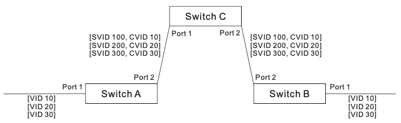
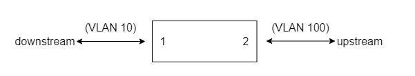

 ### Rev 0.4

# Table of Contents

- [List of Tables](#list-of-tables)
- [Revision](#revision)
- [Scope](#scope)
- [Definitions/Abbreviations](#definitionsabbreviations)
- [Overview](#overview)
  - [VLAN Stacking Deployment Use Cases](#vlan-stacking-deployment-use-cases)
    - [QinQ Use Case](#qinq-use-case)
    - [VLAN Translation Use Case](#vlan-translation-use-case)
- [Architecture Design](#architecture-design)
- [Requirements](#requirements)
  - [Configuration](#configuration)
- [High-Level Design](#high-level-design)
  - [VlanMgr](#vlanmgr)
  - [DB](#db)
    - [CONFIG_DB](#config_db)
    - [APPL_DB](#appl_db)
  - [SAI API](#sai-api)
- [Configuration and management](#configuration-and-management)
  - [CLI/YANG model Enhancements](#cliyang-model-enhancements)
    - [CLI](#cli)
    - [Yang model](#yang-model)
  - [Examples](#examples)
    - [Examples of QinQ Configuration](#examples-of-qinq-configuration)
    - [Examples of VLAN Translation Configuration](#examples-of-vlan-translation-configuration)
- [Warmboot and Fastboot Design Impact](#warmboot-and-fastboot-design-impact)
- [Restrictions/Limitations](#restrictionslimitations)
- [Testing Requirements/Design](#testing-requirementsdesign)
  - [System Test Cases](#system-test-cases)
- [Future Work](#future-work)

# List of Tables

* [Table 1: Revision](#revision)
* [Table 2: Definitions/Abbreviations](#definitionsabbreviations)
* [Table 3: SAI attributes related to VLAN stacking](#sai-api)

# Revision

###### Table 1: Revision

| Rev   |   Date     | Author        | Change Description                 |
|:-----:|:----------:|:-------------:|------------------------------------|
| 0.1   |20-Dec-2021 | Tommy Tseng   | Initial version                    |
| 0.2   |26-Jan-2022 | Tommy Tseng   | Update CLI command                 |
| 0.2   |23-Feb-2022 | Tommy Tseng   | Modify DB schema                   |
| 0.3   |25-Feb-2022 | Yeh Jun-ying  | Update example, Yang model and CLI |
| 0.4   |23-Feb-2022 | Tommy Tseng   | Update Yang model and spec         |
# Scope

This document describes the high level design of VLAN stacking feature.

# Definitions/Abbreviations

###### Table 2: Definitions/Abbreviations

| Abbreviation | Full form              |
|--------------|------------------------|
| VID          | Virtual LAN Identifier |
| S-VLAN       | Service Provider VLAN  |
| C-VLAN       | Customer VLAN          |
| S-TAG        | S-VLAN tag             |
| C-TAG        | C-VLAN tag             |

# Overview

This document describes the design details of the VLAN stacking feature. VLAN stacking is a feature designed for service providers who carry traffic of multiple customers across  their networks and are required to maintain the VLAN and Layer 2 protocol configurations of each customer without impacting the traffic of other customers. VLAN stacking include QinQ feature and VLAN Translation feature.

IEEE 802.1Q tunneling (QinQ tunneling) uses a single Service Provider VLAN (SPVLAN) for customers who have multiple VLANs. Customer VLAN IDs are preserved and traffic from different customers is segregated within the service provider’s network even when they use the same customer-specific VLAN IDs. QinQ tunneling expands VLAN space by using a VLAN-in-VLAN hierarchy, preserving the customer’s original tagged packets, and adding SPVLAN tags to each frame (also called double tagging).

QinQ tunneling uses double tagging to preserve the customer’s VLAN tags on traffic crossing the service provider’s network. However, if any switch in the path crossing the service provider’s network does not support this feature, then the switches directly connected to that device can be configured to swap the customer’s VLAN ID with the service provider’s VLAN ID for upstream traffic, or the service provider’s VLAN ID with the customer’s VLAN ID for downstream traffic.

## VLAN Stacking Deployment Use Cases

### QinQ Use Case

The following example maps C-VLAN 10 to S-VLAN 100, C-VLAN 20 to S-VLAN 200 and C-VLAN 30 to S-VLAN 300 for ingress traffic on port 1 of Switches A and B.

Figure 1. Mapping QinQ Service VLAN to Customer VLAN



### VLAN Translation Use Case

For example, assume that the upstream switch does not support QinQ tunneling. Select Port 1, and set the Old VLAN to 10 and the New VLAN to 100 to map VLAN 10 to VLAN 100 for upstream traffic entering port 1, and VLAN 100 to VLAN 10 for downstream traffic leaving port 1 as shown below.

Figure 2. Configuring VLAN Translation



# Architecture Design

The overall SONiC architecture will not be changed and no new sub-modules will be introduced.

# Requirements

* User **_shall_** be able to configure VLAN stacking on each Ethernet port and and channel port interface.
* A VLAN stacking configuration describes how to determine the service that the specific traffic belongs to and what rewrite action **_will_** be done for the frames. Each configuration include the following:
  * Service - A VLAN ID that the specified traffic **_will_** be applied to. Range 1 ~ 4094.
  * Direction - Traffic direction.
  * Action - The rewrite action for the frames, support the following actions:
    * push
      * Apply for all tagged frames, single or double tagged frames, at ingress direction.
      * Add an outer VLAN with TPID=8100, COS=0, VLAN=<specified-S-VLAN> (range 1 ~ 4094).
      * If the ingress frames (including untagged frames) not match the criteria, the frames **_will_** be forwarded using port VLAN (or call default VLAN, PVID).
    * pop
      * Apply for all tagged frames, single or double tagged frames, at egress direction.
      * Remove outer VLAN.
    * swap
      * Apply for all tagged frames, single or double tagged frames.
      * Replace the outer VLAN ID to <specified-S-VLAN> (range 1 ~ 4094). The TPID and COS are not changed.
      * If the ingress frames not match the criteria,
        * the untagged frames **_will_** be forwarded using port VLAN.
        * the tagged frames (including double tagged frames) **_will_** be forwarded using its outer VLAN.

    The summary of rewrite action support on service interface as shown in the following table:

    | Rewrite | Ingress Direction | Egress Direction |
    |---------|-------------------|------------------|
    | push    | Supported         | Not supported    |
    | pop     | Not supported     | Supported        |
    | swap    | Supported         | Supported        |

* Swap rewrite action **_will_** become invalid if configured (push, swap) at ingress direction or (pop, swap) at egress direction on the specified interface at the same time.
* Only outer TPID 8100 is supported. The frames with TPID = 8100 **_will_** be taken as tagged (single or double) frames.
* For egress direction on channel port, each match criteria **_will_** use one hardware entry per member port.

## Configuration

* It is able to configure VLAN stacking by modifying CONFIG_DB or reload configuration by "config load" CLI command.
* Invalid configuration with **_will_** be ignored and written an error in syslog. E.g., port is not exist.

# High-Level Design

## VlanMgr

VlanMgr is used for check user configuration by DB schema, the VlanStack **_will_** parsing user configuration to SAI attributes and call SAI API.


VlanStack defined in Orch agent is used for all VLAN stacking related operations and keep the user configurations.

* addEntry is used for add a C-VLAN ↔ S-VLAN mapping on the specified interface by user configuration. It function is used for updating the exist mapped, too. The update operation is implemented by remove old and then add new one, so it **_will_** effect the forwarding traffic when an entry be updating.
* removeEntry is used to remove a C-VLAN ↔ S-VLAN mapping on the specified interface.

```c++
struct VlanStack
{
    std::map<VlanStackKey, VlanStackEntry> vlan_stack_map;

    void addEntry(const VlanStackCfg& cfg);
    void deleteEntry(const VlanStackKey& entry_key);
};
```

## DB

### CONFIG_DB

A new table `VLAN_STACKING` is added in Config DB.

```
VLAN_STACKING|{{interface_name}}|{{s_vlanid}}
"c_vlanids":        {{c_vlanids}}
"s_vlan_priority":  {{s_vlan_priority}}
```

```
`interface_name`  Ethernet port and channel port name
`s_vlanid`        Service VLAN ID
                  push VLAN for ingress direction
                  pop (remove) VLAN for egress direction
`c_vlanids`       match VLAN IDs on ingress direction of interface
`s_vlan_priority` VLAN priority of Service VLAN
```

DB schema of VLAN_STACKING table:

```
; Defines schema for VLAN_STACKING configuration attributes
key               = VLAN_STACKING:interface_name:s_vlanid
interface_name    =
s_vlanid          = vlan_id                               ; a number between 1 and 4094
; field           = value
c_vlanids         = vlan_id-or-range[,vlan_id-or-range]*  ; list of VLAN IDs
s_vlan_priority   = %x30-37                               ; a number between 0 and 7

; value annotations
vlan_id           = %x31-39                               ; 1-9
                  / %x31-39 DIGIT                         ; 10-99
                  / %x31-39 2DIGIT                        ; 100-999
                  / "1" 3DIGIT                            ; 1000-1999
                  / "2" 3DIGIT                            ; 2000-2999
                  / "3" 3DIGIT                            ; 3000-3999
                  / "40" DIGIT %x30-34                    ; 4000-4094
range             = vlan_id..vlan_id
```

A new table `VLAN_TRANSLATION` is added in Config DB.

```
VLAN_TRANSLATION|{{interface_name}}|{{s_vlanid}}
"c_vlanid":        {{c_vlanid}}
```

```
`interface_name`  Ethernet port and channel port name
`s_vlanid`        Service VLAN ID,
                   swap c_vlanid to s_vlanid for ingress direction
                   swap s_vlanid to c_vlanid for egress direction
`c_vlanid`        Customer VLAN ID
```

DB schema of VLAN_TRANSLATION table:

```
; Defines schema for  VLAN_TRANSLATION configuration attributes
key               =  VLAN_TRANSLATION:interface_name:s_vlanid
interface_name    =
s_vlanid          = vlan_id            ; a number between 1 and 4094
; field           = value
c_vlanid          = vlan_id            ; a number between 1 and 4094

; value annotations
vlan_id           = %x31-39            ; 1-9
                  / %x31-39 DIGIT      ; 10-99
                  / %x31-39 2DIGIT     ; 100-999
                  / "1" 3DIGIT         ; 1000-1999
                  / "2" 3DIGIT         ; 2000-2999
                  / "3" 3DIGIT         ; 3000-3999
                  / "40" DIGIT %x30-34 ; 4000-4094
```

### APPL_DB

A new table `VLAN_STACKING` is added in APP DB.

```
VLAN_STACKING_TABLE:{{interface-name}}:{{s_vlanid}}
"c_vlanids":        {{c_vlanids}}
"s_vlan_priority":  {{s_vlan_priority}}
```

```json
`interface_name`  Ethernet port and channel port name
`s_vlanid`        Service VLAN ID
                  push VLAN for ingress direction
                  pop (remove) VLAN for egress direction
`c_vlanids`       match VLAN IDs on ingress direction of interface
`s_vlan_priority` VLAN priority of Service VLAN
```

DB schema of VLAN_STACKING table:

```
; Defines schema for VLAN_STACKING configuration attributes
key               = VLAN_STACKING_TABLE:interface_name:s_vlanid
interface_name    =
s_vlanid          = vlan_id                               ; a number between 1 and 4094
; field           = value
c_vlanids         = vlan_id-or-range[,vlan_id-or-range]*  ; list of VLAN IDs
s_vlan_priority   = %x30-37                               ; a number between 0 and 7

; value annotations
vlan_id           = %x31-39                               ; 1-9
                  / %x31-39 DIGIT                         ; 10-99
                  / %x31-39 2DIGIT                        ; 100-999
                  / "1" 3DIGIT                            ; 1000-1999
                  / "2" 3DIGIT                            ; 2000-2999
                  / "3" 3DIGIT                            ; 3000-3999
                  / "40" DIGIT %x30-34                    ; 4000-4094
range             = vlan_id..vlan_id
```

A new table `VLAN_TRANSLATION` is added in APP DB.

```
VLAN_TRANSLATION_TABLE:{{interface_name}}:{{s_vlanid}}
"c_vlanid":        {{c_vlanid}}
```

```json
`interface_name`  Ethernet port and channel port name
`s_vlanid`        Service VLAN ID,
                   swap c_vlanid to s_vlanid for ingress direction
                   swap s_vlanid to c_vlanid for egress direction
`c_vlanid`        Customer VLAN ID
```

DB schema of VLAN_TRANSLATION table:

```
; Defines schema for  VLAN_TRANSLATION configuration attributes
key               =  VLAN_TRANSLATION_TABLE:interface_name:s_vlanid
interface_name    =
s_vlanid          = vlan_id            ; a number between 1 and 4094
; field           = value
c_vlanid          = vlan_id            ; a number between 1 and 4094

; value annotations
vlan_id           = %x31-39            ; 1-9
                  / %x31-39 DIGIT      ; 10-99
                  / %x31-39 2DIGIT     ; 100-999
                  / "1" 3DIGIT         ; 1000-1999
                  / "2" 3DIGIT         ; 2000-2999
                  / "3" 3DIGIT         ; 3000-3999
                  / "40" DIGIT %x30-34 ; 4000-4094
```

## SAI API

Table shown below represents the SAI attributes which **_shall_** be used for VLAN stacking.

###### Table 3: SAI attributes related to VLAN stacking

| VLAN Stacking Component | SAI attribute                                              | Description                     |
| ----------------------- | ---------------------------------------------------------- | ------------------------------- |
| VLAN Stacking entry     | SAI_VLAN_STACK_ATTR_STAGE                                  | VLAN Stack stage                |
|                         | SAI_VLAN_STACK_ATTR_ACTION                                 | VLAN Stack action               |
|                         | SAI_VLAN_STACK_ATTR_MATCH_TYPE                             | VLAN Stack match type           |
|                         | SAI_VLAN_STACK_ATTR_VLAN_APPLIED_PRI                       | COS of the vlan tag             |
|                         | SAI_VLAN_STACK_ATTR_ORIGINAL_VLAN_ID                       | Original Vlan ID                |
|                         | SAI_VLAN_STACK_ATTR_PORT                                   | Port ID                         |
|                         | SAI_VLAN_STACK_ATTR_APPLIED_VLAN_ID                        | Applied Vlan ID                 |


For example, to create a VLAN stacking entry, Ports orchagent invokes the following SAI APIs with the necessary SAI attributes:

```json
"VLAN_STACKING": {
    "Ethernet10|21": {
        "s_vlan_priority": "0",
        "c_vlanids": ["22"]
}
```

```c++
/* Create a ingress VLAN Stacking push entry object:
 * ------------------------------------------ */
sai_object_id_t vlan_stacking_oid;
sai_attribute_t attr;
vector<sai_attribute_t> vlan_stacking_entry_attrs;

attr.id = SAI_VLAN_STACK_ATTR_STAGE;
attr.value.s32 = SAI_VLAN_STACK_STAGE_INGRESS;
vlan_stacking_entry_attrs.push(attr);

attr.id = SAI_VLAN_STACK_ATTR_ACTION;
attr.value.s32 = SAI_VLAN_STACK_ACTION_PUSH
vlan_stacking_entry_attrs.push(attr);

attr.id = SAI_VLAN_STACK_ATTR_MATCH_TYPE;
attr.value.s32 = SAI_VLAN_STACK_MATCH_TYPE_INNER;
vlan_stacking_entry_attrs.push(attr);

attr.id = SAI_VLAN_STACK_ATTR_ORIGINAL_VLAN_ID;
attr.value.u16 = 21;
vlan_stacking_entry_attrs.push(attr);

attr.id = SAI_VLAN_STACK_ATTR_PORT;
attr.value.oid = 10;
vlan_stacking_entry_attrs.push(attr);

attr.id = SAI_VLAN_STACK_ATTR_APPLIED_VLAN_ID;
attr.value.u16 = 22;
vlan_stacking_entry_attrs.push(attr);

attr.id = SAI_VLAN_STACK_ATTR_VLAN_APPLIED_PRI;
attr.value.u8 = 0;
vlan_stacking_entry_attrs.push(attr);

sai_vlan_api->create_vlan_stack(&vlan_stacking_oid, gSwitchId, (uint32_t)vlan_stacking_entry_attrs.size(), vlan_stacking_entry_attrs.data());
```

```c++
/* Create a egress VLAN Stacking pop entry object:
 * ------------------------------------------ */
sai_object_id_t vlan_stacking_oid;
sai_attribute_t attr;
vector<sai_attribute_t> vlan_stacking_entry_attrs;

attr.id = SAI_VLAN_STACK_ATTR_STAGE;
attr.value.s32 = SAI_VLAN_STACK_STAGE_EGRESS;
vlan_stacking_entry_attrs.push(attr);

attr.id = SAI_VLAN_STACK_ATTR_ACTION;
attr.value.s32 = SAI_VLAN_STACK_ACTION_POP
vlan_stacking_entry_attrs.push(attr);

attr.id = SAI_VLAN_STACK_ATTR_MATCH_TYPE;
attr.value.s32 = SAI_VLAN_STACK_MATCH_TYPE_OUTER;
vlan_stacking_entry_attrs.push(attr);

attr.id = SAI_VLAN_STACK_ATTR_ORIGINAL_VLAN_ID;
attr.value.u16 = 22;
vlan_stacking_entry_attrs.push(attr);

attr.id = SAI_VLAN_STACK_ATTR_PORT;
attr.value.oid = 10;
vlan_stacking_entry_attrs.push(attr);

sai_vlan_api->create_vlan_stack(&vlan_stacking_oid, gSwitchId, (uint32_t)vlan_stacking_entry_attrs.size(), vlan_stacking_entry_attrs.data());
```

For example, to create a VLAN translation entry, Ports orchagent invokes the following SAI APIs with the necessary SAI attributes:

```json
"VLAN_TRANSLATION": {
    "Ethernet30|20": {
        "c_vlanid": "10"
} 
```

```c++
/* Create a ingress VLAN Stacking swap entry object:
 * ------------------------------------------ */
sai_object_id_t vlan_stacking_oid;
sai_attribute_t attr;
vector<sai_attribute_t> vlan_stacking_entry_attrs;

attr.id = SAI_VLAN_STACK_ATTR_STAGE;
attr.value.s32 = SAI_VLAN_STACK_STAGE_INGRESS;
vlan_stacking_entry_attrs.push(attr);

attr.id = SAI_VLAN_STACK_ATTR_ACTION;
attr.value.s32 = SAI_VLAN_STACK_ACTION_SWAP
vlan_stacking_entry_attrs.push(attr);

attr.id = SAI_VLAN_STACK_ATTR_MATCH_TYPE;
attr.value.s32 = SAI_VLAN_STACK_MATCH_TYPE_OUTER;
vlan_stacking_entry_attrs.push(attr);

attr.id = SAI_VLAN_STACK_ATTR_ORIGINAL_VLAN_ID;
attr.value.u16 = 10;
vlan_stacking_entry_attrs.push(attr);

attr.id = SAI_VLAN_STACK_ATTR_PORT;
attr.value.oid = 30;
vlan_stacking_entry_attrs.push(attr);

attr.id = SAI_VLAN_STACK_ATTR_APPLIED_VLAN_ID;
attr.value.u16 = 20;
vlan_stacking_entry_attrs.push(attr);

sai_vlan_api->create_vlan_stack(&vlan_stacking_oid, gSwitchId, (uint32_t)vlan_stacking_entry_attrs.size(), vlan_stacking_entry_attrs.data());
```

```c++
/* Create a egress VLAN Stacking swap entry object:
 * ------------------------------------------ */
sai_object_id_t vlan_stacking_oid;
sai_attribute_t attr;
vector<sai_attribute_t> vlan_stack_entry_attrs;

attr.id = SAI_VLAN_STACK_ATTR_STAGE;
attr.value.s32 = SAI_VLAN_STACK_STAGE_EGRESS;
vlan_stacking_entry_attrs.push(attr);

attr.id = SAI_VLAN_STACK_ATTR_ACTION;
attr.value.s32 = SAI_VLAN_STACK_ACTION_SWAP
vlan_stacking_entry_attrs.push(attr);

attr.id = SAI_VLAN_STACK_ATTR_MATCH_TYPE;
attr.value.s32 = SAI_VLAN_STACK_MATCH_TYPE_OUTER;
vlan_stacking_entry_attrs.push(attr);

attr.id = SAI_VLAN_STACK_ATTR_ORIGINAL_VLAN_ID;
attr.value.u16 = 20;
vlan_stacking_entry_attrs.push(attr);

attr.id = SAI_VLAN_STACK_ATTR_PORT;
attr.value.oid = 30;
vlan_stacking_entry_attrs.push(attr);

attr.id = SAI_VLAN_STACK_ATTR_APPLIED_VLAN_ID;
attr.value.u16 = 10;
vlan_stacking_entry_attrs.push(attr);

sai_vlan_api->create_vlan_stack(&vlan_stacking_oid, gSwitchId, (uint32_t)vlan_stacking_entry_attrs.size(), vlan_stacking_entry_attrs.data());
```

# Configuration and management

## CLI/YANG model Enhancements

### CLI

Add VLAN stacking rule on a physical interface or PortChannel

```
config vlan-stacking add <interface_name> <s_vlanid> <c_vlanids> <s_vlan_priority>
  * Append service vlan id with priority for ingress packet when matched customor vlan id.
    Strip service vlan id for egress packet.
  * interface_name  : The name of physical interface or PortChannel, e.g. "Ethernet0" or "PortChannel0001".
  * s_vlanid        : The VLAN ID which will be pushed for ingress direction and popped for egress direction(The range is from 1 to 4094).
  * c_vlanids       : The VLAN ID list which is used to match on ingress direction(The range is from 1 to 4094).
  * s_vlan_priority : The priority of Service VLAN.(The range is from 0 to 7).
```

The format is in the following

```
admin@sonic:~$ sudo config vlan-stacking add -h
Usage: config vlan-stacking add [OPTIONS] <interface_name> <s_vlanid> <c_vlanids> <s_vlan_priority>

  Add vlan stacking rule, examples:
  - config vlan-stacking add Ethernet0 200 100 0
  - config vlan-stacking add Ethernet0 200 100,110-120 1

Options:
  -?, -h, --help  Show this message and exit.
```
Delete VLAN stacking rule from a physical interface or PortChannel

```
config vlan-stacking del <interface_name> <s_vlanid> [<c_vlanids>]
  * interface_name: The name of physical interface or PortChannel, e.g. "Ethernet0" or "PortChannel0001".
  * s_vlanid  : The VLAN ID which will be pushed for ingress direction and popped for egress direction(The range is from 1 to 4094).
  * c_vlanids : The VLAN ID list which is used to match on ingress packet(The range is from 1 to 4094).
```

The format is in the following

```
admin@sonic:~$ sudo config vlan-stacking del -h
Usage: config vlan-stacking del [OPTIONS] <interface_name> <s_vlanid> [<c_vlanids>]

  Delete vlan stacking rule, examples:
  - config vlan-stacking del Ethernet0 200
  - config vlan-stacking del Ethernet0 200 115-120

Options:
  -?, -h, --help  Show this message and exit.
```

Display VLAN stacking rule configuration

```
show vlan-stacking
```
The display format is in the following

```
admin@root:~# show vlan-stacking
Interface    s_vlanid   c_vlanids    s_vlan_priority
-----------  --------  -----------  ----------------
Ethernet0         200          100                 0
Ethernet4         200  100,110-120                 1
```

Add VLAN translation rule on a physical interface or PortChannel

```
config vlan-translation add <interface_name> <s_vlanid> <c_vlanid>
  * Swap the VLAN ID from customer vlan id to service vlan id for ingress direction.
    Swap the VLAN ID from service vlan id to customer vlan id for egress direction.
  * interface_name: The name of physical interface or PortChannel, e.g. "Ethernet0" or "PortChannel0001".
  * s_vlanid : The VLAN ID will be replaced by c_vlanid for egress direction(The range is from 1 to 4094).
  * c_vlanid : The VLAN ID will be replaced by s_vlanid for ingress direction(The range is from 1 to 4094).
```

The format is in the following

```
admin@sonic:~$ sudo config vlan-translation add -h
Usage: config vlan-translation add [OPTIONS] <interface_name> <s_vlanid> <c_vlanid>

  Add vlan stacking rule, examples:
  - config vlan-translation add Ethernet0 200 100

Options:
  -?, -h, --help  Show this message and exit.
```
Delete VLAN translation rule from a physical interface or PortChannel

```
config vlan-translation del <interface_name> <s_vlanid>
  * interface_name: The name of physical interface or PortChannel, e.g. "Ethernet0" or "PortChannel0001".
  * s_vlanid  : The VLAN ID will be replaced by c_vlanid for egress direction(The range is from 1 to 4094).
```

The format is in the following

```
admin@sonic:~$ sudo config vlan-translation del -h
Usage: config vlan-translation del [OPTIONS] <interface_name> <s_vlanid>

  Delete vlan stacking rule, examples:
  - config vlan-stacking del Ethernet0 200

Options:
  -?, -h, --help  Show this message and exit.
```

Display VLAN translation rule configuration

```
show vlan-translation
```
The display format is in the following

```
admin@root:~# show vlan-translation
Interface    s_vlanid  c_vlanid
-----------  --------  --------
Ethernet0         100       200
```

### Yang model

New yang model `sonic-vlan-stacking.yang` is defined to describe VLAN stacking configuration.

```json
module sonic-vlan-stacking {

    yang-version 1.1;

    namespace "http://github.com/Azure/sonic-vlan-stacking";
    prefix vlan-stacking;

    import sonic-extension {
        prefix ext;
    }

    import sonic-port {
        prefix port;
    }

    import sonic-portchannel {
        prefix lag;
    }

    import sonic-vlan {
        prefix vlan;
    }

    description "VLAN Stacking YANG Module for SONiC OS";

    revision 2021-12-15 {
        description "First Revision";
    }

    container sonic-vlan-stacking {
        container VLAN_STACKING {
            description "VLAN_STACKING part of config_db.json";

            list VLAN_STACKING_LIST {
                key "interface_name s_vlanid";

                leaf interface_name {
                    type union {
                        type leafref {
                            path /port:sonic-port/port:PORT/port:PORT_LIST/port:name;
                        }
                        type leafref {
                            path /lag:sonic-portchannel/lag:PORTCHANNEL/lag:PORTCHANNEL_LIST/lag:name;
                        }
                    }
                    description "Interface name";
                }

                leaf s_vlanid {
                    type leafref {
                        path /vlan:sonic-vlan/vlan:VLAN/vlan:VLAN_LIST/vlan:vlanid;
                    }
                    description "Service VLAN ID";
                }

                leaf-list c_vlanids {
                    type union {
                        type leafref {
                            path /vlan:sonic-vlan/vlan:VLAN/vlan:VLAN_LIST/vlan:vlanid;
                        }
                        type string {
                            length 1..10;
                            pattern '[0-9]{1,4}..[0-9]{1,4}';
                        }
                    }
                    description "Customer VLAN ID";
                }

                leaf s_vlan_priority {
                    type uint8 {
                         range 0..7;
                    }
                    description "VLAN priority of Service VLAN";
                }
             }
        }
    }
}
```

New yang model `sonic-vlan-translation.yang` is defined to describe VLAN translation configuration.

```
sonic-vlan-translation {

    yang-version 1.1;

    namespace "http://github.com/Azure/sonic-vlan-translation";
    prefix vlan-translation;

    import sonic-extension {
        prefix ext;
    }

    import sonic-port {
        prefix port;
    }

    import sonic-portchannel {
        prefix lag;
    }

    import sonic-vlan {
        prefix vlan;
    }

    description "VLAN Translation YANG Module for SONiC OS";

    revision 2021-12-15 {
        description "First Revision";
    }

    container sonic-vlan-translation {
        container VLAN_TRANSLATION {
            description "VLAN_TRANSLATION part of config_db.json";

            list VLAN_TRANSLATION_LIST {
                key "interface_name s_vlanid";

                leaf interface_name {
                    type union {
                        type leafref {
                            path /port:sonic-port/port:PORT/port:PORT_LIST/port:name;
                        }
                        type leafref {
                            path /lag:sonic-portchannel/lag:PORTCHANNEL/lag:PORTCHANNEL_LIST/lag:name;
                        }
                    }
                    description "Interface name";
                }

                leaf s_vlanid {
                    type leafref {
                        path /vlan:sonic-vlan/vlan:VLAN/vlan:VLAN_LIST/vlan:vlanid;
                    }
                    description "Service VLAN ID";
                }

                leaf c_vlanid {
                    type leafref {
                        path /vlan:sonic-vlan/vlan:VLAN/vlan:VLAN_LIST/vlan:vlanid;
                    }
                    description "Customer VLAN ID";
                }
            }
        }
    }
}
```

## Examples

### Examples of QinQ Configuration

The following configuration example shows C-VLAN 101, 102, 103 and 150 to S-VLAN 100 with VLAN priority 0 for ingress traffic on Ethernet1. And strips S-VLAN 100 for egress traffic on Ethernet1.

```json
"VLAN_STACKING": {
    "Ethernet1|100": {
        "c_vlanids": ["101..103", "150"],
        "s_vlan_priority": "0"
    }
}
```

For port channel, the following configuration example shows C-VLAN 201, 202, and 203 to S-VLAN with VLAN priority 1 for ingress traffic on PortChannel01. And strips S-VLAN 200 for egress traffic on PortChannel01.

```json
"VLAN_STACKING": {
    "PortChannel01|200": {
        "c_vlanids": ["201..203"],
        "s_vlan_priority": "1"
    }
}
```

### Examples of VLAN Translation Configuration

For example, assume that the upstream switch does not support QinQ tunneling. As the following configuration example, select Ethernet1, and set the Old VLAN to 10 and the New VLAN to 510 to map VLAN 10 to VLAN 510 for upstream traffic entering Ethernet1, and VLAN 510 to VLAN 10 for downstream traffic leaving Ethernet1.

```json
"VLAN_TRANSLATION": {
    "Ethernet1|10": {
        "c_vlanid": "510"
    }
}
```

As the following configuration example for port channel, select PortChannel01, and set the Old VLAN to 20 and the New VLAN to 620 to map VLAN 20 to VLAN 620 for upstream traffic entering PortChannel01, and VLAN 620 to VLAN 20 for downstream traffic leaving PortChannel01.

 ```json
"VLAN_TRANSLATION": {
    "PortChannel01|20": {
        "c_vlanid": "620"
    }
}
```

# Warmboot and Fastboot Design Impact

Not impacted by the changes.

# Restrictions/Limitations

There is no restriction or limitation.

# Testing Requirements/Design

## System Test Cases

* Verify that the max number of VLAN stacking and VLAN translation configuration are able to configure.
* Verify that the configuration is working on only Ethernet and port channel interfaces.
* Verify that the invalid configuration doesn't take effect and an error is logged in syslog. (e.g., the port is not exist)
* Verify the rewrite action **_will_** be done if match C-VLAN,
  * VLAN stacking action for ingress and egress frames on edge interface

  | Frames on edge interface                            | Ingress frames              | Egress frames     |
  | --------------------------------------------------- | --------------------------- | ------------------|
  | untagged                                            | Forward using port VLAN     | N/A               |
  | single tagged (with non-supported TPID, e.g., 9100) | Forward using port VLAN     | noop              |
  | single tagged (not match the mapping)               | Forward using port VLAN     | noop              |
  | double tagged (not match the mapping)               | Forward using port VLAN     | noop              |
  | single tagged (matched the mapping)                 | Add S-VLAN tag              | Remove S-VLAN tag |
  | double tagged (matched the mapping)                 | Add S-VLAN tag (triple tag) | Remove S-VLAN tag |

  * VLAN translation action for ingress and egress frames on edge interface

  | Frames on edge interface                            | Ingress frames               | Egress frames            |
  | --------------------------------------------------- | ---------------------------- | ------------------------ |
  | untagged                                            | Forward using port VLAN      | N/A                      |
  | single tagged (with non-supported TPID, e.g., 9100) | Forward using port VLAN      | noop                     |
  | single tagged (not match the mapping)               | Forward using pkt outer VLAN | noop                     |
  | double tagged (not match the mapping)               | Forward using pkt outer VLAN | noop                     |
  | single tagged (matched the mapping)                 | Replace C-VLAN as S-VLAN     | Replace S-VLAN as C-VLAN |
  | double tagged (matched the mapping)                 | Replace C-VLAN AS S-VLAN     | Replace S-VLAN as C-VLAN |

* Verify that the double frame will be L2/L3 forwarded on any not enable interface (Ethernet and port channel interfaces). Outer TPID = 8100, others **_will_** be drop.
* Verify multiple mappings of different C-VLAN to separate S-VLANs per port. Include the combinations:
  * C-VLAN: One and multiple C-VLANs
  * S-VLAN: One and multiple S-VLANs
  * Interface for C-VLAN and S-VLAN as Ethernet port and channel port.

# Future Work

The values of TPID and COS in the adding outer VLAN are configurable. For example, TPID may be configured as 0x88a8 which is defined in IEEE or other values. For the COS value, it may be able to configure to extract from the COS value of the original VLAN.
 
