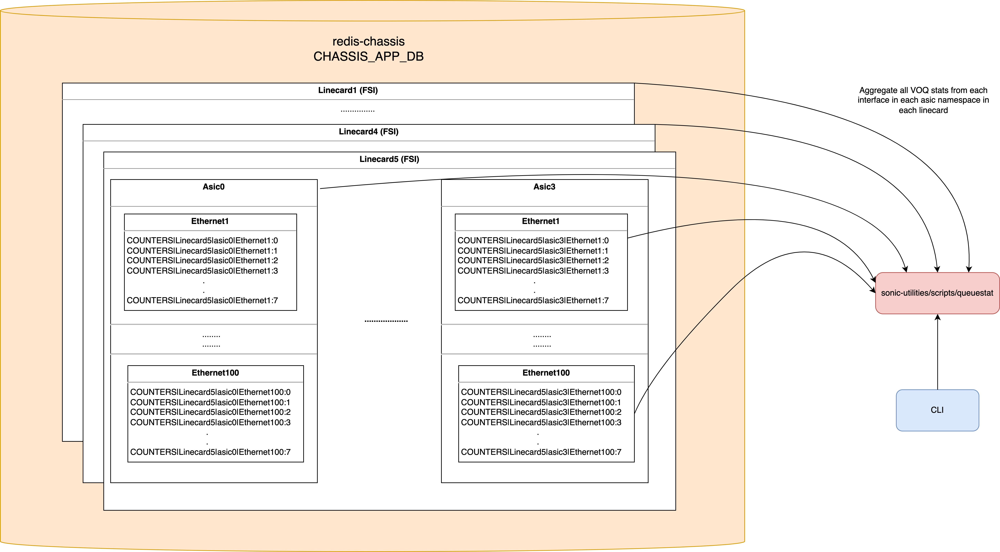

# Aggregate VOQ Counters in SONiC #
#### Rev 1.0

## Table of Content 
   * [Revision](#revision)
   * [Overview](#overview)
   * [Requirements](#requirements)
   * [Architecture Design](#architecture-design)
   * [High-Level Design](#high-level-design)
      * [CHASSIS_APP_DB Changes](#chassis_app_db-changes)
      * [SWSS Changes](#swss-changes)
      * [Repositories that need to be changed](#repositories-that-need-to-be-changed)
   * [SAI API](#sai-api)
   * [Configuration and management](#configuration-and-management)
      * [CLI](#cli)
   * [Restrictions/Limitations](#restrictionslimitations)
   * [Testing Requirements/Design](#testing-requirementsdesign)
      * [System Test cases](#system-test-cases)  

### Revision 
| Rev |     Date    |       Author                                                                       | Change Description                |
|:---:|:-----------:|:----------------------------------------------------------------------------------:|-----------------------------------|
| 1.0 | 11-Jan-2024 | Harsis Yadav, Pandurangan R S, Vivek Kumar Verma (Arista Networks)               | Initial public version            | 

### Overview 

In a [distributed VOQ architecture](https://github.com/sonic-net/SONiC/blob/master/doc/voq/architecture.md) corresponding to each output VOQ present on an ASIC, there are VOQs present on every ASIC in the system. Each ASIC has its own set of VOQ stats maintained in the FSI which needs to be gathered independently and can be hard to visualize, providing a non-cohesive experience.

### Requirements

Provide aggregate VOQ counters in a distributed VOQ architecture.

### Architecture Design 

No new architecture changes are required to SONiC. An instance of SWSS runs for each ASIC on it's respective FSI instance, in a distributed VOQ architecture. SWSS can be used to poll VOQ stats for every ASIC and update CHASSIS_APP_DB which is accessible from every FSI module. 

### High-Level Design

Figure 1: Gathering the VOQ stats in CHASSIS_APP_DB
  
Figure 2: Aggregation of VOQ stats



#### CHASSIS_APP_DB Changes

The following new VOQ counters should be available for each VOQ entry in the DB:
   * `COUNTERS|fsi_id|asic_id|intf@fsi_id|asic_id:VOQ_index`
      * `SAI_VOQ_STAT_PACKETS`
      * `SAI_VOQ_STAT_BYTES`
      * `SAI_VOQ_STAT_DROPPED_PACKETS`
      * `SAI_VOQ_STAT_DROPPED_BYTES`
   * The first part of the key ( before @ ) `fsi_id|asic_id|intf` denotes the physical location of the interface.
   * The second part of the key ( after @ ) `fsi_id|asic_id:VOQ_index` denotes the location of the VOQ and its index.
        
#### SWSS Changes
##### PortsOrch Changes
PortsOrch will periodically poll the VOQ stats through SAI call `get_queue_stats` and update them into `CHASSIS_APP_DB`

#### Repositories that need to be changed
   * sonic-swss-common: https://github.com/sonic-net/sonic-swss-common/pull/855
   * sonic-swss: https://github.com/sonic-net/sonic-swss/pull/3047
   * sonic-utilities: https://github.com/sonic-net/sonic-utilities/pull/3163
   * sonic-mgmt

### SAI API 
No new SAI API is being added. PortsOrch will use the existing SAI API i.e. `get_queue_stats`.

### Configuration and management 
#### CLI
CLI (queuestat.py) aggregates the VOQ stats for a VOQ across ASICS and present a consolidated view. No new CLI command is being introduced for this rather the following CLI command is leveraged to provide this output on an SSI.

$ show VOQ counters [interface] --voq
```
admin@nfc404:~$ show queue counters "nfc404-3|Asic0|Ethernet4" --voq
                    Port    Voq    Counter/pkts    Counter/bytes    Drop/pkts    Drop/bytes
------------------------  -----  --------------  ---------------  -----------  ------------
nfc404-3|Asic0|Ethernet4   VOQ0              45            12386            0             0
nfc404-3|Asic0|Ethernet4   VOQ1               1               50            0             0
nfc404-3|Asic0|Ethernet4   VOQ2             255            12750            0             0
nfc404-3|Asic0|Ethernet4   VOQ3               0                0            0             0
nfc404-3|Asic0|Ethernet4   VOQ4              37             1850            0             0
nfc404-3|Asic0|Ethernet4   VOQ5               0                0            0             0
nfc404-3|Asic0|Ethernet4   VOQ6             172             8600            0             0
nfc404-3|Asic0|Ethernet4   VOQ7               0                0            0             0
```
		


### Restrictions/Limitations  

   * Since this feature doesn't use flex counter, the polling interval is not configurable.
   * The polling can't be disabled permanently as well.

### Testing Requirements/Design  
#### System Test cases
Send traffic across different ASICs and ensure aggregate counters are correctly displayed.
