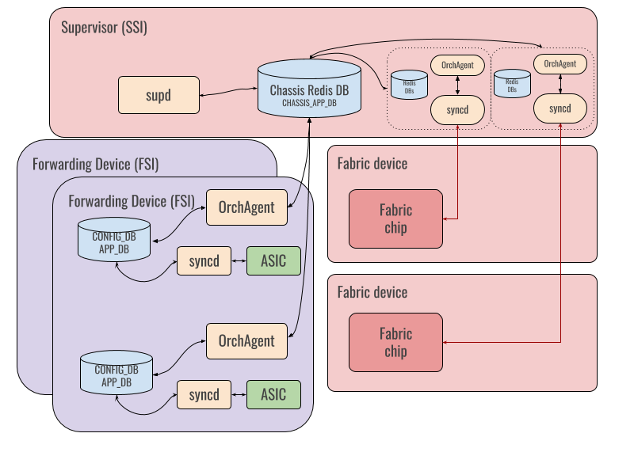
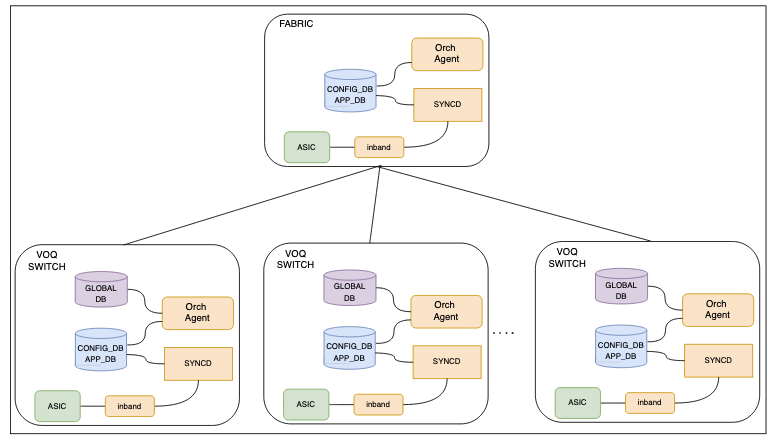

# SONiC Virtual Output Queue (VOQ) Forwarding Architecture

# High Level Design Document
#### Rev 2.1

# Table of Contents
* [List of Tables](#list-of-tables)
* [List of Figures](#list-of-figures)
* [Revision](#revision)
* [About this Manual](#about-this-manual)
* [Scope](#scope)
* [1 Requirements](#1-requirements)
* [2 SAI Support](#2-sai-support)
* [3 Design](#2-design)
* [4 Testing](#3-testing)
* [5 Future Work](#5-future-work)

# List of Tables
* [Table 1: Abbreviations](#definitions-and-abbreviations) 

# List of Figures
* [Figure 1: VoQ Distributed Forwarding Architecture](#23-state-sharing)
* [Figure 2: VoQ Disaggregated Forwarding Architecture](#24-disagg-voq)

###### Revision
| Rev |     Date    |       Author       | Change Description |      
|:---:|:-----------:|:------------------:|--------------------|
| 0.1 | May-19 2020 | Kartik Chandran (Arista Networks) | Initial Version |
| 0.2 | June-22 2020 | Kartik Chandran (Arista Networks) | First set of review comments from public review |
| 1.0 | June-26 2020 | Kartik Chandran (Arista Networks) | Final set of review comments from public review |
| 2.0 | Aug-5 2020 | Kartik Chandran (Arista Networks)   | Revisions after further community review including description of global DB structure, removing sections on system ports, testing and future work to be covered in other documents |
| 2.1 | Sep-17 2020 | Kartik Chandran (Arista Networks)  | Rename Global DB to Chassis DB  |
| 3.0 | Jan-21 2024 | Venkat Garigipati, Thushar Gowda, Manas Kumar Mandal, Tapraj Singh, Praveen Bhagwatula (Cisco Systems)  | Disaggregated VOQ Model |

# About this Manual

This document provides an overview of the implementation of SONiC support for distributed packet forwarding across a set of devices that have a VOQ (Virtual Output Queue) architecture interconnected by a fabric. There are two ways of interconnecting the VOQ devices in the distributed system:

 1. Intra-chassis using an internal fabric device that interconnects the VOQ devices (FSIs) in a modular chassis.
 2. Inter-chassis using an external fabric device that interconnects VOQ devices (like standalone devices) in a disaggregated model.


# Scope

Support for VOQ based forwarding encompasses the following aspects
- Physical interfaces and VOQs
- Logical interfaces such as link aggregation groups (LAGs)
- The interconnection using fabric
- The packet forwarding data plane
- The control plane, both internal (within the devices in the system) and with external devices.

This document covers
- The basic SONiC architecture enhancements to support distributed VOQ based forwarding.
- Representation and management of physical ports across the system.
 
The other aspects listed above are expected to be covered in separate self-contained design proposals that build on this architecture. 

The architecture makes no hard assumptions about how the VOQ devices are interconnected using the fabric. It elaborates on the following two methods in this document

1. Intra-chassis VOQ system in which linecards running SONiC are interconnected over an internal fabric device and the overall system is controlled by a supervisor module that also runs SONiC.

2. Inter-Chassis in which individual VOQ devices running SONiC are interconnected over an external fabric device and the external fabric device also runs its own SONiC instance.


# Definitions and Abbreviations

|      |                    |                                |
|------|--------------------|--------------------------------|
| ASIC | Application Specific Integrated Circuit | Refers to the forwarding engine on a device that is responsible for packet forwarding. 
| NPU  | Network Processing Unit | An alternate term for ASIC often used in SONiC vocabulary
| Forwarding Module | A unit of hardware that runs one instance of the SONiC OS and is responsible for packet forwarding |
| FSI  | Forwarding SONiC Instance |  SONiC OS instance on a forwarding module like a linecard. An FSI controls one more ASICs that are present on the forwarding module
| SSI  | Supervisor SONiC Instance |  SONiC OS instance on a central supervisor module that controls a cluster of forwarding instances and the interconnection fabric.
| TOR  | Top of Rack         | A device running SONiC OS that operates as VOQ forwarding device |


# 1 Requirements

# 1.1 Functional Requirements

## 1.1.1 Distributed Operation - Intra Chassis

Each forwarding module must run an independent SONiC OS instance (called the Forwarding SONiC Instance or FSI) which controls the operation of one or more ASICs on the module, including the front panel and internal fabric ports connected to the ASICs.

* A forwarding module must act as a fully functional router that can run routing protocols and other networking services just like single box SONiC devices. 
* The system of forwarding modules should be managed by a single central Supervisor SONiC instance (SSI) that also manages the internal fabric that interconnects the forwarding modules.

## 1.1.2 Intra-Chassis Control Plane

* Each FSI should be able to connect to other FSIs over the internal fabric in order to be able to run protocols like BGP within the system. 

* This connection must be fate shared with the data path so that a loss of connectivity in the internal fabric is reflected as loss of internal control plane connectivity as well.

## 1.1.3 Intra-Chassis Management Plane

Every FSI must have a management interface over which it can reach the supervisor and the rest of the network outside the system. This network must be completely separate from the internal control plane network described above.

## 1.1.4 Distributed Operation - Inter Chassis

Each device runs a single SONiC instance which controls the operation of its ASIC, including the front panel and fabric ports and operates as a fully functional router that can run routing protocols and other networking services.

# 1.2 Configuration and Management Requirements

* Each SONiC instance must be independently configurable and manageable through standard SONiC management interfaces.
 
* The physical configuration of the entire system is fixed at startup. This includes
  * The Hardware SKU that is used for each forwarding module
  * The Physical port organization of the entire system

* Live replacement of forwarding modules or pluggable modules like transceivers must be supported as long as the part being replaced is an identical SKU.

# 2 SAI Support

Support for VOQ based forwarding in SONiC is dependent on the [SAI VOQ API](https://github.com/opencomputeproject/SAI/blob/master/doc/VoQ/SAI-Proposal-VoQ-Switch.md)

# 3 Design

## 3.1 Design Assumptions - Intra Chassis

In order for the system to function correctly, some state that provides the global view of the system to all the FSIs is necessary. This state is stored in the SSI and all FSIs connect to the SSI over the internal management network to access this state.

### 3.1.1 State Sharing



All state of global interest to the entire system is stored in the SSI in a new Redis instance with a database called "Chassis DB". This instance is accessible over the internal management network. FSIs connect to this instance in addition to their own local Redis instance to access and act on this global state.

###  3.1.2 Chassis DB Organization

The Chassis DB is hosted in a new redis instance called `redis_chassis`. This new redis instance runs in a new container known as `docker-database-chassis`. This ensures both that the global state is isolated from the rest of the databases in the instance and can also be conditionally started only on the SSI.

#### 3.1.2.1 Starting redis_chassis in the SSI

To detect if the `docker-database-chassis` container needs to be started, a new configuration file called `chassisdb.conf` is introduced at `/usr/share/sonic/device/<platform>/chassis.conf`. 
The contents of this file will be 

```
start_chassis_db=1
chassis_db_address=<IP Address of redis_chassis instance>
```

Since this is a per-platform file, the IP address to host the redis instance can be platform specific and the platform implementation is expected to provide connectivity to this IP address for all the sonic instances running within the system.
A new systemd service `config-chassisdb` starts the docker-database-chassis container in the SSI by inspecting the contents of the `chassisdb.conf` file. 

#### 3.1.2.2 Connecting to redis_chassis from FSI

In the FSI, the contents of `/usr/share/sonic/device/<platform>/chassisdb.conf` are

```
chassis_db_address=<IP Address of redis_chassis instance>
```

The `docker-database-chassis` container does not have to start in the FSI. However, the FSIs do need to connect to the `redis_chassis` redis instance that is running in the SSI. To achieve this, the `config-chassisdb` service in the FSI read the contents of `chassisdb.conf` and populate `/etc/hosts` with the IP address for the `redis_chassis.server` host. The per-ASIC database_config.json includes the redis_chassis instance information so that orchagent in FSI can connect to the chassis DB. The server name `redis_chassis.server` is used here to describe the reachability of the redis_chassis redis instance.
```
database_config.json:
    "redis_chassis":{
            "hostname" : "redis_chassis.server",
            "port": 6385,
            "unix_socket_path": "/var/run/redis-chassis/redis_chassis.sock",
            "unix_socket_perm" : 777
    }
    
    "CHASSIS_APP_DB" : {
           "id" : 8,
           "separator": ":",
           "instance" : "redis_chassis"
    }
```
As described earlier, the platform implementation is responsible for providing IP connectivity to the redis_chassis.server throughout the system. For example, this IP address could be in a 127.1/16 subnet so that the traffic is limited to staying within the system. The exact mechanisms for this IP connectivity is outside the scope of this document.

## 3.2 Design Assumptions - Inter System (Disaggregated)

In the inter-chassis system the SONiC VOQ devices connect with each other over the ‘fabric’. Unlike the intra-chassis SONiC model, their is no internal fabric. The fabric ports are externally visible and interconnect multiple devices through cables creating flexible and scalable infrastructure.

The figure below shows a reference topology for the disaggregated VOQ forwarding.



To efficiently route large flows and traffic in the fabric, the architecture leverages a disaggregated network topology consisting of TORs that represent VOQ switches and interconnected using the fabric. Together the VOQ switches and fabric devices in the disaggregated VOQ architecture form a three-tier topology and demonstrated as follows in the context of packet forwarding: first hop from an external device (such as hosts or other network devices) to ingress VOQ switch, second hop between VOQ switch and the fabric, and the third hop from the egress VOQ switch to other external devices. The downlink ports on the VOQ switch connect to the external hosts, and in the uplink side the fabric interconnects all the VOQ switches. Based on the size of the radix and the network needs of typical data-center, the cluster could grow to a multi-tier (multi-hop) architecture.

### 3.2.1 Chassis DB Scope

The disaggregated network architecture differs in the following two ways:

- There is no internal management network and there is no dedicated SSI module.
- All communication between the VOQ devices happen over the inband fabric network.

To ensure backward compatibility with the modular system, the reference architecture for 'Chassis DB', including the contents of the database remains the same as the intra-chassis system. However, every VOQ device runs the docker-database-chassis container and hosts the redis_chassis instance in addition to its own local redis instance. The Chassis DB is locally scoped: this means that orchagents running on remote SONiC devices will not have access to the local 'Chassis DB’. The 'Chassis DB' does not run on fabric devices.

### 3.2.2 Chassis DB Initialization

To start docker-database-chassis, the chassidb.conf file must be hosted on every VOQ device. To achieve this, the config-chassisdb service on the VOQ device reads the contents of chassisdb.conf and populates /etc/hosts with the IP address for the redis_chassis.server. The chassisdb.conf resides in the platform path '/usr/share/sonic/device/<platform>/chassisdb.conf' on every VOQ device and contains the ip address of the local host (127.0.0.1).

```
start_chassis_db=1
chassis_db_address=<IP Address of the local host - 127.0.0.1>
```

### 3.2.3 State Sharing - disaggregated systems

The local ip address that is associated with the redis_chassis.server is used for binding to the redis_chassis instance and the local orchagent connects to the local chassis DB hosted on this instance for updating the state information of the local interfaces. The method of updating inband network connectivity and remote device states between VOQ devices over the fabric is outside the scope of this document.

Given the chassis DB is locally owned and maintained by each VOQ device, the DB's of different devices may be out-of-sync with each other. Ensuring these DBs are in sync with each other is also out-of-scope of this document.


## 3.3 Chip Management

There are two kinds of chips that are of interest 

### 3.3.1 Forwarding ASIC

The ASIC (also referred to as NPU in SONiC terminology) performs all the packet reception, forwarding, queueing and transmission functions in the system. 

### 3.3.2 Fabric Chip

The internal fabric that interconnects forwarding engines is made up of multiple fabric chips that are responsible for moving packets from the source to destination forwarding engine.

ASICs are connected to fabric chips over internal links that terminate on fabric ports at each end. 

Fabric chips do not play any role in packet forwarding and do not need to be explicitly configured once initialized. All subsequent interactions with fabric chips are for monitoring only. 

All chips are managed based on the existing Multi-ASIC paradigm in SONiC, in which there is one instance of syncd (and SAI), swss and other related agents per chip. 

## 3.4 Switch Numbering

* Each chip in the system (ASIC and Fabric Chip) is given a global ID called a Switch ID.
* Each chip consumes C consecutive switch IDs, where C is the number of switching cores.
* Each core on a chip has a core ID between 0 and C.

Please see the SAI VoQ spec for more detailed examples.

## 3.5 SONiC Instance and ASIC Naming

## 3.5.1 Distributed Model

### Forwarding SONiC Instance

Each FSI has a globally unique name that represents that SONiC OS instance. In a modular chassis, the name would conventionally be "Linecard-N", where N is the slot in which the linecard is inserted.

### ASIC Name

In addition, each ASIC has an ASIC Name. The ASIC Name is no different from that used to identify an ASIC in any multi-chip SONiC device, except that it is globally unique across all forwarding modules in the entire system. When applied to a chassis the name is conventionally chosen as "Linecard-N.K", where K is an ASIC number within the linecard.

The ASIC Name is used as a qualifier in global database keys to create a system wide unique key. It is also used as an identifier the group of software components that are instantiated to manage each ASIC on the system (containers like syncd, OrchAgent etc.)


## 3.6 Port Management

There are four types of ports that need to be managed

### 3.6.1 Local Ports

These are front panel interfaces that are directly attached to each FSI. They are modeled and represented in SONiC exactly as they are with existing fixed configuration devices.

### 3.6.2 System Ports

Every port on the system requires a global representation in addition to its existing local representation. This is known as a System Port (AKA sysport). Every system port is assigned an identifier that is globally unique called a system_port_id. In addition, every port is assigned a local port ID within a core called a “Core Port Id”. The scope of the Local Port Id is _within_ a core of a forwarding engine.

### 3.6.3 Inband Ports

Inband ports are required to provide control plane connectivity between  forwarding engines. They are connected to the forwarding module local CPU on one side and the internal fabric on the other. 

Every inband port is assigned a System Port ID just like front panel ports which is known to all the forwarding modules. Thus, every inband port is reachable from every forwarding engine.

### 3.6.4 Fabric Ports

The provisioning and management of Fabric ports is outside the scope of this document and will be documented as a separate proposal.

The details regarding the schemas, Orch agent logic changes and flows are described in more specific documents

## 3.7 Failure Scenarios

### 3.7.1 Intra Chassis

#### 3.7.1.1 FSI Failures

If an FSI fails due to an OS issue or if the hardware is removed from service, then the expected behavior outcome is

- The Chassis DB connection is torn down
- Internal control plane connectivity to that LSI is broken which triggers topology recovergence to avoid use of any forwarding paths through that LSI.

#### 3.7.1.2 Loss of connectivity from working FSI to Chassis DB

Loss of connectivity to the Chassis DB can prevent forwarding state from other FSIs from being propagated. To avoid traffic impact, The FSI must take defensive action to disconnect from the outside world (for example by ceasing protocol sessions) with neighbors to avoid any traffic flows through the FSI.

#### 3.7.1.3 SSI Device or OS failure

Failure of the SSI at the very least results in loss of connectivity to the Chassis DB and the actions described in 2.7.2 take place on all FSIs leading to the entire system being disconnected from the outside world.


### 3.7.2 Inter Chassis - Disaggregted System

In a well-designed network, there are multiple parallel paths between any pair of forwarding devices. The network should be resilient to individual link failures.

#### 3.7.1.2 Fabric Failure

The SONiC devices operating in VOQ should typically have multiple paths to reach any destination through different fabric SONiC devices. In case of failure of one fabric switch, traffic should re-route through alternative fabric devices. However, this could typically lead to over-subscription of few links. This is a design consideration.

#### 3.7.1.3 Forwarding Device Failure

Each forwarding capable SONiC device operates indepdently of the other SONiC device and hosts the Chassis DB locally. On recovery, the device should regain full topology after network convergence.

# 4 Testing

## 4.1 Distributed Model - Intra Chassis
Test coverage for the distributed VoQ architecture is achieved by extending the existing virtual switch based SWSS pytest infrastructure.

The distributed switching architecture is represented as multiple VS instances connected with each other and called as Virtual Chassis, where one of the instance plays the role of the SSI and the remaining instances as FSIs.  Existing SWSS pytests can be executed against any of the instances in the virtual chassis to ensure that existing SONiC functionality is not affected while operating in a distributed environment.

More detailed test cases are covered in other HLDs.

## 4.2 Disaggregated model - Inter Chassis

The disaggregated model is represented by multiple VS instances, connected with each other where one or more fabric instances connect multiple forwarding cable devices. Existing test coverage for distributed switching model is extended to ensure validation of SONiC functionality.

# 5 Future Work

## 5.1 Dynamic System Ports

Dynamic system port support is required to support the following forwarding scenarios

* Addition of a new forwarding module into an existing running system
* Replacing a forwarding module with another module of a different hardware SKU (such as replacing a linecard with a new linecard of a different SKU in a chassis slot).

Both these scenarios can be supported smoothly as long as the global system port numbering scheme is maintained and the modifications to system ports can be performed without impacting the System Port IDs of the running system.

Support for dynamic system ports requires SAI support for the `create_port` and `remove_port` calls. 

## 5.2 Dual Supervisor Support

Dual supervisor modules are a common feature in chassis based systems where one supervisor acts as the active and the other as a standby. The presence of the standby supervisor allows the system
to continue functioning without manual intervention in case of a hard failure (such as a hardware failure) on the active supervisor by transferring control to the standby.

The standby supervisor has its own console, internal and external management IP address.

There are typically two forms of redundancy

### Warm Standby

In this mode, the standby supervisor has booted into the OS and is waiting to take over. No configuration or operational status is known. When a switchover occurs, the processing is very similar to what happens after a fresh boot of a supervisor. 

Warm standby can be supported in SWSS as follows

- Gracefully handle the loss of connectivity to the SSI and terminate OrchAgent, syncd and all related containers
- Modify the Redis database address that the FSI needs to connect to
- Start all the containers which will now connect to the standby Chassis DB and continue operation.

### Hot Standby

In the hot standby mode, the standby supervisor has the control plane running in standby mode, such that it can take over with minimal (or no) disruption to the forwarding module

At a high level, hot standby mode requires

- Starting the Chassis DB on standby SSI in standby mode where it mirrors the active Chassis DB.
- Live sync of Chassis DB state between active and standby Chassis DB.
- Graceful handling in OrchAgent of loss of connectivity to SSI and continuing to operate autonomously.
- Reconnecting to Chassis DB when Standby SSI is ready.
- Reconciling relevant Chassis DB state with SAI Asic DB state and modifying SAI state as appropriate to be in sync with Chassis DB.
