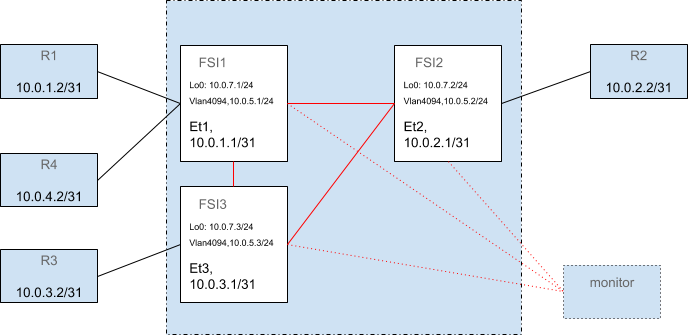

# BGP Setup for VoQ Chassis
# High Level Design Document

### Rev 1.1

# Table of Contents
* [Revision](#revision)
* [About this Manual](#about-this-manual)
* [Scope](#scope)
* [1 Requirements](#1-requirements)
* [2 Design](#2-design)
  * [2.1 BGP Setup](#21-bgp-setup)
  * [2.2 iBGP Configuration](#22-ibgp-configuration)
  * [2.3 FRR Changes](#23-frr-changes)
  * [2.4 CONFIG_DB Changes](#24-config_db-changes)
  * [2.5 FRR Configuration Templates](#25-frr-configuration-templates)
  * [2.6 Mingraph Changes](#26-minigraph-changes)
* [3 Testing](#3-testing)

# Revision
| Rev |     Date    |       Author       | Change Description |
|:---:|:-----------:|:------------------:|--------------------|
| 1 | Sep-10 2020 | Joanne Mikkelson (Arista Networks) | Initial Version |
| 1.1 | Sep-22 2020 | Joanne Mikkelson (Arista Networks) | Update for review comments |
| 1.1.1 | Feb-10 2021 | Joanne Mikkelson (Arista Networks) | Link to VOQ HLD mention of host routes used for iBGP-learned nexthop resolution |

# About this Manual

This document describes how BGP will be configured on a VoQ chassis.

# Scope

The configuration described here is intended to ensure that routes programmed
for BGP-learned prefixes are the same for each ASIC Instance in a VoQ chassis.

This document describes:
- BGP configuration changes
- Changes to Minigraph and CONFIG_DB
- FRR configuration templates

# 1 Requirements

Traffic ingressing on any ASIC Instance should be routed the same, regardless of which
ASIC Instances learned the route from their eBGP peers.

In other words, the set of nexthops chosen for a given route should be the same
on each ASIC Instance.  When traffic is forwarded over an ECMP route, which
nexthop used for a given flow may be different than what another ASIC Instance
would have chosen.  Making this forwading decision match is not required for a
VoQ chassis because the decision is made only once, at the ingress ASIC, unlike
an ethernet clos based chassis, where each ASIC Instance makes the forwarding
decision as the packet moves through the chassis and a forwarding loop could
result if ASIC Instances choose each other from an ECMP nexthop.

To achieve matching ECMP nexthops on each ASIC Instance:
- All external routers are expected to be eBGP peers (no iBGP).
- Each ASIC Instance must advertise eBGP-learned routes to the other ASIC Instances in the chassis.
- When advertising routes to other ASIC Instances, the eBGP-learned nexthop and AS_PATH must be preserved.  Because the forwarding decision is performed at ingress, all the ASIC Instances need the original nexthop; if AS_PATH prepending is performed, routes that would otherwise be equal-cost for the chassis would have a longer path and would not form ECMP with routes learned from the local ASIC Instance's eBGP peers.
- When equal-cost routes are learned by any ASIC Instance, all ASIC Instances should compute the same ECMP nexthop.

# 2 Design

## 2.1 BGP Setup

All ASIC Instances in the chassis are members of the same AS.  All routes learned from
all neighboring eBGP routers must be learned on all ASIC Instances.  To accomplish this,
an iBGP full mesh will be established between all ASIC Instances, with the additional
paths feature enabled for neighbors in the mesh.
In the mesh, there will be a single session between each peer, carrying both
IPv4 and IPv6 routes.

There may also be an iBGP route monitor in the network.  SONiC already supports
configuring such a route monitor.  For a VoQ chassis, this route monitor
must be configured to peer with each ASIC Instance; otherwise it will not be
participating in the iBGP mesh and would not learn all the routes.

The following diagram shows the BGP sessions associated with three ASIC Instances in the
chassis, each with one or two eBGP peers.  The red lines are the new iBGP mesh.



## 2.2 iBGP Configuration

Routers will automatically advertise routes learned from eBGP peers to iBGP
peers, with the nexthop unchanged.  We rely on the global neighbor table to
provide routes for each neighboring router to all ASIC Instances so that the nexthops are
recursively resolvable.  For example, a route readvertised from ASIC1 with a
nexthop of 10.0.1.2 would be recursively resolvable on ASIC2 over the
10.0.1.2/32 route created from the global neighbor table. (For more discussion
on the creation of these host routes and how the recursively-resolved
nexthops contribute to forwarding, see the
[VOQ HLD](https://github.com/sonic-net/SONiC/blob/master/doc/voq/voq_hld.md#251-inband-recycle-port-option).)

The BGP sessions between ASIC Instances use IPv4.  To get IPv6 routes
distributed to all ASIC Instances, each iBGP peer will also be activated in
the ipv6 unicast address family.

To ensure that each ASIC Instance computes the same ECMP group:
- Enable “additional-path send all” for each chassis iBGP peer.  If ASIC1 learns a route from both R1 and R4, both must be advertised to other ASIC Instances.  Otherwise, ASIC1 would be able to create an ECMP nexthop {R1,R4} but the other ASIC Instances would have a single nexthop (whichever of R1 and R4 is best at ASIC1).
- Allow BGP to form ECMP groups with paths learned from both eBGP and iBGP peers.  The best path algorithm normally prefers eBGP paths (RFC 4271 section 9.1.2.2 step d).  Without this change, if a route is learned from R1, R2, and R4, ASIC1 would create ECMP group {R1,R4}, ASIC2 would use {R2}, and ASIC3 would use {R1,R2,R4}.
- For an ECMP group with both eBGP- and iBGP-learned nexthops, allow all resolvable nexthops to be written to the FIB.  Because the best path is eBGP, by default BGP requires nexthops in the RIB to be reachable over connected routes in order to be written to the FIB.  The iBGP-learned nexthops are not reachable over connected routes and would be discarded from the FIB, resulting in different forwarding on different ASIC Instances.  Previous proposals turned off this requirement globally by configuration but the current plan is to automatically disable it for mixed-type ECMP groups on a per-route basis.
- The maximum ECMP group size must be set the same for eBGP and iBGP.  If 8 equal-cost paths were learned by ASIC1 and the eBGP maximum-paths size were 10 but the iBGP maximum-paths size were 5, ASIC1 would create a 8-way ECMP group but the other ASIC Instances would only create 5-way ECMP groups, even though all 8 paths are learned by all ASIC Instances.  This would not use the full capacity for traffic ingressing at ASIC2 and ASIC3.

The FRR BGP configuration for these changes is:
- `neighbor <neighbor> addpath-tx-all-paths`
- `bgp bestpath peer-type multipath-relax`
- `maximum-paths ibgp <n>` (where <n> is the same as used in `maximum-paths <n>`)

Note that if more equal-cost paths are learned for a given route than the
maximum ECMP group size, each ASIC Instance may still choose a different subset of paths
to program.

## 2.3 FRR Changes

The second configuration mentioned above, “bgp bestpath peer-type
multipath-relax”, does not currently exist in FRR and will be added as part of
this proposal.  This is named to mirror the “bgp bestpath as-path
multipath-relax” configuration.

Configuring this will allow paths from different peer types to form an ECMP
group.  The best path algorithm is not changed otherwise, such that if a route
has both eBGP and iBGP paths in the ECMP group, an eBGP path will still be the
best path.  This route will be the one advertised to eBGP peers, as would be
the case without enabling the new configuration.  While the VoQ chassis system
requires the eBGP and iBGP maximum-paths size to be set the same, if they were
not, the eBGP size would be used for a mixed-type ECMP group, because the best
path is guaranteed to be eBGP.

Once a mixed-type BGP ECMP group is created, it is published to the RIB.  When
the BGP best path is an eBGP path (and is not from an ebgp-multihop
neighbor), BGP disallows recursive resolution when writing RIB nexthops into
the FIB.  Allowing recursive resolution globally by configuration with `bgp
disable-ebgp-connected-route-check` works but has a negative side effect: this
configuration also controls what happens during the first nexthop resolution
performed, when determining if a BGP path is valid.  Disabling the eBGP
connected route check would therefore allow eBGP peers to use nexthops that
require recursive resolution where paths with these nexthops would otherwise
not be considered usable.

To resolve this, when “bgp bestpath peer-type multipath-relax” is configured,
recursive resolution will be reenabled for nexthops in the RIB if an
iBGP-learned nexthop is included in the group.  If an eBGP peer sends a nexthop
that requires recursive resolution, paths using that nexthop would be
considered invalid and not be placed in the ECMP group.  Hence they will not
be present in the RIB and obviously will not be in the FIB regardless of
whether recursive resolution has been reenabled for RIB nexthops.

## 2.4 CONFIG_DB Changes

CONFIG_DB currently contains three tables specifying BGP neighbors:
BGP_NEIGHBOR for typical router peers (R1 etc. in the diagram), BGP_MONITORS
for route monitor(s), and BGP_PEER_RANGE for dynamic peers.  A fourth table
will be added, BGP_VOQ_CHASSIS_NEIGHBOR, to include the ASIC Instance neighbors in the
iBGP mesh.  Entries in this table will use the same schema as BGP_NEIGHBOR.

This new table will allow the most natural use of the FRR configuration system,
where the database table dictates which templates are used to generate the FRR
configuration.

## 2.5 FRR Configuration Templates

BGP neighbors included in CONFIG_DB are translated from Jinja templates into
FRR configuration by a script running in the bgp docker called “bgpcfgd”.

Using the `general` templates used for BGP_NEIGHBOR peers would require adding
new peer groups to the general templates and a number of if-statements based on
some attribute of the BGP_NEIGHBOR entry.

Instead, entries in the BGP_VOQ_CHASSIS_NEIGHBOR table will use a new set of
`voq_chassis` templates rather than the `general` ones.  These templates will
include new peer-groups to encapsulate the neighbor configuration, as well as
the necessary instance-wide configuration (the second and third configuration changes described
earlier).

## 2.6 Mingraph Changes

The script that converts the minigraph into CONFIG_DB entries will be modified
to place the VoQ chassis peers in the new BGP_VOQ_CHASSIS_NEIGHBOR table.  The
minigraph must be changed to indicate which peers should be in the new table
instead of the BGP_NEIGHBOR table.

We propose a new optional element in the BGPSession element that indicates
whether this is a VoQ chassis session.
```
      <BGPSession>
        <StartRouter>OCPSCH0104001MS</StartRouter>
        <StartPeer>10.10.1.18</StartPeer>
        <EndRouter>OCPSCH01040EELF</EndRouter>
        <EndPeer>10.10.1.17</EndPeer>
	<VoQChassisInternal>true</VoQChassisInternal>
      </BGPSession>
```

## 2.7 CLI

On a multi-asic system, some config and show commands distinguish between
external and internal neighbors. These commands should maintain the same
distinction for neighbors in the VoQ chassis. These commands will classify
peers in the BGP_VOQ_CHASSIS_NEIGHBOR table in CONFIG_DB as internal.

A new option will be added to these “all” commands to include the internal
neighbors as well:
- `bgp shutdown all`: “In the case of Multi-Asic platform, we shut only the EBGP sessions with external neighbors.”
- `bgp startup all`: “In the case of Multi-Asic platform, we startup only the EBGP sessions with external neighbors.”

Similarly, the default will display only the external peers for the VoQ
chassis and “-d all” will include internal peers:
- `show ip(v6) bgp summary`: “if display option is 'frontend', internal bgp neighbors will not be displayed”

This command does not need to be changed, but the implementation will need
to consult the BGP_VOQ_CHASSIS_NEIGHBOR table as well:
- `bgp remove neighbor`: “User can specify either internal or external BGP neighbor to remove”

If multi-asic changes to filter out internal peers from `show ip bgp neighbors`
are added, the VoQ chassis version should also do the same.

# 3 Testing

A new swss test using the virtual chassis topology will confirm that the newly
added FRR configuration controls whether or not otherwise equal-cost eBGP and
iBGP paths are included in the same ECMP group. It will also check that
iBGP-learned recursively resolved nexthops are not excluded from the FIB. The
test will also ensure that for an all-eBGP ECMP group, nexthops that are not
connected routes are still excluded from the FIB.

The bgpcfgd tests will be augmented with new `voq_chassis` data files to ensure
that the proper configuration is created for BGP_VOQ_CHASSIS_NEIGHBOR entries.

A test case with VoQChassisInternal entries in the minigraph will be added to
the sonic-config-engine test_cfggen.py test.
