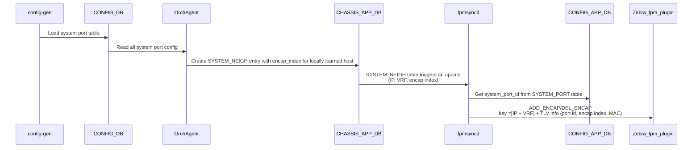
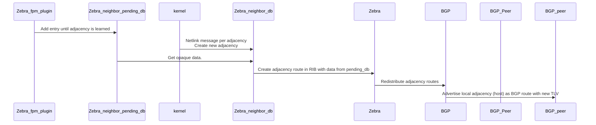
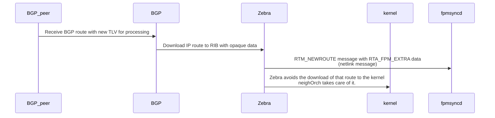
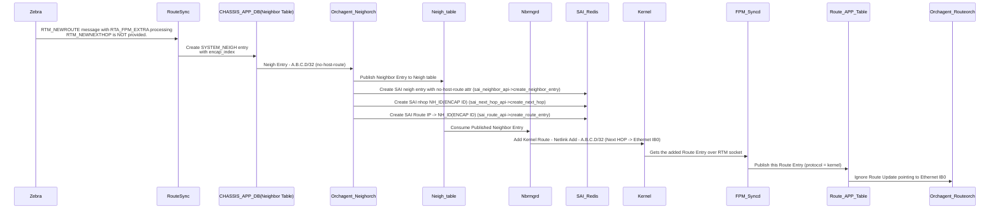

# Dynamic host learning in a Virtual Output Queue (VOQ) Architecture

# High Level Design Document

Rev 0.1

# Table of Contents

- [Revision](#Revision)
- [About this Manual](#About-this-Manual)
- [Scope](#Scope)
- [Definition/Abbreviation](#Definition/Abbreviation)
- [1 Feature Overview](#1-Feature-Overview)
  - [1.1 Requirements](#11-Requirements)
    - [1.1.1 Functional Requirements](#111-Functional-Requirements)
    - [1.1.2 Configuration and Management Requirements](#112-Configuration-and-Management-Requirements)
    - [1.1.3 Platform Requirements](#113-Platform-Requirements)
    - [1.1.4 Scalability Requirements](#114-Scalability-Requirements)
  - [1.2 Design Overview](#12-Design-Overview)
    - [1.2.1 BGP Tunnel Encapsulation](#121-BGP-Tunnel-Encap)
    - [1.2.2 Container](#122-Container)
    - [1.2.3 SAI Overview](#123-SAI-Overview)
  - [2.1 Target Deployment Use Cases](#21-Target-Deployment-Use-Cases)
  - [2.2 Functional Description](#22-Functional-Description)
    - [2.2.1 Feature Configuration](#221-Feature-Configuration)
- [3 Design](#3-Design)
  - [3.1 Overview](#31-Overview)
  - [3.2 FRR Extension](#32-FRR-Extensions)
  - [3.3 FRR, SONIC Interaction](#33-FRR-SONIC-Interaction)
  - [3.4 SONiC Extension](#34-SONIC-Extensions)
- [4 Flow Diagrams](#4-Flow-Diagrams)
- [5 Error Handling](#5-Error-Handling)
- [6 Serviceability and Debug](#6-Serviceability-and-Debug)
- [7 Unit Test](#9-Unit-Test)
  - [7.1 Functional Test Cases](#91-Functional-Test-Cases)

# List of Tables

[Table 1: Abbreviations](#Table-1-abbreviations)

# Revision

| Rev  | Date       | Authors                                          | Change Description |
| ---- | ---------  | ------------------------------------------------ | ------------------ |
| 0.x  | Jul-2024   | Patrice Brissette, Venkat Garigipati, Mark Stapp, Manas Kumar Mandal | Cisco initial draft  |

<a id="About-this-Manual"></a>
# About this Manual
This document provides general information of the implemenation of Dynamic host learning in a VOQ architecure in SONiC.

<a id="Scope"></a>
# Scope
This document describes the high level design and changes required for supporting dynamic host learning in a VOQ architecture. This documents
extends https://github.com/sonic-net/SONiC/blob/master/doc/voq/voq_hld.md. 

<a id="Definition/Abbreviation"></a>
# Definition/Abbreviation

## Table 1: Abbreviations

| Term         | Meaning                                   |
| ------------ | ----------------------------------------- |
| Ingress node | Node where the packet encapsulation is performed using fabric header information received form BGP |
| Egress node  | Node where packets are decapsulated and forwarded based on the incoming fabric header |
| VOQ          | Virtual Output Queue                      |

<a id="1-Feature-Overview"></a>
# 1 Feature Overview

<a id="11-Requirements"></a>
## 1.1 Requirements

<a id="111-Functional-Requirements"></a>
### 1.1.1 Functional Requirements

The following are functional requirements:

 - Dynamically learn locally connected peers.
 - Redistribute routes with VOQ information to enable forwarding on remote devices.


<a id="112-Configuration-and-Management-Requirements"></a>
### 1.1.2 Configuration and Management Requirements
The following are configuration and management requirements:

1. All of the configurations and show outputs should be available through SONiC yang - REST, gNMI.
2. All of the configurations and show outputs should be available through FRR-vtysh.

<a id="113-Platform-Requirements"></a>
### 1.1.3 Platform requirements
Support of the basic VOQ architecture. No new requirements are required.

<a id="114-Scalability-Requirements"></a>
### 1.1.4 Scalability Requirements
The following are targeted scale numbers:

| Metric                     | Scale  |
|:---------------------------|:-------|
| Connected hosts            | 16k    |
| TOR devices per fabric     | 8      |

<a id="12-Design-Overview"></a>
## 1.2 Design Overview

Dynamic host learning extension leverages well-known BGP technics described in [RFC9012](https://datatracker.ietf.org/doc/rfc9012/).

VOQ architecture does not use any usual encapsulation such as VxLAN, MPLS, IP, etc. Packets being transmitted on ingress device are encapsulated using a Fabric Header. That fabric header is usually ASIC specific. However, within SONiC community, the VOQ based architecture is common and enhanced by all contributors.

The packet format looks like:
```
+--------------------+
|    Fabric header   |
+--------------------+
|    IP Payload      |
+--------------------+
```

The Fabric header information must be transmitted from egress node to ingress node for each locally learned neighbor.
A standard way of redistributing host information is with BGP.

Basically, local neighbors are learned using standard ARP/ND procedure. Local adjacencies are advertised in BGP along with a BGP tunnel Encap attribute. Ingress node receives IP routes along with the Fabric header information.
BGP downloads the route to RIB and FIB. Routes gets installed with Fabric header information allowing VOQ-based architecture to work properly.


<a id="121-BGP-Tunnel-Encap"></a>
## 1.2.1 BGP Tunnel Encapsulation

A new BGP Encapsulation Tunnel type called: Fabric Tunnel (Type X) is proposed to accommodate different header data from various vendor ASIC's.

Currently, a specific layout is not possible until various vendor ASICs handle a common header; vendors must agree on its format.
As per [RFC9012](https://datatracker.ietf.org/doc/rfc9012/), the Tunnel Encapsulation attribute is an optional transitive BGP path attribute.
IANA has assigned the value 23 as the type code of the attribute in the "BGP Path Attributes" registry.
```

   0                   1                   2                   3
   0 1 2 3 4 5 6 7 8 9 0 1 2 3 4 5 6 7 8 9 0 1 2 3 4 5 6 7 8 9 0 1
  +-+-+-+-+-+-+-+-+-+-+-+-+-+-+-+-+-+-+-+-+-+-+-+-+-+-+-+-+-+-+-+-+
  |    Tunnel Type (2 octets)     |        Length (2 octets)      |
  +-+-+-+-+-+-+-+-+-+-+-+-+-+-+-+-+-+-+-+-+-+-+-+-+-+-+-+-+-+-+-+-+
  |                                                               |
  |                        Value (variable)                       |
  |                                                               |
  +-+-+-+-+-+-+-+-+-+-+-+-+-+-+-+-+-+-+-+-+-+-+-+-+-+-+-+-+-+-+-+-+
```
OR with the usage of sub-TLV.
```
   0                   1                   2                   3
   0 1 2 3 4 5 6 7 8 9 0 1 2 3 4 5 6 7 8 9 0 1 2 3 4 5 6 7 8 9 0 1
  +-+-+-+-+-+-+-+-+-+-+-+-+-+-+-+-+-+-+-+-+-+-+-+-+-+-+-+-+-+-+-+-+
  |    Tunnel Type (2 octets)     |        Length (2 octets)      |
  +-+-+-+-+-+-+-+-+-+-+-+-+-+-+-+-+-+-+-+-+-+-+-+-+-+-+-+-+-+-+-+-+
  |  Sub-TLV Type | Sub-TLV Length|         Value (variable)      |
  +-+-+-+-+-+-+-+-+-+-+-+-+-+-+-+-+-+-+-+-+-+-+-+-+-+-+-+-+-+-+-+-+
  |                        Value (variable)                       |
  |                                                               |
  +-+-+-+-+-+-+-+-+-+-+-+-+-+-+-+-+-+-+-+-+-+-+-+-+-+-+-+-+-+-+-+-+
```
__Figure x: Tunnel Encapsulation TLV__
A new tunnel type is allocated for Fabric tunnels. That new value will be assigned by IANA

When the tunnel type is Fabric, the variable value is an opaque data. The associated length is based on
the amount of octets of the opaque value.

Opaque data is proposed to accomodate vendor specific header requests for satisfying their ASIC requirements.
Currently, a specific layout is not possible until various ASICs process a common header.

For Cisco, the layout is as follow:
The length of the sub-TLV is 8 octets. The structure of the Value
field in the Encapsulation sub-TLV is shown here.
```
   0                   1                   2                   3
   0 1 2 3 4 5 6 7 8 9 0 1 2 3 4 5 6 7 8 9 0 1 2 3 4 5 6 7 8 9 0 1
  +-+-+-+-+-+-+-+-+-+-+-+-+-+-+-+-+-+-+-+-+-+-+-+-+-+-+-+-+-+-+-+-+
  |                 System-port ID (4 octets)                     |
  +-+-+-+-+-+-+-+-+-+-+-+-+-+-+-+-+-+-+-+-+-+-+-+-+-+-+-+-+-+-+-+-+
  |                 Neighbor Encap index (4 octets)               |
  +-+-+-+-+-+-+-+-+-+-+-+-+-+-+-+-+-+-+-+-+-+-+-+-+-+-+-+-+-+-+-+-+
```
__Figure x: Fabric Tunnel Encapsulation Sub-TLV Value Field__

Notice that the values are transmitted in network order. End devices must properly
 translate them into host order for processing.

<a id="122-Container"></a>
### 1.2.2 Container Overview
No new container is added by this feature.

<a id="123-SAI-Overview"></a>
### 1.2.3 SAI Overview
No new objects is added by this feature.

<a id="2-Functionality"></a>
# 2 Functionality

<a id="22-Functional-Description"></a>
## 2.2 Functional Description

<a id="221-Feature-Configuration"></a>
### 2.2.1 Feature Configuration

Required configuration to enable this feature is as part of FRR.
The following shows the basic configuration of FRR:

As part of bgp, two CLi knob are used:
1. "send-extra-data" is an existing CLI allows BGP to send extra opaque data to Zebra.
2. "redistribute adjacency" is a new CLI used to advertise adjacency route to BGP.

```
bgp
  send-extra-data zebra ## existing CLI being reuse

  address-family ipv4 unicast
    redistribute adjacency ## new CLI
  exit-address-family

  address-family ipv4 unicast
    redistribute adjacency ## new CLI
  exit-address-family

```
In zebra, a new CLI is added per interface to enable the learning of adjacency route.
```
interface <ifname>
  adjacency-route-enable
'''

<a id="3-Design"></a>
# 3 Design

<a id="31-Overview"></a>
## 3.1 Overview


<a id="32-FRR-Extensions"></a>
## 3.2 FRR Extensions

FRR is extended to support this feature.

BGP is updated as follow:
- A new route type is added to zebra: adjacency route

- BGP advertisement of neighbor entries using IPv4 and/or IPv6 unicast address-family.

- A new BGP tunnel encapsulation attribute is created to carry required fabric header information enabling the forwarding per host.
- New BGP tunnel encapsulation attribute is added IPv4/IPv6 unicast, EVPN RT-5, etc.

- BGP show command displays only RAW data from TLV (opaque serie of bytes)
- BGP show command enhancement required to display pretty meaningful information instead of raw information

- New configuration knob added to bgpd
    "redistribute adjacency" similarly as "redistribute connected"

Zebra is updated as follow:

- Add local neighbor entries to Zebra (RIB) using the new route type: adjacency route.
  This is copying adjacencies from vanilla neighbor DB learning from kernel to Zebra.
  The new type is to ensure neighbors are not leaked out easily to other protocol like iGP.
  The local neighbor are present only when they are removed from the vanilla neighbor DB.
  At that point of time, they are withdrawn from BGP.

- Zebra neighbor vanilla DB (keys are VRF + Ifindex + IP)
- Enhance show output to display tunnel encapsulation attibute data properly

- A new "neighbor pending" DB is created (Keys are: vrf, ip address)
  It is holding tunnel encapsulation data coming from SONiC per local neighbor
  Useful when zebra_fpm provides new tunnel encap data for unknown-to-zebra host. Basically, it allows for race condition.
  When a local neighbor is learned in neighbor DB, it is copied to zebra with the tunnel encap data from the pending DB.

  Race conditions to handle are:
  1- fpm msg first (Vrf + IP) - ADD_ENCAP / DELETE_ENCAP
      Walk neighbor DB to find specific entry. FACTOR N (scale ?!)
  2- neighbor first
      Perform direct lookup in pending DB  (Quick!)

- A new show to display pending entries is created #show ip neighbor pending

- New config knob added to Zebra:
    interface <foo> adjacency-route-enable
  The interface submode is present for any type of interfaces
  CLI is required to avoid huge set of local adjacencies advertised in BGP

Finally, a new test CLI to manage pending entries is added. This allows FRR to have its own topotest and guarantee the functionality provided here.

The new added test cli to manage pending entries is:
```
       (test_encap_params_cmd,
       "[no] ip neigh encap VRFNAME$vrf_name <A.B.C.D|X:X::X:X>$addr ![port (1-9999)$port index (1-9999)$index]",
       NO_STR
       IP_STR
       "Neighbors\n"
       "Configure encap parameters\n"
       "VRF name\n"
       "Neighbor IPv4 address\n"
       "Neighbor IPv6 address\n"
       "Encap port\n"
       "Encap port number\n"
       "Encap index\n"
       "Encap index number\n")
```

<a id="33-FRR-SONIC-Interaction"></a>
## 3.3 FRR, SONiC Interaction

The FRR/Zebra communication with SONiC is extended with new message types. The extension is mainly around fpm.

1. Zebra has now the capability to request tunnel encap data from SONiC using newly added GETENCAP() message. The message is a trigger to tell SONiC to send all fabric headet related DB entries.

2. Zebra downloads remote routes with remote tunnel encap data to SONiC. A new route TLV is added: RTA_FPM_EXTRA.
The new TLV contains opaque data TLV to carry raw data from Zebra to fpmsyncd. The lenght is 8 octets. It carries
system-port-id and neighbor encap index. RTA_FPM_EXTRA goes along with the route download using RTM_NEW_ROUTE (kernel_netlink.h, zebra_netlink.c).

3. SONiC provides tunnel encap data with two new message types: ADDENCAP and DELENCAP.
On FRR side, the fpm plugin is running in the dataplane so the dataplane pthread.
Zebra runs in main pthread. A new mechanism is added to exchange the information between them.


<a id="34-SONIC-Extensions"></a>
## 3.4 SONiC Extensions

The extensions is separated in two pieces:
- the egress node advertising tunnel encapsulation data per locally learned host to remote node
- the ingress node receiving remote data and programs accordingly its dataplane from remote node

On the egress device, the following is required:

  1. SONiC must provide ADD_ENCAP / DELETE_ENCAP message to Zebra when new locally learned neighbor appears in CHASSIS_APP_DB system_neighbor table.
  Based on that trigger, fpmsyncd builds the new message update to Zebra. It gets the system-port-id from CONFIG_APP_DB system_port table per host.

  Note: system_port string to system_port key is cached in redis by fpmsyncd (local cache / process cache). It is highly useful for any message coming from Zebra where the information is coming only a string.

  2. SONiC must response to any GET_ENCAP query from Zebra. fpmsyncd walks over neighbors in system_neighbor table and reply back all locally learned neighbor to Zebra using ADD_ENCAP / DELETE_ENCAP messages.


On Ingress device (where the forwarding chain is setup based on BGP download), the following is required:

1. Upon reception of RTM_NEW_ROUTE, data from RTA_FPM_EXTRA is uploaded in CHASSIS_APP_DB system_neighbor table
2. Based VOQ design is triggered. neighborch gets notified and creates neighbor entry with tunnel encap attributes in ASIC DB.
3. SAI gets updated with SAI_OBJECT_neighbor_entry with NEXTHOP equals to recycling port.

Note: There is no need to upload the System port id in CONFIG_APP_DB. Relevant information is there by default.


<a id="4-Flow-Diagrams"></a>
# 4 Flow Diagram

This feature has implication on both egress and ingress nodes.
On Egress node, host are dynamically learned. Their reachability are advertised within BGP along with fabric tunnel encapsulation data.
The first two diagrams demonstrates how SONiC and FRR provide that functionality.


__Figure x: SONiC Tunnel Encapsulation data generation__


__Figure x: FRR local host advertisement__


On ingress node, remote host reachability information is received from BGP. Host routes are incoming with corresponding tunnel encapsulation data.
FRR programs SONiC in the same way IP is done. SONiC follows the VOQ based design. The next two callflows demonstrate their behaviors.


__Figure x: FRR remote host processing__



__Figure x: SONiC Remote Route Processing__


Note: Zebra does not provide route download to the kernel; SONiC NeighOrch is responsible to do so in the VOQ architecture.


<a id="5-Error-Handling"></a>
# 5 Error Handling
No explicit error handling requirement introduced due to this feature.

<a id="6-Serviceability-and-Debug"></a>
# 6 Serviceability and Debug
Existing serviceability and debug applicable to this feature. No new debugging commands are added.

<a id="7-Unit-Test"></a>
# 9 Unit Test

<a id="71-Functional-Test-Cases"></a>

## 7.1 Functional Test Cases

### 7.1.1 Configuration tests

1. Enable adjacency-route-enable under the local interface where adjacency is learned.
2. Verify the adjacency is learned in the FRR neighbor DB and added to Zebra.
3. Unconfigure adjacency-route-enable under the local interface.
4. Verify the adjacency is removed from Zebra and FRR neighbor DB.


### 7.1.2 Egress node tests

1. Ping local interface from connected adjacency. Verify the adjacency is learned in the FRR neighbor DB.
2. Verify the adjacency is added as adjacency route in Zebra with proper tunnel encapsulation data.
3. Verify BGP advertise an IPv4/IPv6 unicast with corresponding Tunnel Encap attributes.

### 7.1.2 Ingress node tests

1. Ping local interface from connected adjacency on remote node.
2. Verify the reception of a BGP IPv4/IPv6 unicast route for that adjacency.
3. Verify the route is coming with Tunnel Encapsulation attribute
4. Verify the route is imported into Zebra with Tunnel Encapsulation data
5. Verify the route is downloaded to fpmsyncd.
6. Verify CHASSIS_APP_DB is updated properly.
7. Verify the forwarding chain is properly built

