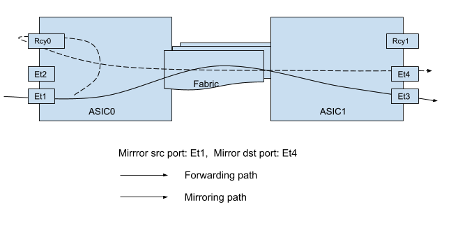

# Everflow support on VOQ Chassis

# High Level Design Document
#### Rev 1

# Table of Contents
* [List of Tables](#list-of-tables)
* [List of Figures](#list-of-figures)
* [Revision](#revision)
* [About this Manual](#about-this-manual)
* [Scope](#scope)
* [Definitions/Abbreviations](#definitionsabbreviations)
* [1 Requirements](#1-requirements)
* [2 Design](#2-design)
* [3 Testing](#3-testing)
* [4 Future Work](#4-future-work)

# List of Tables
* [Table 1: Abbreviations](#definitionsabbreviations)

# List of Figures

# Revision
| Rev |     Date    |       Author       | Change Description |      
|:---:|:-----------:|:------------------:|--------------------|
| 1 | Dec-1 2020 | Song Yuan, Eswaran Baskaran (Arista Networks) | Initial Version |

# About this Manual

This document provides an overview of the SONiC support for everflow configuration in a VOQ-based chassis. In a VOQ-based chassis, the everflow configuration is applied on a linecard and the mirror destination could be in a different linecard. We propose a solution where the packet is rewritten with the GRE header in the ingress linecard before it’s sent over to the mirror destination. 

# Scope

This document builds on top of the VOQ chassis architecture discussed [here](https://github.com/sonic-net/SONiC/blob/master/doc/voq/architecture.md) and the Everflow design discussed [here](https://github.com/sonic-net/SONiC/wiki/Everflow-High-Level-Design#3138-mirror-api). The goal of this document is to describe the configuration and design for everflow mirroring sessions for a VOQ-based chassis.

# Definitions/Abbreviations

|      |                    |                                |
|------|--------------------|--------------------------------|
| FSI | Forwarding SONiC Instance | SONiC OS instance on a linecard module that controls one or more forwarding ASICs. |
| ASIC | Application Specific Integrated Circuit | Refers to the forwarding engine on a device that is responsible for packet forwarding. |
| ERSPAN | Encapsulated Remote Switched Port ANalyzer | Another name for Everflow mirroring sessions |

# 1 Requirements

In a VOQ based chassis, the mirror source and destination ports could be on different linecards. This configuration must be accepted and the packet that goes out of the destination port must have the correct encapsulation header based on the configuration.

# 2 Design

## 2.1 Problem

In a regular non-VOQ switch, given the destination IP of the mirror session, mirrororch is responsible for determining the outgoing interface and the destination MAC address by querying routeorch and neighorch. Once these details are determined, mirrororch makes the SAI create_mirror_session API call to create the mirror session. For example, the destination port is set in `SAI_MIRROR_SESSION_ATTR_MONITOR_PORT`, the destination mac for the packet is set in `SAI_MIRROR_SESSION_ATTR_DST_MAC_ADDRESS` and so on.

In addition, mirrororch is also responsible for reacting to changes in the route or nexthop and update the session by making appropriate SAI update calls.

In a VOQ chassis, the monitor port could be on another linecard and packet rewrite is done in the egress pipeline of that linecard. As the ports of other linecards are only represented as SYSTEM_PORTs in each FSI, we need either changes in SAI or changes in SONiC to support everflow.

### 2.1.1 Proposal

The idea is to fully rewrite the packet in the ingress chip and send it out of a recycle port in the ingress ASIC. After the recycle, the packet goes to the egress ASIC where the packet gets switched out of the mirror destination port.

The mechanism to enable the recycle port is outside the scope of this document.

## 2.2 Option 1 - Implicit Recycle

This option can be implemented with minimal changes to SONiC because the bulk of the handling is done inside SAI. The SAI implementation can be enhanced to accept SYSTEM_PORTs as arguments for the `SAI_MIRROR_SESSION_ATTR_MONITOR_PORT` attribute. When a mirror session is created with a destination IP, mirrororch resolves the IP using routeorch and neighorch as before. The following changes are proposed for the VOQ chassis.
Upon receiving mirrororch’s request for a remote neighbor’s information, neighorch must be able to return neighbor information like interface alias.
If the neighbor information returned from neighorch turns out to be a remote neighbor, mirrororch needs to use the SYSTEM_PORT of the remote interface as the mirror destination port.

SAI implementation will program the hardware to send the mirrored packets in this session out of the recycle port. When the packet re-enters the pipeline, the destination MAC of this packet will be the neighbor’s destination MAC address and it will be bridged in the ingress ASIC to the correct egress destination port. SAI will also be responsible for programming the FDB entry in the ingress ASIC appropriately.

We don't recommend to recycle mirrored packets when the mirror destination port is a local port because we gain nothing from bridging the mirrored package again that would be forwarded locally.

## 2.3 Option 2 - Explicit Recycle

This option can be implemented with minimal changes to SAI as long as a recycle port can be created. The recycle port needs to be enabled as an L3 port for this mechanism to work because it requires the packet to be routed after recycle. The following changes are proposed.
Upon receiving mirrororch’s request for a remote neighbor’s information, neighorch must be able to return neighbor information like interface alias.
If the neighbor information returned from neighorch turns out to be a remote neighbor, mirrororch needs to use the recycle port as the mirror destination port and the router mac as the destination MAC address.

SAI implementation is the same as a single-chip system. The mirrored packets are rewritten in the ingress ASIC and sent out of the recycle port. When the packet re-enters the pipeline, it gets routed because the destination MAC is the router MAC. The destination IP of this packet is the destination IP configured on the mirror session, so it will be routed by the ingress ASIC. If the destination IP is reachable via multiple nexthops, the ingress ASIC will loadbalance the traffic as needed.

When the mirror destination port is a local port, it's recommended to recycle mirror packets too for the following reasons:

- The implementation of mirrororch is simplified because both remote and local mirror destination ports are handled in the same way.
- The mirrored packets can be load-balanced if the mirror destination IP is reachable via multiple nexthops.

# 3 Testing
TBD

# 4 Future Work
TBD
